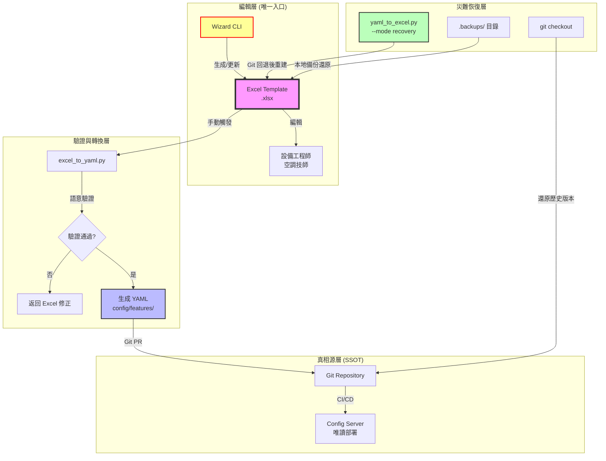

# PRD v1.2: 特徵標註系統規範 (Feature Annotation Specification)

**文件版本:** v1.2 (Excel-Centric Editor with Synchronized SSOT)  
**日期:** 2026-02-13  
**負責人:** Oscar Chang  
**目標:** 建立以 Excel 為唯一編輯入口的特徵定義系統，透過嚴格的單向流程避免競態條件，並提供完整的版本控制與遷移機制  
**相依模組:** Cleaner v2.2+, BatchProcessor v1.3+, Feature Engineer v1.3+  
**預估工時:** 6 ~ 7 個工程天（含 Wizard 重構、版本控制、遷移工具）

---

## 1. 執行總綱與設計哲學

### 1.1 核心目標與架構原則

1. **Excel 唯一編輯原則**: Excel 檔案 (`.xlsx`) 是**唯一**允許人工編輯的介面，YAML 僅為機器讀取的 SSOT，禁止直接修改
2. **單向同步流程**: 所有變更必須遵循 `Excel → YAML → Git` 的單向路徑，禁止任何工具（包括 Wizard）直接寫入 YAML
3. **靜態驗證策略**: Excel 僅提供基礎格式與靜態選單，所有業務邏輯驗證（如單位相容性）移至 Python 轉換層執行
4. **競態條件防護**: 透過時間戳檢查與版本鎖定，防止 Excel 與 YAML 不同步導致的設定覆蓋
5. **設備角色感知**: 透過 `device_role` 標記區分主設備與備用設備，抑制備用設備的統計誤報
6. **災難恢復就緒**: 建立 Git 真相源與本地備份雙重防護，確保誤刪操作可回退

### 1.2 嚴格流程架構（關鍵修正）



**關鍵約束**：
- 🔴 **Wizard 禁止直接寫入 YAML**（解決 v1.1 競態條件）
- 🔴 **禁止直接修改 YAML 檔案**（所有變更必須透過 Excel）
- 🟢 **Git 作為最終真相源**（YAML 進 Git，Excel 不進 Git）
- 🟡 **逆向同步 (yaml_to_excel) 僅用於初始化與災難恢復**，不可作為常態編輯流程
- 🟡 **本地備份保留最近 10 個版本**（Wizard 自動管理）

---

## 2. 文件架構與版本控制

### 2.1 目錄結構（更新）

```
config/features/                    # SSOT 目錄（唯讀部署，Git 管控）
├── schema.json                     # JSON Schema 驗證
├── base.yaml                       # 基礎定義
├── physical_types.yaml             # 物理類型規範
└── sites/                          # 案場定義（僅由 Excel 生成，必須進 Git）
    ├── cgmh_ty.yaml
    └── kmuh.yaml

tools/features/                     # 編輯工具
├── templates/                      # Excel 範本（版本控制）
│   ├── Feature_Template_v1.2.xlsx  # 當前版本
│   └── Feature_Template_v1.1.xlsx  # 舊版（供遷移）
├── wizard.py                       # Wizard CLI（僅更新 Excel，含自動備份）
├── excel_to_yaml.py                # 轉換器（含驗證）
├── yaml_to_excel.py                # 逆向轉換（僅初始化/災難恢復）
└── migrate_excel.py                # 範本升級工具

data/features/                      # 使用者編輯區（Gitignored）
├── cgmh_ty/
│   ├── cgmh_ty.xlsx               # 工作檔案（唯一編輯入口，不進 Git）
│   ├── .backups/                  # 自動備份目錄（保留最近 10 個版本）
│   │   ├── cgmh_ty.backup.20260213_143022.xlsx
│   │   ├── cgmh_ty.backup.20260213_120015.xlsx
│   │   └── ...
│   └── cgmh_ty.yaml               # 生成檔（禁止手動編輯，不進 Git）
└── kmuh/
    └── kmuh.xlsx
```

### 2.2 Git 真相源管理策略（Git as SSOT Policy）

**核心原則**：YAML 為唯一真相源，Excel 為本地工作檔案。

| 檔案類型 | Git 管理 | 說明 |
|---------|---------|------|
| `.yaml` (sites/) | **納入版本控制** | 所有生成的 YAML 必須進入 Git，作為部署與回退的唯一依據 |
| `.xlsx` | **Gitignored** | Excel 為二進位格式，不納入 Git。工程師間透過「YAML → yaml_to_excel」重建 |
| `.xlsx.backup.*` | **本地保留** | Wizard 自動生成的備份，保留最近 10 個版本，不進 Git |
| `Feature_Template_*.xlsx` | **納入版本控制** | 範本檔案需版本化，確保不同工程師使用相同結構 |

**`.gitignore` 範例**（放置於專案根目錄）：
```gitignore
# Excel 工作檔案（由 YAML 生成或 Wizard 建立）
data/features/**/*.xlsx
data/features/**/*.xlsx.backup.*
data/features/**/.backups/

# 臨時檔案
*.tmp
*.xlsx~
*.yaml.tmp
__pycache__/
```

**分支策略建議**：
- `main`: 僅包含通過驗證的 YAML，代表生產環境配置
- `feature/annotation-{site_id}`: 新增案場或修改特徵時的工作分支
- 禁止直接推送 `.xlsx` 檔案，CI/CD 會檢查是否誤將二進位檔案納入版本控制

### 2.3 Excel 範本版本控制機制（新增）

**問題**: 當 PRD 更新（如新增欄位），舊版 Excel 範本可能產生結構錯誤的 YAML。

**解決方案**:
1. **Hidden Sheet `System`** 儲存版本資訊：
   - `A1` (template_version): "1.2"
   - `A2` (schema_hash): "sha256:abc123..."
   - `A3` (last_generated_by): "wizard_v1.2"
   - `A4` (yaml_last_sync_timestamp): "2026-02-13T10:00:00"

2. **轉換時強制檢查**:
   ```python
   # excel_to_yaml.py
   EXPECTED_TEMPLATE_VERSION = "1.2"
   
   def validate_template_version(wb: Workbook):
       system_sheet = wb['System']
       version = system_sheet['B1'].value
       if version != EXPECTED_TEMPLATE_VERSION:
           raise CompatibilityError(
               f"Excel 範本版本過舊 (v{version})，請執行:\n"
               f"  python migrate_excel.py --from {version} --to {EXPECTED_TEMPLATE_VERSION} "
               f"  --input your_file.xlsx"
           )
   ```

3. **遷移工具 (migrate_excel.py)**:
   - 自動將 v1.1 範本升級至 v1.2（新增欄位、調整公式）
   - 保留既有資料，僅更新結構

---

## 3. Excel 範本結構（靜態驗證版）

### 3.1 Sheet 1: Columns（主要編輯區）

**設計變更**: 放棄動態下拉 (`INDIRECT`)，改用**靜態分群選單** + **Python 層驗證**。

| 欄位名稱 (A) | 物理類型 (B) | 單位 (C) | 設備角色 (D) | 是否目標 (E) | 啟用 Lag (F) | Lag 間隔 (G) | 忽略警告 (H) | 描述 (I) | 狀態 (J) |
|:---:|:---:|:---:|:---:|:---:|:---:|:---:|:---:|:---:|:---:|
| chiller_1_temp | temperature | °C | primary | FALSE | TRUE | 1,4,96 | - | 一號機溫度 | confirmed |
| chiller_2_temp | temperature | °C | backup | FALSE | TRUE | 1,4 | W403 | 二號機溫度(備用) | confirmed |
| total_power_kw | power | kW | - | TRUE | FALSE | - | - | 總耗電 | confirmed |

**欄位規格與防呆**:

**A. 欄位名稱 (Column Name)**
- **驗證**: 必填，必須與 CSV 欄位名稱**完全匹配**（含大小寫）
- **格式**: 文字，無特殊字元限制，但建議使用英文底線命名

**B. 物理類型 (Physical Type)**
- **輸入**: 靜態下拉選單（值來自 `physical_types.yaml` 的 keys）
- **選項**: `temperature`, `pressure`, `flow_rate`, `power`, `chiller_load`, `status`, `gauge`
- **變更**: 當此欄變更時，**不**自動連動 C 欄（避免 INDIRECT 脆弱性）

**C. 單位 (Unit)**
- **輸入**: 靜態長選單（包含所有物理類型的所有單位，分群顯示）
- **選項範例**:
  ```
  [溫度類] °C, °F, K
  [壓力類] bar, psi, kPa, MPa
  [流量類] LPM, GPM, m³/h
  [功率類] kW, W, RT, HP
  ```
- **驗證**: 由 `excel_to_yaml.py` 檢查與 B 欄的相容性（非 Excel 層）

**D. 設備角色 (Device Role)**（新增）
- **輸入**: 下拉選單 (`primary`, `backup`, `seasonal`)
- **預設**: `primary`
- **影響**: 
  - `backup`: 抑制 W403 (高零值比例) 警告
  - `seasonal`: 抑制 W401 (均值異常) 警告（季節性設備可能長期停機）

**E. 是否目標 (Is Target)**
- **輸入**: 勾選框 (TRUE/FALSE)
- **連動**: 當設為 TRUE 時，F 欄 (`啟用 Lag`) 自動設為 FALSE 並**鎖定編輯**（Excel 條件格式灰化）

**F. 啟用 Lag (Enable Lag)**
- **輸入**: 勾選框
- **驗證**: 若 E 欄為 TRUE，此欄強制為 FALSE

**G. Lag 間隔 (Lag Intervals)**
- **輸入**: 文字格式，逗號分隔數字（如 `1,4,96`）
- **驗證**: Python 層檢查為正整數且遞增

**H. 忽略警告 (Ignore Warnings)**（新增）
- **輸入**: 多選下拉（`W401`, `W402`, `W403`, `-`）
- **格式**: 逗號分隔（如 `W401,W403`）
- **用途**: 允許領域專家顯式標記「此欄位允許特定統計異常」

**I. 描述 (Description)**
- **輸入**: 自由文字，建議填寫設備位置或用途

**J. 狀態 (Status)**
- **輸入**: 下拉選單 (`pending_review`, `confirmed`, `deprecated`)
- **Wizard 生成**: 新欄位預設為 `pending_review`

### 3.2 Sheet 2: Group Policies（群組策略）

簡化語法，無需 Regex：

| 策略名稱 | 匹配類型 | 匹配值 | 物理類型 | 預設樣板 | 自定義 Lag |
|:---:|:---:|:---:|:---:|:---:|:---:|
| chillers | prefix | chiller_ | chiller_load | Standard_Chiller | - |
| towers | prefix | ct_ | temperature | Standard_Tower | 1,8 |
| custom_pumps | contains | pump | flow_rate | Custom | 1,4,12 |

**欄位規格**:

- **匹配類型**: `prefix`（前綴）, `suffix`（後綴）, `contains`（包含）, `regex`（進階）
- **預設樣板**: 下拉選單 (`Standard_Chiller`, `Standard_Tower`, `High_Freq`, `Custom`)
  - 選擇預設樣板時，「自定義 Lag」欄位鎖定
  - 選擇 `Custom` 時，可手動輸入 Lag 間隔

### 3.3 Sheet 3: Metadata（文件資訊）

| 屬性 | 值 | 說明 |
|:---|:---|:---|
| schema_version | 1.2 | 文件格式版本 |
| template_version | 1.2 | Excel 範本版本（系統檢查用） |
| site_id | cgmh_ty | 案場識別 |
| inherit | base | 繼承來源 |
| description | 長庚醫院... | 文件描述 |
| editor | 王工程師 | 編輯者 |
| last_updated | 2026-02-13 | 最後更新（自動生成） |
| yaml_checksum | sha256:... | 對應 YAML 的雜湊（同步檢查用） |

**系統欄位（Hidden Sheet `System`）**:
- `A1`: template_version
- `A2`: schema_hash
- `A3`: last_generated_by
- `A4`: yaml_last_sync_timestamp

---

## 4. YAML Schema 詳細規範（SSOT 層）

### 4.1 頂層結構（更新）

```yaml
schema_version: "1.2"              # 文件格式版本
description: "長庚醫院特徵定義"
inherit: "base"

meta:                              # 文件元資料
  site_id: "cgmh_ty"
  editor: "王工程師"
  last_updated: "2026-02-13T10:00:00"
  source_excel: "cgmh_ty.xlsx"     # 來源 Excel 檔名
  excel_checksum: "sha256:def456..." # Excel 檔案雜湊（同步驗證用）
  template_version: "1.2"          # 生成時的範本版本

physical_types:                    # 可覆蓋 SSOT
  [physical_type_id]: PhysicalTypeDefinition

columns:
  [column_name]: ColumnAnnotation

group_policies:
  [policy_name]: GroupPolicyRule

validation:
  strict_mode: true
  allow_unannotated: false
  enable_distribution_check: true
```

### 4.2 Column Annotation（更新）

```yaml
columns:
  chiller_1_temp:
    column_name: "chiller_1_temp"
    physical_type: "temperature"
    unit: "°C"
    device_role: "primary"         # 新增：設備角色
    description: "一號冰機溫度"
    is_target: false
    enable_lag: true
    enable_rolling: true
    lag_intervals: [1, 4, 96]
    rolling_windows: [4, 96]
    tags: ["critical"]
    ignore_warnings: []            # 新增：忽略的警告列表
    status: "confirmed"
    
  chiller_2_temp:
    column_name: "chiller_2_temp"
    physical_type: "temperature"
    unit: "°C"
    device_role: "backup"          # 備用設備
    description: "二號機溫度(備用)"
    is_target: false
    enable_lag: true
    lag_intervals: [1, 4]
    ignore_warnings: ["W403"]      # 抑制高零值警告
    status: "confirmed"
```

### 4.3 Physical Type 定義（含統計參數）

```yaml
physical_types:
  temperature:
    description: "溫度感測器"
    unit: "°C"
    si_unit: "celsius"
    valid_range: [-40.0, 100.0]
    agg_method: "mean"
    distribution_check:            # 統計驗證參數
      expected_mean_range: [10, 35]
      max_std_threshold: 50
      zero_ratio_warning: 0.1      # 10% 零值觸發警告
      zero_ratio_critical: 0.5     # 50% 零值觸發錯誤（即使 backup 也檢查）
```

---

## 5. 三層防護與驗證機制（更新）

### 5.1 第一層：Excel 靜態防呆

**移除**：動態下拉 (`INDIRECT`)  
**保留**：
- 靜態下拉選單（物理類型、單位分群、設備角色）
- 條件格式（目標變數自動灰化 Lag 欄位）
- 必填欄位檢查（紅色標記空白欄位）

### 5.2 第二層：Python 轉換驗證（強化）

**excel_to_yaml.py 驗證流程**：

```python
def convert_excel_to_yaml(excel_path: Path, output_path: Path) -> dict:
    """
    Excel 轉 YAML，含完整驗證
    """
    # 1. 範本版本檢查（阻擋舊版）
    wb = load_workbook(excel_path)
    validate_template_version(wb)  # 檢查 System sheet
    
    # 2. 讀取資料
    df = read_excel_sheets(wb)
    
    # 3. 語法驗證
    errors = []
    
    # 3.1 單位相容性檢查（關鍵驗證）
    for _, row in df.iterrows():
        ptype = row['physical_type']
        unit = row['unit']
        valid_units = PHYSICAL_TYPES[ptype]['units']
        if unit not in valid_units:
            errors.append(
                f"❌ {row['column_name']}: "
                f"物理類型 '{ptype}' 不支援單位 '{unit}'，"
                f"有效選項: {valid_units}"
            )
    
    # 3.2 數值格式檢查
    for _, row in df.iterrows():
        lag_str = row.get('lag_intervals', '')
        if pd.notna(lag_str) and lag_str != '-':
            try:
                intervals = [int(x.strip()) for x in str(lag_str).split(',')]
                if intervals != sorted(intervals):
                    errors.append(f"❌ {row['column_name']}: Lag 間隔必須遞增")
            except ValueError:
                errors.append(f"❌ {row['column_name']}: Lag 間隔格式錯誤，必須為逗號分隔整數")
    
    # 3.3 統計分佈驗證（若提供 sample CSV）
    if sample_csv_path:
        warnings = validate_distribution(df, sample_csv_path)
        # 檢查 ignore_warnings 設定
        for w in warnings:
            col = w.column_name
            ignore_list = df[df['column_name']==col]['ignore_warnings'].iloc[0]
            if w.code not in ignore_list:
                errors.append(f"⚠️  {w.code}: {w.message}")
    
    # 4. 處理結果
    if errors:
        print("驗證失敗，請修正以下錯誤：")
        for e in errors:
            print(f"  {e}")
        raise ValidationError("Excel 驗證失敗，未生成 YAML")
    
    # 5. 生成 YAML
    yaml_data = build_yaml_structure(df)
    yaml_data['meta']['excel_checksum'] = compute_file_hash(excel_path)
    yaml_data['meta']['last_updated'] = datetime.now().isoformat()
    
    # 6. 寫入（原子操作）
    temp_path = output_path.with_suffix('.tmp')
    temp_path.write_text(yaml.dump(yaml_data), encoding='utf-8')
    temp_path.rename(output_path)  # 原子移動
    
    print(f"✅ 成功生成: {output_path}")
    return {"status": "success", "warnings": []}
```

### 5.3 第三層：CI/CD 契約驗證

```yaml
# .github/workflows/feature-annotation.yml
- name: Excel-to-YAML Consistency Check
  run: |
    # 確保提交的是 Excel，而非直接修改的 YAML
    for excel in config/features/sites/*.xlsx; do
      yaml="${excel%.xlsx}.yaml"
      
      # 檢查 YAML 是否由 Excel 生成（比對 checksum）
      python -m src.features.validate_sync --excel $excel --yaml $yaml
      
      # 重新生成並比對（確保無手動修改）
      python tools/features/excel_to_yaml.py --input $excel --output /tmp/generated.yaml
      diff /tmp/generated.yaml $yaml || {
        echo "錯誤: $yaml 與 $excel 不同步，請重新執行 excel_to_yaml.py"
        exit 1
      }
    done
```

---

## 6. Wizard 交互式 CLI（關鍵修正）

### 6.1 架構修正（解決競態條件）

**v1.1 錯誤**: Wizard 直接更新 YAML  
**v1.2 修正**: Wizard **僅**更新 Excel，YAML 由使用者手動觸發生成

```bash
# 正確流程（v1.2）
python main.py features wizard \
  --site cgmh_ty \
  --from-csv data/cgmh_ty_latest.csv \
  --excel data/features/cgmh_ty/cgmh_ty.xlsx  # 輸出目標：Excel

# Wizard 執行後，使用者必須手動執行：
python tools/features/excel_to_yaml.py \
  --input data/features/cgmh_ty/cgmh_ty.xlsx \
  --output config/features/sites/cgmh_ty.yaml
```

### 6.2 Wizard 詳細流程（含自動備份機制）

```python
def wizard_update_excel(
    site_id: str,
    csv_path: Path,
    excel_path: Path,
    template_version: str = "1.2"
):
    """
    Wizard：偵測新欄位並追加至 Excel（不直接寫 YAML）
    包含自動備份機制（Undo 防護）
    """
    # 0. 自動備份機制（災難恢復防護）
    if excel_path.exists():
        backup_dir = excel_path.parent / ".backups"
        backup_dir.mkdir(exist_ok=True)
        
        # 生成時間戳備份檔名（精確到秒，避免覆蓋）
        timestamp = datetime.now().strftime("%Y%m%d_%H%M%S")
        backup_filename = f"{excel_path.stem}.backup.{timestamp}{excel_path.suffix}"
        backup_path = backup_dir / backup_filename
        
        # 複製現有 Excel 到備份目錄（保留元資料）
        import shutil
        shutil.copy2(excel_path, backup_path)
        
        # 清理舊備份（保留最近 10 個版本，依修改時間排序）
        backup_pattern = f"{excel_path.stem}.backup.*"
        all_backups = sorted(
            backup_dir.glob(backup_pattern), 
            key=lambda x: x.stat().st_mtime,
            reverse=True
        )
        
        # 刪除超過 10 個版本的舊備份
        for old_backup in all_backups[10:]:
            try:
                old_backup.unlink()
                print(f"🗑️  清理舊備份: {old_backup.name}")
            except Exception as e:
                print(f"⚠️  無法清理舊備份 {old_backup.name}: {e}")
        
        print(f"💾 已自動備份: {backup_path.name}（保留最近 10 個版本）")
    
    # 1. 檢查 Excel 版本相容性
    if excel_path.exists():
        wb = load_workbook(excel_path)
        current_ver = wb['System']['B1'].value
        if current_ver != template_version:
            raise CompatibilityError(
                f"Excel 範本過舊 (v{current_ver})，請先執行：\n"
                f"python migrate_excel.py --from {current_ver} --to {template_version}"
            )
    else:
        # 初始化新 Excel 從範本
        wb = load_workbook(f"tools/features/templates/Feature_Template_v{template_version}.xlsx")
        print(f"🆕 初始化新 Excel 檔案: {excel_path}")
    
    # 2. 讀取 CSV 欄位
    df_csv = pl.read_csv(csv_path, n_rows=1000)
    existing_cols = get_existing_columns(wb)
    new_cols = set(df_csv.columns) - existing_cols - {'timestamp'}
    
    if not new_cols:
        print("✅ 無新欄位需要標註")
        return
    
    print(f"🔍 發現 {len(new_cols)} 個新欄位待標註")
    
    # 3. 交互式確認（逐欄）
    ws = wb['Columns']
    start_row = ws.max_row + 1
    
    for col in sorted(new_cols):
        stats = calculate_stats(df_csv[col])
        
        print(f"\n{'='*50}")
        print(f"🔍 新欄位: {col}")
        print(f"   統計摘要: 均值={stats['mean']:.2f}, 標準差={stats['std']:.2f}, 零值比例={stats['zero_ratio']:.1%}")
        print(f"   樣本值: {stats['samples'][:5]}...")
        
        # 推測建議
        suggestion = guess_physical_type(col, stats)
        print(f"   系統推測: {suggestion['physical_type']}/{suggestion['unit']}")
        
        # 使用者確認（防呆設計）
        while True:
            choice = input(
                "[Y] 確認建議  [N] 修改  [S] 跳過  [D] 查看分佈圖  [Q] 退出\n> "
            ).strip().upper()
            
            if choice == 'Q':
                print("🛑 使用者中斷，已處理的欄位已儲存至 Excel")
                break
            elif choice == 'S':
                print("⏭️  跳過此欄位")
                continue
            elif choice == 'D':
                plot_distribution(df_csv[col])
                continue
            elif choice in ['Y', 'N']:
                break
            else:
                print("❌ 無效選項，請重新輸入")
        
        if choice == 'Q':
            break
        elif choice == 'S':
            continue
        
        # 收集使用者輸入
        if choice == 'Y':
            physical_type = suggestion['physical_type']
            unit = suggestion['unit']
        else:
            physical_type = input("請輸入物理類型: ").strip()
            unit = input("請輸入單位: ").strip()
        
        description = input(f"請輸入描述（預設: {col}）: ").strip() or f"{col} (Wizard 生成)"
        
        # 寫入 Excel（而非 YAML）
        row_data = {
            'column_name': col,
            'physical_type': physical_type,
            'unit': unit,
            'device_role': 'primary',  # 預設為主設備
            'is_target': False,
            'enable_lag': True,
            'lag_intervals': '1,4',
            'ignore_warnings': '',
            'description': description,
            'status': 'pending_review'  # 標記待確認
        }
        
        write_to_excel_row(ws, start_row, row_data)
        start_row += 1
        print(f"✅ 已寫入 Excel 第 {start_row-1} 行")
    
    # 4. 更新 Metadata 與 System Sheet
    ws_meta = wb['Metadata']
    ws_meta['B7'] = datetime.now().isoformat()
    ws_meta['B8'] = 'pending_sync'  # yaml_checksum 標記為待同步
    
    ws_system = wb['System']
    ws_system['B3'] = 'wizard_v1.2'
    ws_system['B4'] = datetime.now().isoformat()
    
    # 5. 儲存 Excel（原子寫入）
    excel_path.parent.mkdir(parents=True, exist_ok=True)
    temp_excel = excel_path.with_suffix('.tmp.xlsx')
    wb.save(temp_excel)
    temp_excel.replace(excel_path)  # 原子替換
    
    print(f"\n{'='*50}")
    print(f"✅ 已更新 Excel: {excel_path}")
    print(f"💾 備份位置: {excel_path.parent / '.backups'}")
    print("\n⚠️  重要提醒：")
    print("   1. 請開啟 Excel 檢視並確認標註內容")
    print("   2. 確認後請執行以下指令生成 YAML：")
    print(f"      python tools/features/excel_to_yaml.py \\")
    print(f"        --input {excel_path} \\")
    print(f"        --output config/features/sites/{site_id}.yaml")
    print("   3. 若發現錯誤，可從 .backups/ 目錄還原上一版本")
```

**關於備份還原**：
若 Wizard 更新後發現誤刪欄位，可手動還原至上一個備份：

```bash
# 列出可用備份（依時間排序）
ls -lt data/features/{site_id}/.backups/*.backup.*

# 手動還原（覆蓋現有工作檔）
cp data/features/{site_id}/.backups/cgmh_ty.backup.20260213_143022.xlsx \
   data/features/{site_id}/cgmh_ty.xlsx

# 還原後必須重新執行 excel_to_yaml 以更新 YAML
python tools/features/excel_to_yaml.py \
  --input data/features/{site_id}/cgmh_ty.xlsx \
  --output config/features/sites/{site_id}.yaml
```

⚠️ **注意**：手動還原 Excel 後，必須重新執行 `excel_to_yaml.py` 以更新 YAML，否則會觸發 **E406（EXCEL_YAML_OUT_OF_SYNC）** 錯誤。

### 6.3 同步狀態檢查

防止「Wizard 更新 Excel 後，使用者忘記生成 YAML」：

```python
def check_sync_status(excel_path: Path, yaml_path: Path) -> dict:
    """
    檢查 Excel 與 YAML 是否同步
    """
    wb = load_workbook(excel_path)
    excel_sync_time = wb['Metadata']['B7'].value  # last_updated
    excel_status = wb['Metadata']['B8'].value     # yaml_checksum or 'pending_sync'
    
    if not yaml_path.exists():
        return {
            "synced": False, 
            "reason": "YAML 不存在，請執行 excel_to_yaml.py",
            "recovery": f"python tools/features/excel_to_yaml.py --input {excel_path} --output {yaml_path}"
        }
    
    yaml_mtime = datetime.fromtimestamp(yaml_path.stat().st_mtime)
    excel_mtime = datetime.fromtimestamp(excel_path.stat().st_mtime)
    
    if excel_mtime > yaml_mtime:
        return {
            "synced": False, 
            "reason": f"Excel 較新 ({excel_mtime.isoformat()})，YAML 較舊 ({yaml_mtime.isoformat()})",
            "time_diff_minutes": (excel_mtime - yaml_mtime).total_seconds() / 60,
            "action": "請重新執行 excel_to_yaml.py"
        }
    
    # 額外檢查 checksum（如果 Excel 儲存了上次的 checksum）
    if excel_status != 'pending_sync':
        current_yaml_checksum = compute_file_hash(yaml_path)
        if excel_status != current_yaml_checksum:
            return {
                "synced": False,
                "reason": "YAML 內容與 Excel 生成時不一致（可能被手動修改）",
                "warning": "請勿手動修改 YAML，建議從 Git 還原或重新生成"
            }
    
    return {"synced": True, "last_sync": yaml_mtime.isoformat()}
```

---

## 7. 版本回退與災難恢復機制（Undo & Recovery）

本節定義三種異常情境的恢復流程：**Wizard 誤更新**、**Excel 手動誤刪**、**YAML 手動誤改**。

### 7.1 核心原則：Git 作為最終真相源

**回退機制（Rollback SOP）**：
當發生「誤刪 Excel 欄位並已生成 YAML」時，依以下步驟回退：

1. **還原 YAML**：透過 Git 回退到上一個正確版本
   ```bash
   # 還原到上一版本
   git checkout HEAD~1 config/features/sites/{site_id}.yaml
   
   # 或還原到特定 commit（推薦，需先查詢 log）
   git log --oneline config/features/sites/{site_id}.yaml
   git checkout <commit_hash> config/features/sites/{site_id}.yaml
   ```

2. **重建 Excel**：執行逆向轉換（recovery 模式）
   ```bash
   python tools/features/yaml_to_excel.py \
     --yaml config/features/sites/{site_id}.yaml \
     --output data/features/{site_id}/{site_id}.xlsx \
     --mode recovery \
     --force  # 覆蓋現有 Excel
   ```

3. **驗證同步**：確認 Excel 已還原後，重新執行正向流程
   ```bash
   python tools/features/excel_to_yaml.py \
     --input data/features/{site_id}/{site_id}.xlsx \
     --output config/features/sites/{site_id}.yaml
   
   # 確認無誤後提交
   git add config/features/sites/{site_id}.yaml
   git commit -m "fix: 回復誤刪的欄位定義至 <commit_hash>"
   ```

⚠️ **警告**：`--mode recovery` 會覆蓋現有 Excel，請確保已備份或已嘗試其他復原方式。

### 7.2 情境 A：Wizard 誤刪欄位（Excel 層錯誤）

**觸發條件**：Wizard 更新時誤判欄位為過期並移除，或使用者誤操作導致資料遺失。

**恢復流程**（優先使用本地備份，速度快且保留工作狀態）：

1. **檢查本地備份**（推薦首選）：
   ```bash
   # 查看 Wizard 自動備份（依時間排序，最新在前）
   ls -lt data/features/{site_id}/.backups/*.backup.*
   
   # 確認備份時間點（Wizard 執行前）
   ls -l data/features/{site_id}/.backups/ | grep "backup"
   
   # 還原到 Wizard 執行前的版本（替換 {timestamp}）
   cp data/features/{site_id}/.backups/{site_id}.backup.{timestamp}.xlsx \
      data/features/{site_id}/{site_id}.xlsx
   
   echo "✅ 已還原至 Wizard 執行前的版本"
   ```

2. **若無本地備份，使用 Git 回退**：
   - 遵循「7.1 核心原則」的三步驟流程
   - 注意：Git 回退會遺失 Wizard 執行後的所有 Excel 手動修改

### 7.3 情境 B：Excel 手動誤刪欄位（已生成 YAML）

**觸發條件**：工程師手動刪除 Excel 欄位後執行了 `excel_to_yaml.py`，甚至已 Git commit，發現誤刪。

**恢復流程**（Git 主導）：

由於 YAML 已生成（且可能已 Git commit），必須透過 Git 回退：

```bash
# 步驟 1：確認最後正確的 commit（查看 YAML 歷史）
git log --oneline config/features/sites/{site_id}.yaml
# 輸出範例：
# a1b2c3d  feat: 新增冷卻水塔欄位
# e4f5g6h  fix: 修正單位錯誤  <-- 假設這是最後正確版本
# i7j8k9l  feat: 誤刪重要欄位（錯誤提交）

# 步驟 2：還原 YAML（軟還原，保留工作區其他修改）
git checkout e4f5g6h -- config/features/sites/{site_id}.yaml

# 步驟 3：重建 Excel（recovery 模式，強制覆蓋）
python tools/features/yaml_to_excel.py \
  --yaml config/features/sites/{site_id}.yaml \
  --output data/features/{site_id}/{site_id}.xlsx \
  --mode recovery \
  --force

echo "✅ Excel 已從 Git 歷史版本重建"

# 步驟 4：重新生成 YAML（確保格式正確，checksum 更新）
python tools/features/excel_to_yaml.py \
  --input data/features/{site_id}/{site_id}.xlsx \
  --output config/features/sites/{site_id}.yaml

# 步驟 5：提交修正（如果錯誤已推送至遠端，使用 revert 而非 reset）
git add config/features/sites/{site_id}.yaml
git commit -m "fix: 回復誤刪的欄位定義至 e4f5g6h"

# 若已推送錯誤版本，建議使用 revert 建立反向提交而非 force push
# git revert i7j8k9l --no-commit
# git commit -m "revert: 撤銷誤刪欄位的提交"
```

### 7.4 情境 C：Excel 檔案損毀（硬體/軟體錯誤）

**觸發條件**：Excel 檔案損毀無法開啟（如磁碟錯誤、軟體崩潰導致檔案格式錯誤）。

**恢復流程**：

直接從 YAML 重建（無需 Git 操作，因 YAML 未損毀）：

```bash
# 檢查 YAML 是否存在且有效
ls -lh config/features/sites/{site_id}.yaml

# 使用 recovery 模式重建（無需 Git 歷史）
python tools/features/yaml_to_excel.py \
  --yaml config/features/sites/{site_id}.yaml \
  --output data/features/{site_id}/{site_id}_recovered.xlsx \
  --mode recovery

# 驗證重建的 Excel
python tools/features/excel_to_yaml.py \
  --input data/features/{site_id}/{site_id}_recovered.xlsx \
  --output /tmp/validation.yaml

diff config/features/sites/{site_id}.yaml /tmp/validation.yaml && \
  echo "✅ 重建驗證通過" || \
  echo "⚠️ 重建後內容有差異，請檢查"

# 確認無誤後，將 recovered 檔案改為正式名稱
mv data/features/{site_id}/{site_id}_recovered.xlsx \
   data/features/{site_id}/{site_id}.xlsx
```

### 7.5 情境 D：YAML 被手動修改（違反規範）

**觸發條件**：有人直接編輯 YAML 檔案，導致與 Excel 不同步。

**檢測方式**：
- CI/CD 比對 checksum 失敗
- 手動執行 `check_sync_status()` 發現不一致

**恢復流程**：

```bash
# 如果 YAML 被手動修改且未提交 Git（建議直接捨棄）
git checkout HEAD -- config/features/sites/{site_id}.yaml

# 如果已提交，查看差異決定保留哪個版本
git diff HEAD~1 config/features/sites/{site_id}.yaml

# 決定捨棄手動修改，回復至 Excel 生成的版本（遵循 SSOT）
git revert <錯誤的_commit_hash>

# 然後重新從 Excel 生成（確保 Excel 為最新正確狀態）
python tools/features/excel_to_yaml.py \
  --input data/features/{site_id}/{site_id}.xlsx \
  --output config/features/sites/{site_id}.yaml
```

### 7.6 模式說明：`yaml_to_excel` 的兩種模式

| 模式 | 使用時機 | 行為差異 | 風險等級 |
|------|---------|---------|---------|
| `init` | 新案場導入、初始化 | 檢查目標 Excel **不存在**，若存在則報錯（防誤覆蓋） | 低 |
| `recovery` | 災難恢復、版本回退 | 允許覆蓋現有 Excel，不檢查版本同步狀態，強制重建 | **高** |

**強制覆蓋參數**：`--force`（在 `recovery` 模式下必須使用，會覆蓋現有 `.xlsx` 且不提示）

**Recovery 模式使用警告**：
```python
if mode == 'recovery' and excel_path.exists() and not force:
    raise PermissionError(
        "Recovery 模式將覆蓋現有 Excel，請確認已備份或這是預期行為。\n"
        "若確認，請加上 --force 參數執行。"
    )
```

---

## 8. 錯誤與警告代碼對照表（更新）

| 代碼 | 名稱 | 層級 | 觸發條件 | 處理方式 |
|:---:|:---|:---:|:---|:---|
| **E400** | TEMPLATE_VERSION_MISMATCH | Error | Excel 範本版本不符 | 執行 migrate_excel.py 升級 |
| **E401** | ORPHAN_COLUMN | Warning | 標註欄位不存在於資料 | 記錄日誌，繼續執行 |
| **E402** | UNANNOTATED_COLUMN | Error/Warning | 資料欄位未定義（嚴格模式） | Error: 阻擋；Warning: 自動推斷 |
| **E403** | UNIT_INCOMPATIBLE | Error | 單位與物理類型不匹配（如溫度選 Bar） | 阻擋生成，返回 Excel 修正 |
| **E404** | LAG_FORMAT_INVALID | Error | Lag 間隔格式錯誤 | 阻擋生成 |
| **E405** | TARGET_LEAKAGE_RISK | Error | is_target=True 但 enable_lag=True | Pydantic 自動攔截 |
| **E406** | EXCEL_YAML_OUT_OF_SYNC | Error | Excel 修改時間晚於 YAML | 提示重新執行 excel_to_yaml.py |
| **E407** | BACKUP_RESTORE_REQUIRED | Warning | Excel 損毀或誤刪，檢測到可用備份 | 提示使用者從 `.backups/` 目錄手動還原 |
| **W401** | MEAN_OUT_OF_RANGE | Warning | 平均值超出預期範圍 | 標記 pending_review，可忽略 |
| **W402** | LOW_VARIANCE | Warning | 標準差接近零 | 檢查凍結資料 |
| **W403** | HIGH_ZERO_RATIO | Warning | 零值比例過高（主設備） | 備用設備自動抑制 |
| **W404** | BACKUP_CLEANUP_FAILED | Warning | 清理舊備份時權限不足 | 通知系統管理員，不阻擋流程 |

---

## 9. 交付物清單（v1.2）

### 9.1 配置文件
1. `config/features/schema.json` - JSON Schema（更新至 v1.2）
2. `config/features/physical_types.yaml` - 物理類型定義（含統計參數）
3. `.gitignore` - 更新排除 Excel 工作檔案

### 9.2 Excel 工具鏈（更新）
4. `tools/features/templates/Feature_Template_v1.2.xlsx` - 靜態驗證範本（含 System Sheet）
5. `tools/features/wizard.py` - **僅更新 Excel**，含自動備份機制（保留 10 版本）
6. `tools/features/excel_to_yaml.py` - 強化單位相容性驗證與同步檢查
7. `tools/features/yaml_to_excel.py` - 逆向轉換（支援 init 與 recovery 模式）
8. `tools/features/migrate_excel.py` - 範本升級工具（v1.1→v1.2）

### 9.3 驗證與檢查
9. `src/features/sync_checker.py` - Excel/YAML 同步狀態檢查（含 checksum 比對）
10. `src/features/annotation_validator.py` - Pydantic 模型（更新 device_role, ignore_warnings）
11. `src/features/backup_manager.py` - 備份清理與管理（保留策略實作）

### 9.4 文件
12. `docs/features/FEATURE_ANNOTATION_v1.2.md` - 本文件
13. `docs/features/MIGRATION_GUIDE_v1.1_to_v1.2.md` - 升級指引
14. `docs/features/EXCEL_TUTORIAL.md` - 空調技師操作手冊（含 Wizard 流程與災難恢復 SOP）
15. `docs/features/DISASTER_RECOVERY_RUNBOOK.md` - 災難恢復操作手冊（快速查閱版）

---

## 10. 驗收簽核（v1.2 重點）

- [ ] **Wizard 僅更新 Excel**: 確認 Wizard 無法直接寫入 YAML（技術阻擋）
- [ ] **競態條件測試**: 
  1. Wizard 更新 Excel → 2. 手動修改 Excel → 3. 執行 excel_to_yaml → 4. 確認 YAML 正確反映步驟 2 的修改（而非步驟 1 的舊值）
- [ ] **版本阻擋**: 使用 v1.1 Excel 範本執行 excel_to_yaml 時，正確報錯 E400 並提示升級
- [ ] **單位驗證**: 在 Excel 選擇 `temperature` + `bar`，執行轉換時正確報錯 E403
- [ ] **設備角色**: 標記 `device_role=backup` 的欄位，統計零值比例 80% 時不觸發 W403
- [ ] **同步檢查**: Excel 修改後未重新生成 YAML，執行 Pipeline 時正確報錯 E406
- [ ] **自動備份**: Wizard 執行時正確生成 `.backup.{timestamp}` 檔案，並保留最近 10 個版本
- [ ] **備份還原**: 手動刪除 Excel 欄位後，能從 `.backups/` 成功還原並重新生成 YAML
- [ ] **Git 回退**: 模擬「誤刪欄位並已 commit」，能透過 `git checkout` + `yaml_to_excel --mode recovery` 完整恢復
- [ ] **Recovery 模式保護**: 未加 `--force` 執行 recovery 模式時，正確阻止覆蓋現有 Excel（防誤操作）

---