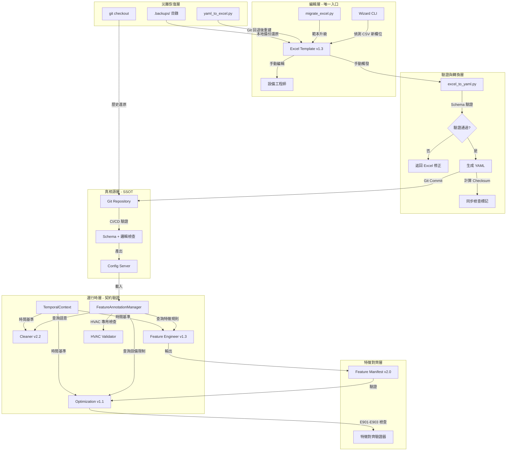

# PRD v1.3-Complete: 特徵標註系統規範 (HVAC 完整實作版)

**文件版本:** v1.3-Complete (Aligned with Interface Contract v1.1)  
**日期:** 2026-02-14  
**負責人:** Oscar Chang / HVAC 系統工程團隊  
**目標:** 建立 HVAC 冰水主機房與空調系統的統一特徵標註規範，強化單向流程管控、設備邏輯一致性、時間基準防護與特徵對齊機制  
**相依文件:** 
- Interface Contract v1.1 (PRD_Interface_Contract_v1.1.md)
- Cleaner v2.2+, Feature Engineer v1.3+, Optimization v1.1+
- Parser v2.1+ (含 Header Standardization)

---

## 1. 執行總綱與設計哲學

### 1.1 核心目標聲明

本規範旨在建立**工業級 HVAC 資料治理基礎設施**，解決以下關鍵痛點：

1. **設備語意一致性**: 統一冰水主機、水泵、冷卻水塔、空調箱等設備的命名與分類邏輯
2. **物理邏輯防呆**: 透過設備互鎖檢查（Interlock Validation）防止「主機開啟但水泵未運轉」等物理不可能情境
3. **單向流程管控**: 杜絕「Excel ↔ YAML 雙向修改」導致的競態條件與設定遺失
4. **時間一致性防護**: 建立全域時間基準（Temporal Baseline），防止長時間執行流程中的時間漂移導致未來資料誤判
5. **特徵對齊保證**: 確保 Training 與 Optimization 階段的特徵向量、縮放參數、設備限制完全一致，防止 Silent Failure

### 1.2 嚴格流程架構（單向同步原則）



**關鍵約束（強制執行）**:
- 🔴 **禁止直接修改 YAML**: 任何對 `config/features/sites/*.yaml` 的手動修改將被 Import Guard 攔截（E501 錯誤）
- 🔴 **Wizard 僅寫 Excel**: Wizard CLI 禁止直接寫入 YAML，僅允許更新 `.xlsx` 檔案
- 🔴 **時間基準強制**: 所有模組必須透過 `TemporalContext` 取得 `pipeline_origin_timestamp`，禁止直接使用 `datetime.now()`
- 🟢 **Git 為最終 SSOT**: 所有 YAML 必須進 Git，Excel 檔案必須在 `.gitignore` 中排除
- 🟡 **逆向同步僅限災難恢復**: `yaml_to_excel --mode recovery` 僅在 Git 回退或檔案損毀時使用

---

## 2. 文件架構與版本控制（詳細規格）

### 2.1 目錄結構（完整版）

```
config/features/                    # SSOT 目錄（唯讀，Git 管控）
├── schema.json                     # JSON Schema v1.3（含 HVAC 擴充）
├── base.yaml                       # 基礎繼承定義
├── physical_types.yaml             # 物理類型完整定義（18+ 類型）
├── equipment_taxonomy.yaml         # 設備分類法（HVAC 專用）
├── header_standardization_rules.yaml # 標頭正規化規則（對齊 Interface Contract 第10章）
└── sites/                          # 案場定義（僅由 Excel 生成）
    ├── cgmh_ty.yaml
    ├── kmuh.yaml
    └── template_factory.yaml       # 工廠範本

tools/features/                     # 編輯工具鏈
├── templates/                      
│   ├── Feature_Template_v1.3.xlsx  # 當前版本（含 HVAC 欄位）
│   └── Feature_Template_v1.2.xlsx  # 舊版（供遷移）
├── wizard.py                       # Wizard CLI（自動備份機制）
├── excel_to_yaml.py                # 轉換器（含 HVAC 邏輯驗證）
├── yaml_to_excel.py                # 逆向轉換（init/recovery 模式）
├── migrate_excel.py                # 範本升級工具（v1.1→v1.2→v1.3）
└── validators/
    ├── hvac_validator.py           # HVAC 專用驗證器
    ├── sync_checker.py             # Excel/YAML 同步檢查（含 Checksum 計算）
    └── header_standardizer.py      # 標頭正規化實作（對齊 Interface Contract）

src/features/                       # Python API（Runtime）
├── __init__.py                     # 安裝 YAML Write Guard 與 TemporalContext
├── annotation_manager.py           # FeatureAnnotationManager（唯讀）
├── yaml_write_guard.py             # Import Hook 防護（E501）
├── backup_manager.py               # 備份策略管理
├── models.py                       # Pydantic 模型（ColumnAnnotation, EquipmentConstraint）
├── temporal_context.py             # 全域時間基準單例（新增）
└── feature_manifest.py             # Feature Manifest 生成與驗證（新增）

src/etl/                            # ETL 整合層
├── config_models.py                # SSOT 常數定義（VALID_QUALITY_FLAGS, HEADER_STANDARDIZATION_RULES）
└── header_standardizer.py          # CSV 標頭正規化實作（Parser 使用）
```

### 2.2 Git 管理策略（強制規範）

**.gitignore 範例**（必須放置於專案根目錄）：
```gitignore
# 特徵標註工作檔案（禁止進 Git）
data/features/**/*.xlsx
data/features/**/*.xlsx.backup.*
data/features/**/.backups/
*.xlsx~*.tmp

# 臨時 YAML（生成過程）
*.yaml.tmp
__pycache__/
```

**分支策略**:
- `main`: 僅包含通過 HVAC 驗證的 YAML，代表生產環境配置
- `feature/hvac-{site_id}`: 新增案場或修改 HVAC 邏輯時的工作分支
- **Pre-commit Hook 檢查**: 禁止提交 `.xlsx` 二進位檔案，驗證 YAML Schema 版本

---

## 3. Excel 範本結構（v1.3 完整版）

### 3.1 Sheet 1: Columns（主要編輯區）

**欄位定義（強化版）**:

| 欄位名稱 (A) | 物理類型 (B) | 單位 (C) | 設備角色 (D) | 是否目標 (E) | 啟用 Lag (F) | Lag 間隔 (G) | 忽略警告 (H) | 設備 ID (I) | 描述 (J) | 狀態 (K) |
|:---:|:---:|:---:|:---:|:---:|:---:|:---:|:---:|:---:|:---:|:---:|
| chiller_01_chwst | temperature | °C | primary | FALSE | TRUE | 1,4,96 | - | CH-01 | 一號機冰水回水溫度 | confirmed |
| chiller_02_chwst | temperature | °C | backup | FALSE | TRUE | 1,4 | W403 | CH-02 | 二號機冰水回水溫度(備用) | confirmed |
| chiller_01_kw | power | kW | primary | TRUE | FALSE | - | - | CH-01 | 一號機功率（目標變數） | confirmed |
| chw_pri_pump_01_hz | frequency | Hz | primary | FALSE | TRUE | 1,4 | - | CHWP-01 | 冰水泵 01 頻率 | confirmed |

**欄位規格詳細說明**:

**A. 欄位名稱 (Column Name)**
- **驗證規則**: 
  - 必填，必須與 CSV 欄位名稱完全匹配（經 Parser Header Standardization 後的 snake_case）
  - 必須符合 HVAC 命名規範（見第4章）
  - 禁止重複（Excel 條件格式標記紅色）
- **命名規範**: `{equipment_code}_{sequence:02d}_{component_code}`
  - 範例: `chiller_01_chwst`, `ahu_01_chwv`
- **Header Standardization 關聯**: 若原始 CSV 標頭為 `Chiller 1 Temp`，經 Parser 正規化後為 `chiller_1_temp`，Excel 中的 `column_name` 必須記錄正規化後的值

**B. 物理類型 (Physical Type)**
- **輸入**: 靜態下拉選單（18 個選項）
- **選項清單**: 
  - 基礎類: `temperature`, `pressure`, `flow_rate`, `power`, `chiller_load`, `status`, `gauge`
  - HVAC 擴充: `cooling_capacity`, `efficiency`, `energy`, `valve_position`, `frequency`, `rotational_speed`, `current`, `voltage`, `power_factor`, `pressure_differential`, `operating_status`

**C. 單位 (Unit)**
- **輸入**: 靜態長選單（依物理類型分群顯示）
- **HVAC 單位對照**:
  | 物理類型 | 可選單位 |
  |---------|---------|
  | cooling_capacity | RT, kW |
  | efficiency | COP, kW/RT |
  | energy | kWh |
  | valve_position | % |
  | frequency | Hz |
  | rotational_speed | RPM |
  | current | A |
  | voltage | V |
  | power_factor | PF |
  | pressure_differential | kPa, Pa, bar |

**D. 設備角色 (Device Role)**
- **選項**: `primary`（主設備）、`backup`（備用）、`seasonal`（季節性）
- **預設**: `primary`
- **影響邏輯**:
  - `backup`: 抑制 W403（高零值比例）警告，允許長期離線
  - `seasonal`: 抑制 W401（均值異常）與 W403 警告
  - 供 Cleaner 調整異常偵測閾值（備用設備閾值放寬 50%）

**E. 是否目標 (Is Target)**
- **輸入**: 勾選框 (TRUE/FALSE)
- **防呆機制**: 當設為 TRUE 時，F 欄（啟用 Lag）自動設為 FALSE 並鎖定編輯（灰色背景保護）
- **HVAC 建議**: 功率（kW）、效率（COP）通常設為目標變數

**F. 啟用 Lag (Enable Lag)**
- **驗證**: 若 E 欄為 TRUE，此欄強制為 FALSE（Pydantic 層驗證錯誤 E405）

**G. Lag 間隔 (Lag Intervals)**
- **格式**: 逗號分隔正整數（如 `1,4,96`）
- **驗證**: 
  - Python 層檢查必須為嚴格遞增序列
  - 檢查數值必須為正整數（時間點間隔）
  - HVAC 建議: 溫度類用 `1,4,96`（15分, 1小時, 24小時），功率類用 `1,4`（高頻）

**H. 忽略警告 (Ignore Warnings)**
- **輸入**: 多選下拉（`W401`, `W402`, `W403`, `W406`, `W407`, `-`）
- **用途**: 允許領域專家顯式標記「此欄位允許特定統計異常」

**I. 設備 ID (Equipment ID)**（v1.3 新增）
- **用途**: 建立欄位與實體設備的關聯，供 Equipment Constraints 使用
- **格式**: 大寫設備代碼（如 CH-01, CHWP-01, AHU-North-01）
- **驗證**: 在同一案場中，Equipment ID 與 Column Name 必須唯一對應

**J. 描述 (Description)**
- **建議內容**: 設備位置、製造商、型號、安裝日期等

**K. 狀態 (Status)**
- **選項**: `pending_review`（待確認）、`confirmed`（已確認）、`deprecated`（已棄用）
- **Wizard 生成**: 新欄位預設為 `pending_review`

### 3.2 Sheet 2: Group Policies（群組策略）

簡化語法，無需 Regex，支援 HVAC 設備類型自動匹配：

| 策略名稱 | 匹配類型 | 匹配值 | 物理類型 | 預設樣板 | 自定義 Lag | 設備類別 |
|:---:|:---:|:---:|:---:|:---:|:---:|:---:|
| chillers_temp | prefix | chiller_ | temperature | Standard_Chiller | - | 冰水主機 |
| chillers_power | prefix | chiller_ | power | Power_High_Freq | - | 冰水主機 |
| chillers_eff | prefix | chiller_ | efficiency | Efficiency_Smooth | - | 冰水主機 |
| pumps_vfd | prefix | pump_ | frequency | VFD_Control | 1,4 | 水泵 |
| pumps_elec | prefix | pump_ | current | Electrical_Monitor | 1,4 | 水泵 |
| cooling_towers | prefix | ct_ | frequency | CT_Fan_Control | 1,4 | 冷卻水塔 |
| ahu_valves | prefix | ahu_ | valve_position | Valve_Position | 1,96 | 空調箱 |
| ahu_filters | prefix | ahu_ | pressure_differential | Filter_DP | 1 | 空調箱 |

### 3.3 Sheet 3: Metadata（文件元資料）

| 屬性 | 值 | 說明 | 驗證規則 |
|:---|:---|:---|:---|
| schema_version | 1.3 | 文件格式版本 | 必須為 "1.3" |
| template_version | 1.3 | Excel 範本版本 | System sheet 交叉驗證 |
| site_id | cgmh_ty | 案場識別 | 必須匹配檔名 |
| inherit | base | 繼承來源 | 必須存在於 config/features/ |
| description | 長庚醫院冰水主機房... | 文件描述 | 自由文字 |
| editor | 王工程師 | 編輯者 | 必填 |
| last_updated | 2026-02-14T10:00:00 | 最後更新 | ISO 8601 格式 |
| yaml_checksum | sha256:abc123... | 對應 YAML 雜湊 | 同步檢查用（見第7章） |
| equipment_schema | hvac_v1.3 | 設備分類架構版本 | HVAC 專用標記 |
| temporal_baseline_version | 1.0 | 時間基準版本 | 必須為 "1.0" |

**Hidden Sheet: System**（系統內部使用）:
- `B1`: template_version ("1.3")
- `B2`: schema_hash (SHA256 of schema.json)
- `B3`: last_generated_by ("wizard_v1.3" or "manual")
- `B4`: yaml_last_sync_timestamp (ISO 8601)
- `B5`: equipment_count（自動計算設備數量）
- `B6`: excel_checksum_sha256（Excel 檔案內容雜湊，供 E406 驗證）

---

## 4. 設備分類與命名規範（HVAC Taxonomy）

### 4.1 設備類別對照表 (Equipment Category Mapping)

為統一欄位命名與 Group Policy 自動匹配，建立以下**強制前綴規範**：

| 設備中文名 | 英文代碼 | 欄位前綴規範 | Device Role 建議 | Equipment ID 範例 |
|-----------|---------|-------------|-----------------|------------------|
| **冰水主機** | CH (Chiller) | `chiller_{nn}_` 或 `ch_{n}_` | primary/backup | CH-01, CH-02 |
| **冰水一次泵** | CHW-P (Primary) | `chw_pri_pump_{nn}_` 或 `chwp{n}_` | primary | CHWP-01 |
| **冰水區域泵** | CHW-S (Secondary) | `chw_sec_pump_{nn}_` 或 `chws{n}_` | primary | CHWS-01 |
| **冷卻水一次泵** | CW-P (Pump) | `cw_pump_{nn}_` 或 `cwp{n}_` | primary | CWP-01 |
| **冷卻水塔** | CT (Cooling Tower) | `ct_{nn}_` 或 `cooling_tower_{nn}_` | primary/backup | CT-01, CT-02 |
| **空調箱** | AHU | `ahu_{nn}_` 或 `ahu_{zone}_` | primary | AHU-North-01 |

### 4.2 元件類型對照表 (Component Type Mapping)

| 元件中文名 | 英文代碼 | 測點類型 | Physical Type 建議 | 單位 |
|-----------|---------|---------|-------------------|------|
| **冰水出水溫度** | CHWST | 溫度計 | `temperature` | °C |
| **冰水回水溫度** | CHWRT | 溫度計 | `temperature` | °C |
| **冷卻水出水溫度** | CWST | 溫度計 | `temperature` | °C |
| **冷卻水回水溫度** | CWRT | 溫度計 | `temperature` | °C |
| **冰水閥開度** | CHWV | 閥門 | `valve_position` | % |
| **變頻器頻率** | VFD | 控制器 | `frequency` | Hz |
| **累積用電量** | kWh | 電表 | `energy` | kWh |
| **過濾器壓差** | DP | 壓差 | `pressure_differential` | kPa |

---

## 5. HVAC 專用設備限制條件（Equipment Constraints）

於 YAML 新增 `equipment_constraints` 區段，定義冰水主機房專用邏輯：

```yaml
equipment_constraints:
  # ==========================================
  # 冰水主機系統互鎖 (Chiller Interlocks)
  # ==========================================
  
  chiller_pump_interlock:
    description: "冰水主機開啟時必須有對應冰水泵運轉"
    check_type: "requires"
    check_phase: "precheck"              # Cleaner 階段執行
    trigger_status: ["chiller_01_status", "chiller_02_status"]
    required_status: ["chw_pri_pump_01_status", "chw_pri_pump_02_status"]
    severity: "critical"
    applicable_roles: ["primary", "backup"]
    error_code: "E350"
    
  chiller_cw_pump_interlock:
    description: "冰水主機開啟時必須有對應冷卻水泵運轉"
    check_type: "requires"
    check_phase: "precheck"
    trigger_status: ["chiller_01_status"]
    required_status: ["cw_pump_01_status", "cw_pump_02_status"]
    severity: "critical"
    applicable_roles: ["primary", "backup"]
    
  chiller_ct_interlock:
    description: "冰水主機開啟時必須有對應冷卻水塔運轉"
    check_type: "requires"
    check_phase: "precheck"
    trigger_status: ["chiller_01_status"]
    required_status: ["ct_01_status", "ct_02_status"]
    severity: "critical"
    
  chiller_temperature_protection:
    description: "冰水出水溫度過低保護（防凍）"
    check_type: "range_check"
    check_phase: "precheck"
    target_column: "chiller_01_chwst"
    min_value: 4.0                    # °C，低於 4 度視為異常
    max_value: 15.0
    severity: "critical"
    applicable_roles: ["primary", "backup"]
    
  # ==========================================
  # 運轉時間限制 (Runtime Constraints) - Optimization 階段
  # ==========================================
  
  chiller_min_runtime:
    description: "主機開啟後最少運轉 15 分鐘（防止頻繁啟停）"
    check_type: "sequence"
    check_phase: "optimization"
    applies_to: ["chiller_01_status", "chiller_02_status"]
    min_duration_minutes: 15
    severity: "warning"
    error_code: "E355"                 # 通用 Sequence 違反
    
  chiller_min_downtime:
    description: "主機關閉後最少停機 10 分鐘（壓縮機保護）"
    check_type: "sequence"
    check_phase: "optimization"
    applies_to: ["chiller_01_status", "chiller_02_status"]
    min_duration_minutes: 10
    severity: "warning"
    error_code: "E355"
    
  # ==========================================
  # 容量與負載限制 (Capacity Constraints)
  # ==========================================
  
  chiller_load_min_limit:
    description: "主機低載保護（低於 20% 建議停機）"
    check_type: "threshold"
    check_phase: "optimization"
    target_column: "chiller_01_rt"
    reference_column: "chiller_01_rated_rt"  # 額定容量
    min_ratio: 0.2                           # 20%
    severity: "warning"
    suggestion: "建議關閉此主機，改由其他主機承載"
    
  # ==========================================
  # 空調箱互鎖 (AHU Interlocks)
  # ==========================================
  
  ahu_valve_flow_interlock:
    description: "空調箱風機運轉時才允許開啟冰水閥"
    check_type: "requires"
    check_phase: "precheck"
    trigger_status: ["ahu_01_chwv"]
    trigger_threshold: 5                    # 閥位 > 5%
    required_status: ["ahu_01_status"]      # 風機必須運轉
    severity: "warning"
    
  ahu_filter_dp_alarm:
    description: "過濾器壓差過高警告（需更換）"
    check_type: "threshold"
    check_phase: "precheck"
    target_column: "ahu_01_dp"
    max_value: 0.5                          # 0.5 kPa 或依設計
    severity: "warning"
    maintenance_trigger: true               # 觸發維護工單標記
    
  # ==========================================
  # 互斥約束 (Mutex Constraints) - 通用
  # ==========================================
  
  chiller_mutual_backup:
    description: "主機與備用主機不可同時開啟（視案場策略）"
    check_type: "mutex"
    check_phase: "optimization"
    mutex_pairs: [["chiller_01_status", "chiller_02_status"]]
    condition: "device_role == 'backup'"    # 僅當角色為 backup 時檢查
    severity: "warning"
    error_code: "E354"                      # 通用 Mutex 違反
```

---

## 6. 錯誤與警告代碼對照表（完整對齊 Interface Contract v1.1）

### 6.1 Feature Annotation 錯誤 (E400-E499)

| 代碼 | 名稱 | 層級 | 觸發條件 | 處理方式 |
|:---:|:---|:---:|:---|:---|
| **E400** | `ANNOTATION_VERSION_MISMATCH` | Error | Schema 版本不符（非 1.3） | 執行 migrate_excel.py 升級 |
| **E401** | `ORPHAN_COLUMN` | Warning | 標註欄位不存在於資料（Excel 有但 CSV 沒有） | 記錄日誌，繼續執行 |
| **E402** | `UNANNOTATED_COLUMN` | Error | 資料欄位未定義於 Annotation（CSV 有但 Excel 沒有） | 阻擋流程，執行 Wizard 標註 |
| **E403** | `UNIT_INCOMPATIBLE` | Error | 單位與物理類型不匹配（如溫度選 bar） | 阻擋生成，返回 Excel 修正 |
| **E404** | `LAG_FORMAT_INVALID` | Error | Lag 間隔格式錯誤（非逗號分隔整數） | 阻擋生成 |
| **E405** | `TARGET_LEAKAGE_RISK` | Error | is_target=True 但 enable_lag=True | 阻擋生成（Pydantic 自動攔截） |
| **E406** | `EXCEL_YAML_OUT_OF_SYNC` | Error | Excel 修改時間晚於 YAML，或 checksum 不符 | 提示重新執行 excel_to_yaml.py |
| **E407** | `CIRCULAR_INHERITANCE` | Error | YAML 繼承鏈存在循環參照 | 阻擋載入，檢查 inherit 欄位 |
| **E408** | `SSOT_QUALITY_FLAGS_MISMATCH` | Error | YAML 中的 `ssot_flags_version` 與 `config_models.VALID_QUALITY_FLAGS` 版本不一致 | 阻擋 Container 啟動，要求同步 config_models.py |
| **E409** | `HEADER_ANNOTATION_MISMATCH` | Error | CSV 標頭（經 Parser 正規化後）與 Annotation 中的 `column_name` 無法匹配 | 提示檢查 Excel 標註或執行 Wizard |

### 6.2 Equipment Validation 錯誤 (E350-E399) - 對齊通用層級

| 代碼 | 名稱 | 層級 | 觸發條件 | 處理方式 |
|:---:|:---|:---:|:---|:---|
| **E350** | `EQUIPMENT_LOGIC_PRECHECK_FAILED` | Error | Cleaner 階段基礎設備邏輯預檢失敗（如主機開但水泵關） | 標記 Quality Flag 為 PHYSICAL_IMPOSSIBLE，記錄稽核軌跡 |
| **E351** | `ENERGY_MONOTONICITY_VIOLATION` | Error | kWh 電表讀數遞減（單調性違反） | 檢查電表重置或故障，分段處理 |
| **E352** | `EFFICIENCY_OUT_OF_RANGE` | Warning | COP < 2 或 > 8（物理異常） | 標記異常，建議檢查溫度/流量感測器 |
| **E353** | `LOW_DELTA_T_SYNDROME` | Warning | 冰水進回水溫差 < 1°C（低溫差症候群） | 建議清洗熱交換器或檢查流量 |
| **E354** | `MUTEX_VIOLATION` | Error | 違反「互斥」約束（如主機與備用主機同時開） | 標記 EQUIPMENT_VIOLATION |
| **E355** | `SEQUENCE_VIOLATION` | Error | 違反開關機順序約束（如未達最小運轉時間） | 標記 EQUIPMENT_VIOLATION |
| **E356** | `MIN_RUNTIME_VIOLATION` | Warning | 違反最小運轉時間限制（同 E355，供統計用） | 標記警告 |
| **E357** | `MIN_DOWNTIME_VIOLATION` | Warning | 違反最小停機時間限制（同 E355，供統計用） | 標記警告 |

### 6.3 Governance & 安全性錯誤 (E500-E599)

| 代碼 | 名稱 | 層級 | 觸發條件 | 處理方式 |
|:---:|:---|:---:|:---|:---|
| **E500** | `DEVICE_ROLE_LEAKAGE` | Error | DataFrame 或 Metadata 包含 `device_role` 欄位（職責分離違反） | 立即終止流程，禁止下游使用 |
| **E501** | `DIRECT_WRITE_ATTEMPT` | Error | Python 程式碼試圖直接寫入 YAML SSOT 路徑 | 立即終止流程，記錄安全性違規 |

### 6.4 全域時間基準錯誤 (E000)

| 代碼 | 名稱 | 層級 | 觸發條件 | 處理方式 |
|:---:|:---|:---:|:---|:---|
| **E000** | `TEMPORAL_BASELINE_MISSING` | Error | `pipeline_origin_timestamp` 未傳遞或遺失 | 立即終止，記錄「時間基準未建立」 |
| **E000-W** | `TEMPORAL_DRIFT_WARNING` | Warning | Pipeline 執行時間超過 1 小時，懷疑時間漂移 | 記錄警告，檢查時間基準一致性 |

### 6.5 警告代碼 (W401-W407)

| 代碼 | 名稱 | 層級 | 觸發條件 | 處理方式 |
|:---:|:---|:---:|:---|:---|
| **W401** | `MEAN_OUT_OF_RANGE` | Warning | 平均值超出預期範圍（distribution_check） | 標記 pending_review，可透過 ignore_warnings 忽略 |
| **W402** | `LOW_VARIANCE` | Warning | 標準差接近零（可能為凍結資料） | 檢查感測器狀態 |
| **W403** | `HIGH_ZERO_RATIO` | Warning | 零值比例過高（主設備 > 10%） | 備用設備（backup role）自動抑制此警告 |
| **W404** | `BACKUP_CLEANUP_FAILED` | Warning | 清理舊備份時權限不足 | 通知系統管理員，不阻擋流程 |
| **W405** | `EQUIPMENT_CONSTRAINT_DEPRECATED` | Warning | 使用了標記為 deprecated 的設備限制條件 | 建議更新至新版限制條件定義 |
| **W406** | `FREQUENCY_ZERO_WHILE_RUNNING` | Warning | 運轉狀態=1 但頻率=0（變頻器異常） | 檢查 VFD 回授信號 |
| **W407** | `POWER_FACTOR_LOW` | Warning | PF < 0.8 持續超過 1 小時 | 建議檢查電容器或馬達狀態 |

---

## 7. Wizard 交互式 CLI（單向流程強化與同步檢查）

### 7.1 架構修正（解決競態條件）

**v1.3 強制規範**: Wizard **僅**更新 Excel，YAML 由使用者手動觸發生成

```python
def wizard_update_excel(
    site_id: str,
    csv_path: Path,
    excel_path: Path,
    template_version: str = "1.3"
):
    """
    Wizard：偵測新欄位並追加至 Excel（不直接寫 YAML）
    包含自動備份機制（Undo 防護）與 Header Standardization 預覽
    """
    # 0. 自動備份機制（災難恢復防護）
    if excel_path.exists():
        backup_dir = excel_path.parent / ".backups"
        backup_dir.mkdir(exist_ok=True)
        
        timestamp = datetime.now().strftime("%Y%m%d_%H%M%S")
        backup_filename = f"{excel_path.stem}.backup.{timestamp}{excel_path.suffix}"
        backup_path = backup_dir / backup_filename
        
        import shutil
        shutil.copy2(excel_path, backup_path)
        
        # 清理舊備份（保留最近 10 個版本）
        backup_pattern = f"{excel_path.stem}.backup.*"
        all_backups = sorted(
            backup_dir.glob(backup_pattern), 
            key=lambda x: x.stat().st_mtime,
            reverse=True
        )
        
        for old_backup in all_backups[10:]:
            try:
                old_backup.unlink()
            except Exception as e:
                print(f"⚠️  無法清理舊備份 {old_backup.name}: {e}")
        
        print(f"💾 已自動備份: {backup_path.name}（保留最近 10 個版本）")
    
    # 1. 檢查 Excel 版本相容性
    if excel_path.exists():
        wb = load_workbook(excel_path)
        current_ver = wb['System']['B1'].value
        if current_ver != template_version:
            raise CompatibilityError(
                f"E400: Excel 範本過舊 (v{current_ver})，請先執行：\n"
                f"python migrate_excel.py --from {current_ver} --to {template_version}"
            )
    else:
        wb = load_workbook(f"tools/features/templates/Feature_Template_v{template_version}.xlsx")
        print(f"🆕 初始化新 Excel 檔案: {excel_path}")
    
    # 2. 讀取 CSV 欄位並執行 Header Standardization
    from src.etl.header_standardizer import HeaderStandardizer
    
    df_csv = pl.read_csv(csv_path, n_rows=1000)
    original_headers = df_csv.columns
    standardizer = HeaderStandardizer()
    
    standardized_map = {}
    for header in original_headers:
        if header == 'timestamp':
            standardized_map[header] = header
        else:
            standardized = standardizer.standardize(header)
            standardized_map[header] = standardized
    
    # 顯示標頭轉換預覽
    print("\n📋 Header Standardization 預覽:")
    for orig, std in standardized_map.items():
        if orig != std:
            print(f"   {orig} → {std}")
    
    existing_cols = get_existing_columns(wb)
    new_cols = set(standardized_map.values()) - existing_cols - {'timestamp'}
    
    if not new_cols:
        print("✅ 無新欄位需要標註")
        return
    
    print(f"🔍 發現 {len(new_cols)} 個新欄位待標註")

    # === 步驟 3: HVAC 語意推測 ===
    for col in sorted(new_cols):
        # 找回原始欄位名稱（用於統計計算）
        original_col = [k for k, v in standardized_map.items() if v == col][0]
        stats = calculate_stats(df_csv[original_col])
        suggestion = hvac_semantic_guess(col, stats)  # HVAC 專用推測邏輯

        print(f"\n{'='*60}")
        print(f"🔍 新欄位: {col} (原始: {original_col})")
        print(f"   統計摘要: 均值={stats['mean']:.2f}, 零值比例={stats['zero_ratio']:.1%}")
        print(f"   HVAC 推測: {suggestion['equipment_type']} / {suggestion['physical_type']}")
        print(f"   建議設備 ID: {suggestion['equipment_id']}")

        # 交互式確認（含防呆）
        choice = input("[Y]確認 [N]修改 [S]跳過 [D]查看分佈 [Q]退出 > ").strip().upper()

        if choice == 'Q':
            print("🛑 使用者中斷，已處理的欄位已儲存")
            break
        elif choice == 'S':
            continue
        elif choice == 'D':
            plot_distribution(df_csv[original_col])
            continue

        # 寫入 Excel（含 HVAC 預設值）
        row_data = {
            'column_name': col,  # 記錄正規化後的名稱
            'physical_type': suggestion['physical_type'],
            'unit': suggestion['unit'],
            'device_role': suggestion.get('device_role', 'primary'),
            'equipment_id': suggestion['equipment_id'],
            'is_target': suggestion.get('is_target', False),
            'enable_lag': not suggestion.get('is_target', False),
            'lag_intervals': suggestion.get('lag_intervals', '1,4'),
            'ignore_warnings': '',
            'description': suggestion['description'],
            'status': 'pending_review'
        }

        write_to_excel_row(wb['Columns'], row_data)
        print(f"✅ 已寫入 Excel（狀態: pending_review）")

    # === 步驟 4: 更新 Metadata ===
    update_metadata(wb, source_csv=csv_path.name)

    # === 步驟 5: 原子寫入 ===
    temp_excel = excel_path.with_suffix('.tmp.xlsx')
    wb.save(temp_excel)
    temp_excel.replace(excel_path)

    # === 步驟 6: 計算並記錄 Excel Checksum ===
    excel_checksum = compute_file_hash(excel_path, algorithm='sha256')
    wb = load_workbook(excel_path)  # 重新載入以更新 System sheet
    wb['System']['B6'] = excel_checksum
    wb.save(excel_path)

    print(f"\n{'='*60}")
    print(f"✅ 已更新 Excel: {excel_path}")
    print(f"📊 Excel Checksum: {excel_checksum[:16]}...")
    print(f"⚠️  請開啟 Excel 確認設備角色與 Equipment ID，然後執行：")
    print(f"   python tools/features/excel_to_yaml.py --input {excel_path}")
```

### 7.2 同步狀態檢查（防止遺忘生成 YAML）

```python
def check_sync_status(excel_path: Path, yaml_path: Path) -> dict:
    """
    檢查 Excel 與 YAML 是否同步（E406 實作細節）
    回傳詳細差異報告與建議操作
    """
    wb = load_workbook(excel_path)
    excel_mtime = datetime.fromtimestamp(excel_path.stat().st_mtime)
    
    # 讀取 Excel 中記錄的 checksum
    stored_excel_checksum = wb['System']['B6'].value

    if not yaml_path.exists():
        return {
            "synced": False,
            "error_code": "E406",
            "reason": "YAML 不存在",
            "action": f"python tools/features/excel_to_yaml.py --input {excel_path} --output {yaml_path}",
            "severity": "High"
        }

    yaml_mtime = datetime.fromtimestamp(yaml_path.stat().st_mtime)

    # 檢查時間戳（Excel 必須早於或等於 YAML）
    if excel_mtime > yaml_mtime:
        time_diff = (excel_mtime - yaml_mtime).total_seconds() / 60
        return {
            "synced": False,
            "error_code": "E406",
            "reason": f"Excel 較新（差距 {time_diff:.1f} 分鐘）",
            "excel_time": excel_mtime.isoformat(),
            "yaml_time": yaml_mtime.isoformat(),
            "action": "請重新執行 excel_to_yaml.py",
            "severity": "High"
        }

    # Checksum 驗證（防止手動修改 YAML 或 Excel 被外部修改）
    if stored_excel_checksum and stored_excel_checksum != 'pending_sync':
        current_excel_checksum = compute_file_hash(excel_path, algorithm='sha256')
        if stored_excel_checksum != current_excel_checksum:
            return {
                "synced": False,
                "error_code": "E406",
                "reason": "Excel 檔案內容與記錄的 Checksum 不符（可能被外部修改）",
                "warning": "建議重新執行 Wizard 確認欄位一致性",
                "severity": "Medium"
            }
        
        # 驗證 YAML 內容是否對應此 Excel 版本
        with open(yaml_path, 'r', encoding='utf-8') as f:
            yaml_content = yaml.safe_load(f)
        
        if yaml_content.get('metadata', {}).get('excel_checksum') != stored_excel_checksum:
            return {
                "synced": False,
                "error_code": "E406",
                "reason": "YAML 對應的 Excel Checksum 與當前 Excel 不符",
                "warning": "YAML 可能是由舊版 Excel 生成，建議重新生成",
                "severity": "High"
            }

    return {
        "synced": True, 
        "last_sync": yaml_mtime.isoformat(),
        "excel_checksum": stored_excel_checksum
    }
```

---

## 8. FeatureAnnotationManager API（完整規範）

### 8.1 類別定義與初始化

```python
# src/features/annotation_manager.py
from typing import Dict, List, Optional, Any, Set, Tuple
from pathlib import Path
import yaml
from pydantic import BaseModel, validator, root_validator

class ColumnAnnotation(BaseModel):
    """欄位標註資料模型（對齊 YAML Schema v1.3）"""
    column_name: str
    physical_type: str
    unit: Optional[str]
    device_role: str = "primary"
    equipment_id: Optional[str] = None      # v1.3 新增
    description: Optional[str]
    is_target: bool = False
    enable_lag: bool = True
    lag_intervals: List[int] = []
    rolling_windows: List[int] = []
    ignore_warnings: List[str] = []
    status: str = "pending_review"
    tags: List[str] = []

    @validator('device_role')
    def validate_role(cls, v):
        if v not in ['primary', 'backup', 'seasonal']:
            raise ValueError(f"Invalid device_role: {v}")
        return v

    @root_validator
    def check_target_lag(cls, values):
        """E405: 目標變數禁止 Lag"""
        if values.get('is_target') and values.get('enable_lag'):
            raise ValueError("E405: 目標變數不可啟用 Lag")
        return values

class EquipmentConstraint(BaseModel):
    """設備限制條件模型（對齊 Interface Contract v1.1）"""
    constraint_id: str
    description: str
    check_type: str                      # requires, mutex, sequence, range_check, threshold
    check_phase: str                     # precheck, optimization
    trigger_status: Optional[List[str]]
    required_status: Optional[List[str]]
    target_column: Optional[str]
    min_value: Optional[float]
    max_value: Optional[float]
    min_duration_minutes: Optional[int]
    severity: str                        # critical, warning
    applicable_roles: List[str] = ["primary", "backup"]
    error_code: Optional[str]

class FeatureAnnotationManager:
    """
    特徵標註管理器（FeatureAnnotationManager）

    設計原則：
    1. 唯讀介面：提供查詢方法，禁止修改 YAML
    2. SSOT 存取：所有資料來自 config/features/sites/{site_id}.yaml
    3. 快取機制：YAML 載入後快取於記憶體，避免重複 I/O
    4. HVAC 感知：支援設備互鎖查詢與驗證
    5. 時間基準感知：支援 TemporalContext 傳遞

    使用範例：
        from src.features.temporal_context import TemporalContext
        
        context = TemporalContext()
        manager = FeatureAnnotationManager("cgmh_ty", temporal_context=context)
        
        # 基礎查詢
        annotation = manager.get_column_annotation("chiller_01_chwst")
        
        # HVAC 專用查詢
        chillers = manager.get_columns_by_equipment_type("chiller")
        constraints = manager.get_equipment_constraints(phase="precheck")
    """

    def __init__(
        self, 
        site_id: str, 
        config_root: Path = Path("config/features"),
        temporal_context: Optional['TemporalContext'] = None
    ):
        self.site_id = site_id
        self.config_path = config_root / "sites" / f"{site_id}.yaml"
        self.temporal_context = temporal_context
        self._cache: Optional[Dict[str, Any]] = None
        self._annotations: Dict[str, ColumnAnnotation] = {}
        self._constraints: Dict[str, EquipmentConstraint] = {}
        self._equipment_map: Dict[str, List[str]] = {}  # equipment_id -> columns

        self._load_and_validate()

    def _load_and_validate(self):
        """載入 YAML 並驗證 Schema 版本與 SSOT 一致性"""
        if not self.config_path.exists():
            raise FileNotFoundError(
                f"E402: 找不到案場標註檔案: {self.config_path}"
            )

        with open(self.config_path, 'r', encoding='utf-8') as f:
            raw_data = yaml.safe_load(f)

        # 驗證 Schema 版本
        schema_version = raw_data.get('schema_version', 'unknown')
        if schema_version != "1.3":
            raise CompatibilityError(
                f"E400: 不支援的 Schema 版本: {schema_version}，預期: 1.3"
            )

        # 驗證 SSOT Quality Flags 版本（E408）
        ssot_flags_version = raw_data.get('metadata', {}).get('ssot_flags_version')
        from src.etl.config_models import VALID_QUALITY_FLAGS_VERSION
        if ssot_flags_version != VALID_QUALITY_FLAGS_VERSION:
            raise SSOTMismatchError(
                f"E408: SSOT Quality Flags 版本不匹配: "
                f"YAML 為 {ssot_flags_version}，系統要求 {VALID_QUALITY_FLAGS_VERSION}"
            )

        # 解析 Columns
        for col_name, col_data in raw_data.get('columns', {}).items():
            self._annotations[col_name] = ColumnAnnotation(**col_data)

            # 建立 Equipment ID 映射
            eq_id = col_data.get('equipment_id')
            if eq_id:
                if eq_id not in self._equipment_map:
                    self._equipment_map[eq_id] = []
                self._equipment_map[eq_id].append(col_name)

        # 解析 Equipment Constraints
        for const_id, const_data in raw_data.get('equipment_constraints', {}).items():
            const_data['constraint_id'] = const_id
            self._constraints[const_id] = EquipmentConstraint(**const_data)

        self._cache = raw_data

    # ==================== 核心查詢 API ====================

    def get_column_annotation(self, column_name: str) -> Optional[ColumnAnnotation]:
        """取得欄位完整標註"""
        return self._annotations.get(column_name)

    def is_column_annotated(self, column_name: str) -> bool:
        """檢查欄位是否已定義（E402 檢查）"""
        return column_name in self._annotations

    def get_device_role(self, column_name: str) -> Optional[str]:
        """
        取得設備角色（primary/backup/seasonal）
        供 Cleaner v2.2 進行語意感知清洗
        """
        anno = self._annotations.get(column_name)
        return anno.device_role if anno else None

    def get_equipment_id(self, column_name: str) -> Optional[str]:
        """取得設備 ID（v1.3 新增）"""
        anno = self._annotations.get(column_name)
        return anno.equipment_id if anno else None

    def get_columns_by_equipment_id(self, equipment_id: str) -> List[str]:
        """依設備 ID 取得所有相關欄位"""
        return self._equipment_map.get(equipment_id, [])

    def get_columns_by_equipment_type(self, equipment_type: str) -> List[str]:
        """
        依設備類型取得欄位（基於命名前綴分析）

        Args:
            equipment_type: "chiller", "pump", "cooling_tower", "ahu"
        """
        prefix_map = {
            "chiller": ["chiller_", "ch_"],
            "pump": ["pump_", "chw_pri_pump_", "chw_sec_pump_", "cw_pump_"],
            "cooling_tower": ["ct_", "cooling_tower_"],
            "ahu": ["ahu_"]
        }

        prefixes = prefix_map.get(equipment_type, [])
        return [
            name for name in self._annotations.keys()
            if any(name.startswith(p) for p in prefixes)
        ]

    def get_target_columns(self) -> List[str]:
        """取得所有目標變數欄位（is_target=True）"""
        return [
            name for name, anno in self._annotations.items() 
            if anno.is_target
        ]

    def get_columns_by_role(self, role: str) -> List[str]:
        """
        依設備角色取得欄位清單
        
        Args:
            role: "primary", "backup", 或 "seasonal"
        """
        return [
            name for name, anno in self._annotations.items()
            if anno.device_role == role
        ]

    def get_electrical_columns(self) -> Dict[str, List[str]]:
        """
        取得所有電力相關欄位分類（電流、電壓、功率、功率因數）
        
        Returns:
            {
                "power": ["chiller_01_kw", ...],
                "current": ["chiller_01_a", ...],
                "voltage": ["chiller_01_v", ...],
                "pf": ["chiller_01_pf", ...],
                "energy": ["chiller_01_kwh", ...]
            }
        """
        electrical_types = ["power", "current", "voltage", "power_factor", "energy"]
        return {
            ptype: [
                name for name, anno in self._annotations.items()
                if anno.physical_type == ptype
            ]
            for ptype in electrical_types
        }

    # ==================== Equipment Validation API ====================

    def get_equipment_constraints(self, phase: Optional[str] = None) -> List[EquipmentConstraint]:
        """
        取得設備邏輯限制條件（對齊 Interface Contract v1.1 第 11 章）
        
        Args:
            phase: 篩選檢查階段 ("precheck" 或 "optimization")，None 則回傳全部
        
        Returns:
            EquipmentConstraint 物件列表
        """
        constraints = list(self._constraints.values())
        if phase:
            constraints = [c for c in constraints if c.check_phase == phase]
        return constraints

    def get_constraints_for_column(self, column_name: str) -> List[EquipmentConstraint]:
        """
        取得適用於特定欄位的限制條件
        
        邏輯：
        - 檢查欄位是否為 trigger_status 或 required_status 的成員
        - 檢查欄位的 device_role 是否在 applicable_roles 中
        """
        anno = self._annotations.get(column_name)
        if not anno:
            return []
        
        applicable = []
        for const in self._constraints.values():
            involved = False
            if const.trigger_status and column_name in const.trigger_status:
                involved = True
            if const.required_status and column_name in const.required_status:
                involved = True
            
            if involved and anno.device_role in const.applicable_roles:
                applicable.append(const)
        
        return applicable

    def get_interlock_constraints_for_equipment(self, equipment_id: str) -> List[EquipmentConstraint]:
        """
        取得特定設備的互鎖限制（HVAC 專用）
        
        Args:
            equipment_id: 設備 ID（如 "CH-01"）
        """
        columns = self._equipment_map.get(equipment_id, [])
        constraints = []
        
        for col in columns:
            col_constraints = self.get_constraints_for_column(col)
            # 篩選互鎖類型（requires, mutex）
            interlocks = [c for c in col_constraints if c.check_type in ['requires', 'mutex']]
            constraints.extend(interlocks)
        
        return constraints

    def validate_monotonic_energy(self, df: pl.DataFrame) -> List[dict]:
        """
        驗證累積用電量（kWh）是否單調遞增（E351 錯誤碼）
        
        Returns:
            違反單調性的欄位列表（含詳細資訊）
        """
        violations = []
        energy_cols = [
            name for name, anno in self._annotations.items()
            if anno.physical_type == "energy"
        ]
        
        for col in energy_cols:
            if col in df.columns:
                diff = df[col].diff()
                significant_drop = (diff < -0.01).sum()
                
                if significant_drop > 0:
                    violations.append({
                        "column": col,
                        "drops_count": int(significant_drop),
                        "error_code": "E351",
                        "message": f"累積用電量 {col} 發生非預期遞減，可能電表故障或重置"
                    })
        
        return violations

    def get_efficiency_baseline(self, chiller_id: str) -> Dict[str, float]:
        """
        取得特定主機的效率基準範圍（供 Cleaner 異常檢測使用）
        
        Returns:
            {"cop_min": 3.0, "cop_max": 6.0, "kw_per_rt_max": 1.2}
        """
        ptype_config = self._cache.get("physical_types", {}).get("efficiency", {})
        mean_range = ptype_config.get("distribution_check", {}).get("expected_mean_range", [3.0, 6.0])
        
        return {
            "cop_min": mean_range[0],
            "cop_max": mean_range[1],
            "kw_per_rt_max": 3.517 / mean_range[0]
        }

    # ==================== 時間基準整合 ====================

    def get_temporal_baseline(self) -> Optional[datetime]:
        """
        取得 Pipeline 時間基準（對齊 Interface Contract 第8章）
        
        Returns:
            pipeline_origin_timestamp (datetime)
        """
        if self.temporal_context:
            return self.temporal_context.get_baseline()
        return None

    def is_future_data(self, timestamp: datetime, tolerance_minutes: int = 5) -> bool:
        """
        判斷時間戳是否為未來資料（使用 TemporalContext）
        
        Args:
            timestamp: 待檢查時間戳
            tolerance_minutes: 容許誤差（預設5分鐘）
        
        Returns:
            bool: 是否為未來資料
        """
        if not self.temporal_context:
            raise RuntimeError("E000: TemporalContext 未初始化")
        
        return self.temporal_context.is_future(timestamp, tolerance_minutes)

    # ==================== 禁止寫入防護 ====================

    def __setattr__(self, name, value):
        """禁止動態修改屬性（E500 防護）"""
        if name.startswith('_') or name in ['site_id', 'config_path', 'temporal_context']:
            super().__setattr__(name, value)
        else:
            raise PermissionError(
                f"E500: FeatureAnnotationManager 為唯讀介面，"
                f"禁止修改屬性 '{name}'。請使用 Excel 編輯後重新生成 YAML。"
            )

    def save(self, *args, **kwargs):
        """明確禁止儲存操作（E501 防護）"""
        raise NotImplementedError(
            "E501: 禁止透過 FeatureAnnotationManager 儲存變更。"
            "正確流程: Excel → excel_to_yaml.py → Git Commit"
        )
```

---

## 9. Header Standardization 規範（CSV 標頭正規化）

### 9.1 問題定義與實作

CSV 檔案的標頭（欄位名稱）常包含不一致的命名（如 `Chiller 1 Temp`、`power(kW)`、`sensor-A`），導致與 Feature Annotation 中定義的 `column_name` 無法匹配。為解決此問題，建立自動正規化機制。

### 9.2 正規化規則 (Regex-based)

**標準命名規範**: `snake_case`，僅允許小寫英文字母、數字、底線。

**正規化流程**（對齊 Interface Contract 第10章）:

```python
# src/etl/header_standardizer.py
import re
from typing import List, Tuple

class HeaderStandardizer:
    """
    CSV 標頭正規化器（對齊 Interface Contract v1.1 第10章）
    
    實作 HEADER_STANDARDIZATION_RULES 的具體正規化邏輯
    """
    
    RULES: List[Tuple[str, str]] = [
        # 步驟 1: 移除前後空白
        (r'^\s+|\s+$', ''),
        
        # 步驟 2: 將 camelCase/PascalCase 轉換為 snake_case
        # 插入底線在大寫字母前，然後轉小寫
        (r'(?<=[a-z0-9])(?=[A-Z])', '_'),      # 在小寫/數字後的大寫前插入底線
        (r'(?<=[A-Z])(?=[A-Z][a-z])', '_'),    # 在連續大寫中的第二個大寫前插入底線
        
        # 步驟 3: 替換非法字元為底線
        (r'[^a-zA-Z0-9_]', '_'),               # 非字母數字底線的字元替換為底線
        
        # 步驟 4: 合併連續底線
        (r'_+', '_'),
        
        # 步驟 5: 移除開頭數字（Python 變數限制）
        (r'^[0-9]+', 'col_'),
        
        # 步驟 6: 轉換為小寫（透過標誌處理）
    ]

    def standardize(self, header: str) -> str:
        """
        將 CSV 標頭正規化為 snake_case
        
        Args:
            header: 原始標頭字串
            
        Returns:
            正規化後的標頭（snake_case）
            
        Raises:
            HeaderStandardizationError: 若正規化後仍不符合規則（E105）
        """
        result = header
        
        # 套用 Regex 規則
        for pattern, replacement in self.RULES:
            result = re.sub(pattern, replacement, result)
        
        # 轉換為小寫
        result = result.lower()
        
        # 最終驗證
        if not result or result == '_' or not re.match(r'^[a-z][a-z0-9_]*$', result):
            raise HeaderStandardizationError(
                f"E105: 標頭 '{header}' 無法正規化為有效識別符，結果: '{result}'"
            )
        
        # 檢查保留關鍵字（避免與 Python 內建衝突）
        if result in ['class', 'def', 'if', 'else', 'for', 'while', 'timestamp']:
            result = f"{result}_col"
        
        return result

    def standardize_headers(self, headers: List[str]) -> dict:
        """
        批次正規化標頭並回傳映射表
        
        Returns:
            Dict[原始標頭, 正規化後標頭]
        """
        mapping = {}
        standardized_set = set()
        
        for header in headers:
            if header == 'timestamp':
                mapping[header] = header
                standardized_set.add(header)
                continue
                
            standardized = self.standardize(header)
            
            # 檢查正規化後重複（E105 風險）
            if standardized in standardized_set:
                raise HeaderStandardizationError(
                    f"E105: 正規化後產生重複標頭: '{standardized}' "
                    f"（原始: '{header}' 與 '{[k for k, v in mapping.items() if v == standardized][0]}'）"
                )
            
            mapping[header] = standardized
            standardized_set.add(standardized)
        
        return mapping
```

### 9.3 常見標頭轉換範例

| 原始標頭 | 正規化結果 | 說明 |
|:---|:---|:---|
| `Chiller 1 Temp` | `chiller_1_temp` | 空格轉底線，大寫轉小寫 |
| `power(kW)` | `power_kw` | 移除括號，保留字母數字 |
| `sensor-A` | `sensor_a` | 連字號轉底線 |
| `HTTPRequest` | `http_request` | PascalCase 轉 snake_case |
| `Total_Power` | `total_power` | 大寫轉小寫 |
| `123_sensor` | `col_123_sensor` | 開頭數字前綴 `col_` |
| `Temp..Value` | `temp_value` | 合併連續底線 |

### 9.4 Parser 整合規範

**執行時機**: Parser 讀取 CSV 後、建立 DataFrame 前，必須執行標頭正規化。

```python
class ReportParser:
    def __init__(self, temporal_context: TemporalContext):
        self.temporal_context = temporal_context
        self.header_standardizer = HeaderStandardizer()
        self.logger = logging.getLogger(__name__)

    def parse_csv(self, filepath: Path) -> pl.DataFrame:
        # 讀取原始 CSV（不指定欄位名稱）
        raw_df = pl.read_csv(filepath, n_rows=5)
        original_headers = raw_df.columns
        
        # 執行標頭正規化
        try:
            header_mapping = self.header_standardizer.standardize_headers(original_headers)
        except HeaderStandardizationError as e:
            self.logger.error(f"E105: {e}")
            raise
        
        # 記錄正規化映射供除錯
        for orig, std in header_mapping.items():
            if orig != std:
                self.logger.info(f"E105-Warning: 標頭正規化: '{orig}' → '{std}'")
        
        # 重新讀取並套用正規化標頭
        df = pl.read_csv(filepath)
        df = df.rename(header_mapping)
        
        # 驗證 timestamp 欄位存在
        if 'timestamp' not in df.columns:
            raise ValueError("E003: 缺少必要欄位 'timestamp'")
        
        # 轉換時間戳格式（對齊 Interface Contract 第4章）
        df = df.with_columns(
            pl.col('timestamp').str.to_datetime().dt.cast_time_unit('ns').dt.replace_time_zone('UTC')
        )
        
        return df
```

### 9.5 與 Feature Annotation 的對接

正規化後的標頭必須與 Annotation YAML 中的 `column_name` 完全匹配：

```python
def validate_header_annotation_match(
    standardized_headers: List[str], 
    annotation_manager: FeatureAnnotationManager
) -> None:
    """
    驗證正規化後的標頭與 Annotation 定義匹配（檢查點 #6 延伸）
    
    Raises:
        E409: 若存在無法匹配的標頭
    """
    unannotated = []
    for header in standardized_headers:
        if not annotation_manager.is_column_annotated(header):
            unannotated.append(header)
    
    if unannotated:
        raise AnnotationSyncError(
            f"E409: CSV 標頭（正規化後）無法對應至 Annotation: {unannotated}。 "
            f"請確認 Excel 標註中的 column_name 是否與正規化結果一致，"
            f"或執行 features wizard 進行標註。"
        )
```

---

## 10. Temporal Baseline 傳遞規範（時間基準防護）

### 10.1 核心機制

為解決「Pipeline 執行期間時間漂移導致未來資料誤判」問題（原 E102/E205 風險），建立以下機制：

**時間基準產生**：
- **時機**: `Container.__init__` 初始化時（第一個動作，早於任何模組初始化）
- **格式**: ISO 8601 UTC (e.g., `2026-02-13T10:00:00.000000000Z`)
- **儲存**: `TemporalContext` 物件（Thread-safe Singleton）

```python
# src/features/temporal_context.py
import threading
from datetime import datetime, timedelta, timezone
from typing import Optional

class TemporalContext:
    """
    全域時間基準容器（單例模式）（對齊 Interface Contract v1.1 第8章）
    
    所有「未來資料檢查」與「時間相關驗證」必須使用此基準，
    而非模組執行時的動態 datetime.now()，以防止長時間執行流程中的時間漂移。
    """
    
    _instance = None
    _lock = threading.Lock()
    
    def __new__(cls):
        if cls._instance is None:
            with cls._lock:
                if cls._instance is None:
                    cls._instance = super().__new__(cls)
                    cls._instance.origin_timestamp = datetime.now(timezone.utc)
                    cls._instance.baseline_version = "1.0"
                    cls._instance._initialized = True
        return cls._instance
    
    @classmethod
    def reset_for_testing(cls):
        """僅供單元測試使用，重置時間基準"""
        with cls._lock:
            cls._instance = None
    
    def get_baseline(self) -> datetime:
        """取得 Pipeline 啟動時間戳（UTC）"""
        return self.origin_timestamp
    
    def get_baseline_iso(self) -> str:
        """取得 ISO 8601 格式的時間基準"""
        return self.origin_timestamp.isoformat()
    
    def is_future(self, timestamp: datetime, tolerance_minutes: int = 5) -> bool:
        """
        判斷時間戳是否為「未來資料」
        
        標準：timestamp > origin_timestamp + tolerance_minutes
        
        Args:
            timestamp: 待檢查時間戳（必須含時區資訊）
            tolerance_minutes: 容許誤差（預設5分鐘，考量資料傳輸延遲）
        
        Returns:
            bool: True 若為未來資料
        """
        if timestamp.tzinfo is None:
            raise ValueError("時間戳必須含時區資訊")
        
        threshold = self.origin_timestamp + timedelta(minutes=tolerance_minutes)
        return timestamp > threshold
    
    def get_elapsed_minutes(self) -> float:
        """取得 Pipeline 已執行時間（用於漂移檢測）"""
        return (datetime.now(timezone.utc) - self.origin_timestamp).total_seconds() / 60
    
    def check_drift_warning(self) -> Optional[str]:
        """
        檢查時間漂移警告（E000-W）
        
        Returns:
            警告訊息若執行超過 1 小時，否則 None
        """
        elapsed = self.get_elapsed_minutes()
        if elapsed > 60:
            return f"E000-W: Pipeline 執行時間過長 ({elapsed:.1f} 分鐘)，請檢查時間基準一致性"
        return None
    
    def to_metadata(self) -> dict:
        """轉換為儲存用的 metadata 格式"""
        return {
            "pipeline_origin_timestamp": self.get_baseline_iso(),
            "baseline_version": self.baseline_version,
            "timezone": "UTC",
            "time_unit": "nanoseconds"
        }
```

### 10.2 各模組實作規範

**Parser**:
- 接收 `TemporalContext`，在輸出 metadata 中記錄 `pipeline_origin_timestamp`
- 驗證邏輯：若輸入資料時間 > `context.get_baseline() + 5min`，拋出 E102
- **強化**: 若 `context.get_elapsed_minutes() > 60`，記錄 E000-W 警告

**Cleaner**:
- 從輸入 metadata 讀取 `pipeline_origin_timestamp`，傳遞至輸出
- 驗證邏輯：清洗後資料時間不可超過基準+5分鐘（E102）
- **強化**: 若啟用 `enforce_equipment_validation_sync`，在時間檢查後執行設備邏輯預檢

**BatchProcessor**:
- 將 `temporal_baseline` 寫入 Manifest（見第2.3節 Manifest 契約）
- 批次驗證：整個批次時間範圍不可超過基準+5分鐘（E205）
- **強化**: 記錄 `baseline_version` 至 Manifest，供下游相容性檢查

**FeatureAnnotationManager**:
- 初始化時接收 `TemporalContext`（見第8.1節）
- 提供 `is_future_data()` 方法供 Cleaner 呼叫（見第8.2節）
- **禁止**: 使用 `datetime.now()` 進行未來資料檢查

**FeatureEngineer → Model Training**:
- 特徵矩陣 metadata 必須包含 `pipeline_origin_timestamp`（用於追溯）
- **注意**: Training 階段不直接使用此時間戳進行「未來檢查」，但必須傳遞至模型產物
- **強化**: 記錄特徵工程執行時間與基準時間的差異（用於效能分析）

**Optimization**:
- **產生新基準**: Optimization 階段必須產生新的 `pipeline_origin_timestamp`（推論當下時間）
- **不可沿用 Training 時間**: 防止「訓練時的未來資料」在推論時變成「過去資料」的邏輯錯誤
- **強化**: 驗證輸入資料時間範圍與新基準的合理性

### 10.3 跨日執行防護

針對跨日（00:00 前後）執行的特殊處理：

```python
def validate_cross_day_consistency(timestamps: List[datetime], baseline: datetime) -> None:
    """
    驗證跨日執行時的時間一致性
    
    檢查項目：
    1. 時間戳是否包含正確日期（非 1970-01-01 等預設值）
    2. 時間戳與基準的日期差距是否合理（< 1 天）
    """
    for ts in timestamps:
        # 檢查是否為無效日期
        if ts.year < 2020:
            raise ValueError(f"E000: 無效時間戳年份: {ts}")
        
        # 檢查與基準差距
        date_diff = abs((ts.date() - baseline.date()).days)
        if date_diff > 1:
            raise ValueError(
                f"E000: 時間戳日期 {ts.date()} 與基準 {baseline.date()} 差距過大"
            )
```

---

## 11. Feature Alignment & Scaler Parameters 傳遞規範

### 11.1 問題定義

為解決「Training 與 Optimization 特徵向量不一致導致 Silent Failure」風險（原第3點建議），建立以下嚴格契約：

**風險場景**：
- Training: 特徵順序 `[chiller_1_load, chiller_2_load, wb_temp, ...]`
- Optimization: 特徵順序 `[wb_temp, chiller_1_load, chiller_2_load, ...]`
- 結果：模型將 `wb_temp` 誤認為 `chiller_2_load`，導致預測完全錯誤但無警告

### 11.2 Feature Manifest 規格（對齊 Interface Contract 第9章）

**輸出位置**: `ModelTrainer` 輸出目錄中的 `feature_manifest.json`

```json
{
  "manifest_version": "2.0-ALIGN",
  "created_at": "2026-02-13T10:30:00Z",
  "pipeline_origin_timestamp": "2026-02-13T10:00:00Z",
  
  "feature_specification": {
    "feature_names": ["chiller_1_load", "chiller_2_load", "wb_temp", "chwst_temp"],
    "feature_count": 4,
    "feature_hash": "sha256:a1b2c3d4...",
    "hash_algorithm": "SHA256",
    "hash_computation": "sha256(','.join(feature_names).encode())"
  },
  
  "scaling_specification": {
    "scaler_type": "StandardScaler",
    "scaler_params": {
      "mean_": [450.5, 420.3, 28.5, 7.2],
      "scale_": [120.2, 115.8, 2.1, 0.5],
      "var_": [14448.04, 13401.64, 4.41, 0.25]
    },
    "scaler_feature_names": ["chiller_1_load", "chiller_2_load", "wb_temp", "chwst_temp"],
    "scaler_hash": "sha256:e5f6g7h8..."
  },
  
  "equipment_constraints": {
    "constraints_applied": ["chiller_pump_mutex", "min_runtime_15min"],
    "validation_enabled": true,
    "constraint_hash": "sha256:i9j0k1l2..."
  },
  
  "validation_rules": {
    "allow_subset": false,
    "allow_superset": false,
    "strict_order": true,
    "case_sensitive": true,
    "validate_equipment_constraints": true
  }
}
```

### 11.3 Python 實作（Feature Manifest 生成器）

```python
# src/features/feature_manifest.py
import json
import hashlib
from typing import List, Dict, Any, Optional
from pathlib import Path
import numpy as np

class FeatureManifest:
    """
    Feature Manifest 生成與驗證器（對齊 Interface Contract v1.1 第9章）
    
    確保 Training 與 Optimization 階段的特徵一致性
    """
    
    def __init__(
        self,
        feature_names: List[str],
        scaler_params: Optional[Dict[str, Any]] = None,
        equipment_constraints: Optional[List[str]] = None,
        pipeline_origin_timestamp: str = "",
        temporal_context: Optional['TemporalContext'] = None
    ):
        self.feature_names = feature_names
        self.scaler_params = scaler_params or {}
        self.equipment_constraints = equipment_constraints or []
        self.pipeline_origin_timestamp = pipeline_origin_timestamp or (
            temporal_context.get_baseline_iso() if temporal_context else ""
        )
        
        # 計算雜湊
        self.feature_hash = self._compute_hash(','.join(feature_names))
        self.scaler_hash = self._compute_hash(str(scaler_params)) if scaler_params else ""
        self.constraint_hash = self._compute_hash(str(equipment_constraints)) if equipment_constraints else ""
    
    def _compute_hash(self, content: str) -> str:
        """計算 SHA256 雜湊"""
        return f"sha256:{hashlib.sha256(content.encode()).hexdigest()}"
    
    def to_dict(self) -> dict:
        """轉換為字典格式"""
        return {
            "manifest_version": "2.0-ALIGN",
            "created_at": datetime.now(timezone.utc).isoformat(),
            "pipeline_origin_timestamp": self.pipeline_origin_timestamp,
            "feature_specification": {
                "feature_names": self.feature_names,
                "feature_count": len(self.feature_names),
                "feature_hash": self.feature_hash,
                "hash_algorithm": "SHA256",
                "hash_computation": "sha256(','.join(feature_names).encode())"
            },
            "scaling_specification": {
                "scaler_type": self.scaler_params.get("type", "StandardScaler"),
                "scaler_params": {
                    "mean_": self.scaler_params.get("mean_", []),
                    "scale_": self.scaler_params.get("scale_", []),
                    "var_": self.scaler_params.get("var_", [])
                },
                "scaler_feature_names": self.scaler_params.get("feature_names", []),
                "scaler_hash": self.scaler_hash
            } if self.scaler_params else None,
            "equipment_constraints": {
                "constraints_applied": self.equipment_constraints,
                "validation_enabled": len(self.equipment_constraints) > 0,
                "constraint_hash": self.constraint_hash
            },
            "validation_rules": {
                "allow_subset": false,
                "allow_superset": false,
                "strict_order": true,
                "case_sensitive": true,
                "validate_equipment_constraints": true
            }
        }
    
    def save(self, filepath: Path):
        """儲存至 JSON 檔案"""
        with open(filepath, 'w', encoding='utf-8') as f:
            json.dump(self.to_dict(), f, indent=2, ensure_ascii=False)
    
    @classmethod
    def load(cls, filepath: Path) -> 'FeatureManifest':
        """從 JSON 檔案載入"""
        with open(filepath, 'r', encoding='utf-8') as f:
            data = json.load(f)
        
        spec = data.get("feature_specification", {})
        scaling = data.get("scaling_specification", {})
        
        return cls(
            feature_names=spec.get("feature_names", []),
            scaler_params={
                "type": scaling.get("scaler_type"),
                "mean_": scaling.get("scaler_params", {}).get("mean_"),
                "scale_": scaling.get("scaler_params", {}).get("scale_"),
                "feature_names": scaling.get("scaler_feature_names")
            } if scaling else None,
            equipment_constraints=data.get("equipment_constraints", {}).get("constraints_applied"),
            pipeline_origin_timestamp=data.get("pipeline_origin_timestamp")
        )

class FeatureAlignmentValidator:
    """
    特徵對齊驗證器（檢查點 #7 實作）
    
    在 Optimization 階段驗證輸入特徵與 Training 時的一致性
    """
    
    def __init__(self, manifest: FeatureManifest):
        self.manifest = manifest
    
    def validate(self, input_features: List[str], input_scaler_params: Optional[dict] = None) -> None:
        """
        驗證輸入特徵與 Manifest 的一致性
        
        Raises:
            FeatureAlignmentError: E901, E902, E903, E904
        """
        # E901: 特徵順序比對
        self._validate_feature_order(input_features)
        
        # E902: 特徵數量一致性
        self._validate_feature_count(input_features)
        
        # E903: 縮放參數對齊（若存在）
        if self.manifest.scaler_params and input_scaler_params:
            self._validate_scaler_params(input_scaler_params)
        
        # E904: 設備限制一致性
        self._validate_equipment_constraints()
    
    def _validate_feature_order(self, input_features: List[str]):
        """E901: 驗證特徵順序與名稱完全一致"""
        expected = self.manifest.feature_names
        
        if len(input_features) != len(expected):
            raise FeatureAlignmentError(
                f"E902: 特徵維度不匹配: 訓練時 {len(expected)} 維，輸入 {len(input_features)} 維"
            )
        
        for i, (exp, inp) in enumerate(zip(expected, input_features)):
            if exp != inp:
                raise FeatureAlignmentError(
                    f"E901: 特徵錯位於索引 {i}: 訓練時為 '{exp}'，輸入為 '{inp}'"
                )
        
        # 雜湊驗證（可選但建議）
        input_hash = self.manifest._compute_hash(','.join(input_features))
        if input_hash != self.manifest.feature_hash:
            raise FeatureAlignmentError(
                f"E901: 特徵雜湊驗證失敗，特徵列表可能遭修改"
            )
    
    def _validate_feature_count(self, input_features: List[str]):
        """E902: 驗證特徵數量（冗餘檢查）"""
        if len(input_features) != self.manifest.feature_count:
            raise FeatureAlignmentError(
                f"E902: 特徵數量不一致: 預期 {self.manifest.feature_count}，實際 {len(input_features)}"
            )
    
    def _validate_scaler_params(self, input_params: dict):
        """E903: 驗證縮放參數與特徵順序一致"""
        scaler_features = input_params.get("feature_names", [])
        
        if scaler_features != self.manifest.feature_names:
            raise FeatureAlignmentError(
                "E903: 縮放參數特徵順序與訓練特徵順序不一致，可能導致縮放錯位"
            )
        
        # 驗證數值長度
        mean_len = len(input_params.get("mean_", []))
        if mean_len != len(self.manifest.feature_names):
            raise FeatureAlignmentError(
                f"E903: 縮放參數長度 {mean_len} 與特徵數 {len(self.manifest.feature_names)} 不匹配"
            )
    
    def _validate_equipment_constraints(self):
        """E904: 驗證設備限制一致性"""
        from src.etl.config_models import EQUIPMENT_VALIDATION_CONSTRAINTS
        
        current_constraints = set(EQUIPMENT_VALIDATION_CONSTRAINTS.keys())
        train_constraints = set(self.manifest.equipment_constraints)
        
        if train_constraints != current_constraints:
            raise FeatureAlignmentError(
                f"E904: 設備限制不一致: 訓練時使用 {train_constraints}，"
                f"當前使用 {current_constraints}。這可能導致優化結果與模型訓練時的物理假設衝突。"
            )
```

### 11.4 對齊驗證流程（Optimization 階段）

```python
# src/optimization/input_validator.py
def validate_feature_alignment(model_artifact_path: Path, input_features: List[str]):
    """
    Optimization 階段特徵對齊驗證（檢查點 #7）
    
    Args:
        model_artifact_path: 模型產物目錄（含 feature_manifest.json）
        input_features: 當前輸入特徵名稱列表（依順序）
    
    Raises:
        FeatureAlignmentError: E901-E904
    """
    manifest_path = model_artifact_path / "feature_manifest.json"
    
    if not manifest_path.exists():
        raise FeatureAlignmentError(
            "E901: 缺少 feature_manifest.json，無法驗證特徵對齊"
        )
    
    # 載入 Training 時的 Feature Manifest
    manifest = FeatureManifest.load(manifest_path)
    
    # 執行驗證
    validator = FeatureAlignmentValidator(manifest)
    validator.validate(input_features)
    
    print("✅ 特徵對齊驗證通過（E901-E904）")
```

---

## 12. 版本相容性判定標準（對齊 Interface Contract 第5章）

### 12.1 相容性等級定義

| 等級 | 定義 | 行為 | 標示 |
|:---:|:---|:---|:---:|
| **完全相容** (Full Compatible) | 上下游模組版本組合通過所有檢查點，無需轉換或降級 | 正常執行，無警告 | 🟢 |
| **部分相容** (Partial Compatible) | 上游輸出可被下游讀取，但部分功能降級（如缺少 audit_trail） | 執行，但記錄 Warning | 🟡 |
| **不相容** (Incompatible) | 上游輸出無法通過下游檢查點，或資料語意不一致 | 拒絕執行，拋出錯誤 | 🔴 |

### 12.2 模組版本相容性矩陣

| Feature Annotation | Parser | Cleaner | BatchProcessor | Feature Engineer | Model Training | Optimization | 相容性 | 說明 |
|:---:|:---:|:---:|:---:|:---:|:---:|:---:|:---:|:---|
| v1.3 | v2.1+ | v2.2+ | v1.3+ | v1.3+ | v1.2+ | v1.1+ | 🟢 **完全相容** | 推薦配置，支援 E901-E904，Temporal Baseline，Equipment Validation Sync |
| v1.3 | v2.1+ | v2.1 | v1.3+ | v1.3+ | v1.2+ | v1.1+ | 🔴 **不相容** | Cleaner v2.1 缺少 Equipment Validation Sync（E350 風險） |
| v1.3 | v2.1+ | v2.2+ | v1.2 | v1.3+ | v1.2+ | v1.1+ | 🟡 **部分相容** | BatchProcessor v1.2 缺少 temporal_baseline 傳遞（E000 風險） |
| v1.3 | v2.1+ | v2.2+ | v1.3+ | v1.2 | v1.2+ | v1.1+ | 🟡 **部分相容** | Feature Engineer v1.2 無法輸出 Feature Manifest（E601 風險） |
| v1.2 | v2.1+ | v2.2+ | v1.3+ | v1.3+ | v1.2+ | v1.1+ | 🔴 **不相容** | Feature Annotation v1.2 缺少 Equipment ID 與 Constraints（E904 風險） |
| v1.3 | v2.0 | v2.2+ | v1.3+ | v1.3+ | v1.2+ | v1.1+ | 🔴 **不相容** | Parser v2.0 缺少 Header Standardization（E105/E409 風險） |

### 12.3 強制升級路徑

**不允許的組合**（系統必須拒絕啟動）：
1. **Feature Annotation v1.3 + Cleaner v2.1**: 缺少 `equipment_id` 支援與 E350 檢查
2. **Feature Engineer v1.2 + Optimization v1.1**: 缺少 Feature Manifest 輸出，無法通過 E901-E903
3. **任意組合缺少 TemporalContext**: 觸發 E000 錯誤

**建議升級順序**：
```
Feature Annotation v1.3 (基礎設施 - 本文件)
    ↓
Parser v2.1 (上游輸出標準化 + Header Standardization)
    ↓
Cleaner v2.2 (職責分離實作 + Equipment Validation Sync + Temporal Baseline 接收)
    ↓
BatchProcessor v1.3 (時間基準傳遞 + Audit Trail)
    ↓
FeatureEngineer v1.3 (特徵順序保證 E601 + Scaler Parameters E602 + Feature Manifest 輸出)
    ↓
Model Training v1.2 (縮放參數輸出 E602 + Model Artifact 格式)
    ↓
Optimization v1.1 (特徵對齊驗證 E901-E903 + Equipment Constraint Consistency E904 + 新 Temporal Baseline)
```

---

## 13. Equipment Validation Sync 實施細節（Cleaner 整合）

### 13.1 Cleaner 整合規範（E350 實作）

DataCleaner 在清洗階段執行基礎設備邏輯預檢：

```python
# src/etl/cleaner.py
class DataCleaner:
    def __init__(
        self, 
        config, 
        annotation_manager: FeatureAnnotationManager,
        temporal_context: TemporalContext,
        equipment_validator: Optional['EquipmentValidator'] = None
    ):
        self.config = config
        self.annotation_manager = annotation_manager
        self.temporal_context = temporal_context
        self.equipment_validator = equipment_validator
        
        # 檢查是否啟用設備驗證同步
        self.enable_equipment_sync = config.get('enforce_equipment_validation_sync', False)
        
        # 儲存稽核軌跡
        self._equipment_validation_audit = {
            'validation_enabled': False,
            'constraints_applied': [],
            'violations_detected': 0,
            'violation_details': []
        }

    def clean(self, df: pl.DataFrame) -> pl.DataFrame:
        """
        主要清洗流程（含 Equipment Validation Sync）
        """
        # 1. 時間基準驗證（E102）
        df = self._validate_temporal_baseline(df)
        
        # 2. 設備邏輯預檢（E350）
        if self.enable_equipment_sync:
            df = self._apply_equipment_validation_precheck(df)
        
        # 3. 標準清洗流程...
        df = self._apply_standard_cleaning(df)
        
        # 4. 記錄稽核軌跡至 metadata
        self._equipment_validation_audit['validation_enabled'] = self.enable_equipment_sync
        
        return df

    def _validate_temporal_baseline(self, df: pl.DataFrame) -> pl.DataFrame:
        """
        驗證時間基準（E102）
        """
        if not self.temporal_context:
            raise ValueError("E000: TemporalContext 未提供")
        
        # 檢查時間漂移警告
        drift_warning = self.temporal_context.check_drift_warning()
        if drift_warning:
            self.logger.warning(drift_warning)
        
        # 檢查未來資料
        max_timestamp = df['timestamp'].max()
        if self.temporal_context.is_future(max_timestamp):
            raise ValueError(
                f"E102: 資料包含未來時間戳 {max_timestamp}，"
                f"超過基準 {self.temporal_context.get_baseline_iso()}"
            )
        
        return df

    def _apply_equipment_validation_precheck(self, df: pl.DataFrame) -> pl.DataFrame:
        """
        設備邏輯預檢（檢查點 #2 延伸 - E350）
        
        邏輯：
        1. 從 AnnotationManager 讀取 equipment_constraints (phase="precheck")
        2. 檢查每一時間點的設備狀態邏輯
        3. 違反時標記 quality_flags，並記錄至 metadata
        """
        if not self.equipment_validator:
            self.equipment_validator = EquipmentValidator(self.annotation_manager)
        
        constraints = self.annotation_manager.get_equipment_constraints(phase="precheck")
        violations = []
        
        for constraint in constraints:
            # 執行檢查邏輯
            violated_mask = self.equipment_validator.check_constraint(df, constraint)
            
            if violated_mask.any():
                violation_count = violated_mask.sum()
                violations.append({
                    'constraint_id': constraint.constraint_id,
                    'count': int(violation_count),
                    'severity': constraint.severity
                })
                
                # 根據嚴重程度標記 Quality Flag
                if constraint.severity == 'critical':
                    flag = 'PHYSICAL_IMPOSSIBLE'
                    # 可選：將異常值設為 null（依 config 決定）
                    df = df.with_columns(
                        pl.when(violated_mask)
                        .then(pl.lit(None))
                        .otherwise(pl.col(constraint.target_column))
                        .alias(constraint.target_column)
                    )
                else:
                    flag = 'EQUIPMENT_VIOLATION'
                
                # 標記違規時間點的 quality_flags
                current_flags = df['quality_flags'].to_list()
                for i, is_violated in enumerate(violated_mask.to_list()):
                    if is_violated:
                        if isinstance(current_flags[i], list):
                            current_flags[i].append(flag)
                        else:
                            current_flags[i] = [flag]
                
                df = df.with_columns(pl.Series('quality_flags', current_flags))
        
        # 更新稽核軌跡
        self._equipment_validation_audit['constraints_applied'] = [c.constraint_id for c in constraints]
        self._equipment_validation_audit['violations_detected'] = len(violations)
        self._equipment_validation_audit['violation_details'] = violations
        
        if violations:
            self.logger.warning(f"E350: 設備邏輯預檢發現 {len(violations)} 項違規")
        
        return df

    def get_equipment_validation_audit(self) -> dict:
        """
        取得設備驗證稽核軌跡（供 BatchProcessor 寫入 Manifest）
        """
        return self._equipment_validation_audit
```

### 13.2 EquipmentValidator 實作

```python
# src/equipment/equipment_validator.py
class EquipmentValidator:
    """
    設備邏輯驗證器（HVAC 專用）
    """
    
    def __init__(self, annotation_manager: FeatureAnnotationManager):
        self.annotation_manager = annotation_manager
    
    def check_constraint(
        self, 
        df: pl.DataFrame, 
        constraint: EquipmentConstraint
    ) -> pl.Series:
        """
        檢查單一約束條件
        
        Returns:
            pl.Series[bool]: 違反約束的遮罩（True 表示違反）
        """
        if constraint.check_type == 'requires':
            return self._check_requires(df, constraint)
        elif constraint.check_type == 'mutex':
            return self._check_mutex(df, constraint)
        elif constraint.check_type == 'range_check':
            return self._check_range(df, constraint)
        elif constraint.check_type == 'sequence':
            # Sequence 檢查通常在 Optimization 階段，此處略過或做簡單檢查
            return pl.Series([False] * len(df))
        else:
            return pl.Series([False] * len(df))
    
    def _check_requires(self, df: pl.DataFrame, constraint: EquipmentConstraint) -> pl.Series:
        """
        檢查 Requires 約束（如主機開啟時必須有水泵運轉）
        """
        # 取得觸發條件欄位（如 chiller_01_status）
        trigger_cols = constraint.trigger_status
        
        # 檢查觸發條件（任一觸發欄位為 1 或 True）
        trigger_condition = pl.lit(False)
        for col in trigger_cols:
            if col in df.columns:
                trigger_condition = trigger_condition | (pl.col(col) == 1)
        
        # 檢查需求條件（至少一需求欄位為 1）
        required_cols = constraint.required_status or []
        required_condition = pl.lit(False)
        for col in required_cols:
            if col in df.columns:
                required_condition = required_condition | (pl.col(col) == 1)
        
        # 違反條件：觸發為真但需求為假
        violated = trigger_condition & ~required_condition
        
        return df.select(violated.alias('violated'))['violated']
    
    def _check_mutex(self, df: pl.DataFrame, constraint: EquipmentConstraint) -> pl.Series:
        """
        檢查互斥約束（如主機與備用主機不可同時開啟）
        """
        mutex_pairs = constraint.mutex_pairs or []
        violated = pl.lit(False)
        
        for pair in mutex_pairs:
            col1, col2 = pair
            if col1 in df.columns and col2 in df.columns:
                # 兩者同時為 1 即違反
                both_on = (pl.col(col1) == 1) & (pl.col(col2) == 1)
                violated = violated | both_on
        
        return df.select(violated.alias('violated'))['violated']
    
    def _check_range(self, df: pl.DataFrame, constraint: EquipmentConstraint) -> pl.Series:
        """
        檢查範圍約束（如溫度必須在 4-15°C 之間）
        """
        target_col = constraint.target_column
        
        if target_col not in df.columns:
            return pl.Series([False] * len(df))
        
        violated = pl.lit(False)
        
        if constraint.min_value is not None:
            violated = violated | (pl.col(target_col) < constraint.min_value)
        
        if constraint.max_value is not None:
            violated = violated | (pl.col(target_col) > constraint.max_value)
        
        return df.select(violated.alias('violated'))['violated']
```

---

## 14. 交付物清單（v1.3-Complete）

### 14.1 配置文件更新
1. `config/features/schema.json` - JSON Schema v1.3（含 HVAC 擴充與 Equipment ID）
2. `config/features/physical_types.yaml` - 18 個物理類型完整定義
3. `config/features/equipment_taxonomy.yaml` - 設備分類法（HVAC 專用）
4. `config/features/header_standardization_rules.yaml` - 標頭正規化規則（Regex 定義）
5. `config/features/sites/*.yaml` - 案場標註（含 equipment_constraints 區段）

### 14.2 Excel 工具鏈更新
6. `tools/features/templates/Feature_Template_v1.3.xlsx` - 當前版本（含 11 欄位結構與 System Sheet）
7. `tools/features/wizard.py` - Wizard CLI（含 Header Standardization 預覽與自動備份）
8. `tools/features/excel_to_yaml.py` - 轉換器（含 Checksum 計算與 HVAC 邏輯驗證）
9. `tools/features/yaml_to_excel.py` - 逆向轉換（init/recovery 模式）
10. `tools/features/migrate_excel.py` - 範本升級工具（v1.2→v1.3）
11. `tools/features/validators/sync_checker.py` - Excel/YAML 同步檢查（E406 實作）

### 14.3 Python API 與驗證器
12. `src/features/annotation_manager.py` - FeatureAnnotationManager（含 TemporalContext 整合）
13. `src/features/temporal_context.py` - 全域時間基準單例（E000 防護）
14. `src/features/feature_manifest.py` - Feature Manifest 生成與驗證（E901-E904）
15. `src/features/hvac_validator.py` - HVAC 專用驗證器（E350-E357）
16. `src/features/yaml_write_guard.py` - Import Hook 防護（E501）
17. `src/features/models.py` - Pydantic 模型（ColumnAnnotation, EquipmentConstraint）
18. `src/etl/header_standardizer.py` - CSV 標頭正規化實作（E105）
19. `src/equipment/equipment_validator.py` - 設備邏輯驗證器（E350 實作）

### 14.4 SSOT 常數定義
20. `src/etl/config_models.py` - 更新包含：
    - `VALID_QUALITY_FLAGS` 與版本號
    - `HEADER_STANDARDIZATION_RULES`（Regex 列表）
    - `EQUIPMENT_VALIDATION_CONSTRAINTS`（設備限制 SSOT）
    - `TEMPORAL_BASELINE_CONFIG`（時間基準設定）

### 14.5 測試與文件
21. `tests/features/test_temporal_baseline.py` - 時間基準測試（E000, E000-W）
22. `tests/features/test_header_standardization.py` - 標頭正規化測試（E105, E409）
23. `tests/features/test_feature_alignment.py` - 特徵對齊測試（E901-E904）
24. `tests/features/test_hvac_constraints.py` - HVAC 互鎖邏輯測試（E350-E357）
25. `tests/features/test_equipment_sync.py` - Cleaner 與 Optimization 同步測試
26. `docs/features/PRD_Feature_Annotation_v1.3_Complete.md` - 本文件

---

## 15. 驗收簽核（v1.3-Complete）

### 15.1 基礎流程驗收
- [ ] **單向流程**: Wizard 僅更新 Excel，無法直接寫入 YAML（技術阻擋 E501）
- [ ] **版本控制**: Excel 修改後未重新生成 YAML，執行 Pipeline 時正確報錯 E406
- [ ] **備份機制**: Wizard 執行時正確生成 `.backups/` 檔案，保留最近 10 個版本
- [ ] **災難恢復**: 可透過 `yaml_to_excel --mode recovery` 從 Git 歷史版本重建 Excel

### 15.2 Header Standardization 驗收
- [ ] **Regex 規則**: `Chiller 1 Temp` 正確轉換為 `chiller_1_temp`
- [ ] **重複檢測**: 正規化後產生重複標頭時正確拋出 E105
- [ ] **E409 驗證**: CSV 標頭正規化後與 Annotation 不匹配時正確報錯
- [ ] **Wizard 預覽**: Wizard 顯示標頭轉換預覽，供使用者確認

### 15.3 Temporal Baseline 驗收
- [ ] **E000 防護**: Pipeline 啟動時正確建立 TemporalContext，未建立時報錯
- [ ] **E102 防護**: 資料時間超過基準+5分鐘時正確拒絕
- [ ] **E000-W 警告**: Pipeline 執行超過 1 小時時正確發出時間漂移警告
- [ ] **跨日執行**: 00:00 前後執行時時間計算正確，無邏輯錯誤

### 15.4 Feature Alignment 驗收
- [ ] **E901**: 特徵順序錯誤時正確拒絕（含詳細差異資訊）
- [ ] **E902**: 特徵維度不匹配時正確拒絕
- [ ] **E903**: Scaler Parameters 順序不一致時正確拒絕
- [ ] **Feature Manifest**: Training 階段正確輸出 feature_manifest.json
- [ ] **雜湊驗證**: 特徵列表雜湊值計算與驗證正確

### 15.5 HVAC 專用驗收
- [ ] **設備互鎖**: 主機開啟但水泵關閉時，正確觸發 E350 並標記 PHYSICAL_IMPOSSIBLE
- [ ] **單調性檢查**: 電表讀數遞減時正確觸發 E351，允許 1% 精度誤差
- [ ] **效率範圍**: COP < 2 或 > 8 時正確觸發 E352（Warning）
- [ ] **低溫差症候群**: 冰水進回水溫差 < 1°C 時正確觸發 E353（Warning）
- [ ] **Equipment ID**: 欄位與設備 ID 映射正確，支援互鎖查詢
- [ ] **E904**: 設備限制不一致時正確拒絕（Training vs Optimization）

### 15.6 錯誤代碼收斂驗收（對齊 Interface Contract v1.1）
- [ ] **E000-E000-W**: 時間基準錯誤正確對應
- [ ] **E105**: Header Standardization 失敗正確對應
- [ ] **E350-E357**: Equipment Validation 錯誤正確對應（E354/E355 為通用約束）
- [ ] **E400-E409**: Feature Annotation 錯誤正確對應
- [ ] **E500-E501**: Governance 錯誤正確對應
- [ ] **E901-E904**: 跨階段整合錯誤正確對應

---

**簽核欄**：
- [ ] 架構師確認：檢查點定義涵蓋所有模組間介面（含 Training-Optimization 與 Equipment Validation Sync）
- [ ] 技術負責人確認：錯誤代碼分層 E000-E999 無衝突，與 Interface Contract v1.1 完全一致
- [ ] HVAC 領域專家確認：設備互鎖邏輯符合物理實務，命名規範符合業界慣例
- [ ] 維運負責人確認：版本相容性矩陣可指導部署決策，時間一致性機制可防止跨日執行錯誤
- [ ] Product Manager 確認：單向流程管控（Excel→YAML）確保資料一致性，災難恢復機制完整

---