# PRD v1.1: 特徵標註系統規範 (Feature Annotation Specification)

**文件版本:** v1.1 (Human-Configurable Feature Metadata with Excel Interface)  
**日期:** 2026-02-13  
**負責人:** Oscar Chang  
**目標:** 建立非工程師可維護的特徵定義系統，透過 Excel/YAML 雙軌制平衡易用性與嚴謹性  
**相依模組:** Cleaner v2.2+, BatchProcessor v1.3+, Feature Engineer v1.3+  
**預估工時:** 5 ~ 6 個工程天（含 Excel 轉換器、Wizard CLI、統計驗證）

---

## 1. 執行總綱與設計哲學

### 1.1 核心目標

1. **人機分離**: 設備工程師透過 **Excel 介面** 定義特徵，無需理解 YAML 語法或 Regex
2. **雙軌制編輯**: Excel 為「編輯器」，YAML 為「唯一真相源 (SSOT)」，透過轉換腳本橋接
3. **多案場管理**: 支援「基礎定義 + 案場覆蓋」的繼承架構，避免重複維護
4. **三層防護**: Excel 即時防呆 → 轉換語意驗證 → CI/CD 契約驗證
5. **統計驗證**: 透過數據分佈檢查抓出「物理意義誤植」（如壓力誤標為溫度）

### 1.2 設計原則與雙軌制架構

```mermaid
graph TB
    subgraph "編輯層 (Human-Friendly)"
        A[Excel Template<br/>.xlsx] -->|編輯| B[設備工程師<br/>空調技師]
        C[Wizard CLI<br/>交互式] -->|引導| B
    end
    
    subgraph "轉換層 (Validation)"
        B -->|匯出| D[excel_to_yaml.py<br/>轉換腳本]
        D -->|語意驗證| E[警告/錯誤提示<br/>W401, E402]
        E -->|修正| A
    end
    
    subgraph "真相源層 (Machine-Readable)"
        E -->|生成| F[YAML 檔案<br/>config/features/]
        F -->|Git PR| G[Git Repo<br/>SSOT]
        G -->|CI/CD| H[部署至<br/>Config Server]
    end
    
    style F fill:#f9f,stroke:#333,stroke-width:4px
    style G fill:#bbf,stroke:#333,stroke-width:2px
```



| 原則 | 說明 | 實現方式 |
|:---|:---|:---|
| **SSOT 唯一性** | YAML 是唯一部署真相源，Excel 僅為輸入法 | 禁止直接修改 YAML，所有變更透過 Excel → PR → Merge |
| **顯式優於隱式** | 禁止自動推斷，所有欄位顯式定義 | 嚴格模式下未定義欄位觸發 `E402_UNANNOTATED_COLUMN` |
| **防呆設計** | 三層防護機制防止人為錯誤 | Excel Data Validation → 轉換語意檢查 → CI/CD Schema 驗證 |
| **繼承可視化** | 提供工具查看繼承後的最終設定 | `features inspect` 命令顯示覆蓋鏈 |
| **統計驗證** | 用數據分佈驗證標註正確性 | 比對 `valid_range` 與實際數據分佈 (W401) |

---

## 2. 文件架構與雙軌制格式

### 2.1 目錄結構

```
config/features/                    # 特徵標註根目錄 (SSOT)
├── schema.json                     # JSON Schema 驗證規則
├── base.yaml                       # 基礎定義（所有案場共用）
├── physical_types.yaml             # 物理類型規範
└── sites/                          # 案場特定定義（僅 YAML）
    ├── cgmh_ty.yaml
    └── kmuh.yaml

tools/features/                     # 編輯工具（轉換器）
├── Feature_Definition_Template.xlsx # Excel 範本
├── excel_to_yaml.py                # 轉換腳本
└── validation_rules.json           # Excel Data Validation 規則

docs/features/examples/             # 範例與教學
└── cgmh_ty_example.xlsx            # 長庚醫院填寫範例
```

### 2.2 Excel 範本結構 (Feature_Definition_Template.xlsx)

**設計原則**：利用 Excel 的「資料驗證 (Data Validation)」與「下拉選單」防呆，同時透過固定欄位名稱對應 YAML 結構。

#### Sheet 1: Columns（主要編輯區）

| 欄位名稱 (A) | 物理類型 (B) | 單位 (C) | 是否目標 (D) | 啟用 Lag (E) | Lag 間隔 (F) | 描述 (G) | 標籤 (H) | 狀態 (I) |
|:---:|:---:|:---:|:---:|:---:|:---:|:---:|:---:|:---:|
| chiller_1_temp | temperature | °C | FALSE | TRUE | 1,4,96 | 一號冰機溫度 | critical,chiller1 | confirmed |
| total_power_kw | power | kW | TRUE | FALSE | - | 總耗電 | target | confirmed |
| chiller_1_status | status | - | FALSE | FALSE | - | 狀態指示 | status | pending_review |

**防呆機制 (Data Validation)**：
- **欄位 B (物理類型)**: 下拉選單，值來自 `physical_types.yaml` 的 keys
- **欄位 C (單位)**: 動態下拉，根據 B 欄選擇限制（如選 temperature 只能選 °C/°F/K）
- **欄位 D (是否目標)**: 勾選框 (TRUE/FALSE)
- **欄位 E (啟用 Lag)**: 若 D=TRUE，自動灰化並設為 FALSE（防止 Data Leakage）
- **欄位 F (Lag 間隔)**: 僅在 E=TRUE 時啟用，格式驗證為「數字,數字」（如 `1,4,96`）
- **欄位 I (狀態)**: 下拉選單 (pending_review, confirmed, deprecated)

#### Sheet 2: Group Policies（群組策略）

簡化語法，無需 Regex：

| 策略名稱 | 匹配類型 | 匹配值 | 物理類型 | Lag 間隔 | Rolling 窗口 |
|:---:|:---:|:---:|:---:|:---:|:---:|
| chillers | prefix | chiller_ | chiller_load | 1,4 | 4,96 |
| towers | prefix | ct_ | temperature | 1,4 | 4,96 |
| pumps | contains | pump | flow_rate | 1 | 4 |

**匹配類型選項**：`prefix` | `suffix` | `contains` | `regex`（預設 prefix，降低門檻）

#### Sheet 3: Metadata（文件資訊）

| 欄位 | 值 |
|:---|:---|
| schema_version | 1.0 |
| site_id | cgmh_ty |
| inherit | base |
| description | 長庚醫院桃園院區 |
| editor | 王工程師 |
| last_updated | 2026-02-13 |

---

## 3. YAML Schema 詳細規範（SSOT 層）

### 3.1 頂層結構 (Root Schema)

```yaml
schema_version: "1.0"              # 必須，用於版本相容性檢查
description: "長庚醫院特徵定義"     # 選填
inherit: "base"                    # 選填，繼承目標
meta:                              # 【新增】文件元資料
  editor: "王工程師"
  last_updated: "2026-02-13"
  source_excel: "cgmh_ty_v2.xlsx"  # 追溯來源 Excel

physical_types:                    # 可覆蓋或擴充 SSOT
  [physical_type_id]: PhysicalTypeDefinition

columns:
  [column_name]: ColumnAnnotation

group_policies:
  [policy_name]: GroupPolicyRule   # 支援簡化語法

validation:
  strict_mode: true
  allow_unannotated: false
  enable_distribution_check: true  # 【新增】啟用統計分佈驗證
```

### 3.2 Physical Type 定義（含統計驗證參數）

```yaml
physical_types:
  temperature:
    description: "溫度感測器"
    unit: "°C"
    si_unit: "celsius"
    valid_range: [-40.0, 100.0]
    agg_method: "mean"
    default_tags: ["sensor", "hvac"]
    # 【新增】統計驗證參數
    distribution_check:
      expected_mean_range: [10, 35]      # 期望值範圍（抓單位錯誤）
      max_std_threshold: 50              # 標準差上限（抓凍結資料）
      zero_ratio_warning: 0.1            # 零值比例警告（抓離線感測器）
    
  chiller_load:
    description: "冰機負載"
    unit: "RT"
    si_unit: "kw"
    valid_range: [0.0, 2000.0]
    distribution_check:
      expected_mean_range: [100, 800]
      zero_ratio_warning: 0.05           # 負載不應長期為零
```

### 3.3 Column Annotation 定義

```yaml
columns:
  chiller_1_temp:
    column_name: "chiller_1_temp"
    physical_type: "temperature"
    description: "一號冰機出水溫度"
    is_target: false
    enable_lag: true
    enable_rolling: true
    lag_intervals: [1, 4, 96]
    rolling_windows: [4, 96]
    tags: ["critical", "chiller_1"]
    status: "confirmed"                 # 【新增】追蹤狀態
    
  total_power_kw:
    column_name: "total_power_kw"
    physical_type: "power"
    is_target: true
    # enable_lag/rolling 強制為 false（Pydantic 自動設定）
```

### 3.4 Group Policy 簡化語法（支援 Excel 轉換）

```yaml
group_policies:
  chillers:
    description: "所有冰機相關欄位"
    # 【簡化語法】無需寫 Regex，支援四種匹配模式
    match_rule:
      type: "prefix"           # prefix | suffix | contains | regex
      value: "chiller_"        # 簡單字串，無需 ^...$
    physical_type: "chiller_load"
    rules:
      lag_intervals: [1, 4]
      rolling_windows: [4, 96, 288]
      aggregations: ["mean", "std"]
      
  cooling_tower_assets:
    match_rule:
      type: "regex"            # 進階使用者仍可用 Regex
      value: "^ct_[0-9]+_(temp|flow)$"
```

---

## 4. 三層防護與驗證機制

### 4.1 第一層：Excel 即時防呆 (Data Validation)

**實作方式**：透過 `validation_rules.json` 生成 Excel 的 Data Validation 規則。

```python
# tools/features/generate_excel_template.py
def generate_excel_validation(physical_types: dict):
    """
    生成 Excel 的資料驗證規則
    """
    rules = {
        "physical_type": {
            "type": "list",
            "source": list(physical_types.keys()),
            "error_msg": "請選擇有效的物理類型"
        },
        "unit": {
            "type": "dynamic_list",  # 根據 physical_type 動態變更
            "mapping": {
                "temperature": ["°C", "°F", "K"],
                "pressure": ["bar", "psi", "kPa"],
                "power": ["kW", "W", "RT"]
            }
        },
        "is_target": {
            "type": "checkbox",
            "trigger": {
                "if_true": {
                    "enable_lag": {"value": False, "locked": True},
                    "enable_rolling": {"value": False, "locked": True}
                }
            }
        }
    }
    return rules
```

**防呆效果**：
- [x] 無法輸入錯誤的 physical_type（下拉選單）
- [x] 標記為目標變數後，Lag 選項自動鎖定為 FALSE
- [x] 單位選擇與物理類型綁定（避免溫度選了 Bar）

### 4.2 第二層：轉換時語意驗證 (excel_to_yaml.py)

**驗證邏輯**：
```python
def validate_semantics(excel_df: pd.DataFrame, sample_csv: Optional[Path]) -> List[Warning]:
    """
    Excel 轉 YAML 時的語意驗證
    """
    warnings = []
    
    # 檢查 1: 單位一致性（Temperature 欄位出現 Bar 單位）
    for _, row in excel_df.iterrows():
        ptype = row['physical_type']
        unit = row['unit']
        valid_units = PHYSICAL_TYPES[ptype].get('units', [])
        
        if unit not in valid_units:
            warnings.append(
                f"⚠️  {row['column_name']}: {ptype} 不應使用單位 {unit}，"
                f"建議: {valid_units}"
            )
    
    # 檢查 2: 統計分佈驗證（W401-W404）
    if sample_csv:
        df = pl.read_csv(sample_csv, n_rows=5000)
        
        for _, row in excel_df.iterrows():
            col = row['column_name']
            if col not in df.columns:
                continue
                
            ptype = row['physical_type']
            dist_config = PHYSICAL_TYPES[ptype].get('distribution_check', {})
            
            stats = df[col].describe()
            
            # W401: 平均值超出期望值範圍（可能單位錯誤，如華氏誤為攝氏）
            if 'expected_mean_range' in dist_config:
                mean_val = stats['mean']
                min_exp, max_exp = dist_config['expected_mean_range']
                if not (min_exp <= mean_val <= max_exp):
                    warnings.append(
                        f"⚠️  W401: {col} 平均值為 {mean_val:.1f}，"
                        f"超出期望值範圍 [{min_exp}, {max_exp}]，"
                        f"請確認單位或標註正確性"
                    )
            
            # W402: 標準差為零或過小（凍結資料）
            if stats['std'] < 0.01:
                warnings.append(
                    f"⚠️  W402: {col} 標準差接近零 ({stats['std']:.4f})，"
                    f"可能是凍結資料，但標註未啟用 FROZEN 檢測"
                )
            
            # W403: 零值比例過高（感測器離線）
            zero_ratio = (df[col] == 0).mean()
            if zero_ratio > dist_config.get('zero_ratio_warning', 0.1):
                warnings.append(
                    f"⚠️  W403: {col} 零值比例 {zero_ratio:.1%} 過高，"
                    f"可能是感測器離線或標註錯誤"
                )
    
    return warnings
```

**錯誤處理策略**：
- **Error (阻擋)**：語法錯誤、必填欄位缺失、型別不匹配 → 禁止生成 YAML
- **Warning (提醒)**：統計異常 (W401-W403)、單位不建議 → 生成 YAML 但標記 `status: pending_review`

### 4.3 第三層：CI/CD 契約驗證

**GitHub Actions Workflow**：
```yaml
# .github/workflows/feature-annotation.yml
name: Feature Annotation Validation

on:
  push:
    paths:
      - 'config/features/**'
      - 'tools/features/**'

jobs:
  validate:
    runs-on: ubuntu-latest
    steps:
      - uses: actions/checkout@v3
      
      - name: Schema Validation
        run: |
          python -m src.features.validate \
            --schema config/features/schema.json \
            --files config/features/sites/*.yaml
      
      - name: Sample Data Consistency Check
        run: |
          # 下載最新的 sample CSV（從 S3 或測試資料夾）
          python -m src.features.validate_distribution \
            --annotation config/features/sites/cgmh_ty.yaml \
            --sample data/samples/cgmh_ty_latest.csv \
            --strict  # 將 Warning 視為 Error
      
      - name: Inheritance Check
        run: |
          python -m src.features.inspect cgmh_ty --validate-only
```

### 4.4 繼承視覺化與除錯工具

**新增 CLI 命令**：`features inspect`

```bash
# 查看特定欄位的繼承鏈
python main.py features inspect cgmh_ty --column chiller_1_temp
```

**輸出範例**：
```
Column: chiller_1_temp
================================
最終配置 (Effective Config):
  physical_type: temperature
  enable_lag: false              [OVERRIDDEN]
  unit: °C
  description: "一號機溫度（客製）" [OVERRIDDEN]

繼承鏈 (Inheritance Chain):
1. base.yaml
   ├─ physical_type: temperature
   ├─ enable_lag: true           [被覆蓋]
   └─ unit: °C

2. sites/cgmh_ty.yaml
   ├─ enable_lag: false         [覆蓋來源]
   └─ description: "一號機溫度（客製）" [新增]

驗證狀態: ✅ 通過
來源 Excel: cgmh_ty_v2.xlsx (SHA256: abc123...)
```

---

## 5. Wizard 交互式 CLI 模式

### 5.1 命令規格

```bash
# 啟動交互式精靈（推薦給初次使用者）
python main.py features wizard --site cgmh_ty --from-csv data.csv

# 增量更新（僅處理新欄位）
python main.py features wizard --site cgmh_ty --from-csv data.csv --incremental
```

### 5.2 交互流程設計

**設計原則**：防呆設計，避免「確認偏誤」(Confirmation Bias) 直接按 Y

```
$ python main.py features wizard --site cgmh_ty --from-csv data.csv

🔍 發現 3 個未定義欄位：

[1/3] 欄位: chiller_1_kwh
  系統推測: physical_type=power, unit=kW (基於欄位名稱 'kwh')
  歷史相似: chiller_2_kwh (已確認為 power)
  數據預覽:
    平均值: 245.3
    範圍: [0, 520]
    分布: ████████░░ 正常
  
  請選擇:
    [Y] 確認 (確認為 power/kW)
    [N] 修改 (進入詳細設定)
    [S] 跳過 (暫不標註，標記為 pending)
    [?] 查看數據分佈圖 (開啟 matplotlib)
    [Q] 退出
  > 

[2/3] 欄位: unusual_sensor_01
  ⚠️  系統無法推測類型
  數據預覽:
    平均值: 1500.0  ❗ 異常高值
    範圍: [0, 9999]
  
  請選擇:
    [1] temperature (°C) - 可能是 °F 誤標？
    [2] pressure (bar) - 可能是 kPa？
    [3] custom_type (手動輸入)
    [S] 跳過
  > 1
  
  ⚠️  警告: 若為 temperature，平均值 1500 超出正常範圍 (-40~100)
  是否確認？ (建議檢查單位)
    [Y] 確認 (標記為 temperature，但加入 pending_review)
    [N] 重新選擇
  > 

✅ 完成！已更新 config/features/sites/cgmh_ty.yaml
   新增欄位: 2 個 (1 confirmed, 1 pending_review)
   請執行 `git diff` 查看變更並提交 PR
```

### 5.3 防呆設計細節

- **數據分佈預覽**：顯示直方圖 ASCII  art 或開啟圖形介面，讓使用者直觀判斷
- **異常值提醒**：當數值超出 physical_type 定義的 `expected_mean_range` 時，強制二次確認
- **相似欄位推薦**：若 `chiller_1_temp` 已定義，自動推薦 `chiller_2_temp` 使用相同設定
- **批次確認模式**：對於大量相似欄位（如 10 台冰機），支援「套用至所有相似欄位」

---

## 6. Excel-to-YAML 轉換規格

### 6.1 轉換腳本 (excel_to_yaml.py)

**處理「阻抗不匹配」問題**：

```python
import pandas as pd
import yaml
from pathlib import Path

def convert_excel_to_yaml(excel_path: Path, output_path: Path) -> dict:
    """
    將 Excel 範本轉換為 YAML，處理嵌套結構問題
    """
    # 讀取各 Sheet
    df_cols = pd.read_excel(excel_path, sheet_name="Columns")
    df_policies = pd.read_excel(excel_path, sheet_name="Group Policies")
    df_meta = pd.read_excel(excel_path, sheet_name="Metadata", header=None, index_col=0)
    
    # 構建 YAML 結構
    yaml_data = {
        "schema_version": str(df_meta.loc["schema_version", 1]),
        "description": str(df_meta.loc["description", 1]),
        "inherit": str(df_meta.loc["inherit", 1]) if pd.notna(df_meta.loc["inherit", 1]) else None,
        "meta": {
            "editor": str(df_meta.loc["editor", 1]),
            "last_updated": str(df_meta.loc["last_updated", 1]),
            "source_excel": excel_path.name
        },
        "columns": {},
        "group_policies": {}
    }
    
    # 轉換 Columns（處理列表字串）
    for _, row in df_cols.iterrows():
        if row["狀態"] == "deprecated":
            continue
            
        col_def = {
            "column_name": row["欄位名稱"],
            "physical_type": row["物理類型"],
            "description": row["描述"] if pd.notna(row["描述"]) else None,
            "is_target": row["是否目標"],
            "enable_lag": row["啟用 Lag"],
            "enable_rolling": row["啟用 Rolling"] if pd.notna(row["啟用 Rolling"]) else True,
        }
        
        # 處理列表字串（如 "1,4,96" → [1,4,96]）
        if pd.notna(row["Lag 間隔"]):
            lag_str = str(row["Lag 間隔"])
            col_def["lag_intervals"] = [int(x.strip()) for x in lag_str.split(",")]
        
        # 處理標籤（逗號分隔）
        if pd.notna(row["標籤"]):
            col_def["tags"] = [t.strip() for t in str(row["標籤"]).split(",")]
        
        yaml_data["columns"][row["欄位名稱"]] = col_def
    
    # 轉換 Group Policies
    for _, row in df_policies.iterrows():
        policy_def = {
            "match_rule": {
                "type": row["匹配類型"],
                "value": row["匹配值"]
            },
            "physical_type": row["物理類型"],
            "rules": {
                "lag_intervals": [int(x) for x in str(row["Lag 間隔"]).split(",")],
                "rolling_windows": [int(x) for x in str(row["Rolling 窗口"]).split(",")]
            }
        }
        yaml_data["group_policies"][row["策略名稱"]] = policy_def
    
    # 驗證與寫入
    validate_yaml_structure(yaml_data)  # 使用 Pydantic
    output_path.write_text(
        yaml.dump(yaml_data, sort_keys=False, allow_unicode=True, default_flow_style=False),
        encoding='utf-8'
    )
    
    return {"status": "success", "warnings": []}
```

### 6.2 逆向轉換（YAML to Excel）

支援工程師將現有 YAML 轉為 Excel 供領域專家修改：

```bash
python tools/features/yaml_to_excel.py \
  --yaml config/features/sites/cgmh_ty.yaml \
  --output cgmh_ty_editable.xlsx
```

---

## 7. 與 ETL Pipeline 的整合點（更新）

### 7.1 Cleaner v2.2 整合（關鍵修改）

```python
def _build_column_metadata(self, df: pl.DataFrame) -> Dict[str, FeatureMetadata]:
    """
    【更新】從 Feature Annotation 讀取，取代自動推斷
    """
    # 由 Container 注入，來源可能是 YAML 或 Excel 轉換後的 YAML
    annotation = self.config.feature_annotation
    
    metadata = {}
    for col_name in df.columns:
        if col_name == "timestamp":
            continue
            
        if col_name not in annotation.columns:
            if annotation.validation.get('strict_mode', True):
                raise ConfigurationError(
                    f"E402: 欄位 '{col_name}' 未在 Feature Annotation 中定義。"
                    f"請在 Excel 範本中定義並重新匯出，或設定 allow_unannotated: true"
                )
            # 非嚴格模式：使用保守預設，但標記警告
            metadata[col_name] = FeatureMetadata(
                column_name=col_name,
                physical_type="gauge",
                status="auto_inferred"
            )
            self.logger.warning(f"W404: 欄位 {col_name} 使用自動推斷，建議補上標註")
            continue
        
        col_ann = annotation.columns[col_name]
        
        # 【新增】統計分佈驗證（W401-W403）
        if hasattr(col_ann, 'distribution_check'):
            self._validate_distribution(df[col_name], col_ann, col_name)
        
        metadata[col_name] = FeatureMetadata(
            column_name=col_name,
            physical_type=col_ann.physical_type,
            unit=col_ann.unit,
            is_target=col_ann.is_target,
            enable_lag=col_ann.enable_lag,
            enable_rolling=col_ann.enable_rolling
        )
    
    return metadata
```

---

## 8. 錯誤與警告代碼對照表（更新）

| 代碼 | 名稱 | 層級 | 說明 | 處理方式 |
|:---:|:---|:---:|:---|:---|
| **E400** | SCHEMA_VALIDATION_FAILED | Error | YAML 語法錯誤 | 阻擋合併，修正後重新 PR |
| **E401** | ORPHAN_COLUMN | Warning | 標註檔案中有欄位不存在於資料 | 允許執行，但記錄日誌 |
| **E402** | UNANNOTATED_COLUMN | Error/Warning | 資料中有欄位未定義（嚴格模式） | Error: 阻擋執行；Warning: 使用保守預設 |
| **E403** | TYPE_MISMATCH | Error | 欄位型別與 physical_type 預期不符 | 阻擋執行 |
| **E405** | TARGET_LEAKAGE_RISK | Error | is_target=true 但 enable_lag=true | 阻擋轉換（Pydantic 自動攔截） |
| **E406** | INHERITANCE_ERROR | Error | 繼承鏈錯誤或循環依賴 | 阻擋載入 |
| **W401** | MEAN_OUT_OF_RANGE | Warning | 平均值超出物理類型預期範圍 | 標記 pending_review，發送告警 |
| **W402** | LOW_VARIANCE_WARNING | Warning | 標準差接近零（可能凍結） | 建議檢查感測器狀態 |
| **W403** | HIGH_ZERO_RATIO | Warning | 零值比例過高 | 建議檢查感測器離線或單位錯誤 |
| **W404** | AUTO_INFERRED_WARNING | Warning | 使用自動推斷而非明確標註 | 建議補上標註 |

---

## 9. 交付物清單（更新）

### 9.1 配置文件
1. `config/features/schema.json` - JSON Schema 驗證
2. `config/features/base.yaml` - 基礎定義
3. `config/features/sites/*.yaml` - 案場定義（僅供部署）

### 9.2 Excel 工具鏈
4. `tools/features/Feature_Definition_Template.xlsx` - Excel 範本（含 Data Validation）
5. `tools/features/excel_to_yaml.py` - 轉換腳本（含統計驗證）
6. `tools/features/yaml_to_excel.py` - 逆向轉換腳本
7. `tools/features/validation_rules.json` - Excel 驗證規則生成器

### 9.3 CLI 工具（更新）
8. `src/cli/features_cli.py` - 新增 `wizard`, `inspect`, `validate-distribution` 命令

### 9.4 文件（更新）
9. `docs/features/FEATURE_ANNOTATION_v1.1.md` - 本文件
10. `docs/features/EXCEL_TUTORIAL.md` - Excel 填寫教學（給空調技師）
11. `docs/features/TROUBLESHOOTING.md` - 常見錯誤排解（W401-W404 處理指南）

---

## 10. 驗收簽核（更新）

- [ ] **Excel 範本**：Data Validation 正常運作（下拉選單、自動鎖定 Lag）
- [ ] **轉換腳本**：`excel_to_yaml.py` 正確處理嵌套結構與列表字串
- [ ] **統計驗證**：W401 能正確抓出單位錯誤（如平均值 1500 的溫度欄位）
- [ ] **Wizard 模式**：交互式流程能引導完成新欄位標註
- [ ] **繼承可視化**：`features inspect` 正確顯示覆蓋鏈
- [ ] **三層防護**：Excel 防呆 → 轉換驗證 → CI/CD 驗證皆運作正常
- [ ] **整合測試**：Excel 修改 → YAML 生成 → Cleaner 讀取 → Group Policy 套用 全鏈路暢通

---
