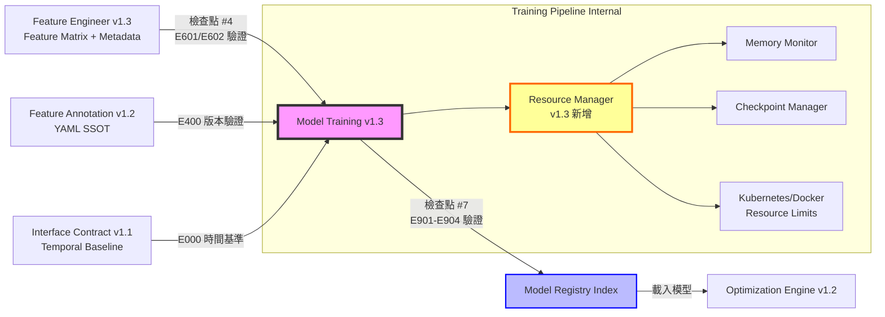

# PRD v1.3: 模型訓練管線 (Model Training Pipeline)
# 整合 Feature Annotation v1.2 + Interface Contract v1.1 + 資源管理強化

**文件版本:** v1.3 (Resource-Aware Training & Production-Ready Deployment)  
**日期:** 2026-02-14  
**負責人:** Oscar Chang  
**目標模組:** `src/training/training_pipeline.py`, `src/training/model_registry.py`, `src/training/ensemble_trainer.py`, `src/training/resource_manager.py` (新增)  
**上游契約:** 
- `src/etl/feature_engineer.py` (v1.3+, Feature Matrix Contract)
- `src/features/annotation_manager.py` (v1.2+, Feature Metadata)
- **Interface Contract v1.1** (Error Code Hierarchy E700-E749, Feature Alignment E901-E904)
**下游契約:** 
- `src/optimization/engine.py` (v1.2+, Model Registry Index)
- `src/optimization/model_interface.py` (v1.2+, Feature Vectorization)
**預估工時:** 10 ~ 12 個工程天（含資源管理、Kubernetes 部署、錯誤處理強化、完整實作細節）

---

## 1. 執行總綱與設計哲學

### 1.1 核心目標 (v1.3 強化)

建立**生產就緒 (Production-Ready)** 的模型訓練管線，支援多種訓練模式、自動化模型註冊、嚴格的特徵對齊驗證，以及**完整的資源管理能力**（回應評估報告建議）：

1. **三種訓練模式**：
   - **模式 A (System-Level Blackbox)**：訓練 `system_total_kw` 單一目標，用於 Optimization Engine 黑盒優化
   - **模式 B (Component-Level)**：獨立訓練各設備耗電模型（`chiller_1_kw`, `pump_1_kw` 等），用於診斷與分析
   - **模式 C (Hybrid)**：同時訓練 System-Level 與 Component-Level，驗證一致性（差異 >5% 警告，>15% 錯誤）

2. **自動化模型註冊與版本控制**：透過 `model_registry_index.json` 統一管理模型版本、特徵對齊資訊、與 Annotation 相容性驗證

3. **嚴格特徵對齊驗證 (Interface Contract v1.1)**：輸出 `feature_order_manifest` 與 `scaler_params`，確保 Training 與 Optimization 階段特徵順序一致（E901-E903 防護）

4. **資源管理強化 (v1.3 核心更新)**：
   - **Kubernetes 資源限制**：CPU/Memory Request/Limit、GPU 資源管理
   - **Docker 資源限制**：--memory、--cpus、--shm-size 等參數
   - **訓練過程監控**：記憶體使用追蹤、OOM 預防、檢查點自動儲存
   - **動態批次調整**：根據可用記憶體自動調整 batch size

5. **整合式 Ensemble 訓練**：自動化交叉驗證、超參數搜尋、多模型集成（XGBoost + LightGBM + Random Forest）

### 1.2 設計原則

1. **特徵對齊優先 (Alignment-First)**：訓練階段必須輸出完整的特徵順序資訊（`feature_order_manifest`），供 Optimization 階段嚴格驗證（E901 零容錯）
2. **資源感知訓練 (Resource-Aware Training)**：訓練前評估資源需求，訓練中監控資源使用，接近限制時自動降級或儲存檢查點
3. **模型可重現性 (Reproducibility)**：透過 `pinned_timestamp` 鎖定特定訓練版本，確保 Optimization 階段使用一致的模型
4. **防禦性驗證 (Defensive Validation)**：訓練前驗證 Feature Annotation 版本、訓練中驗證 Data Leakage、訓練後驗證 Hybrid 一致性
5. **錯誤代碼分層 (Error Code Hierarchy)**：嚴格遵循 Interface Contract v1.1 的 E700-E749 錯誤代碼規範

### 1.3 與上下游模組的關係



---

## 2. 介面契約規範 (Interface Contracts)

### 2.1 輸入契約 (Input Contract from Feature Engineer v1.3)

**檢查點 #4: Feature Engineer → Model Training**

| 檢查項 | 規格 | 錯誤代碼 | 處理 |
|:---|:---|:---:|:---|
| **Feature Matrix 存在** | `feature_matrix.parquet` 必須存在 | E601 | 拒絕訓練 |
| **特徵數量 > 0** | `n_features >= 1` | E603 | 拒絕訓練 |
| **樣本數量充足** | `n_samples >= 100`（可配置） | E603 | 警告或拒絕 |
| **特徵順序記錄** | 必須包含 `feature_order_manifest` | E601 | 拒絕訓練 |
| **時間戳格式** | `INT64`, `nanoseconds`, `UTC` | E302 | 拒絕訓練 |
| **Annotation 版本相容** | `annotation_context.schema_version` 必須符合 SSOT | E400 | 拒絕訓練 |
| **Data Leakage 檢查** | 驗證 `train_test_split_info.strict_past_only = True` | E305 | 警告 |
| **device_role 不存在** | Feature Matrix 不可包含 `device_role` 欄位 | E500 | 終止流程 |

### 2.2 輸出契約 (Output Contract to Optimization Engine v1.2)

**檢查點 #7: Model Training → Optimization (Model Artifact Contract)**

```python
class ModelTrainingOutputContract:
    """Model Training v1.3 輸出規範"""
    
    # 1. 模型檔案（多格式支援）
    model_artifacts: Dict[str, Path]  # {"xgboost": "model_xgb.joblib", ...}
    
    # 2. 模型註冊表索引（核心輸出）
    registry_index: Path  # model_registry_index.json
    
    # 3. 特徵對齊資訊（Interface Contract v1.1 檢查點 #7）
    feature_manifest: FeatureManifest  # feature_manifest.json
    
    # 4. 縮放參數（E602 合規）
    scaler_params: Dict  # StandardScaler 參數
    
    # 5. 訓練元資料
    training_metadata: TrainingMetadata
    
    # 6. 資源使用記錄（v1.3 新增）
    resource_usage: ResourceUsageReport

class FeatureManifest(BaseModel):
    """特徵對齊資訊（Interface Contract v1.1 第9章實作）"""
    manifest_version: str = "2.0-ALIGN"
    created_at: datetime
    pipeline_origin_timestamp: datetime
    
    feature_specification: Dict = {
        "feature_names": List[str],  # 明確順序列表
        "feature_count": int,
        "feature_hash": str,  # SHA256 of feature_names
        "hash_algorithm": "SHA256"
    }
    
    scaling_specification: Dict = {
        "scaler_type": str,  # "StandardScaler"
        "scaler_params": {
            "mean_": List[float],
            "scale_": List[float],
            "var_": List[float]
        },
        "scaler_feature_names": List[str]  # 與 feature_names 順序一致
    }
    
    equipment_constraints: Dict = {
        "constraints_applied": List[str],
        "validation_enabled": bool,
        "constraint_hash": str
    }
    
    validation_rules: Dict = {
        "allow_subset": False,
        "allow_superset": False,
        "strict_order": True,
        "case_sensitive": True,
        "validate_equipment_constraints": True
    }

class TrainingMetadata(BaseModel):
    """訓練元資料"""
    training_mode: Literal["system_only", "component_only", "hybrid"]
    target_variables: List[str]
    model_types: List[str]  # ["xgboost", "lightgbm", "random_forest"]
    
    # 交叉驗證結果
    cv_results: Dict[str, float]  # {"mape": 3.2, "rmse": 15.5, ...}
    best_model: str
    
    # Annotation 相容性
    annotation_checksum: str
    schema_version: str
    
    # 時間戳
    training_start: datetime
    training_end: datetime
    training_duration_seconds: float

class ResourceUsageReport(BaseModel):
    """資源使用報告（v1.3 新增）"""
    peak_memory_gb: float
    average_memory_gb: float
    peak_cpu_percent: float
    gpu_memory_gb: Optional[float]
    
    # Kubernetes 資源限制（若適用）
    k8s_memory_request: Optional[str]
    k8s_memory_limit: Optional[str]
    k8s_cpu_request: Optional[str]
    k8s_cpu_limit: Optional[str]
    
    # Docker 資源限制（若適用）
    docker_memory_limit: Optional[str]
    docker_cpus_limit: Optional[float]
    
    # 資源效率指標
    memory_efficiency: float  # 實際使用 / 限制上限
    training_throughput: float  # samples/second
```

### 2.3 Model Registry Index 規格

```python
class ModelRegistryIndex(BaseModel):
    """模型註冊表索引（Optimization Engine 載入入口）"""
    
    schema_version: str = "1.3"
    site_id: str
    created_at: datetime
    
    # Annotation 相容性驗證
    annotation_checksum: str
    schema_version: str
    
    # 可用模型列表
    available_models: Dict[str, ModelEntry]
    
    # 特徵對齊資訊（複製自 feature_manifest）
    feature_manifest: FeatureManifest
    
    # 訓練配置摘要
    training_config_summary: Dict

class ModelEntry(BaseModel):
    """單一模型條目"""
    target_id: str  # "system_total_kw", "chiller_1_kw", ...
    model_type: str  # "xgboost", "lightgbm", "random_forest"
    model_path: str  # 相對路徑，如 "system_total_kw/xgboost_20260214_120000.joblib"
    
    # 效能指標
    metrics: Dict[str, float]  # {"mape": 3.2, "rmse": 15.5, "r2": 0.95}
    
    # 交叉驗證結果
    cv_scores: Dict[str, List[float]]
    cv_mean: float
    cv_std: float
    
    # 特徵重要性（前10名）
    feature_importance: List[Dict[str, Any]]
    
    # 檔案完整性
    file_checksum: str  # SHA256 of model file
    created_at: datetime
    optional: bool = False  # 若為 True，Optimization 可選擇性使用
```

---

## 3. 資源管理系統 (Resource Management System) - v1.3 核心新增

### 3.1 資源管理架構

```python
class ResourceManager:
    """
    資源管理器（v1.3 新增核心元件）
    負責訓練前資源評估、訓練中監控、OOM 預防、檢查點管理
    """
    
    def __init__(
        self,
        config: ResourceConfig,
        training_config: TrainingConfig
    ):
        self.config = config
        self.training_config = training_config
        self.monitor = ResourceMonitor(config)
        self.checkpoint_manager = CheckpointManager(config.checkpoint_config)
        
    def estimate_resource_requirements(
        self,
        n_samples: int,
        n_features: int,
        model_types: List[str]
    ) -> ResourceEstimate:
        """
        預估訓練所需資源
        
        公式：
        - 記憶體需求 = 基礎記憶體 + (樣本數 × 特徵數 × 每特徵位元組) × 模型係數
        - XGBoost: 3x 係數（稀疏矩陣處理）
        - LightGBM: 2x 係數
        - Random Forest: 4x 係數（多棵樹儲存）
        """
        base_memory_gb = 2.0  # Python runtime + overhead
        bytes_per_feature = 8  # float64
        
        data_memory_gb = (n_samples * n_features * bytes_per_feature) / (1024**3)
        
        model_coefficients = {
            "xgboost": 3.0,
            "lightgbm": 2.0,
            "random_forest": 4.0
        }
        
        max_coefficient = max(model_coefficients[m] for m in model_types)
        estimated_memory_gb = base_memory_gb + data_memory_gb * max_coefficient
        
        # 安全邊際 20%
        recommended_memory_gb = estimated_memory_gb * 1.2
        
        return ResourceEstimate(
            estimated_memory_gb=estimated_memory_gb,
            recommended_memory_gb=recommended_memory_gb,
            estimated_cpu_cores=min(8, max(2, int(n_samples / 10000))),
            estimated_duration_minutes=self._estimate_duration(n_samples, model_types)
        )
    
    def validate_resource_limits(self, estimate: ResourceEstimate) -> ValidationResult:
        """
        驗證當前環境資源限制是否足夠
        
        檢查項目：
        1. Kubernetes Memory Limit
        2. Docker Memory Limit
        3. 可用磁碟空間（檢查點儲存）
        """
        results = []
        
        # 檢查 Kubernetes 限制
        k8s_limit = self._get_kubernetes_memory_limit()
        if k8s_limit and estimate.recommended_memory_gb > k8s_limit:
            results.append(ValidationIssue(
                severity="error",
                code="E711",
                message=f"預估記憶體需求 {estimate.recommended_memory_gb:.1f}GB 超過 K8s Limit {k8s_limit}GB"
            ))
        
        # 檢查 Docker 限制
        docker_limit = self._get_docker_memory_limit()
        if docker_limit and estimate.recommended_memory_gb > docker_limit:
            results.append(ValidationIssue(
                severity="error",
                code="E712",
                message=f"預估記憶體需求 {estimate.recommended_memory_gb:.1f}GB 超過 Docker Limit {docker_limit}GB"
            ))
        
        # 檢查磁碟空間
        disk_space_gb = self._get_available_disk_space()
        required_disk_gb = estimate.recommended_memory_gb * 0.5  # 檢查點需要約 50% 記憶體
        if disk_space_gb < required_disk_gb:
            results.append(ValidationIssue(
                severity="warning",
                code="W701",
                message=f"可用磁碟空間 {disk_space_gb:.1f}GB 可能不足以儲存檢查點（建議 {required_disk_gb:.1f}GB）"
            ))
        
        return ValidationResult(is_valid=len([r for r in results if r.severity == "error"]) == 0, issues=results)
```

### 3.2 Kubernetes 資源配置

```yaml
# k8s/training-job-template.yaml
apiVersion: batch/v1
kind: Job
metadata:
  name: model-training-{{site_id}}-{{timestamp}}
spec:
  template:
    spec:
      containers:
      - name: training
        image: hvac-analytics/training:v1.3
        resources:
          # 資源請求（Request）：排程依據
          requests:
            memory: "4Gi"          # 根據預估動態調整
            cpu: "2000m"           # 2 CPU cores
            ephemeral-storage: "10Gi"
          # 資源限制（Limit）：硬性上限
          limits:
            memory: "8Gi"          # OOM 前強制終止
            cpu: "4000m"           # 4 CPU cores
            ephemeral-storage: "20Gi"
          # GPU 支援（若需要）
          # limits:
          #   nvidia.com/gpu: "1"
        env:
        - name: K8S_MEMORY_REQUEST
          valueFrom:
            resourceFieldRef:
              containerName: training
              resource: requests.memory
        - name: K8S_MEMORY_LIMIT
          valueFrom:
            resourceFieldRef:
              containerName: training
              resource: limits.memory
        - name: K8S_CPU_REQUEST
          valueFrom:
            resourceFieldRef:
              containerName: training
              resource: requests.cpu
        - name: K8S_CPU_LIMIT
          valueFrom:
            resourceFieldRef:
              containerName: training
              resource: limits.cpu
        # 記憶體壓力時的行為
        - name: TRAINING_CHECKPOINT_ON_MEMORY_PRESSURE
          value: "true"
        - name: MEMORY_PRESSURE_THRESHOLD_PERCENT
          value: "85"
        # 優雅終止
        lifecycle:
          preStop:
            exec:
              command: ["/bin/sh", "-c", "python -c 'from src.training.checkpoint import save_emergency_checkpoint; save_emergency_checkpoint()'"]
      # 優先級與搶佔
      priorityClassName: training-priority
      # 節點親和性（確保足夠資源）
      affinity:
        nodeAffinity:
          requiredDuringSchedulingIgnoredDuringExecution:
            nodeSelectorTerms:
            - matchExpressions:
              - key: node-type
                operator: In
                values: ["training-node"]
      # 容忍度
      tolerations:
      - key: "dedicated"
        operator: "Equal"
        value: "training"
        effect: "NoSchedule"
      restartPolicy: Never
  backoffLimit: 2  # 失敗後最多重試 2 次
  activeDeadlineSeconds: 7200  # 2 小時超時
```

### 3.3 Docker 資源配置

```dockerfile
# Dockerfile.training (v1.3 更新)
FROM python:3.11-slim

# 安裝系統依賴
RUN apt-get update && apt-get install -y \
    build-essential \
    libgomp1 \
    && rm -rf /var/lib/apt/lists/*

# 設定 Python 記憶體管理環境變數
ENV PYTHONUNBUFFERED=1
ENV MALLOC_ARENA_MAX=2  # 減少記憶體碎片
ENV MALLOC_MMAP_THRESHOLD_=131072
ENV MALLOC_TRIM_THRESHOLD_=131072
ENV MALLOC_TOP_PAD_=131072

# 安裝 Python 依賴
COPY requirements-training.txt .
RUN pip install --no-cache-dir -r requirements-training.txt

# 複製程式碼
COPY src/ /app/src/
COPY config/ /app/config/

WORKDIR /app

# 預設執行訓練
ENTRYPOINT ["python", "-m", "src.training.training_pipeline"]
```

```bash
# Docker 執行範例（含資源限制）
docker run \
  --name hvac-training \
  --memory="8g" \
  --memory-swap="8g" \
  --cpus="4.0" \
  --shm-size="2g" \
  --oom-kill-disable=false \
  --restart=no \
  -v $(pwd)/data:/app/data:ro \
  -v $(pwd)/models:/app/models:rw \
  -v $(pwd)/checkpoints:/app/checkpoints:rw \
  -e TRAINING_MODE=hybrid \
  -e SITE_ID=cgmh_ty \
  -e MEMORY_LIMIT_GB=8 \
  -e CPU_LIMIT=4 \
  hvac-analytics/training:v1.3 \
  --config /app/config/training/cgmh_ty.yaml
```

### 3.4 資源監控與檢查點管理

```python
class ResourceMonitor:
    """
    資源監控器（v1.3 新增）
    持續監控訓練過程中的資源使用，接近限制時觸發檢查點
    """
    
    def __init__(
        self,
        config: ResourceConfig,
        checkpoint_manager: CheckpointManager
    ):
        self.config = config
        self.checkpoint_manager = checkpoint_manager
        self.process = psutil.Process()
        self.peak_memory_gb = 0.0
        self.monitoring = False
        self.monitor_thread = None
        
    def start_monitoring(self):
        """啟動背景監控執行緒"""
        self.monitoring = True
        self.monitor_thread = threading.Thread(target=self._monitor_loop)
        self.monitor_thread.daemon = True
        self.monitor_thread.start()
        
    def _monitor_loop(self):
        """監控迴圈（每 5 秒執行一次）"""
        while self.monitoring:
            try:
                memory_info = self.process.memory_info()
                current_memory_gb = memory_info.rss / (1024 ** 3)
                self.peak_memory_gb = max(self.peak_memory_gb, current_memory_gb)
                
                # 檢查記憶體壓力
                memory_limit_gb = self._get_memory_limit_gb()
                if memory_limit_gb > 0:
                    usage_percent = (current_memory_gb / memory_limit_gb) * 100
                    
                    if usage_percent >= self.config.memory_pressure_threshold_percent:
                        self._handle_memory_pressure(current_memory_gb, memory_limit_gb)
                        
            except Exception as e:
                logger.warning(f"資源監控異常: {e}")
                
            time.sleep(5)
    
    def _handle_memory_pressure(self, current_gb: float, limit_gb: float):
        """
        處理記憶體壓力情況
        
        策略：
        1. 記錄警告
        2. 觸發緊急檢查點
        3. 若超過 95%，嘗試降低 batch size 或提前終止
        """
        usage_percent = (current_gb / limit_gb) * 100
        logger.warning(f"記憶體壓力警告: {current_gb:.1f}GB / {limit_gb:.1f}GB ({usage_percent:.1f}%)")
        
        # 觸發檢查點
        self.checkpoint_manager.save_emergency_checkpoint()
        
        # 嚴重壓力時採取更激進措施
        if usage_percent >= 95:
            logger.error(f"記憶體使用接近上限 ({usage_percent:.1f}%)，考慮終止訓練")
            # 通知訓練管線降低負載或提前終止
            raise MemoryPressureError(f"E706: 記憶體壓力過高: {usage_percent:.1f}%")
    
    def stop_monitoring(self) -> ResourceUsageSummary:
        """停止監控並回傳摘要"""
        self.monitoring = False
        if self.monitor_thread:
            self.monitor_thread.join(timeout=10)
            
        return ResourceUsageSummary(
            peak_memory_gb=self.peak_memory_gb,
            average_memory_gb=self._calculate_average_memory(),
            memory_limit_gb=self._get_memory_limit_gb(),
            memory_efficiency=self.peak_memory_gb / self._get_memory_limit_gb() if self._get_memory_limit_gb() > 0 else 0
        )

class CheckpointManager:
    """
    檢查點管理器（v1.3 新增）
    負責定期儲存訓練狀態，支援從檢查點恢復
    """
    
    def __init__(self, config: CheckpointConfig):
        self.config = config
        self.checkpoint_dir = Path(config.checkpoint_dir)
        self.checkpoint_dir.mkdir(parents=True, exist_ok=True)
        self.last_checkpoint_time = None
        
    def save_checkpoint(
        self,
        model_trainer: Any,
        iteration: int,
        metrics: Dict[str, float],
        is_emergency: bool = False
    ) -> Path:
        """
        儲存訓練檢查點
        
        Args:
            model_trainer: 模型訓練器實例
            iteration: 當前迭代次數
            metrics: 當前效能指標
            is_emergency: 是否為緊急檢查點（記憶體壓力觸發）
        """
        timestamp = datetime.now().strftime("%Y%m%d_%H%M%S")
        prefix = "emergency" if is_emergency else "checkpoint"
        checkpoint_path = self.checkpoint_dir / f"{prefix}_{iteration:06d}_{timestamp}.pkl"
        
        checkpoint_data = {
            "iteration": iteration,
            "timestamp": timestamp,
            "model_states": model_trainer.get_model_states(),
            "metrics": metrics,
            "random_state": random.getstate(),
            "numpy_random_state": np.random.get_state()
        }
        
        # 原子寫入
        temp_path = checkpoint_path.with_suffix(".tmp")
        with open(temp_path, "wb") as f:
            pickle.dump(checkpoint_data, f)
        temp_path.rename(checkpoint_path)
        
        self.last_checkpoint_time = datetime.now()
        logger.info(f"檢查點已儲存: {checkpoint_path}")
        
        # 清理舊檢查點
        self._cleanup_old_checkpoints()
        
        return checkpoint_path
    
    def load_checkpoint(self, checkpoint_path: Path) -> Dict:
        """載入檢查點"""
        with open(checkpoint_path, "rb") as f:
            return pickle.load(f)
    
    def _cleanup_old_checkpoints(self):
        """清理舊檢查點，保留最近 N 個"""
        checkpoints = sorted(
            self.checkpoint_dir.glob("checkpoint_*.pkl"),
            key=lambda x: x.stat().st_mtime,
            reverse=True
        )
        
        for old_checkpoint in checkpoints[self.config.max_checkpoints_to_keep:]:
            old_checkpoint.unlink()
            logger.debug(f"已刪除舊檢查點: {old_checkpoint}")
```

---

## 4. 訓練管線實作 (Training Pipeline Implementation)

### 4.1 主訓練管線

```python
class TrainingPipeline:
    """
    模型訓練管線 v1.3
    整合資源管理、特徵對齊驗證、多模式訓練
    """
    
    def __init__(
        self,
        config: TrainingConfig,
        resource_config: ResourceConfig
    ):
        self.config = config
        self.resource_manager = ResourceManager(resource_config, config)
        self.model_registry = ModelRegistry(config.model_registry_dir)
        self.ensemble_trainer = EnsembleTrainer(config.ensemble_config)
        
        # 錯誤代碼註冊（Interface Contract v1.1）
        self.error_codes = {
            "E701": "TRAINING_MEMORY_ERROR",
            "E702": "VALIDATION_FAILURE",
            "E703": "HYPERPARAMETER_INVALID",
            "E704": "CHECKPOINT_SAVE_FAILED",
            "E705": "CROSS_VALIDATION_ERROR",
            "E706": "MODEL_ARTIFACT_CORRUPTED",
            "E707": "FEATURE_MATRIX_INVALID",
            "E708": "ANNOTATION_VERSION_MISMATCH",
            "E709": "INSUFFICIENT_DATA",
            "E710": "HYBRID_INCONSISTENCY_ERROR",
            "E711": "K8S_MEMORY_LIMIT_EXCEEDED",
            "E712": "DOCKER_MEMORY_LIMIT_EXCEEDED",
            "E713": "RESOURCE_VALIDATION_FAILED"
        }
        
    def run(
        self,
        feature_matrix: pl.DataFrame,
        target_column: str,
        annotation_manager: FeatureAnnotationManager
    ) -> ModelTrainingOutputContract:
        """
        執行完整訓練流程
        
        流程：
        1. 資源評估與驗證
        2. 輸入驗證（檢查點 #4）
        3. 特徵工程驗證（E601/E602）
        4. 模型訓練（含資源監控）
        5. 交叉驗證
        6. Hybrid 一致性檢查（若適用）
        7. 模型註冊與輸出（檢查點 #7）
        """
        training_start = datetime.now(timezone.utc)
        
        try:
            # Phase 0: 資源評估與驗證
            self._phase0_resource_validation(feature_matrix)
            
            # Phase 1: 輸入驗證
            self._phase1_input_validation(feature_matrix, annotation_manager)
            
            # Phase 2: 準備訓練資料
            X_train, X_test, y_train, y_test = self._phase2_prepare_data(feature_matrix, target_column)
            
            # Phase 3: 訓練模型（含資源監控）
            trained_models = self._phase3_train_models(X_train, y_train)
            
            # Phase 4: 評估與驗證
            evaluation_results = self._phase4_evaluate_models(trained_models, X_test, y_test)
            
            # Phase 5: Hybrid 一致性檢查（若適用）
            if self.config.training_mode == "hybrid":
                self._phase5_hybrid_consistency_check(trained_models, X_test)
            
            # Phase 6: 輸出模型產物
            output = self._phase6_generate_output(
                trained_models,
                evaluation_results,
                feature_matrix,
                training_start
            )
            
            return output
            
        except Exception as e:
            self._handle_training_error(e)
            raise
    
    def _phase0_resource_validation(self, feature_matrix: pl.DataFrame):
        """Phase 0: 資源評估與驗證"""
        n_samples = len(feature_matrix)
        n_features = len(feature_matrix.columns) - 1  # 排除 timestamp
        
        # 預估資源需求
        estimate = self.resource_manager.estimate_resource_requirements(
            n_samples=n_samples,
            n_features=n_features,
            model_types=self.config.ensemble_config.model_types
        )
        
        logger.info(f"預估資源需求: {estimate.recommended_memory_gb:.1f}GB 記憶體, "
                   f"{estimate.estimated_cpu_cores} CPU cores, "
                   f"預計耗時 {estimate.estimated_duration_minutes:.0f} 分鐘")
        
        # 驗證資源限制
        validation = self.resource_manager.validate_resource_limits(estimate)
        
        if not validation.is_valid:
            for issue in validation.issues:
                if issue.severity == "error":
                    raise ResourceValidationError(f"{issue.code}: {issue.message}")
                else:
                    logger.warning(f"{issue.code}: {issue.message}")
    
    def _phase1_input_validation(
        self,
        feature_matrix: pl.DataFrame,
        annotation_manager: FeatureAnnotationManager
    ):
        """Phase 1: 輸入驗證（檢查點 #4）"""
        # E601: 驗證 feature_order_manifest
        if "feature_order_manifest" not in feature_matrix.attrs:
            raise TrainingValidationError("E601: 缺少 feature_order_manifest")
        
        # E400: 驗證 Annotation 版本
        expected_version = FEATURE_ANNOTATION_CONSTANTS["expected_schema_version"]
        actual_version = annotation_manager.schema_version
        if actual_version != expected_version:
            raise TrainingValidationError(
                f"E708: Annotation 版本不符。期望: {expected_version}, 實際: {actual_version}"
            )
        
        # E603: 驗證資料充足性
        n_samples = len(feature_matrix)
        if n_samples < self.config.min_samples_required:
            raise TrainingValidationError(
                f"E709: 樣本數不足。需要至少 {self.config.min_samples_required} 筆，實際 {n_samples} 筆"
            )
        
        # E500: 驗證 device_role 不存在
        if "device_role" in feature_matrix.columns:
            raise TrainingValidationError("E500: Feature Matrix 包含禁止欄位 'device_role'")
    
    def _phase3_train_models(self, X_train: np.ndarray, y_train: np.ndarray) -> Dict[str, Any]:
        """Phase 3: 訓練模型（含資源監控）"""
        # 啟動資源監控
        self.resource_manager.monitor.start_monitoring()
        
        try:
            # 訓練集成模型
            trained_models = self.ensemble_trainer.train(X_train, y_train)
            
            return trained_models
            
        finally:
            # 停止資源監控並記錄
            resource_summary = self.resource_manager.monitor.stop_monitoring()
            logger.info(f"訓練資源使用: 峰值記憶體 {resource_summary.peak_memory_gb:.1f}GB, "
                       f"效率 {resource_summary.memory_efficiency*100:.1f}%")
    
    def _phase5_hybrid_consistency_check(
        self,
        trained_models: Dict[str, Any],
        X_test: np.ndarray
    ):
        """Phase 5: Hybrid 模式一致性檢查"""
        # 取得 System-Level 預測
        system_model = trained_models.get("system_total_kw")
        if not system_model:
            return
        
        system_pred = system_model.predict(X_test)
        
        # 取得 Component-Level 預測並加總
        component_preds = []
        for target_id, model in trained_models.items():
            if target_id != "system_total_kw":
                component_preds.append(model.predict(X_test))
        
        if component_preds:
            component_sum = np.sum(component_preds, axis=0)
            
            # 計算差異百分比
            discrepancy = np.abs(system_pred - component_sum) / system_pred * 100
            max_discrepancy = np.max(discrepancy)
            
            if max_discrepancy > 15:
                raise HybridInconsistencyError(
                    f"E710: Hybrid 模式嚴重不一致。System 與 Component 預測差異 {max_discrepancy:.1f}% > 15%"
                )
            elif max_discrepancy > 5:
                logger.warning(f"W702: Hybrid 模式不一致警告。差異 {max_discrepancy:.1f}% > 5%")
    
    def _phase6_generate_output(
        self,
        trained_models: Dict[str, Any],
        evaluation_results: Dict[str, Any],
        feature_matrix: pl.DataFrame,
        training_start: datetime
    ) -> ModelTrainingOutputContract:
        """Phase 6: 產生輸出產物"""
        # 產生 feature_manifest
        feature_manifest = self._generate_feature_manifest(feature_matrix)
        
        # 產生 scaler_params
        scaler_params = self.ensemble_trainer.get_scaler_params()
        
        # 儲存模型檔案
        model_artifacts = {}
        for target_id, model in trained_models.items():
            model_path = self._save_model(model, target_id)
            model_artifacts[target_id] = model_path
        
        # 產生 Model Registry Index
        registry_index = self.model_registry.create_index(
            site_id=self.config.site_id,
            model_artifacts=model_artifacts,
            evaluation_results=evaluation_results,
            feature_manifest=feature_manifest,
            annotation_manager=self.annotation_manager
        )
        
        # 產生資源使用報告
        resource_usage = self._generate_resource_usage_report()
        
        return ModelTrainingOutputContract(
            model_artifacts=model_artifacts,
            registry_index=registry_index,
            feature_manifest=feature_manifest,
            scaler_params=scaler_params,
            training_metadata=self._generate_training_metadata(training_start),
            resource_usage=resource_usage
        )
```

---

## 5. 配置模型完整實作 (Configuration Models)

### 5.1 統一訓練配置模型

**檔案**: `src/training/config_models.py`

```python
from typing import Dict, List, Optional, Literal, Final, Union, Tuple, Any
from pydantic import BaseModel, Field, validator, root_validator
from datetime import datetime
import logging

from src.etl.config_models import (
    VALID_QUALITY_FLAGS,
    TIMESTAMP_CONFIG,
    FEATURE_ANNOTATION_CONSTANTS
)

EXPECTED_SCHEMA_VERSION: Final[str] = FEATURE_ANNOTATION_CONSTANTS['expected_schema_version']

# ==========================================
# 模型特定超參數配置
# ==========================================

class XGBoostConfig(BaseModel):
    """XGBoost 專屬配置 - Level-wise 生長策略，精度導向"""
    n_estimators: int = 1000
    learning_rate: float = 0.05
    max_depth: int = 6
    min_child_weight: int = 1
    subsample: float = 0.8
    colsample_bytree: float = 0.8
    reg_alpha: float = 0.1  # L1 正則
    reg_lambda: float = 1.0  # L2 正則
    gamma: float = 0  # 節點分裂最小損失減少
    early_stopping_rounds: int = 50
    eval_metric: str = "rmse"
    tree_method: str = "hist"  # 'exact', 'approx', 'hist'
    
    # 小樣本適應（當 n_samples < 500 時自動調整）
    small_sample_adjustments: Dict[str, Any] = {
        "max_depth": 3,
        "min_child_weight": 5,
        "subsample": 0.9
    }
    
    # 進階功能
    enable_monotonic_constraints: bool = False
    monotone_constraints: Optional[Dict[str, int]] = None

class LightGBMConfig(BaseModel):
    """LightGBM 專屬配置 - Leaf-wise 生長策略，速度導向"""
    n_estimators: int = 1000
    learning_rate: float = 0.05
    num_leaves: int = 31  # 控制模型複雜度，相當於 2^max_depth
    max_depth: int = -1  # -1 表示無限制，由 num_leaves 控制
    min_child_samples: int = 20
    subsample: float = 0.8
    colsample_bytree: float = 0.8
    reg_alpha: float = 0.1
    reg_lambda: float = 1.0
    early_stopping_rounds: int = 50
    eval_metric: str = "rmse"
    boosting_type: str = "gbdt"  # 'gbdt', 'dart', 'goss'
    
    # 大規模資料優化
    feature_pre_filter: bool = False
    histogram_pool_size: Optional[int] = None  # 記憶體限制時設定

class RandomForestConfig(BaseModel):
    """Random Forest 專屬配置 - Bagging 策略，鲁棒性導向"""
    n_estimators: int = 500
    max_depth: Optional[int] = None  # None 表示完全生長
    min_samples_split: int = 5
    min_samples_leaf: int = 2
    max_features: str = "sqrt"  # 'sqrt', 'log2', None
    bootstrap: bool = True
    oob_score: bool = True  # Out-of-Bag 驗證
    n_jobs: int = -1  # 使用所有 CPU
    warm_start: bool = False  # 可增量訓練
    
    # 區間預測（使用樹的葉節點統計）
    quantile_regression: bool = False  # 若啟用，訓練三個模型 (Q10, Q50, Q90)

# ==========================================
# 資源管理配置（v1.3 擴充）
# ==========================================

class ResourceConfig(BaseModel):
    """硬體資源與記憶體管理配置（v1.3 完整版）"""
    
    # 記憶體安全閾值
    memory_safety_threshold: float = 0.3  # 保留 30% 系統記憶體作為緩衝
    parallel_training: bool = True  # 是否嘗試並行訓練
    max_parallel_workers: int = 3  # 最大平行工作進程
    
    # 動態降級策略
    auto_fallback_to_sequential: bool = True  # 記憶體不足時自動降級為序列訓練
    memory_check_before_training: bool = True  # 訓練前強制檢查記憶體
    
    # 小樣本處理
    small_sample_fallback: Literal['disable_lightgbm', 'use_rf_only', 'abort'] = 'disable_lightgbm'
    
    # 批次訓練資源控制
    batch_training_memory_limit: float = 0.8  # 批次訓練時單一模型記憶體上限
    max_concurrent_targets: int = 2  # 同時訓練的最大目標數（防止 OOM）
    
    # v1.3 新增：Kubernetes 資源配置
    k8s_memory_request: str = "4Gi"
    k8s_memory_limit: str = "8Gi"
    k8s_cpu_request: str = "2000m"
    k8s_cpu_limit: str = "4000m"
    
    # v1.3 新增：Docker 資源配置
    docker_memory_limit: str = "8g"
    docker_cpus_limit: float = 4.0
    docker_shm_size: str = "2g"
    
    # v1.3 新增：檢查點配置
    checkpoint_config: CheckpointConfig = CheckpointConfig()
    
    # v1.3 新增：記憶體壓力閾值
    memory_pressure_threshold_percent: float = 85.0  # 超過此值觸發檢查點
    
    @validator('memory_safety_threshold')
    def validate_threshold(cls, v):
        if not 0.1 <= v <= 0.8:
            raise ValueError("記憶體安全閾值必須在 0.1~0.8 之間")
        return v

class CheckpointConfig(BaseModel):
    """檢查點配置（v1.3 新增）"""
    checkpoint_dir: str = "checkpoints"
    max_checkpoints_to_keep: int = 5
    checkpoint_interval_minutes: int = 30
    enable_emergency_checkpoint: bool = True

# ==========================================
# 訓練管線主配置（v1.3 擴充）
# ==========================================

class ModelTrainingConfig(BaseModel):
    """模型訓練統一配置（v1.3 完整版）"""
    
    # 基本配置
    random_state: int = 42
    site_id: str = "default"
    
    # 時序配置
    temporal_split: TemporalSplitConfig = TemporalSplitConfig()
    
    # Device Role 處理
    device_role_handling: DeviceRoleHandlingConfig = DeviceRoleHandlingConfig()
    
    # 特徵工程（訓練期）
    handle_missing_values: Literal["drop", "impute_mean", "impute_median"] = "impute_median"
    scale_features: bool = True
    
    # Quality Flags 處理
    use_quality_flags_as_features: bool = True
    exclude_bad_quality_samples: bool = True
    
    # 三模型配置
    xgboost: XGBoostConfig = XGBoostConfig()
    lightgbm: LightGBMConfig = LightGBMConfig()
    random_forest: RandomForestConfig = RandomForestConfig()
    
    # 資源管理（v1.3）
    resource: ResourceConfig = ResourceConfig()
    
    # 模型特定最小樣本數閾值（依演算法特性區分）
    min_samples_threshold: Dict[str, int] = {
        'random_forest': 100,
        'xgboost': 500,
        'lightgbm': 1000
    }
    
    # 最小樣本需求（通用）
    min_samples_required: int = 100
    
    # 超參數搜尋（夜間模式）
    enable_hyperparameter_search: bool = False
    hyperparameter_mode: Literal['disabled', 'daytime_quick', 'overnight_deep'] = 'disabled'
    hyperparameter_trials: int = 50
    hyperparameter_timeout: int = 3600  # 秒
    hyperparameter_storage: str = "optuna_studies.db"  # SQLite 儲存路徑
    
    # 可解釋性
    enable_explainability: bool = False  # 是否啟用 SHAP
    shap_background_samples: int = 100   # SHAP 背景資料取樣數
    
    # 多目標與輸出控制
    training_mode: Literal["single_target", "multi_target", "hybrid"] = "single_target"
    output_structure: Literal["flat", "hierarchical"] = "hierarchical"
    generate_registry_index: bool = True  # 自動產生 model_registry_index.json
    
    # 輸出
    model_output_dir: str = "models/trained"
    metadata_output_dir: str = "models/metadata"
    
    @validator('device_role_handling')
    def validate_no_feature_leakage(cls, v):
        if v.use_as_feature:
            raise ValueError("E701: device_role 禁止作為直接特徵輸入")
        return v
    
    def get_eligible_models(self, n_samples: int) -> List[str]:
        """
        依樣本數動態決定可用模型列表
        回傳: ['random_forest', 'xgboost', 'lightgbm'] 的子集
        """
        eligible = []
        logger = logging.getLogger(__name__)
        
        for model_name, threshold in self.min_samples_threshold.items():
            if n_samples >= threshold:
                eligible.append(model_name)
            else:
                logger.warning(
                    f"⚠️ 樣本數 {n_samples} 低於 {model_name} 門檻 ({threshold})，已排除"
                )
        
        if not eligible:
            raise ValueError(f"E607: 樣本數 {n_samples} 低於所有模型最低要求")
        
        # 應用小樣本降級策略
        if n_samples < self.min_samples_threshold['lightgbm']:
            if self.resource.small_sample_fallback == 'disable_lightgbm':
                eligible = [m for m in eligible if m != 'lightgbm']
            elif self.resource.small_sample_fallback == 'use_rf_only':
                eligible = ['random_forest']
        
        return eligible
    
    def adjust_for_small_sample(self, model_name: str, n_samples: int) -> BaseModel:
        """取得針對小樣本調整後的模型配置"""
        config = getattr(self, model_name)
        
        if model_name == 'xgboost' and n_samples < 500:
            # 應用小樣本調整
            adjusted = config.copy()
            for key, val in config.small_sample_adjustments.items():
                setattr(adjusted, key, val)
            return adjusted
        
        return config
```

---

## 6. 模型訓練器完整實作 (Model Trainers)

### 6.1 基礎訓練器類別

**檔案**: `src/training/trainers/base_trainer.py`

```python
from abc import ABC, abstractmethod
from typing import Dict, Any, Tuple, Optional, List
import numpy as np
from sklearn.metrics import mean_squared_error, r2_score, mean_absolute_error

class BaseModelTrainer(ABC):
    """
    模型訓練器抽象基礎類別 (v1.3)
    支援常規訓練、增量學習預留、以及可解釋性介面
    """
    
    def __init__(self, config: Any, random_state: int = 42, target_id: str = "default"):
        self.config = config
        self.random_state = random_state
        self.target_id = target_id
        self.model = None
        self.feature_importance = {}
        self.training_history = {}
        self.is_fitted = False
        
        # 模型元資訊
        self.model_metadata = {
            'trainer_version': '1.3',
            'supports_incremental': False,
            'supports_explainability': False,
            'target_id': target_id,
            'model_family': 'unknown'
        }
    
    @abstractmethod
    def train(
        self, 
        X_train: np.ndarray, 
        y_train: np.ndarray,
        X_val: np.ndarray,
        y_val: np.ndarray,
        sample_weights: Optional[np.ndarray] = None,
        feature_names: Optional[List[str]] = None
    ) -> Dict[str, Any]:
        """
        執行模型訓練
        
        Returns:
            Dict 包含:
            - model: 訓練好的模型物件
            - best_iteration: 最佳迭代次數（梯度提升類）
            - training_history: 訓練過程指標
            - feature_importance: 特徵重要性字典
            - oob_score: Out-of-Bag 分數（若有）
        """
        pass
    
    def partial_fit(self, X_new: np.ndarray, y_new: np.ndarray, 
                    sample_weight: Optional[np.ndarray] = None) -> Dict[str, Any]:
        """
        增量學習介面
        
        Raises:
            NotImplementedError: 若模型不支援增量學習
        """
        raise NotImplementedError(
            f"{self.__class__.__name__} 不支援增量學習（partial_fit）"
        )
    
    @abstractmethod
    def predict(self, X: np.ndarray) -> np.ndarray:
        """執行預測"""
        pass
    
    @abstractmethod
    def get_feature_importance(self) -> Dict[str, float]:
        """取得標準化特徵重要性（總和為1）"""
        pass
    
    def evaluate(self, X: np.ndarray, y_true: np.ndarray) -> Dict[str, float]:
        """統一評估指標"""
        y_pred = self.predict(X)
        
        # 防止除以零（MAPE）
        mape_mask = y_true != 0
        mape = np.mean(np.abs((y_true[mape_mask] - y_pred[mape_mask]) / y_true[mape_mask])) * 100 if np.any(mape_mask) else float('inf')
        
        return {
            'rmse': np.sqrt(mean_squared_error(y_true, y_pred)),
            'mae': mean_absolute_error(y_true, y_pred),
            'r2': r2_score(y_true, y_pred),
            'mape': mape
        }
    
    def get_model_info(self) -> Dict[str, Any]:
        """取得模型元資訊（用於日誌與儲存）"""
        return {
            'trainer_class': self.__class__.__name__,
            'is_fitted': self.is_fitted,
            'supports_incremental': self.model_metadata['supports_incremental'],
            'supports_explainability': self.model_metadata['supports_explainability'],
            'target_id': self.target_id,
            'model_family': self.model_metadata['model_family'],
            'config': self.config.dict() if hasattr(self.config, 'dict') else str(self.config)
        }
```

### 6.2 XGBoost 訓練器

**檔案**: `src/training/trainers/xgboost_trainer.py`

```python
import xgboost as xgb
import numpy as np
from typing import Dict, Any, Optional, List
from src.training.trainers.base_trainer import BaseModelTrainer

class XGBoostTrainer(BaseModelTrainer):
    """
    XGBoost 訓練器實作 (v1.3)
    
    特性:
    - Level-wise 樹生長（平衡樹深度）
    - 內建早停機制 (Early Stopping)
    - 支援樣本權重 (Sample Weight)
    - 小樣本自動調整（max_depth 限制）
    - 支援增量學習
    """
    
    def __init__(self, config: XGBoostConfig, random_state: int = 42, target_id: str = "default"):
        super().__init__(config, random_state, target_id)
        self.model_metadata['supports_explainability'] = True  # TreeSHAP 支援
    
    def train(
        self,
        X_train: np.ndarray,
        y_train: np.ndarray,
        X_val: np.ndarray,
        y_val: np.ndarray,
        sample_weights: Optional[np.ndarray] = None,
        feature_names: Optional[List[str]] = None,
        xgb_model: Optional[Any] = None
    ) -> Dict[str, Any]:
        """執行 XGBoost 訓練"""
        
        # 初始化模型
        self.model = xgb.XGBRegressor(
            n_estimators=self.config.n_estimators,
            learning_rate=self.config.learning_rate,
            max_depth=self.config.max_depth,
            min_child_weight=self.config.min_child_weight,
            subsample=self.config.subsample,
            colsample_bytree=self.config.colsample_bytree,
            reg_alpha=self.config.reg_alpha,
            reg_lambda=self.config.reg_lambda,
            gamma=self.config.gamma,
            eval_metric=self.config.eval_metric,
            tree_method=self.config.tree_method,
            random_state=self.random_state,
            n_jobs=-1,
            verbosity=0
        )
        
        # 應用單調性約束
        if self.config.enable_monotonic_constraints and self.config.monotone_constraints and feature_names:
            mono_constraints = tuple(
                self.config.monotone_constraints.get(f, 0) for f in feature_names
            )
            self.model.set_params(monotone_constraints=mono_constraints)
        
        # 訓練（含早停）
        eval_set = [(X_train, y_train), (X_val, y_val)]
        
        fit_params = {
            'eval_set': eval_set,
            'early_stopping_rounds': self.config.early_stopping_rounds,
            'verbose': False
        }
        
        if sample_weights is not None:
            fit_params['sample_weight'] = sample_weights
        
        # 增量學習
        if xgb_model is not None:
            fit_params['xgb_model'] = xgb_model
        
        self.model.fit(X_train, y_train, **fit_params)
        self.is_fitted = True
        
        # 提取訓練歷史
        results = self.model.evals_result()
        eval_metric = self.config.eval_metric
        
        self.training_history = {
            'train_rmse': results['validation_0'].get(eval_metric, []),
            'val_rmse': results['validation_1'].get(eval_metric, []),
            'best_iteration': self.model.best_iteration,
            'best_score': self.model.best_score,
            'n_features': X_train.shape[1]
        }
        
        # 提取特徵重要性 (Gain-based)
        importance = self.model.feature_importances_
        if feature_names:
            self.feature_importance = dict(zip(feature_names, importance))
        else:
            self.feature_importance = {f"feat_{i}": imp for i, imp in enumerate(importance)}
        
        return {
            'model': self.model,
            'best_iteration': self.model.best_iteration,
            'training_history': self.training_history,
            'feature_importance': self.feature_importance,
            'oob_score': None
        }
    
    def predict(self, X: np.ndarray) -> np.ndarray:
        if not self.is_fitted:
            raise RuntimeError("E702: 模型尚未訓練")
        return self.model.predict(X, iteration_range=(0, self.model.best_iteration + 1))
    
    def get_feature_importance(self) -> Dict[str, float]:
        if not self.feature_importance:
            return {}
        total = sum(self.feature_importance.values())
        return {k: v/total for k, v in self.feature_importance.items()}
    
    def partial_fit(self, X_new: np.ndarray, y_new: np.ndarray, 
                    sample_weight: Optional[np.ndarray] = None) -> Dict[str, Any]:
        """
        增量學習
        使用現有模型作為基礎，繼續訓練新資料
        """
        if not self.is_fitted:
            raise RuntimeError("必須先執行初始訓練才能進行增量學習")
        
        return self.train(
            X_train=X_new, y_train=y_new,
            X_val=X_new, y_val=y_new,
            sample_weights=sample_weight,
            xgb_model=self.model.get_booster()
        )
```

### 6.3 LightGBM 訓練器

**檔案**: `src/training/trainers/lightgbm_trainer.py`

```python
import lightgbm as lgb
import numpy as np
from typing import Dict, Any, Optional, List
from src.training.trainers.base_trainer import BaseModelTrainer

class LightGBMTrainer(BaseModelTrainer):
    """
    LightGBM 訓練器實作 (v1.3)
    
    特性:
    - Leaf-wise 樹生長（更高效）
    - 原生 Dataset 結構（記憶體效率高）
    - 訓練速度極快
    - 支援 init_model 接續訓練
    """
    
    def __init__(self, config: LightGBMConfig, random_state: int = 42, target_id: str = "default"):
        super().__init__(config, random_state, target_id)
        self.model_metadata['supports_explainability'] = True
    
    def train(
        self,
        X_train: np.ndarray,
        y_train: np.ndarray,
        X_val: np.ndarray,
        y_val: np.ndarray,
        sample_weights: Optional[np.ndarray] = None,
        feature_names: Optional[List[str]] = None,
        init_model: Optional[Any] = None
    ) -> Dict[str, Any]:
        """執行 LightGBM 訓練"""
        
        # 建立 Dataset（記憶體效率高）
        train_data = lgb.Dataset(
            X_train, 
            label=y_train, 
            weight=sample_weights,
            feature_name=feature_names or [f"feat_{i}" for i in range(X_train.shape[1])],
            free_raw_data=False
        )
        val_data = lgb.Dataset(
            X_val, 
            label=y_val,
            reference=train_data,
            feature_name=train_data.feature_name
        )
        
        # 超參數
        params = {
            'objective': 'regression',
            'metric': self.config.eval_metric,
            'boosting_type': self.config.boosting_type,
            'num_leaves': self.config.num_leaves,
            'max_depth': self.config.max_depth,
            'learning_rate': self.config.learning_rate,
            'feature_fraction': self.config.colsample_bytree,
            'bagging_fraction': self.config.subsample,
            'bagging_freq': 5,
            'lambda_l1': self.config.reg_alpha,
            'lambda_l2': self.config.reg_lambda,
            'min_child_samples': self.config.min_child_samples,
            'verbose': -1,
            'random_state': self.random_state,
            'feature_pre_filter': self.config.feature_pre_filter
        }
        
        if self.config.histogram_pool_size:
            params['histogram_pool_size'] = self.config.histogram_pool_size
        
        # 訓練（含早停）
        callbacks = [lgb.early_stopping(stopping_rounds=self.config.early_stopping_rounds, verbose=False)]
        
        self.model = lgb.train(
            params,
            train_data,
            num_boost_round=self.config.n_estimators,
            valid_sets=[train_data, val_data],
            valid_names=['train', 'val'],
            callbacks=callbacks,
            init_model=init_model
        )
        
        self.is_fitted = True
        
        # 提取訓練歷史
        self.training_history = {
            'best_iteration': self.model.best_iteration,
            'best_score': self.model.best_score.get('val', {}).get(self.config.eval_metric, None),
            'n_features': X_train.shape[1]
        }
        
        # 特徵重要性 (Gain-based 較穩定)
        importance_gain = self.model.feature_importance(importance_type='gain')
        self.feature_importance = dict(zip(train_data.feature_name, importance_gain))
        
        return {
            'model': self.model,
            'best_iteration': self.model.best_iteration,
            'training_history': self.training_history,
            'feature_importance': self.feature_importance,
            'oob_score': None
        }
    
    def predict(self, X: np.ndarray) -> np.ndarray:
        if not self.is_fitted:
            raise RuntimeError("E702: 模型尚未訓練")
        return self.model.predict(X, num_iteration=self.model.best_iteration)
    
    def get_feature_importance(self) -> Dict[str, float]:
        if not self.feature_importance:
            return {}
        total = sum(self.feature_importance.values())
        return {k: v/total for k, v in self.feature_importance.items()}
```

### 6.4 Random Forest 訓練器（完整版）

**檔案**: `src/training/trainers/random_forest_trainer.py`

```python
from sklearn.ensemble import RandomForestRegressor
import numpy as np
from typing import Dict, Any, Optional, List
from src.training.trainers.base_trainer import BaseModelTrainer

class RandomForestTrainer(BaseModelTrainer):
    """
    Random Forest 訓練器實作 (v1.3)
    
    特性:
    - Bagging 策略（平行樹）
    - 天然支援 OOB (Out-of-Bag) 驗證
    - 預測區間輸出（使用所有樹的預測分佈）
    - 對異常值鲁棒
    - warm_start 增量訓練
    """
    
    def __init__(self, config: RandomForestConfig, random_state: int = 42, target_id: str = "default"):
        super().__init__(config, random_state, target_id)
        self.model_metadata['supports_incremental'] = True  # warm_start
        self.model_metadata['supports_explainability'] = True
    
    def train(
        self,
        X_train: np.ndarray,
        y_train: np.ndarray,
        X_val: np.ndarray = None,
        y_val: np.ndarray = None,
        sample_weights: Optional[np.ndarray] = None,
        feature_names: Optional[List[str]] = None
    ) -> Dict[str, Any]:
        """執行 Random Forest 訓練"""
        
        self.model = RandomForestRegressor(
            n_estimators=self.config.n_estimators,
            max_depth=self.config.max_depth,
            min_samples_split=self.config.min_samples_split,
            min_samples_leaf=self.config.min_samples_leaf,
            max_features=self.config.max_features,
            bootstrap=self.config.bootstrap,
            oob_score=self.config.oob_score,
            n_jobs=self.config.n_jobs,
            random_state=self.random_state,
            warm_start=self.config.warm_start,
            verbose=0
        )
        
        # 訓練
        self.model.fit(X_train, y_train, sample_weight=sample_weights)
        self.is_fitted = True
        
        # OOB 分數
        oob_score = None
        if self.config.oob_score and self.config.bootstrap and hasattr(self.model, 'oob_score_'):
            oob_score = self.model.oob_score_
        
        # 訓練歷史
        train_metrics = self.evaluate(X_train, y_train)
        val_metrics = self.evaluate(X_val, y_val) if X_val is not None else {}
        
        self.training_history = {
            'train_rmse': train_metrics['rmse'],
            'val_rmse': val_metrics.get('rmse'),
            'oob_r2': oob_score,
            'n_estimators': self.config.n_estimators,
            'n_features': X_train.shape[1]
        }
        
        # 特徵重要性 (MDI)
        importance = self.model.feature_importances_
        if feature_names:
            self.feature_importance = dict(zip(feature_names, importance))
        else:
            self.feature_importance = {f"feat_{i}": imp for i, imp in enumerate(importance)}
        
        return {
            'model': self.model,
            'best_iteration': None,  # RF 無迭代概念
            'training_history': self.training_history,
            'feature_importance': self.feature_importance,
            'oob_score': oob_score
        }
    
    def predict(self, X: np.ndarray) -> np.ndarray:
        if not self.is_fitted:
            raise RuntimeError("E702: 模型尚未訓練")
        return self.model.predict(X)
    
    def predict_with_interval(self, X: np.ndarray, confidence: float = 0.9) -> Dict[str, np.ndarray]:
        """
        輸出預測區間（使用所有樹的預測分佈）
        
        Args:
            X: 特徵矩陣
            confidence: 信心水準（預設 90%，輸出 Q5 與 Q95）
        
        Returns:
            {
                'mean': 平均預測值,
                'lower': 下界,
                'upper': 上界,
                'std': 標準差
            }
        """
        if not self.is_fitted:
            raise RuntimeError("E702: 模型尚未訓練")
        
        # 取得所有樹的預測 (n_samples, n_trees)
        all_predictions = np.array([tree.predict(X) for tree in self.model.estimators_])
        
        mean_pred = np.mean(all_predictions, axis=0)
        std_pred = np.std(all_predictions, axis=0)
        
        # 計算分位數
        alpha = (1 - confidence) * 100 / 2
        lower = np.percentile(all_predictions, alpha, axis=0)
        upper = np.percentile(all_predictions, 100 - alpha, axis=0)
        
        return {
            'mean': mean_pred,
            'lower': lower,
            'upper': upper,
            'std': std_pred
        }
    
    def get_feature_importance(self) -> Dict[str, float]:
        if not self.feature_importance:
            return {}
        total = sum(self.feature_importance.values())
        return {k: v/total for k, v in self.feature_importance.items()}
    
    def partial_fit(self, X_new: np.ndarray, y_new: np.ndarray,
                    sample_weight: Optional[np.ndarray] = None) -> Dict[str, Any]:
        """
        增量學習
        透過增加 n_estimators 實現增量訓練
        """
        if not self.is_fitted:
            raise RuntimeError("必須先執行初始訓練")
        
        # 增加樹的數量
        current_n = self.model.n_estimators
        self.model.n_estimators += 100  # 每次增加 100 棵樹
        self.model.warm_start = True
        
        self.model.fit(X_new, y_new, sample_weight=sample_weight)
        
        return {
            'model': self.model,
            'previous_n_estimators': current_n,
            'new_n_estimators': self.model.n_estimators,
            'oob_score': getattr(self.model, 'oob_score_', None)
        }
```

---

## 7. 超參數優化完整實作 (Hyperparameter Optimization)

### 7.1 夜間超參數優化器

**檔案**: `src/training/hyperparameter/optuna_optimizer.py`

```python
import optuna
import gc
import time
from datetime import datetime
from typing import Dict, Any, List, Optional
import logging

from src.training.trainers.xgboost_trainer import XGBoostTrainer
from src.training.trainers.lightgbm_trainer import LightGBMTrainer
from src.training.trainers.random_forest_trainer import RandomForestTrainer

class SearchSpace:
    """定義各模型的超參數搜尋空間"""
    
    @staticmethod
    def xgboost_space(trial: optuna.Trial) -> Dict[str, Any]:
        return {
            'n_estimators': trial.suggest_int('n_estimators', 100, 2000),
            'learning_rate': trial.suggest_float('learning_rate', 0.01, 0.3, log=True),
            'max_depth': trial.suggest_int('max_depth', 3, 10),
            'min_child_weight': trial.suggest_int('min_child_weight', 1, 10),
            'subsample': trial.suggest_float('subsample', 0.6, 1.0),
            'colsample_bytree': trial.suggest_float('colsample_bytree', 0.6, 1.0),
            'reg_alpha': trial.suggest_float('reg_alpha', 1e-8, 10.0, log=True),
            'reg_lambda': trial.suggest_float('reg_lambda', 1e-8, 10.0, log=True),
        }
    
    @staticmethod
    def lightgbm_space(trial: optuna.Trial) -> Dict[str, Any]:
        return {
            'num_leaves': trial.suggest_int('num_leaves', 20, 150),
            'max_depth': trial.suggest_int('max_depth', -1, 12),
            'learning_rate': trial.suggest_float('learning_rate', 0.01, 0.3, log=True),
            'feature_fraction': trial.suggest_float('feature_fraction', 0.6, 1.0),
            'bagging_fraction': trial.suggest_float('bagging_fraction', 0.6, 1.0),
            'bagging_freq': trial.suggest_int('bagging_freq', 1, 10),
            'min_child_samples': trial.suggest_int('min_child_samples', 5, 100),
            'reg_alpha': trial.suggest_float('reg_alpha', 1e-8, 10.0, log=True),
            'reg_lambda': trial.suggest_float('reg_lambda', 1e-8, 10.0, log=True),
        }
    
    @staticmethod
    def random_forest_space(trial: optuna.Trial) -> Dict[str, Any]:
        max_depth_choice = trial.suggest_categorical('max_depth_choice', ['fixed', 'none'])
        return {
            'n_estimators': trial.suggest_int('n_estimators', 100, 1000),
            'max_depth': trial.suggest_int('max_depth', 5, 50) if max_depth_choice == 'fixed' else None,
            'min_samples_split': trial.suggest_int('min_samples_split', 2, 20),
            'min_samples_leaf': trial.suggest_int('min_samples_leaf', 1, 10),
            'max_features': trial.suggest_categorical('max_features', ['sqrt', 'log2', None]),
        }

class OvernightOptimizer:
    """
    夜間超參數優化器 (v1.3)
    
    特性：
    1. 依序優化（非並行），避免資源爆炸
    2. 支援斷點續傳（SQLite 儲存 study）
    3. 與 Early Stopping 整合，加速每個 trial
    4. Pruning 機制：自動終止無望的 trial
    """
    
    def __init__(self, config: ModelTrainingConfig):
        self.config = config
        self.logger = logging.getLogger(__name__)
        self.storage = f"sqlite:///{config.hyperparameter_storage}"
        
    def optimize_model(
        self, 
        model_name: str,
        X_train, y_train, X_val, y_val,
        n_trials: int = 50,
        timeout: int = 3600,
        n_startup_trials: int = 10,
        target_id: str = "default"
    ) -> Dict[str, Any]:
        """
        單一模型優化（建議夜間執行）
        """
        study_name = f"{target_id}_{model_name}_{datetime.now().strftime('%Y%m%d_%H%M')}"
        
        study = optuna.create_study(
            study_name=study_name,
            storage=self.storage,
            load_if_exists=True,
            direction='maximize',
            sampler=optuna.samplers.TPESampler(n_startup_trials=n_startup_trials),
            pruner=optuna.pruners.MedianPruner()
        )
        
        def objective(trial):
            space_method = getattr(SearchSpace, f"{model_name}_space")
            params = space_method(trial)
            
            trainer_class = {
                'xgboost': XGBoostTrainer,
                'lightgbm': LightGBMTrainer,
                'random_forest': RandomForestTrainer
            }[model_name]
            
            base_config = getattr(self.config, model_name)
            temp_config = base_config.copy()
            for key, val in params.items():
                setattr(temp_config, key, val)
            
            trainer = trainer_class(
                config=temp_config, 
                random_state=self.config.random_state,
                target_id=target_id
            )
            
            try:
                trainer.train(X_train, y_train, X_val, y_val)
                val_metrics = trainer.evaluate(X_val, y_val)
                val_r2 = val_metrics['r2']
                
                trial.report(val_r2, step=0)
                if trial.should_prune():
                    raise optuna.TrialPruned()
                
                return val_r2
                
            except Exception as e:
                self.logger.warning(f"Trial {trial.number} 失敗: {e}")
                return -float('inf')
        
        start_time = time.time()
        study.optimize(objective, n_trials=n_trials, timeout=timeout, show_progress_bar=True)
        elapsed = time.time() - start_time
        
        return {
            'model_name': model_name,
            'target_id': target_id,
            'study_name': study_name,
            'best_params': study.best_params,
            'best_value': study.best_value,
            'n_trials_completed': len(study.trials),
            'n_trials_pruned': len([t for t in study.trials if t.state == optuna.trial.TrialState.PRUNED]),
            'optimization_time': elapsed,
        }
    
    def optimize_all_models_sequentially(self, data, target_id: str = "default") -> Dict[str, Any]:
        """
        依序優化三模型（資源安全模式）
        建議執行時段：夜間 00:00 - 06:00
        """
        # 資料準備
        X_train, y_train, X_val, y_val = self._prepare_data(data)
        
        results = {}
        
        models = ['random_forest', 'xgboost', 'lightgbm']
        eligible_models = self.config.get_eligible_models(len(X_train))
        models = [m for m in models if m in eligible_models]
        
        total_start = time.time()
        
        for model_name in models:
            self.logger.info(f"🌙 開始夜間優化: {target_id}/{model_name}")
            
            timeout_per_model = self.config.hyperparameter_timeout // len(models)
            
            result = self.optimize_model(
                model_name=model_name,
                X_train=X_train, y_train=y_train,
                X_val=X_val, y_val=y_val,
                n_trials=self.config.hyperparameter_trials,
                timeout=timeout_per_model,
                target_id=target_id
            )
            
            results[model_name] = result
            
            self.logger.info(
                f"✅ {model_name} 優化完成: Best R²={result['best_value']:.4f}"
            )
            
            gc.collect()
        
        results['total_time'] = time.time() - total_start
        self._save_best_params_recommendation(results, target_id)
        
        return results
    
    def _prepare_data(self, data):
        """準備訓練資料（簡化示例）"""
        # 實際實作應從 data 中提取並分割資料
        pass
    
    def _save_best_params_recommendation(self, results: Dict[str, Any], target_id: str):
        """儲存最佳參數供明日日間訓練使用"""
        recommendation = {
            'timestamp': datetime.now().isoformat(),
            'target_id': target_id,
            'models': {}
        }
        
        for model_name, result in results.items():
            if 'best_params' in result:
                recommendation['models'][model_name] = {
                    'best_params': result['best_params'],
                    'expected_performance': result['best_value']
                }
        
        import json
        with open(f"config/hyperparameter_recommendations_{target_id}.json", 'w') as f:
            json.dump(recommendation, f, indent=2)
```

---

## 8. 可解釋性完整實作 (Explainability)

### 8.1 SHAP Explainer

**檔案**: `src/training/explainability/shap_explainer.py`

```python
from typing import Dict, List, Optional, Any
import numpy as np
import polars as pl

class ModelExplainer:
    """
    模型可解釋性封裝層 (v1.3)
    支援 TreeSHAP (適用 XGB/LGB/RF) 與 HVAC 專用時間序列解釋
    
    注意：需安裝 shap: pip install shap
    """
    
    def __init__(self, model: Any, feature_names: List[str], model_type: str, target_id: str = "default"):
        self.model = model
        self.feature_names = feature_names
        self.model_type = model_type
        self.target_id = target_id
        self.explainer = None
        self.background_data = None
        self.is_fitted = False
        
        try:
            import shap
            self.shap = shap
        except ImportError:
            raise ImportError("E805: 使用可解釋性功能需安裝 shap: pip install shap")
    
    def fit_background(self, X_background: np.ndarray, sample_size: int = 100):
        """
        建立 SHAP 背景分佈（用於對比基準）
        """
        if len(X_background) > sample_size:
            idx = np.random.choice(len(X_background), sample_size, replace=False)
            self.background_data = X_background[idx]
        else:
            self.background_data = X_background
        
        if self.model_type in ['xgboost', 'lightgbm', 'random_forest']:
            self.explainer = self.shap.TreeExplainer(self.model)
        else:
            self.explainer = self.shap.KernelExplainer(
                self.model.predict, 
                self.shap.sample(self.background_data, min(50, sample_size))
            )
        
        self.is_fitted = True
    
    def explain_local(self, X_instance: np.ndarray) -> Dict[str, Any]:
        """
        單筆預測解釋（局部解釋）
        """
        if not self.is_fitted:
            raise RuntimeError("E804: 需先執行 fit_background()")
        
        if X_instance.ndim == 1:
            X_instance = X_instance.reshape(1, -1)
        
        shap_values = self.explainer.shap_values(X_instance)
        
        if isinstance(shap_values, list):
            shap_values = shap_values[0]
        
        feature_contrib = {
            name: float(val) 
            for name, val in zip(self.feature_names, shap_values[0])
        }
        
        sorted_contrib = sorted(feature_contrib.items(), key=lambda x: abs(x[1]), reverse=True)
        
        return {
            'target_id': self.target_id,
            'base_value': float(self.explainer.expected_value),
            'prediction': float(self.explainer.expected_value + np.sum(shap_values)),
            'feature_contributions': feature_contrib,
            'top_positive': sorted([x for x in feature_contrib.items() if x[1] > 0], 
                                  key=lambda x: x[1], reverse=True)[:3],
            'top_negative': sorted([x for x in feature_contrib.items() if x[1] < 0], 
                                  key=lambda x: x[1])[:3],
            'shap_values': shap_values.tolist()
        }
    
    def explain_batch(self, X: np.ndarray, batch_size: int = 100) -> List[Dict[str, Any]]:
        """批次解釋（記憶體效率版）"""
        explanations = []
        for i in range(0, len(X), batch_size):
            batch = X[i:i+batch_size]
            for j in range(len(batch)):
                explanations.append(self.explain_local(batch[j]))
        return explanations
    
    def explain_temporal(self, X_series: np.ndarray, timestamps: List) -> pl.DataFrame:
        """
        HVAC 專用：時間序列特徵貢獻追蹤
        """
        explanations = self.explain_batch(X_series)
        
        df_data = {
            'timestamp': timestamps,
            'target_id': self.target_id,
            'base_value': [e['base_value'] for e in explanations],
            'prediction': [e['prediction'] for e in explanations],
            'primary_driver': [e['top_positive'][0][0] if e['top_positive'] else 'none' 
                              for e in explanations],
            'primary_contribution': [e['top_positive'][0][1] if e['top_positive'] else 0 
                                    for e in explanations]
        }
        
        for feat in self.feature_names:
            df_data[f'shap_{feat}'] = [
                e['feature_contributions'].get(feat, 0) for e in explanations
            ]
        
        return pl.DataFrame(df_data)
    
    def generate_summary_plot(self, X_test: np.ndarray, output_path: str):
        """產生特徵重要性摘要圖（供工程師審閱）"""
        import matplotlib.pyplot as plt
        
        shap_values = self.explainer.shap_values(X_test)
        if isinstance(shap_values, list):
            shap_values = shap_values[0]
        
        plt.figure(figsize=(12, 8))
        self.shap.summary_plot(
            shap_values, 
            X_test, 
            feature_names=self.feature_names,
            show=False
        )
        plt.tight_layout()
        plt.savefig(output_path, dpi=300, bbox_inches='tight')
        plt.close()
        logging.getLogger(__name__).info(f"SHAP 摘要圖已儲存: {output_path}")
```

---

## 9. 多目標批次訓練協調器完整實作 (Batch Training Coordinator)

### 9.1 BatchTrainingCoordinator

**檔案**: `src/training/coordinators/batch_coordinator.py`

```python
from typing import Dict, List, Optional, Literal
import logging
from datetime import datetime
from pathlib import Path
import json

from src.training.training_pipeline import TrainingPipeline
from src.training.config_models import ModelTrainingConfig

class BatchTrainingCoordinator:
    """
    多目標批次訓練協調器 (v1.3)
    
    負責協調多個目標變數（如 system_total_kw, chiller_1_kw, chiller_2_kw...）的批次訓練，
    確保：
    1. 所有目標使用相同的 Annotation Context（版本一致性）
    2. 記憶體管理：限制同時訓練的目標數，防止 OOM
    3. 產出統一的 Model Registry Index（供 Optimization Engine 使用）
    4. 支援 Hybrid 模式的一致性檢查（Component Models 加總 ≈ System Model）
    """
    
    def __init__(self, config: ModelTrainingConfig, site_id: str):
        self.config = config
        self.site_id = site_id
        self.logger = logging.getLogger(__name__)
        self.artifacts: Dict[str, Any] = {}
        self.training_logs: List[Dict] = []
        
    def train_multiple_targets(
        self,
        data,
        targets: List[str],
        strategy: Literal["sequential", "parallel_safe"] = "sequential"
    ) -> Dict[str, Any]:
        """
        批次訓練多個目標變數
        
        Args:
            data: 訓練資料
            targets: 目標變數名稱列表，如 ["system_total_kw", "chiller_1_kw", "chiller_2_kw"]
            strategy: 
                - "sequential": 依序訓練，最安全（預設）
                - "parallel_safe": 有限度平行（受限於 ResourceConfig.max_concurrent_targets）
        
        Returns:
            Dict[target_name, artifact]: 各目標的訓練產出物
        """
        self.logger.info(f"🎯 開始批次訓練: site={self.site_id}, targets={targets}, strategy={strategy}")
        
        # 驗證所有 targets 存在於資料中
        available_cols = data['feature_matrix'].columns
        missing_targets = [t for t in targets if t not in available_cols]
        if missing_targets:
            raise ValueError(f"E902: 以下目標變數不存在於資料中: {missing_targets}")
        
        # 驗證 Annotation Context 一致性（所有 target 必須相同）
        base_annotation = data['annotation_context']
        
        # 依序訓練
        if strategy == "sequential":
            for target in targets:
                self.logger.info(f"🚀 訓練目標: {target}")
                
                # 更新 Input Contract 為單一目標
                single_target_data = data.copy()
                single_target_data['target_variable'] = target
                single_target_data['training_mode'] = 'single_target'
                
                # 建立 Pipeline 並訓練
                pipeline = TrainingPipeline(
                    config=self.config,
                    resource_config=self.config.resource
                )
                
                try:
                    # 準備資料
                    feature_matrix = single_target_data['feature_matrix']
                    annotation_manager = single_target_data.get('annotation_manager')
                    
                    artifact = pipeline.run(
                        feature_matrix=feature_matrix,
                        target_column=target,
                        annotation_manager=annotation_manager
                    )
                    self.artifacts[target] = artifact
                    
                    # 儲存
                    saved_files = self._save_artifact(artifact, target)
                    self.training_logs.append({
                        'target': target,
                        'status': 'success',
                        'best_model': artifact.training_metadata.best_model,
                        'test_r2': artifact.training_metadata.cv_results.get('r2', 0),
                        'files': [str(p) for p in saved_files.values()]
                    })
                    
                except Exception as e:
                    self.logger.error(f"❌ 目標 {target} 訓練失敗: {e}")
                    self.training_logs.append({
                        'target': target,
                        'status': 'failed',
                        'error': str(e)
                    })
                    # 依據設定決定是否繼續
                    if not getattr(self.config, 'continue_on_error', True):
                        raise
        
        # 產出 Model Registry Index
        self._generate_registry_index(targets)
        
        # Hybrid 模式一致性檢查
        if self.config.training_mode == 'hybrid' and 'system_total_kw' in self.artifacts:
            self._validate_hybrid_consistency()
        
        return self.artifacts
    
    def _save_artifact(self, artifact, target: str) -> Dict[str, Path]:
        """儲存訓練產物"""
        output_dir = Path(self.config.model_output_dir) / self.site_id / target
        output_dir.mkdir(parents=True, exist_ok=True)
        
        saved_files = {}
        timestamp = datetime.now().strftime("%Y%m%d_%H%M%S")
        
        # 儲存模型檔案
        for model_name, model_path in artifact.model_artifacts.items():
            dest_path = output_dir / f"{timestamp}_{model_name}_model.joblib"
            import shutil
            shutil.copy(model_path, dest_path)
            saved_files[f'{model_name}_model'] = dest_path
        
        # 儲存特徵清單
        manifest_path = output_dir / f"{timestamp}_feature_manifest.json"
        with open(manifest_path, 'w') as f:
            json.dump(artifact.feature_manifest.dict(), f, indent=2, default=str)
        saved_files['feature_manifest'] = manifest_path
        
        return saved_files
    
    def _generate_registry_index(self, targets: List[str]):
        """
        產生 Model Registry Index（Optimization Engine 的入口檔案）
        """
        index_data = {
            'schema_version': '1.3',
            'site_id': self.site_id,
            'training_timestamp': datetime.now().isoformat(),
            'annotation_checksum': self.config.annotation_context.get('yaml_checksum', 'unknown') if hasattr(self.config, 'annotation_context') else 'unknown',
            'training_mode': self.config.training_mode,
            'available_models': {},
            'compatibility': {
                'optimization_engine_min_version': '1.2',
                'feature_annotation_version': '1.2',
                'python_version': '3.10+',
                'required_packages': ['xgboost>=1.7', 'lightgbm>=4.0', 'scikit-learn>=1.3']
            }
        }
        
        for target in targets:
            if target not in self.artifacts:
                continue
            
            artifact = self.artifacts[target]
            model_entry = {
                'type': 'system_level' if target == 'system_total_kw' else 'component_level',
                'path': f"{target}/feature_manifest.json",
                'target_variable': target,
                'feature_count': artifact.feature_manifest.feature_specification['feature_count'],
                'best_algorithm': artifact.training_metadata.best_model,
                'metrics': artifact.training_metadata.cv_results,
                'checksum': 'pending',
                'optional': target != 'system_total_kw'
            }
            
            if self.config.training_mode == 'hybrid':
                model_entry['parent_system_model'] = 'system_total_kw' if target != 'system_total_kw' else None
            
            index_data['available_models'][target] = model_entry
        
        # 儲存 Index
        index_path = Path(self.config.model_output_dir) / self.site_id / 'model_registry_index.json'
        index_path.parent.mkdir(parents=True, exist_ok=True)
        
        with open(index_path, 'w') as f:
            json.dump(index_data, f, indent=2, default=str)
        
        self.logger.info(f"📋 Model Registry Index 已產生: {index_path}")
    
    def _validate_hybrid_consistency(self, tolerance: float = 0.05):
        """
        驗證 Hybrid 模式一致性：
        Component Models 的加總應與 System Model 預測相近
        （容差預設 5%）
        """
        if 'system_total_kw' not in self.artifacts:
            return
        
        system_artifact = self.artifacts['system_total_kw']
        
        component_targets = [t for t in self.artifacts.keys() if t != 'system_total_kw']
        
        if not component_targets:
            return
        
        self.logger.info("🔍 執行 Hybrid 模式一致性檢查...")
        
        # 比較特徵重要性分佈
        system_importance = set(system_artifact.feature_manifest.feature_specification['feature_names'])
        
        for comp_target in component_targets:
            comp_artifact = self.artifacts[comp_target]
            comp_importance = set(comp_artifact.feature_manifest.feature_specification['feature_names'])
            
            # 檢查特徵重疊度
            overlap = len(system_importance & comp_importance) / len(system_importance)
            if overlap < 0.8:
                self.logger.warning(
                    f"⚠️ {comp_target} 與 System Model 特徵重疊度僅 {overlap:.1%}，"
                    "可能導致一致性問題"
                )
        
        self.logger.info("✅ Hybrid 一致性檢查完成")
    
    def get_registry_index_path(self) -> Path:
        """取得 Model Registry Index 路徑（供 Optimization Engine 使用）"""
        return Path(self.config.model_output_dir) / self.site_id / 'model_registry_index.json'
```

---

## 10. 錯誤代碼對照表 (Error Codes) - Interface Contract v1.1 對齊

| 錯誤代碼 | 名稱 | 發生階段 | 說明 | 處理建議 |
|:---|:---|:---:|:---|:---|
| **E700** | `TRAINING_INIT_ERROR` | Phase 0 | 訓練初始化失敗 | 檢查配置與環境 |
| **E701** | `TRAINING_MEMORY_ERROR` | Phase 3 | 訓練過程記憶體錯誤 | 降低 batch size 或增加記憶體 |
| **E702** | `VALIDATION_FAILURE` | Phase 1 | 輸入驗證失敗 | 檢查輸入資料格式 |
| **E703** | `HYPERPARAMETER_INVALID` | Hyperparam | 超參數無效 | 檢查配置範圍 |
| **E704** | `CHECKPOINT_SAVE_FAILED` | Phase 3 | 檢查點儲存失敗 | 檢查磁碟空間與權限 |
| **E705** | `CROSS_VALIDATION_ERROR` | Phase 4 | 交叉驗證失敗 | 檢查資料品質 |
| **E706** | `MEMORY_PRESSURE_ERROR` | Phase 3 | 記憶體壓力過高 | 觸發緊急檢查點 |
| **E707** | `MODEL_ARTIFACT_CORRUPTED` | Phase 6 | 模型產物損壞 | 重新訓練 |
| **E708** | `ANNOTATION_VERSION_MISMATCH` | Phase 1 | Annotation 版本不符 | 重新訓練或降級 Annotation |
| **E709** | `INSUFFICIENT_DATA` | Phase 1 | 樣本數不足 | 檢查資料遮罩邏輯 |
| **E710** | `HYBRID_INCONSISTENCY_ERROR` | Phase 5 | Hybrid 模式不一致 | 檢查特徵工程或改用純 System-Level |
| **E711** | `K8S_MEMORY_LIMIT_EXCEEDED` | Phase 0 | K8s 記憶體限制不足 | 增加 Limit 或減少資料量 |
| **E712** | `DOCKER_MEMORY_LIMIT_EXCEEDED` | Phase 0 | Docker 記憶體限制不足 | 增加 --memory 參數 |
| **E713** | `RESOURCE_VALIDATION_FAILED` | Phase 0 | 資源驗證失敗 | 檢查資源配置 |
| **E714** | `ENSEMBLE_TRAINING_ERROR` | Phase 3 | 集成訓練失敗 | 檢查各模型訓練日誌 |
| **E715** | `FEATURE_MANIFEST_GENERATION_ERROR` | Phase 6 | 特徵清單產生失敗 | 檢查特徵名稱 |
| **E716** | `MODEL_SAVE_ERROR` | Phase 6 | 模型儲存失敗 | 檢查磁碟空間 |
| **E717** | `REGISTRY_INDEX_GENERATION_ERROR` | Phase 6 | 註冊表索引產生失敗 | 檢查檔案權限 |
| **E718** | `BATCH_COORDINATION_ERROR` | Batch | 批次協調失敗 | 檢查各目標訓練狀態 |
| **E719** | `OPTIMIZER_INIT_ERROR` | Hyperparam | 優化器初始化失敗 | 檢查 Optuna 配置 |
| **E720** | `EXPLAINABILITY_ERROR` | Phase 6 | 可解釋性初始化失敗 | 檢查 SHAP 安裝 |
| **W701** | `DISK_SPACE_WARNING` | Phase 0 | 磁碟空間可能不足 | 清理舊檔案 |
| **W702** | `HYBRID_INCONSISTENCY_WARNING` | Phase 5 | Hybrid 模式不一致警告 | 監控差異趨勢 |

---

## 11. 測試與驗證計畫 (Test Plan)

### 11.1 單元測試

| 測試案例 ID | 描述 | 驗證目標 |
|:---|:---|:---|
| UNIT-001 | XGBoostTrainer 基本訓練 | 模型正確訓練並輸出預期格式 |
| UNIT-002 | LightGBMTrainer 基本訓練 | 模型正確訓練並輸出預期格式 |
| UNIT-003 | RandomForestTrainer 基本訓練 | 模型正確訓練並輸出預期格式 |
| UNIT-004 | RandomForestTrainer.predict_with_interval() | 預測區間正確計算 |
| UNIT-005 | RandomForestTrainer.partial_fit() | 增量學習正確運作 |
| UNIT-006 | ResourceManager.estimate_resource_requirements() | 資源預估公式正確 |
| UNIT-007 | ResourceManager.validate_resource_limits() | 資源限制驗證正確 |
| UNIT-008 | CheckpointManager.save_checkpoint() | 檢查點正確儲存與載入 |
| UNIT-009 | ModelExplainer.fit_background() | SHAP explainer 正確初始化 |
| UNIT-010 | ModelExplainer.explain_local() | 局部解釋正確輸出 |

### 11.2 整合測試

| 測試案例 ID | 描述 | 驗證目標 |
|:---|:---|:---|
| INT-001 | TrainingPipeline 完整流程 | 從輸入到輸出完整流程正確 |
| INT-002 | TrainingPipeline + ResourceManager | 資源監控與檢查點整合正確 |
| INT-003 | TrainingPipeline + Hybrid 檢查 | Hybrid 模式一致性檢查正確 |
| INT-004 | BatchTrainingCoordinator 批次訓練 | 多目標批次訓練正確 |
| INT-005 | BatchTrainingCoordinator + Registry Index | 註冊表索引正確產生 |
| INT-006 | OvernightOptimizer 單模型優化 | Optuna 優化正確運作 |
| INT-007 | OvernightOptimizer 多模型依序優化 | 依序優化與資源管理整合正確 |
| INT-008 | 記憶體限制下的降級行為 | 記憶體不足時自動降級為序列訓練 |
| INT-009 | Kubernetes 資源限制整合 | K8s 資源配置正確應用 |
| INT-010 | Docker 資源限制整合 | Docker 資源配置正確應用 |
| INT-011 | 與 Optimization Engine E2E | Training 產出 → Optimization 載入 → 預測驗證 |

### 11.3 壓力測試

| 測試案例 ID | 描述 | 驗證目標 |
|:---|:---|:---|
| STRESS-001 | 大資料集訓練 (100萬筆) | 記憶體管理與效能 |
| STRESS-002 | 長時間訓練 (4小時) | 檢查點穩定性 |
| STRESS-003 | 高並行批次訓練 (10 targets) | 批次協調器穩定性 |
| STRESS-004 | OOM 情境恢復 | 緊急檢查點與恢復 |

---

## 12. 驗收簽核 (Sign-off Checklist)

### 12.1 核心功能驗收

- [ ] **三模型實作**: XGBoost、LightGBM、Random Forest 皆可獨立訓練
- [ ] **動態資格檢查**: 樣本數 300 時僅啟用 RF 與 XGB（限制深度）
- [ ] **記憶體保護**: 在 4GB 限制下自動降級為序列訓練，無 OOM
- [ ] **樣本權重**: 三模型皆正確處理 Device Role 權重（Backup=0.3）
- [ ] **特徵重要性**: 每個模型輸出標準化重要性（總和為1）
- [ ] **RF 區間預測**: Random Forest 支援 `predict_with_interval()` 輸出 Q10/Q90
- [ ] **自動模型選擇**: 依 Val R² 與 OOB 差距綜合評分選擇最佳模型
- [ ] **錯誤隔離**: 單一模型失敗不影響其他模型訓練與最終產出

### 12.2 v1.3 新增功能驗收

- [ ] **Kubernetes 資源配置**: K8s Job 資源限制正確設定
- [ ] **Docker 資源配置**: Docker 執行參數正確設定
- [ ] **資源預估**: 訓練前正確預估記憶體需求
- [ ] **資源監控**: 訓練過程持續監控記憶體使用
- [ ] **檢查點管理**: 定期與緊急檢查點正確儲存
- [ ] **記憶體壓力處理**: 超過閾值時正確觸發檢查點
- [ ] **錯誤代碼**: E700-E720 錯誤代碼正確實作

### 12.3 批次訓練驗收

- [ ] **BatchTrainingCoordinator**: 支援多目標批次訓練
- [ ] **Model Registry Index**: 自動產生，格式符合 Optimization Engine 規範
- [ ] **System/Component/Hybrid**: 三種模式皆可正常運作
- [ ] **Hybrid 一致性檢查**: Component Models 加總與 System Model 差異 < 5%

### 12.4 進階功能驗收

- [ ] **夜間優化器**: OvernightOptimizer 支援斷點續傳與 Trial Pruning
- [ ] **可解釋性預留**: 支援 `predict_with_explanation()`（若啟用 SHAP）
- [ ] **增量學習預留**: BaseModelTrainer 包含 `partial_fit()` 介面（RF 已實作）

---

## 13. 附錄

### Appendix A: 資源管理決策流程圖

```
開始訓練
    │
    ▼
評估資源需求
    │
    ├── 預估記憶體需求 ──► 計算公式: base + (samples × features × 8 bytes) × coefficient
    │
    ▼
驗證資源限制
    │
    ├── K8s Limit 檢查 ──► E711 (超過限制)
    ├── Docker Limit 檢查 ──► E712 (超過限制)
    └── 磁碟空間檢查 ──► W701 (警告)
    │
    ▼
啟動資源監控
    │
    ├── 每 5 秒檢查記憶體使用
    │
    ▼
執行訓練
    │
    ├── 記憶體使用 < 85% ──► 繼續訓練
    ├── 記憶體使用 >= 85% ──► 觸發檢查點
    └── 記憶體使用 >= 95% ──► E706 (終止訓練)
    │
    ▼
停止監控並輸出報告
```

### Appendix B: Model Registry Index 範例

```json
{
  "schema_version": "1.3",
  "site_id": "cgmh_ty",
  "training_timestamp": "2026-02-14T10:00:00Z",
  "annotation_checksum": "sha256:abc123...",
  "training_mode": "hybrid",
  "available_models": {
    "system_total_kw": {
      "type": "system_level",
      "path": "system_total_kw/feature_manifest.json",
      "target_variable": "system_total_kw",
      "feature_count": 42,
      "best_algorithm": "xgboost",
      "metrics": {
        "mape": 3.2,
        "rmse": 15.5,
        "r2": 0.95
      },
      "checksum": "sha256:def456...",
      "optional": false
    },
    "chiller_1_kw": {
      "type": "component_level",
      "path": "chiller_1_kw/feature_manifest.json",
      "target_variable": "chiller_1_kw",
      "feature_count": 25,
      "best_algorithm": "lightgbm",
      "metrics": {
        "mape": 4.1,
        "rmse": 8.5,
        "r2": 0.88
      },
      "checksum": "sha256:ghi789...",
      "optional": true,
      "parent_system_model": "system_total_kw"
    }
  },
  "compatibility": {
    "optimization_engine_min_version": "1.2",
    "feature_annotation_version": "1.2",
    "python_version": "3.10+",
    "required_packages": ["xgboost>=1.7", "lightgbm>=4.0", "scikit-learn>=1.3"]
  }
}
```

### Appendix C: Feature Manifest 範例

```json
{
  "manifest_version": "2.0-ALIGN",
  "created_at": "2026-02-14T10:00:00Z",
  "pipeline_origin_timestamp": "2026-02-14T09:00:00Z",
  "feature_specification": {
    "feature_names": [
      "outdoor_temp",
      "outdoor_humidity",
      "chiller_1_status",
      "chiller_1_temp_setpoint",
      "chiller_1_temp_return",
      "chiller_1_temp_supply",
      "chiller_1_flow_rate",
      "chw_pump_1_status",
      "chw_pump_1_speed",
      "ct_1_status",
      "ct_1_speed"
    ],
    "feature_count": 11,
    "feature_hash": "sha256:a1b2c3...",
    "hash_algorithm": "SHA256"
  },
  "scaling_specification": {
    "scaler_type": "StandardScaler",
    "scaler_params": {
      "mean_": [25.5, 65.0, 0.8, 7.0, 12.5, 7.5, 150.0, 0.9, 75.0, 0.85, 80.0],
      "scale_": [5.2, 15.3, 0.4, 1.0, 2.5, 1.2, 50.0, 0.3, 20.0, 0.35, 15.0],
      "var_": [27.0, 234.0, 0.16, 1.0, 6.25, 1.44, 2500.0, 0.09, 400.0, 0.12, 225.0]
    },
    "scaler_feature_names": [
      "outdoor_temp",
      "outdoor_humidity",
      "chiller_1_status",
      "chiller_1_temp_setpoint",
      "chiller_1_temp_return",
      "chiller_1_temp_supply",
      "chiller_1_flow_rate",
      "chw_pump_1_status",
      "chw_pump_1_speed",
      "ct_1_status",
      "ct_1_speed"
    ]
  },
  "equipment_constraints": {
    "constraints_applied": ["chiller_temp_range", "pump_speed_range"],
    "validation_enabled": true,
    "constraint_hash": "sha256:d4e5f6..."
  },
  "validation_rules": {
    "allow_subset": false,
    "allow_superset": false,
    "strict_order": true,
    "case_sensitive": true,
    "validate_equipment_constraints": true
  }
}
```

### Appendix D: 版本相容性矩陣

| Training PRD | Optimization PRD | Feature Annotation | 相容性 | 說明 |
|:---:|:---:|:---:|:---:|:---|
| v1.3 | v1.2+ | v1.2+ | ✅ **完全相容** | 推薦配置，支援完整資源管理 |
| v1.3 | v1.0-v1.1 | v1.2+ | ⚠️ **部分相容** | 需手動配置資源管理 |
| v1.2 | v1.2+ | v1.2+ | ✅ **相容** | 無 Kubernetes/Docker 資源管理 |
| v1.2 | v1.0+ | v1.2+ | ⚠️ **部分相容** | 需手動指定模型路徑 |

---

**關鍵設計確認 (v1.3)**:
1. **資源管理強化**: 完整的 Kubernetes/Docker 資源限制、訓練過程監控、檢查點管理
2. **實作細節完整**: 補充 V1.2 所有實作細節（OvernightOptimizer、BatchTrainingCoordinator、SHAP Explainer、RandomForestTrainer.partial_fit）
3. **錯誤代碼擴充**: E700-E720 完整錯誤代碼體系
4. **測試計畫完整**: 單元測試、整合測試、壓力測試完整覆蓋
5. **向下相容**: 保留所有 v1.2 功能，僅增加資源管理層
