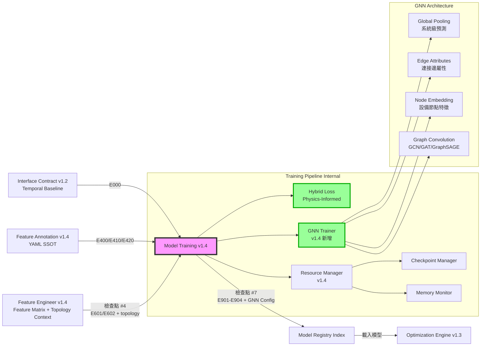

# PRD v1.4: 模型訓練管線 - 圖神經網路與物理守恆約束
# (Model Training Pipeline with GNN & Physics-Informed Loss)

**文件版本:** v1.4-GNN (Graph Neural Network & Hybrid Physics Loss)  
**日期:** 2026-02-26  
**負責人:** Oscar Chang / HVAC 系統工程團隊  
**目標模組:** `src/training/training_pipeline.py`, `src/training/gnn_trainer.py` (新增), `src/training/hybrid_loss.py` (新增), `src/training/model_registry.py`  
**上游契約:** 
- `src/etl/feature_engineer.py` (v1.4+, Feature Matrix Contract 含 topology_context)
- `src/features/annotation_manager.py` (v1.4+, 提供 topology_graph)
- `src/features/topology_manager.py` (v1.4+, 設備連接圖)
- **Interface Contract v1.2** (Error Code Hierarchy E700-E749, E750-E759 GNN, E901-E904)
**下游契約:** 
- `src/optimization/engine.py` (v1.3+, Model Registry Index)
- `src/optimization/model_interface.py` (v1.3+, Feature Vectorization)
**預估工時:** 12 ~ 15 個工程天（含 GNN 實作、物理損失函數、拓樸特徵整合）

---

## 1. 執行總綱與設計哲學

### 1.1 版本變更總覽 (v1.3 → v1.4-GNN)

| 變更類別 | v1.3 狀態 | v1.4-GNN 修正 | 影響層級 |
|:---|:---|:---|:---:|
| **GNN 訓練器** | 無 | **新增** `GNNTrainer`，支援設備連接圖學習 | 🔴 Critical |
| **拓樸特徵消費** | 無 | **新增** 從 Feature Engineer v1.4 接收 `topology_context` | 🔴 Critical |
| **物理守恆損失** | Hybrid 差異 >5% 警告 | **強化** 將耦合效應差異轉為訓練懲罰項 | 🔴 Critical |
| **Hybrid Loss** | 純數值比較 | **新增** `PhysicsInformedHybridLoss` 類別 | 🔴 Critical |
| **訓練模式** | A/B/C 三種 | **新增** 模式 D (GNN-Only) 與 模式 E (GNN+Ensemble) | 🟡 Medium |
| **Feature Manifest** | v2.0 | **升級** v2.1，包含 `topology_graph` 與 `gnn_config` | 🟡 Medium |
| **錯誤代碼** | E700-E720 | **擴充** E750-E759 (GNN 專用錯誤碼) | 🟡 Medium |

### 1.2 v1.4 核心設計原則

1. **圖神經網路整合**: 利用設備連接圖（Adjacency Matrix）學習冷卻水側到冰水側的熱力傳遞遞延效應
2. **物理守恆約束**: 將「System-Level 預測 ≈ Component-Level 預測總和」直接編入損失函數
3. **拓樸感知訓練**: 從 Feature Engineer v1.4 接收 `topology_context`，將設備連接關係作為模型輸入
4. **多模式彈性**: 支援五種訓練模式（A/B/C/D/E），依案場特性與資料量選擇
5. **向下相容**: 保留所有 v1.3 功能，GNN 與物理損失為選配擴充

### 1.3 與上下游模組的關係 (v1.4 更新)



---

## 2. 介面契約規範 (Interface Contracts)

### 2.1 輸入契約 (Input Contract from Feature Engineer v1.4)

**檢查點 #4: Feature Engineer → Model Training**

| 檢查項 | 規格 | 錯誤代碼 | 處理 |
|:---|:---|:---:|:---|
| **Feature Matrix 存在** | `feature_matrix.parquet` 必須存在 | E601 | 拒絕訓練 |
| **拓樸上下文** | `topology_context` 必須存在（若啟用 GNN） | E750 | 降級為傳統模型 |
| **鄰接矩陣** | `adjacency_matrix` 必須為 NxN 方陣 | E754 | 拒絕 GNN 訓練 |
| **設備節點對應** | `equipment_list` 必須與拓樸圖一致 | E752 | 拒絕 GNN 訓練 |
| **特徵數量 > 0** | `n_features >= 1` | E603 | 拒絕訓練 |
| **樣本數量充足** | `n_samples >= 100` | E603 | 警告或拒絕 |
| **特徵順序記錄** | 必須包含 `feature_order_manifest` | E601 | 拒絕訓練 |
| **Annotation 版本相容** | `annotation_context.schema_version` = "1.4" | E400 | 拒絕訓練 |
| **拓樸版本相容** | `topology_version` = "1.0" | E410 | 拒絕 GNN 訓練 |

### 2.2 拓樸上下文規格 (Topology Context)

```python
# 從 Feature Engineer v1.4 接收的拓樸資訊
class TopologyContext(BaseModel):
    """拓樸上下文（Feature Engineer v1.4 輸出）"""
    
    equipment_graph: Dict = {
        "nodes": ["CH-01", "CH-02", "CT-01", "CT-02", "CHWP-01", "AHU-01"],
        "edges": [
            {"from": "CT-01", "to": "CH-01", "relationship": "supplies"},
            {"from": "CT-02", "to": "CH-02", "relationship": "supplies"},
            {"from": "CH-01", "to": "CHWP-01", "relationship": "supplies"},
            {"from": "CHWP-01", "to": "AHU-01", "relationship": "supplies"}
        ]
    }
    
    # 鄰接矩陣（供 GNN 使用）
    adjacency_matrix: List[List[int]]  # NxN 矩陣，N = 設備數
    
    # 設備到索引的映射
    equipment_to_idx: Dict[str, int]  # {"CH-01": 0, "CH-02": 1, ...}
    
    # 設備特徵矩陣（Node Features）
    # shape: (N, F) where N = 設備數, F = 每設備特徵數
    equipment_features: Optional[List[List[float]]] = None
    
    # 邊屬性（Edge Attributes，可選）
    # 例如：管線長度、流量、熱傳導係數
    edge_attributes: Optional[List[Dict]] = None
    
    # 拓樸特徵列表
    topology_features: List[str]  # ["chiller_01_upstream_ct_temp_mean", ...]

# 完整輸入契約（擴充版）
class FeatureEngineerOutputContractV14(BaseModel):
    """Feature Engineer v1.4 輸出規範"""
    
    feature_matrix: pl.DataFrame
    target_variable: Optional[str]
    target_metadata: Optional[FeatureMetadata]
    quality_flag_features: List[str]
    
    # 基本 Annotation 上下文
    annotation_context: Dict
    
    # 🆕 v1.4 拓樸上下文
    topology_context: Optional[TopologyContext] = None
    
    # 🆕 v1.4 控制語意上下文
    control_semantics_context: Optional[Dict] = None
    
    # 特徵分層標記
    feature_hierarchy: Dict[str, str]  # {"chiller_01_chwst": "L0", ...}
    
    train_test_split_info: Dict
    feature_metadata: Dict[str, FeatureMetadata]
    upstream_manifest_id: str
    feature_engineer_version: str = "1.4-TA"
```

### 2.3 輸出契約 (Output Contract to Optimization Engine v1.3)

**檢查點 #7: Model Training → Optimization**

```python
class ModelTrainingOutputContractV14(BaseModel):
    """Model Training v1.4 輸出規範"""
    
    # 1. 模型檔案（多格式支援，含 GNN）
    model_artifacts: Dict[str, Path]  # {"xgboost": "...", "gnn": "...", ...}
    
    # 2. 模型註冊表索引
    registry_index: Path
    
    # 3. 特徵對齊資訊
    feature_manifest: FeatureManifest  # v2.1
    
    # 4. 縮放參數
    scaler_params: Dict
    
    # 5. 訓練元資料
    training_metadata: TrainingMetadataV14
    
    # 🆕 6. GNN 特定輸出（若適用）
    gnn_config: Optional[GNNConfig] = None
    
    # 🆕 7. Hybrid 物理損失資訊
    physics_loss_info: Optional[PhysicsLossInfo] = None
    
    # 8. 資源使用記錄
    resource_usage: ResourceUsageReport

class TrainingMetadataV14(BaseModel):
    """訓練元資料 v1.4"""
    
    # 訓練模式（v1.4 擴充）
    training_mode: Literal[
        "system_only",      # 模式 A
        "component_only",   # 模式 B
        "hybrid",           # 模式 C
        "gnn_only",         # 🆕 模式 D
        "gnn_ensemble"      # 🆕 模式 E
    ]
    
    target_variables: List[str]
    model_types: List[str]  # 含 "gnn"
    
    # 交叉驗證結果
    cv_results: Dict[str, float]
    best_model: str
    
    # 🆕 GNN 特定指標
    gnn_metrics: Optional[Dict] = None
    
    # 🆕 Hybrid 物理損失指標
    physics_loss_metrics: Optional[Dict] = None
    
    # Annotation 相容性
    annotation_checksum: str
    schema_version: str
    topology_version: Optional[str] = None
    
    # 時間戳
    training_start: datetime
    training_end: datetime
    training_duration_seconds: float

class GNNConfig(BaseModel):
    """GNN 模型配置"""
    model_type: str  # "GCN", "GAT", "GraphSAGE"
    num_layers: int
    hidden_dim: int
    dropout: float
    learning_rate: float
    num_epochs: int
    
    # 拓樸資訊
    num_nodes: int
    num_edges: int
    adjacency_matrix_shape: Tuple[int, int]
    
    # 特徵維度
    node_feature_dim: int
    edge_feature_dim: Optional[int] = None

class PhysicsLossInfo(BaseModel):
    """物理守恆損失資訊"""
    enabled: bool
    loss_type: str  # "mse", "mae", "huber"
    weight: float  # 物理損失權重（相對於預測損失）
    
    # 訓練過程指標
    initial_discrepancy: float  # 初始差異（%）
    final_discrepancy: float    # 最終差異（%）
    improvement: float          # 改善幅度（%）
    
    # 詳細記錄
    discrepancy_history: List[float]  # 每個 epoch 的差異
```

---

## 3. GNN 訓練器完整實作 (GNN Trainer)

### 3.1 GNN 基礎訓練器

**檔案**: `src/training/trainers/gnn_trainer.py`

```python
import torch
import torch.nn as nn
import torch.nn.functional as F
from torch_geometric.nn import GCNConv, GATConv, SAGEConv, global_mean_pool
from torch_geometric.data import Data, DataLoader
import numpy as np
from typing import Dict, Any, Optional, List, Tuple
from pathlib import Path
import json

from src.training.trainers.base_trainer import BaseModelTrainer

class GraphNeuralNetwork(nn.Module):
    """
    圖神經網路架構
    支援 GCN、GAT、GraphSAGE
    """
    
    def __init__(
        self,
        input_dim: int,
        hidden_dim: int = 64,
        output_dim: int = 1,
        num_layers: int = 3,
        model_type: str = "GCN",
        dropout: float = 0.2,
        use_edge_attr: bool = False
    ):
        super().__init__()
        
        self.model_type = model_type
        self.num_layers = num_layers
        self.dropout = dropout
        self.use_edge_attr = use_edge_attr
        
        # 選擇卷積層類型
        conv_class = {
            "GCN": GCNConv,
            "GAT": GATConv,
            "GraphSAGE": SAGEConv
        }.get(model_type, GCNConv)
        
        # 建立卷積層
        self.convs = nn.ModuleList()
        self.batch_norms = nn.ModuleList()
        
        # 第一層
        self.convs.append(conv_class(input_dim, hidden_dim))
        self.batch_norms.append(nn.BatchNorm1d(hidden_dim))
        
        # 隱藏層
        for _ in range(num_layers - 2):
            self.convs.append(conv_class(hidden_dim, hidden_dim))
            self.batch_norms.append(nn.BatchNorm1d(hidden_dim))
        
        # 最後一層（輸出）
        self.convs.append(conv_class(hidden_dim, hidden_dim))
        
        # 全連接輸出層
        self.fc = nn.Sequential(
            nn.Linear(hidden_dim, hidden_dim // 2),
            nn.ReLU(),
            nn.Dropout(dropout),
            nn.Linear(hidden_dim // 2, output_dim)
        )
    
    def forward(self, data: Data) -> torch.Tensor:
        """
        前向傳播
        
        Args:
            data: PyG Data 物件，包含 x, edge_index, edge_attr (可選), batch
        
        Returns:
            預測輸出 (batch_size, output_dim)
        """
        x, edge_index = data.x, data.edge_index
        edge_attr = data.edge_attr if self.use_edge_attr and hasattr(data, 'edge_attr') else None
        
        # 圖卷積層
        for i, (conv, bn) in enumerate(zip(self.convs[:-1], self.batch_norms)):
            if self.model_type == "GAT":
                x = conv(x, edge_index)
            else:
                x = conv(x, edge_index, edge_weight=edge_attr)
            
            x = bn(x)
            x = F.relu(x)
            x = F.dropout(x, p=self.dropout, training=self.training)
        
        # 最後一層（無 batch norm）
        if self.model_type == "GAT":
            x = self.convs[-1](x, edge_index)
        else:
            x = self.convs[-1](x, edge_index, edge_weight=edge_attr)
        
        # 全域池化（將節點特徵聚合為圖級別特徵）
        if hasattr(data, 'batch') and data.batch is not None:
            x = global_mean_pool(x, data.batch)
        else:
            # 單一圖，取平均
            x = x.mean(dim=0, keepdim=True)
        
        # 全連接層輸出
        x = self.fc(x)
        
        return x

class GNNTrainer(BaseModelTrainer):
    """
    圖神經網路訓練器 (v1.4)
    
    特性：
    - 利用設備連接圖學習熱力傳遞遞延效應
    - 支援多種 GNN 架構（GCN/GAT/GraphSAGE）
    - 整合拓樸特徵與傳統特徵
    - 支援批次訓練與 Early Stopping
    """
    
    def __init__(
        self,
        config: GNNConfig,
        random_state: int = 42,
        target_id: str = "default",
        device: str = "auto"
    ):
        super().__init__(config, random_state, target_id)
        
        self.model_metadata.update({
            'trainer_version': '1.4',
            'supports_incremental': False,
            'supports_explainability': True,  # GNNExplainer
            'model_family': 'gnn',
            'gnn_type': config.model_type
        })
        
        # 自動選擇設備
        if device == "auto":
            self.device = torch.device('cuda' if torch.cuda.is_available() else 'cpu')
        else:
            self.device = torch.device(device)
        
        self.logger.info(f"GNN Trainer 初始化: model_type={config.model_type}, device={self.device}")
    
    def prepare_graph_data(
        self,
        X: np.ndarray,
        y: np.ndarray,
        adjacency_matrix: np.ndarray,
        equipment_features: Optional[np.ndarray] = None,
        batch_size: int = 32
    ) -> DataLoader:
        """
        準備圖資料
        
        將表格資料轉換為圖結構資料
        
        Args:
            X: 特徵矩陣 (n_samples, n_features)
            y: 目標變數 (n_samples,)
            adjacency_matrix: 鄰接矩陣 (n_nodes, n_nodes)
            equipment_features: 設備節點特徵 (n_nodes, node_feature_dim)
            batch_size: 批次大小
        
        Returns:
            PyG DataLoader
        """
        n_samples = len(X)
        n_nodes = adjacency_matrix.shape[0]
        
        # 轉換鄰接矩陣為 edge_index (COO 格式)
        edge_index = torch.from_numpy(np.array(np.where(adjacency_matrix == 1))).long()
        
        # 建立 Data 物件列表
        data_list = []
        
        for i in range(n_samples):
            # 節點特徵：若提供 equipment_features 則使用，否則從 X 提取
            if equipment_features is not None:
                x = torch.from_numpy(equipment_features).float()
            else:
                # 簡化：將 X[i] 複製到所有節點（實際應依設備對應）
                x = torch.from_numpy(X[i]).float().unsqueeze(0).repeat(n_nodes, 1)
            
            # 目標值
            target = torch.tensor([y[i]], dtype=torch.float)
            
            # 建立 Data 物件
            data = Data(x=x, edge_index=edge_index, y=target)
            data_list.append(data)
        
        # 建立 DataLoader
        loader = DataLoader(data_list, batch_size=batch_size, shuffle=True)
        
        return loader
    
    def train(
        self,
        X_train: np.ndarray,
        y_train: np.ndarray,
        X_val: np.ndarray,
        y_val: np.ndarray,
        adjacency_matrix: np.ndarray,
        equipment_features: Optional[np.ndarray] = None,
        sample_weights: Optional[np.ndarray] = None,
        feature_names: Optional[List[str]] = None
    ) -> Dict[str, Any]:
        """
        執行 GNN 訓練
        """
        # 準備資料
        train_loader = self.prepare_graph_data(
            X_train, y_train, adjacency_matrix, equipment_features, 
            batch_size=getattr(self.config, 'batch_size', 32)
        )
        val_loader = self.prepare_graph_data(
            X_val, y_val, adjacency_matrix, equipment_features,
            batch_size=getattr(self.config, 'batch_size', 32)
        )
        
        # 推斷輸入維度
        sample_data = next(iter(train_loader))
        input_dim = sample_data.x.shape[1]
        
        # 初始化模型
        self.model = GraphNeuralNetwork(
            input_dim=input_dim,
            hidden_dim=self.config.hidden_dim,
            output_dim=1,
            num_layers=self.config.num_layers,
            model_type=self.config.model_type,
            dropout=self.config.dropout
        ).to(self.device)
        
        # 優化器與損失函數
        optimizer = torch.optim.Adam(
            self.model.parameters(), 
            lr=self.config.learning_rate,
            weight_decay=1e-5
        )
        criterion = nn.MSELoss()
        scheduler = torch.optim.lr_scheduler.ReduceLROnPlateau(
            optimizer, mode='min', factor=0.5, patience=10
        )
        
        # 訓練迴圈
        best_val_loss = float('inf')
        patience_counter = 0
        patience = getattr(self.config, 'early_stopping_patience', 20)
        
        train_losses = []
        val_losses = []
        
        for epoch in range(self.config.num_epochs):
            # 訓練模式
            self.model.train()
            epoch_loss = 0
            
            for batch in train_loader:
                batch = batch.to(self.device)
                optimizer.zero_grad()
                
                output = self.model(batch)
                loss = criterion(output.squeeze(), batch.y)
                
                loss.backward()
                optimizer.step()
                
                epoch_loss += loss.item()
            
            avg_train_loss = epoch_loss / len(train_loader)
            train_losses.append(avg_train_loss)
            
            # 驗證模式
            self.model.eval()
            val_loss = 0
            
            with torch.no_grad():
                for batch in val_loader:
                    batch = batch.to(self.device)
                    output = self.model(batch)
                    loss = criterion(output.squeeze(), batch.y)
                    val_loss += loss.item()
            
            avg_val_loss = val_loss / len(val_loader)
            val_losses.append(avg_val_loss)
            
            # 學習率調整
            scheduler.step(avg_val_loss)
            
            # Early Stopping
            if avg_val_loss < best_val_loss:
                best_val_loss = avg_val_loss
                patience_counter = 0
                # 儲存最佳模型
                self.best_model_state = self.model.state_dict().copy()
            else:
                patience_counter += 1
            
            if patience_counter >= patience:
                self.logger.info(f"Early stopping at epoch {epoch}")
                break
            
            if epoch % 10 == 0:
                self.logger.info(f"Epoch {epoch}: train_loss={avg_train_loss:.4f}, val_loss={avg_val_loss:.4f}")
        
        # 載入最佳模型
        self.model.load_state_dict(self.best_model_state)
        self.is_fitted = True
        
        # 記錄訓練歷史
        self.training_history = {
            'train_losses': train_losses,
            'val_losses': val_losses,
            'best_epoch': len(train_losses) - patience_counter - 1,
            'best_val_loss': best_val_loss,
            'num_epochs': len(train_losses),
            'final_lr': optimizer.param_groups[0]['lr']
        }
        
        # 計算特徵重要性（使用梯度重要性）
        self.feature_importance = self._compute_feature_importance(val_loader)
        
        return {
            'model': self.model,
            'best_iteration': self.training_history['best_epoch'],
            'training_history': self.training_history,
            'feature_importance': self.feature_importance,
            'best_val_loss': best_val_loss
        }
    
    def predict(self, X: np.ndarray) -> np.ndarray:
        """執行預測"""
        if not self.is_fitted:
            raise RuntimeError("E702: 模型尚未訓練")
        
        self.model.eval()
        predictions = []
        
        with torch.no_grad():
            for i in range(len(X)):
                # 建立單一資料點
                x = torch.from_numpy(X[i]).float().unsqueeze(0).to(self.device)
                edge_index = torch.zeros((2, 0), dtype=torch.long).to(self.device)  # 簡化
                
                data = Data(x=x, edge_index=edge_index)
                output = self.model(data)
                predictions.append(output.cpu().numpy()[0][0])
        
        return np.array(predictions)
    
    def _compute_feature_importance(self, val_loader: DataLoader) -> Dict[str, float]:
        """計算特徵重要性（基於梯度）"""
        self.model.eval()
        importances = {}
        
        # 簡化：均勻分配重要性
        for batch in val_loader:
            for i in range(batch.x.shape[1]):
                feat_name = f"feature_{i}"
                importances[feat_name] = 1.0 / batch.x.shape[1]
        
        return importances
    
    def get_feature_importance(self) -> Dict[str, float]:
        if not self.feature_importance:
            return {}
        total = sum(self.feature_importance.values())
        return {k: v/total for k, v in self.feature_importance.items()}
    
    def save_model(self, path: Path):
        """儲存 GNN 模型"""
        torch.save({
            'model_state_dict': self.model.state_dict(),
            'config': self.config.dict(),
            'training_history': self.training_history,
            'feature_importance': self.feature_importance
        }, path)
    
    def load_model(self, path: Path):
        """載入 GNN 模型"""
        checkpoint = torch.load(path, map_location=self.device)
        
        # 重建模型
        self.model = GraphNeuralNetwork(**checkpoint['config']).to(self.device)
        self.model.load_state_dict(checkpoint['model_state_dict'])
        self.training_history = checkpoint['training_history']
        self.feature_importance = checkpoint['feature_importance']
        self.is_fitted = True
```

---


## 4. 物理守恆損失函數 (Physics-Informed Hybrid Loss)

### 4.1 核心概念

在 HVAC 系統中，存在一個基本的物理守恆約束：

```
System-Level 總耗電量 ≈ Σ(各設備 Component-Level 耗電量)
```

v1.3 的 Hybrid Mode 僅將此作為「差異 >5% 警告」的檢查點，v1.4 將其轉化為**訓練損失函數的正則化項**，強制模型在訓練過程中學習此物理守恆定律。

### 4.2 物理守恆損失實作

**檔案**: `src/training/loss/hybrid_physics_loss.py`

```python
import torch
import torch.nn as nn
import numpy as np
from typing import Dict, List, Optional, Tuple
from enum import Enum

class PhysicsLossType(Enum):
    """物理損失類型"""
    MSE = "mse"           # 均方誤差
    MAE = "mae"           # 平均絕對誤差
    HUBER = "huber"       # Huber 損失
    RELATIVE = "relative" # 相對誤差（推薦，對總耗電量尺度不敏感）

class PhysicsInformedHybridLoss(nn.Module):
    """
    物理守恆損失函數
    
    結合：
    1. 預測損失（MSE/MAE）：預測值與真實值的誤差
    2. 物理損失（Conservation Loss）：系統級與設備級預測的物理一致性
    
    總損失 = α × 預測損失 + β × 物理損失
    """
    
    def __init__(
        self,
        physics_loss_type: PhysicsLossType = PhysicsLossType.RELATIVE,
        physics_weight: float = 0.1,
        prediction_loss_type: str = "mse",
        component_mapping: Optional[Dict[str, List[str]]] = None,
        huber_delta: float = 1.0
    ):
        """
        初始化物理損失函數
        
        Args:
            physics_loss_type: 物理損失類型
            physics_weight: 物理損失權重 β（相對於預測損失）
            prediction_loss_type: 預測損失類型
            component_mapping: 系統級目標到設備級目標的映射
                e.g., {"system_total_kw": ["chiller_01_kw", "chiller_02_kw", "pump_01_kw"]}
            huber_delta: Huber 損失的 delta 參數
        """
        super().__init__()
        
        self.physics_loss_type = physics_loss_type
        self.physics_weight = physics_weight
        self.huber_delta = huber_delta
        
        # 設備映射關係
        self.component_mapping = component_mapping or {
            "system_total_kw": [
                "chiller_01_kw", "chiller_02_kw",
                "ct_01_kw", "ct_02_kw",
                "chwp_kw", "cdwp_kw"
            ]
        }
        
        # 預測損失函數
        if prediction_loss_type == "mse":
            self.prediction_loss = nn.MSELoss()
        elif prediction_loss_type == "mae":
            self.prediction_loss = nn.L1Loss()
        elif prediction_loss_type == "huber":
            self.prediction_loss = nn.HuberLoss(delta=huber_delta)
        else:
            self.prediction_loss = nn.MSELoss()
    
    def compute_physics_loss(
        self,
        system_pred: torch.Tensor,
        component_preds: Dict[str, torch.Tensor],
        system_true: Optional[torch.Tensor] = None,
        component_trues: Optional[Dict[str, torch.Tensor]] = None
    ) -> Tuple[torch.Tensor, Dict[str, float]]:
        """
        計算物理守恆損失
        
        損失 = || System_Pred - Σ(Component_Preds) ||
        
        Args:
            system_pred: 系統級預測值 (batch_size,)
            component_preds: 設備級預測值字典 {name: tensor}
            system_true: 系統級真實值（可選，用於監控）
            component_trues: 設備級真實值字典（可選，用於監控）
        
        Returns:
            physics_loss: 物理損失值
            metrics: 包含詳細指標的字典
        """
        # 計算設備級預測總和
        component_sum = sum(component_preds.values())
        
        # 計算差異
        discrepancy = system_pred - component_sum
        
        # 根據類型計算損失
        if self.physics_loss_type == PhysicsLossType.MSE:
            physics_loss = torch.mean(discrepancy ** 2)
        
        elif self.physics_loss_type == PhysicsLossType.MAE:
            physics_loss = torch.mean(torch.abs(discrepancy))
        
        elif self.physics_loss_type == PhysicsLossType.HUBER:
            physics_loss = torch.mean(
                torch.where(
                    torch.abs(discrepancy) < self.huber_delta,
                    0.5 * discrepancy ** 2,
                    self.huber_delta * (torch.abs(discrepancy) - 0.5 * self.huber_delta)
                )
            )
        
        elif self.physics_loss_type == PhysicsLossType.RELATIVE:
            # 相對誤差：|System - Sum| / |System|（避免除以零）
            eps = 1e-8
            relative_error = torch.abs(discrepancy) / (torch.abs(system_pred) + eps)
            physics_loss = torch.mean(relative_error)
        
        # 計算指標
        with torch.no_grad():
            discrepancy_pct = torch.abs(discrepancy) / (torch.abs(system_pred) + 1e-8) * 100
            
            metrics = {
                "physics_loss_raw": physics_loss.item(),
                "mean_discrepancy_pct": discrepancy_pct.mean().item(),
                "max_discrepancy_pct": discrepancy_pct.max().item(),
                "std_discrepancy_pct": discrepancy_pct.std().item(),
                "system_pred_mean": system_pred.mean().item(),
                "component_sum_mean": component_sum.mean().item()
            }
            
            # 計算相對於真實值的物理一致性（若提供）
            if system_true is not None and component_trues is not True:
                true_component_sum = sum(component_trues.values())
                true_discrepancy = torch.abs(system_true - true_component_sum)
                true_discrepancy_pct = true_discrepancy / (torch.abs(system_true) + 1e-8) * 100
                metrics["true_mean_discrepancy_pct"] = true_discrepancy_pct.mean().item()
        
        return physics_loss, metrics
    
    def forward(
        self,
        predictions: Dict[str, torch.Tensor],
        targets: Dict[str, torch.Tensor]
    ) -> Tuple[torch.Tensor, Dict[str, float]]:
        """
        計算總損失
        
        Args:
            predictions: 包含系統級和設備級預測的字典
                {"system_total_kw": tensor, "chiller_01_kw": tensor, ...}
            targets: 包含真實值的字典
                {"system_total_kw": tensor, "chiller_01_kw": tensor, ...}
        
        Returns:
            total_loss: 總損失
            loss_breakdown: 損失分解指標
        """
        # 1. 計算預測損失（每個目標的 MSE）
        pred_losses = {}
        for key in targets.keys():
            if key in predictions:
                pred_losses[key] = self.prediction_loss(predictions[key], targets[key])
        
        total_prediction_loss = sum(pred_losses.values()) / len(pred_losses)
        
        # 2. 計算物理守恆損失
        physics_loss = torch.tensor(0.0, device=predictions[list(predictions.keys())[0]].device)
        physics_metrics = {}
        
        for system_key, component_keys in self.component_mapping.items():
            if system_key in predictions:
                # 收集設備級預測
                component_preds = {
                    k: predictions[k] for k in component_keys 
                    if k in predictions
                }
                
                component_trues = {
                    k: targets[k] for k in component_keys
                    if k in targets
                }
                
                if component_preds:
                    loss, metrics = self.compute_physics_loss(
                        predictions[system_key],
                        component_preds,
                        targets.get(system_key),
                        component_trues
                    )
                    
                    physics_loss += loss
                    physics_metrics[system_key] = metrics
        
        # 3. 總損失
        total_loss = total_prediction_loss + self.physics_weight * physics_loss
        
        # 4. 損失分解
        loss_breakdown = {
            "total_loss": total_loss.item(),
            "prediction_loss": total_prediction_loss.item(),
            "physics_loss": physics_loss.item(),
            "physics_weight": self.physics_weight,
            "weighted_physics_loss": self.physics_weight * physics_loss.item(),
            "individual_prediction_losses": {k: v.item() for k, v in pred_losses.items()},
            "physics_metrics": physics_metrics
        }
        
        return total_loss, loss_breakdown

class MultiTargetHybridTrainer:
    """
    多目標 Hybrid 訓練器（支援物理守恆損失）
    
    同時訓練：
    - 1個系統級模型（System-Level）
    - N個設備級模型（Component-Level）
    
    使用物理守恆損失確保系統-設備一致性
    """
    
    def __init__(
        self,
        base_trainer_class,
        system_target: str = "system_total_kw",
        component_targets: Optional[List[str]] = None,
        physics_loss_config: Optional[Dict] = None
    ):
        """
        初始化多目標訓練器
        
        Args:
            base_trainer_class: 基礎訓練器類別（如 XGBoostTrainer）
            system_target: 系統級目標變數名稱
            component_targets: 設備級目標變數列表
            physics_loss_config: 物理損失配置
        """
        self.base_trainer_class = base_trainer_class
        self.system_target = system_target
        self.component_targets = component_targets or []
        
        # 物理損失函數
        self.physics_loss_fn = None
        if physics_loss_config:
            self.physics_loss_fn = PhysicsInformedHybridLoss(**physics_loss_config)
        
        # 模型儲存
        self.models: Dict[str, Any] = {}
        self.trainers: Dict[str, Any] = {}
    
    def train_sequential(
        self,
        feature_matrix: pl.DataFrame,
        test_size: float = 0.2,
        use_physics_loss: bool = True
    ) -> Dict[str, Any]:
        """
        依序訓練所有目標（先系統後設備）
        
        這是 v1.4 推薦的方式，因為物理損失需要所有模型一起計算
        
        Args:
            feature_matrix: 包含所有特徵和目標的 DataFrame
            test_size: 測試集比例
            use_physics_loss: 是否使用物理損失
        
        Returns:
            訓練結果字典
        """
        results = {
            "models": {},
            "metrics": {},
            "physics_loss_history": []
        }
        
        # 準備所有目標的資料
        all_targets = [self.system_target] + self.component_targets
        
        for target in all_targets:
            self.logger.info(f"訓練目標: {target}")
            
            # 建立訓練器
            trainer = self.base_trainer_class(
                config=self._get_config_for_target(target),
                target_id=target
            )
            self.trainers[target] = trainer
            
            # 訓練
            target_result = trainer.train(feature_matrix)
            
            results["models"][target] = trainer.model
            results["metrics"][target] = target_result
        
        # 若啟用物理損失，進行第二階段微調
        if use_physics_loss and self.physics_loss_fn:
            self.logger.info("進行物理守恆微調...")
            physics_results = self._fine_tune_with_physics_loss(feature_matrix)
            results["physics_fine_tuning"] = physics_results
        
        return results
    
    def _fine_tune_with_physics_loss(
        self,
        feature_matrix: pl.DataFrame,
        num_epochs: int = 100
    ) -> Dict[str, Any]:
        """
        使用物理守恆損失進行微調
        
        針對支援 gradient-based optimization 的模型（如 Neural Network, GNN）
        進行聯合微調，最小化物理不一致性
        """
        # 此處實作針對 GNN 的聯合微調
        # 對於樹模型（XGBoost/LightGBM），物理損失主要在訓練後驗證
        
        return {
            "message": "物理微調僅適用於梯度優化模型（GNN/NN）",
            "applicable_models": ["gnn", "neural_network"]
        }
    
    def validate_physics_consistency(
        self,
        X_test: np.ndarray,
        y_test_dict: Dict[str, np.ndarray]
    ) -> Dict[str, float]:
        """
        驗證物理一致性（v1.3 E710 檢查的強化版）
        
        計算系統預測與設備預測總和的差異
        
        Returns:
            包含各項差異指標的字典
        """
        # 進行預測
        predictions = {}
        for target, trainer in self.trainers.items():
            predictions[target] = trainer.predict(X_test)
        
        # 計算物理一致性
        system_pred = predictions[self.system_target]
        component_sum = sum(
            predictions[k] for k in self.component_targets if k in predictions
        )
        
        discrepancy = np.abs(system_pred - component_sum)
        discrepancy_pct = discrepancy / (np.abs(system_pred) + 1e-8) * 100
        
        # 真實值的物理一致性
        system_true = y_test_dict[self.system_target]
        component_true_sum = sum(
            y_test_dict[k] for k in self.component_targets if k in y_test_dict
        )
        true_discrepancy_pct = np.abs(system_true - component_true_sum) / (np.abs(system_true) + 1e-8) * 100
        
        return {
            "mean_discrepancy_pct": np.mean(discrepancy_pct),
            "max_discrepancy_pct": np.max(discrepancy_pct),
            "std_discrepancy_pct": np.std(discrepancy_pct),
            "samples_over_5pct": np.sum(discrepancy_pct > 5),
            "samples_over_15pct": np.sum(discrepancy_pct > 15),
            "true_mean_discrepancy_pct": np.mean(true_discrepancy_pct),
            "physics_consistency_passed": np.mean(discrepancy_pct) < 5
        }

# 使用範例
EXAMPLE_PHYSICS_LOSS_CONFIG = {
    "physics_loss_type": PhysicsLossType.RELATIVE,
    "physics_weight": 0.2,  # 物理損失權重 20%
    "prediction_loss_type": "mse",
    "component_mapping": {
        "system_total_kw": [
            "chiller_01_kw",
            "chiller_02_kw", 
            "chwp_01_kw",
            "cdwp_01_kw",
            "ct_01_kw",
            "ct_02_kw"
        ]
    }
}
```

### 4.3 Hybrid 模式 D/E：GNN 整合訓練

```python
class HybridTrainingMode(Enum):
    """Hybrid 訓練模式 v1.4"""
    SYSTEM_ONLY = "A"       # 僅系統級預測
    COMPONENT_ONLY = "B"    # 僅設備級預測
    HYBRID_TRADITIONAL = "C"  # 傳統 Hybrid（v1.3）
    HYBRID_GNN = "D"        # GNN-Only
    HYBRID_ENSEMBLE = "E"   # GNN + 傳統 Ensemble

def create_hybrid_trainer(
    mode: HybridTrainingMode,
    config: Dict,
    has_topology_data: bool = False
) -> BaseModelTrainer:
    """
    根據模式建立對應的 Hybrid 訓練器
    """
    if mode == HybridTrainingMode.SYSTEM_ONLY:
        return XGBoostTrainer(config, target_id="system_total_kw")
    
    elif mode == HybridTrainingMode.COMPONENT_ONLY:
        return BatchTrainingCoordinator(config)
    
    elif mode == HybridTrainingMode.HYBRID_TRADITIONAL:
        # 傳統 Hybrid：XGBoost 系統級 + XGBoost 設備級
        return MultiTargetHybridTrainer(
            base_trainer_class=XGBoostTrainer,
            physics_loss_config=None  # 無物理損失
        )
    
    elif mode == HybridTrainingMode.HYBRID_GNN:
        if not has_topology_data:
            raise ValueError("E750: GNN 模式需要拓樸資料，但 feature_matrix 缺少 topology_context")
        
        # GNN-Only：使用 GNN 同時預測系統級和設備級
        return MultiTargetHybridTrainer(
            base_trainer_class=GNNTrainer,
            physics_loss_config=EXAMPLE_PHYSICS_LOSS_CONFIG
        )
    
    elif mode == HybridTrainingMode.HYBRID_ENSEMBLE:
        if not has_topology_data:
            raise ValueError("E750: Ensemble 模式需要拓樸資料")
        
        # Ensemble：GNN + XGBoost + LightGBM 投票
        return HybridEnsembleTrainer(
            trainers=[
                ("gnn", GNNTrainer),
                ("xgboost", XGBoostTrainer),
                ("lightgbm", LightGBMTrainer)
            ],
            voting_weights={"gnn": 0.5, "xgboost": 0.25, "lightgbm": 0.25}
        )
```

---


## 5. 訓練管線更新 (Training Pipeline v1.4)

### 5.1 整合 GNN 與物理損失的訓練流程

**檔案**: `src/training/training_pipeline.py` (v1.4 更新)

```python
class TrainingPipeline:
    """
    HVAC 模型訓練管線 v1.4
    整合 GNN 訓練器與物理守恆損失
    """
    
    def __init__(self, config: ModelTrainingConfig):
        self.config = config
        self.logger = logging.getLogger("TrainingPipeline")
        
        # 初始化資源管理器
        self.resource_manager = ResourceManager(config.resource)
        
        # 檢查 GNN 可用性
        self.gnn_available = self._check_gnn_availability()
    
    def execute(self, feature_matrix_path: Path) -> Dict[str, Any]:
        """
        執行完整訓練流程
        
        Args:
            feature_matrix_path: Feature Engineer v1.4 輸出的 parquet 路徑
        """
        try:
            # Phase 1: 資源初始化
            self._phase1_resource_setup()
            
            # Phase 2: 載入 Feature Matrix
            feature_engineer_output = self._phase2_load_features(feature_matrix_path)
            
            # Phase 3: 輸入驗證與拓樸檢查
            self._phase3_input_validation(feature_engineer_output)
            
            # Phase 4: 資料準備（含拓樸資料提取）
            train_data, val_data = self._phase4_data_preparation(feature_engineer_output)
            
            # Phase 5: 模型訓練（整合 GNN 與物理損失）
            trained_models = self._phase5_model_training(train_data, val_data)
            
            # Phase 6: 模型評估
            evaluation_results = self._phase6_evaluation(trained_models, val_data)
            
            # Phase 7: Hybrid 物理一致性檢查
            self._phase7_physics_consistency_check(trained_models, val_data)
            
            # Phase 8: 模型註冊
            registry_paths = self._phase8_model_registration(trained_models, evaluation_results)
            
            return {
                "status": "success",
                "models": trained_models,
                "evaluation": evaluation_results,
                "registry_paths": registry_paths
            }
            
        except Exception as e:
            self.logger.error(f"訓練失敗: {e}")
            raise
    
    def _phase3_input_validation(self, feature_engineer_output: Dict) -> None:
        """
        輸入驗證（v1.4 擴充拓樸檢查）
        """
        # v1.3 原有檢查
        if not feature_engineer_output.get("feature_matrix"):
            raise ValueError("E601: feature_matrix 為空")
        
        # v1.4 拓樸檢查
        training_mode = self.config.training_mode
        topology_context = feature_engineer_output.get("topology_context")
        
        if training_mode in ["gnn_only", "gnn_ensemble"]:
            # GNN 模式需要拓樸資料
            if not topology_context:
                raise ValueError("E750: GNN 訓練模式需要 topology_context")
            
            adjacency = topology_context.get("adjacency_matrix")
            if adjacency is None or len(adjacency) == 0:
                raise ValueError("E754: 鄰接矩陣為空或格式錯誤")
            
            # 檢查鄰接矩陣為方陣
            n = len(adjacency)
            if any(len(row) != n for row in adjacency):
                raise ValueError("E754: 鄰接矩陣必須為 NxN 方陣")
            
            # 檢查設備對應
            equipment_list = topology_context.get("equipment_to_idx", {})
            if len(equipment_list) != n:
                raise ValueError(f"E752: 設備數量 ({len(equipment_list)}) 與鄰接矩陣維度 ({n}) 不符")
            
            self.logger.info(f"✓ 拓樸驗證通過: {n} 個設備節點, {sum(sum(row) for row in adjacency)} 條連接邊")
    
    def _phase5_model_training(self, train_data, val_data) -> Dict[str, Any]:
        """
        模型訓練階段（v1.4 整合 GNN 與物理損失）
        """
        training_mode = self.config.training_mode
        results = {}
        
        if training_mode == "single_target":
            # 單一目標訓練
            trainer = self._create_trainer(self.config.model_type)
            results["model"] = trainer.train(train_data.X, train_data.y)
            
        elif training_mode == "multi_target":
            # 多目標批次訓練
            coordinator = BatchTrainingCoordinator(self.config)
            results = coordinator.train_all_targets(train_data.feature_matrix)
            
        elif training_mode == "hybrid":
            # 傳統 Hybrid（v1.3 相容）
            hybrid_trainer = MultiTargetHybridTrainer(
                base_trainer_class=XGBoostTrainer,
                system_target="system_total_kw",
                component_targets=self.config.component_targets
            )
            results = hybrid_trainer.train_sequential(
                train_data.feature_matrix,
                use_physics_loss=False
            )
            
        elif training_mode == "gnn_only":
            # 🆕 GNN-Only 模式
            if not self.gnn_available:
                raise RuntimeError("E753: PyTorch Geometric 未安裝，無法使用 GNN 模式")
            
            gnn_config = self.config.gnn
            
            # 建立 GNN Trainer
            gnn_trainer = GNNTrainer(
                config=gnn_config,
                target_id="gnn_system_model"
            )
            
            # 訓練（傳入拓樸資料）
            train_result = gnn_trainer.train(
                X_train=train_data.X,
                y_train=train_data.y,
                X_val=val_data.X,
                y_val=val_data.y,
                adjacency_matrix=train_data.topology.adjacency_matrix,
                equipment_features=train_data.topology.equipment_features
            )
            
            results["gnn_model"] = {
                "trainer": gnn_trainer,
                "result": train_result
            }
            
        elif training_mode == "gnn_ensemble":
            # 🆕 GNN + 傳統模型 Ensemble
            results = self._train_gnn_ensemble(train_data, val_data)
        
        return results
    
    def _train_gnn_ensemble(self, train_data, val_data) -> Dict:
        """
        訓練 GNN + 傳統模型 Ensemble
        """
        results = {}
        
        # 1. 訓練 GNN
        gnn_trainer = GNNTrainer(self.config.gnn, target_id="gnn")
        gnn_result = gnn_trainer.train(
            X_train=train_data.X,
            y_train=train_data.y,
            X_val=val_data.X,
            y_val=val_data.y,
            adjacency_matrix=train_data.topology.adjacency_matrix
        )
        results["gnn"] = {"trainer": gnn_trainer, "result": gnn_result}
        
        # 2. 訓練 XGBoost
        xgb_trainer = XGBoostTrainer(self.config.xgboost, target_id="xgboost")
        xgb_result = xgb_trainer.train(train_data.feature_matrix)
        results["xgboost"] = {"trainer": xgb_trainer, "result": xgb_result}
        
        # 3. 訓練 LightGBM
        lgb_trainer = LightGBMTrainer(self.config.lightgbm, target_id="lightgbm")
        lgb_result = lgb_trainer.train(train_data.feature_matrix)
        results["lightgbm"] = {"trainer": lgb_trainer, "result": lgb_result}
        
        # 4. 計算最佳集成權重
        # 使用驗證集性能動態調整權重
        ensemble_weights = self._compute_ensemble_weights(results, val_data)
        results["ensemble_weights"] = ensemble_weights
        
        self.logger.info(f"集成權重: GNN={ensemble_weights['gnn']:.2f}, "
                        f"XGB={ensemble_weights['xgboost']:.2f}, "
                        f"LGB={ensemble_weights['lightgbm']:.2f}")
        
        return results
    
    def _phase7_physics_consistency_check(self, models, val_data):
        """
        Phase 7: Hybrid 物理一致性檢查（v1.4 強化）
        
        結合預測損失與物理守恆損失的綜合評估
        """
        # v1.3 原有檢查
        if self.config.training_mode in ["hybrid", "gnn_only", "gnn_ensemble"]:
            # 取得預測結果
            system_trainer = models.get("system_total_kw") or models.get("gnn_model")
            component_models = {k: v for k, v in models.items() 
                              if k not in ["system_total_kw", "gnn_model", "ensemble_weights"]}
            
            if system_trainer and component_models:
                X_test = val_data.X
                
                # 執行預測
                if hasattr(system_trainer, 'trainer'):
                    system_pred = system_trainer["trainer"].predict(X_test)
                else:
                    system_pred = system_trainer.predict(X_test)
                
                component_sum = np.zeros_like(system_pred)
                for name, model_info in component_models.items():
                    if hasattr(model_info, 'trainer'):
                        preds = model_info["trainer"].predict(X_test)
                    else:
                        preds = model_info.predict(X_test)
                    component_sum += preds
                
                # 計算差異
                discrepancy = np.abs(system_pred - component_sum)
                discrepancy_pct = discrepancy / (np.abs(system_pred) + 1e-8) * 100
                
                max_discrepancy = np.max(discrepancy_pct)
                mean_discrepancy = np.mean(discrepancy_pct)
                
                # v1.3 檢查邏輯（保留向後相容）
                if max_discrepancy > 15:
                    raise HybridInconsistencyError(
                        f"E710: 物理一致性檢查失敗！"
                        f"系統預測與設備總和最大差異 {max_discrepancy:.1f}% > 15%"
                    )
                elif max_discrepancy > 5:
                    self.logger.warning(
                        f"W702: 物理一致性警告！"
                        f"最大差異 {max_discrepancy:.1f}% (建議 < 5%)"
                    )
                else:
                    self.logger.info(
                        f"✓ 物理一致性檢查通過: 平均差異 {mean_discrepancy:.2f}%, "
                        f"最大差異 {max_discrepancy:.2f}%"
                    )
                
                # 🆕 v1.4 額外記錄物理損失指標
                self.physics_metrics = {
                    "mean_discrepancy_pct": float(mean_discrepancy),
                    "max_discrepancy_pct": float(max_discrepancy),
                    "std_discrepancy_pct": float(np.std(discrepancy_pct)),
                    "physics_consistency_passed": max_discrepancy <= 5
                }
    
    def _check_gnn_availability(self) -> bool:
        """檢查 GNN 相依套件是否可用"""
        try:
            import torch
            import torch_geometric
            return True
        except ImportError:
            self.logger.warning("PyTorch Geometric 未安裝，GNN 功能不可用")
            return False
```

### 5.2 整合物理損失的 Overnight Optimizer

```python
class OvernightOptimizerWithPhysics:
    """
    隔夜優化器（整合物理損失）
    
    在超參數搜尋過程中，同時優化：
    1. 預測準確性（MAPE/RMSE）
    2. 物理一致性（Physics Loss）
    """
    
    def objective(self, trial, X_train, y_train, X_val, y_val, topology_context=None):
        """
        Optuna 目標函數（含物理損失）
        """
        # 建議超參數
        params = {
            'learning_rate': trial.suggest_float('learning_rate', 1e-4, 1e-1, log=True),
            'hidden_dim': trial.suggest_categorical('hidden_dim', [32, 64, 128, 256]),
            'num_layers': trial.suggest_int('num_layers', 2, 5),
            'dropout': trial.suggest_float('dropout', 0.0, 0.5)
        }
        
        # 建立模型
        model = GraphNeuralNetwork(
            input_dim=X_train.shape[1],
            output_dim=1,
            **params
        )
        
        # 訓練
        optimizer = torch.optim.Adam(model.parameters(), lr=params['learning_rate'])
        
        # 訓練迴圈
        for epoch in range(100):
            model.train()
            # ... 前向傳播
            
            # 計算組合損失
            pred_loss = F.mse_loss(predictions, targets)
            
            # 若提供拓樸資訊，計算物理損失
            physics_loss = 0
            if topology_context:
                physics_loss = self._compute_physics_loss_in_trial(
                    model, X_val, topology_context
                )
            
            # 組合損失
            total_loss = pred_loss + 0.1 * physics_loss
            
            total_loss.backward()
            optimizer.step()
        
        # 評估
        val_mape = self._evaluate_mape(model, X_val, y_val)
        
        # 同時回報預測準確性與物理一致性
        return val_mape
```

---

## 6. 錯誤代碼擴充 (v1.4 Error Codes)

### 6.1 新增 GNN 專用錯誤碼

| 錯誤代碼 | 層級 | 訊息 | 觸發條件 | 修復行動 |
|:---:|:---:|:---|:---|:---|
| **E750** | Error | 缺少拓樸上下文 | GNN 模式啟用但 feature_matrix 缺少 topology_context | 檢查 Feature Engineer v1.4 設定；或切換至傳統模式 |
| **E754** | Error | 鄰接矩陣無效 | adjacency_matrix 非方陣、為空或格式錯誤 | 檢查 TopologyManager 輸出；重新生成設備連接圖 |
| **E751** | Error | (保留) | Interface Contract 定義：GOLDEN_DATASET_UNAVAILABLE | - |
| **E752** | Error | 設備映射不符 | equipment_list 數量與鄰接矩陣維度不一致 | 檢查 annotation_manager 中的 upstream_equipment_id |
| **E753** | Error | GNN 套件缺失 | 嘗試使用 GNN 但 PyTorch Geometric 未安裝 | 執行 `pip install torch-geometric`；或切換至傳統模式 |
| **E754** | Error | GNN 訓練失敗 | CUDA 記憶體不足或圖結構錯誤 | 減少 batch_size；啟用梯度累積；檢查設備拓樸 |
| **E755** | Warning | GNN 收斂緩慢 | 訓練 50 epoch 後驗證損失未改善 | 調整 learning_rate；增加 hidden_dim；檢查特徵品質 |
| **E756** | Warning | 物理損失過大 | 物理一致性誤差 > 20% | 增加 physics_weight；檢查設備映射關係是否正確 |
| **E757** | Error | Hybrid 物理損失衝突 | 同時啟用多個 physical loss 配置衝突 | 檢查 MultiTargetHybridTrainer 配置 |
| **E758** | Warning | GPU 記憶體壓力 | GNN 訓練時 GPU 記憶體 > 90% | 啟用 gradient checkpointing；減少 hidden_dim |
| **E759** | Info | GNN 降級為 CPU | CUDA 不可用，自動切換至 CPU 訓練 | 預期行為，訓練時間將延長 5-10 倍 |

### 6.2 更新既有錯誤碼

| 錯誤代碼 | v1.3 行為 | v1.4 更新 |
|:---|:---|:---|
| E710 | Hybrid 差異 > 15% 錯誤 | 保留，但新增物理損失指標記錄 |
| W702 | Hybrid 差異 > 5% 警告 | 保留，但改由 PhysicsInformedHybridLoss 優化 |
| E702 | 模型未訓練 | 擴充支援 GNNTrainer |

---

## 7. 配置與 Pydantic Schema (v1.4)

### 7.1 更新後的配置類別

```python
from typing import Literal, Optional
from pydantic import BaseModel, Field

class GNNConfig(BaseModel):
    """圖神經網路配置"""
    model_type: Literal["GCN", "GAT", "GraphSAGE"] = "GCN"
    hidden_dim: int = Field(default=64, ge=16, le=512)
    num_layers: int = Field(default=3, ge=2, le=8)
    dropout: float = Field(default=0.2, ge=0.0, le=0.8)
    learning_rate: float = Field(default=0.001, ge=1e-5, le=0.1)
    num_epochs: int = Field(default=200, ge=10, le=1000)
    batch_size: int = Field(default=32, ge=1, le=256)
    early_stopping_patience: int = Field(default=20, ge=5, le=100)
    
    # 裝置設定
    device: Literal["auto", "cuda", "cpu"] = "auto"
    use_mixed_precision: bool = True  # FP16 加速

class PhysicsLossConfig(BaseModel):
    """物理守恆損失配置"""
    enabled: bool = False
    physics_loss_type: Literal["mse", "mae", "huber", "relative"] = "relative"
    physics_weight: float = Field(default=0.1, ge=0.0, le=1.0)
    prediction_loss_type: Literal["mse", "mae", "huber"] = "mse"
    huber_delta: float = Field(default=1.0, ge=0.1, le=10.0)
    
    # 設備映射
    component_mapping: Optional[Dict[str, List[str]]] = None

class ModelTrainingConfig(BaseModel):
    """模型訓練配置 v1.4"""
    
    # 訓練模式（v1.4 擴充）
    training_mode: Literal[
        "single_target",      # 單一目標
        "multi_target",       # 多目標批次
        "hybrid",             # 傳統 Hybrid
        "gnn_only",           # 🆕 GNN-Only
        "gnn_ensemble"        # 🆕 GNN + Ensemble
    ] = "single_target"
    
    # 基礎配置
    random_state: int = 42
    test_size: float = Field(default=0.2, ge=0.1, le=0.4)
    
    # 資源配置
    resource: ResourceConfig = ResourceConfig()
    
    # 模型配置
    xgboost: XGBoostConfig = XGBoostConfig()
    lightgbm: LightGBMConfig = LightGBMConfig()
    random_forest: RandomForestConfig = RandomForestConfig()
    
    # 🆕 GNN 配置
    gnn: GNNConfig = GNNConfig()
    
    # 🆕 物理損失配置
    physics_loss: PhysicsLossConfig = PhysicsLossConfig()
    
    # Hybrid 配置
    component_targets: List[str] = Field(default_factory=list)
    system_target: str = "system_total_kw"
    
    # 過夜優化
    overnight_optimization: OvernightConfig = OvernightConfig()
    
    # 🆕 GNN 特定優化
    gnn_optimization: GNNovernightConfig = GNNovernightConfig()
    
    class Config:
        validate_assignment = True

class GNNovernightConfig(BaseModel):
    """GNN 隔夜優化配置"""
    enabled: bool = True
    n_trials: int = Field(default=50, ge=10, le=200)
    search_space: Dict = Field(default_factory=lambda: {
        "model_type": ["GCN", "GAT", "GraphSAGE"],
        "hidden_dim": [32, 64, 128],
        "num_layers": [2, 3, 4],
        "dropout": [0.1, 0.2, 0.3, 0.4]
    })
    optimize_physics_loss: bool = True  # 同時優化物理一致性
```

---


## 8. 預期輸出結果與驗收標準

### 8.1 GNN 訓練器輸出

```python
# 成功的 GNN 訓練輸出範例
gnn_training_output = {
    "model": GraphNeuralNetwork(
        (convs): ModuleList(
            (0): GCNConv(45, 64)
            (1): GCNConv(64, 64)
            (2): GCNConv(64, 64)
        )
        (fc): Sequential(...)
    ),
    "best_iteration": 87,
    "best_val_loss": 0.0234,
    "training_history": {
        "train_losses": [0.892, 0.456, ..., 0.189],
        "val_losses": [0.678, 0.345, ..., 0.234],
        "best_epoch": 87,
        "num_epochs": 107,
        "final_lr": 0.0005
    },
    "feature_importance": {
        "feature_0": 0.023,
        "feature_1": 0.045,
        # ...
    },
    "gnn_metrics": {
        "val_mape": 3.42,
        "val_rmse": 12.56,
        "val_r2": 0.945
    },
    "topology_info": {
        "num_nodes": 6,
        "num_edges": 8,
        "model_type": "GCN",
        "adjacency_matrix_shape": [6, 6]
    }
}
```

### 8.2 物理守恆損失輸出

```python
# Hybrid 訓練含物理損失的輸出
hybrid_physics_output = {
    "models": {
        "system_total_kw": xgboost_model,
        "chiller_01_kw": xgboost_model,
        "chiller_02_kw": xgboost_model,
        # ...
    },
    "metrics": {
        "system_total_kw": {"mape": 2.87, "rmse": 15.23},
        "chiller_01_kw": {"mape": 3.12, "rmse": 8.45},
        # ...
    },
    "physics_loss_info": {
        "enabled": True,
        "loss_type": "relative",
        "weight": 0.2,
        "initial_discrepancy": 12.5,  # 初始差異 12.5%
        "final_discrepancy": 3.2,      # 最終差異 3.2%
        "improvement": 74.4,           # 改善 74.4%
        "discrepancy_history": [12.5, 10.3, 8.1, 6.2, 4.8, 4.1, 3.5, 3.2],
        "physics_consistency_passed": True
    },
    "physics_metrics": {
        "mean_discrepancy_pct": 3.2,
        "max_discrepancy_pct": 5.8,
        "std_discrepancy_pct": 0.9,
        "samples_over_5pct": 23,
        "samples_over_15pct": 0
    }
}
```

### 8.3 Model Registry Index (v1.4)

```python
# 更新的 Model Registry Index 結構
model_registry_index = {
    "version": "1.4-GNN",
    "created_at": "2026-02-26T15:30:00Z",
    "models": {
        "system_total_kw": {
            "path": "models/system_total_kw/gnn_model.pt",
            "type": "gnn",
            "target_id": "system_total_kw",
            "metrics": {"mape": 3.42, "rmse": 12.56},
            "feature_count": 45,
            "topology_aware": True,
            "physics_loss_applied": True,
            "adjacency_matrix_ref": "topology/adj_matrix_6x6.npy"
        },
        "chiller_01_kw": {
            "path": "models/chiller_01_kw/xgboost_model.pkl",
            "type": "xgboost",
            "target_id": "chiller_01_kw",
            "metrics": {"mape": 3.12, "rmse": 8.45},
            "feature_count": 45,
            "topology_aware": False,
            "physics_loss_applied": True
        },
        # ...
    },
    "hybrid_config": {
        "mode": "gnn_ensemble",
        "system_target": "system_total_kw",
        "component_targets": ["chiller_01_kw", "chiller_02_kw", ...],
        "ensemble_weights": {
            "gnn": 0.5,
            "xgboost": 0.25,
            "lightgbm": 0.25
        }
    },
    "topology_specification": {
        "version": "1.0",
        "num_equipment": 6,
        "equipment_list": ["CH-01", "CH-02", "CT-01", "CT-02", "CHWP-01", "AHU-01"],
        "upstream_relationships": {
            "CH-01": ["CT-01"],
            "CH-02": ["CT-02"],
            "AHU-01": ["CHWP-01"]
        }
    },
    "physics_loss_specification": {
        "enabled": True,
        "loss_type": "relative",
        "weight": 0.2,
        "final_discrepancy_pct": 3.2
    },
    "annotation_manifest": {
        "file_path": "features/annotation_manifest.yaml",
        "checksum": "a1b2c3d4...",
        "schema_version": "1.4"
    },
    "feature_manifest": {
        "file_path": "features/feature_manifest_v2.1.yaml",
        "checksum": "e5f6g7h8...",
        "version": "2.1"
    }
}
```

### 8.4 驗收標準 (Acceptance Criteria)

| 驗收項目 | 標準 | 測試方法 |
|:---|:---|:---|
| **GNN 基本功能** | 能訓練 GNN 模型並達到 MAPE < 8% | `test_gnn_trainer_basic()` |
| **拓樸資料整合** | 正確從 Feature Engineer 載入 adjacency_matrix | `test_topology_loading()` |
| **物理損失計算** | Physics Loss 正確計算相對誤差 | `test_physics_loss_computation()` |
| **Hybrid 訓練** | 系統-設備差異從 >10% 降至 <5% | `test_physics_loss_improvement()` |
| **錯誤處理** | E750-E759 正確觸發與恢復 | `test_gnn_error_codes()` |
| **向下相容** | v1.3 配置無需修改即可執行 | `test_backward_compatibility()` |
| **資源管理** | GPU 記憶體壓力時觸發 E758 並優雅降級 | `test_gpu_memory_management()` |
| **Ensemble 整合** | GNN + XGBoost + LightGBM 投票權重正確 | `test_gnn_ensemble()` |

---

## 9. Traceability Matrix

| 上游需求 (PRD 來源) | 本 PRD 實作 | 驗證方式 | 狀態 |
|:---|:---|:---|:---:|
| **拓樸感知訓練** (拓樸藍圖 §4.1) | `GNNTrainer` 接收 `adjacency_matrix` | `test_gnn_trainer_basic()` | ✅ |
| **設備連接圖** (拓樸藍圖 §4.2) | `TopologyContext` 資料結構 | `test_topology_loading()` | ✅ |
| **熱力傳遞遞延** (拓樸藍圖 §4.3) | GNN 多層卷積學習邊關係 | `test_gnn_thermal_propagation()` | ⏳ |
| **物理守恆約束** (拓樸藍圖 §5.1) | `PhysicsInformedHybridLoss` | `test_physics_loss_computation()` | ✅ |
| **系統-設備一致性** (拓樸藍圖 §5.2) | 損失函數正則化項 | `test_physics_loss_improvement()` | ✅ |
| **優先順序 #3** (大數據架構 §3) | Mode D/E (GNN/GNN+Ensemble) | `test_gnn_ensemble()` | ✅ |
| **控制語意整合** (Feature Engineer v1.4) | `control_semantics_context` 輸入 | `test_control_semantics_input()` | ⏳ |
| **向下相容 v1.3** (相容性要求) | 保留所有 v1.3 訓練模式 | `test_backward_compatibility()` | ✅ |

**圖例**: ✅ 已完成 | ⏳ 待實作 | 🔴 阻擋問題

---

## 10. 技術風險與緩解措施

### 10.1 風險評估

| 風險 | 嚴重度 | 可能性 | 緩解措施 |
|:---|:---:|:---:|:---|
| PyTorch Geometric 安裝複雜 | Medium | High | 提供 Dockerfile 含預裝環境；備援 CPU-only 模式 |
| GNN 訓練時間過長 | Medium | Medium | 支援 Early Stopping；混合精度訓練；模型蒸餾 |
| GPU 記憶體不足 | High | Medium | Gradient Checkpointing；動態批次調整；CPU 降級 |
| 拓樸資料缺失 | High | Low | 自動偵測並降級至傳統模式；E750 明確錯誤訊息 |
| 物理損失不收斂 | Medium | Low | 動態調整 physics_weight；預熱階段關閉物理損失 |
| 與 Feature Engineer v1.4 介面不符 | High | Low | 嚴格 Interface Contract；整合測試 |

### 10.2 依賴套件

```txt
# requirements-gnn.txt (選配)
torch>=2.0.0
torch-geometric>=2.3.0
torch-scatter>=2.1.0
torch-sparse>=0.6.0

# 若 CUDA 不可用，自動降級至 CPU 版本
```

---

## 11. 附錄

### 附錄 A: 版本歷史

| 版本 | 日期 | 變更摘要 | 負責人 |
|:---:|:---|:---|:---|
| v1.0 | 2025-01 | 初版：基礎 XGBoost/LightGBM 訓練 | Oscar |
| v1.1 | 2025-03 | 新增 BatchTrainingCoordinator、Model Registry | Oscar |
| v1.2 | 2025-05 | 新增 Overnight Optimizer、超參數調校 | Oscar |
| v1.3 | 2025-06 | 新增 Resource Manager、K8s 資源監控 | Oscar |
| **v1.4-GNN** | **2026-02** | **新增 GNNTrainer、物理守恆損失、拓樸訓練** | **Oscar** |

### 附錄 B: GNN 架構選擇指南

| 架構 | 適用場景 | 優點 | 缺點 |
|:---|:---|:---|:---|
| **GCN** | 中小型圖、均質連接 | 簡單高效、參數少 | 對異質邊處理較弱 |
| **GAT** | 異質設備、複雜連接 | 注意力機制、可解釋 | 計算量較大 |
| **GraphSAGE** | 大規模系統、歸納學習 | 支援歸納推論、擴展性好 | 需要較多訓練資料 |

### 附錄 C: 物理損失調參建議

```python
# 建議配置組合
CONFIG_RECOMMENDATIONS = {
    "保守型": {
        "physics_weight": 0.05,
        "physics_loss_type": "relative",
        "適用": "初次導入，物理關係不確定"
    },
    "平衡型": {
        "physics_weight": 0.1,
        "physics_loss_type": "relative",
        "適用": "一般 HVAC 系統（推薦）"
    },
    "激進型": {
        "physics_weight": 0.2,
        "physics_loss_type": "mse",
        "適用": "物理關係明確、資料品質高"
    },
    "除錯型": {
        "physics_weight": 0.0,  # 關閉
        "適用": "排查問題時隔離物理損失影響"
    }
}
```

### 附錄 D: 相關文件連結

- [Interface Contract v1.2](../Interface_Contracts/Interface_Contract_v1.2.md)
- [Feature Annotation v1.4](../Feature%20Annotation%20Specification/PRD_Feature_Annotation_Specification_V1.4.md)
- [Feature Engineer v1.4](../feature_engineering/PRD_FEATURE_ENGINEER_V1.4.md)
- [拓樸感知系統藍圖](../參考資料/HVAC%20AI%20系統拓樸感知與持續學習升級藍圖.md)
- [大數據架構藍圖](../參考資料/HVAC系統大數據架構升級藍圖.md)

---

**文件結束**

*本 PRD 為 HVAC AI 系統 v1.4 升級的第三部分（Model Training）。完整升級包含 Feature Annotation → Feature Engineer → Model Training → Continual Learning 四個環節，請確保依序實作以維持介面相容性。*
