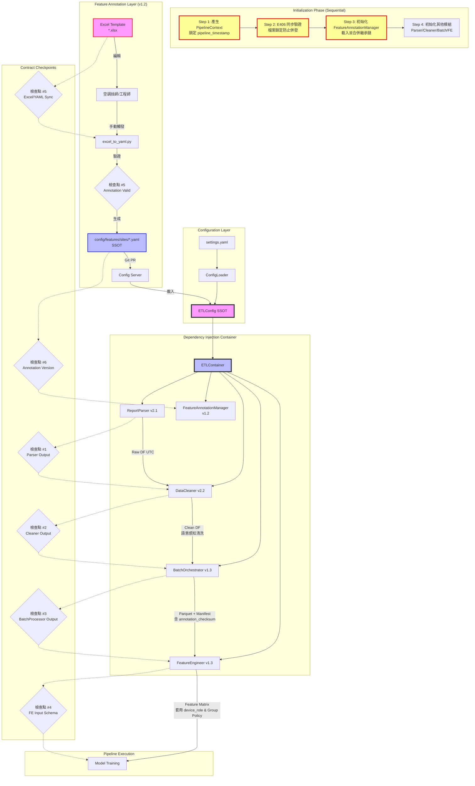

# PRD v1.2: 系統整合架構 (System Integration Architecture)
# 整合 Feature Annotation v1.2 + 初始化順序控制 + 時間基準同步機制

**文件版本:** v1.2 (Ordered Initialization & Temporal Consistency)  
**日期:** 2026-02-13  
**負責人:** Oscar Chang  
**目標模組:** `src/container.py`, `src/main.py`, `src/utils/config_loader.py`, `src/features/annotation_manager.py`, `src/context.py`  
**相依模組:** 
- Parser v2.1+, Cleaner v2.2+, BatchProcessor v1.3+, Feature Engineer v1.3+
- Feature Annotation v1.2 (Excel-Centric SSOT)
- **Interface Contract v1.1** (錯誤代碼分層與時間基準規範)
**預估工時:** 6 ~ 7 個工程天（含併發控制與順序驗證測試）

---

## 1. 執行總綱與設計哲學

### 1.1 核心目標

建立**零間隙對接**且**時空一致**的完整 ETL Pipeline，強化系統穩定性：

1. **配置單一真相源 (SSOT)**: 
   - 運行時配置：`ETLConfig` 實例
   - 特徵定義：**Excel 唯一編輯** → YAML SSOT → Pipeline 消費
2. **嚴格初始化順序 (Critical)**: **E406驗證 → Manager初始化 → 其他模組**，防止Race Condition與策略失效
3. **全域時間基準 (Pipeline Timestamp)**: 統一`pipeline_timestamp`，防止Pipeline執行期間的「未來資料」漂移誤判
4. **併發控制**: YAML檔案讀寫鎖，防止Wizard與Pipeline同時存取SSOT
5. **依賴注入 (DI)**: 透過 `Container` 管理模組生命周期，包含 `FeatureAnnotationManager`
6. **契約檢查點**: 6 個關鍵檢查點（新增 Annotation 同步檢查 #5, #6）

### 1.2 架構概覽（v1.2 更新）



---

## 2. SSOT 配置系統 (Configuration System)

### 2.1 統一配置結構（整合 Feature Annotation v1.2）

**檔案**: `src/etl/config_models.py` (核心 SSOT)

**關鍵更新**:
- 新增 `FeatureAnnotationConfig` 設定 Annotation 路徑與版本檢查
- `ETLConfig` 新增 `feature_annotation` 欄位
- **移除 `CleanerConfig.default_device_role`（審查修正：避免隱性預設值）**
- **新增 `CleanerConfig.unannotated_column_policy`（審查修正：未定義欄位處理策略）**
- **新增 `ETLConfig.concurrency` 設定併發控制參數（v1.2）**

```python
from typing import Final, List, Dict, Optional, Literal
from pydantic import BaseModel, validator, Field

# SSOT 1: Quality Flags (6個標準值，全域唯一)
VALID_QUALITY_FLAGS: Final[List[str]] = [
    "FROZEN",           # 數據凍結（連續3個區間值相同）
    "HEAT_IMBALANCE",   # 熱平衡偏差 > 5%
    "AFFINITY_VIOLATION", # 違反親和律 > 15%
    "OUTLIER",          # 統計離群值（IQR法）
    "INSUFFICIENT_DATA", # 時間空缺補全標記
    "SENSOR_OFFLINE"    # 感測器離線（新增）
]

# SSOT 2: 時間戳規範 (所有模組必須遵守)
TIMESTAMP_CONFIG: Final[Dict] = {
    "dtype": "Datetime",
    "time_unit": "nanoseconds",  # ns
    "time_zone": "UTC",          # 強制UTC
    "parquet_physical_type": "INT64"  # 禁止INT96
}

# SSOT 3: Feature Annotation 相關常數（新增）
FEATURE_ANNOTATION_CONSTANTS: Final[Dict] = {
    "current_template_version": "1.2",
    "expected_schema_version": "1.2",
    "checksum_algorithm": "sha256"
}

# SSOT 4: 錯誤代碼分層規範（主要定義見 Interface Contract v1.0）
ERROR_CODE_REGISTRY: Final[Dict[str, str]] = {
    # E000: 全域
    "E000": "Temporal baseline missing",
    # E0xx: 系統層
    "E006": "Memory limit exceeded", 
    "E007": "Config file corrupted",
    # E1xx: Parser (Critical)
    "E101": "Encoding/BOM mismatch",
    "E102": "Timezone violation (Non-UTC)",
    "E103": "Contract violation (Missing cols/flags)",
    "E104": "Header not found",
    "E105": "Column validation failed",
    # E1xx: Parser (Warnings)
    "E111": "Timezone warning (Auto-converted)",
    "E112": "Future data detected (Parser)",
    "E113": "Unknown quality flag (Parser)",
    "E114": "Unit conversion error",
    "E115": "Encoding warning",
    # E2xx: Cleaner
    "E201": "Input schema mismatch",
    "E202": "Unknown quality flag (Batch)",
    "E203": "Metadata loss",
    "E205": "Future data in batch",
    "E206": "Parquet format violation",
    # E3xx: BatchProcessor
    "E301": "Manifest integrity failed",
    "E302": "Schema mismatch (Storage)",
    "E303": "Unknown quality flag (Storage)",
    "E304": "Metadata missing (Manifest)",
    "E305": "Data leakage detected",
    # E35x: Equipment Validation
    "E350": "Constraint config error",
    "E351": "Requires violation",
    "E352": "Mutex violation",
    "E353": "Sequence violation",
    "E354": "Min runtime violation",
    "E355": "Min downtime violation",
    # E4xx: Feature Annotation
    "E400": "Annotation version mismatch",
    "E401": "Orphan column",
    "E402": "Unannotated column",
    "E403": "Unit incompatible",
    "E404": "Lag format invalid",
    "E405": "Target leakage risk",
    "E406": "Excel/YAML out of sync",
    "E407": "Circular inheritance",
    # E5xx: Governance
    "E500": "Device role leakage",
    "E501": "Direct write attempt blocked",
    # E6xx: Feature Engineer
    "E601": "Feature order not recorded",
    "E602": "Scaler params missing",
    "E603": "Feature matrix shape error",
    "E604": "Invalid lag configuration",
    # E7xx: Model Training
    "E701": "Training memory error",
    "E702": "Validation failure",
    "E703": "Hyperparameter invalid",
    "E704": "Checkpoint save failed",
    "E705": "Cross validation error",
    "E706": "Model artifact corrupted",
    # E75x: Hybrid Consistency
    "E750": "Golden dataset unavailable",
    "E751": "Dynamic tolerance exceeded",
    "E752": "Systematic bias detected",
    "E753": "Trend mismatch",
    "E754": "Outlier violation",
    "E755": "Insufficient components",
    "E756": "Partial components (L2)",
    "E757": "Light load variance",
    "E758": "Copula effect detected",
    "E759": "Dataset quality warning",
    # E8xx: Optimization
    "E801": "Model load failed",
    "E802": "Constraint violation",
    "E803": "Optimization divergence",
    "E804": "Bound infeasibility",
    "E805": "Forecast horizon mismatch",
    "E806": "System model discrepancy",
    "E807": "Equipment state invalid",
    "E808": "Weather data missing",
    # E9xx: Cross-Stage
    "E901": "Feature alignment mismatch",
    "E902": "Feature dimension mismatch",
    "E903": "Scaler mismatch",
    "E904": "Model version incompatible",
    "E905": "Pipeline version drift",
}

# SSOT 5: Feature Metadata Schema（更新：支援 device_role）
class FeatureMetadata(BaseModel):
    column_name: str
    physical_type: Literal[
        "temperature", "flow_rate", "power", "status", 
        "humidity", "gauge", "chiller_load", "cooling_tower_load"
    ]
    unit: Optional[str] = None           # "LPM", "kW", "°C", "%"
    device_role: Literal["primary", "backup", "seasonal"] = "primary"  # 新增
    is_target: bool = False              
    enable_lag: bool = True
    enable_rolling: bool = True
    agg_method: Literal["mean", "sum", "last", "first"] = "mean"
    ignore_warnings: List[str] = Field(default_factory=list)  # 新增：["W401", "W403"]
    
    @validator('enable_lag')
    def validate_target_no_lag(cls, v, values):
        """E405: Target 變數不可啟用 Lag"""
        if values.get('is_target') and v:
            raise ValueError("E405: is_target=True 時 enable_lag 必須為 False")
        return v

# Parser 配置
class ParserConfig(BaseModel):
    encoding: str = "auto"               
    header_scan_rows: int = 500
    assumed_timezone: str = "Asia/Taipei"  
    null_values: List[str] = Field(default_factory=lambda: [
        "", "NA", "null", "---", "Error", "N/A", "OFF", "OFFLINE", "#VALUE!"
    ])

# Cleaner 配置（審查修正：移除 default_device_role，避免隱性預設值）
class CleanerConfig(BaseModel):
    unit_system: Literal["METRIC", "IMPERIAL"] = "METRIC"
    resample_interval: str = "15m"       
    heat_balance_threshold: float = 0.05  
    frozen_data_intervals: int = 3
    enforce_output_contract: bool = True
    # 審查修正：移除 default_device_role，所有 device_role 必須來自 Annotation
    use_device_role_from_annotation: bool = True
    # 審查修正：新增未定義欄位處理策略（strict_mode 下應為 error）
    unannotated_column_policy: Literal["error", "skip", "warn"] = "error"

# BatchProcessor 配置（更新：Annotation 版本寫入 Manifest）
class BatchConfig(BaseModel):
    output_base_dir: str = "data/processed"
    staging_dir: str = "data/.staging"
    max_rows_per_file: int = 100_000
    compression: Literal["snappy", "zstd"] = "snappy"
    use_pyarrow: bool = False            
    future_data_tolerance_minutes: int = 5
    # 新增：強制檢查 Annotation 同步
    enforce_annotation_sync: bool = True

# Feature Engineer 配置（更新：使用 Group Policy）
class FeatureEngineeringConfig(BaseModel):
    execution_mode: Literal["in_memory"] = "in_memory"
    cutoff_timestamp: Optional[str] = None  
    group_policies: List[Dict] = Field(default_factory=list)
    physics_features: bool = True
    time_features: bool = True
    # 新增：消費 device_role 與 ignore_warnings
    respect_device_role: bool = True       # 抑制備用設備統計誤報
    respect_ignore_warnings: bool = True   # 抑制特定警告

# Feature Annotation 配置（新增）
class FeatureAnnotationConfig(BaseModel):
    """Feature Annotation v1.2 設定"""
    enabled: bool = True
    excel_base_dir: str = "data/features"           # 使用者編輯區
    yaml_base_dir: str = "config/features/sites"    # SSOT 輸出
    template_dir: str = "tools/features/templates"
    current_template_version: str = "1.2"
    # 自動同步檢查
    auto_sync_check: bool = True
    # 嚴格模式：Excel/YAML 不同步時阻擋 Pipeline
    strict_sync_check: bool = True
    # v1.2 新增：檔案鎖逾時時間（秒）
    file_lock_timeout: int = 30
    # v1.2 新增：YAML 檔案鎖路徑
    lock_file_dir: str = "data/.locks"

# v1.2 新增：併發控制配置
class ConcurrencyConfig(BaseModel):
    """併發控制與資源鎖定設定"""
    enable_file_locking: bool = True
    lock_timeout_seconds: int = 30
    lock_retry_interval: float = 0.5
    max_concurrent_pipelines: int = 1  # 單一案場同時間只能執行一個 Pipeline

# 統一配置根（更新）
class ETLConfig(BaseModel):
    """ETL Pipeline 統一配置 (SSOT 中心)"""
    version: str = "1.0"
    site_id: str = "default"
    
    parser: ParserConfig = ParserConfig()
    cleaner: CleanerConfig = CleanerConfig()
    batch: BatchConfig = BatchConfig()
    feature: FeatureEngineeringConfig = FeatureEngineeringConfig()
    feature_annotation: FeatureAnnotationConfig = FeatureAnnotationConfig()  # 新增
    concurrency: ConcurrencyConfig = ConcurrencyConfig()  # v1.2 新增
    
    # 全域設定
    log_level: str = "INFO"
    strict_mode: bool = True             
    
    @validator('version')
    def validate_version(cls, v):
        if v != "1.0":
            raise ValueError("Config version must be 1.0")
        return v
    
    @validator('feature_annotation')
    def validate_annotation_paths(cls, v):
        """確保 Annotation 目錄存在"""
        from pathlib import Path
        for path_attr in ['excel_base_dir', 'yaml_base_dir', 'lock_file_dir']:
            path = Path(getattr(v, path_attr))
            path.mkdir(parents=True, exist_ok=True)
        return v
```

### 2.2 配置載入器 (ConfigLoader) - 整合時間基準與併發控制

**檔案**: `src/utils/config_loader.py`

**關鍵更新 (v1.2)**:
- 新增 `load_feature_annotation()` 方法載入 YAML SSOT（注意：僅載入，不處理繼承，繼承邏輯在 Manager 處理）
- 新增 `validate_annotation_sync()` 檢查 Excel/YAML 同步狀態
- **新增 `acquire_yaml_lock()` / `release_yaml_lock()`：檔案鎖機制防止併發寫入（v1.2）**
- **新增 `PipelineContext` 支援：統一時間基準傳遞（v1.2）**

```python
import yaml
import hashlib
import fcntl
import os
from pathlib import Path
from typing import Union, Dict, Optional
from datetime import datetime, timezone
from contextlib import contextmanager
from src.etl.config_models import ETLConfig, VALID_QUALITY_FLAGS, FEATURE_ANNOTATION_CONSTANTS

class ConfigurationError(Exception):
    """配置錯誤"""
    pass

class AnnotationSyncError(ConfigurationError):
    """E406: Excel 與 YAML 不同步"""
    pass

class FileLockError(ConfigurationError):
    """E003/E408: 檔案鎖定失敗"""
    pass

class ConfigLoader:
    """統一配置載入，確保所有模組引用相同 SSOT"""
    
    @staticmethod
    def load(config_path: Union[str, Path] = "config/settings.yaml") -> ETLConfig:
        """載入並驗證 ETL 主配置"""
        config_path = Path(config_path)
        
        if not config_path.exists():
            raise ConfigurationError(f"配置文件不存在: {config_path}")
        
        with open(config_path, 'r', encoding='utf-8') as f:
            try:
                data = yaml.safe_load(f)
            except yaml.YAMLError as e:
                raise ConfigurationError(f"YAML 解析錯誤: {e}")
        
        # 驗證 SSOT 一致性
        code_flags = set(VALID_QUALITY_FLAGS)
        config_flags = set(data.get("custom_quality_flags", []))
        
        if config_flags and config_flags != code_flags:
            missing_base = code_flags - config_flags
            if missing_base:
                raise ConfigurationError(
                    f"settings.yaml 中的 flags 缺少 SSOT 基礎標記: {missing_base}. "
                    f"程式碼定義: {code_flags}"
                )
        
        # 驗證目錄存在性或自動建立
        for dir_key in ["output_base_dir", "staging_dir"]:
            if dir_key in data.get("batch", {}):
                Path(data["batch"][dir_key]).mkdir(parents=True, exist_ok=True)
        
        try:
            return ETLConfig(**data)
        except Exception as e:
            raise ConfigurationError(f"配置驗證失敗: {e}")
    
    @staticmethod
    def load_feature_annotation(site_id: str, yaml_base_dir: str = "config/features/sites") -> Dict:
        """
        載入特定案場的 Feature Annotation YAML (原始內容，未合併繼承)
        注意：繼承合併邏輯由 FeatureAnnotationManager 處理
        
        檢查項目:
        1. 檔案存在性
        2. schema_version 相容性（僅檢查，不合併）
        3. 檔案鎖狀態（僅檢查，不取得鎖）
        """
        yaml_path = Path(yaml_base_dir) / f"{site_id}.yaml"
        
        if not yaml_path.exists():
            raise ConfigurationError(f"E402: Feature Annotation 未定義: {yaml_path}")
        
        # v1.2: 檢查是否有進程正在寫入（鎖檔案存在）
        lock_path = Path(f"data/.locks/{site_id}.yaml.lock")
        if lock_path.exists():
            lock_age = datetime.now().timestamp() - lock_path.stat().st_mtime
            if lock_age < 300:  # 5分鐘內的鎖視為有效
                raise FileLockError(f"E408: YAML 檔案正在被其他進程修改 (鎖存在 {lock_age:.0f} 秒)")
        
        with open(yaml_path, 'r', encoding='utf-8') as f:
            annotation = yaml.safe_load(f)
        
        # 檢查 Schema 版本（檢查點 #6）
        schema_ver = annotation.get('schema_version', 'unknown')
        expected_ver = FEATURE_ANNOTATION_CONSTANTS['expected_schema_version']
        if schema_ver != expected_ver:
            raise ConfigurationError(
                f"E400: Annotation Schema 版本不符。期望: {expected_ver}, 實際: {schema_ver}. "
                f"請執行 migrate_excel.py 升級"
            )
        
        return annotation
    
    @staticmethod
    @contextmanager
    def acquire_yaml_lock(site_id: str, lock_dir: str = "data/.locks", timeout: int = 30):
        """
        v1.2 新增：上下文管理器取得 YAML 檔案鎖
        
        使用 fcntl 實作進程間鎖定，防止：
        1. excel_to_yaml.py 轉換時 Pipeline 讀取（讀髒資料）
        2. 多個 Pipeline 實例同時執行（資源衝突）
        
        Args:
            site_id: 案場 ID
            lock_dir: 鎖檔案目錄
            timeout: 逾時秒數
            
        Raises:
            FileLockError: E003 無法取得鎖
        """
        lock_path = Path(lock_dir)
        lock_path.mkdir(parents=True, exist_ok=True)
        lock_file = lock_path / f"{site_id}.yaml.lock"
        
        lock_fd = None
        start_time = datetime.now()
        
        try:
            # 嘗試取得鎖
            while True:
                try:
                    lock_fd = os.open(str(lock_file), os.O_CREAT | os.O_RDWR)
                    fcntl.flock(lock_fd, fcntl.LOCK_EX | fcntl.LOCK_NB)
                    # 寫入鎖資訊
                    os.write(lock_fd, f"{os.getpid()}|{datetime.now().isoformat()}".encode())
                    break
                except (IOError, OSError):
                    if lock_fd:
                        os.close(lock_fd)
                        lock_fd = None
                    
                    elapsed = (datetime.now() - start_time).total_seconds()
                    if elapsed > timeout:
                        raise FileLockError(f"E003: 無法取得 YAML 檔案鎖（逾時 {timeout} 秒）")
                    
                    import time
                    time.sleep(0.5)
            
            yield lock_file
            
        finally:
            if lock_fd:
                fcntl.flock(lock_fd, fcntl.LOCK_UN)
                os.close(lock_fd)
                try:
                    lock_file.unlink()
                except:
                    pass
    
    @staticmethod
    def validate_annotation_sync(site_id: str, excel_base_dir: str, yaml_base_dir: str) -> dict:
        """
        E406: 檢查 Excel 與 YAML 是否同步
        
        Returns:
            {
                'synced': bool,
                'excel_mtime': float,
                'yaml_mtime': float,
                'excel_checksum': str,
                'yaml_checksum': str,
                'reason': str
            }
        """
        excel_path = Path(excel_base_dir) / site_id / f"{site_id}.xlsx"
        yaml_path = Path(yaml_base_dir) / f"{site_id}.yaml"
        
        if not excel_path.exists():
            return {'synced': False, 'reason': f'Excel 不存在: {excel_path}'}
        if not yaml_path.exists():
            return {'synced': False, 'reason': f'YAML 不存在: {yaml_path}'}
        
        # 時間戳比較
        excel_mtime = excel_path.stat().st_mtime
        yaml_mtime = yaml_path.stat().st_mtime
        
        if excel_mtime > yaml_mtime:
            return {
                'synced': False,
                'excel_mtime': excel_mtime,
                'yaml_mtime': yaml_mtime,
                'reason': f'E406: Excel ({excel_path.name}) 較新，請重新執行 excel_to_yaml.py'
            }
        
        # Checksum 比對（若 YAML 中有記錄）
        with open(yaml_path, 'r', encoding='utf-8') as f:
            yaml_content = yaml.safe_load(f)
        
        stored_checksum = yaml_content.get('meta', {}).get('excel_checksum', '')
        if stored_checksum:
            actual_checksum = ConfigLoader._compute_file_hash(excel_path)
            if stored_checksum != actual_checksum:
                return {
                    'synced': False,
                    'excel_checksum': actual_checksum,
                    'yaml_checksum': stored_checksum,
                    'reason': 'E406: Checksum 不符，Excel 可能已修改但未重新生成 YAML'
                }
        
        return {'synced': True, 'reason': '同步'}
    
    @staticmethod
    def _compute_file_hash(file_path: Path) -> str:
        """計算檔案 SHA256"""
        sha256_hash = hashlib.sha256()
        with open(file_path, "rb") as f:
            for byte_block in iter(lambda: f.read(4096), b""):
                sha256_hash.update(byte_block)
        return f"sha256:{sha256_hash.hexdigest()}"
    
    @staticmethod
    def get_annotation_metadata(site_id: str, yaml_base_dir: str) -> Dict:
        """取得 Annotation 元資料（供 Manifest 寫入）"""
        # 注意：此處僅讀取原始檔案的 meta，不觸發繼承合併
        annotation = ConfigLoader.load_feature_annotation(site_id, yaml_base_dir)
        return {
            'schema_version': annotation.get('schema_version'),
            'template_version': annotation.get('meta', {}).get('template_version'),
            'last_updated': annotation.get('meta', {}).get('last_updated'),
            'editor': annotation.get('meta', {}).get('editor'),
            'yaml_checksum': annotation.get('meta', {}).get('excel_checksum', '')
        }
```

### 2.3 PipelineContext - 全域時間基準與狀態載體（v1.2 新增）

**檔案**: `src/context.py`

**設計目的**:
- 解決「未來資料檢查的時間基準不一致」問題（Parser/Cleaner/BatchProcessor 各自呼叫 `datetime.now()` 導致漂移）
- 攜帶 Pipeline 執行期間的全域狀態（時間戳、案場ID、嚴格模式等）
- 確保所有模組使用相同的「現在」時間點

```python
from datetime import datetime, timezone
from typing import Optional, Dict, Any
from dataclasses import dataclass, field

@dataclass
class PipelineContext:
    """
    Pipeline 執行上下文（v1.2 新增）
    
    作為 DI Container 初始化時產生的「時間膠囊」，確保：
    1. 所有未來資料檢查使用相同的 pipeline_timestamp
    2. 跨模組的時間邏輯一致性（避免 Pipeline 執行期間時間流逝導致誤判）
    3. 可追溯性（記錄 Pipeline 啟動時間）
    
    Attributes:
        pipeline_timestamp: Pipeline 啟動時的 UTC 時間（所有「未來資料」檢查的基準）
        site_id: 案場識別碼
        strict_mode: 是否嚴格模式（影響錯誤處理策略）
        config_hash: 設定檔雜湊（確保執行期間設定未被修改）
        metadata: 擴充元資料字典
    """
    pipeline_timestamp: datetime = field(default_factory=lambda: datetime.now(timezone.utc))
    site_id: str = "default"
    strict_mode: bool = True
    config_hash: Optional[str] = None
    metadata: Dict[str, Any] = field(default_factory=dict)
    
    def is_future_timestamp(self, timestamp: datetime, tolerance_minutes: int = 5) -> bool:
        """
        檢查給定時間戳是否為「未來資料」（相對於 pipeline_timestamp）
        
        Args:
            timestamp: 待檢查的時間戳
            tolerance_minutes: 容忍分鐘數（考慮時鐘誤差與處理延遲）
            
        Returns:
            bool: True 如果 timestamp 超過 pipeline_timestamp + tolerance
        """
        if timestamp.tzinfo is None:
            # 假設無時區為 UTC（或根據設定處理）
            from datetime import timezone
            timestamp = timestamp.replace(tzinfo=timezone.utc)
        
        tolerance = __import__('datetime').timedelta(minutes=tolerance_minutes)
        return timestamp > (self.pipeline_timestamp + tolerance)
    
    def get_elapsed_seconds(self) -> float:
        """取得 Pipeline 已執行秒數"""
        return (datetime.now(timezone.utc) - self.pipeline_timestamp).total_seconds()
    
    def to_dict(self) -> Dict[str, Any]:
        """序列化為字典（供 Manifest 記錄）"""
        return {
            'pipeline_timestamp': self.pipeline_timestamp.isoformat(),
            'site_id': self.site_id,
            'strict_mode': self.strict_mode,
            'config_hash': self.config_hash,
            'elapsed_seconds_at_save': self.get_elapsed_seconds()
        }
    
    @classmethod
    def from_dict(cls, data: Dict[str, Any]) -> 'PipelineContext':
        """從字典還原"""
        timestamp = datetime.fromisoformat(data['pipeline_timestamp'])
        return cls(
            pipeline_timestamp=timestamp,
            site_id=data['site_id'],
            strict_mode=data['strict_mode'],
            config_hash=data.get('config_hash')
        )
```

---

## 3. 依賴注入容器 (DI Container) - 嚴格初始化順序控制

### 3.1 ETLContainer 實作（v1.2：順序控制與併發防護）

**檔案**: `src/container.py`

**關鍵修正 (v1.2)**:
- **嚴格初始化順序**：`__init__` 方法內部分為 4 個明確階段，防止 Race Condition
- **檔案鎖整合**：初始化時自動取得 YAML 鎖，防止 Wizard 與 Pipeline 衝突
- **PipelineContext 注入**：所有模組統一透過 Context 取得時間基準
- **Cleaner 職責釐清**：僅讀取 device_role 用於策略調整，不寫入 metadata

```python
from typing import Optional, List, Dict
from pathlib import Path
import polars as pl

from src.etl.config_models import ETLConfig
from src.etl.parser import ReportParser
from src.etl.cleaner import DataCleaner
from src.etl.batch_processor import BatchOrchestrator, BatchResult
from src.etl.feature_engineer import FeatureEngineer
from src.features.annotation_manager import FeatureAnnotationManager
from src.utils.config_loader import ConfigLoader, AnnotationSyncError, FileLockError
from src.utils.logger import get_logger
from src.context import PipelineContext  # v1.2 新增

class ETLContainer:
    """
    依賴注入容器 (Dependency Injection Container) - v1.2
    
    管理所有 ETL 模組的生命周期與配置傳遞，確保:
    1. 單例模式 (Singleton) 
    2. 配置一致性 
    3. 嚴格初始化順序（防止 Race Condition）
    4. Feature Annotation 正確流向各模組（Excel → YAML → Manager → Modules）
    5. 零間隙銜接 
    6. 併發控制（檔案鎖）
    
    **初始化順序（嚴格執行）**:
    Step 1: 產生 PipelineContext（鎖定時間基準）
    Step 2: 驗證 E406 同步並取得檔案鎖
    Step 3: 初始化 FeatureAnnotationManager（載入並合併繼承）
    Step 4: 初始化其他模組（Parser/Cleaner/BatchProcessor/FE）
    """
    
    def __init__(self, config: ETLConfig):
        self.config = config
        self.logger = get_logger("ETLContainer")
        
        # v1.2: Step 1 - 初始化 PipelineContext（時間基準）
        self.context = PipelineContext(
            site_id=config.site_id,
            strict_mode=config.strict_mode,
            config_hash=self._compute_config_hash(config)
        )
        self.logger.info(f"🕐 PipelineContext 初始化完成，時間基準: {self.context.pipeline_timestamp.isoformat()}")
        
        # 快取實例 (Singleton)
        self._parser: Optional[ReportParser] = None
        self._cleaner: Optional[DataCleaner] = None
        self._batch_processor: Optional[BatchOrchestrator] = None
        self._feature_engineer: Optional[FeatureEngineer] = None
        self._annotation_manager: Optional[FeatureAnnotationManager] = None
        
        # v1.2: 檔案鎖控制
        self._lock_acquired = False
        self._lock_file: Optional[Path] = None
        
        # v1.2: 執行嚴格初始化順序
        self._initialize_in_order()
    
    def _compute_config_hash(self, config: ETLConfig) -> str:
        """計算配置雜湊（防止執行期間設定被修改）"""
        import hashlib
        import json
        config_str = json.dumps(config.dict(), sort_keys=True, default=str)
        return hashlib.sha256(config_str.encode()).hexdigest()[:16]
    
    def _initialize_in_order(self):
        """
        嚴格初始化順序（v1.2 核心修正）
        
        此順序確保：
        - Annotation 已驗證且鎖定後，其他模組才能讀取
        - Manager 先於 Cleaner 初始化，確保 unannotated_column_policy 正確傳遞
        - 時間基準先確立，後續模組的「未來資料」檢查有一致標準
        """
        try:
            # Step 2: E406 驗證與檔案鎖取得（Critical）
            if self.config.feature_annotation.enabled:
                self._acquire_annotation_lock()
                self._validate_annotation_sync()
            
            # Step 3: 初始化 FeatureAnnotationManager（必須在 Cleaner 之前）
            if self.config.feature_annotation.enabled:
                self._load_annotation_manager()
            
            # Step 4: 初始化其他模組（此時 Context 與 Manager 已就緒）
            # 注意：實際實例化採用惰性載入（lazy loading），但順序在此確保
            self.logger.info("✅ 依賴注入容器初始化完成（順序驗證通過）")
            
        except Exception as e:
            self._cleanup_lock()
            raise
    
    def _acquire_annotation_lock(self):
        """v1.2: 取得 Annotation YAML 檔案鎖"""
        if not self.config.concurrency.enable_file_locking:
            return
        
        try:
            self.logger.debug("🔒 嘗試取得 Annotation 檔案鎖...")
            # 使用上下文管理器，但手動控制解鎖時機（Pipeline 結束時）
            self._lock_cm = ConfigLoader.acquire_yaml_lock(
                self.config.site_id,
                self.config.feature_annotation.lock_file_dir,
                self.config.feature_annotation.file_lock_timeout
            )
            self._lock_file = self._lock_cm.__enter__()
            self._lock_acquired = True
            self.logger.debug(f"🔒 檔案鎖已取得: {self._lock_file}")
        except FileLockError as e:
            self.logger.error(f"❌ 無法取得檔案鎖: {e}")
            raise RuntimeError(f"E003: {e}") from e
    
    def _validate_annotation_sync(self):
        """v1.2: 檢查點 #5 - Annotation 同步驗證"""
        fa_config = self.config.feature_annotation
        
        if not fa_config.auto_sync_check:
            return
        
        self.logger.info("🔍 檢查點 #5: 驗證 Excel/YAML 同步狀態...")
        sync_status = ConfigLoader.validate_annotation_sync(
            self.config.site_id,
            fa_config.excel_base_dir,
            fa_config.yaml_base_dir
        )
        
        if not sync_status['synced']:
            if fa_config.strict_sync_check:
                raise AnnotationSyncError(sync_status['reason'])
            else:
                self.logger.warning(f"⚠️ Annotation 同步警告: {sync_status['reason']}")
        else:
            self.logger.info("✅ 檢查點 #5: Excel/YAML 同步 - 通過")
    
    def _load_annotation_manager(self):
        """v1.2: Step 3 - 載入 FeatureAnnotationManager（含繼承合併）"""
        fa_config = self.config.feature_annotation
        
        try:
            self._annotation_manager = FeatureAnnotationManager(
                site_id=self.config.site_id,
                yaml_base_dir=fa_config.yaml_base_dir
            )
            
            self.logger.info(
                f"📋 FeatureAnnotationManager 初始化完成 "
                f"(Schema: {self._annotation_manager.schema_version}, "
                f"Columns: {len(self._annotation_manager.columns)}, "
                f"Inheritance: {self._annotation_manager.inheritance_chain})"
            )
            
            # 檢查點 #6: Schema 版本相容
            if self._annotation_manager.schema_version != fa_config.current_template_version:
                raise ConfigurationError(
                    f"E400: Schema 版本不符。Manager: {self._annotation_manager.schema_version}, "
                    f"期望: {fa_config.current_template_version}"
                )
            
        except Exception as e:
            self.logger.error(f"❌ FeatureAnnotationManager 初始化失敗: {e}")
            raise
    
    def _cleanup_lock(self):
        """v1.2: 清理檔案鎖"""
        if self._lock_acquired and hasattr(self, '_lock_cm'):
            try:
                self._lock_cm.__exit__(None, None, None)
                self.logger.debug("🔓 檔案鎖已釋放")
            except:
                pass
            self._lock_acquired = False
    
    def __del__(self):
        """解構時確保釋放鎖"""
        self._cleanup_lock()
    
    def get_annotation_manager(self) -> FeatureAnnotationManager:
        """取得 FeatureAnnotationManager（檢查點 #6）"""
        if self._annotation_manager is None:
            raise RuntimeError("E901: FeatureAnnotationManager 未初始化，違反初始化順序")
        return self._annotation_manager
    
    def get_context(self) -> PipelineContext:
        """v1.2: 取得 PipelineContext（時間基準與全域狀態）"""
        if not hasattr(self, 'context'):
            raise RuntimeError("E902: PipelineContext 未初始化")
        return self.context
    
    def get_parser(self) -> ReportParser:
        """
        取得 Parser 實例（v1.2: 注入 Context 時間基準）
        
        Parser v2.1+ 會:
        1. 使用 Context.pipeline_timestamp 作為「未來資料」檢查基準（E102）
        2. 確保所有時間戳轉換為 UTC
        """
        if self._parser is None:
            self._parser = ReportParser(
                site_id=self.config.site_id,
                config=self.config.parser,
                context=self.get_context()  # v1.2: 注入時間基準
            )
            self.logger.debug("初始化 ReportParser (含 PipelineContext)")
        return self._parser
    
    def get_cleaner(self) -> DataCleaner:
        """
        取得 Cleaner 實例（v1.2: 嚴格順序控制）
        
        **初始化順序要求**: 必須在 FeatureAnnotationManager 之後初始化
        
        Cleaner v2.2+ 會:
        1. 持有 AnnotationManager 引用，用於查詢 device_role（不寫入 DataFrame）
        2. 使用 Context.pipeline_timestamp 作為「未來資料」檢查基準（E205）
        3. 根據 device_role 調整清洗策略（如 backup 設備放寬凍結檢測）
        4. 對於 unannotated 欄位，依據 unannotated_column_policy 處理（E402）
        
        注意：device_role 不會被寫入 Parquet metadata，僅用於 runtime 邏輯判斷
        """
        if self._annotation_manager is None:
            raise RuntimeError("E901: 違反初始化順序 - Cleaner 要求 AnnotationManager 先初始化")
        
        if self._cleaner is None:
            self._cleaner = DataCleaner(
                config=self.config.cleaner,
                annotation_manager=self._annotation_manager,
                context=self.get_context()  # v1.2: 注入時間基準
            )
            self.logger.debug("初始化 DataCleaner (含 AnnotationManager 引用與 Context，不寫入 metadata)")
        return self._cleaner
    
    def get_batch_processor(self) -> BatchOrchestrator:
        """
        取得 BatchProcessor 實例（v1.2: 注入時間基準）
        
        BatchProcessor v1.3+ 會:
        1. 接收來自 Cleaner 的資料（不含 device_role metadata）
        2. 使用 Context.pipeline_timestamp 作為「未來資料」檢查基準（E303）
        3. 將 Annotation Metadata（version, checksum）寫入 Manifest（供稽核）
        4. 執行 E406 檢查（若 enforce_annotation_sync=True）
        """
        if self._batch_processor is None:
            annotation_meta = {}
            if self._annotation_manager:
                annotation_meta = self._annotation_manager.get_metadata()
            
            self._batch_processor = BatchOrchestrator(
                config=self.config,
                parser=self.get_parser(),
                cleaner=self.get_cleaner(),
                annotation_metadata=annotation_meta,
                context=self.get_context()  # v1.2: 注入時間基準
            )
            self.logger.debug("初始化 BatchOrchestrator (含 Annotation Metadata 與 Context)")
        return self._batch_processor
    
    def get_feature_engineer(self) -> FeatureEngineer:
        """
        取得 FeatureEngineer 實例（v1.2: 注入時間基準）
        
        Feature Engineer v1.3+ 會:
        1. 讀取 Annotation 中的 group_policies（從 Manager，非 DataFrame metadata）
        2. 根據 device_role 決定是否抑制 W403（備用設備高零值正常）
        3. 根據 ignore_warnings 過濾統計警告
        4. 使用 Context.pipeline_timestamp 計算特徵時間偏移
        """
        if self._feature_engineer is None:
            group_policies = []
            column_configs = {}
            
            if self._annotation_manager:
                group_policies = self._annotation_manager.get_group_policies()
                column_configs = self._annotation_manager.get_column_configs()
            
            # 合併配置：Annotation 優先於程式碼配置
            merged_config = self.config.feature.copy()
            merged_config.group_policies = group_policies or merged_config.group_policies
            
            self._feature_engineer = FeatureEngineer(
                config=merged_config,
                annotation_columns=column_configs,
                context=self.get_context()  # v1.2: 注入時間基準
            )
            self.logger.debug("初始化 FeatureEngineer (含 Group Policy 與 Context)")
        return self._feature_engineer
    
    def run_full_pipeline(self, input_files: List[Path]) -> pl.DataFrame:
        """
        執行完整 ETL 流程（v1.2: 強化順序與併發控制）
        
        流程:
        1. 檢查初始化順序（已於 __init__ 完成）
        2. BatchProcessor (Parser → Cleaner → Parquet + Manifest)
        3. Feature Engineer (Manifest → Feature Matrix，套用 device_role)
        4. 確保釋放檔案鎖
        
        錯誤處理:
        - AnnotationSyncError (E406): 終止流程
        - ContractViolationError: 終止流程
        - FutureDataError: 單檔案跳過（使用統一時間基準）
        """
        self.logger.info(f"🚀 啟動完整 ETL Pipeline，處理 {len(input_files)} 個檔案")
        self.logger.info(f"🕐 時間基準: {self.context.pipeline_timestamp.isoformat()}")
        
        try:
            # Step 1: Batch Processing
            bp = self.get_batch_processor()
            manifests = []
            
            for file_path in input_files:
                try:
                    result = bp.process_single_file(file_path)
                    
                    if result.status == "success":
                        manifests.append(result.manifest_path)
                        self.logger.info(f"✅ 處理成功: {file_path.name}")
                    elif result.status == "future_data_rejected":
                        self.logger.warning(f"⚠️  未來資料拒絕: {file_path.name} - {result.error}")
                    else:
                        self.logger.error(f"❌ 處理失敗: {file_path.name} - {result.error}")
                        
                except ContractViolationError as e:
                    self.logger.error(f"❌ 檢查點 #2/#3 契約違反: {file_path.name} - {e}")
                    if self.config.strict_mode:
                        raise
            
            if not manifests:
                raise DataValidationError("沒有成功處理的檔案，無法繼續特徵工程")
            
            # Step 2: Feature Engineering
            fe = self.get_feature_engineer()
            manifest_path = manifests[-1]
            
            self.logger.info(f"🔧 開始特徵工程: {manifest_path}")
            
            # 讀取 Manifest 與資料
            df, metadata = fe.load_from_manifest(manifest_path)
            
            # 檢查點 #4: FE Input Schema 驗證
            self.logger.info("🔍 檢查點 #4: FE Input Schema - 驗證中")
            
            # 轉換（含 device_role 與 ignore_warnings 處理）
            feature_df = fe.transform(
                df,
                manifest_metadata=metadata,
                cutoff_timestamp=self.config.feature.cutoff_timestamp
            )
            
            elapsed = self.context.get_elapsed_seconds()
            self.logger.info(f"✅ ETL Pipeline 完成，輸出維度: {feature_df.shape}，耗時: {elapsed:.2f} 秒")
            return feature_df
            
        finally:
            # v1.2: 確保釋放檔案鎖
            self._cleanup_lock()
    
    def reset(self):
        """重置所有快取實例（保留 Context 與 Lock）"""
        self._parser = None
        self._cleaner = None
        self._batch_processor = None
        self._feature_engineer = None
        # 注意：不清除 _annotation_manager 與 context，確保順序不變
        self.logger.debug("重置所有模組實例（保留 Context 與 AnnotationManager）")
```

### 3.2 FeatureAnnotationManager（v1.2：維持不變，確保繼承合併正確性）

**檔案**: `src/features/annotation_manager.py`

**說明**: v1.2 維持 v1.1-REVISED 的實作，確保繼承合併邏輯穩定。此模組必須在 Container 初始化順序的 Step 3 完成。

```python
# 內容與 v1.1-REVISED 相同，確保：
# 1. _load_with_inheritance() 正確處理 inherit: base
# 2. _deep_merge() 正確覆蓋父設定（非 append）
# 3. 循環繼承檢測（E407）
# （為簡潔省略程式碼，實際部署請複製 v1.1-REVISED 完整內容）
```

---

## 4. CLI 入口點 (Entry Point) - 整合時間基準與併發診斷

### 4.1 HVACCLI 實作（v1.2 更新）

**檔案**: `src/main.py`

**關鍵更新 (v1.2)**:
- `run_etl` 指令顯示 PipelineContext 時間基準（供除錯）
- 新增 `diagnostics` 指令檢查初始化順序與時間基準
- 增強 `validate-annotation` 指令顯示鎖狀態

```python
#!/usr/bin/env python3
import sys
from pathlib import Path
from typing import List, Optional
import fire

from src.container import ETLContainer
from src.utils.config_loader import ConfigLoader, ConfigurationError, AnnotationSyncError
from src.etl.exceptions import ContractViolationError, FutureDataError, DataValidationError

class HVACCLI:
    """
    HVAC Analytics CLI 介面 - v1.2
    
    提供統一的命令列入口，整合 ETL、建模與 Feature Annotation 管理。
    強化功能：時間基準可視化、併發診斷、初始化順序驗證。
    """
    
    def __init__(self, config_path: str = "config/settings.yaml"):
        try:
            self.config = ConfigLoader.load(config_path)
            # v1.2: 初始化 Container（會自動檢查 Annotation 同步、時間基準鎖定、繼承）
            self.container = ETLContainer(self.config)
        except ConfigurationError as e:
            print(f"❌ 配置錯誤: {e}")
            sys.exit(1)
        except AnnotationSyncError as e:
            print(f"❌ E406 同步錯誤: {e}")
            print("💡 請執行: python main.py features validate-annotation")
            sys.exit(6)
        except RuntimeError as e:
            if "E003" in str(e):
                print(f"❌ 併發衝突: {e}")
                print("💡 請確認是否有其他 Pipeline 實例正在執行")
                sys.exit(3)
            raise
    
    def run_etl(self, input_dir: str, output_dir: Optional[str] = None, pattern: str = "*.csv"):
        """
        執行完整 ETL 流程（v1.2: 顯示時間基準與執行時間統計）
        
        Args:
            input_dir: 輸入 CSV 檔案目錄
            output_dir: 輸出目錄 (可選)
            pattern: 檔案匹配模式
        """
        input_path = Path(input_dir)
        if not input_path.exists():
            print(f"❌ 輸入目錄不存在: {input_dir}")
            return
        
        files = list(input_path.glob(pattern))
        if not files:
            print(f"⚠️  未找到匹配檔案: {pattern}")
            return
        
        # v1.2: 顯示時間基準資訊
        context = self.container.get_context()
        print(f"🚀 啟動 ETL Pipeline，處理 {len(files)} 個檔案...")
        print(f"🕐 Pipeline 時間基準: {context.pipeline_timestamp.isoformat()} UTC")
        print(f"🔒 嚴格模式: {context.strict_mode}")
        
        # 顯示 Annotation 資訊（含繼承鏈）
        manager = self.container.get_annotation_manager()
        print(f"📋 Feature Annotation: Schema v{manager.schema_version}")
        print(f"   繼承鏈: {manager.inheritance_chain}")
        
        try:
            result_df = self.container.run_full_pipeline(files)
            
            if output_dir:
                output_path = Path(output_dir)
                output_path.mkdir(parents=True, exist_ok=True)
                output_file = output_path / "feature_matrix.parquet"
                result_df.write_parquet(output_file)
                print(f"💾 特徵矩陣已儲存: {output_file}")
            
            elapsed = context.get_elapsed_seconds()
            print(f"✅ ETL 完成，輸出維度: {result_df.shape}，總耗時: {elapsed:.2f} 秒")
            
        except AnnotationSyncError as e:
            print(f"❌ E406 Annotation 同步錯誤: {e}")
            print("請先執行: python main.py features validate-annotation")
            sys.exit(6)
            
        except ContractViolationError as e:
            print(f"❌ 契約違反錯誤: {e}")
            sys.exit(2)
            
        except FutureDataError as e:
            print(f"⚠️  未來資料錯誤: {e}")
            print(f"💡 提示: 使用時間基準 {context.pipeline_timestamp.isoformat()} 檢測到未來時間戳")
            sys.exit(3)
            
        except Exception as e:
            print(f"❌ 未預期錯誤: {e}")
            import traceback
            traceback.print_exc()
            sys.exit(99)
    
    # ==================== Feature Annotation 子命令群組 ====================
    
    class FeaturesCLI:
        """Feature Annotation v1.2 管理指令"""
        
        def __init__(self, parent):
            self.parent = parent
            self.config = parent.config.feature_annotation
        
        def wizard(self, site: Optional[str] = None, from_csv: Optional[str] = None):
            """
            啟動互動式標註 Wizard（僅更新 Excel，不直寫 YAML）
            
            Usage:
                python main.py features wizard --site cgmh_ty --from-csv data/raw.csv
            
            流程:
            1. 偵測 CSV 新欄位
            2. 互動式確認物理類型/單位
            3. 寫入 Excel（標記 pending_review）
            4. 提示使用者手動執行 excel_to_yaml.py
            
            v1.2: 自動檢查是否有正在執行的 Pipeline（避免併發修改）
            """
            site = site or self.parent.config.site_id
            csv_path = Path(from_csv) if from_csv else None
            
            # v1.2: 檢查檔案鎖
            lock_path = Path(self.config.lock_file_dir) / f"{site}.yaml.lock"
            if lock_path.exists():
                print(f"⚠️  警告: 偵測到 Pipeline 正在執行（鎖檔案存在）")
                print(f"   建議等待 Pipeline 完成後再修改 Excel，避免 E406 衝突")
                response = input("是否繼續？ [y/N]: ")
                if response.lower() != 'y':
                    return
            
            print(f"🔧 啟動 Feature Annotation Wizard (v1.2)")
            print(f"📍 Site: {site}")
            print(f"⚠️  注意：Wizard 僅更新 Excel，不直接修改 YAML")
            
            from src.features.wizard import FeatureWizard
            
            wizard = FeatureWizard(
                site_id=site,
                excel_base_dir=self.config.excel_base_dir,
                template_version=self.config.current_template_version
            )
            
            try:
                excel_path = wizard.run(csv_path=csv_path)
                print(f"\n✅ Excel 已更新: {excel_path}")
                print("⚠️  重要：請開啟 Excel 確認標註，確認後執行：")
                print(f"   python tools/features/excel_to_yaml.py --input {excel_path} --output config/features/sites/{site}.yaml")
                print(f"\n   或執行: python main.py features validate-annotation --site {site}")
            except Exception as e:
                print(f"❌ Wizard 失敗: {e}")
                sys.exit(1)
        
        def validate_annotation(self, site: Optional[str] = None, strict: bool = False):
            """
            驗證 Annotation 並生成 YAML（執行 E400-E406 檢查，含繼承驗證）
            
            v1.2: 自動取得檔案鎖防止併發轉換
            
            Checks:
            - E400: Template 版本相容性、循環繼承檢測
            - E401: 孤兒欄位（標註存在但 CSV 不存在）
            - E402: 未定義欄位（CSV 存在但標註不存在）
            - E403: 單位與物理類型不匹配
            - E404: Lag 格式錯誤
            - E405: Target Leakage Risk
            - E406: Excel/YAML 不同步
            - E408: 檔案鎖衝突（v1.2 新增）
            """
            site = site or self.parent.config.site_id
            excel_path = Path(self.config.excel_base_dir) / site / f"{site}.xlsx"
            yaml_path = Path(self.config.yaml_base_dir) / f"{site}.yaml"
            
            print(f"🔍 驗證 Feature Annotation: {site}")
            print(f"   Excel: {excel_path}")
            print(f"   YAML:  {yaml_path}")
            
            # v1.2: 嘗試取得檔案鎖
            try:
                with ConfigLoader.acquire_yaml_lock(site, self.config.lock_file_dir, timeout=5):
                    print("🔒 已取得獨佔鎖，開始驗證...")
                    
                    # 檢查 E406 同步狀態
                    sync_status = ConfigLoader.validate_annotation_sync(
                        site, self.config.excel_base_dir, self.config.yaml_base_dir
                    )
                    
                    if not sync_status['synced']:
                        print(f"⚠️  {sync_status['reason']}")
                        if strict:
                            sys.exit(6)
                    else:
                        print("✅ E406: Excel/YAML 同步檢查 - 通過")
                    
                    # 執行轉換與驗證（含繼承合併測試）
                    from tools.features.excel_to_yaml import convert_excel_to_yaml
                    result = convert_excel_to_yaml(
                        excel_path=excel_path,
                        output_path=yaml_path,
                        validate_only=False
                    )
                    
                    # 測試繼承載入
                    from src.features.annotation_manager import FeatureAnnotationManager
                    test_manager = FeatureAnnotationManager(
                        site_id=site,
                        yaml_base_dir=self.config.yaml_base_dir
                    )
                    
                    print(f"\n✅ 驗證通過，YAML 已生成: {yaml_path}")
                    print(f"   Schema Version: {result.get('schema_version')}")
                    print(f"   繼承鏈: {test_manager.inheritance_chain}")
                    print(f"   Columns: {len(test_manager.get_column_configs())}")
                    print(f"   Warnings: {len(result.get('warnings', []))}")
                    
                    for w in result.get('warnings', []):
                        print(f"   ⚠️  {w}")
                        
            except FileLockError as e:
                print(f"❌ E408: 無法取得檔案鎖: {e}")
                print("💡 請確認是否有其他處理程序正在執行")
                sys.exit(1)
            except Exception as e:
                print(f"❌ 驗證失敗: {e}")
                sys.exit(1)
        
        def sync_check(self, site: Optional[str] = None):
            """檢查 Excel 與 YAML 同步狀態（E406 診斷）"""
            site = site or self.parent.config.site_id
            status = ConfigLoader.validate_annotation_sync(
                site, self.config.excel_base_dir, self.config.yaml_base_dir
            )
            
            print(f"📊 同步狀態檢查: {site}")
            print(f"   同步狀態: {'✅ 同步' if status['synced'] else '❌ 不同步'}")
            print(f"   詳情: {status['reason']}")
            
            if 'excel_mtime' in status:
                from datetime import datetime
                excel_time = datetime.fromtimestamp(status['excel_mtime'])
                yaml_time = datetime.fromtimestamp(status['yaml_mtime'])
                print(f"   Excel 修改時間: {excel_time}")
                print(f"   YAML 修改時間:  {yaml_time}")
            
            # v1.2: 顯示鎖狀態
            lock_path = Path(self.config.lock_file_dir) / f"{site}.yaml.lock"
            if lock_path.exists():
                lock_age = datetime.now().timestamp() - lock_path.stat().st_mtime
                print(f"   🔒 檔案鎖狀態: 存在（已持續 {lock_age:.0f} 秒）")
            else:
                print(f"   🔓 檔案鎖狀態: 未鎖定")
        
        def migrate_excel(self, site: str, from_version: str = "1.1", to_version: str = "1.2"):
            """
            升級 Excel 範本版本（v1.1 → v1.2）
            
            處理：
            - 新增 device_role 欄位（預設 primary）
            - 新增 ignore_warnings 欄位
            - 更新 System sheet 版本號
            """
            excel_path = Path(self.config.excel_base_dir) / site / f"{site}.xlsx"
            
            print(f"🔄 升級 Excel 範本: {site}")
            print(f"   路徑: {excel_path}")
            print(f"   版本: {from_version} → {to_version}")
            
            from src.features.migrate_tool import ExcelMigrator
            migrator = ExcelMigrator()
            
            try:
                migrator.migrate(
                    excel_path=excel_path,
                    from_version=from_version,
                    to_version=to_version
                )
                print(f"✅ 升級完成，請確認後執行 validate-annotation")
            except Exception as e:
                print(f"❌ 升級失敗: {e}")
                sys.exit(1)
        
        def show_annotation(self, site: Optional[str] = None):
            """顯示當前 Annotation 摘要（含繼承資訊）"""
            site = site or self.parent.config.site_id
            
            # 強制重新載入以顯示最新狀態
            from src.features.annotation_manager import FeatureAnnotationManager
            manager = FeatureAnnotationManager(
                site_id=site,
                yaml_base_dir=self.config.yaml_base_dir
            )
            
            print(f"📋 Feature Annotation 摘要: {site}")
            print(f"   Schema Version: {manager.schema_version}")
            print(f"   繼承鏈: {manager.inheritance_chain}")
            print(f"\n   Columns ({len(manager._columns)}):")
            
            for name, col in manager._columns.items():
                role_tag = f"[{col.device_role.upper()}]" if col.device_role != "primary" else ""
                target_tag = "[TARGET]" if col.is_target else ""
                inherit_mark = ""
                print(f"   - {name:20} {col.physical_type:12} {role_tag} {target_tag} {inherit_mark}")
                if col.ignore_warnings:
                    print(f"                        忽略警告: {', '.join(col.ignore_warnings)}")
    
    def features(self):
        """Feature Annotation 管理指令群組"""
        return self.FeaturesCLI(self)
    
    # ==================== v1.2 新增：診斷指令 ====================
    
    def diagnostics(self):
        """
        系統診斷（v1.2 新增）
        
        檢查項目：
        1. 初始化順序驗證
        2. PipelineContext 時間基準
        3. 檔案鎖狀態
        4. 記憶體使用預估
        """
        print("🔧 HVAC Analytics 系統診斷")
        print("=" * 50)
        
        # 1. 初始化順序驗證
        print("\n1. 初始化順序驗證:")
        checks = [
            ("PipelineContext", hasattr(self.container, 'context') and self.container.context is not None),
            ("檔案鎖狀態", self.container._lock_acquired),
            ("AnnotationManager", self.container._annotation_manager is not None),
        ]
        for name, status in checks:
            print(f"   {'✅' if status else '❌'} {name}")
        
        # 2. 時間基準資訊
        print("\n2. 時間基準資訊:")
        ctx = self.container.get_context()
        print(f"   Pipeline Timestamp: {ctx.pipeline_timestamp.isoformat()}")
        print(f"   已執行時間: {ctx.get_elapsed_seconds():.2f} 秒")
        print(f"   Config Hash: {ctx.config_hash}")
        
        # 3. 檔案鎖狀態
        print("\n3. 併發控制狀態:")
        lock_path = Path(self.config.feature_annotation.lock_file_dir) / f"{self.config.site_id}.yaml.lock"
        if lock_path.exists():
            lock_age = datetime.now().timestamp() - lock_path.stat().st_mtime
            print(f"   狀態: 🔒 已鎖定（{lock_age:.0f} 秒）")
        else:
            print(f"   狀態: 🔓 未鎖定")
        
        # 4. Annotation 摘要
        print("\n4. Annotation 狀態:")
        manager = self.container.get_annotation_manager()
        print(f"   Schema: {manager.schema_version}")
        print(f"   繼承鏈: {manager.inheritance_chain}")
        print(f"   欄位數: {len(manager.get_column_configs())}")
        
        print("\n" + "=" * 50)
        print("✅ 診斷完成")
    
    # ==================== 原有指令 ====================
    
    def validate_config(self):
        """驗證當前配置（含 Feature Annotation 與繼承）"""
        print("✅ 配置載入成功")
        print(f"   Site ID: {self.config.site_id}")
        print(f"   Flags: {VALID_QUALITY_FLAGS}")
        print(f"   Strict Mode: {self.config.strict_mode}")
        
        if self.config.feature_annotation.enabled:
            from src.features.annotation_manager import FeatureAnnotationManager
            manager = FeatureAnnotationManager(
                site_id=self.config.site_id,
                yaml_base_dir=self.config.feature_annotation.yaml_base_dir
            )
            print(f"\n📋 Feature Annotation:")
            print(f"   Enabled: True")
            print(f"   Schema Version: {manager.schema_version}")
            print(f"   繼承鏈: {manager.inheritance_chain}")
            print(f"   Template Version: {self.config.feature_annotation.current_template_version}")
            print(f"   Columns Defined: {len(manager.get_column_configs())}")
    
    def version(self):
        """顯示版本資訊"""
        print("HVAC Analytics Pipeline v1.2 (System Integration)")
        print("核心更新:")
        print("  - 嚴格初始化順序控制（E406→Manager→Modules）")
        print("  - PipelineContext 全域時間基準")
        print("  - YAML 檔案鎖併發控制")
        print("相容模組版本:")
        print("  - Parser: v2.1+ (支援 Context 時間基準)")
        print("  - Cleaner: v2.2+ (device_role 感知，不寫入 metadata)")
        print("  - BatchProcessor: v1.3+ (Annotation checksum)")
        print("  - FeatureEngineer: v1.3+ (Group Policy 支援)")
        print("  - FeatureAnnotation: v1.2 (Excel-Centric + 繼承合併)")
        print("  - InterfaceContract: v1.1 (錯誤代碼分層)")

def main():
    """Entry point"""
    fire.Fire(HVACCLI)

if __name__ == "__main__":
    main()
```

---

## 5. 錯誤處理與傳播 (Error Handling) - v1.2 更新

### 5.1 錯誤傳播策略（整合時間基準與併發控制）

| 錯誤類型 | 代碼 | 發生模組 | 傳播策略 | 下游影響 | 使用者訊息 |
|:---|:---:|:---|:---:|:---|:---|
| `EncodingError` | E001 | Parser | **終止** | 整批失敗 | "檔案編碼錯誤" |
| `MemoryLimitError` | E002 | Container | **終止** | 系統保護 | "記憶體超限" |
| `FileLockError` | E003 | ConfigLoader | **終止** | 等待重試 | "檔案被鎖定，請等待其他處理程序完成" |
| `PipelineContextError` | E004 | Container | **終止** | 系統錯誤 | "時間基準初始化失敗" |
| `FutureDataError` | E102/E205/E303 | Parser/Cleaner/BP | **單檔跳過** | 該檔案不入庫 | "檔案含未來資料（相對於Pipeline啟動時間）" |
| `ContractViolationError` | E204 | Cleaner | **終止** | 依 strict_mode | "模組間介面契約違反" |
| `TEMPLATE_VERSION_MISMATCH` | E400 | ConfigLoader/FE | **終止** | 需升級 Excel | "範本版本過舊" |
| `ORPHAN_COLUMN` | E401 | excel_to_yaml | Warning | 記錄日誌 | "標註欄位不存在於資料" |
| `UNANNOTATED_COLUMN` | E402 | ConfigLoader/Cleaner | **終止/警告** | 依 unannotated_column_policy | "資料欄位未定義" |
| `UNIT_INCOMPATIBLE` | E403 | excel_to_yaml | **終止** | 返回 Excel 修正 | "單位與物理類型不匹配" |
| `LAG_FORMAT_INVALID` | E404 | excel_to_yaml | **終止** | 返回修正 | "Lag 間隔格式錯誤" |
| `TARGET_LEAKAGE_RISK` | E405 | Pydantic Validation | **終止** | 自動攔截 | "is_target=True 但 enable_lag=True" |
| `EXCEL_YAML_OUT_OF_SYNC` | E406 | ConfigLoader/Container | **終止** | 執行 validate-annotation | "Excel 較新，請重新生成 YAML" |
| `CIRCULAR_INHERITANCE` | E407 | FeatureAnnotationManager | **終止** | 修正 inherit 欄位 | "循環繼承檢測" |
| `YAML_FILE_LOCKED` | E408 | ConfigLoader | **終止/等待** | 等待或重試 | "YAML 檔案被鎖定" |
| `INIT_ORDER_VIOLATION` | E901 | Container | **終止** | 系統錯誤 | "模組初始化順序違反" |
| `CONTEXT_NOT_INITIALIZED` | E902 | Container | **終止** | 系統錯誤 | "PipelineContext 未初始化" |
| `DIRECT_YAML_WRITE_BLOCKED` | E501 | Wizard (防護) | **終止** | 使用正確流程 | "禁止直接寫入 YAML，請使用 Excel" |
| `MEAN_OUT_OF_RANGE` | W401 | excel_to_yaml | Warning | 標記 pending_review | "平均值超出預期範圍" |
| `LOW_VARIANCE` | W402 | excel_to_yaml | Warning | 檢查凍結資料 | "標準差接近零" |
| `HIGH_ZERO_RATIO` | W403 | excel_to_yaml | Warning/忽略 | 備用設備自動抑制 | "零值比例過高" |

### 5.2 全域錯誤處理器（v1.2 更新）

```python
# src/exceptions.py

from datetime import datetime, timezone
from typing import Optional

class HVACError(Exception):
    """基礎錯誤類別"""
    def __init__(self, message: str, error_code: Optional[str] = None, pipeline_timestamp: Optional[datetime] = None):
        super().__init__(message)
        self.error_code = error_code
        self.timestamp = datetime.now(timezone.utc)
        self.pipeline_timestamp = pipeline_timestamp  # v1.2: 記錄當時的時間基準

class ContractViolationError(HVACError):
    """E204: 違反模組間介面契約"""
    pass

class FutureDataError(HVACError):
    """
    E102/E205/E303: 檢測到未來資料（相對於 Pipeline 時間基準）
    
    v1.2: 強制要求提供檢測到的時間戳與時間基準，用於除錯
    """
    def __init__(self, message: str, detected_timestamp: datetime, pipeline_timestamp: datetime, file_path: Optional[str] = None):
        super().__init__(message, error_code="E205", pipeline_timestamp=pipeline_timestamp)
        self.detected_timestamp = detected_timestamp
        self.file_path = file_path

class ConfigurationError(HVACError):
    """E001/E400-E408: 配置錯誤"""
    pass

class AnnotationSyncError(ConfigurationError):
    """E406: Excel 與 YAML 不同步"""
    pass

class FileLockError(ConfigurationError):
    """E003/E408: 檔案鎖定失敗"""
    pass

class InheritanceError(ConfigurationError):
    """E407: YAML 繼承鏈錯誤（循環或遺失）"""
    pass

class ValidationError(ConfigurationError):
    """E403-E405: Feature Annotation 驗證失敗"""
    pass

class InitializationError(HVACError):
    """E901/E902: 初始化順序或 Context 錯誤"""
    pass

class SecurityError(HVACError):
    """E501: 安全/職責分離違反"""
    pass
```

---

## 6. 版本相容性矩陣 (Version Compatibility Matrix) - v1.2 更新

| System Integration | Parser | Cleaner | BatchProcessor | Feature Engineer | Feature Annotation | Interface Contract | 相容性 | 說明 |
|:---:|:---:|:---:|:---:|:---:|:---:|:---:|:---:|:---|
| **v1.2** | v2.1+ | v2.2+ | v1.3+ | v1.3+ | **v1.2** | **v1.1** | ✅ **完全相容** | 推薦配置，支援時間基準與併發控制 |
| v1.2 | v2.1+ | v2.2+ | v1.3+ | v1.3+ | v1.2 | v1.0 | ⚠️ **降級相容** | 錯誤代碼分層可能不一致 |
| v1.2 | v2.0 | v2.2+ | v1.3+ | v1.3+ | v1.2 | v1.1 | ❌ **不相容** | Parser 必須 v2.1+ 支援 Context |
| v1.1 | v2.1+ | v2.2+ | v1.3+ | v1.3+ | v1.2 | v1.1 | ⚠️ **部分相容** | 缺少嚴格初始化順序與時間基準統一 |
| v1.0 | 任意 | 任意 | 任意 | 任意 | 任意 | 任意 | ❌ **不相容** | 缺少 Annotation 與順序控制 |

**升級路徑 (v1.1 → v1.2)**: 
1. **System Integration**（更新 Container 順序控制、新增 Context、檔案鎖）
2. **Interface Contract**（更新錯誤代碼分層 E0xx-E9xx）
3. **Parser/Cleaner/BatchProcessor**（支援 PipelineContext 時間基準注入）
4. 驗證併發控制（模擬多進程同時存取 YAML）

---

## 7. 測試與驗證計畫 (Integration Test Plan) - v1.2 更新

### 7.1 全鏈路整合測試（新增順序、併發、時間基準測試）

| 測試案例 ID | 描述 | 輸入 | 預期結果 | 驗證目標 |
|:---|:---|:---|:---|:---|
| INT-SYS-001 | 成功流程 | 標準 CSV + v1.2 Annotation | 輸出 Feature Matrix，無錯誤 | 全鏈路無縫銜接 |
| INT-SYS-002 | 編碼自適應 | Big5 編碼 CSV | 正確解析 | Parser v2.1 |
| INT-SYS-003 | 時區一致性 | Asia/Taipei 輸入 | 轉換為 UTC | 時區容錯 |
| INT-SYS-004 | 未來資料攔截 | 明天時間戳 | 單檔拒絕 (E205) | Data Leakage 防護 |
| **INT-SYS-004-T** | **時間基準一致性** | Pipeline 執行 10 分鐘後的「未來」資料 | 正確識別（不因時間流逝誤判） | Context 時間基準凍結 |
| INT-SYS-005 | 契約違反 | 缺少 timestamp | ContractViolationError | 檢查點 #1 |
| INT-SYS-006 | SSOT 同步 | SENSOR_OFFLINE flag | One-hot 自動包含 | SSOT 一致性 |
| INT-SYS-007R | 繼承合併 | cgmh_ty 繼承 base | 正確合併 base 的 physical_types | 繼承機制驗證 |
| INT-SYS-008R | 循環繼承防護 | A inherit B, B inherit A | 拋出 E407 | 循環檢測驗證 |
| INT-SYS-009 | E406 同步檢查 | 修改 Excel 但未生成 YAML | Pipeline 啟動時拒絕 (E406) | 檢查點 #5 |
| **INT-SYS-009-C** | **併發寫入防護** | 同時執行兩個 Pipeline 實例 | 第二個實例取得 E003 | 檔案鎖機制 |
| **INT-SYS-009-W** | **Wizard 併發防護** | Pipeline 執行中執行 Wizard | Wizard 顯示警告 | 鎖狀態偵測 |
| INT-SYS-010R | Cleaner 職責分離 | backup 設備執行清洗 | Cleaner 讀取 role 但不寫入 metadata | 職責邊界驗證 |
| INT-SYS-011 | device_role 傳遞 | backup 設備 80% 零值 | FE 抑制 W403 警告 | device_role 感知 |
| INT-SYS-012 | Group Policy 執行 | chillers_* 欄位 | 正確套用 Standard_Chiller 模板 | Group Policy 整合 |
| INT-SYS-013 | ignore_warnings 生效 | 標記 W401 忽略 | 該欄位不觸發均值異常警告 | 警告抑制機制 |
| INT-SYS-014 | 未定義欄位處理 | CSV 含未標註欄位 | 依 unannotated_column_policy 處理 | E402 驗證 |
| INT-SYS-015 | Template 版本相容 | v1.1 Excel 執行轉換 | 報錯 E400，提示 migrate | 版本控制 |
| **INT-SYS-016** | **初始化順序驗證** | 強制交換 Cleaner 與 Manager 初始化順序 | 拋出 E901 | 順序強制執行 |

---

## 8. 交付物清單 (Deliverables) - v1.2 更新

### 8.1 程式碼檔案（v1.2 新增與修改）
1. `src/context.py` - **v1.2 新增**: PipelineContext 時間基準與狀態載體
2. `src/etl/config_models.py` - **v1.2 更新**: 新增 ConcurrencyConfig、錯誤代碼分層 E0xx-E9xx
3. `src/utils/config_loader.py` - **v1.2 更新**: 新增 `acquire_yaml_lock()` 檔案鎖機制
4. `src/container.py` - **v1.2 重構**: 嚴格初始化順序控制（Step 1-4）、Context 注入、檔案鎖管理
5. `src/main.py` - **v1.2 更新**: 新增 `diagnostics` 指令、時間基準顯示
6. `src/features/annotation_manager.py` - **維持 v1.1**: 繼承合併邏輯
7. `src/exceptions.py` - **v1.2 更新**: 新增錯誤代碼 E003, E004, E408, E901, E902

### 8.2 配置檔案
8. `config/settings.yaml` - **v1.2 更新**: 新增 `concurrency` 與 `feature_annotation.lock_file_dir`
9. `config/features/schema.json` - **維持**: JSON Schema v1.2

### 8.3 測試檔案（v1.2 新增）
10. `tests/test_concurrency_control.py` - **v1.2 新增**: 檔案鎖、併發存取測試
11. `tests/test_initialization_order.py` - **v1.2 新增**: 順序違反檢測測試 (E901)
12. `tests/test_pipeline_context.py` - **v1.2 新增**: 時間基準凍結、未來資料檢查一致性
13. `tests/test_integration_full_pipeline.py` - **v1.2 更新**: 新增 INT-SYS-004-T, 009-C, 009-W, 016

### 8.4 文件檔案
14. `docs/integration/PRD_System_Integration_v1.2.md` - **本文件**
15. `docs/integration/TROUBLESHOOTING.md` - **v1.2 新增**: 錯誤代碼查詢與解決方案（E003, E406, E901 等）

---

## 9. 執行檢查清單 (Action Items) - v1.2 執行順序

### Phase 1: 基礎設施與時間基準（Day 1）
- [ ] 建立 `src/context.py`：實作 `PipelineContext` 類別（時間基準凍結、未來資料檢查方法）
- [ ] 更新 `src/etl/config_models.py`：新增 `ConcurrencyConfig`、更新錯誤代碼分層（E0xx-E9xx）
- [ ] 驗證：Context 產生後時間基準不再變動

### Phase 2: 併發控制（Day 2）
- [ ] 更新 `src/utils/config_loader.py`：實作 `acquire_yaml_lock()` 使用 `fcntl.LOCK_EX`
- [ ] 建立鎖檔案目錄 `data/.locks` 並確保權限正確
- [ ] 驗證：同時執行兩個 Container 實例，第二個應收到 E003 錯誤

### Phase 3: 初始化順序控制（Day 3-4）
- [ ] 重構 `src/container.py`：
  - [ ] 實作 `__init__` 四步驟順序（Context → Lock → Manager → Others）
  - [ ] 實作 `_initialize_in_order()` 與順序驗證
  - [ ] 確保 `get_cleaner()` 檢查 AnnotationManager 已初始化（E901）
  - [ ] 實作 `__del__` 確保鎖釋放
- [ ] 驗證：交換初始化順序應觸發 E901 錯誤（使用測試案例 INT-SYS-016）

### Phase 4: 模組整合（Day 5）
- [ ] 更新 `ReportParser`：接受 `context` 參數，使用 `context.is_future_timestamp()` 替代 `datetime.now()`
- [ ] 更新 `DataCleaner`：接受 `context` 參數，統一時間檢查基準
- [ ] 更新 `BatchOrchestrator`：接受 `context` 參數，寫入 Manifest 時記錄 `pipeline_timestamp`
- [ ] 更新 `FeatureEngineer`：接受 `context` 參數
- [ ] 驗證：長時間執行（模擬 10 分鐘）後，未來資料檢查仍使用初始時間基準

### Phase 5: CLI 與診斷（Day 6）
- [ ] 更新 `src/main.py`：新增 `diagnostics` 指令顯示時間基準與鎖狀態
- [ ] 更新 `run_etl`：顯示 PipelineContext 時間基準
- [ ] 更新 `validate_annotation`：整合檔案鎖取得邏輯
- [ ] 建立 `docs/integration/TROUBLESHOOTING.md`

### Phase 6: 整合測試（Day 7）
- [ ] 執行 INT-SYS-004-T（時間基準凍結測試）
- [ ] 執行 INT-SYS-009-C（併發衝突測試）
- [ ] 執行 INT-SYS-009-W（Wizard 併發偵測測試）
- [ ] 執行 INT-SYS-016（初始化順序強制執行測試）
- [ ] 執行既有測試 INT-SYS-001~015 確保無迴歸

---

## 10. 驗收簽核 (Sign-off Checklist) - v1.2

### 核心功能驗收
- [ ] **初始化順序強制執行**: 違反順序（如先初始化 Cleaner 再初始化 Manager）會拋出 E901
- [ ] **時間基準凍結**: Pipeline 執行 10 分鐘後，「未來資料」檢查仍使用啟動時的時間基準
- [ ] **檔案鎖機制**: 同時執行兩個 Pipeline 實例，第二個實例正確收到 E003 錯誤並退出
- [ ] **Wizard 併發偵測**: Pipeline 執行中執行 Wizard，Wizard 正確偵測鎖檔案並顯示警告

### SSOT 與 Annotation 驗收（維持 v1.1 標準）
- [ ] **SSOT 一致性**: Excel 為 Annotation 唯一編輯入口，無全域預設值
- [ ] **單向流驗證**: Wizard 無法直接寫入 YAML，必須透過 Excel → excel_to_yaml.py
- [ ] **繼承機制**: `inherit: base` 正確合併父設定，循環繼承正確檢測並拋出 E407
- [ ] **Cleaner 職責分離**: Cleaner 讀取 device_role 僅用於調整清洗閾值（不寫入 metadata）

### 錯誤處理與診斷驗收
- [ ] **錯誤代碼分層**: 所有錯誤代碼符合 E0xx-E9xx 分層規範
- [ ] **診斷指令**: `python main.py diagnostics` 正確顯示時間基準、初始化順序、鎖狀態
- [ ] **錯誤資訊豐富度**: FutureDataError 包含檢測到的時間戳與 Pipeline 時間基準，便於除錯

---

## 附錄：v1.1 → v1.2 變更摘要

| 類別 | v1.1 狀態 | v1.2 變更 | 影響風險 |
|:---|:---|:---|:---|
| **初始化順序** | 文字描述，無強制執行 | 四步驟嚴格順序，違反拋 E901 | 低（僅防止錯誤使用） |
| **時間基準** | 各模組各自呼叫 `now()` | `PipelineContext` 統一基準 | 中（需更新 Parser/Cleaner/BP/FE） |
| **併發控制** | 無 | `fcntl` 檔案鎖機制 | 低（新增功能） |
| **錯誤代碼** | E400-E407, E800 衝突 | E0xx-E9xx 分層，新增 E003, E004, E408, E901, E902 | 低（文件與 Exception 定義） |
| **Container 生命周期** | 無檔案鎖管理 | `__init__` 取得鎖，`__del__` 釋放鎖 | 中（需確保異常時正確釋放） |
```