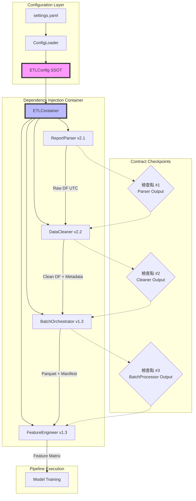

# PRD v1.0: 系統整合架構 (System Integration Architecture)

**文件版本:** v1.0 (Zero-Gap Pipeline Integration)  
**日期:** 2026-02-13  
**負責人:** Oscar Chang  
**目標模組:** `src/container.py`, `src/main.py`, `src/utils/config_loader.py`  
**相依模組:** 所有 ETL 模組 (Parser v2.1+, Cleaner v2.2+, BatchProcessor v1.3+, Feature Engineer v1.3+)  
**預估工時:** 3 ~ 4 個工程天（含全鏈路整合測試）

---

## 1. 執行總綱與設計哲學

### 1.1 核心目標

建立**零間隙對接**的完整 ETL Pipeline，確保：
1. **配置單一真相源 (SSOT)**: 所有模組引用同一個 `ETLConfig` 實例
2. **依賴注入 (DI)**: 透過 `Container` 管理模組生命周期，避免實例化不一致
3. **契約檢查點**: 4 個關鍵檢查點自動驗證 (Interface Contract v1.0)
4. **錯誤傳播鏈**: 明確定義錯誤如何在模組間傳播（終止 vs 跳過）

### 1.2 架構概覽



---

## 2. SSOT 配置系統 (Configuration System)

### 2.1 統一配置結構

**檔案**: `src/etl/config_models.py` (核心 SSOT)

**實作內容**:
```python
from typing import Final, List, Dict, Optional, Literal
from pydantic import BaseModel, validator, Field

# SSOT 1: Quality Flags (6個標準值，全域唯一)
VALID_QUALITY_FLAGS: Final[List[str]] = [
    "FROZEN",           # 數據凍結（連續3個區間值相同）
    "HEAT_IMBALANCE",   # 熱平衡偏差 > 5%
    "AFFINITY_VIOLATION", # 違反親和律 > 15%
    "OUTLIER",          # 統計離群值（IQR法）
    "INSUFFICIENT_DATA", # 時間空缺補全標記
    "SENSOR_OFFLINE"    # 感測器離線（新增）
]

# SSOT 2: 時間戳規範 (所有模組必須遵守)
TIMESTAMP_CONFIG: Final[Dict] = {
    "dtype": "Datetime",
    "time_unit": "nanoseconds",  # ns
    "time_zone": "UTC",          # 強制UTC
    "parquet_physical_type": "INT64"  # 禁止INT96
}

# SSOT 3: Feature Metadata Schema
class FeatureMetadata(BaseModel):
    column_name: str
    physical_type: Literal[
        "temperature", "flow_rate", "power", "status", 
        "humidity", "gauge", "chiller_load", "cooling_tower_load"
    ]
    unit: Optional[str] = None           # "LPM", "kW", "°C", "%"
    is_target: bool = False              # 是否為目標變數（不應生成Lag）
    enable_lag: bool = True
    enable_rolling: bool = True
    agg_method: Literal["mean", "sum", "last", "first"] = "mean"

# Parser 配置
class ParserConfig(BaseModel):
    encoding: str = "auto"               # auto | utf-8 | cp950 | utf-16
    header_scan_rows: int = 500
    assumed_timezone: str = "Asia/Taipei"  # 僅用於 naive datetime
    null_values: List[str] = Field(default_factory=lambda: [
        "", "NA", "null", "---", "Error", "N/A", "OFF", "OFFLINE", "#VALUE!"
    ])

# Cleaner 配置
class CleanerConfig(BaseModel):
    unit_system: Literal["METRIC", "IMPERIAL"] = "METRIC"
    resample_interval: str = "15m"       # Polars interval syntax
    heat_balance_threshold: float = 0.05  # 5%
    frozen_data_intervals: int = 3
    enforce_output_contract: bool = True

# BatchProcessor 配置
class BatchConfig(BaseModel):
    output_base_dir: str = "data/processed"
    staging_dir: str = "data/.staging"
    max_rows_per_file: int = 100_000
    compression: Literal["snappy", "zstd"] = "snappy"
    use_pyarrow: bool = False            # 必須 False 以避免 INT96
    future_data_tolerance_minutes: int = 5

# Feature Engineer 配置
class FeatureEngineeringConfig(BaseModel):
    execution_mode: Literal["in_memory"] = "in_memory"
    cutoff_timestamp: Optional[str] = None  # ISO 8601 format
    group_policies: List[Dict] = Field(default_factory=list)
    physics_features: bool = True
    time_features: bool = True

# 統一配置根
class ETLConfig(BaseModel):
    """ETL Pipeline 統一配置 (SSOT 中心)"""
    version: str = "1.0"
    site_id: str = "default"
    
    parser: ParserConfig = ParserConfig()
    cleaner: CleanerConfig = CleanerConfig()
    batch: BatchConfig = BatchConfig()
    feature: FeatureEngineeringConfig = FeatureEngineeringConfig()
    
    # 全域設定
    log_level: str = "INFO"
    strict_mode: bool = True             # 嚴格契約檢查
    
    @validator('version')
    def validate_version(cls, v):
        if v != "1.0":
            raise ValueError("Config version must be 1.0")
        return v
```

### 2.2 配置載入器 (ConfigLoader)

**檔案**: `src/utils/config_loader.py`

**實作內容**:
```python
import yaml
from pathlib import Path
from typing import Union
from src.etl.config_models import ETLConfig, VALID_QUALITY_FLAGS

class ConfigurationError(Exception):
    """配置錯誤"""
    pass

class ConfigLoader:
    """統一配置載入，確保所有模組引用相同 SSOT"""
    
    @staticmethod
    def load(config_path: Union[str, Path] = "config/settings.yaml") -> ETLConfig:
        """
        載入並驗證配置
        
        驗證項目:
        1. YAML 格式正確性
        2. SSOT 一致性 (flags 定義必須匹配程式碼)
        3. 路徑存在性 (output_base_dir, staging_dir)
        """
        config_path = Path(config_path)
        
        if not config_path.exists():
            raise ConfigurationError(f"配置文件不存在: {config_path}")
        
        with open(config_path, 'r', encoding='utf-8') as f:
            try:
                data = yaml.safe_load(f)
            except yaml.YAMLError as e:
                raise ConfigurationError(f"YAML 解析錯誤: {e}")
        
        # 驗證 SSOT 一致性 (關鍵檢查)
        code_flags = set(VALID_QUALITY_FLAGS)
        config_flags = set(data.get("custom_quality_flags", []))
        
        if config_flags and config_flags != code_flags:
            # 允許擴充，但必須包含所有基礎 flags
            missing_base = code_flags - config_flags
            if missing_base:
                raise ConfigurationError(
                    f"settings.yaml 中的 flags 缺少 SSOT 基礎標記: {missing_base}. "
                    f"程式碼定義: {code_flags}"
                )
        
        # 驗證目錄存在性或自動建立
        for dir_key in ["output_base_dir", "staging_dir"]:
            if dir_key in data.get("batch", {}):
                Path(data["batch"][dir_key]).mkdir(parents=True, exist_ok=True)
        
        try:
            return ETLConfig(**data)
        except Exception as e:
            raise ConfigurationError(f"配置驗證失敗: {e}")
    
    @staticmethod
    def validate_ssot_compatibility() -> bool:
        """驗證程式碼 SSOT 與運行時一致性"""
        # 可在 CI/CD 中呼叫
        return True
```

---

## 3. 依賴注入容器 (DI Container)

### 3.1 ETLContainer 實作

**檔案**: `src/container.py`

**實作內容**:
```python
from typing import Optional, List
from pathlib import Path
import polars as pl

from src.etl.config_models import ETLConfig
from src.etl.parser import ReportParser
from src.etl.cleaner import DataCleaner
from src.etl.batch_processor import BatchOrchestrator, BatchResult
from src.etl.feature_engineer import FeatureEngineer
from src.utils.logger import get_logger

class ETLContainer:
    """
    依賴注入容器 (Dependency Injection Container)
    
    管理所有 ETL 模組的生命周期與配置傳遞，確保:
    1. 單例模式 (Singleton) - 每個模組只初始化一次
    2. 配置一致性 - 所有模組引用相同 ETLConfig
    3. 零間隙銜接 - 自動處理模組間的資料傳遞
    """
    
    def __init__(self, config: ETLConfig):
        self.config = config
        self.logger = get_logger("ETLContainer")
        
        # 快取實例 (Singleton)
        self._parser: Optional[ReportParser] = None
        self._cleaner: Optional[DataCleaner] = None
        self._batch_processor: Optional[BatchOrchestrator] = None
        self._feature_engineer: Optional[FeatureEngineer] = None
    
    def get_parser(self) -> ReportParser:
        """取得 Parser 實例 (v2.1+)"""
        if self._parser is None:
            self._parser = ReportParser(
                site_id=self.config.site_id,
                config=self.config.parser
            )
            self.logger.debug(f"初始化 ReportParser (site: {self.config.site_id})")
        return self._parser
    
    def get_cleaner(self) -> DataCleaner:
        """取得 Cleaner 實例 (v2.2+)"""
        if self._cleaner is None:
            self._cleaner = DataCleaner(config=self.config.cleaner)
            self.logger.debug("初始化 DataCleaner")
        return self._cleaner
    
    def get_batch_processor(self) -> BatchOrchestrator:
        """取得 BatchProcessor 實例 (v1.3+)"""
        if self._batch_processor is None:
            self._batch_processor = BatchOrchestrator(
                config=self.config,
                parser=self.get_parser(),
                cleaner=self.get_cleaner()
            )
            self.logger.debug("初始化 BatchOrchestrator")
        return self._batch_processor
    
    def get_feature_engineer(self) -> FeatureEngineer:
        """取得 FeatureEngineer 實例 (v1.3+)"""
        if self._feature_engineer is None:
            self._feature_engineer = FeatureEngineer(
                config=self.config.feature
            )
            self.logger.debug("初始化 FeatureEngineer")
        return self._feature_engineer
    
    def run_full_pipeline(self, input_files: List[Path]) -> pl.DataFrame:
        """
        執行完整 ETL 流程 (端到端)
        
        流程:
        1. BatchProcessor (Parser → Cleaner → Parquet + Manifest)
        2. Feature Engineer (Manifest → Feature Matrix)
        
        錯誤處理:
        - ContractViolationError: 終止流程，回報詳細錯誤
        - FutureDataError: 單檔案跳過，其他繼續處理
        """
        self.logger.info(f"🚀 啟動完整 ETL Pipeline，處理 {len(input_files)} 個檔案")
        
        # Step 1: Batch Processing
        bp = self.get_batch_processor()
        manifests = []
        
        for file_path in input_files:
            try:
                result = bp.process_single_file(file_path)
                
                if result.status == "success":
                    manifests.append(result.manifest_path)
                    self.logger.info(f"✅ 處理成功: {file_path.name}")
                elif result.status == "future_data_rejected":
                    self.logger.warning(f"⚠️  未來資料拒絕: {file_path.name} - {result.error}")
                else:
                    self.logger.error(f"❌ 處理失敗: {file_path.name} - {result.error}")
                    
            except ContractViolationError as e:
                self.logger.error(f"❌ 契約違反: {file_path.name} - {e}")
                if self.config.strict_mode:
                    raise  # 嚴格模式下終止整批處理
        
        if not manifests:
            raise DataValidationError("沒有成功處理的檔案，無法繼續特徵工程")
        
        # Step 2: Feature Engineering (使用最後一個 manifest 為代表)
        # 實際應用中應該合併所有 manifests
        fe = self.get_feature_engineer()
        manifest_path = manifests[-1]
        
        self.logger.info(f"🔧 開始特徵工程: {manifest_path}")
        
        # 讀取 Manifest 與資料
        df, metadata = fe.load_from_manifest(manifest_path)
        
        # 轉換
        feature_df = fe.transform(
            df,
            manifest_metadata=metadata,
            cutoff_timestamp=self.config.feature.cutoff_timestamp
        )
        
        self.logger.info(f"✅ ETL Pipeline 完成，輸出維度: {feature_df.shape}")
        return feature_df
    
    def reset(self):
        """重置所有快取實例 (用於測試)"""
        self._parser = None
        self._cleaner = None
        self._batch_processor = None
        self._feature_engineer = None
        self.logger.debug("重置所有模組實例")
```

---

## 4. CLI 入口點 (Entry Point)

### 4.1 HVACCLI 實作

**檔案**: `src/main.py`

**實作內容**:
```python
#!/usr/bin/env python3
import sys
from pathlib import Path
from typing import List, Optional
import fire

from src.container import ETLContainer
from src.utils.config_loader import ConfigLoader, ConfigurationError
from src.etl.exceptions import ContractViolationError, FutureDataError, DataValidationError

class HVACCLI:
    """
    HVAC Analytics CLI 介面
    
    提供統一的命令列入口，整合所有 ETL 與建模功能。
    """
    
    def __init__(self, config_path: str = "config/settings.yaml"):
        try:
            self.config = ConfigLoader.load(config_path)
            self.container = ETLContainer(self.config)
        except ConfigurationError as e:
            print(f"❌ 配置錯誤: {e}")
            sys.exit(1)
    
    def run_etl(
        self, 
        input_dir: str, 
        output_dir: Optional[str] = None,
        pattern: str = "*.csv"
    ):
        """
        執行完整 ETL 流程
        
        Args:
            input_dir: 輸入 CSV 檔案目錄
            output_dir: 輸出目錄 (可選，覆蓋配置)
            pattern: 檔案匹配模式，預設 *.csv
        """
        input_path = Path(input_dir)
        if not input_path.exists():
            print(f"❌ 輸入目錄不存在: {input_dir}")
            return
        
        files = list(input_path.glob(pattern))
        if not files:
            print(f"⚠️  未找到匹配檔案: {pattern}")
            return
        
        print(f"🚀 啟動 ETL Pipeline，處理 {len(files)} 個檔案...")
        
        try:
            result_df = self.container.run_full_pipeline(files)
            
            # 可選: 儲存最終特徵矩陣
            if output_dir:
                output_path = Path(output_dir)
                output_path.mkdir(parents=True, exist_ok=True)
                output_file = output_path / "feature_matrix.parquet"
                result_df.write_parquet(output_file)
                print(f"💾 特徵矩陣已儲存: {output_file}")
            
            print(f"✅ ETL 完成，輸出維度: {result_df.shape}")
            
        except ContractViolationError as e:
            print(f"❌ 契約違反錯誤: {e}")
            print("請檢查各模組版本相容性:")
            print("  - Parser >= v2.1")
            print("  - Cleaner >= v2.2")
            print("  - BatchProcessor >= v1.3")
            print("  - FeatureEngineer >= v1.3")
            sys.exit(2)
            
        except FutureDataError as e:
            print(f"⚠️  未來資料錯誤: {e}")
            print("請檢查資料來源系統時間設定")
            sys.exit(3)
            
        except Exception as e:
            print(f"❌ 未預期錯誤: {e}")
            import traceback
            traceback.print_exc()
            sys.exit(99)
    
    def validate_config(self):
        """驗證當前配置"""
        print("✅ 配置載入成功")
        print(f"   Site ID: {self.config.site_id}")
        print(f"   Flags: {VALID_QUALITY_FLAGS}")
        print(f"   Strict Mode: {self.config.strict_mode}")
    
    def version(self):
        """顯示版本資訊"""
        print("HVAC Analytics Pipeline v1.0")
        print("相容模組版本:")
        print("  - Parser: v2.1+")
        print("  - Cleaner: v2.2+")
        print("  - BatchProcessor: v1.3+")
        print("  - FeatureEngineer: v1.3+")

def main():
    """Entry point"""
    fire.Fire(HVACCLI)

if __name__ == "__main__":
    main()
```

---

## 5. 錯誤處理與傳播 (Error Handling)

### 5.1 錯誤傳播策略

| 錯誤類型 | 發生模組 | 傳播策略 | 下游影響 | 使用者訊息 |
|:---|:---|:---:|:---|:---|
| `EncodingError` (E001) | Parser | **終止** | 整批失敗 | "檔案編碼錯誤，請確認為 UTF-8/Big5/UTF-16" |
| `ContractViolationError` (E002/E003/E202/E206) | Parser/Cleaner/BatchProcessor/FE | **終止** (strict_mode) / **單檔跳過** | 依 strict_mode 決定 | "模組間介面契約違反，請檢查版本相容性" |
| `FutureDataError` (E005/E205) | BatchProcessor | **單檔跳過** | 該檔案不入庫，其他繼續 | "檔案含未來資料，已拒絕處理" |
| `UnknownFlagError` (E003/E202) | Cleaner/BatchProcessor | **終止** | 需更新 SSOT | "未定義品質標記，請更新 config_models.py" |
| `DataValidationError` | Parser/Cleaner | **可配置** | 單檔失敗 | "資料驗證失敗" |
| `MetadataLossWarning` (E203/E304) | BatchProcessor/FE | **Warning** | 使用保守預設 | "缺少 metadata，使用保守預設" |

### 5.2 全域錯誤處理器

**檔案**: `src/exceptions.py` (擴充)

```python
class HVACError(Exception):
    """基礎錯誤類別"""
    def __init__(self, message: str, error_code: Optional[str] = None):
        super().__init__(message)
        self.error_code = error_code
        self.timestamp = datetime.now(timezone.utc)

class ContractViolationError(HVACError):
    """違反模組間介面契約"""
    pass

class FutureDataError(HVACError):
    """檢測到未來資料"""
    pass

class ConfigurationError(HVACError):
    """配置錯誤"""
    pass
```

---

## 6. 版本相容性矩陣 (Version Compatibility Matrix)

| Parser | Cleaner | BatchProcessor | Feature Engineer | 相容性 | 說明 |
|:---:|:---:|:---:|:---:|:---:|:---|
| v2.1 | v2.2 | v1.3 | v1.3 | ✅ **完全相容** | 推薦配置，零間隙對接 |
| v2.0 (Asia/Taipei) | v2.2 | v1.3 | v1.3 | ⚠️ **降級相容** | Cleaner 需啟用時區容錯 (E101 Warning) |
| v2.1 | v2.1 | v1.2 | v1.3 | ⚠️ **部分相容** | BatchProcessor 缺少 metadata (E203)，FE 使用保守預設 |
| v2.1 | v2.2 | v1.3 | v1.2 (硬編碼 flags) | ❌ **不相容** | FE v1.2 無法處理新 flags (如 SENSOR_OFFLINE)，特徵維度錯誤 |
| 任意 | 任意 | v1.2 | 任意 | ❌ **不相容** | BatchProcessor v1.2 無法傳遞 feature_metadata (GAP #3 未解決) |

**升級路徑**: 必須按順序升級：Parser → Cleaner → BatchProcessor → Feature Engineer

---

## 7. 測試與驗證計畫 (Integration Test Plan)

### 7.1 全鏈路整合測試

| 測試案例 ID | 描述 | 輸入 | 預期結果 | 驗證目標 |
|:---|:---|:---|:---|:---|
| INT-SYS-001 | 成功流程 | 標準 CSV 檔案 | 輸出 Feature Matrix，無錯誤 | 全鏈路無縫銜接 |
| INT-SYS-002 | 編碼自適應 | Big5 編碼 CSV | 正確解析，輸出 UTF-8/UTC | Parser v2.1 編碼處理 |
| INT-SYS-003 | 時區一致性 | Parser 輸入 Asia/Taipei (模擬舊版) | Cleaner 轉換為 UTC，發 E101 | 時區容錯機制 |
| INT-SYS-004 | 未來資料攔截 | 時間戳為明天的檔案 | 單檔拒絕 (E205)，其他繼續 | Data Leakage 防護 |
| INT-SYS-005 | 契約違反 | 缺少 timestamp 欄位 | 拋出 ContractViolationError | 檢查點 #1 運作 |
| INT-SYS-006 | SSOT 同步 | 使用新增 SENSOR_OFFLINE flag | One-hot 特徵自動包含新 flag | SSOT 一致性 |
| INT-SYS-007 | Metadata 傳遞 | Multi-asset 資料 (3台冰機) | Group Policy 正確套用至所有冰機 | GAP #3 解決驗證 |
| INT-SYS-008 | 冪等性 | 重複執行相同輸入 | 輸出 Bit-wise 一致 | 容器的 Singleton 保證 |

---

## 8. 交付物清單 (Deliverables)

### 8.1 程式碼檔案
1. `src/etl/config_models.py` - SSOT 配置定義 (VALID_QUALITY_FLAGS, ETLConfig)
2. `src/utils/config_loader.py` - 配置載入器 (含 SSOT 驗證)
3. `src/container.py` - DI 容器 (ETLContainer)
4. `src/main.py` - CLI 入口點 (HVACCLI)
5. `src/exceptions.py` - 全域例外定義

### 8.2 配置檔案
6. `config/settings.yaml` - 預設配置範本
7. `config/site_templates.yaml` - 案場特定配置 (繼承自 settings.yaml)

### 8.3 測試檔案
8. `tests/test_integration_full_pipeline.py` - 全鏈路整合測試 (INT-SYS-001~008)
9. `tests/test_container.py` - DI 容器單元測試

### 8.4 文件檔案
10. `docs/integration/PRD_SYSTEM_INTEGRATION_v1.0.md` - 本文件
11. `docs/integration/UPGRADE_GUIDE_v1.0.md` - 版本升級指引
12. `README.md` (更新) - 快速開始與 CLI 使用說明

---

## 9. 執行檢查清單 (Action Items)

### Phase 1: SSOT 建立 (Day 1)
- [ ] 建立 `src/etl/config_models.py`，定義 `VALID_QUALITY_FLAGS` (6項)
- [ ] 定義 `ETLConfig` Pydantic 模型，包含所有子模組配置
- [ ] 實作 `ConfigLoader` 與 SSOT 一致性驗證

### Phase 2: DI 容器 (Day 2)
- [ ] 實作 `ETLContainer` (Singleton 模式)
- [ ] 實作 `run_full_pipeline()` 方法
- [ ] 整合錯誤處理與傳播邏輯

### Phase 3: CLI 與入口 (Day 3)
- [ ] 實作 `HVACCLI` (Fire 框架)
- [ ] 實作 `run_etl` 命令
- [ ] 全域錯誤處理與使用者訊息

### Phase 4: 整合測試 (Day 4)
- [ ] 執行 INT-SYS-001~008 全鏈路測試
- [ ] 驗證版本相容性矩陣
- [ ] 效能測試 (大檔案處理)

---

## 10. 驗收簽核 (Sign-off Checklist)

- [ ] **SSOT 一致性**: `VALID_QUALITY_FLAGS` 單一定義，所有模組引用
- [ ] **配置載入**: `ConfigLoader` 正確驗證 SSOT，阻擋不一致配置
- [ ] **DI 容器**: `ETLContainer` 正確管理模組生命周期，Singleton 生效
- [ ] **全鏈路執行**: `run_full_pipeline()` 成功執行 Parser → Cleaner → BP → FE
- [ ] **錯誤傳播**: `ContractViolationError` 正確終止流程並提供明確訊息
- [ ] **時區一致性**: 全鏈路時間戳為 UTC (ns)，無 Asia/Taipei 殘留
- [ ] **Metadata 傳遞**: `feature_metadata` 正確從 Cleaner 傳遞至 FE (GAP #3)
- [ ] **CLI 功能**: `python main.py run_etl` 成功執行並輸出 Feature Matrix
- [ ] **版本相容**: 相容性矩陣測試通過，舊版模組正確拒絕或降級

---
