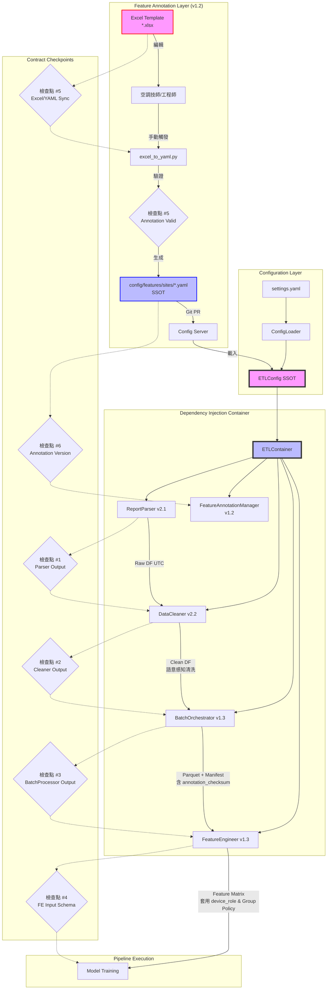

# PRD v1.1-REVISED: 系統整合架構 (System Integration Architecture)
# 整合 Feature Annotation v1.2 規範（已採納審查修正）

**文件版本:** v1.1-REVISED (Zero-Gap Pipeline with Feature Annotation v1.2)  
**日期:** 2026-02-13  
**負責人:** Oscar Chang  
**目標模組:** `src/container.py`, `src/main.py`, `src/utils/config_loader.py`, `src/features/annotation_manager.py`  
**相依模組:** 
- Parser v2.1+, Cleaner v2.2+, BatchProcessor v1.3+, Feature Engineer v1.3+
- **Feature Annotation v1.2** (Excel-Centric SSOT)
**預估工時:** 5 ~ 6 個工程天（含 Feature Annotation 整合與全鏈路測試）

---

## 1. 執行總綱與設計哲學

### 1.1 核心目標

建立**零間隙對接**的完整 ETL Pipeline，並整合 Feature Annotation v1.2 的**單向編輯流**：

1. **配置單一真相源 (SSOT)**: 
   - 運行時配置：`ETLConfig` 實例
   - 特徵定義：**Excel 唯一編輯** → YAML SSOT → Pipeline 消費
2. **依賴注入 (DI)**: 透過 `Container` 管理模組生命周期，包含 `FeatureAnnotationManager`
3. **契約檢查點**: 6 個關鍵檢查點（新增 Annotation 同步檢查 #5, #6）
4. **錯誤傳播鏈**: 明確定義錯誤如何在模組間傳播（新增 E400 系列錯誤）
5. **單向流保證**: 禁止 Pipeline 直接寫入 YAML，禁止 Wizard 繞過 Excel

### 1.2 架構概覽（更新）



---

## 2. SSOT 配置系統 (Configuration System)

### 2.1 統一配置結構（整合 Feature Annotation）

**檔案**: `src/etl/config_models.py` (核心 SSOT)

**關鍵更新**:
- 新增 `FeatureAnnotationConfig` 設定 Annotation 路徑與版本檢查
- `ETLConfig` 新增 `feature_annotation` 欄位
- **移除 `CleanerConfig.default_device_role`（審查修正：避免隱性預設值）**
- **新增 `CleanerConfig.unannotated_column_policy`（審查修正：未定義欄位處理策略）**

```python
from typing import Final, List, Dict, Optional, Literal
from pydantic import BaseModel, validator, Field

# SSOT 1: Quality Flags (6個標準值，全域唯一)
VALID_QUALITY_FLAGS: Final[List[str]] = [
    "FROZEN",           # 數據凍結（連續3個區間值相同）
    "HEAT_IMBALANCE",   # 熱平衡偏差 > 5%
    "AFFINITY_VIOLATION", # 違反親和律 > 15%
    "OUTLIER",          # 統計離群值（IQR法）
    "INSUFFICIENT_DATA", # 時間空缺補全標記
    "SENSOR_OFFLINE"    # 感測器離線（新增）
]

# SSOT 2: 時間戳規範 (所有模組必須遵守)
TIMESTAMP_CONFIG: Final[Dict] = {
    "dtype": "Datetime",
    "time_unit": "nanoseconds",  # ns
    "time_zone": "UTC",          # 強制UTC
    "parquet_physical_type": "INT64"  # 禁止INT96
}

# SSOT 3: Feature Annotation 相關常數（新增）
FEATURE_ANNOTATION_CONSTANTS: Final[Dict] = {
    "current_template_version": "1.2",
    "expected_schema_version": "1.2",
    "checksum_algorithm": "sha256"
}

# SSOT 4: Feature Metadata Schema（更新：支援 device_role）
class FeatureMetadata(BaseModel):
    column_name: str
    physical_type: Literal[
        "temperature", "flow_rate", "power", "status", 
        "humidity", "gauge", "chiller_load", "cooling_tower_load"
    ]
    unit: Optional[str] = None           # "LPM", "kW", "°C", "%"
    device_role: Literal["primary", "backup", "seasonal"] = "primary"  # 新增
    is_target: bool = False              
    enable_lag: bool = True
    enable_rolling: bool = True
    agg_method: Literal["mean", "sum", "last", "first"] = "mean"
    ignore_warnings: List[str] = Field(default_factory=list)  # 新增：["W401", "W403"]
    
    @validator('enable_lag')
    def validate_target_no_lag(cls, v, values):
        """E405: Target 變數不可啟用 Lag"""
        if values.get('is_target') and v:
            raise ValueError("E405: is_target=True 時 enable_lag 必須為 False")
        return v

# Parser 配置
class ParserConfig(BaseModel):
    encoding: str = "auto"               
    header_scan_rows: int = 500
    assumed_timezone: str = "Asia/Taipei"  
    null_values: List[str] = Field(default_factory=lambda: [
        "", "NA", "null", "---", "Error", "N/A", "OFF", "OFFLINE", "#VALUE!"
    ])

# Cleaner 配置（審查修正：移除 default_device_role，避免隱性預設值）
class CleanerConfig(BaseModel):
    unit_system: Literal["METRIC", "IMPERIAL"] = "METRIC"
    resample_interval: str = "15m"       
    heat_balance_threshold: float = 0.05  
    frozen_data_intervals: int = 3
    enforce_output_contract: bool = True
    # 審查修正：移除 default_device_role，所有 device_role 必須來自 Annotation
    use_device_role_from_annotation: bool = True
    # 審查修正：新增未定義欄位處理策略（strict_mode 下應為 error）
    unannotated_column_policy: Literal["error", "skip", "warn"] = "error"

# BatchProcessor 配置（更新：Annotation 版本寫入 Manifest）
class BatchConfig(BaseModel):
    output_base_dir: str = "data/processed"
    staging_dir: str = "data/.staging"
    max_rows_per_file: int = 100_000
    compression: Literal["snappy", "zstd"] = "snappy"
    use_pyarrow: bool = False            
    future_data_tolerance_minutes: int = 5
    # 新增：強制檢查 Annotation 同步
    enforce_annotation_sync: bool = True

# Feature Engineer 配置（更新：使用 Group Policy）
class FeatureEngineeringConfig(BaseModel):
    execution_mode: Literal["in_memory"] = "in_memory"
    cutoff_timestamp: Optional[str] = None  
    group_policies: List[Dict] = Field(default_factory=list)
    physics_features: bool = True
    time_features: bool = True
    # 新增：消費 device_role 與 ignore_warnings
    respect_device_role: bool = True       # 抑制備用設備統計誤報
    respect_ignore_warnings: bool = True   # 抑制特定警告

# Feature Annotation 配置（新增）
class FeatureAnnotationConfig(BaseModel):
    """Feature Annotation v1.2 設定"""
    enabled: bool = True
    excel_base_dir: str = "data/features"           # 使用者編輯區
    yaml_base_dir: str = "config/features/sites"    # SSOT 輸出
    template_dir: str = "tools/features/templates"
    current_template_version: str = "1.2"
    # 自動同步檢查
    auto_sync_check: bool = True
    # 嚴格模式：Excel/YAML 不同步時阻擋 Pipeline
    strict_sync_check: bool = True

# 統一配置根（更新）
class ETLConfig(BaseModel):
    """ETL Pipeline 統一配置 (SSOT 中心)"""
    version: str = "1.0"
    site_id: str = "default"
    
    parser: ParserConfig = ParserConfig()
    cleaner: CleanerConfig = CleanerConfig()
    batch: BatchConfig = BatchConfig()
    feature: FeatureEngineeringConfig = FeatureEngineeringConfig()
    feature_annotation: FeatureAnnotationConfig = FeatureAnnotationConfig()  # 新增
    
    # 全域設定
    log_level: str = "INFO"
    strict_mode: bool = True             
    
    @validator('version')
    def validate_version(cls, v):
        if v != "1.0":
            raise ValueError("Config version must be 1.0")
        return v
    
    @validator('feature_annotation')
    def validate_annotation_paths(cls, v):
        """確保 Annotation 目錄存在"""
        from pathlib import Path
        for path_attr in ['excel_base_dir', 'yaml_base_dir']:
            path = Path(getattr(v, path_attr))
            path.mkdir(parents=True, exist_ok=True)
        return v
```

### 2.2 配置載入器 (ConfigLoader) - 整合 Feature Annotation

**檔案**: `src/utils/config_loader.py`

**關鍵更新**:
- 新增 `load_feature_annotation()` 方法載入 YAML SSOT（注意：僅載入，不處理繼承，繼承邏輯在 Manager 處理）
- 新增 `validate_annotation_sync()` 檢查 Excel/YAML 同步狀態

```python
import yaml
import hashlib
from pathlib import Path
from typing import Union, Dict, Optional
from src.etl.config_models import ETLConfig, VALID_QUALITY_FLAGS, FEATURE_ANNOTATION_CONSTANTS

class ConfigurationError(Exception):
    """配置錯誤"""
    pass

class AnnotationSyncError(ConfigurationError):
    """E406: Excel 與 YAML 不同步"""
    pass

class ConfigLoader:
    """統一配置載入，確保所有模組引用相同 SSOT"""
    
    @staticmethod
    def load(config_path: Union[str, Path] = "config/settings.yaml") -> ETLConfig:
        """載入並驗證 ETL 主配置"""
        config_path = Path(config_path)
        
        if not config_path.exists():
            raise ConfigurationError(f"配置文件不存在: {config_path}")
        
        with open(config_path, 'r', encoding='utf-8') as f:
            try:
                data = yaml.safe_load(f)
            except yaml.YAMLError as e:
                raise ConfigurationError(f"YAML 解析錯誤: {e}")
        
        # 驗證 SSOT 一致性
        code_flags = set(VALID_QUALITY_FLAGS)
        config_flags = set(data.get("custom_quality_flags", []))
        
        if config_flags and config_flags != code_flags:
            missing_base = code_flags - config_flags
            if missing_base:
                raise ConfigurationError(
                    f"settings.yaml 中的 flags 缺少 SSOT 基礎標記: {missing_base}. "
                    f"程式碼定義: {code_flags}"
                )
        
        # 驗證目錄存在性或自動建立
        for dir_key in ["output_base_dir", "staging_dir"]:
            if dir_key in data.get("batch", {}):
                Path(data["batch"][dir_key]).mkdir(parents=True, exist_ok=True)
        
        try:
            return ETLConfig(**data)
        except Exception as e:
            raise ConfigurationError(f"配置驗證失敗: {e}")
    
    @staticmethod
    def load_feature_annotation(site_id: str, yaml_base_dir: str = "config/features/sites") -> Dict:
        """
        載入特定案場的 Feature Annotation YAML (原始內容，未合併繼承)
        注意：繼承合併邏輯由 FeatureAnnotationManager 處理
        
        檢查項目:
        1. 檔案存在性
        2. schema_version 相容性（僅檢查，不合併）
        """
        yaml_path = Path(yaml_base_dir) / f"{site_id}.yaml"
        
        if not yaml_path.exists():
            raise ConfigurationError(f"E402: Feature Annotation 未定義: {yaml_path}")
        
        with open(yaml_path, 'r', encoding='utf-8') as f:
            annotation = yaml.safe_load(f)
        
        # 檢查 Schema 版本（檢查點 #6）
        schema_ver = annotation.get('schema_version', 'unknown')
        expected_ver = FEATURE_ANNOTATION_CONSTANTS['expected_schema_version']
        if schema_ver != expected_ver:
            raise ConfigurationError(
                f"E400: Annotation Schema 版本不符。期望: {expected_ver}, 實際: {schema_ver}. "
                f"請執行 migrate_excel.py 升級"
            )
        
        return annotation
    
    @staticmethod
    def validate_annotation_sync(site_id: str, excel_base_dir: str, yaml_base_dir: str) -> dict:
        """
        E406: 檢查 Excel 與 YAML 是否同步
        
        Returns:
            {
                'synced': bool,
                'excel_mtime': float,
                'yaml_mtime': float,
                'excel_checksum': str,
                'yaml_checksum': str,
                'reason': str
            }
        """
        excel_path = Path(excel_base_dir) / site_id / f"{site_id}.xlsx"
        yaml_path = Path(yaml_base_dir) / f"{site_id}.yaml"
        
        if not excel_path.exists():
            return {'synced': False, 'reason': f'Excel 不存在: {excel_path}'}
        if not yaml_path.exists():
            return {'synced': False, 'reason': f'YAML 不存在: {yaml_path}'}
        
        # 時間戳比較
        excel_mtime = excel_path.stat().st_mtime
        yaml_mtime = yaml_path.stat().st_mtime
        
        if excel_mtime > yaml_mtime:
            return {
                'synced': False,
                'excel_mtime': excel_mtime,
                'yaml_mtime': yaml_mtime,
                'reason': f'E406: Excel ({excel_path.name}) 較新，請重新執行 excel_to_yaml.py'
            }
        
        # Checksum 比對（若 YAML 中有記錄）
        with open(yaml_path, 'r', encoding='utf-8') as f:
            yaml_content = yaml.safe_load(f)
        
        stored_checksum = yaml_content.get('meta', {}).get('excel_checksum', '')
        if stored_checksum:
            actual_checksum = ConfigLoader._compute_file_hash(excel_path)
            if stored_checksum != actual_checksum:
                return {
                    'synced': False,
                    'excel_checksum': actual_checksum,
                    'yaml_checksum': stored_checksum,
                    'reason': 'E406: Checksum 不符，Excel 可能已修改但未重新生成 YAML'
                }
        
        return {'synced': True, 'reason': '同步'}
    
    @staticmethod
    def _compute_file_hash(file_path: Path) -> str:
        """計算檔案 SHA256"""
        sha256_hash = hashlib.sha256()
        with open(file_path, "rb") as f:
            for byte_block in iter(lambda: f.read(4096), b""):
                sha256_hash.update(byte_block)
        return f"sha256:{sha256_hash.hexdigest()}"
    
    @staticmethod
    def get_annotation_metadata(site_id: str, yaml_base_dir: str) -> Dict:
        """取得 Annotation 元資料（供 Manifest 寫入）"""
        # 注意：此處僅讀取原始檔案的 meta，不觸發繼承合併
        annotation = ConfigLoader.load_feature_annotation(site_id, yaml_base_dir)
        return {
            'schema_version': annotation.get('schema_version'),
            'template_version': annotation.get('meta', {}).get('template_version'),
            'last_updated': annotation.get('meta', {}).get('last_updated'),
            'editor': annotation.get('meta', {}).get('editor'),
            'yaml_checksum': annotation.get('meta', {}).get('excel_checksum', '')
        }
```

---

## 3. 依賴注入容器 (DI Container) - 整合 FeatureAnnotationManager

### 3.1 ETLContainer 實作（審查修正：Cleaner 職責釐清）

**檔案**: `src/container.py`

**關鍵修正**:
- **Cleaner 不寫入 DataFrame metadata**：改為傳入 `FeatureAnnotationManager` 引用，供 Cleaner 在清洗時查詢 device_role 調整策略
- **Cleaner 僅讀取 device_role 用於語意感知清洗**：例如備用設備放寬凍結資料檢測閾值，但不將 device_role 寫入輸出 DataFrame 的物理儲存（避免耦合）

```python
from typing import Optional, List, Dict
from pathlib import Path
import polars as pl

from src.etl.config_models import ETLConfig
from src.etl.parser import ReportParser
from src.etl.cleaner import DataCleaner
from src.etl.batch_processor import BatchOrchestrator, BatchResult
from src.etl.feature_engineer import FeatureEngineer
from src.features.annotation_manager import FeatureAnnotationManager  # 新增
from src.utils.config_loader import ConfigLoader, AnnotationSyncError
from src.utils.logger import get_logger

class ETLContainer:
    """
    依賴注入容器 (Dependency Injection Container) - v1.1-REVISED
    
    管理所有 ETL 模組的生命周期與配置傳遞，確保:
    1. 單例模式 (Singleton) 
    2. 配置一致性 
    3. Feature Annotation 正確流向各模組（Excel → YAML → Manager → Modules）
    4. 零間隙銜接 
    """
    
    def __init__(self, config: ETLConfig):
        self.config = config
        self.logger = get_logger("ETLContainer")
        
        # 快取實例 (Singleton)
        self._parser: Optional[ReportParser] = None
        self._cleaner: Optional[DataCleaner] = None
        self._batch_processor: Optional[BatchOrchestrator] = None
        self._feature_engineer: Optional[FeatureEngineer] = None
        self._annotation_manager: Optional[FeatureAnnotationManager] = None  # 新增
        
        # 預先載入 Annotation（若啟用）
        if self.config.feature_annotation.enabled:
            self._load_annotation()
    
    def _load_annotation(self):
        """預先載入 Feature Annotation 並驗證同步狀態（含繼承合併）"""
        fa_config = self.config.feature_annotation
        
        # 嚴格模式：檢查 Excel/YAML 同步（檢查點 #5）
        if fa_config.auto_sync_check:
            sync_status = ConfigLoader.validate_annotation_sync(
                self.config.site_id,
                fa_config.excel_base_dir,
                fa_config.yaml_base_dir
            )
            
            if not sync_status['synced'] and fa_config.strict_sync_check:
                raise AnnotationSyncError(sync_status['reason'])
            elif not sync_status['synced']:
                self.logger.warning(f"⚠️ Annotation 同步警告: {sync_status['reason']}")
        
        # 初始化 Manager（內部處理繼承合併）
        self._annotation_manager = FeatureAnnotationManager(
            site_id=self.config.site_id,
            yaml_base_dir=fa_config.yaml_base_dir
        )
        
        self.logger.info(
            f"📋 Feature Annotation 載入成功 "
            f"(Schema: {self._annotation_manager.schema_version}, "
            f"Columns: {len(self._annotation_manager.columns)}, "
            f"Inherited: {self._annotation_manager.inheritance_chain})"
        )
    
    def get_annotation_manager(self) -> FeatureAnnotationManager:
        """取得 FeatureAnnotationManager（檢查點 #6）"""
        if self._annotation_manager is None:
            raise RuntimeError("FeatureAnnotationManager 未初始化，請確認配置 enabled=True")
        return self._annotation_manager
    
    def get_parser(self) -> ReportParser:
        """取得 Parser 實例"""
        if self._parser is None:
            self._parser = ReportParser(
                site_id=self.config.site_id,
                config=self.config.parser
            )
        return self._parser
    
    def get_cleaner(self) -> DataCleaner:
        """
        取得 Cleaner 實例（審查修正：注入 Manager 引用，不寫入 metadata）
        
        Cleaner v2.2+ 會:
        1. 持有 AnnotationManager 引用，用於查詢 device_role（不寫入 DataFrame）
        2. 根據 device_role 調整清洗策略（如 backup 設備放寬凍結檢測）
        3. 對於 unannotated 欄位，依據 unannotated_column_policy 處理（E402）
        
        注意：device_role 不會被寫入 Parquet metadata，僅用於 runtime 邏輯判斷
        """
        if self._cleaner is None:
            # 審查修正：傳入 Manager 引用，而非僅傳入 columns dict
            # 使 Cleaner 可動態查詢，但不承擔 metadata 寫入職責
            self._cleaner = DataCleaner(
                config=self.config.cleaner,
                annotation_manager=self._annotation_manager if self.config.cleaner.use_device_role_from_annotation else None
            )
            self.logger.debug("初始化 DataCleaner (含 AnnotationManager 引用，不寫入 metadata)")
        return self._cleaner
    
    def get_batch_processor(self) -> BatchOrchestrator:
        """
        取得 BatchProcessor 實例（更新：注入 Annotation Metadata）
        
        BatchProcessor v1.3+ 會:
        1. 接收來自 Cleaner 的資料（不含 device_role metadata）
        2. 將 Annotation Metadata（version, checksum）寫入 Manifest（供稽核）
        3. 執行 E406 檢查（若 enforce_annotation_sync=True）
        """
        if self._batch_processor is None:
            annotation_meta = {}
            if self._annotation_manager:
                annotation_meta = self._annotation_manager.get_metadata()
            
            self._batch_processor = BatchOrchestrator(
                config=self.config,
                parser=self.get_parser(),
                cleaner=self.get_cleaner(),
                annotation_metadata=annotation_meta  # 注入
            )
            self.logger.debug("初始化 BatchOrchestrator (含 Annotation Metadata)")
        return self._batch_processor
    
    def get_feature_engineer(self) -> FeatureEngineer:
        """
        取得 FeatureEngineer 實例（更新：注入 Group Policy 與 device_role）
        
        Feature Engineer v1.3+ 會:
        1. 讀取 Annotation 中的 group_policies
        2. 根據 device_role 決定是否抑制 W403（備用設備高零值正常）
        3. 根據 ignore_warnings 過濾統計警告
        """
        if self._feature_engineer is None:
            group_policies = []
            column_configs = {}
            
            if self._annotation_manager:
                group_policies = self._annotation_manager.get_group_policies()
                column_configs = self._annotation_manager.get_column_configs()
            
            # 合併配置：Annotation 優先於程式碼配置
            merged_config = self.config.feature.copy()
            merged_config.group_policies = group_policies or merged_config.group_policies
            
            self._feature_engineer = FeatureEngineer(
                config=merged_config,
                annotation_columns=column_configs  # 注入
            )
            self.logger.debug("初始化 FeatureEngineer (含 Group Policy)")
        return self._feature_engineer
    
    def run_full_pipeline(self, input_files: List[Path]) -> pl.DataFrame:
        """
        執行完整 ETL 流程（更新：含 Annotation 檢查點）
        
        流程:
        1. 檢查 Annotation 同步狀態（檢查點 #5）
        2. BatchProcessor (Parser → Cleaner → Parquet + Manifest)
        3. Feature Engineer (Manifest → Feature Matrix，套用 device_role)
        
        錯誤處理:
        - AnnotationSyncError (E406): 終止流程
        - ContractViolationError: 終止流程
        - FutureDataError: 單檔案跳過
        """
        self.logger.info(f"🚀 啟動完整 ETL Pipeline，處理 {len(input_files)} 個檔案")
        
        # 檢查點 #5: Annotation 同步
        if self.config.feature_annotation.enabled:
            self.logger.info("🔍 檢查點 #5: Feature Annotation 同步狀態 - 通過")
        
        # Step 1: Batch Processing
        bp = self.get_batch_processor()
        manifests = []
        
        for file_path in input_files:
            try:
                result = bp.process_single_file(file_path)
                
                if result.status == "success":
                    manifests.append(result.manifest_path)
                    self.logger.info(f"✅ 處理成功: {file_path.name}")
                elif result.status == "future_data_rejected":
                    self.logger.warning(f"⚠️  未來資料拒絕: {file_path.name} - {result.error}")
                else:
                    self.logger.error(f"❌ 處理失敗: {file_path.name} - {result.error}")
                    
            except ContractViolationError as e:
                self.logger.error(f"❌ 檢查點 #2/#3 契約違反: {file_path.name} - {e}")
                if self.config.strict_mode:
                    raise
        
        if not manifests:
            raise DataValidationError("沒有成功處理的檔案，無法繼續特徵工程")
        
        # Step 2: Feature Engineering
        fe = self.get_feature_engineer()
        manifest_path = manifests[-1]
        
        self.logger.info(f"🔧 開始特徵工程: {manifest_path}")
        
        # 檢查點 #6: Annotation Schema 版本相容
        self.logger.info("🔍 檢查點 #6: Annotation Schema 版本 - 通過")
        
        # 讀取 Manifest 與資料
        df, metadata = fe.load_from_manifest(manifest_path)
        
        # 檢查點 #4: FE Input Schema 驗證
        self.logger.info("🔍 檢查點 #4: FE Input Schema - 驗證中")
        
        # 轉換（含 device_role 與 ignore_warnings 處理）
        feature_df = fe.transform(
            df,
            manifest_metadata=metadata,
            cutoff_timestamp=self.config.feature.cutoff_timestamp
        )
        
        self.logger.info(f"✅ ETL Pipeline 完成，輸出維度: {feature_df.shape}")
        return feature_df
    
    def reset(self):
        """重置所有快取實例"""
        self._parser = None
        self._cleaner = None
        self._batch_processor = None
        self._feature_engineer = None
        self._annotation_manager = None
        self.logger.debug("重置所有模組實例")
```

### 3.2 FeatureAnnotationManager（審查修正：新增 YAML 繼承合併）

**檔案**: `src/features/annotation_manager.py`

**審查修正重點**:
- **實作 `_load_with_inheritance()`**：支援 `inherit: base` 的遞迴載入與合併
- **實作 `_deep_merge()`**：深度合併字典，子設定覆蓋父設定
- **循環繼承檢測**：防止 `inherit` 循環引用
- **繼承鏈追蹤**：記錄繼承路徑供除錯

```python
from pathlib import Path
from typing import Dict, List, Optional, Any, Set
import yaml
from dataclasses import dataclass

@dataclass
class ColumnAnnotation:
    """Column 標註資料結構"""
    column_name: str
    physical_type: str
    unit: Optional[str]
    device_role: str = "primary"
    is_target: bool = False
    enable_lag: bool = True
    enable_rolling: bool = True
    lag_intervals: List[int] = None
    ignore_warnings: List[str] = None
    status: str = "confirmed"
    
    def __post_init__(self):
        if self.lag_intervals is None:
            self.lag_intervals = []
        if self.ignore_warnings is None:
            self.ignore_warnings = []

class FeatureAnnotationManager:
    """
    Feature Annotation v1.2 管理器（審查修正：支援繼承合併）
    
    負責:
    1. 遞迴載入與合併 YAML SSOT（支援 inherit 欄位）
    2. 提供 column 查詢（含 device_role, ignore_warnings）
    3. 提供 Group Policy 查詢（已合併父設定）
    4. 提供 Metadata（供 Manifest 寫入）
    """
    
    def __init__(self, site_id: str, yaml_base_dir: str):
        self.site_id = site_id
        self.yaml_base_dir = Path(yaml_base_dir)
        self.yaml_path = self.yaml_base_dir / f"{site_id}.yaml"
        self._data: Dict = None
        self._columns: Dict[str, ColumnAnnotation] = {}
        self._inheritance_chain: List[str] = []  # 記錄繼承鏈
        self._load()
    
    def _load(self):
        """載入 YAML 並處理繼承合併（審查修正：核心邏輯）"""
        self._data = self._load_with_inheritance(
            self.yaml_path, 
            visited=set()  # 防止循環繼承
        )
        
        # 解析合併後的 columns
        for col_name, col_data in self._data.get('columns', {}).items():
            self._columns[col_name] = ColumnAnnotation(
                column_name=col_name,
                physical_type=col_data.get('physical_type'),
                unit=col_data.get('unit'),
                device_role=col_data.get('device_role', 'primary'),
                is_target=col_data.get('is_target', False),
                enable_lag=col_data.get('enable_lag', True),
                enable_rolling=col_data.get('enable_rolling', True),
                lag_intervals=col_data.get('lag_intervals', []),
                ignore_warnings=col_data.get('ignore_warnings', []),
                status=col_data.get('status', 'confirmed')
            )
    
    def _load_with_inheritance(self, yaml_path: Path, visited: Set[Path]) -> Dict:
        """
        遞迴載入 YAML 並合併繼承（審查修正：支援 inherit: base）
        
        Args:
            yaml_path: 當前 YAML 檔案路徑
            visited: 已訪問路徑集合（防止循環繼承）
        
        Returns:
            合併後的字典（子設定覆蓋父設定）
        
        Raises:
            ConfigurationError: 循環繼承或父檔案不存在
        """
        yaml_path = Path(yaml_path)
        
        # 循環繼承檢測
        if yaml_path in visited:
            chain = " -> ".join([p.name for p in visited] + [yaml_path.name])
            raise ConfigurationError(f"E400: 循環繼承檢測: {chain}")
        
        if not yaml_path.exists():
            raise ConfigurationError(f"E402: Annotation 檔案不存在: {yaml_path}")
        
        visited.add(yaml_path)
        
        # 讀取當前 YAML
        with open(yaml_path, 'r', encoding='utf-8') as f:
            current = yaml.safe_load(f) or {}
        
        # 記錄繼承鏈（僅記錄 site 名稱）
        self._inheritance_chain.append(yaml_path.stem)
        
        # 處理繼承
        parent_name = current.get('inherit')
        if parent_name and parent_name != "none":
            # 支援相對路徑或絕對路徑（預設同目錄）
            parent_path = self.yaml_base_dir / f"{parent_name}.yaml"
            
            if not parent_path.exists():
                raise ConfigurationError(
                    f"E402: 繼承的父檔案不存在: {parent_name} "
                    f"(參考自: {yaml_path.name})"
                )
            
            # 遞迴載入父設定
            parent = self._load_with_inheritance(parent_path, visited.copy())
            
            # 深度合併：子設定覆蓋父設定
            current = self._deep_merge(parent, current)
        
        return current
    
    def _deep_merge(self, base: Dict, override: Dict) -> Dict:
        """
        深度合併字典（審查修正：遞迴合併邏輯）
        
        規則:
        - override 優先於 base
        - 若同為 dict，遞迴合併
        - 若為 list（如 group_policies），override 完全替換（不 append）
        - inherit 欄位不傳遞（僅用於當前檔案）
        
        Args:
            base: 父設定
            override: 子設定（優先）
        
        Returns:
            合併後的字典
        """
        result = base.copy()
        
        for key, value in override.items():
            # inherit 欄位不傳遞到合併結果（避免孫檔案繼承錯誤的父鍊）
            if key == 'inherit':
                continue
            
            if key in result and isinstance(result[key], dict) and isinstance(value, dict):
                # 遞迴合併（如 columns, physical_types）
                result[key] = self._deep_merge(result[key], value)
            else:
                # 直接覆蓋（包含 list, scalar）
                result[key] = value
        
        return result
    
    @property
    def schema_version(self) -> str:
        return self._data.get('schema_version', 'unknown')
    
    @property
    def inheritance_chain(self) -> str:
        """返回繼承鏈描述（如 'base -> cgmh_ty'）"""
        return " -> ".join(self._inheritance_chain)
    
    def get_column_configs(self) -> Dict[str, ColumnAnnotation]:
        """取得所有 column 設定（已合併繼承）"""
        return self._columns
    
    def get_column_config(self, column_name: str) -> Optional[ColumnAnnotation]:
        """取得特定 column 設定"""
        return self._columns.get(column_name)
    
    def get_group_policies(self) -> List[Dict]:
        """取得 Group Policies（已合併繼承）"""
        return self._data.get('group_policies', {})
    
    def get_physical_types(self) -> Dict:
        """取得 Physical Types 定義（已合併繼承）"""
        return self._data.get('physical_types', {})
    
    def get_metadata(self) -> Dict[str, Any]:
        """取得 Metadata（供 BatchProcessor 寫入 Manifest）"""
        return {
            'schema_version': self.schema_version,
            'template_version': self._data.get('meta', {}).get('template_version'),
            'last_updated': self._data.get('meta', {}).get('last_updated'),
            'editor': self._data.get('meta', {}).get('editor'),
            'yaml_checksum': self._data.get('meta', {}).get('excel_checksum', ''),
            'inheritance_chain': self.inheritance_chain  # 新增：記錄繼承鏈
        }
    
    def should_ignore_warning(self, column_name: str, warning_code: str) -> bool:
        """檢查特定欄位是否應忽略特定警告（device_role 感知）"""
        col = self._columns.get(column_name)
        if not col:
            return False
        
        # 檢查明確標記的忽略
        if warning_code in (col.ignore_warnings or []):
            return True
        
        # 設備角色預設行為（審查確認：backup/seasonal 允許高零值）
        if warning_code == 'W403' and col.device_role in ['backup', 'seasonal']:
            return True
        
        return False
    
    def is_column_annotated(self, column_name: str) -> bool:
        """檢查欄位是否已定義（用於 Cleaner 的 E402 檢查）"""
        return column_name in self._columns
```

---

## 4. CLI 入口點 (Entry Point) - 整合 Feature Annotation 指令

### 4.1 HVACCLI 實作（更新）

**檔案**: `src/main.py`

**關鍵更新**:
- 新增 `features` 子命令群組
- 新增 `wizard` 指令（僅更新 Excel，不直寫 YAML）
- 新增 `validate-annotation` 指令（執行 E400-E406 檢查，含繼承驗證）
- 新增 `sync-check` 指令（檢查 Excel/YAML 同步）
- 新增 `migrate-excel` 指令（v1.1→v1.2 升級）
- `run_etl` 指令自動檢查 Annotation 同步（E406）

```python
#!/usr/bin/env python3
import sys
from pathlib import Path
from typing import List, Optional
import fire

from src.container import ETLContainer
from src.utils.config_loader import ConfigLoader, ConfigurationError, AnnotationSyncError
from src.etl.exceptions import ContractViolationError, FutureDataError, DataValidationError

class HVACCLI:
    """
    HVAC Analytics CLI 介面 - v1.1-REVISED
    
    提供統一的命令列入口，整合 ETL、建模與 Feature Annotation 管理。
    """
    
    def __init__(self, config_path: str = "config/settings.yaml"):
        try:
            self.config = ConfigLoader.load(config_path)
            # 初始化 Container（會自動檢查 Annotation 同步與繼承）
            self.container = ETLContainer(self.config)
        except ConfigurationError as e:
            print(f"❌ 配置錯誤: {e}")
            sys.exit(1)
        except AnnotationSyncError as e:
            print(f"❌ E406 同步錯誤: {e}")
            print("💡 請執行: python main.py features validate-annotation")
            sys.exit(6)
    
    def run_etl(self, input_dir: str, output_dir: Optional[str] = None, pattern: str = "*.csv"):
        """
        執行完整 ETL 流程（含 Annotation 同步與繼承自動檢查）
        
        Args:
            input_dir: 輸入 CSV 檔案目錄
            output_dir: 輸出目錄 (可選)
            pattern: 檔案匹配模式
        """
        input_path = Path(input_dir)
        if not input_path.exists():
            print(f"❌ 輸入目錄不存在: {input_dir}")
            return
        
        files = list(input_path.glob(pattern))
        if not files:
            print(f"⚠️  未找到匹配檔案: {pattern}")
            return
        
        print(f"🚀 啟動 ETL Pipeline，處理 {len(files)} 個檔案...")
        
        # 顯示 Annotation 資訊（含繼承鏈）
        manager = self.container.get_annotation_manager()
        print(f"📋 Feature Annotation: Schema v{manager.schema_version}")
        print(f"   繼承鏈: {manager.inheritance_chain}")
        
        try:
            result_df = self.container.run_full_pipeline(files)
            
            if output_dir:
                output_path = Path(output_dir)
                output_path.mkdir(parents=True, exist_ok=True)
                output_file = output_path / "feature_matrix.parquet"
                result_df.write_parquet(output_file)
                print(f"💾 特徵矩陣已儲存: {output_file}")
            
            print(f"✅ ETL 完成，輸出維度: {result_df.shape}")
            
        except AnnotationSyncError as e:
            print(f"❌ E406 Annotation 同步錯誤: {e}")
            print("請先執行: python main.py features validate-annotation")
            sys.exit(6)
            
        except ContractViolationError as e:
            print(f"❌ 契約違反錯誤: {e}")
            sys.exit(2)
            
        except FutureDataError as e:
            print(f"⚠️  未來資料錯誤: {e}")
            sys.exit(3)
            
        except Exception as e:
            print(f"❌ 未預期錯誤: {e}")
            import traceback
            traceback.print_exc()
            sys.exit(99)
    
    # ==================== Feature Annotation 子命令群組 ====================
    
    class FeaturesCLI:
        """Feature Annotation v1.2 管理指令"""
        
        def __init__(self, parent):
            self.parent = parent
            self.config = parent.config.feature_annotation
        
        def wizard(self, site: Optional[str] = None, from_csv: Optional[str] = None):
            """
            啟動互動式標註 Wizard（僅更新 Excel，不直寫 YAML）
            
            Usage:
                python main.py features wizard --site cgmh_ty --from-csv data/raw.csv
            
            流程:
            1. 偵測 CSV 新欄位
            2. 互動式確認物理類型/單位
            3. 寫入 Excel（標記 pending_review）
            4. 提示使用者手動執行 excel_to_yaml.py
            """
            site = site or self.parent.config.site_id
            csv_path = Path(from_csv) if from_csv else None
            
            print(f"🔧 啟動 Feature Annotation Wizard (v1.2)")
            print(f"📍 Site: {site}")
            print(f"⚠️  注意：Wizard 僅更新 Excel，不直接修改 YAML")
            
            from src.features.wizard import FeatureWizard
            
            wizard = FeatureWizard(
                site_id=site,
                excel_base_dir=self.config.excel_base_dir,
                template_version=self.config.current_template_version
            )
            
            try:
                excel_path = wizard.run(csv_path=csv_path)
                print(f"\n✅ Excel 已更新: {excel_path}")
                print("⚠️  重要：請開啟 Excel 確認標註，確認後執行：")
                print(f"   python tools/features/excel_to_yaml.py --input {excel_path} --output config/features/sites/{site}.yaml")
                print(f"\n   或執行: python main.py features validate-annotation --site {site}")
            except Exception as e:
                print(f"❌ Wizard 失敗: {e}")
                sys.exit(1)
        
        def validate_annotation(self, site: Optional[str] = None, strict: bool = False):
            """
            驗證 Annotation 並生成 YAML（執行 E400-E406 檢查，含繼承驗證）
            
            Checks:
            - E400: Template 版本相容性、循環繼承檢測
            - E401: 孤兒欄位（標註存在但 CSV 不存在）
            - E402: 未定義欄位（CSV 存在但標註不存在）
            - E403: 單位與物理類型不匹配
            - E404: Lag 格式錯誤
            - E405: Target Leakage Risk
            - E406: Excel/YAML 不同步
            """
            site = site or self.parent.config.site_id
            excel_path = Path(self.config.excel_base_dir) / site / f"{site}.xlsx"
            yaml_path = Path(self.config.yaml_base_dir) / f"{site}.yaml"
            
            print(f"🔍 驗證 Feature Annotation: {site}")
            print(f"   Excel: {excel_path}")
            print(f"   YAML:  {yaml_path}")
            
            # 檢查 E406 同步狀態
            sync_status = ConfigLoader.validate_annotation_sync(
                site, self.config.excel_base_dir, self.config.yaml_base_dir
            )
            
            if not sync_status['synced']:
                print(f"⚠️  {sync_status['reason']}")
                if strict:
                    sys.exit(6)
            else:
                print("✅ E406: Excel/YAML 同步檢查 - 通過")
            
            # 執行轉換與驗證（含繼承合併測試）
            try:
                from tools.features.excel_to_yaml import convert_excel_to_yaml
                result = convert_excel_to_yaml(
                    excel_path=excel_path,
                    output_path=yaml_path,
                    validate_only=False
                )
                
                # 測試繼承載入
                from src.features.annotation_manager import FeatureAnnotationManager
                test_manager = FeatureAnnotationManager(
                    site_id=site,
                    yaml_base_dir=self.config.yaml_base_dir
                )
                
                print(f"\n✅ 驗證通過，YAML 已生成: {yaml_path}")
                print(f"   Schema Version: {result.get('schema_version')}")
                print(f"   繼承鏈: {test_manager.inheritance_chain}")
                print(f"   Columns: {len(test_manager.get_column_configs())}")
                print(f"   Warnings: {len(result.get('warnings', []))}")
                
                for w in result.get('warnings', []):
                    print(f"   ⚠️  {w}")
                    
            except Exception as e:
                print(f"❌ 驗證失敗: {e}")
                sys.exit(1)
        
        def sync_check(self, site: Optional[str] = None):
            """檢查 Excel 與 YAML 同步狀態（E406 診斷）"""
            site = site or self.parent.config.site_id
            status = ConfigLoader.validate_annotation_sync(
                site, self.config.excel_base_dir, self.config.yaml_base_dir
            )
            
            print(f"📊 同步狀態檢查: {site}")
            print(f"   同步狀態: {'✅ 同步' if status['synced'] else '❌ 不同步'}")
            print(f"   詳情: {status['reason']}")
            
            if 'excel_mtime' in status:
                from datetime import datetime
                excel_time = datetime.fromtimestamp(status['excel_mtime'])
                yaml_time = datetime.fromtimestamp(status['yaml_mtime'])
                print(f"   Excel 修改時間: {excel_time}")
                print(f"   YAML 修改時間:  {yaml_time}")
        
        def migrate_excel(self, site: str, from_version: str = "1.1", to_version: str = "1.2"):
            """
            升級 Excel 範本版本（v1.1 → v1.2）
            
            處理：
            - 新增 device_role 欄位（預設 primary）
            - 新增 ignore_warnings 欄位
            - 更新 System sheet 版本號
            """
            excel_path = Path(self.config.excel_base_dir) / site / f"{site}.xlsx"
            
            print(f"🔄 升級 Excel 範本: {site}")
            print(f"   路徑: {excel_path}")
            print(f"   版本: {from_version} → {to_version}")
            
            from src.features.migrate_tool import ExcelMigrator
            migrator = ExcelMigrator()
            
            try:
                migrator.migrate(
                    excel_path=excel_path,
                    from_version=from_version,
                    to_version=to_version
                )
                print(f"✅ 升級完成，請確認後執行 validate-annotation")
            except Exception as e:
                print(f"❌ 升級失敗: {e}")
                sys.exit(1)
        
        def show_annotation(self, site: Optional[str] = None):
            """顯示當前 Annotation 摘要（含繼承資訊）"""
            site = site or self.parent.config.site_id
            
            # 強制重新載入以顯示最新狀態
            from src.features.annotation_manager import FeatureAnnotationManager
            manager = FeatureAnnotationManager(
                site_id=site,
                yaml_base_dir=self.config.yaml_base_dir
            )
            
            print(f"📋 Feature Annotation 摘要: {site}")
            print(f"   Schema Version: {manager.schema_version}")
            print(f"   繼承鏈: {manager.inheritance_chain}")
            print(f"\n   Columns ({len(manager._columns)}):")
            
            for name, col in manager._columns.items():
                role_tag = f"[{col.device_role.upper()}]" if col.device_role != "primary" else ""
                target_tag = "[TARGET]" if col.is_target else ""
                inherit_mark = ""
                print(f"   - {name:20} {col.physical_type:12} {role_tag} {target_tag} {inherit_mark}")
                if col.ignore_warnings:
                    print(f"                        忽略警告: {', '.join(col.ignore_warnings)}")
    
    def features(self):
        """Feature Annotation 管理指令群組"""
        return self.FeaturesCLI(self)
    
    # ==================== 原有指令 ====================
    
    def validate_config(self):
        """驗證當前配置（含 Feature Annotation 與繼承）"""
        print("✅ 配置載入成功")
        print(f"   Site ID: {self.config.site_id}")
        print(f"   Flags: {VALID_QUALITY_FLAGS}")
        print(f"   Strict Mode: {self.config.strict_mode}")
        
        if self.config.feature_annotation.enabled:
            from src.features.annotation_manager import FeatureAnnotationManager
            manager = FeatureAnnotationManager(
                site_id=self.config.site_id,
                yaml_base_dir=self.config.feature_annotation.yaml_base_dir
            )
            print(f"\n📋 Feature Annotation:")
            print(f"   Enabled: True")
            print(f"   Schema Version: {manager.schema_version}")
            print(f"   繼承鏈: {manager.inheritance_chain}")
            print(f"   Template Version: {self.config.feature_annotation.current_template_version}")
            print(f"   Columns Defined: {len(manager.get_column_configs())}")
    
    def version(self):
        """顯示版本資訊"""
        print("HVAC Analytics Pipeline v1.1-REVISED")
        print("相容模組版本:")
        print("  - Parser: v2.1+")
        print("  - Cleaner: v2.2+ (device_role 感知，不寫入 metadata)")
        print("  - BatchProcessor: v1.3+ (Annotation checksum)")
        print("  - FeatureEngineer: v1.3+ (Group Policy 支援)")
        print("  - FeatureAnnotation: v1.2 (Excel-Centric + 繼承合併)")

def main():
    """Entry point"""
    fire.Fire(HVACCLI)

if __name__ == "__main__":
    main()
```

---

## 5. 錯誤處理與傳播 (Error Handling) - 更新

### 5.1 錯誤傳播策略（整合 Feature Annotation v1.2）

| 錯誤類型 | 代碼 | 發生模組 | 傳播策略 | 下游影響 | 使用者訊息 |
|:---|:---:|:---|:---:|:---|:---|
| `EncodingError` | E001 | Parser | **終止** | 整批失敗 | "檔案編碼錯誤" |
| `ContractViolationError` | E002-E003 | Parser/Cleaner/BP/FE | **終止** | 依 strict_mode | "模組間介面契約違反" |
| `FutureDataError` | E005 | BatchProcessor | **單檔跳過** | 該檔案不入庫 | "檔案含未來資料" |
| **TEMPLATE_VERSION_MISMATCH** | **E400** | ConfigLoader/FE | **終止** | 需升級 Excel | "範本版本過舊，請執行 migrate_excel.py" |
| **ORPHAN_COLUMN** | **E401** | excel_to_yaml | Warning | 記錄日誌 | "標註欄位不存在於資料" |
| **UNANNOTATED_COLUMN** | **E402** | ConfigLoader/Cleaner | **終止/警告** | 依 unannotated_column_policy | "資料欄位未定義，請執行 features wizard" |
| **UNIT_INCOMPATIBLE** | **E403** | excel_to_yaml | **終止** | 返回 Excel 修正 | "單位與物理類型不匹配" |
| **LAG_FORMAT_INVALID** | **E404** | excel_to_yaml | **終止** | 返回修正 | "Lag 間隔格式錯誤" |
| **TARGET_LEAKAGE_RISK** | **E405** | Pydantic Validation | **終止** | 自動攔截 | "is_target=True 但 enable_lag=True" |
| **EXCEL_YAML_OUT_OF_SYNC** | **E406** | ConfigLoader/Container | **終止** | 執行 validate-annotation | "Excel 較新，請重新生成 YAML" |
| **CIRCULAR_INHERITANCE** | **E407** | FeatureAnnotationManager | **終止** | 修正 inherit 欄位 | "循環繼承檢測" |
| `MetadataLossWarning` | E203/E304 | BatchProcessor/FE | **Warning** | 使用保守預設 | "缺少 metadata" |
| **MEAN_OUT_OF_RANGE** | **W401** | excel_to_yaml | Warning | 標記 pending_review | "平均值超出預期範圍" |
| **LOW_VARIANCE** | **W402** | excel_to_yaml | Warning | 檢查凍結資料 | "標準差接近零" |
| **HIGH_ZERO_RATIO** | **W403** | excel_to_yaml | Warning/忽略 | 備用設備自動抑制 | "零值比例過高" |

### 5.2 全域錯誤處理器（更新）

```python
# src/exceptions.py

class HVACError(Exception):
    """基礎錯誤類別"""
    def __init__(self, message: str, error_code: Optional[str] = None):
        super().__init__(message)
        self.error_code = error_code
        self.timestamp = datetime.now(timezone.utc)

class ContractViolationError(HVACError):
    """E002/E003: 違反模組間介面契約"""
    pass

class FutureDataError(HVACError):
    """E005: 檢測到未來資料"""
    pass

class ConfigurationError(HVACError):
    """E001/E400-E407: 配置錯誤"""
    pass

class AnnotationSyncError(ConfigurationError):
    """E406: Excel 與 YAML 不同步"""
    pass

class InheritanceError(ConfigurationError):
    """E407: YAML 繼承鏈錯誤（循環或遺失）"""
    pass

class ValidationError(ConfigurationError):
    """E403-E405: Feature Annotation 驗證失敗"""
    pass
```

---

## 6. 版本相容性矩陣 (Version Compatibility Matrix) - 更新

| Parser | Cleaner | BatchProcessor | Feature Engineer | **Feature Annotation** | 相容性 | 說明 |
|:---:|:---:|:---:|:---:|:---:|:---:|:---|
| v2.1 | v2.2 | v1.3 | v1.3 | **v1.2** | ✅ **完全相容** | 推薦配置，支援繼承與 device_role |
| v2.1 | v2.2 | v1.3 | v1.3 | **v1.1** | ⚠️ **降級相容** | 缺少繼承與 device_role，備用設備可能誤報 W403 |
| v2.1 | v2.1 | v1.2 | v1.3 | v1.2 | ⚠️ **部分相容** | Cleaner 無法讀取 device_role（因移除預設值），可能拋 E402 |
| 任意 | v2.2+ | v1.3 | v1.2 | v1.2 | ❌ **不相容** | FE v1.2 無法處理 device_role，可能忽略備用設備標記 |
| 任意 | 任意 | 任意 | 任意 | **v1.0** | ❌ **不相容** | 缺少 schema_version 與繼承支援 |

**升級路徑**: 
1. System Integration（建立 Annotation SSOT 基礎設施與繼承機制）
2. Cleaner（讀取 device_role，不寫入 metadata，移除預設值）
3. BatchProcessor（寫入 Annotation checksum 至 Manifest）
4. Feature Engineer（消費 device_role 與 ignore_warnings）

---

## 7. 測試與驗證計畫 (Integration Test Plan) - 更新

### 7.1 全鏈路整合測試（新增繼承與職責分離測試）

| 測試案例 ID | 描述 | 輸入 | 預期結果 | 驗證目標 |
|:---|:---|:---|:---|:---|
| INT-SYS-001 | 成功流程 | 標準 CSV + v1.2 Annotation | 輸出 Feature Matrix，無錯誤 | 全鏈路無縫銜接 |
| INT-SYS-002 | 編碼自適應 | Big5 編碼 CSV | 正確解析 | Parser v2.1 |
| INT-SYS-003 | 時區一致性 | Asia/Taipei 輸入 | 轉換為 UTC | 時區容錯 |
| INT-SYS-004 | 未來資料攔截 | 明天時間戳 | 單檔拒絕 (E205) | Data Leakage 防護 |
| INT-SYS-005 | 契約違反 | 缺少 timestamp | ContractViolationError | 檢查點 #1 |
| INT-SYS-006 | SSOT 同步 | SENSOR_OFFLINE flag | One-hot 自動包含 | SSOT 一致性 |
| **INT-SYS-007R** | **繼承合併** | cgmh_ty 繼承 base | 正確合併 base 的 physical_types | 繼承機制驗證 |
| **INT-SYS-008R** | **循環繼承防護** | A inherit B, B inherit A | 拋出 E407 | 循環檢測驗證 |
| **INT-SYS-009** | **E406 同步檢查** | 修改 Excel 但未生成 YAML | Pipeline 啟動時拒絕 (E406) | 檢查點 #5 |
| **INT-SYS-010R** | **Cleaner 職責分離** | backup 設備執行清洗 | Cleaner 讀取 role 但不寫入 metadata | 職責邊界驗證 |
| **INT-SYS-011** | **device_role 傳遞** | backup 設備 80% 零值 | FE 抑制 W403 警告 | device_role 感知 |
| **INT-SYS-012** | **Group Policy 執行** | chillers_* 欄位 | 正確套用 Standard_Chiller 模板 | Group Policy 整合 |
| **INT-SYS-013** | **ignore_warnings 生效** | 標記 W401 忽略 | 該欄位不觸發均值異常警告 | 警告抑制機制 |
| **INT-SYS-014** | **未定義欄位處理** | CSV 含未標註欄位 | 依 unannotated_column_policy 處理 | E402 驗證 |
| **INT-SYS-015** | **Template 版本相容** | v1.1 Excel 執行轉換 | 報錯 E400，提示 migrate | 版本控制 |

---

## 8. 交付物清單 (Deliverables) - 更新

### 8.1 程式碼檔案（更新）
1. `src/etl/config_models.py` - **審查修正**：移除 `default_device_role`，新增 `unannotated_column_policy`
2. `src/utils/config_loader.py` - 更新：繼承相關邏輯移至 Manager
3. `src/container.py` - **審查修正**：Cleaner 注入 Manager 引用，不寫入 metadata
4. `src/main.py` - 更新：新增繼承鏈顯示
5. `src/features/annotation_manager.py` - **審查修正**：新增 `_load_with_inheritance()` 與 `_deep_merge()`
6. `src/features/wizard.py` - **新增**：互動式標註 Wizard（僅寫 Excel）
7. `src/features/migrate_tool.py` - **新增**：Excel v1.1→v1.2 升級工具
8. `src/exceptions.py` - 更新：新增 `InheritanceError` (E407)

### 8.2 配置檔案（更新）
9. `config/settings.yaml` - 更新：新增 feature_annotation 區段
10. `config/features/schema.json` - **新增**：JSON Schema v1.2（支援 inherit）
11. `config/features/base.yaml` - **新增**：基礎繼承範本
12. `config/features/physical_types.yaml` - **新增**：物理類型定義

### 8.3 測試檔案（更新）
13. `tests/test_integration_full_pipeline.py` - 更新：新增 INT-SYS-007R~015
14. `tests/test_annotation_inheritance.py` - **新增**：繼承合併與循環檢測測試
15. `tests/test_cleaner_annotation.py` - **新增**：Cleaner 職責分離測試（驗證不寫入 metadata）

### 8.4 文件檔案（更新）
16. `docs/integration/PRD_SYSTEM_INTEGRATION_v1.1-REVISED.md` - 本文件
17. `docs/integration/INHERITANCE_GUIDE.md` - **新增**：YAML 繼承使用說明
18. `README.md` - 更新：新增 Feature Annotation 工作流程與繼承範例

---

## 9. 執行檢查清單 (Action Items) - 依審查修正後順序

### Phase 1: SSOT 基礎設施與繼承（Day 1）
- [ ] **審查修正**：更新 `src/etl/config_models.py`：移除 `default_device_role`，新增 `unannotated_column_policy`
- [ ] **審查修正**：實作 `FeatureAnnotationManager._load_with_inheritance()` 與 `_deep_merge()`
- [ ] 建立 `config/features/base.yaml` 作為繼承基礎範本
- [ ] 驗證：循環繼承正確拋出 E407，深度合併正確覆蓋父設定

### Phase 2: Cleaner 職責釐清（Day 2）
- [ ] **審查修正**：更新 `DataCleaner`：接收 `annotation_manager` 引用（非 dict）
- [ ] **審查修正**：實作「讀取 device_role 調整清洗策略（backup 放寬凍結檢測），但不寫入 DataFrame metadata」
- [ ] 實作 `unannotated_column_policy` 邏輯（E402 處理）
- [ ] 驗證：輸出 Parquet 不含 device_role 欄位 metadata

### Phase 3: BatchProcessor 整合（Day 3）
- [ ] 更新 `BatchOrchestrator`：接收 `annotation_metadata`（含繼承鏈），寫入 Manifest
- [ ] Manifest 新增欄位：`annotation_schema_version`, `annotation_checksum`, `inheritance_chain`
- [ ] 驗證：Manifest 正確記錄繼承鏈資訊

### Phase 4: Feature Engineer 整合（Day 4）
- [ ] 更新 `FeatureEngineer`：從 Annotation 讀取 device_role（因 Cleaner 未寫入）
- [ ] 實作 `ignore_warnings` 過濾與 device_role 感知警告抑制
- [ ] 驗證：Group Policy 正確執行，backup 設備不觸發 W403

### Phase 5: CLI 與工具鏈（Day 5）
- [ ] 實作 `FeatureWizard`：**僅寫入 Excel**，不直寫 YAML
- [ ] 實作 `ExcelMigrator`：v1.1→v1.2 升級（新增 device_role/ignore_warnings 欄位）
- [ ] 更新 `HVACCLI`：顯示繼承鏈資訊
- [ ] 驗證：Wizard 流程符合單向流

### Phase 6: 整合測試（Day 6）
- [ ] 執行 INT-SYS-007R（繼承合併）、008R（循環檢測）
- [ ] 執行 INT-SYS-010R（Cleaner 職責分離驗證）
- [ ] 執行 INT-SYS-014（未定義欄位處理）
- [ ] 執行既有測試 INT-SYS-001~006, 009, 011~013, 015

---

## 10. 驗收簽核 (Sign-off Checklist) - 審查修正後

- [ ] **SSOT 一致性**: Excel 為 Annotation 唯一編輯入口，無全域預設值
- [ ] **單向流驗證**: Wizard 無法直接寫入 YAML，必須透過 Excel → excel_to_yaml.py
- [ ] **繼承機制**: 
  - [ ] `inherit: base` 正確合併父設定（深度合併）
  - [ ] 循環繼承正確檢測並拋出 E407
  - [ ] 子設定正確覆蓋父設定（非 append）
- [ ] **Cleaner 職責分離**:
  - [ ] **審查項目**：Cleaner 讀取 device_role 僅用於調整清洗閾值（不寫入 metadata）
  - [ ] **審查項目**：輸出 DataFrame/Parquet 不含 device_role 物理欄位
  - [ ] 移除 `default_device_role`，未定義欄位依 `unannotated_column_policy` 處理（E402）
- [ ] **同步檢查 (E406)**: Excel 修改時間晚於 YAML 時，Pipeline 正確阻擋
- [ ] **device_role 傳遞**: 
  - [ ] FE 正確從 Annotation（非 Cleaner metadata）讀取 device_role
  - [ ] backup/seasonal 設備正確抑制 W403 警告
- [ ] **Group Policy 執行**: 合併後的 Group Policies 正確執行（含繼承自 base 的規則）
- [ ] **CLI 功能**: 
  - [ ] `python main.py features wizard` 僅寫入 Excel
  - [ ] `python main.py features validate-annotation` 顯示繼承鏈
  - [ ] `python main.py features migrate-excel` 成功升級 v1.1→v1.2

---