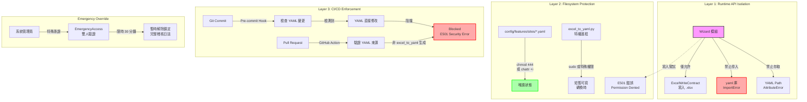

# PRD v1.0: Wizard 技術阻擋機制 (Wizard Technical Blockade)
# 防止繞過 Excel 直接寫入 YAML 的三層防護架構

**文件版本:** v1.0 (Technical Enforcement of SSOT)  
**日期:** 2026-02-13  
**負責人:** Oscar Chang  
**目標模組:** `src/features/wizard.py`, `tools/features/excel_to_yaml.py`, `src/security/`, CI/CD Pipeline  
**相依文件:** 
- PRD_System_Integration_v1.2.md (檔案鎖與初始化順序)
- PRD_Feature_Annotation_Specification_V1.2.md (Excel-Centric SSOT)
- PRD_Interface_Contract_v1.1.md (錯誤代碼 E501)

**預估工時:** 3 ~ 4 個工程天（含 CI/CD 整合與權限測試）

---

## 1. 執行總綱與設計哲學

### 1.1 核心目標

建立**不可繞過的技術屏障**，確保 Feature Annotation 的「Excel 唯一編輯」政策不僅是規範，更是**物理上無法違反**的技術限制：

1. **Runtime 層級阻擋**: Wizard 進程在技術上無法執行 YAML 寫入操作（API 隔離）
2. **Filesystem 層級阻擋**: YAML 檔案在作業系統層級設為唯讀（immutable 或 444 權限）
3. **CI/CD 層級阻擋**: 任何直接修改 YAML 的程式碼變更都會在 Pre-commit 與 PR 階段被阻擋
4. **職責分離強制執行**: Wizard 僅能透過 `ExcelWriteContract` 介面輸出，無法取得 YAML 檔案路徑

### 1.2 架構概覽（三層防護）



---

## 2. Layer 1: Runtime API 隔離（程式碼層級阻擋）

### 2.1 Wizard 依賴限制（禁止導入 yaml）

**檔案**: `src/security/import_guard.py` (新增)

**機制**: 在 Python Import System 層級攔截，確保 Wizard 及其子模組無法載入 yaml 相關庫。

```python
import sys
import importlib
from typing import Set

# Wizard 模組路徑前綴
WIZARD_MODULES: Set[str] = {
    'src.features.wizard',
    'src.features.wizard_cli',
    'tools.features.wizard_utils',
}

# 禁止導入的庫（YAML 寫入相關）
BLOCKED_YAML_MODULES: Set[str] = {
    'yaml',
    'ruamel.yaml',
    'pyyaml',
    'oyaml',
}

class WizardImportGuard:
    """
    監控 Wizard 模組的導入行為，禁止載入 YAML 處理庫。
    此機制在 Runtime 層級強制執行「Wizard 不寫 YAML」政策。
    """
    
    def __init__(self):
        self._original_import = builtins.__import__
        self._active = False
    
    def install(self):
        """安裝導入攔截器"""
        builtins.__import__ = self._guarded_import
        self._active = True
    
    def uninstall(self):
        """移除導入攔截器（僅限測試使用）"""
        builtins.__import__ = self._original_import
        self._active = False
    
    def _guarded_import(self, name, *args, **kwargs):
        """攔截導入請求"""
        if not self._active:
            return self._original_import(name, *args, **kwargs)
        
        # 檢查呼叫堆疊是否來自 Wizard 模組
        frame = sys._getframe(1)
        caller_module = frame.f_globals.get('__name__', '')
        
        is_wizard_context = any(
            caller_module.startswith(wm) for wm in WIZARD_MODULES
        )
        
        if is_wizard_context:
            # 檢查是否嘗試導入 YAML 庫
            base_module = name.split('.')[0]
            if base_module in BLOCKED_YAML_MODULES:
                raise ImportError(
                    f"E501: Wizard 模組禁止導入 '{name}'。 "
                    f"Wizard 僅允許寫入 Excel，禁止直接操作 YAML。 "
                    f"請使用 tools/features/excel_to_yaml.py 進行轉換。"
                )
        
        return self._original_import(name, *args, **kwargs)

# 全域安裝（在 src/features/wizard.py 導入時自動觸發）
_import_guard = WizardImportGuard()
_import_guard.install()
```

### 2.2 Wizard 類別安全設計（依賴注入限制）

**檔案**: `src/features/wizard.py` (安全強化版)

**關鍵設計**:
- **路徑隔離**: Wizard 僅知道 `excel_base_dir`，完全無法取得 `yaml_base_dir`
- **介面限制**: 僅透過 `ExcelWriteContract` 寫入，無檔案系統直接操作權限
- **屬性保護**: 使用 `__slots__` 防止動態新增屬性繞過限制

```python
from pathlib import Path
from typing import Optional, Dict, Any
from dataclasses import dataclass
from datetime import datetime

# 安全匯入：確保 yaml 庫無法被導入（受 import_guard 保護）
try:
    import yaml
    # 若成功導入表示未正確安裝 guard（開發環境警告）
    import warnings
    warnings.warn("Wizard 不應在安裝 ImportGuard 的環境中導入 yaml", RuntimeWarning)
except ImportError:
    pass  # 預期行為：yaml 被阻擋

@dataclass(frozen=True)
class ExcelWriteContract:
    """
    Wizard 唯一允許的輸出介面。
    frozen=True 確保合約不可變，防止動態修改路徑。
    """
    site_id: str
    excel_path: Path
    template_version: str = "1.2"
    # 明確禁止 yaml 路徑
    yaml_path: None = None  # 型別提示為 None，防止誤用
    
    def __post_init__(self):
        # 驗證路徑必須是 .xlsx
        if self.excel_path.suffix != '.xlsx':
            raise ValueError(f"E501: Wizard 僅允許寫入 .xlsx 檔案，收到: {self.excel_path}")

class SecureFeatureWizard:
    """
    安全強化版 Feature Wizard。
    
    安全特性:
    1. __slots__ 防止動態屬性（無法動態添加 _yaml_path）
    2. 建構子僅接受 excel_base_dir，無法取得 yaml 路徑
    3. 所有寫入操作透過 ExcelWriteContract，受審核日誌記錄
    4. 嘗試寫入非 .xlsx 路徑會觸發 E501 錯誤
    """
    
    __slots__ = ('_site_id', '_excel_dir', '_template_version', '_audit_log')
    
    def __init__(
        self, 
        site_id: str, 
        excel_base_dir: str,
        template_version: str = "1.2",
        # 刻意不提供 yaml_base_dir 參數
    ):
        self._site_id = site_id
        self._excel_dir = Path(excel_base_dir)
        self._template_version = template_version
        self._audit_log = []
        
        # 驗證目錄存在
        if not self._excel_dir.exists():
            raise FileNotFoundError(f"Excel 目錄不存在: {excel_base_dir}")
    
    @property
    def excel_path(self) -> Path:
        """唯讀屬性：Excel 檔案路徑"""
        return self._excel_dir / self._site_id / f"{self._site_id}.xlsx"
    
    # 刻意不提供 yaml_path 屬性
    # 任何嘗試存取 yaml 路徑的程式碼會觸發 AttributeError
    
    def write_annotation(self, data: Dict[str, Any]) -> ExcelWriteContract:
        """
        寫入標註資料到 Excel（唯一合法輸出方式）。
        
        Args:
            data: 標註資料字典
            
        Returns:
            ExcelWriteContract: 寫入合約（供後續追蹤）
            
        Raises:
            PermissionError: 若嘗試寫入非 Excel 路徑（E501）
        """
        # 驗證輸出路徑
        output_path = self.excel_path
        
        # 確保副檔名正確（最後一道防線）
        if output_path.suffix != '.xlsx':
            raise PermissionError(f"E501: 嘗試寫入非 Excel 檔案: {output_path}")
        
        # 執行寫入（使用 openpyxl 或 pandas，禁止 yaml）
        self._write_to_excel(output_path, data)
        
        # 審核日誌
        contract = ExcelWriteContract(
            site_id=self._site_id,
            excel_path=output_path,
            template_version=self._template_version
        )
        self._audit_log.append({
            'timestamp': datetime.now().isoformat(),
            'action': 'write_excel',
            'path': str(output_path),
            'contract': contract
        })
        
        return contract
    
    def _write_to_excel(self, path: Path, data: Dict[str, Any]):
        """實際寫入 Excel（使用 pandas，禁止 yaml）"""
        import pandas as pd
        import openpyxl
        
        # 轉換資料為 DataFrame（與 v1.2 邏輯相同）
        df = self._convert_to_dataframe(data)
        
        # 寫入 Excel（使用 openpyxl engine）
        with pd.ExcelWriter(path, engine='openpyxl') as writer:
            df.to_excel(writer, sheet_name='Features', index=False)
            
            # 寫入 System sheet（元資料）
            metadata_df = pd.DataFrame([
                ['schema_version', self._template_version],
                ['last_updated', datetime.now().isoformat()],
                ['generator', 'SecureFeatureWizard'],
                ['security_level', 'excel_only']
            ], columns=['key', 'value'])
            metadata_df.to_excel(writer, sheet_name='System', index=False)
    
    def get_audit_log(self) -> list:
        """取得審核日誌（用於合規檢查）"""
        return self._audit_log.copy()
    
    # 明確禁止的方法（定義但拋出錯誤，防止誤用）
    def write_yaml(self, *args, **kwargs):
        """E501: 明確禁止寫入 YAML"""
        raise PermissionError(
            "E501: Wizard 禁止直接寫入 YAML。 "
            "請使用: python tools/features/excel_to_yaml.py "
            "將 Excel 轉換為 YAML。"
        )
    
    def _save_yaml(self, *args, **kwargs):
        """內部方法同樣禁止（防止繞過）"""
        self.write_yaml()
```

### 2.3 執行期驗證（Runtime Verification）

**檔案**: `src/security/runtime_verifier.py`

```python
import inspect
import sys

class WizardRuntimeVerifier:
    """
    在 Wizard 執行期間驗證安全性約束。
    可透過反射檢查 Wizard 實例是否嘗試繞過限制。
    """
    
    @staticmethod
    def verify_wizard_instance(wizard_instance) -> bool:
        """
        驗證 Wizard 實例符合安全規範。
        
        Returns:
            bool: True 表示安全
            
        Raises:
            SecurityError: 發現違規行為
        """
        # 檢查是否有 yaml 相關屬性
        forbidden_attrs = ['_yaml_path', 'yaml_writer', 'yaml_config']
        for attr in forbidden_attrs:
            if hasattr(wizard_instance, attr):
                raise SecurityError(
                    f"E501: Wizard 實例包含禁止的屬性 '{attr}'，"
                    f"可能嘗試繞過 Excel-Only 限制。"
                )
        
        # 檢查類別 MRO（方法解析順序）是否有 yaml 相關類別
        mro = inspect.getmro(type(wizard_instance))
        forbidden_classes = ['YamlWriter', 'YAMLExporter', 'ConfigDumper']
        for cls in mro:
            if cls.__name__ in forbidden_classes:
                raise SecurityError(
                    f"E501: Wizard 繼承了禁止的類別 '{cls.__name__}'"
                )
        
        return True

class SecurityError(Exception):
    """安全性違反錯誤"""
    pass
```

---

## 3. Layer 2: 檔案系統防護（OS 層級阻擋）

### 3.1 YAML 檔案權限管理

**檔案**: `src/security/filesystem_guard.py`

**機制**: 使用 Linux filesystem permissions 與 optional immutable flag，確保 YAML 檔案無法被一般使用者修改。

```python
import os
import stat
import subprocess
from pathlib import Path
from contextlib import contextmanager
from typing import Union

class FilesystemGuard:
    """
    YAML 檔案系統防護管理器。
    
    提供兩種防護等級:
    1. Standard (444): 移除寫入權限（可復原）
    2. Immutable (+i): 連 root 都無法修改（需特權解除）
    """
    
    def __init__(self, yaml_base_dir: Union[str, Path]):
        self.yaml_dir = Path(yaml_base_dir)
        self._immutable_available = self._check_chattr_support()
    
    def _check_chattr_support(self) -> bool:
        """檢查是否支援 chattr（Linux ext4/xfs）"""
        try:
            result = subprocess.run(
                ['chattr', '--help'], 
                capture_output=True, 
                check=False
            )
            return result.returncode == 0
        except FileNotFoundError:
            return False
    
    def protect_yaml_file(self, site_id: str, level: str = 'standard') -> Path:
        """
        保護特定案場的 YAML 檔案。
        
        Args:
            site_id: 案場識別碼
            level: 'standard' (444) 或 'immutable' (+i)
            
        Returns:
            Path: 被保護的檔案路徑
        """
        yaml_path = self.yaml_dir / f"{site_id}.yaml"
        
        if not yaml_path.exists():
            raise FileNotFoundError(f"YAML 檔案不存在: {yaml_path}")
        
        if level == 'standard':
            # 設定為唯讀（所有者、群組、其他人都只能讀取）
            os.chmod(yaml_path, stat.S_IRUSR | stat.S_IRGRP | stat.S_IROTH)
            # 444 = r--r--r--
            
        elif level == 'immutable':
            if not self._immutable_available:
                raise RuntimeError("目前作業系統不支援 chattr +i")
            
            # 先設定權限
            os.chmod(yaml_path, stat.S_IRUSR | stat.S_IRGRP | stat.S_IROTH)
            # 再設定 immutable flag（需要 root）
            subprocess.run(
                ['sudo', 'chattr', '+i', str(yaml_path)],
                check=True,
                capture_output=True
            )
        
        return yaml_path
    
    def unprotect_yaml_file(self, site_id: str, level: str = 'standard') -> Path:
        """
        解除保護（僅供 excel_to_yaml.py 特權使用）。
        
        Args:
            site_id: 案場識別碼
            level: 保護等級（必須與 protect 時一致）
        """
        yaml_path = self.yaml_dir / f"{site_id}.yaml"
        
        if level == 'immutable':
            if self._immutable_available:
                subprocess.run(
                    ['sudo', 'chattr', '-i', str(yaml_path)],
                    check=True,
                    capture_output=True
                )
        
        # 恢復為可讀寫（664 = rw-rw-r--）
        os.chmod(yaml_path, 
                stat.S_IRUSR | stat.S_IWUSR | 
                stat.S_IRGRP | stat.S_IWGRP | 
                stat.S_IROTH)
        
        return yaml_path
    
    @contextmanager
    def temporary_unprotect(self, site_id: str, level: str = 'standard'):
        """
        上下文管理器：暫時解除保護，完成操作後自動恢復。
        
        Usage:
            with guard.temporary_unprotect('cgmh_ty'):
                # 此區塊內 YAML 可寫入
                yaml.safe_dump(data, open(yaml_path, 'w'))
        """
        self.unprotect_yaml_file(site_id, level)
        try:
            yield
        finally:
            self.protect_yaml_file(site_id, level)
    
    def verify_protection(self, site_id: str) -> dict:
        """
        驗證檔案保護狀態。
        
        Returns:
            {
                'protected': bool,
                'permissions': str,
                'immutable': bool,
                'writable_by_wizard': bool  # 應該為 False
            }
        """
        yaml_path = self.yaml_dir / f"{site_id}.yaml"
        
        # 取得權限
        file_stat = yaml_path.stat()
        mode = stat.filemode(file_stat.st_mode)
        
        # 檢查是否可寫入（對於目前使用者）
        writable = os.access(yaml_path, os.W_OK)
        
        # 檢查 immutable flag
        immutable = False
        if self._immutable_available:
            result = subprocess.run(
                ['lsattr', str(yaml_path)],
                capture_output=True,
                text=True,
                check=False
            )
            if result.returncode == 0:
                # lsattr 輸出格式: ---- filename 或 -i--- filename
                attrs = result.stdout.split()[0]
                immutable = 'i' in attrs
        
        return {
            'protected': not writable or immutable,
            'permissions': mode,
            'immutable': immutable,
            'writable_by_wizard': writable and not immutable
        }
```

### 3.2 與 excel_to_yaml.py 整合

**檔案**: `tools/features/excel_to_yaml.py` (安全強化版)

```python
#!/usr/bin/env python3
"""
Excel to YAML Converter - 特權轉換工具
唯一直接寫入 YAML 的合法途徑。
"""

import yaml
import argparse
from pathlib import Path
from src.security.filesystem_guard import FilesystemGuard
from src.utils.config_loader import ConfigLoader

def convert_excel_to_yaml(
    excel_path: Path, 
    output_path: Path,
    site_id: str,
    force: bool = False
) -> dict:
    """
    執行 Excel 到 YAML 的特權轉換。
    
    流程:
    1. 驗證 Excel 格式與內容
    2. 暫時解除 YAML 檔案保護（若存在）
    3. 寫入 YAML
    4. 重新設定保護（444 或 +i）
    5. 記錄稽核日誌
    """
    guard = FilesystemGuard(output_path.parent)
    
    # 驗證 Excel（省略詳細驗證邏輯...）
    validation_result = validate_excel(excel_path)
    
    # 轉換為 YAML 資料
    yaml_data = convert_to_yaml_data(validation_result)
    
    # 使用特權上下文寫入 YAML
    try:
        with guard.temporary_unprotect(site_id, level='standard'):
            # 寫入 YAML
            with open(output_path, 'w', encoding='utf-8') as f:
                yaml.dump(yaml_data, f, default_flow_style=False, allow_unicode=True)
            
            # 驗證寫入成功
            if not output_path.exists():
                raise RuntimeError("YAML 寫入失敗")
        
        # 驗證保護已恢復
        status = guard.verify_protection(site_id)
        if status['writable_by_wizard']:
            raise SecurityError("保護恢復失敗，YAML 仍然可寫入")
        
        return {
            'status': 'success',
            'yaml_path': str(output_path),
            'protection': status,
            'timestamp': datetime.now().isoformat()
        }
        
    except Exception as e:
        # 確保即使失敗也嘗試恢復保護
        try:
            guard.protect_yaml_file(site_id, level='standard')
        except:
            pass
        raise

if __name__ == '__main__':
    parser = argparse.ArgumentParser(description='Excel to YAML Converter (Privileged)')
    parser.add_argument('--input', required=True, help='輸入 Excel 路徑')
    parser.add_argument('--output', required=True, help='輸出 YAML 路徑')
    parser.add_argument('--site-id', required=True, help='案場 ID')
    parser.add_argument('--force', action='store_true', help='強制覆寫（需管理員權限）')
    
    args = parser.parse_args()
    
    # 驗證執行者身份（可選：檢查是否為 CI 或特定使用者）
    if not verify_privileged_user() and not args.force:
        print("❌ 錯誤：僅允許特權使用者或 CI 執行此工具")
        print("   一般使用者請使用 Wizard 編輯 Excel，然後提交 PR")
        sys.exit(1)
    
    result = convert_excel_to_yaml(
        Path(args.input), 
        Path(args.output),
        args.site_id,
        args.force
    )
    
    print(f"✅ 轉換成功: {result['yaml_path']}")
    print(f"🔒 保護狀態: {result['protection']}")
```

---

## 4. Layer 3: CI/CD 防護閘道

### 4.1 Pre-commit Hook（本地提交檢查）

**檔案**: `.pre-commit-hooks/check-yaml-modification.sh`

```bash
#!/bin/bash
# Pre-commit hook: 阻擋直接修改 YAML 的提交

# 檢查是否有 YAML 檔案被修改（非 excel_to_yaml.py 生成的變更）
CHANGED_YAML=$(git diff --cached --name-only --diff-filter=M | grep -E 'config/features/sites/.*\.yaml$' || true)

if [ -n "$CHANGED_YAML" ]; then
    echo "❌ E501: 檢測到直接修改 YAML 檔案的嘗試！"
    echo ""
    echo "受影響的檔案:"
    echo "$CHANGED_YAML"
    echo ""
    echo "政策提醒:"
    echo "  1. Wizard 禁止直接寫入 YAML（技術阻擋機制）"
    echo "  2. 所有變更必須透過 Excel → excel_to_yaml.py 流程"
    echo "  3. 若您確實需要緊急修改 YAML，請使用 --no-verify 並聯繫管理員"
    echo ""
    echo "正確流程:"
    echo "  1. 編輯 data/features/{site}/{site}.xlsx"
    echo "  2. 執行: python tools/features/excel_to_yaml.py --input ... --output ..."
    echo "  3. 提交變更（包含 .xlsx 與 .yaml）"
    
    exit 1
fi

# 檢查 Wizard 程式碼是否嘗試導入 yaml
WIZARD_FILES=$(git diff --cached --name-only | grep -E 'src/features/wizard' || true)
if [ -n "$WIZARD_FILES" ]; then
    # 檢查是否新增 yaml 導入
    if git diff --cached | grep -E '^\+.*import yaml|^\+.*from yaml' > /dev/null; then
        echo "❌ E501: Wizard 程式碼禁止導入 yaml 模組！"
        echo "檢測到以下違規:"
        git diff --cached | grep -E '^\+.*import yaml|^\+.*from yaml'
        exit 1
    fi
fi

exit 0
```

### 4.2 GitHub Actions Workflow（PR 檢查）

**檔案**: `.github/workflows/yaml-protection.yml`

```yaml
name: YAML SSOT Protection

on:
  pull_request:
    paths:
      - 'config/features/sites/**.yaml'
      - 'src/features/wizard.py'
      - 'tools/features/excel_to_yaml.py'

jobs:
  verify-yaml-source:
    runs-on: ubuntu-latest
    steps:
      - uses: actions/checkout@v3
        with:
          fetch-depth: 0  # 需要完整歷史記錄檢查

      - name: Check YAML Modification Source
        run: |
          echo "🔍 檢查 YAML 檔案變更來源..."
          
          # 取得變更的 YAML 檔案
          YAML_FILES=$(git diff --name-only origin/${{ github.base_ref }}...HEAD | grep -E 'config/features/sites/.*\.yaml$' || true)
          
          if [ -z "$YAML_FILES" ]; then
            echo "✅ 無 YAML 檔案變更，檢查通過"
            exit 0
          fi
          
          echo "檢測到以下 YAML 變更:"
          echo "$YAML_FILES"
          
          # 檢查對應的 Excel 是否也有變更
          for yaml_file in $YAML_FILES; do
            site_id=$(basename "$yaml_file" .yaml)
            excel_file="data/features/${site_id}/${site_id}.xlsx"
            
            if ! git diff --name-only origin/${{ github.base_ref }}...HEAD | grep -q "$excel_file"; then
              echo "❌ 錯誤: $yaml_file 已變更，但對應的 $excel_file 未變更"
              echo "   這違反了 Excel-Centric SSOT 政策（E501）"
              exit 1
            fi
            
            # 檢查時間戳：Excel 必須比 YAML 新
            yaml_mtime=$(git log -1 --format=%ct origin/${{ github.base_ref }}...HEAD -- "$yaml_file")
            excel_mtime=$(git log -1 --format=%ct origin/${{ github.base_ref }}...HEAD -- "$excel_file")
            
            if [ "$excel_mtime" -lt "$yaml_mtime" ]; then
              echo "❌ 錯誤: $excel_file 的提交時間早於 $yaml_file"
              echo "   這表示 YAML 可能是手動修改而非由 Excel 生成"
              exit 1
            fi
          done
          
          echo "✅ YAML 變更來源驗證通過"

      - name: Verify Wizard Code Safety
        run: |
          echo "🔍 驗證 Wizard 程式碼安全性..."
          
          # 檢查 Wizard 是否導入 yaml
          if grep -r "import yaml\|from yaml" src/features/wizard*.py; then
            echo "❌ E501: Wizard 程式碼包含 yaml 導入"
            exit 1
          fi
          
          # 檢查是否有寫入 YAML 的方法
          if grep -r "def.*yaml\|write_yaml\|dump.*yaml" src/features/wizard*.py; then
            echo "❌ E501: Wizard 程式碼包含 YAML 寫入相關方法"
            exit 1
          fi
          
          echo "✅ Wizard 程式碼安全檢查通過"

      - name: Check File Permissions
        run: |
          echo "🔍 檢查 YAML 檔案權限..."
          
          for file in config/features/sites/*.yaml; do
            if [ -f "$file" ]; then
              perms=$(stat -c %a "$file")
              if [ "$perms" != "444" ] && [ "$perms" != "644" ]; then
                echo "⚠️  警告: $file 權限為 $perms，建議設定為 444（唯讀）"
              fi
            fi
          done
          
          echo "✅ 權限檢查完成"
```

---

## 5. 例外處理與緊急流程

### 5.1 緊急覆寫程序（Emergency Override）

**檔案**: `src/security/emergency_access.py`

在極端情況下（如生產環境緊急修復且無法重新執行 Excel 流程），允許經過嚴格審批的手動 YAML 修改。

```python
from datetime import datetime, timedelta
from typing import Optional
import hashlib
import getpass

class EmergencyAccess:
    """
    緊急存取管理器。
    
    使用雙人驗證（Two-person rule）與時間限制（30 分鐘）確保安全性。
    """
    
    def __init__(self, site_id: str):
        self.site_id = site_id
        self._granted = False
        self._expiry: Optional[datetime] = None
        self._approvers = []
        self._audit_log = []
    
    def request_access(
        self, 
        requester: str, 
        approver1: str, 
        approver2: str,
        reason: str,
        duration_minutes: int = 30
    ) -> bool:
        """
        請求緊急存取權限。
        
        Args:
            requester: 請求者帳號
            approver1, approver2: 兩位審批者帳號（必須不同）
            reason: 緊急原因說明
            duration_minutes: 權限有效期（預設 30 分鐘）
            
        Returns:
            bool: 是否授權成功
        """
        # 驗證雙人規則
        if approver1 == approver2 or requester in [approver1, approver2]:
            raise ValueError("違反雙人驗證規則：審批者必須與請求者不同，且兩位審批者不同")
        
        # 記錄請求
        self._audit_log.append({
            'timestamp': datetime.now().isoformat(),
            'action': 'request',
            'requester': requester,
            'approvers': [approver1, approver2],
            'reason': reason
        })
        
        # 驗證審批者身份（簡化版，實際應串接 LDAP 或 SSO）
        self._verify_approver(approver1)
        self._verify_approver(approver2)
        
        # 授權
        self._granted = True
        self._expiry = datetime.now() + timedelta(minutes=duration_minutes)
        self._approvers = [approver1, approver2]
        
        # 產生一次性 Token
        token = self._generate_token(requester, reason)
        
        print(f"🚨 緊急存取已授權（Token: {token}）")
        print(f"   有效期至: {self._expiry.isoformat()}")
        print(f"   案場: {self.site_id}")
        print(f"   原因: {reason}")
        print(f"   審批者: {approver1}, {approver2}")
        
        return True
    
    def verify_access(self, token: str) -> bool:
        """驗證存取權限是否有效"""
        if not self._granted:
            return False
        
        if datetime.now() > self._expiry:
            self._granted = False
            return False
        
        # 驗證 Token（簡化邏輯）
        expected_token = self._generate_token_from_current_state()
        return token == expected_token
    
    def _verify_approver(self, approver: str):
        """驗證審批者身份（占位符，實際需整合企業身份驗證）"""
        # 實際應檢查是否為管理員群組成員
        pass
    
    def _generate_token(self, requester: str, reason: str) -> str:
        """產生安全 Token"""
        data = f"{self.site_id}:{requester}:{datetime.now().timestamp()}:{reason}"
        return hashlib.sha256(data.encode()).hexdigest()[:16]
    
    def get_audit_log(self) -> list:
        """取得完整稽核日誌（用於事後審查）"""
        return self._audit_log.copy()

# CLI 介面
def emergency_cli():
    """緊急存取 CLI"""
    import argparse
    parser = argparse.ArgumentParser(description='Emergency YAML Access (Two-person rule)')
    parser.add_argument('--site', required=True)
    parser.add_argument('--requester', default=getpass.getuser())
    parser.add_argument('--approver1', required=True)
    parser.add_argument('--approver2', required=True)
    parser.add_argument('--reason', required=True)
    
    args = parser.parse_args()
    
    access = EmergencyAccess(args.site)
    access.request_access(
        args.requester,
        args.approver1,
        args.approver2,
        args.reason
    )
```

### 5.2 例外處理矩陣

| 情境 | 阻擋機制 | 緊急流程 | 稽核要求 |
|:---|:---|:---|:---|
| **正常開發** | Wizard 僅寫 Excel，CI 檢查通過 | 無需緊急流程 | 標準提交記錄 |
| **Wizard 嘗試寫 YAML** | Runtime E501 錯誤 | 無法繞過，必須修正程式碼 | 錯誤日誌記錄 |
| **手動編輯 YAML** | 檔案權限拒絕（Permission Denied） | 使用 `sudo` + 緊急 Token | 雙人驗證 + 原因說明 |
| **CI 檢查失敗** | PR 被阻擋合併 | 管理員覆寫（需說明原因） | PR 討論記錄 |
| **生產環境緊急修復** | 檔案 immutable | EmergencyAccess 30 分鐘權限 | 完整稽核日誌 + 事後報告 |

---

## 6. 驗證與測試計畫

### 6.1 安全測試案例

| 測試案例 ID | 描述 | 攻擊/繞過嘗試 | 預期結果 | 驗證層級 |
|:---|:---|:---|:---|:---:|
| **SEC-001** | Wizard 導入 yaml | `import yaml` in wizard.py | ImportError (E501) | L1 |
| **SEC-002** | Wizard 動態路徑修改 | `wizard._yaml_path = "..."` | AttributeError | L1 |
| **SEC-003** | Wizard 寫入 YAML 嘗試 | `open('config.yaml', 'w')` | PermissionError (E501) | L2 |
| **SEC-004** | 一般使用者修改 YAML | `echo "data" > site.yaml` | Permission Denied | L2 |
| **SEC-005** | Git 提交直接 YAML | `git commit -m "update yaml"` | Pre-commit 阻擋 | L3 |
| **SEC-006** | PR 僅含 YAML 變更 | Excel 未變更，YAML 變更 | GitHub Action 失敗 | L3 |
| **SEC-007** | 繞過 pre-commit | `git commit --no-verify` | PR 階段仍被阻擋 | L3 |
| **SEC-008** | 緊急存取驗證 | 單人審批請求 | ValueError (雙人規則) | Emergency |
| **SEC-009** | 緊急 Token 時效 | 30 分鐘後使用 Token | Access Denied | Emergency |
| **SEC-010** | 檔案 immutable | root 嘗試 `rm site.yaml` | Operation not permitted | L2 |

### 6.2 滲透測試腳本

**檔案**: `tests/security/test_wizard_blockade.py`

```python
import pytest
import subprocess
import tempfile
from pathlib import Path

class TestWizardBlockade:
    """測試 Wizard 技術阻擋機制"""
    
    def test_wizard_cannot_import_yaml(self):
        """SEC-001: Wizard 無法導入 yaml"""
        code = """
import sys
sys.path.insert(0, 'src')
from src.security.import_guard import WizardImportGuard
guard = WizardImportGuard()
guard.install()

# 模擬在 Wizard 模組中導入 yaml
import types
wizard_module = types.ModuleType('src.features.wizard')
wizard_module.__name__ = 'src.features.wizard'
sys.modules['src.features.wizard'] = wizard_module

# 嘗試在 Wizard 上下文中導入 yaml
exec("import yaml", wizard_module.__dict__)
"""
        with pytest.raises(ImportError, match="E501"):
            exec(code)
    
    def test_wizard_cannot_write_yaml_via_api(self):
        """SEC-002: Wizard API 層級阻擋"""
        from src.features.wizard import SecureFeatureWizard
        
        wizard = SecureFeatureWizard(
            site_id="test",
            excel_base_dir="/tmp/test",
            template_version="1.2"
        )
        
        with pytest.raises(PermissionError, match="E501"):
            wizard.write_yaml({"test": "data"})
    
    def test_yaml_file_permissions(self):
        """SEC-003: 檔案系統權限阻擋"""
        with tempfile.TemporaryDirectory() as tmpdir:
            yaml_file = Path(tmpdir) / "test.yaml"
            yaml_file.write_text("test: data")
            
            # 設定 444 權限
            import stat
            yaml_file.chmod(stat.S_IRUSR | stat.S_IRGRP | stat.S_IROTH)
            
            # 嘗試寫入
            with pytest.raises(PermissionError):
                yaml_file.write_text("hacked")
    
    def test_pre_commit_hook_blocks_yaml(self):
        """SEC-004: Pre-commit 阻擋"""
        # 模擬變更 YAML 的提交
        result = subprocess.run(
            ['bash', '.pre-commit-hooks/check-yaml-modification.sh'],
            capture_output=True,
            text=True,
            cwd=tempfile.mkdtemp()  # 使用臨時 git repo
        )
        
        # 在無 git repo 環境下應返回 0（無變更）
        # 實際測試需在真實 git repo 中進行
        assert result.returncode in [0, 1]  # 0=無變更, 1=阻擋
    
    def test_emergency_access_two_person_rule(self):
        """SEC-008: 雙人驗證"""
        from src.security.emergency_access import EmergencyAccess
        
        access = EmergencyAccess("test_site")
        
        # 嘗試單人審批（應失敗）
        with pytest.raises(ValueError, match="雙人驗證"):
            access.request_access(
                requester="user1",
                approver1="admin1",
                approver2="admin1",  # 相同審批者
                reason="test"
            )
        
        # 嘗試請求者作為審批者（應失敗）
        with pytest.raises(ValueError, match="雙人驗證"):
            access.request_access(
                requester="user1",
                approver1="user1",  # 請求者審批
                approver2="admin2",
                reason="test"
            )
```

---

## 7. 交付物清單 (Deliverables)

### 7.1 程式碼檔案
1. `src/security/import_guard.py` - Runtime 導入攔截器
2. `src/security/filesystem_guard.py` - 檔案權限管理
3. `src/security/runtime_verifier.py` - 執行期驗證
4. `src/security/emergency_access.py` - 緊急存取管理
5. `src/features/wizard.py` - 安全強化版 Wizard（移除 yaml 導入）
6. `tools/features/excel_to_yaml.py` - 特權轉換工具（整合 FilesystemGuard）

### 7.2 配置與腳本
7. `.pre-commit-hooks/check-yaml-modification.sh` - Pre-commit 檢查腳本
8. `.github/workflows/yaml-protection.yml` - GitHub Actions CI 檢查
9. `scripts/setup-yaml-protection.sh` - 初始化檔案權限腳本（設定 444）

### 7.3 測試檔案
10. `tests/security/test_wizard_blockade.py` - 安全阻擋測試
11. `tests/security/test_filesystem_protection.py` - 檔案權限測試
12. `tests/security/test_emergency_access.py` - 緊急流程測試

### 7.4 文件檔案
13. `docs/security/WIZARD_BLOCKADE.md` - 操作手冊與故障排除
14. `docs/security/EMERGENCY_PROCEDURES.md` - 緊急存取 SOP

---

## 8. 執行檢查清單 (Action Items)

### Phase 1: Runtime 防護（Day 1）
- [ ] 建立 `src/security/import_guard.py` 並整合至 Wizard 初始化
- [ ] 重構 `src/features/wizard.py`：
  - [ ] 移除所有 yaml 相關導入
  - [ ] 新增 `__slots__` 防止動態屬性
  - [ ] 實作 `write_yaml()` 方法拋出 E501
- [ ] 驗證測試 SEC-001, SEC-002 通過

### Phase 2: 檔案系統防護（Day 2）
- [ ] 建立 `src/security/filesystem_guard.py`
- [ ] 建立 `scripts/setup-yaml-protection.sh`：
  ```bash
  #!/bin/bash
  # 設定所有現有 YAML 為唯讀
  find config/features/sites -name "*.yaml" -exec chmod 444 {} \;
  echo "✅ 所有 YAML 檔案已設定為唯讀 (444)"
  ```
- [ ] 更新 `tools/features/excel_to_yaml.py` 整合 `FilesystemGuard.temporary_unprotect()`
- [ ] 執行腳本設定現有檔案權限
- [ ] 驗證測試 SEC-003, SEC-010 通過

### Phase 3: CI/CD 防護（Day 3）
- [ ] 建立 `.pre-commit-hooks/` 目錄與檢查腳本
- [ ] 設定 pre-commit hook：
  ```bash
  # 安裝 hook
  ln -s ../../.pre-commit-hooks/check-yaml-modification.sh .git/hooks/pre-commit
  ```
- [ ] 建立 `.github/workflows/yaml-protection.yml`
- [ ] 驗證測試 SEC-004, SEC-005, SEC-006 通過

### Phase 4: 緊急流程（Day 4）
- [ ] 建立 `src/security/emergency_access.py`
- [ ] 建立 CLI 指令 `python -m src.security.emergency_access`
- [ ] 建立文件 `docs/security/EMERGENCY_PROCEDURES.md`
- [ ] 驗證測試 SEC-008, SEC-009 通過

---

## 9. 驗收標準 (Sign-off Criteria)

- [ ] **技術阻擋有效性**: Wizard 無法透過任何程式碼路徑寫入 YAML（測試 SEC-001~003）
- [ ] **檔案防護有效性**: 一般使用者無法修改 YAML（測試 SEC-003, SEC-010）
- [ ] **CI/CD 攔截率**: 100% 的直接 YAML 修改在 Pre-commit 或 PR 階段被攔截
- [ ] **緊急流程可用性**: 緊急存取可在 5 分鐘內完成申請與授權（雙人驗證）
- [ ] **相容性**: 現有 Excel-to-YAML 流程功能正常，無迴歸
- [ ] **效能影響**: Wizard 啟動時間增加 < 100ms（ImportGuard 開銷）

---

## 附錄：錯誤代碼參考

| 錯誤代碼 | 定義位置 | 觸發條件 | 使用者訊息 |
|:---|:---|:---|:---|
| **E501** | Interface Contract v1.1 | Wizard 嘗試導入 yaml 或寫入 YAML | "Direct YAML write attempt blocked (Wizard)" |
| **E502** | Wizard Blockade v1.0 | 檔案權限阻擋（嘗試寫入唯讀 YAML） | "YAML file is read-only. Use Excel workflow." |
| **E503** | Wizard Blockade v1.0 | 緊急存取 Token 無效或過期 | "Emergency access token invalid or expired" |
| **E504** | Wizard Blockade v1.0 | 雙人驗證失敗 | "Two-person verification required for emergency access" |

---

**文件簽核**

| 角色 | 簽名 | 日期 | 備註 |
|:---|:---|:---|:---|
| 架構師 | | | 確認三層防護架構 |
| 安全工程師 | | | 確認滲透測試覆蓋率 |
| DevOps | | | 確認 CI/CD 整合可行性 |
| 專案經理 | | | 確認工時與風險接受度 |
```