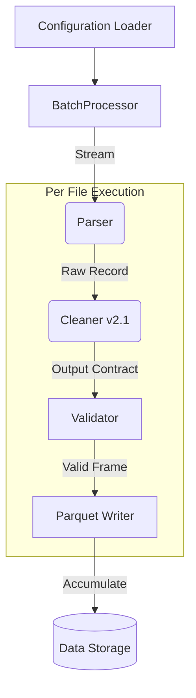

# BatchProcessor 技術評估與風險報告

**評估對象:** `src/etl/batch_processor.py`
**評估日期:** 2026-02-12
**評估人員:** Antigravity (AI Architect)
**嚴重性等級:** 🔴 Critical (需立即修正)

---

## 1. 執行摘要 (Executive Summary)

目前的 `batch_processor.py` 是一個**「原型等級 (Prototype-level)」**的實作，完全無法支撐「重大能源分析專案」的生產環境需求。

最致命的風險在於**記憶體管理 (OOM Risk)** 與 **介面契約衝突 (Contract Violation)**。如果不進行重構，直接套用新的 `DataCleaner v2.1`，程式將會崩潰或刪除關鍵的品質標記數據。

---

## 2. 關鍵風險分析 (Critical Risks)

### 🔴 風險 1: 記憶體炸彈 (The Memory Bomb)
- **程式碼位置:** L62 `parsed_dfs = []`, L74 `parsed_dfs.append(df)`, L153 `pl.concat(parsed_dfs)`
- **問題描述:** 程式將所有 CSV 檔案處理後的 DataFrame 全部暫存在 RAM 中的 `parsed_dfs` 列表，直到最後才一次性合併。
- **後果:** 
  - 若有 1000 個 50MB 的 CSV，記憶體需求將超過 50GB。
  - 對於能源長期分析專案（通常數年數據），此邏輯 100% 會導致 **Out of Memory (OOM)** 崩潰。
- **改進建議:** 必須改用 **Incremental Processing (增量處理)** 模式。
  - 處理完一個檔案，立即寫入磁碟 (如 Parquet) 或資料庫。
  - 或者使用 `pl.LazyFrame` 搭配 `sink_parquet` 進行串流寫入。

### 🔴 風險 2: 摧毀介面契約 (Contract Violation - Cleaner v2.1)
- **程式碼位置:** L170-181 (強制轉型邏輯)
```python
logger.info("Enforcing numeric types on all non-timestamp columns...")
# ...
merged_df = merged_df.with_columns(pl.col(col).cast(pl.Float64, strict=False))
```
- **問題描述:** 程式假設「所有非時間欄位都是數字」。但在 `PRD_CLEANER_v2.1` 中，我們引入了 `quality_flags`，其型別為 `List[str]`。
- **後果:** 
  - 這段程式碼會強制將 `quality_flags` 轉為 `Float64`。
  - 結果是 `quality_flags` 全部變成 `null`，**清洗器辛苦標記的錯誤資訊將被全數抹除**。
- **改進建議:** 必須移除全域強制轉型，改用 Config 定義的 Schema 驗證，或根據 `DataCleaner` 的 Output Contract 動態調整。

### 🟠 風險 3: 低效的 Schema 正規化 (Inefficient Schema Normalization)
- **程式碼位置:** L86-142
- **問題描述:** 為了處理不同 CSV 可能缺漏欄位的情況，程式遍歷了所有 DataFrame 兩次來補齊欄位。
- **後果:** 當資料量大時，這裡會成為 CPU 與 RAM 的雙重瓶頸。
- **改進建議:** 使用 `pl.concat(..., how="diagonal")` 其實已經能處理欄位不齊的問題（Polars 原生功能），L86-142 的手動正規化大部分是多餘且低效的。

### 🟠 風險 4: 配置硬編碼 (Configuration Hardcoding)
- **程式碼位置:** L44 `__init__(self, resample_interval: str = "5m")`
- **問題描述:** 參數被寫死或僅透過 `__init__` 傳遞，未整合專案整體的 `settings.yaml`。
- **後果:** 未來若要調整採樣頻率或物理參數，需修改程式碼，違反 Open-Closed Principle。

---

## 3. 模組協作流程說明 (Current vs. Ideal)

您詢問這支程序如何與 clean/parser 工作，目前的流程如下：

### 當前流程 (Current Code Flow):
```mermaid
graph LR
    A[BatchProcessor] -->|1. 呼叫| B(ReportParser)
    B -->|2. 回傳 Raw DF| A
    A -->|3. 呼叫| C(DataCleaner)
    C -->|4. 回傳 Clean DF| A
    A -->|5. 暫存記憶體| D{List[DF]}
    D -->|6. 迴圈結束後合併| E[Final DataFrame]
```

### 理想的生產級流程 (To-Be Architecture):
為了符合 PRD 要求，架構應改為 **Pipeline 模式**：



**協作細節:**
1.  **Parser**: 負責將原始 CSV 的雜亂格式（Metadata/Header 分離）轉為標準 Polars DataFrame。
2.  **Cleaner**: 接收 Raw DataFrame，執行物理檢查、重採樣，並附加上 `quality_flags`。
3.  **BatchProcessor**: 
    - **不應該做資料處理**（不管是 Schema 正規化還是型別強制）。
    - 它的職責應該只是 **Orchestrator (指揮官)**：由它讀取檔案列表，依序呼叫 Parser -> Cleaner，然後將結果**落地**。

## 4. 具體建議行動

1.  **重寫 BatchProcessor**：廢棄目前的實作，建立符合 Pipeline 模式的新版本。
2.  **整合 Config System**：讀取 `settings.yaml` 來初始化 Parser 與 Cleaner。
3.  **對接 Feature Engineer**：BatchProcessor 的輸出（如 Parquet 檔案）將成為 Feature Engineer 的輸入來源。

---

**結論**: 這支程式目前是專案中的「短板 (Singleton Point of Failure)」。若不重寫，您的 Cleaner v2.1 功能將完全無法發揮。
