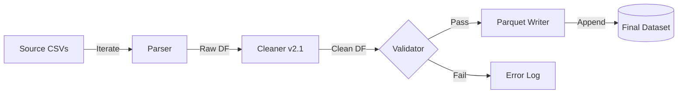

# PRD v1.0: 批次處理器重構指南 (BatchProcessor Implementation Guide)

**文件版本:** v1.0 (Pipeline Architecture)
**日期:** 2026-02-12
**負責人:** Oscar Chang
**目標模組:** `src/etl/batch_processor_v2.py`
**相依模組:** `src/etl/cleaner_v2.py`, `src/etl/parser.py`, `src/etl/config_models.py`

---

## 1. 執行總綱與設計哲學

目前的 `batch_processor.py` 存在記憶體堆積與契約破壞的致命傷。本 PRD 定義了 **V2.0 Pipeline 架構**，將其從「資料囤積者」轉型為「高效指揮官」。

**核心設計原則:**
1.  **串流優先 (Streaming First)**：嚴格禁止將多個檔案的 DataFrame 同時載入記憶體。處理完一個，立即釋放。
2.  **管線化 (Pipelined)**：`Read -> Parse -> Clean -> Validate -> Write` 為不可分割原子操作。
3.  **契約守護 (Contract Guardian)**：負責驗證 Cleaner 的輸出是否符合 Output Contract，在此攔截異常。
4.  **容錯韌性 (Resilience)**：單一檔案失敗不應導致整個批次作業中斷（Circuit Breaker 除外）。

---

## 2. 系統架構：Pipeline 模式

### 2.1 資料流 (Data Flow)



### 2.2 關鍵變更對照

| 功能模組 | 舊版實作 (Legacy) | 新版實作 (Pipeline) | 優勢 |
|:---|:---|:---|:---|
| **記憶體管理** | `List[DataFrame]` (Accumulate) | **Process-and-Dump** (Immediate Write) | OOM 風險歸零 |
| **型別處理** | 強制全轉 Float64 | 尊重 Config 定義 Schema | 保留 `quality_flags` |
| **輸出格式** | CSV/DataFrame | **Parquet (Snappy)** | 讀寫快 10x，保留型別 |
| **錯誤處理** | 簡單 Try-Catch | 詳細錯誤報告 + 略過機制 | 穩定性高 |

---

## 3. 分階段實作計畫

### Phase 1: 基礎架構與配置 (預估 0.5 天)

#### Step 1.1: 定義批次配置模型
**檔案**: `src/etl/config_models.py` (新增)

```python
class BatchConfig(BaseModel):
    input_pattern: str = "*.csv"
    output_format: Literal["parquet", "csv"] = "parquet"
    output_path: str = "data/processed/"
    write_mode: Literal["overwrite", "append"] = "overwrite"
    stop_on_error: bool = False  # 若 False，遇到壞檔僅記錄不中斷
```

#### Step 1.2: 建立 Orchestrator 骨架
**檔案**: `src/etl/batch_processor_v2.py`

```python
class BatchOrchestrator:
    def __init__(self, config: ETLConfig):
        self.config = config
        self.parser = ReportParser()
        self.cleaner = DataCleaner(config.cleaner)
        # 初始化 Writer (由 output_format 決定)
```

---

### Phase 2: 核心管線實作 (Critical) (預估 1.5 天)

#### Step 2.1: 實作單檔處理原子函數
**重點**: 這是記憶體控制的關鍵，必須確保執行完立即釋放變數。

```python
def process_single_file(self, file_path: Path) -> BatchResult:
    try:
        # 1. Parsing
        raw_df = self.parser.parse_file(str(file_path))
        
        # 2. Cleaning (含 Output Contract 驗證)
        clean_df = self.cleaner.clean(raw_df)
        
        # 3. Writing (立即寫入磁碟)
        self._write_to_sink(clean_df)
        
        return BatchResult(status="success", rows=len(clean_df))
        
    except Exception as e:
        logger.error(f"Failed processing {file_path}: {e}")
        return BatchResult(status="failed", error=str(e))
```

#### Step 2.2: 實作 Parquet Sink (寫入器)
**重點**: 支援 Append 模式。對於 Parquet，通常建議寫入 partition 或多個檔案，最後由 Feature Engineer 透過 glob 讀取。
- **策略**: 每個輸入 CSV 對應一個輸出 Parquet 檔案（一對一），保持源頭追溯性。
- **好處**: 避免並發寫入鎖定問題，且天然支援增量更新。

```python
def _write_to_sink(self, df: pl.DataFrame, source_name: str):
    target_path = self.output_dir / f"{source_name}.parquet"
    df.write_parquet(target_path, compression="snappy")
```

---

### Phase 3: 執行緒與錯誤報告 (預估 1 天)

#### Step 3.1: 批次迴圈與進度條
- 使用 `tqdm` 顯示進度。
- 整合 `process_single_file` 到主迴圈。

#### Step 3.2: 產生執行報告 (Execution Report)
- 處理結束後，產生 `batch_report_YYYYMMDD.json`
- 內容包含：
  - 成功/失敗檔案列表
  - 總處理行數
  - 異常檔案的 Error Stack Trace

---

## 4. 防呆與驗證機制

### 4.1 記憶體洩漏檢查 (Leak Check)
- 在處理大檔案 (e.g. 100MB+) 時，監控 `psutil.Process().memory_info().rss`。
- 確保處理第 1 個檔案與第 100 個檔案時，記憶體佔用量應持平（不隨檔案數增加）。

### 4.2 介面契約驗證 (Integration Verification)
- **Input**: 準備一個包含 `quality_flags` 的 Mock DataFrame。
- **Action**: 執行 BatchProcessor 流程。
- **Verify**: 檢查輸出的 Parquet 檔案 schema，確認 `quality_flags` 仍為 `List[Utf8]` 且內容未遺失。

---

## 5. 交付產物清單

1.  `src/etl/batch_processor_v2.py`: 全新 Orchestrator
2.  `src/etl/config_models.py`: 更新加入 BatchConfig
3.  `tests/test_batch_processor_v2.py`: 
    - 測試記憶體穩定性 (Mock 迴圈)
    - 測試錯誤隔離 (壞檔不影響好檔)
4.  `main.py`: 專案入口點 (Entry Point)，整合 argparse

---

## 6. 下一步指令

此文件確認後，我們將按順序執行：
1.  **Cleaner v2.1 Phase 1-2** (先有 Cleaner 才能被呼叫)
2.  **BatchProcessor v1.0 Phase 1-2** (建立管線)
3.  **整合測試**

請問是否同意此執行路徑？
