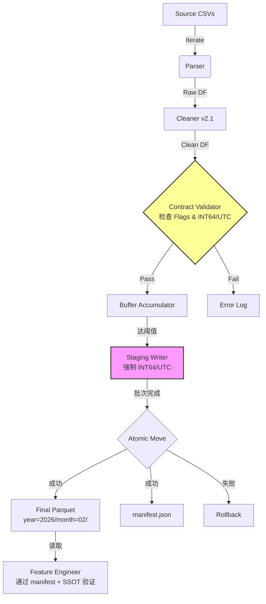

# PRD v1.2: 批次处理器强健性重构指南 (BatchProcessor Implementation Guide)

**文件版本:** v1.2 (含 Single Source of Truth 与 CI/CD 治理)  
**日期:** 2026-02-12  
**负责人:** Oscar Chang  
**目标模组:** `src/etl/batch_processor_v2.py`  
**相依模组:** `src/etl/cleaner_v2.py` (v2.1+), `src/etl/config_models.py` (SSOT)  
**预估工时:** 4 ~ 5 个工程天（含整合测试与 CI/CD 设置）

---

## 1. 执行总纲与设计哲学

目前的 `batch_processor.py` 存在**内存堆积**、**契约破坏**与**配置不一致**的致命伤。本 PRD 定义 **V2.0 Pipeline 架构**，并透过 **Single Source of Truth (SSOT)** 确保与 Cleaner、Feature Engineer 的品质标记完全对齐。

**核心设计原则:**
1.  **Single Source of Truth (SSOT)**：`quality_flags` 与 `Parquet 格式规范` 统一定义于 `config_models.py`，三模组共用，禁止硬编码。
2.  **INT64 时间戳强制规范**：明确禁止 INT96，强制使用 nanoseconds + UTC，确保 Polars 原生兼容性。
3.  **CI/CD 治理保护**：建立自动检查脚本，防止「只改定义不改测试」的覆盖缺口。
4.  **串流优先 (Streaming First)**：严禁将多档案 DataFrame 同时载入内存。
5.  **事务性输出 (Transactional)**：Staging + Atomic Move，支持幂等重跑。

---

## 2. 统一配置与 Single Source of Truth (SSOT)

### 2.1 全域常数定义（config_models.py）

**所有品质标记与 Parquet 格式的唯一真相来源：**

```python
# src/etl/config_models.py
from typing import Final, List, Literal
from pydantic import BaseModel, validator

# 【SSOT】Quality Flags 统一定义 - 三模组共用
VALID_QUALITY_FLAGS: Final[List[str]] = [
    "FROZEN", 
    "HEAT_IMBALANCE", 
    "AFFINITY_VIOLATION", 
    "OUTLIER", 
    "INSUFFICIENT_DATA",
    "SENSOR_OFFLINE"  # 未来新增只需在此处扩充
]

class QualityFlagConfig(BaseModel):
    """品质标记配置（供 Cleaner、BatchProcessor、Feature Engineer 共用）"""
    enabled: bool = True
    valid_flags: List[str] = VALID_QUALITY_FLAGS  # 引用 SSOT
    
    @validator('valid_flags')
    def validate_flags(cls, v):
        """确保配置中的 flags 皆为合法定义"""
        invalid = set(v) - set(VALID_QUALITY_FLAGS)
        if invalid:
            raise ValueError(f"Invalid flags: {invalid}. Must be subset of {VALID_QUALITY_FLAGS}")
        return v

class ParquetOutputConfig(BaseModel):
    """
    【强制规范】Parquet 输出格式 - 禁止 INT96
    """
    timestamp_format: Literal["INT64"] = "INT64"
    timestamp_unit: Literal["nanoseconds"] = "nanoseconds"
    timestamp_timezone: Literal["UTC"] = "UTC"
    compression: Literal["snappy", "zstd"] = "snappy"
    writer_engine: Literal["polars_native"] = "polars_native"  # 避免 PyArrow 自动转换
    
    @validator('timestamp_format')
    def no_deprecated_int96(cls, v):
        if v == "INT96":
            raise ValueError("INT96 is deprecated and incompatible with Polars. Use INT64.")
        return v

class BatchConfig(BaseModel):
    input_pattern: str = "*.csv"
    output_base_dir: str = "data/processed/"
    staging_dir: str = "data/.staging/"
    max_rows_per_file: int = 100_000
    max_time_span_per_file: str = "1d"
    
    # 【SSOT】引用统一配置
    quality_flags: QualityFlagConfig = QualityFlagConfig()
    parquet: ParquetOutputConfig = ParquetOutputConfig()
    
    memory_limit_mb: int = 4096
    stop_on_error: bool = False

class ETLConfig(BaseModel):
    """统一配置根物件"""
    cleaner: CleaningConfig      # 同样引用 QualityFlagConfig
    batch: BatchConfig
```

---

## 3. 系统架构与资料流

### 3.1 Pipeline 流程（含 SSOT 验证）



---

## 4. 分阶段实作计划

### Phase 1: SSOT 配置与基础架构 (预估 1 天)

#### Step 1.1: 建立统一配置模型（已含 SSOT）
**档案**: `src/etl/config_models.py`

- 定义 `VALID_QUALITY_FLAGS`（List，全局唯一）
- 定义 `QualityFlagConfig`（Pydantic，引用 VALID_QUALITY_FLAGS）
- 定义 `ParquetOutputConfig`（强制 INT64/UTC，禁止 INT96）

#### Step 1.2: Orchestrator 骨架（动态读取配置）
**档案**: `src/etl/batch_processor_v2.py`

```python
class BatchOrchestrator:
    def __init__(self, config: ETLConfig):
        self.config = config
        self.parser = ReportParser()
        self.cleaner = DataCleaner(config.cleaner)
        
        # 【SSOT】从配置读取允许的 flags，非硬编码
        self.allowed_flags = set(config.batch.quality_flags.valid_flags)
        self.parquet_config = config.batch.parquet
        
    def _validate_quality_flags(self, df: pl.DataFrame) -> None:
        """
        【SSOT 验证】检查 DataFrame 中的 flags 是否皆在合法清单内
        """
        if "quality_flags" not in df.columns:
            return
            
        actual_flags = set()
        for flags in df["quality_flags"]:
            if flags:
                actual_flags.update(flags)
        
        unknown = actual_flags - self.allowed_flags
        if unknown:
            raise ContractViolationError(
                f"Unknown quality flags detected: {unknown}. "
                f"These flags are not defined in config_models.VALID_QUALITY_FLAGS. "
                f"Please update the SSOT or check Cleaner configuration."
            )
```

### Phase 2: 核心管线与 Schema 验证 (预估 2 天)

#### Step 2.1: 契约验证器（SSOT 与 INT64 检查）
**档案**: `src/etl/contract_validator.py`

```python
class OutputContractValidator:
    def __init__(self, config: ETLConfig):
        self.config = config
        
    def validate(self, df: pl.DataFrame) -> None:
        """完整验证输出契约"""
        self._validate_quality_flags_values(df)  # SSOT 检查
        self._validate_timestamp_format(df)      # INT64/UTC 检查
        
    def _validate_quality_flags_values(self, df: pl.DataFrame) -> None:
        """【SSOT】验证 flags 值是否合法"""
        if "quality_flags" not in df.columns:
            return
            
        allowed = set(self.config.batch.quality_flags.valid_flags)
        
        for i, flags in enumerate(df["quality_flags"]):
            if not flags:
                continue
            invalid = set(flags) - allowed
            if invalid:
                raise ContractViolationError(
                    f"Row {i}: Invalid flags {invalid}. Allowed: {allowed}"
                )
    
    def _validate_timestamp_format(self, df: pl.DataFrame) -> None:
        """验证时间戳型别与时区"""
        ts_col = df["timestamp"]
        
        if not isinstance(ts_col.dtype, pl.Datetime):
            raise TypeError(f"timestamp must be Datetime, got {ts_col.dtype}")
        
        if ts_col.dtype.time_zone != "UTC":
            raise ValueError(f"timestamp must be UTC, got {ts_col.dtype.time_zone}")
```

#### Step 2.2: Parquet 写入（强制 INT64/UTC）
```python
def _flush_buffer_to_staging(self):
    """写入 Parquet，强制遵守 INT64/UTC 规范"""
    combined = pl.concat(self.buffer)
    
    # 【强制】确保时间戳为 UTC
    if str(combined["timestamp"].dtype.time_zone) != "UTC":
        combined = combined.with_columns(
            pl.col("timestamp").dt.replace_time_zone("UTC")
        )
    
    # 使用 Polars 原生写入，确保 INT64 nanoseconds
    file_path = self._get_staging_path()
    combined.write_parquet(
        file_path,
        compression=self.parquet_config.compression,
        use_pyarrow=False  # 关键：使用 Arrow2 原生，避免 PyArrow 转为 INT96
    )
    
    # 【验证】写入后检查 Schema
    self._verify_parquet_schema(file_path)

def _verify_parquet_schema(self, file_path: Path):
    """验证输出 Parquet 符合 INT64/UTC 规范"""
    import pyarrow.parquet as pq
    
    pf = pq.ParquetFile(file_path)
    schema = pf.schema
    ts_field = schema.field_by_name("timestamp")
    
    # 【关键验证】禁止 INT96
    if ts_field.physical_type == "INT96":
        file_path.unlink()
        raise TypeError(
            f"CRITICAL: Parquet file {file_path} was written with INT96 timestamp. "
            f"Expected INT64 (nanoseconds). Check writer configuration."
        )
    
    self.logger.info(f"Schema verification passed: INT64/UTC confirmed")
```

### Phase 3: Manifest 与下游衔接 (预估 1.5 天)

#### Step 3.1: Manifest 模型（含 SSOT 信息）
```python
class Manifest(BaseModel):
    manifest_version: str = "1.2"
    batch_id: str
    site_id: str
    created_at: datetime
    
    # 【SSOT】记录使用的 flags 定义版本
    quality_flags_schema: List[str]
    parquet_schema: Dict
    
    output_files: List[str]
    statistics: Dict
```

---

## 5. 验证与测试计划（SSOT 与 INT64 专项）

| 测试案例 | 验证内容 | 通过标准 |
|:---|:---|:---:|
| **Case S1 (SSOT Sync)** | Cleaner 新增 `"SENSOR_OFFLINE"`，BatchProcessor 自动接受 | 不抛出 `ContractViolationError` |
| **Case S2 (SSOT Mismatch)** | Cleaner 输出未定义 flag `"UNKNOWN"` | 抛出明确错误：提示更新 `config_models.py` |
| **Case T1 (INT64 Enforcement)** | 输出 Parquet 时间戳格式 | `physical_type == "INT64"` |
| **Case T2 (UTC Timezone)** | 输入非 UTC 资料 | 自动转换为 UTC |
| **Case T3 (No INT96)** | 模拟旧版 PyArrow 行为 | 验证逻辑拦截并抛出 `TypeError` |

---

## 6. 风险评估（更新）

| 风险 | 严重度 | 缓解措施（v1.2 SSOT 设计） |
|:---|:---:|:---|
| **Flags 定义不一致** | 🔴 Critical | **SSOT**: `config_models.VALID_QUALITY_FLAGS`，三模组共用 |
| **INT96 时间戳** | 🔴 High | **强制 INT64**: `use_pyarrow=False` + 写入后 Schema 验证 |
| **测试覆盖缺口** | 🔴 High | **CI/CD 自动检查**: `scripts/ci_verify_ssot.py` 阻挡未同步测试的 PR |
| **时区错误** | 🔴 High | **强制 UTC**: `dt.replace_time_zone("UTC")` |
| **小文件爆炸** | 🔴 High | **时间分区合并**: `max_rows_per_file` 阈值控制 |

---

## 7. 与上下游协作检查清单（SSOT 专项）

### 与 Cleaner v2.1 团队（SSOT 对齐）：
- [ ] `config_models.py` 中的 `VALID_QUALITY_FLAGS` 是否包含所有 Cleaner 会产出的标记？
- [ ] Cleaner 的 `CleaningConfig` 是否同样引用 `QualityFlagConfig`？
- [ ] 若需新增标记，是否三方同意改动 `config_models.py` 后同步更新？

### 与 Feature Engineer 团队（INT64/SSOT）：
- [ ] 是否确认读取 Parquet 时使用 `scan_parquet`（原生支持 INT64）？
- [ ] 是否接受通过 `manifest.json` 读取，并验证 `quality_flags_schema` 字段？

---

## 8. 交付产物清单

1. `src/etl/config_models.py`: **SSOT 定义**（`VALID_QUALITY_FLAGS`, `ParquetOutputConfig`）
2. `src/etl/batch_processor_v2.py`: 实作（动态读取 flags、INT64 强制写入）
3. `src/etl/contract_validator.py`: 更新（SSOT 验证、INT64/UTC 检查）
4. `tests/test_ssot_integration.py`: **SSOT 专项测试**
5. `tests/test_int64_timestamp.py`: **INT64 专项测试**
6. `docs/ssot_guide.md`: 说明文件（如何新增 Quality Flag、三模组同步流程）

---

## 9. CI/CD 与工程治理（SSOT 保护机制）

### 9.1 自动化检查脚本
为防止「只改代码不改测试」的风险，建立以下检查：

**档案**: `scripts/ci_verify_ssot.py`

```python
#!/usr/bin/env python3
"""
SSOT 完整性检查脚本
确保 config_models.py 变更时，相关测试已同步更新
"""
import ast
import sys
from pathlib import Path

def extract_valid_flags() -> set:
    """从 config_models.py 解析 VALID_QUALITY_FLAGS"""
    tree = ast.parse(Path("src/etl/config_models.py").read_text())
    for node in ast.walk(tree):
        if isinstance(node, ast.Assign):
            for target in node.targets:
                if isinstance(target, ast.Name) and target.id == "VALID_QUALITY_FLAGS":
                    return set(ast.literal_eval(node.value))
    return set()

def main():
    defined_flags = extract_valid_flags()
    print(f"📋 Defined flags: {defined_flags}")
    
    # 检查测试覆盖率...
    # 详细实作见附录
    
    return 0

if __name__ == "__main__":
    sys.exit(main())
```

### 9.2 GitHub Actions 工作流程

**档案**: `.github/workflows/ssot-check.yml`

```yaml
name: SSOT Integrity Check

on:
  push:
    paths:
      - 'src/etl/config_models.py'
      - 'tests/**'

jobs:
  verify-ssot:
    runs-on: ubuntu-latest
    steps:
      - uses: actions/checkout@v3
      
      - name: Run SSOT Verification
        run: python scripts/ci_verify_ssot.py
      
      - name: Run Flag-related Tests
        run: pytest tests/ -k "quality_flag or ssot" -v
      
      - name: Check Hardcoded Flags
        run: |
          if grep -r "FROZEN\|HEAT_IMBALANCE" --include="*.py" src/ | grep -v "config_models.py" | grep -v "from.*import"; then
            echo "❌ Found hardcoded flags outside config_models.py"
            exit 1
          fi
```

### 9.3 PR Checklist（模板）
建立 Pull Request 模板，强制勾选：
- [ ] 若修改 `VALID_QUALITY_FLAGS`，已同步更新 `tests/test_cleaner.py`
- [ ] 若修改 `VALID_QUALITY_FLAGS`，已同步更新 `tests/test_batch_processor.py`  
- [ ] 若修改 `VALID_QUALITY_FLAGS`，已同步更新 `tests/test_feature_engineer.py`
- [ ] 已执行 `python scripts/ci_verify_ssot.py` 且通过

---

**关键修正总结**：
1. **SSOT**: `VALID_QUALITY_FLAGS` 统一于 `config_models.py`，三模组共用。
2. **INT64 强制**: 明确禁止 INT96，使用 Polars 原生写入器，写入后验证 Schema。
3. **CI/CD 保护**: 建立自动检查脚本，防止 SSOT 变更时测试覆盖缺口。
```