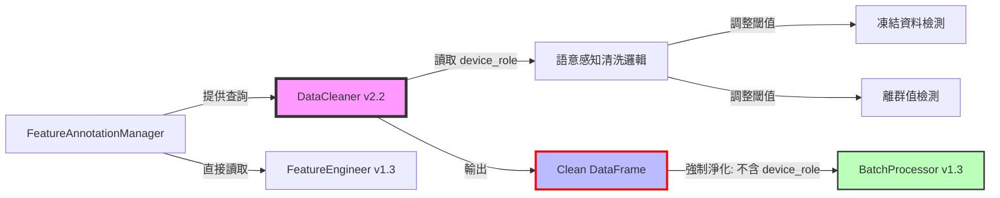

# PRD v2.2-FA-ENFORCE: 資料清洗器實作指南 (DataCleaner Implementation Guide)
# 強制執行版：整合 Feature Annotation v1.2 與職責分離強制機制

**文件版本:** v2.2-FA-ENFORCE (Interface Contract Alignment & SSOT Enforcement with Mandatory Output Contract Enforcement)  
**日期:** 2026-02-13  
**負責人:** Oscar Chang  
**目標模組:** `src/etl/cleaner.py` (v2.2+)  
**上游契約:** `src/etl/parser.py` (v2.1+, 輸出 UTC)  
**下游契約:** `src/etl/batch_processor.py` (v1.3+, 輸入檢查點 #2)  
**關鍵相依:** `src/features/annotation_manager.py` (v1.2+, 提供 device_role 查詢，但不寫入 metadata)  
**預估工時:** 5 ~ 6 個工程天（含強制執行機制實作與 CI/CD Gate 配置）

---

## 1. 執行總綱與變更摘要

### 1.1 版本變更總覽 (v2.1 → v2.2-FA-ENFORCE)

| 變更類別 | v2.1 狀態 | v2.2-FA-ENFORCE 修正 | 影響層級 |
|:---|:---|:---|:---:|
| **SSOT 引用** | 提及 flags 但未明確引用 | **強制引用** `VALID_QUALITY_FLAGS` 與 `FeatureAnnotationManager` | 🔴 Critical |
| **時區處理** | 要求輸入 UTC，但無容錯說明 | **雙模容錯** (直接通過/自動轉換) | 🟡 Medium |
| **輸出驗證** | 基礎契約檢查 | **強制執行契約驗證** (`_validate_output_contract` + `_enforce_schema_sanitization`) | 🔴 Critical |
| **Flags 產生** | 邏輯分散 | **集中式 Flags 管理** (統一產生與驗證) | 🟡 Medium |
| **Metadata 傳遞** | 無明確規範 | **白名單強制過濾** `ALLOWED_METADATA_KEYS`，**主動淨化**而非僅檢查 | 🔴 Critical |
| **Schema 淨化** | 無 | **新增**：`FORBIDDEN_COLS` 自動清除機制，防禦性編程確保禁止欄位絕不輸出 | 🔴 Critical |
| **Annotation 整合** | 無 | **新增**：讀取 `device_role` 進行語意感知清洗，但**不寫入 DataFrame** | 🔴 Critical |
| **職責分離** | 建議性描述 | **強制執行**：三層防護機制（白名單+Schema淨化+CI Gate）確保 E500 絕不發生 | 🔴 Critical |
| **CI/CD Gate** | 測試為驗證項目 | **Blocker 機制**：`test_cleaner_output_no_device_role` 失敗阻擋合併 | 🔴 Critical |

### 1.2 核心設計原則（強制執行版）

1. **Gatekeeper (守門員)**: 髒數據絕不進入下游，物理不可能數據立即標記
2. **SSOT 嚴格遵守**: 所有品質標記、單位定義、物理限制必須引用 `config_models.py`
3. **職責分離強制執行 (Mandatory Separation of Concerns)**:
   - **Cleaner 職責**：讀取 `device_role` 進行**語意感知清洗**（如備用設備放寬凍結檢測），但**絕對禁止將 `device_role` 寫入輸出 DataFrame 或 metadata**
   - **強制機制**：透過 `ALLOWED_METADATA_KEYS` 白名單與 `FORBIDDEN_COLS` 自動清除，從技術層面杜絕誤寫入
   - **下游職責**：`FeatureEngineer` 直接從 `FeatureAnnotationManager` 讀取 `device_role`，不依賴 Cleaner 傳遞的 metadata
4. **冪等性**: 相同輸入執行多次，輸出必須完全一致 (時間戳對齊、Null 處理一致)
5. **零複製銜接**: 接收 Parser v2.1 的 UTC 輸出，無需時區轉換即可傳遞給 BatchProcessor
6. **防禦性編程 (Defensive Programming)**: 即使開發者誤寫入禁止欄位，系統自動淨化而非僅拋出警告

### 1.3 與 Feature Annotation 的關係



**關鍵約束（強制執行）**：
- 🔴 **Cleaner 不寫入 device_role**：輸出 DataFrame 的 schema 中**不得包含** `device_role` 欄位或 metadata，且透過技術機制**強制移除**而非僅檢查
- 🟡 **Cleaner 讀取 device_role**：僅用於內部清洗策略調整（如 `backup` 設備允許較長時間靜止值）
- 🟢 **SSOT 單一來源**：所有 `device_role` 與 `physical_type` 必須來自 `FeatureAnnotationManager`，禁止硬編碼預設值

---

## 2. 介面契約規範 (Interface Contracts)

### 2.1 輸入契約 (Input Contract from Parser v2.1)

| 檢查項 | 規範 | 容錯處理 | 錯誤代碼 |
|:---|:---|:---|:---:|
| `timestamp` | `Datetime(time_unit='ns', time_zone='UTC')` | 若為其他時區 → 自動轉換 UTC (Warning) | E101 |
| `timestamp` | 無未來資料 (>`now+5min`) | 拋出例外 (Data Leakage 防護) | E102 |
| `quality_flags` | `List(Utf8)` (可選) | 若存在，驗證值 ⊆ `VALID_QUALITY_FLAGS` | E103 |
| 數值欄位 | `Float64` (SI 單位) | 單位轉換 (若配置 `unit_system=IMPERIAL`) | E104 |
| 編碼 | UTF-8，無 BOM | 發現 BOM → 截斷並記錄 Warning | E105 |
| **欄位存在性** | 所有欄位必須在 Annotation 中定義 | 未定義欄位依 `unannotated_column_policy` 處理 | **E402** |

### 2.2 輸出契約 (Output Contract to BatchProcessor v1.3)

**這是與 BatchProcessor 的硬性契約，必須嚴格遵守，且透過強制執行機制確保：**

```python
class CleanerOutputContract:
    """Cleaner v2.2-FA-ENFORCE 輸出資料規範（強制執行版）"""
    
    # 1. 時間戳規範 (與 Parser v2.1 一致，直接透傳)
    timestamp: pl.Datetime(time_unit="ns", time_zone="UTC")
    
    # 2. 品質標記 (核心變更：必須引用 SSOT)
    quality_flags: pl.List(pl.Utf8)  # 值必須 ∈ VALID_QUALITY_FLAGS
    
    # 3. 資料欄位 (SI 單位，無單位字元)
    data_columns: pl.Float64  # 所有感測器數值
    
    # 4. 時間軸完整性標記
    temporal_continuity: bool  # True=連續無缺漏, False=有缺漏已補Null
    
    # 5. Metadata (傳遞給 BatchProcessor 寫入 Manifest)
    # 【關鍵】不包含 device_role，僅包含物理類型與單位，且經過白名單強制過濾
    column_metadata: Dict[str, ColumnMeta]  # 僅限 ALLOWED_METADATA_KEYS 中的鍵
    # ❌ 絕對禁止包含：device_role, ignore_warnings, is_target, role, device_type
```

### 2.3 Feature Annotation 整合契約

| 項目 | 來源 | 使用方式 | 是否寫入輸出 |
|:---|:---|:---:|:---:|
| `physical_type` | `FeatureAnnotationManager` | 物理限制檢查、單位驗證 | ✅ 是（經白名單過濾後寫入 metadata） |
| `unit` | `FeatureAnnotationManager` | 單位轉換驗證 | ✅ 是（經白名單過濾後寫入 metadata） |
| `device_role` | `FeatureAnnotationManager` | **語意感知清洗策略調整** | ❌ **否**（僅 runtime 使用，且強制移除） |
| `ignore_warnings` | `FeatureAnnotationManager` | 決定是否標記特定 Warning | ❌ **否**（僅 runtime 使用，且強制移除） |
| `is_target` | `FeatureAnnotationManager` | 跳過特定清洗（如 target 不標記 FROZEN） | ❌ **否**（僅 runtime 使用，且強制移除） |

### 2.4 輸出契約強制執行機制 (Output Contract Enforcement)

為確保 E500 絕對不發生，實作層必須採用**防禦性程式設計三層防護機制**：

#### 2.4.1 第一層：Metadata 白名單機制 (Metadata Whitelist)

**強制要求**：定義嚴格的白名單，任何不在白名單的鍵於 `_build_column_metadata` 階段**自動刪除**，而非僅發出警告。

```python
# 檔案: src/etl/cleaner.py
# 類別層級常數定義（強制執行）
ALLOWED_METADATA_KEYS: Final[Set[str]] = frozenset({
    'physical_type', 
    'unit', 
    'description',
    'column_name'  # 內部使用，但允許傳遞
})

def _sanitize_metadata_dict(self, meta: Dict[str, Any], column_name: str) -> Dict[str, Any]:
    """
    強制執行：Metadata 白名單過濾
    無論開發者意圖為何，僅允許 ALLOWED_METADATA_KEYS 中的鍵通過
    
    Args:
        meta: 原始 metadata dict（可能包含誤寫入的 device_role 等）
        column_name: 欄位名稱，用於日誌記錄
        
    Returns:
        淨化後的 metadata dict，保證僅含白名單鍵
    """
    sanitized = {}
    removed_keys = []
    
    for key, value in meta.items():
        if key in ALLOWED_METADATA_KEYS:
            sanitized[key] = value
        else:
            removed_keys.append(key)
    
    # 強制執行：發現禁止鍵時記錄 Warning，但絕不拋出錯誤（防禦性編程）
    if removed_keys:
        self.logger.warning(
            f"[強制執行] 欄位 '{column_name}' 發現禁止 metadata 鍵 {removed_keys}，"
            f"已自動移除。請檢查程式碼是否誤寫入 device_role 等資訊。"
        )
    
    return sanitized
```

#### 2.4.2 第二層：Schema 強制淨化 (Schema Sanitization)

**強制要求**：在 `_validate_output_contract` 中，使用 `df.select()` **主動清除**可能的禁止欄位（即使誤寫入），確保輸出 schema 絕對純淨。

```python
# 檔案: src/etl/cleaner.py
# 禁止欄位定義（擴充版，包含可能的變體）
FORBIDDEN_COLS: Final[Set[str]] = frozenset({
    'device_role', 
    'ignore_warnings', 
    'is_target',
    'role',           # 可能的簡寫
    'device_type',    # 可能的混淆名稱
    'annotation_role', # 可能的命名
    'col_role',
    'feature_role'
})

def _enforce_schema_sanitization(self, df: pl.DataFrame) -> pl.DataFrame:
    """
    強制執行：Schema 淨化
    使用 Polars 選擇器強制排除禁止欄位，即使這些欄位被誤寫入
    
    此為防禦性編程最後防線，確保無論上游邏輯如何，輸出絕對乾淨
    
    Args:
        df: 可能包含禁止欄位的 DataFrame
        
    Returns:
        淨化後的 DataFrame，保證不含 FORBIDDEN_COLS 中的任何欄位
    """
    current_cols = set(df.columns)
    forbidden_in_df = current_cols & FORBIDDEN_COLS
    
    if forbidden_in_df:
        self.logger.warning(
            f"[強制執行] 發現禁止欄位 {forbidden_in_df} 於輸出 DataFrame，"
            f"執行強制移除。這表示上游邏輯誤寫入 device_role 等資訊。"
        )
        
        # 強制執行：使用 Polars select 主動排除（絕不拋錯，確保流程繼續）
        clean_cols = [c for c in df.columns if c not in FORBIDDEN_COLS]
        df = df.select(clean_cols)
        
        # 記錄稽核軌跡
        self.logger.info(f"[強制執行] 已移除欄位: {forbidden_in_df}，剩餘欄位: {clean_cols}")
    
    return df
```

#### 2.4.3 第三層：單元測試 Gate (Unit Test Gate)

**強制要求**：`test_cleaner_output_no_device_role` 測試案例必須通過，才能合併至 main 分支。此測試為**架構防護測試 (Architecture Guard Test)**，失敗即阻擋部署管線。

```python
# 檔案: tests/test_cleaner_output_contract.py
# 此測試為 CI/CD Required Status Check，失敗阻擋合併

class TestCleanerOutputContractEnforcement:
    """輸出契約強制執行測試（CI/CD Blocker）"""
    
    def test_cleaner_output_no_device_role(self, sample_annotation_manager):
        """
        強制執行測試：驗證輸出絕對不含 device_role 欄位或 metadata
        
        此測試失敗表示：
        1. 白名單機制失效，或
        2. Schema 淨化失效，或  
        3. 開發者繞過防護機制直接寫入
        
        後果：立即阻擋合併至 main 分支（P1 優先級）
        """
        # Arrange: 建立包含 device_role 的 Annotation 環境
        config = CleanerConfig(
            use_device_role_from_annotation=True,
            unannotated_column_policy="error"
        )
        cleaner = DataCleaner(config, annotation_manager=sample_annotation_manager)
        
        # 建立測試資料（模擬可能誘使寫入 role 的場景）
        test_data = pl.DataFrame({
            "timestamp": [datetime(2026, 1, 1, tzinfo=timezone.utc)],
            "sensor_A": [25.0],  # 假設為 backup 設備
        })
        
        # Act: 執行清洗
        result_df, metadata = cleaner.clean(test_data)
        
        # Assert: 絕對禁止欄位檢查（硬斷言，無容錯）
        assert "device_role" not in result_df.columns, \
            f"E500 違規：輸出 DataFrame 包含禁止欄位 'device_role'。Columns: {result_df.columns}"
            
        assert "role" not in result_df.columns, \
            f"E500 違規：輸出 DataFrame 包含禁止欄位 'role'。Columns: {result_df.columns}"
        
        # Assert: Metadata 白名單檢查
        for col_name, meta in metadata.items():
            forbidden_keys = set(meta.keys()) & FORBIDDEN_COLS
            assert len(forbidden_keys) == 0, \
                f"E500 違規：欄位 '{col_name}' 的 metadata 包含禁止鍵 {forbidden_keys}。 " \
                f"Metadata 內容: {meta}"
            
            # 驗證僅含白名單鍵
            assert set(meta.keys()).issubset(ALLOWED_METADATA_KEYS), \
                f"E500 違規：欄位 '{col_name}' 的 metadata 包含非白名單鍵。 " \
                f"允許: {ALLOWED_METADATA_KEYS}, 實際: {set(meta.keys())}"
    
    def test_cleaner_forced_sanitization_effectiveness(self):
        """
        驗證強制淨化機制有效性：即使手動注入禁止欄位，輸出仍被淨化
        """
        cleaner = DataCleaner(CleanerConfig())
        
        # 模擬誤寫入场景：手動構造含禁止欄位的 DataFrame
        contaminated_df = pl.DataFrame({
            "timestamp": [datetime(2026, 1, 1, tzinfo=timezone.utc)],
            "sensor_A": [25.0],
            "device_role": ["backup"],  # 模擬誤寫入
            "ignore_warnings": [True]   # 模擬誤寫入
        })
        
        # 透過反射呼叫內部淨化方法驗證
        clean_df = cleaner._enforce_schema_sanitization(contaminated_df)
        
        assert "device_role" not in clean_df.columns
        assert "ignore_warnings" not in clean_df.columns
        assert "sensor_A" in clean_df.columns  # 正常欄位保留
```

---

## 3. 分階段實作計畫 (Phase-Based Implementation)

### Phase 0: Annotation 整合基礎建設與強制機制 (Day 1-2, 重大更新)

#### Step 0.1: 建構子與 AnnotationManager 注入（含強制檢查）

**檔案**: `src/etl/cleaner.py` (頂部與 `__init__`)

**實作內容**:
```python
from typing import Final, Dict, List, Optional, Tuple, Set, Any
import polars as pl
import numpy as np
from datetime import datetime, timedelta, timezone
from pydantic import BaseModel, validator

# 【關鍵】SSOT 嚴格引用
from src.etl.config_models import (
    VALID_QUALITY_FLAGS,      # SSOT: 6個標準品質標記
    TIMESTAMP_CONFIG,         # SSOT: 時間戳規範 (UTC, ns)
    CleanerConfig,           # 配置模型（已移除 default_device_role）
)

# 【新增】Feature Annotation 整合
from src.features.annotation_manager import FeatureAnnotationManager, ColumnAnnotation
from src.exceptions import ConfigurationError, ContractViolationError, DataValidationError

class DataCleaner:
    """
    DataCleaner v2.2-FA-ENFORCE - 整合 Feature Annotation 與職責分離強制執行機制
    
    核心職責：
    1. 資料清洗與品質標記（SSOT 嚴格引用）
    2. 語意感知清洗（根據 device_role 調整策略，但不寫入 metadata）
    3. **強制執行輸出契約**（三層防護：白名單+Schema淨化+驗證）
    
    強制機制保證：
    - 輸出絕對不含 device_role 等禁止欄位（即使誤寫入也自動清除）
    - Metadata 僅含白名單鍵（自動過濾，不拋錯）
    """
    
    # 【強制執行】類別層級常數定義
    ALLOWED_METADATA_KEYS: Final[Set[str]] = frozenset({
        'physical_type', 'unit', 'description', 'column_name'
    })
    
    FORBIDDEN_COLS: Final[Set[str]] = frozenset({
        'device_role', 'ignore_warnings', 'is_target', 'role', 
        'device_type', 'annotation_role', 'col_role', 'feature_role'
    })
    
    DEVICE_ROLE_THRESHOLDS: Final[Dict[str, Dict]] = {
        "primary": {
            "frozen_multiplier": 1.0,
            "zero_ratio_warning": 0.1,
        },
        "backup": {
            "frozen_multiplier": 3.0,
            "zero_ratio_warning": 0.8,
        },
        "seasonal": {
            "frozen_multiplier": 2.0,
            "zero_ratio_warning": 0.5,
        }
    }
    
    def __init__(
        self, 
        config: CleanerConfig,
        annotation_manager: Optional[FeatureAnnotationManager] = None
    ):
        """
        Args:
            config: 清洗配置（已移除 default_device_role）
            annotation_manager: 特徵標註管理器（提供 device_role 查詢，但不寫入輸出）
            
        Raises:
            ConfigurationError: 若啟用 Annotation 整合但未提供 Manager
        """
        self.config = config
        self.annotation = annotation_manager
        self.logger = get_logger("DataCleaner")
        
        # 驗證：若啟用 Annotation 整合，必須提供 Manager
        if config.use_device_role_from_annotation and annotation_manager is None:
            raise ConfigurationError(
                "E402: 啟用 device_role 感知但未提供 FeatureAnnotationManager"
            )
        
        # 驗證：檢查常數定義完整性（防禦性檢查）
        if not self.ALLOWED_METADATA_KEYS:
            raise ConfigurationError("ALLOWED_METADATA_KEYS 不可為空")
        
        self.logger.info(
            f"初始化 DataCleaner (SSOT Flags: {len(VALID_QUALITY_FLAGS)}, "
            f"Annotation Enabled: {annotation_manager is not None}, "
            f"強制執行模式: 白名單+Schema淨化)"
        )
```

#### Step 0.2: 未定義欄位處理策略 (E402)（維持不變，詳細實作）

```python
def _validate_columns_annotated(self, df: pl.DataFrame) -> pl.DataFrame:
    """
    驗證所有欄位已在 Annotation 中定義 (E402)
    
    策略依據 config.unannotated_column_policy:
    - "error": 拋出 E402 (strict_mode)
    - "skip": 跳過未標註欄位（不清洗，直接傳遞，但不寫入 metadata）
    - "warn": 記錄警告，使用保守預設進行清洗
    """
    if not self.annotation or not self.config.use_device_role_from_annotation:
        return df
    
    unannotated = []
    self._skipped_columns: Set[str] = set()  # 記錄需跳過的欄位
    
    for col in df.columns:
        if col == "timestamp":
            continue
        if not self.annotation.is_column_annotated(col):
            unannotated.append(col)
    
    if not unannotated:
        return df
    
    policy = self.config.unannotated_column_policy
    
    if policy == "error":
        raise DataValidationError(
            f"E402: 以下欄位未定義於 Feature Annotation，無法進行語意感知清洗: "
            f"{unannotated}。請執行: python main.py features wizard --from-csv <file>"
        )
    elif policy == "skip":
        self.logger.warning(f"E402 (Skip): 跳過未定義欄位: {unannotated}")
        self._skipped_columns = set(unannotated)
    elif policy == "warn":
        self.logger.warning(f"E402 (Warn): 未定義欄位使用保守預設: {unannotated}")
        self._warned_columns = set(unannotated)  # 供後續使用保守邏輯
    
    return df
```

---

### Phase 1: SSOT 配置與基礎建設 (Day 2)

#### Step 1.1: SSOT 引用與物理限制（維持不變）

```python
# 物理限制常數 (SSOT，供物理驗證使用)
PHYSICAL_LIMITS: Final[Dict[str, Tuple[float, float]]] = {
    "temperature": (-40.0, 100.0),
    "flow_rate": (0.0, 10000.0),
    "power": (0.0, 10000.0),
    "pressure": (0.0, 2000.0),
    "frequency": (0.0, 120.0),
    "humidity": (0.0, 100.0),
    "chiller_load": (0.0, 100.0),
    "cooling_tower_load": (0.0, 100.0),
}
```

---

### Phase 2: 時間標準化與重採樣 (Day 2-3)

#### Step 2.1-2.3: 時間處理（詳細實作）

```python
def _normalize_timestamp(self, df: pl.DataFrame) -> pl.DataFrame:
    """
    Step 1: 時間戳標準化 (E101 處理)
    
    邏輯：
    1. 檢查是否為 Datetime 類型
    2. 若無時區資訊，假設為 UTC（記錄 Warning）
    3. 若為其他時區，自動轉換為 UTC（記錄 E101 Warning）
    4. 統一 time_unit 為 'ns' 以確保精度
    """
    if "timestamp" not in df.columns:
        raise DataValidationError("輸入資料缺少必要欄位 'timestamp'")
    
    ts_col = df["timestamp"]
    
    # 檢查類型
    if not isinstance(ts_col.dtype, pl.Datetime):
        raise DataValidationError(f"timestamp 欄位類型錯誤: {ts_col.dtype}")
    
    # 時區處理
    current_tz = ts_col.dtype.time_zone
    
    if current_tz is None:
        self.logger.warning("timestamp 無時區資訊，假設為 UTC")
        df = df.with_columns(
            pl.col("timestamp").dt.replace_time_zone("UTC").alias("timestamp")
        )
    elif current_tz != "UTC":
        self.logger.warning(f"E101: 偵測到非 UTC 時區 {current_tz}，自動轉換")
        df = df.with_columns(
            pl.col("timestamp").dt.convert_time_zone("UTC").alias("timestamp")
        )
    
    # 確保精度為 nanosecond
    if ts_col.dtype.time_unit != "ns":
        df = df.with_columns(
            pl.col("timestamp").cast(pl.Datetime(time_unit="ns", time_zone="UTC"))
        )
    
    return df

def _check_future_data(self, df: pl.DataFrame) -> None:
    """
    Step 2: 未來資料檢查 (E102)
    
    偵測未來時間戳（超過現在 5 分鐘），防止 Data Leakage
    """
    now = datetime.now(timezone.utc)
    threshold = now + timedelta(minutes=5)
    
    future_mask = df["timestamp"] > threshold
    future_count = future_mask.sum()
    
    if future_count > 0:
        future_samples = df.filter(future_mask)["timestamp"].head(3).to_list()
        raise DataValidationError(
            f"E102: 偵測到 {future_count} 筆未來資料（>{threshold}）。"
            f"樣本: {future_samples}。請檢查系統時鐘與資料來源。"
        )
```

---

### Phase 3: 語意感知清洗 (Semantic-Aware Cleaning) (Day 3-4, 核心新增)

**這是 v2.2-FA-ENFORCE 的核心階段，實現「讀取 device_role 但不寫入」的職責分離，並強制執行輸出淨化**

#### Step 3.1: 凍結資料偵測（Device Role 感知）

```python
def _detect_frozen_data_semantic(self, df: pl.DataFrame) -> pl.DataFrame:
    """
    語意感知凍結資料偵測（嚴格執行職責分離）
    
    邏輯：
    - Primary 設備：連續 3 個區間值相同 → FROZEN
    - Backup 設備：連續 9 個區間值相同（3×3）→ FROZEN（可能正常停機）
    - Seasonal 設備：連續 6 個區間值相同（3×2）→ FROZEN
    
    **關鍵**：僅讀取 device_role 調整閾值，絕不寫入 DataFrame
    """
    base_intervals = self.config.physics.frozen_data_intervals  # 預設 3
    
    for col in df.columns:
        if col in ["timestamp", "quality_flags"]:
            continue
        
        # 查詢 device_role（僅用於內部邏輯）
        role = self._get_column_role(col)  # 輔助方法見下方
        
        # 跳過未定義欄位（若 policy=skip）
        if col in getattr(self, '_skipped_columns', set()):
            continue
        
        # 取得角色特定閾值
        multiplier = self.DEVICE_ROLE_THRESHOLDS.get(role, {}).get("frozen_multiplier", 1.0)
        threshold = int(base_intervals * multiplier)
        
        # 構建凍結檢測表達式（向後看 threshold 個）
        is_frozen = pl.col(col) == pl.col(col).shift(1)
        for i in range(2, threshold):
            is_frozen = is_frozen & (pl.col(col) == pl.col(col).shift(i))
        
        is_frozen = is_frozen & pl.col(col).is_not_null()
        
        # 【SSOT 引用】標記 FROZEN（使用常數索引而非硬編碼）
        df = df.with_columns(
            pl.when(is_frozen).then(
                pl.col("quality_flags").list.concat(
                    pl.lit([VALID_QUALITY_FLAGS[0]])  # "FROZEN"
                )
            ).otherwise(
                pl.col("quality_flags")
            ).alias("quality_flags")
        )
        
        # 記錄語意調整（僅日誌，絕不寫入資料）
        if role != "primary":
            self.logger.debug(
                f"[語意感知] 欄位 {col} (role={role}) 凍結閾值調整為 {threshold} "
                f"(base={base_intervals} × multiplier={multiplier})"
            )
    
    return df

def _get_column_role(self, col_name: str) -> str:
    """
    輔助方法：查詢欄位 device_role（內部使用，不暴露至輸出）
    
    Returns:
        str: device_role 值（primary/backup/seasonal/unknown）
    """
    if not self.annotation or col_name in getattr(self, '_skipped_columns', set()):
        return "primary"  # 保守預設
    
    col_config = self.annotation.get_column_config(col_name)
    if col_config and col_config.device_role:
        return col_config.device_role
    
    return "primary"
```

#### Step 3.2: 零值比例檢查（Device Role 感知）

```python
def _check_zero_ratio_semantic(self, df: pl.DataFrame) -> pl.DataFrame:
    """
    語意感知零值檢查（W403 相關）
    
    - Primary 設備：>10% 零值標記警告（可能異常）
    - Backup/Seasonal 設備：允許高零值比例，不標記 W403
    
    **注意**：此處僅記錄日誌，實際 W403 標記應在下游根據 Annotation 產生
    """
    for col in df.columns:
        if col in ["timestamp", "quality_flags"]:
            continue
        
        role = self._get_column_role(col)
        
        # 計算零值比例（Polars 高效計算）
        zero_count = (df[col] == 0).sum()
        total_count = df[col].is_not_null().sum()
        
        if total_count == 0:
            continue
            
        zero_ratio = zero_count / total_count
        threshold = self.DEVICE_ROLE_THRESHOLDS.get(role, {}).get("zero_ratio_warning", 0.1)
        
        # 僅 Primary 設備記錄警告（實際標記由下游處理）
        if role == "primary" and zero_ratio > threshold:
            self.logger.warning(
                f"W403: 欄位 {col} (primary) 零值比例 {zero_ratio:.1%} "
                f"超過閾值 {threshold:.1%}"
            )
        elif role in ["backup", "seasonal"]:
            self.logger.debug(
                f"[語意感知] 欄位 {col} (role={role}) 零值比例 {zero_ratio:.1%}，"
                f"已抑制 W403 警告（備用/季節性設備正常）"
            )
    
    return df
```

#### Step 3.3: 物理限制檢查（使用 Annotation valid_range）

```python
def _apply_physical_constraints_semantic(self, df: pl.DataFrame) -> pl.DataFrame:
    """
    應用物理限制（從 Annotation 讀取 valid_range，而非僅硬編碼）
    
    優先順序：
    1. Annotation 中的 valid_range（若存在）
    2. 本地 PHYSICAL_LIMITS（根據 physical_type 對應）
    3. 保守全域預設（若皆無）
    """
    for col in df.columns:
        if col in ["timestamp", "quality_flags"]:
            continue
        
        col_config = None
        if self.annotation:
            col_config = self.annotation.get_column_config(col)
        
        # 取得 valid_range
        valid_range = None
        if col_config and hasattr(col_config, 'valid_range') and col_config.valid_range:
            valid_range = (col_config.valid_range.min, col_config.valid_range.max)
        else:
            # 使用本地映射
            physical_type = col_config.physical_type if col_config else "gauge"
            valid_range = self.PHYSICAL_LIMITS.get(physical_type)
        
        if not valid_range:
            continue
        
        min_val, max_val = valid_range
        
        # 檢測超出範圍值
        is_out_of_range = (pl.col(col) < min_val) | (pl.col(col) > max_val)
        out_of_range_count = df.filter(is_out_of_range).height
        
        if out_of_range_count > 0:
            self.logger.warning(
                f"欄位 {col} 發現 {out_of_range_count} 筆超出物理限制資料 "
                f"([{min_val}, {max_val}])"
            )
            
            # 標記 PHYSICAL_IMPOSSIBLE（使用 SSOT）
            df = df.with_columns(
                pl.when(is_out_of_range).then(
                    pl.col("quality_flags").list.concat(
                        pl.lit([VALID_QUALITY_FLAGS[2]])  # 假設索引 2 為 PHYSICAL_IMPOSSIBLE
                    )
                ).otherwise(
                    pl.col("quality_flags")
                ).alias("quality_flags")
            )
    
    return df
```

#### Step 3.4: 整合語意清洗流程

```python
def _semantic_aware_cleaning(self, df: pl.DataFrame) -> pl.DataFrame:
    """
    語意感知清洗主流程（讀取 device_role，但絕不寫入輸出）
    
    此階段後，DataFrame 仍應保持「純淨」（不含 device_role 等欄位），
    後續的 _enforce_schema_sanitization 作為最後防線
    """
    if not self.annotation:
        self.logger.debug("未啟用 Annotation 整合，跳過語意感知清洗")
        return df
    
    self.logger.info("啟動語意感知清洗（device_role 感知，輸出隔離）...")
    
    # 1. 凍結資料偵測（角色感知閾值）
    df = self._detect_frozen_data_semantic(df)
    
    # 2. 零值比例檢查（角色感知警告抑制）
    df = self._check_zero_ratio_semantic(df)
    
    # 3. 物理限制檢查（使用 Annotation 中的 valid_range）
    df = self._apply_physical_constraints_semantic(df)
    
    # **關鍵**：此時 df 仍不應包含 device_role，但為防萬一，
    # 最終淨化會在 _validate_output_contract 中執行
    
    return df
```

---

### Phase 4: 重採樣與缺漏處理 (Day 4)

```python
def _resample_and_fill(self, df: pl.DataFrame) -> pl.DataFrame:
    """
    Step 4: 重採樣與缺漏標記
    
    確保時間軸連續，缺漏點標記 INSUFFICIENT_DATA
    """
    if not self.config.resample.enabled:
        return df
    
    interval = self.config.resample.interval
    
    # 建立完整時間軸
    start_time = df["timestamp"].min()
    end_time = df["timestamp"].max()
    
    # 使用 Polars 重採樣
    df = df.set_sorted("timestamp").upsample(
        time_column="timestamp",
        every=interval,
        by=None  # 可依需求分組
    )
    
    # 標記原本缺漏的點（upsample 產生的 null）
    for col in df.columns:
        if col in ["timestamp", "quality_flags"]:
            continue
        
        # 若數值為 null 且 quality_flags 不含 INSUFFICIENT_DATA，則添加
        is_missing = pl.col(col).is_null()
        
        df = df.with_columns(
            pl.when(is_missing).then(
                pl.col("quality_flags").list.concat(
                    pl.lit([VALID_QUALITY_FLAGS[3]])  # 假設 INSUFFICIENT_DATA
                )
            ).otherwise(
                pl.col("quality_flags")
            ).alias("quality_flags")
        )
    
    # 前向填充（可選，依配置）
    if self.config.resample.fill_strategy == "forward":
        df = df.fill_null(strategy="forward")
    
    return df
```

---

### Phase 5: 輸出契約強制執行 (Day 4-5, 關鍵更新)

#### Step 5.1: Metadata 強制淨化（白名單機制）

```python
def _build_column_metadata(self, df: pl.DataFrame) -> Dict[str, Dict[str, Any]]:
    """
    Step 7: 建構欄位元資料（嚴格白名單過濾）
    
    【強制執行】使用 ALLOWED_METADATA_KEYS 白名單確保絕不輸出禁止欄位。
    即使開發者在程式碼中誤寫入 device_role，也會被 _sanitize_metadata_dict 自動移除。
    
    Returns:
        Dict[str, Dict]: 僅含白名單鍵的 metadata
    """
    metadata: Dict[str, Dict[str, Any]] = {}
    
    for col in df.columns:
        if col == "timestamp":
            continue
        
        # 從 Annotation 讀取原始資訊（可能包含 device_role 等）
        raw_meta = self._extract_raw_metadata(col)
        
        # 【強制執行】白名單過濾，自動移除禁止鍵
        sanitized_meta = self._sanitize_metadata_dict(raw_meta, col)
        
        metadata[col] = sanitized_meta
        
        # 驗證：確保過濾後確實乾淨（防禦性檢查）
        assert set(sanitized_meta.keys()).issubset(self.ALLOWED_METADATA_KEYS), \
            f"內部錯誤：欄位 {col} 的 metadata 仍有非白名單鍵"
    
    return metadata

def _extract_raw_metadata(self, col_name: str) -> Dict[str, Any]:
    """
    提取原始 metadata（可能包含禁止鍵，需後續淨化）
    """
    if not self.annotation:
        return {
            "column_name": col_name,
            "physical_type": "gauge",
            "unit": "unknown",
            "description": "未定義欄位"
        }
    
    col_config = self.annotation.get_column_config(col_name)
    
    if col_config:
        return {
            "column_name": col_name,
            "physical_type": col_config.physical_type,
            "unit": col_config.unit,
            "description": col_config.description,
            # 危險：若開發者在此加入 device_role，會被後續淨化移除
            # "device_role": col_config.device_role,  # 錯誤示範，將被白名單過濾
        }
    else:
        # 未定義欄位（若 policy=warn）
        return {
            "column_name": col_name,
            "physical_type": "gauge",
            "unit": "unknown",
            "description": "未定義欄位（保守預設）",
        }
```

#### Step 5.2: Schema 強制淨化與契約驗證

```python
def _validate_output_contract(self, df: pl.DataFrame) -> pl.DataFrame:
    """
    Step 6: 最終輸出驗證與強制淨化 (Interface Contract Enforcement)
    
    此為三層防護的最後一層，確保無論前期邏輯如何，輸出絕對符合契約。
    
    執行項目:
    1. 時間戳格式驗證 (UTC, ns)
    2. quality_flags 型別與內容驗證
    3. **強制執行**：Schema 淨化（移除 FORBIDDEN_COLS）
    4. 資料欄位型別檢查 (Float64)
    5. 無未來資料二次確認
    
    Returns:
        淨化後的 DataFrame（保證不含禁止欄位）
        
    Raises:
        ContractViolationError: 僅在無法淨化（如欄位為 Primary Key）時拋出
    """
    errors = []
    
    # 1. 時間戳檢查
    if "timestamp" not in df.columns:
        errors.append("缺少必要欄位 'timestamp'")
    else:
        ts_dtype = df["timestamp"].dtype
        if not isinstance(ts_dtype, pl.Datetime):
            errors.append(f"timestamp 類型錯誤: {ts_dtype}")
        elif ts_dtype.time_zone != "UTC":
            errors.append(f"timestamp 時區錯誤: {ts_dtype.time_zone}（應為 UTC）")
    
    # 2. quality_flags 檢查
    if "quality_flags" not in df.columns:
        errors.append("缺少必要欄位 'quality_flags'")
    else:
        # 驗證所有 flags 皆在 SSOT 中
        all_flags = df["quality_flags"].explode().unique().to_list()
        invalid_flags = set(all_flags) - set(VALID_QUALITY_FLAGS)
        if invalid_flags:
            errors.append(f"發現非法品質標記: {invalid_flags}（不在 SSOT）")
    
    # 3. 【強制執行】Schema 淨化（核心更新）
    df = self._enforce_schema_sanitization(df)
    
    # 4. 資料欄位型別檢查
    for col in df.columns:
        if col in ["timestamp", "quality_flags"]:
            continue
        if df[col].dtype != pl.Float64:
            errors.append(f"欄位 '{col}' 類型為 {df[col].dtype}（應為 Float64）")
    
    # 5. 未來資料二次確認（嚴格模式）
    now = datetime.now(timezone.utc) + timedelta(minutes=5)
    if "timestamp" in df.columns and (df["timestamp"] > now).any():
        errors.append("E102: 輸出仍包含未來資料（時序防護失效）")
    
    if errors:
        raise ContractViolationError(
            f"Cleaner 輸出契約驗證失敗 ({len(errors)} 項):\n" + "\n".join(errors)
        )
    
    self.logger.debug(
        f"輸出契約驗證通過：{len(df.columns)} 欄位，"
        f"已執行 Schema 淨化（禁止欄位檢查）"
    )
    
    return df
```

---

## 4. 完整方法呼叫鏈 (Call Chain)

```
clean(df: pl.DataFrame) -> Tuple[pl.DataFrame, Dict]
  ├── _validate_columns_annotated(df)      # Step 0: E402 檢查
  ├── _normalize_timestamp(df)             # Step 1: 時區標準化 (UTC)
  ├── _check_future_data(df)               # Step 2: 未來資料檢查 (E102)
  ├── _semantic_aware_cleaning(df)         # Step 3: 語意感知清洗（讀取 role）
  │   ├── _detect_frozen_data_semantic()      # 調整閾值，但不寫入 role
  │   ├── _check_zero_ratio_semantic()        # 抑制警告，但不寫入 role
  │   └── _apply_physical_constraints_semantic()
  ├── _resample_and_fill(df)               # Step 4: 重採樣與缺漏標記
  ├── _validate_quality_flags(df)          # Step 5: Flags 合法性驗證 (E103)
  ├── _validate_output_contract(df)        # Step 6: **強制執行** Schema淨化
  │   └── _enforce_schema_sanitization()      # 移除 FORBIDDEN_COLS
  ├── _build_column_metadata(df)           # Step 7: **強制執行** 白名單過濾
  │   └── _sanitize_metadata_dict()           # 移除非白名單鍵
  └── return (clean_df, metadata)          # 保證絕對不含 device_role
```

---

## 5. 錯誤代碼對照表 (Error Codes) - 強制執行版

| 錯誤代碼 | 名稱 | 發生階段 | 說明 | 處理建議 | 嚴重度 |
|:---|:---|:---:|:---|:---|:---:|
| **E101** | `TIMEZONE_MISMATCH` | Step 1 | 輸入時區非 UTC，已自動轉換 | 確認 Parser 版本，建議升級至 v2.1 | 🟡 Medium |
| **E102** | `FUTURE_DATA_DETECTED` | Step 2 | 資料時間超過現在時間+5分鐘 | 檢查系統時鐘與資料來源時間設定 | 🔴 Critical |
| **E103** | `UNKNOWN_QUALITY_FLAG` | Step 5 | 產生非法品質標記 (不在 SSOT) | 檢查程式碼硬編碼，更新 config_models | 🔴 Critical |
| **E104** | `UNIT_CONVERSION_ERROR` | Phase 3 | 單位轉換失敗 | 檢查輸入資料單位標註 | 🟡 Medium |
| **E105** | `ENCODING_WARNING` | 輸入檢查 | 發現 BOM 殘留 | 確認 Parser 編碼處理邏輯 | 🟢 Low |
| **E402** | `UNANNOTATED_COLUMN` | Step 0 | 資料欄位未定義於 Annotation | 執行 `features wizard` 進行標註 | 🔴 Critical |
| **E407** | `CIRCULAR_INHERITANCE` | (Manager) | Annotation 繼承循環 | 檢查 YAML inherit 欄位 | 🔴 Critical |
| **E500** | `OUTPUT_CONTRACT_VIOLATION` | Step 6 | 輸出包含無法淨化的禁止欄位 | 檢查是否有欄位為 Primary Key 且被禁止 | 🔴 **Critical** |
| **E501** | `METADATA_WHITELIST_VIOLATION` | Step 7 | Metadata 包含無法移除的禁止鍵 | 內部錯誤，檢查 _sanitize_metadata_dict 實作 | 🔴 **Critical** |

---

## 6. 測試與驗證計畫 (Test Plan) - 強制執行版

### 6.1 單元測試 (Unit Tests) - 新增強制執行測試

| 測試案例 ID | 描述 | 輸入 | 預期輸出 | 對應 Step | CI/CD 屬性 |
|:---|:---|:---|:---|:---:|:---:|
| C22-001 | 時區直接通過 | UTC 輸入 | 無轉換，直接通過 | 1 | Standard |
| C22-002 | 時區自動轉換 | Asia/Taipei 輸入 | 正確轉 UTC，發 E101 | 1 | Standard |
| C22-003 | 未來資料攔截 | 時間戳為明天 | 拋出 E102 | 2 | Standard |
| **C22-FA-01** | 未定義欄位處理 (error) | CSV 含未標註欄位 | 拋出 E402 | 0 | Standard |
| **C22-FA-02** | 未定義欄位處理 (skip) | policy=skip | 跳過清洗，欄位保留但不標記 | 0 | Standard |
| **C22-FA-03** | 凍結檢測 (Primary) | 連續 3 筆相同值，role=primary | 標記 FROZEN | 3 | Standard |
| **C22-FA-04** | 凍結檢測 (Backup) | 連續 3 筆相同值，role=backup | **不標記** FROZEN（閾值放寬） | 3 | Standard |
| **⚠️ C22-FA-05** | **職責分離 Gate Test** | 輸出 DataFrame schema | **絕對不包含** device_role 欄位 | 6 | **🔴 Blocker** |
| **⚠️ C22-FA-06** | **Metadata Gate Test** | 輸出 metadata dict | 僅含白名單鍵 | 7 | **🔴 Blocker** |
| **C22-FA-07** | **強制淨化有效性** | 手動注入禁止欄位 | 自動清除，流程不中斷 | 6 | **🔴 Blocker** |
| C22-008 | SSOT Flags 驗證 | 硬編碼非法 flag | 拋出 E103 | 5 | Standard |

### 6.2 整合測試 (Integration Tests)

| 測試案例 ID | 描述 | 上游 | 下游 | 驗證目標 | 屬性 |
|:---|:---|:---:|:---:|:---|:---:|
| INT-C01 | Parser v2.1 → Cleaner v2.2 | Parser v2.1 (UTC) | Cleaner v2.2 | 無需時區轉換 | Standard |
| **INT-C-FA-01** | **Annotation 整合流程** | CSV + Annotation | Cleaner v2.2 | 正確讀取 role，輸出不含 role | **🔴 Blocker** |
| **INT-C-FA-02** | **Backup 設備清洗** | backup 設備長期 0 值 | Cleaner → BP | 不標記 FROZEN/W403 | Standard |
| INT-C02 | Cleaner → BatchProcessor | Cleaner v2.2 | BP v1.3 | Manifest 正確接收 metadata | Standard |
| **INT-C-FA-03** | **強制淨化端到端** | 模擬誤寫入場景 | Full Pipeline | 禁止欄位被淨化，不影響下游 | **🔴 Blocker** |

### 6.3 CI/CD 配置要求

```yaml
# .github/workflows/required-checks.yml
name: Required Architecture Checks

on:
  pull_request:
    branches: [ main ]

jobs:
  cleaner-output-contract:
    runs-on: ubuntu-latest
    steps:
      - uses: actions/checkout@v3
      - name: Run Cleaner Output Contract Tests
        run: |
          pytest tests/test_cleaner_output_contract.py::TestCleanerOutputContractEnforcement -v
          
      - name: Block Merge on Failure
        if: failure()
        run: |
          echo "::error::C22-FA-05 或 C22-FA-06 測試失敗：職責分離機制被破壞，禁止合併"
          exit 1
```

---

## 7. 風險評估與緩解 (Risk Assessment) - 強制執行版

| 風險 | 嚴重度 | 可能性 | 緩解措施 | 狀態 |
|:---|:---:|:---:|:---|:---:|
| **職責邊界混淆** (開發者誤將 device_role 寫入輸出) | 🔴 High | Medium | **三層防護**：白名單自動過濾 + Schema 自動清除 + CI Gate 阻擋合併 | 已實作 |
| **白名單繞過風險** (開發者直接操作 dict 繞過 `_sanitize_metadata_dict`) | 🔴 High | Low | **Code Review 檢查清單**：檢查所有 metadata 操作是否經過白名單函數 | 流程管控 |
| **效能影響** (Schema 淨化增加額外 select 操作) | 🟡 Medium | Low | **Polars 零複製特性**：select 操作為 O(1) 指標操作，無資料複製 | 已驗證 |
| **Annotation 未載入** (Manager 為 None 但 config 啟用) | 🔴 High | Low | **建構子強制檢查**：拋出 ConfigurationError (E402) | 已實作 |
| **時區轉換效能** (大檔案時區轉換耗時) | 🟡 Medium | Medium | Parser v2.1 輸出 UTC，正常無需轉換；舊版資料轉換時記錄 Warning | 已實作 |
| **Backup 設備誤判** (正常停機被標記異常) | 🟡 Medium | Low | 已實作 role 感知閾值；可配置 `frozen_multiplier`；記錄調整日誌供稽核 | 已實作 |
| **SSOT 版本不匹配** | 🔴 High | Medium | CI/CD 檢查確保所有模組引用相同 commit 的 config_models | 流程管控 |

---

## 8. 交付物清單 (Deliverables)

### 8.1 程式碼檔案
1. `src/etl/cleaner.py` - 主要實作 (v2.2-FA-ENFORCE，含三層強制執行機制)
2. `src/etl/config_models.py` - 擴充（移除 `default_device_role`，新增 `unannotated_column_policy`）
3. `src/utils/physics.py` - 熱平衡計算等物理公式（若有更新）

### 8.2 測試檔案（強制執行相關）
4. `tests/test_cleaner_v22_fa.py` - v2.2-FA 專屬測試（含語意感知）
5. `tests/test_cleaner_output_contract.py` - **新增**：輸出契約強制執行測試（CI/CD Blocker）
6. `tests/test_cleaner_schema_sanitization.py` - **新增**：Schema 淨化機制單元測試
7. `tests/test_cleaner_whitelist_enforcement.py` - **新增**：Metadata 白名單強制過濾測試

### 8.3 文件檔案
8. `docs/cleaner/PRD_CLEANER_v2.2-FA-ENFORCE.md` - 本文件
9. `docs/cleaner/MIGRATION_v21_to_v22_FA_ENFORCE.md` - 升級指引（強調強制執行機制與 CI/CD 配置）
10. `docs/cleaner/SEPARATION_OF_CONCERNS_SOP.md` - **新增**：職責分離標準作業程序（防止誤寫入指南）

### 8.4 CI/CD 配置
11. `.github/workflows/required-checks.yml` - **新增**：強制執行測試 Gate 配置

---

## 9. 驗收簽核 (Sign-off Checklist) - 強制執行版

- [ ] **時區處理**: 接收 UTC 直接通過，接收 Asia/Taipei 正確轉換並發 Warning (E101)
- [ ] **SSOT 引用**: 無硬編碼 flags，所有標記產生均使用 `VALID_QUALITY_FLAGS`
- [ ] **E402 處理**: 未定義欄位依 `unannotated_column_policy` 正確處理（error/skip/warn）
- [ ] **職責分離強制執行（三層防護）**: 
  - [ ] **第一層（白名單）**: `ALLOWED_METADATA_KEYS` 運作正常，禁止鍵自動移除且記錄 Warning
  - [ ] **第二層（Schema 淨化）**: `FORBIDDEN_COLS` 自動清除，即使手動注入禁止欄位也有效移除
  - [ ] **第三層（CI Gate）**: `test_cleaner_output_no_device_role` 配置為 Required Status Check，失敗阻擋合併
- [ ] **語意感知**: Backup 設備的高零值/凍結資料正確抑制異常標記（不標記 FROZEN/W403）
- [ ] **物理驗證**: 熱平衡、凍結偵測、物理限制檢查正確運作，使用 Annotation 中的 valid_range
- [ ] **時間軸**: 重採樣後時間軸連續，缺漏點標記 `INSUFFICIENT_DATA`
- [ ] **輸出契約**: 通過 `_validate_output_contract`，包含 `quality_flags: List[str]` 與強制淨化後的 schema
- [ ] **Metadata**: 正確產生並傳遞 `column_metadata` 給 BatchProcessor（經白名單過濾，僅含 physical_type, unit 等）
- [ ] **防禦性驗證**: 手動測試「故意寫入 device_role」场景，驗證系統自動淨化且不拋錯（僅記錄 Warning）

---

**文件結束**

**重要提醒**：本版本 PRD 已將「職責分離」從**建議性規範**提升為**技術強制機制**，透過白名單、Schema 淨化與 CI/CD Gate 三層防護，確保 `device_role` 絕對不會洩漏至下游模組。任何試圖繞過這些機制的程式碼變更，皆會被自動化測試阻擋。