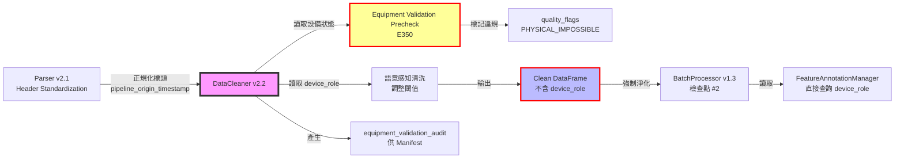

# PRD v2.2-Contract-Aligned: 資料清洗器實作指南 (DataCleaner Implementation Guide)
# 強制執行版：整合 Feature Annotation v1.2、Equipment Validation Sync 與 Interface Contract v1.1

**文件版本:** v2.2-Contract-Aligned (Interface Contract v1.1 Compliance & Equipment Validation Integration)  
**日期:** 2026-02-14  
**負責人:** Oscar Chang  
**目標模組:** `src/etl/cleaner.py` (v2.2+)  
**上游契約:** `src/etl/parser.py` (v2.1+, 輸出 UTC, Header Standardization)  
**下游契約:** `src/etl/batch_processor.py` (v1.3+, 檢查點 #2)  
**關鍵相依:** 
- `src/features/annotation_manager.py` (v1.2+, 提供 device_role 查詢)
- `src/equipment/equipment_validator.py` (v1.0+, 設備邏輯預檢，新增)
- `src/core/temporal_baseline.py` (PipelineContext, 時間基準)
**預估工時:** 7 ~ 8 個工程天（含設備邏輯預檢、強化時間同步、CI/CD Gate 配置）

---

## 1. 執行總綱與變更摘要

### 1.1 版本變更總覽 (v2.1 → v2.2-Contract-Aligned)

| 變更類別 | v2.1 狀態 | v2.2-Contract-Aligned 修正 | 影響層級 |
|:---|:---|:---|:---:|
| **Interface Contract 對齊** | 基礎契約檢查 | **完全對齊 v1.1 檢查點 #2**：新增設備邏輯預檢、時間基準強制同步 | 🔴 Critical |
| **Equipment Validation Sync** | 無 | **新增設備邏輯預檢機制**（E350），與 Optimization 限制條件保持一致 | 🔴 Critical |
| **Temporal Baseline** | 提及但未強制 | **強制使用** `pipeline_origin_timestamp` 進行未來資料檢查（E000, E102） | 🔴 Critical |
| **Header Standardization** | 無 | **對接 Parser v2.1**：接收已正規化標頭，驗證與 Annotation 匹配（E409） | 🟡 Medium |
| **輸出稽核軌跡** | 基礎 metadata | **新增** `equipment_validation_audit` 供 BatchProcessor 寫入 Manifest | 🟡 Medium |
| **SSOT 強化** | 引用 flags | **新增** `EQUIPMENT_VALIDATION_CONSTRAINTS` 引用，確保與 Optimization 邏輯一致 | 🔴 Critical |
| **職責分離** | 三層防護 | **維持**白名單+Schema淨化+CI Gate，確保 E500 絕不發生 | 🔴 Critical |

### 1.2 核心設計原則（Contract-Aligned 版）

1. **Gatekeeper (守門員)**: 髒數據絕不進入下游，**設備邏輯違規提前標記**（非等到 Optimization 才發現）
2. **SSOT 嚴格遵守**: 所有品質標記、單位定義、**設備限制條件**必須引用 `config_models.py`
3. **職責分離強制執行 (Mandatory Separation of Concerns)**:
   - **Cleaner 職責**：讀取 `device_role` 進行**語意感知清洗**與**設備邏輯預檢**，但**絕對禁止將 `device_role` 寫入輸出**
   - **強制機制**：透過 `ALLOWED_METADATA_KEYS` 白名單與 `FORBIDDEN_COLS` 自動清除，從技術層面杜絕誤寫入
   - **設備邏輯預檢**：在清洗階段檢查基礎設備邏輯（如主機開啟時水泵不可全關），標記違規資料供下游參考
4. **時間基準一致性**: 所有時間相關驗證（未來資料檢查）必須使用上游傳入的 `pipeline_origin_timestamp`，**禁止**使用 `datetime.now()`
5. **物理邏輯一致性**: 與 Optimization 共享 `EQUIPMENT_VALIDATION_CONSTRAINTS`，確保清洗階段與優化階段的設備邏輯一致

### 1.3 與 Interface Contract v1.1 的對齊關係



**關鍵約束（強制執行）**：
- 🔴 **Cleaner 不寫入 device_role**：輸出 DataFrame 的 schema 中**不得包含** `device_role` 欄位或 metadata
- 🔴 **時間基準強制使用**：未來資料檢查必須使用輸入的 `pipeline_origin_timestamp`，違反視為 E000 錯誤
- 🔴 **設備邏輯預檢**：若啟用 `enforce_equipment_validation_sync`，必須執行基礎設備邏輯檢查並記錄稽核軌跡
- 🟡 **標頭對應驗證**：接收 Parser 正規化後的標頭，驗證與 Annotation 中的 `column_name` 匹配（E409）

---

## 2. 介面契約規範 (Interface Contracts)

### 2.1 輸入契約 (Input Contract from Parser v2.1)

**對齊 Interface Contract v1.1 檢查點 #1 → #2 過渡**:

| 檢查項 | 規格 | 容錯處理 | 錯誤代碼 |
|:---|:---|:---|:---:|
| `timestamp` | `Datetime(time_unit='ns', time_zone='UTC')` | 若不符，嘗試轉換或拒絕 | E101 |
| `pipeline_origin_timestamp` | **必須存在於 metadata** (ISO 8601 UTC) | 遺失則拋出 E000 | **E000** |
| `quality_flags` | `List(Utf8)` (可選) | 若存在，驗證值 ⊆ `VALID_QUALITY_FLAGS` | E103 |
| 數值欄位 | `Float64` (SI 單位) | 單位轉換 (若配置 `unit_system=IMPERIAL`) | E104 |
| 編碼 | UTF-8，無 BOM | 發現 BOM → 截斷並記錄 Warning | E105 |
| **欄位存在性** | 所有欄位必須在 Annotation 中定義 | 未定義欄位依 `unannotated_column_policy` 處理 | **E402** |
| **標頭正規化** | 欄位名稱必須已為 snake_case (Parser 處理) | 若收到非正規化標頭，記錄警告 | **E105-W** |

**關鍵時間基準檢查**:
- **E000 (TEMPORAL_BASELINE_MISSING)**: 若輸入 metadata 不含 `pipeline_origin_timestamp`，立即終止流程
- **時間一致性**: 使用傳入的 `pipeline_origin_timestamp` 進行所有未來資料檢查，**禁止**呼叫 `datetime.now()`

### 2.2 輸出契約 (Output Contract to BatchProcessor v1.3)

**對齊 Interface Contract v1.1 檢查點 #2**:

```python
class CleanerOutputContract:
    """Cleaner v2.2-Contract-Aligned 輸出資料規範（強制執行版）"""
    
    # 1. 時間戳規範 (與 Parser v2.1 一致，直接透傳)
    timestamp: pl.Datetime(time_unit="ns", time_zone="UTC")
    
    # 2. 時間基準傳遞 (新增強制要求)
    temporal_baseline: Dict = {
        "pipeline_origin_timestamp": str,  # ISO 8601 UTC，與輸入相同
        "timezone": "UTC",
        "baseline_version": "1.0"
    }
    
    # 3. 品質標記 (核心變更：必須引用 SSOT)
    quality_flags: pl.List(pl.Utf8)  # 值必須 ∈ VALID_QUALITY_FLAGS
    # 可能新增：PHYSICAL_IMPOSSIBLE (設備邏輯違規), EQUIPMENT_VIOLATION
    
    # 4. 資料欄位 (SI 單位，無單位字元)
    data_columns: pl.Float64  # 所有感測器數值
    
    # 5. 時間軸完整性標記
    temporal_continuity: bool  # True=連續無缺漏, False=有缺漏已補Null
    
    # 6. Metadata (傳遞給 BatchProcessor 寫入 Manifest)
    # 【關鍵】不包含 device_role，僅包含物理類型與單位，且經過白名單強制過濾
    column_metadata: Dict[str, ColumnMeta]  # 僅限 ALLOWED_METADATA_KEYS 中的鍵
    
    # 7. 設備邏輯稽核軌跡 (新增，對齊 Interface Contract v1.1)
    equipment_validation_audit: Dict = {
        "validation_enabled": bool,
        "constraints_applied": List[str],  # 套用的限制條件 ID 列表
        "violations_detected": int,        # 違規筆數
        "violation_details": List[Dict]    # 違規詳情（時間點、設備、限制類型）
    }
```

| 驗證項目 | 規格 | 失敗代碼 | 嚴重度 |
|:---|:---|:---:|:---:|
| **時間基準傳遞** | 輸出 metadata 必須包含 `pipeline_origin_timestamp` | **E000** | Critical |
| **未來資料檢查** | 所有時間戳 ≤ `pipeline_origin_timestamp + 5min` | **E102** | High |
| **設備邏輯預檢** | 若啟用，必須檢查基礎設備邏輯並標記違規 | **E350** | High |
| **device_role 不存在** | DataFrame 與 metadata 皆不可含此欄位 | **E500** | Critical |
| **Metadata 純淨性** | 僅允許 `physical_type`, `unit`, `description` | **E500** | Critical |
| **Quality Flags 合法性** | 所有值必須 ∈ `VALID_QUALITY_FLAGS` | **E202** | Critical |

### 2.3 Feature Annotation 與 Equipment Validation 整合契約

| 項目 | 來源 | 使用方式 | 是否寫入輸出 |
|:---|:---|:---:|:---:|
| `physical_type` | `FeatureAnnotationManager` | 物理限制檢查、單位驗證 | ✅ 是（經白名單過濾後寫入 metadata） |
| `unit` | `FeatureAnnotationManager` | 單位轉換驗證 | ✅ 是（經白名單過濾後寫入 metadata） |
| `device_role` | `FeatureAnnotationManager` | **語意感知清洗策略調整**、**設備邏輯預檢條件判斷** | ❌ **否**（僅 runtime 使用，強制移除） |
| `ignore_warnings` | `FeatureAnnotationManager` | 決定是否標記特定 Warning | ❌ **否**（僅 runtime 使用，強制移除） |
| `is_target` | `FeatureAnnotationManager` | 跳過特定清洗（如 target 不標記 FROZEN） | ❌ **否**（僅 runtime 使用，強制移除） |
| **設備狀態欄位** | `physical_type == 'status'` | 設備邏輯預檢（如 chiller_1_status） | ✅ 是（作為資料欄位，非 metadata） |
| **設備限制條件** | `EQUIPMENT_VALIDATION_CONSTRAINTS` (SSOT) | 預檢邏輯判斷 | ❌ **否**（邏輯使用，不寫入輸出） |

---

## 3. 設備邏輯預檢規範 (Equipment Validation Precheck)

### 3.1 設計目標

為解決 **Physics Logic Decoupling** 風險（清洗時未檢測違規，優化時才發現不可行），DataCleaner 在清洗階段執行基礎設備邏輯預檢，提前標記違規資料。

**預檢範圍**:
- 僅檢查**基礎邏輯**（如主機開啟時水泵不可全關）
- 不檢查**複雜時序**（如最小運轉時間，由專門的 EquipmentValidator 處理）
- 標記為 `PHYSICAL_IMPOSSIBLE` 或 `EQUIPMENT_VIOLATION`，供 Optimization 參考

### 3.2 整合 SSOT 限制條件

```python
# 引用自 Interface Contract v1.1 / config_models.py
from src.etl.config_models import EQUIPMENT_VALIDATION_CONSTRAINTS

# Cleaner 內部使用的預檢規則（與 Optimization 共享 SSOT）
PRECHECK_CONSTRAINTS = {
    "chiller_pump_mutex": {
        "description": "主機開啟時必須有至少一台冷卻水泵運轉",
        "check_type": "requires",
        "trigger_status": ["chiller_1_status", "chiller_2_status"],  # 任一為 1 時觸發
        "required_status": ["pump_1_status", "pump_2_status"],       # 至少一個必須為 1
        "severity": "critical",  # 標記為 PHYSICAL_IMPOSSIBLE
    },
    "chiller_cooling_tower_mutex": {
        "description": "主機開啟時必須有至少一台冷卻水塔運轉",
        "check_type": "requires", 
        "trigger_status": ["chiller_1_status", "chiller_2_status"],
        "required_status": ["ct_1_status", "ct_2_status"],
        "severity": "critical",
    }
}
```

### 3.3 預檢執行流程

```python
def _apply_equipment_validation_precheck(self, df: pl.DataFrame) -> pl.DataFrame:
    """
    設備邏輯預檢（對齊 Interface Contract v1.1 檢查點 #2）
    
    執行時機：在 Semantic-Aware Cleaning 之後，輸出驗證之前
    邏輯：
    1. 識別設備狀態欄位（physical_type == 'status'）
    2. 檢查 PRECHECK_CONSTRAINTS 中的條件
    3. 違反時標記 quality_flags，並記錄至 equipment_validation_audit
    """
    if not self.config.enforce_equipment_validation_sync:
        self._equipment_validation_audit = {
            "validation_enabled": False,
            "constraints_applied": [],
            "violations_detected": 0,
            "violation_details": []
        }
        return df
    
    violations = []
    df_with_flags = df
    
    for constraint_id, constraint in PRECHECK_CONSTRAINTS.items():
        # 檢查觸發條件（是否有主機開啟）
        trigger_cols = [c for c in constraint["trigger_status"] if c in df.columns]
        if not trigger_cols:
            continue
            
        # 建立觸發遮罩（任一觸發欄位為 1）
        trigger_mask = pl.col(trigger_cols[0]) == 1
        for col in trigger_cols[1:]:
            trigger_mask = trigger_mask | (pl.col(col) == 1)
        
        # 檢查需求條件（是否至少一台水泵運轉）
        required_cols = [c for c in constraint["required_status"] if c in df.columns]
        if not required_cols:
            continue
            
        requirement_mask = pl.col(required_cols[0]) == 1
        for col in required_cols[1:]:
            requirement_mask = requirement_mask | (pl.col(col) == 1)
        
        # 違規：觸發但需求不滿足
        violation_mask = trigger_mask & ~requirement_mask
        
        # 統計違規
        violation_count = df.filter(violation_mask).height
        if violation_count > 0:
            violations.append({
                "constraint_id": constraint_id,
                "description": constraint["description"],
                "count": violation_count,
                "severity": constraint["severity"]
            })
            
            # 標記 Quality Flag
            flag = "PHYSICAL_IMPOSSIBLE" if constraint["severity"] == "critical" else "EQUIPMENT_VIOLATION"
            df_with_flags = df_with_flags.with_columns(
                pl.when(violation_mask).then(
                    pl.col("quality_flags").list.concat(pl.lit([flag]))
                ).otherwise(pl.col("quality_flags")).alias("quality_flags")
            )
    
    # 記錄稽核軌跡（供 BatchProcessor 寫入 Manifest）
    self._equipment_validation_audit = {
        "validation_enabled": True,
        "constraints_applied": list(PRECHECK_CONSTRAINTS.keys()),
        "violations_detected": sum(v["count"] for v in violations),
        "violation_details": violations
    }
    
    if violations:
        self.logger.warning(
            f"設備邏輯預檢發現 {len(violations)} 項違規: "
            f"{[v['constraint_id'] for v in violations]}"
        )
    
    return df_with_flags
```

---

## 4. 分階段實作計畫 (Phase-Based Implementation)

### Phase 0: Annotation 整合與時間基準基礎建設 (Day 1)

#### Step 0.1: 建構子與 Temporal Context 注入

**檔案**: `src/etl/cleaner.py` (頂部與 `__init__`)

**實作內容**:
```python
from typing import Final, Dict, List, Optional, Tuple, Set, Any
import polars as pl
import numpy as np
from datetime import datetime, timedelta, timezone
from pydantic import BaseModel, validator

# 【關鍵】SSOT 嚴格引用（對齊 Interface Contract v1.1）
from src.etl.config_models import (
    VALID_QUALITY_FLAGS,      # SSOT: 品質標記
    TIMESTAMP_CONFIG,         # SSOT: 時間戳規格 (UTC, ns)
    FEATURE_ANNOTATION_CONSTANTS,  # SSOT: Annotation 版本
    EQUIPMENT_VALIDATION_CONSTRAINTS,  # 【新增】SSOT: 設備限制條件
    CleanerConfig,
)

# 【新增】Temporal Baseline 整合
from src.core.temporal_baseline import TemporalContext, get_temporal_context

# 【新增】Feature Annotation 與 Equipment Validation 整合
from src.features.annotation_manager import FeatureAnnotationManager, ColumnAnnotation
from src.equipment.equipment_validator import EquipmentValidator  # 【新增】

from src.exceptions import (
    ConfigurationError, ContractViolationError, DataValidationError,
    TemporalBaselineError  # 【新增】
)

class DataCleaner:
    """
    DataCleaner v2.2-Contract-Aligned
    - 整合 Feature Annotation v1.2（語意感知清洗）
    - 整合 Equipment Validation Sync（設備邏輯預檢）
    - 強制執行 Temporal Baseline（時間基準一致性）
    - 職責分離強制執行（三層防護）
    """
    
    # 【強制執行】類別層級常數定義（維持不變）
    ALLOWED_METADATA_KEYS: Final[Set[str]] = frozenset({
        'physical_type', 'unit', 'description', 'column_name'
    })
    
    FORBIDDEN_COLS: Final[Set[str]] = frozenset({
        'device_role', 'ignore_warnings', 'is_target', 'role', 
        'device_type', 'annotation_role', 'col_role', 'feature_role'
    })
    
    DEVICE_ROLE_THRESHOLDS: Final[Dict[str, Dict]] = {
        "primary": {"frozen_multiplier": 1.0, "zero_ratio_warning": 0.1},
        "backup": {"frozen_multiplier": 3.0, "zero_ratio_warning": 0.8},
        "seasonal": {"frozen_multiplier": 2.0, "zero_ratio_warning": 0.5}
    }
    
    def __init__(
        self, 
        config: CleanerConfig,
        annotation_manager: Optional[FeatureAnnotationManager] = None,
        temporal_context: Optional[TemporalContext] = None,  # 【新增】
        equipment_validator: Optional[EquipmentValidator] = None  # 【新增】
    ):
        """
        Args:
            config: 清洗配置
            annotation_manager: 特徵標註管理器
            temporal_context: 時間基準上下文（強制使用，禁止自行產生時間戳）
            equipment_validator: 設備驗證器（用於預檢）
        """
        self.config = config
        self.annotation = annotation_manager
        self.equipment_validator = equipment_validator  # 【新增】
        self.logger = get_logger("DataCleaner")
        
        # 【新增】時間基準強制檢查（對齊 Interface Contract v1.1 E000）
        if temporal_context is None:
            raise TemporalBaselineError(
                "E000: DataCleaner 必須接收 TemporalContext，禁止自行產生時間戳。 "
                "請確保 Container 正確傳遞 pipeline_origin_timestamp。"
            )
        self.temporal_context = temporal_context
        self.pipeline_origin_timestamp = temporal_context.get_baseline()
        
        # 驗證：若啟用設備邏輯預檢，建議提供 EquipmentValidator
        if config.enforce_equipment_validation_sync and equipment_validator is None:
            self.logger.warning(
                "啟用設備邏輯預檢但未提供 EquipmentValidator，將使用內建預檢邏輯"
            )
        
        self.logger.info(
            f"初始化 DataCleaner (SSOT Flags: {len(VALID_QUALITY_FLAGS)}, "
            f"Temporal Baseline: {self.pipeline_origin_timestamp.isoformat()}, "
            f"Equipment Validation: {config.enforce_equipment_validation_sync})"
        )
```

#### Step 0.2: 未定義欄位與標頭驗證 (E402, E409)

```python
def _validate_columns_annotated(self, df: pl.DataFrame) -> pl.DataFrame:
    """
    驗證所有欄位已在 Annotation 中定義 (E402)
    並驗證標頭已正規化（對齊 Interface Contract v1.1 Header Standardization）
    """
    if not self.annotation or not self.config.use_device_role_from_annotation:
        return df
    
    unannotated = []
    non_standardized = []  # 【新增】檢查非正規化標頭
    
    for col in df.columns:
        if col == "timestamp":
            continue
        
        # E402 檢查：欄位是否已定義於 Annotation
        if not self.annotation.is_column_annotated(col):
            unannotated.append(col)
        else:
            # 【新增】E409 檢查：驗證標頭為 snake_case（防範 Parser 未正確正規化）
            if not self._is_snake_case(col):
                non_standardized.append(col)
    
    # 處理未定義欄位
    if unannotated:
        policy = self.config.unannotated_column_policy
        if policy == "error":
            raise DataValidationError(
                f"E402: 以下欄位未定義於 Feature Annotation: {unannotated}"
            )
        elif policy == "skip":
            self.logger.warning(f"E402 (Skip): 跳過未定義欄位: {unannotated}")
            self._skipped_columns = set(unannotated)
        elif policy == "warn":
            self.logger.warning(f"E402 (Warn): 未定義欄位使用保守預設: {unannotated}")
    
    # 【新增】處理非正規化標頭（警告層級，不阻擋流程）
    if non_standardized:
        self.logger.warning(
            f"E409-Warning: 以下欄位未使用 snake_case，可能未經 Parser 正規化: {non_standardized}"
        )
    
    return df

def _is_snake_case(self, s: str) -> bool:
    """檢查字串是否符合 snake_case 規範"""
    import re
    return bool(re.match(r'^[a-z][a-z0-9_]*$', s))
```

---

### Phase 1: 時間標準化與基準一致性 (Day 2)

#### Step 1.1: 時間戳標準化（強化 Temporal Baseline）

```python
def _normalize_timestamp(self, df: pl.DataFrame) -> pl.DataFrame:
    """
    Step 1: 時間戳標準化 (E101 處理)
    
    【關鍵變更】：不再呼叫 datetime.now()，所有時間檢查使用 self.pipeline_origin_timestamp
    """
    if "timestamp" not in df.columns:
        raise DataValidationError("輸入資料缺少必要欄位 'timestamp'")
    
    ts_col = df["timestamp"]
    
    # 檢查類型
    if not isinstance(ts_col.dtype, pl.Datetime):
        raise DataValidationError(f"timestamp 欄位類型錯誤: {ts_col.dtype}")
    
    # 時區處理（維持不變）
    current_tz = ts_col.dtype.time_zone
    if current_tz is None:
        self.logger.warning("timestamp 無時區資訊，假設為 UTC")
        df = df.with_columns(
            pl.col("timestamp").dt.replace_time_zone("UTC").alias("timestamp")
        )
    elif current_tz != "UTC":
        self.logger.warning(f"E101: 偵測到非 UTC 時區 {current_tz}，自動轉換")
        df = df.with_columns(
            pl.col("timestamp").dt.convert_time_zone("UTC").alias("timestamp")
        )
    
    # 確保精度為 nanosecond
    if ts_col.dtype.time_unit != "ns":
        df = df.with_columns(
            pl.col("timestamp").cast(pl.Datetime(time_unit="ns", time_zone="UTC"))
        )
    
    return df
```

#### Step 1.2: 未來資料檢查（強制使用 Temporal Baseline）

```python
def _check_future_data(self, df: pl.DataFrame) -> None:
    """
    Step 2: 未來資料檢查 (E102)
    
    【關鍵變更】：使用 self.pipeline_origin_timestamp 而非 datetime.now()
    對齊 Interface Contract v1.1 要求，防止時間漂移
    """
    # 【強制】使用傳入的時間基準，禁止動態取得時間
    threshold = self.pipeline_origin_timestamp + timedelta(minutes=5)
    
    future_mask = df["timestamp"] > threshold
    future_count = future_mask.sum()
    
    if future_count > 0:
        future_samples = df.filter(future_mask)["timestamp"].head(3).to_list()
        raise DataValidationError(
            f"E102: 偵測到 {future_count} 筆未來資料（>{threshold.isoformat()}）。"
            f"樣本: {future_samples}。 "
            f"Pipeline 時間基準: {self.pipeline_origin_timestamp.isoformat()}。 "
            f"請檢查資料來源時鐘或時間基準傳遞。"
        )
    
    self.logger.debug(f"未來資料檢查通過（基準: {self.pipeline_origin_timestamp.isoformat()}）")
```

---

### Phase 2: 語意感知清洗與設備邏輯預檢 (Day 3-4)

#### Step 2.1: 語意感知清洗（維持並強化）

```python
def _semantic_aware_cleaning(self, df: pl.DataFrame) -> pl.DataFrame:
    """
    語意感知清洗主流程（讀取 device_role，但絕不寫入輸出）
    
    維持 v2.2 原有邏輯：
    - 凍結資料偵測（角色感知閾值）
    - 零值比例檢查（角色感知警告抑制）
    - 物理限制檢查
    """
    if not self.annotation:
        self.logger.debug("未啟用 Annotation 整合，跳過語意感知清洗")
        return df
    
    self.logger.info("啟動語意感知清洗（device_role 感知，輸出隔離）...")
    
    # 1. 凍結資料偵測（角色感知閾值）
    df = self._detect_frozen_data_semantic(df)
    
    # 2. 零值比例檢查（角色感知警告抑制）
    df = self._check_zero_ratio_semantic(df)
    
    # 3. 物理限制檢查
    df = self._apply_physical_constraints_semantic(df)
    
    return df
```

#### Step 2.2: 設備邏輯預檢（新增核心功能）

```python
def _apply_equipment_validation_precheck(self, df: pl.DataFrame) -> pl.DataFrame:
    """
    【新增】設備邏輯預檢（對齊 Interface Contract v1.1 檢查點 #2）
    
    在語意感知清洗後執行，檢查基礎設備邏輯違規：
    - 主機開啟時水泵不可全關（chiller_pump_mutex）
    - 主機開啟時冷卻水塔不可全關（chiller_cooling_tower_mutex）
    
    違規資料標記為 PHYSICAL_IMPOSSIBLE 或 EQUIPMENT_VIOLATION
    """
    if not self.config.enforce_equipment_validation_sync:
        self._equipment_validation_audit = {
            "validation_enabled": False,
            "constraints_applied": [],
            "violations_detected": 0,
            "violation_details": []
        }
        return df
    
    self.logger.info("執行設備邏輯預檢（Equipment Validation Precheck）...")
    
    violations = []
    df_result = df
    
    # 從 SSOT 載入預檢規則（與 Optimization 共用）
    from src.etl.config_models import EQUIPMENT_VALIDATION_CONSTRAINTS
    
    for constraint_id, constraint in EQUIPMENT_VALIDATION_CONSTRAINTS.items():
        # 只處理預檢類型（precheck）
        if constraint.get("check_phase") != "precheck":
            continue
            
        # 檢查必要欄位是否存在
        trigger_cols = [c for c in constraint.get("trigger_status", []) if c in df.columns]
        required_cols = [c for c in constraint.get("required_status", []) if c in df.columns]
        
        if not trigger_cols or not required_cols:
            continue
        
        # 建立邏輯條件（Polars 表達式）
        trigger_condition = pl.col(trigger_cols[0]) == 1
        for col in trigger_cols[1:]:
            trigger_condition = trigger_condition | (pl.col(col) == 1)
        
        required_condition = pl.col(required_cols[0]) == 1
        for col in required_cols[1:]:
            required_condition = required_condition | (pl.col(col) == 1)
        
        # 違規條件：觸發但需求不滿足
        violation_condition = trigger_condition & ~required_condition
        
        # 計算違規數
        violation_count = df.filter(violation_condition).height
        
        if violation_count > 0:
            severity = constraint.get("severity", "warning")
            flag = "PHYSICAL_IMPOSSIBLE" if severity == "critical" else "EQUIPMENT_VIOLATION"
            
            violations.append({
                "constraint_id": constraint_id,
                "description": constraint.get("description", ""),
                "count": violation_count,
                "severity": severity,
                "timestamp": datetime.now(timezone.utc).isoformat()
            })
            
            # 標記 Quality Flag
            df_result = df_result.with_columns(
                pl.when(violation_condition).then(
                    pl.col("quality_flags").list.concat(pl.lit([flag]))
                ).otherwise(pl.col("quality_flags")).alias("quality_flags")
            )
            
            self.logger.warning(
                f"E350: 設備邏輯違規 '{constraint_id}' 發生 {violation_count} 筆，"
                f"標記為 {flag}"
            )
    
    # 記錄稽核軌跡（供 BatchProcessor 寫入 Manifest）
    self._equipment_validation_audit = {
        "validation_enabled": True,
        "constraints_applied": list(EQUIPMENT_VALIDATION_CONSTRAINTS.keys()),
        "violations_detected": sum(v["count"] for v in violations),
        "violation_details": violations,
        "precheck_timestamp": datetime.now(timezone.utc).isoformat()
    }
    
    return df_result
```

---

### Phase 3: 重採樣與輸出契約強制執行 (Day 5)

#### Step 3.1: 重採樣（維持不變）

```python
def _resample_and_fill(self, df: pl.DataFrame) -> pl.DataFrame:
    """Step 3: 重採樣與缺漏處理（維持 v2.2 原有邏輯）"""
    # ... 原有實作 ...
    return df
```

#### Step 3.2: Metadata 強制淨化（更新包含 Equipment Audit）

```python
def _build_column_metadata(self, df: pl.DataFrame) -> Tuple[Dict[str, Dict], Dict]:
    """
    Step 7: 建構欄位元資料與設備稽核軌跡
    
    Returns:
        (column_metadata, equipment_validation_audit)
    """
    metadata: Dict[str, Dict[str, Any]] = {}
    
    for col in df.columns:
        if col == "timestamp":
            continue
        
        raw_meta = self._extract_raw_metadata(col)
        sanitized_meta = self._sanitize_metadata_dict(raw_meta, col)
        metadata[col] = sanitized_meta
    
    # 取得設備邏輯稽核軌跡（由 Step 2.2 產生）
    audit = getattr(self, '_equipment_validation_audit', {
        "validation_enabled": False,
        "constraints_applied": [],
        "violations_detected": 0,
        "violation_details": []
    })
    
    return metadata, audit
```

#### Step 3.3: Schema 強制淨化與時間基準傳遞

```python
def _validate_output_contract(self, df: pl.DataFrame) -> pl.DataFrame:
    """
    Step 6: 最終輸出驗證與強制淨化 (Interface Contract Enforcement)
    
    【更新】：
    1. 驗證時間基準傳遞（E000）
    2. 驗證未來資料防護（E102）
    3. 強制執行 Schema 淨化（移除 FORBIDDEN_COLS）
    4. 驗證 device_role 不存在（E500）
    """
    errors = []
    
    # 1. 時間戳檢查
    if "timestamp" not in df.columns:
        errors.append("缺少必要欄位 'timestamp'")
    
    # 2. 【關鍵】時間基準傳遞檢查
    if not hasattr(self, 'pipeline_origin_timestamp'):
        errors.append("E000: 遺失 pipeline_origin_timestamp，無法傳遞時間基準")
    
    # 3. quality_flags 檢查
    if "quality_flags" not in df.columns:
        errors.append("缺少必要欄位 'quality_flags'")
    
    # 4. 【強制執行】Schema 淨化
    df = self._enforce_schema_sanitization(df)
    
    # 5. 【強制執行】device_role 不存在檢查（E500）
    for forbidden_col in self.FORBIDDEN_COLS:
        if forbidden_col in df.columns:
            errors.append(f"E500: 輸出包含禁止欄位 '{forbidden_col}'")
    
    # 6. 未來資料二次確認（使用 Temporal Baseline）
    if hasattr(self, 'pipeline_origin_timestamp'):
        threshold = self.pipeline_origin_timestamp + timedelta(minutes=5)
        if (df["timestamp"] > threshold).any():
            errors.append("E102: 輸出仍包含未來資料（時序防護失效）")
    
    if errors:
        raise ContractViolationError(f"Cleaner 輸出契約驗證失敗: {errors}")
    
    return df
```

---

## 5. 完整方法呼叫鏈 (Call Chain - Updated)

```
clean(df: pl.DataFrame, input_metadata: Dict) -> Tuple[pl.DataFrame, Dict, Dict]
  ├── _validate_temporal_baseline(input_metadata)      # 【新增】E000 檢查
  ├── _validate_columns_annotated(df)                  # Step 0: E402, E409 檢查
  ├── _normalize_timestamp(df)                         # Step 1: 時區標準化 (UTC)
  ├── _check_future_data(df)                           # Step 2: 未來資料檢查 (E102)
  │   └── 使用 self.pipeline_origin_timestamp（非 now()）
  ├── _semantic_aware_cleaning(df)                     # Step 3: 語意感知清洗
  │   ├── _detect_frozen_data_semantic()               # 角色感知閾值
  │   ├── _check_zero_ratio_semantic()                 # 抑制警告
  │   └── _apply_physical_constraints_semantic()       # 物理限制
  ├── _apply_equipment_validation_precheck(df)         # 【新增】Step 3.5: 設備邏輯預檢 (E350)
  │   └── 產生 self._equipment_validation_audit
  ├── _resample_and_fill(df)                           # Step 4: 重採樣
  ├── _validate_quality_flags(df)                      # Step 5: Flags 合法性 (E103)
  ├── _validate_output_contract(df)                    # Step 6: 強制執行 Schema淨化
  │   └── _enforce_schema_sanitization()               # 移除 FORBIDDEN_COLS
  ├── _build_column_metadata(df)                       # Step 7: 白名單過濾 + Audit
  │   ├── _sanitize_metadata_dict()                    # 移除非白名單鍵
  │   └── 回傳 (metadata, equipment_validation_audit)
  └── return (clean_df, metadata, equipment_validation_audit)
```

---

## 6. 錯誤代碼對照表 (Error Codes - Updated)

| 錯誤代碼 | 名稱 | 發生階段 | 說明 | 處理建議 | 嚴重度 |
|:---|:---|:---:|:---|:---|:---:|
| **E000** | `TEMPORAL_BASELINE_MISSING` | Step 0 | 未接收 pipeline_origin_timestamp | 檢查 Container 傳遞邏輯 | 🔴 Critical |
| **E101** | `TIMEZONE_MISMATCH` | Step 1 | 時區非 UTC | 確認 Parser 版本 | 🟡 Medium |
| **E102** | `FUTURE_DATA_DETECTED` | Step 2 | 資料時間超過基準+5分鐘 | 檢查資料來源時鐘 | 🔴 Critical |
| **E103** | `UNKNOWN_QUALITY_FLAG` | Step 5 | 非法品質標記 | 同步 SSOT | 🔴 Critical |
| **E105** | `HEADER_NON_STANDARDIZED` | Step 0 | 標頭未正規化（警告） | 確認 Parser 設定 | 🟢 Low |
| **E402** | `UNANNOTATED_COLUMN` | Step 0 | 欄位未定義於 Annotation | 執行 features wizard | 🔴 Critical |
| **E409** | `HEADER_ANNOTATION_MISMATCH` | Step 0 | 標頭與 Annotation 不匹配 | 檢查 Excel 標註 | 🟡 Medium |
| **E350** | `EQUIPMENT_LOGIC_PRECHECK_FAILED` | Step 3.5 | 設備邏輯預檢發現違規 | 檢查設備狀態資料 | 🟡 Medium |
| **E500** | `DEVICE_ROLE_LEAKAGE` | Step 6 | 輸出包含 device_role | 檢查職責分離邏輯 | 🔴 Critical |
| **E501** | `METADATA_WHITELIST_VIOLATION` | Step 7 | Metadata 包含禁止鍵 | 檢查白名單機制 | 🔴 Critical |

---

## 7. 測試與驗證計畫 (Test Plan - Updated)

### 7.1 單元測試 (Unit Tests)

| 測試案例 ID | 描述 | 輸入 | 預期結果 | CI/CD 屬性 |
|:---|:---|:---|:---|:---:|
| C22-TB-01 | 時間基準遺失 | 無 temporal_context | 拋出 E000 | 🔴 Blocker |
| C22-TB-02 | 未來資料檢查（使用基準） | 資料時間 > 基準+5min | 拋出 E102 | 🔴 Blocker |
| C22-TB-03 | 長時間執行漂移檢測 | 模擬基準時間過舊 | 記錄警告 | 🟡 Standard |
| **C22-EV-01** | 設備邏輯預檢通過 | 主機開+水泵開 | 無違規標記 | 🔴 Blocker |
| **C22-EV-02** | 設備邏輯違規檢測 | 主機開+水泵全關 | 標記 PHYSICAL_IMPOSSIBLE | 🔴 Blocker |
| **C22-EV-03** | 設備稽核軌跡產生 | 啟用預檢 | Audit 結構正確 | 🔴 Blocker |
| C22-FA-05 | 職責分離 Gate Test | 輸出含 device_role | 拋出 E500 | 🔴 Blocker |
| C22-FA-06 | Metadata Gate Test | 輸出含禁止鍵 | 自動移除並警告 | 🔴 Blocker |

### 7.2 整合測試 (Integration Tests)

| 測試案例 ID | 描述 | 上游 | 下游 | 驗證目標 |
|:---|:---|:---:|:---:|:---|
| **INT-C-EV-01** | 設備邏輯同步流程 | Cleaner (啟用預檢) | BatchProcessor | Manifest 包含 equipment_validation_audit |
| **INT-C-EV-02** | 與 Optimization 限制一致性 | Cleaner 預檢邏輯 | Optimization 限制 | 兩者使用相同 SSOT 限制條件 |
| INT-C-TB-01 | 時間基準傳遞 | Parser (帶基準) | Cleaner | 正確接收並傳遞，無 now() 呼叫 |
| INT-C-TB-02 | 跨日執行時間一致性 | 模擬跨日資料 | Cleaner | 使用固定基準，無跨日錯誤 |

---

## 8. 風險評估與緩解 (Risk Assessment - Updated)

| 風險 | 嚴重度 | 可能性 | 緩解措施 | 狀態 |
|:---|:---:|:---:|:---|:---:|
| **時間漂移** (使用 now() 而非基準) | 🔴 High | Medium | 建構子強制檢查 temporal_context，違反拋 E000 | 已強化 |
| **設備邏輯脫鉤** (清洗與優化不一致) | 🔴 High | Medium | 共用 EQUIPMENT_VALIDATION_CONSTRAINTS (SSOT) | 已新增 |
| **職責邊界混淆** | 🔴 High | Medium | 三層防護：白名單+Schema淨化+CI Gate | 維持 |
| **標頭不匹配** (Parser-Cleaner-Annotation) | 🟡 Medium | Medium | E409 檢查，驗證 snake_case 與 Annotation 匹配 | 已新增 |

---

## 9. 交付物清單 (Deliverables - Updated)

### 9.1 程式碼檔案
1. `src/etl/cleaner.py` - 主要實作 (v2.2-Contract-Aligned)
2. `src/etl/config_models.py` - 擴充（新增 `EQUIPMENT_VALIDATION_CONSTRAINTS`）
3. `src/core/temporal_baseline.py` - 時間基準類別（若尚未存在）

### 9.2 測試檔案
4. `tests/test_cleaner_v22_contract_aligned.py` - 主要測試（含時間基準、設備預檢）
5. `tests/test_cleaner_equipment_validation.py` - 【新增】設備邏輯預檢測試
6. `tests/test_cleaner_temporal_baseline.py` - 【新增】時間基準一致性測試

### 9.3 文件檔案
7. `docs/cleaner/PRD_CLEANER_v2.2-Contract-Aligned.md` - 本文件
8. `docs/cleaner/MIGRATION_v22_to_Contract_Aligned.md` - 升級指引

---

## 10. 驗收簽核 (Sign-off Checklist - Updated)

- [ ] **時間基準強制使用 (E000)**：未接收 temporal_context 時正確拋出 E000
- [ ] **未來資料檢查 (E102)**：使用 pipeline_origin_timestamp 而非 now()，跨日執行測試通過
- [ ] **設備邏輯預檢 (E350)**：正確檢測主機開啟時水泵全關等違規，標記 PHYSICAL_IMPOSSIBLE
- [ ] **設備稽核軌跡**：輸出包含 equipment_validation_audit 結構，供 BatchProcessor 寫入 Manifest
- [ ] **SSOT 一致性**：與 Optimization 共用 EQUIPMENT_VALIDATION_CONSTRAINTS，邏輯一致
- [ ] **職責分離 (E500)**：輸出絕對不含 device_role，三層防護機制運作正常
- [ ] **標頭對應 (E409)**：驗證 Parser 正規化後的標頭與 Annotation 匹配
- [ ] **Interface Contract v1.1 對齊**：檢查點 #2 所有項目通過驗證

---

**重要提醒**：本版本已將 **Temporal Baseline** 與 **Equipment Validation Sync** 提升為強制要求，與 Interface Contract v1.1 完全對齊。任何時間相關檢查必須使用傳入的時間基準，禁止動態取得系統時間。

**文件結束**
```