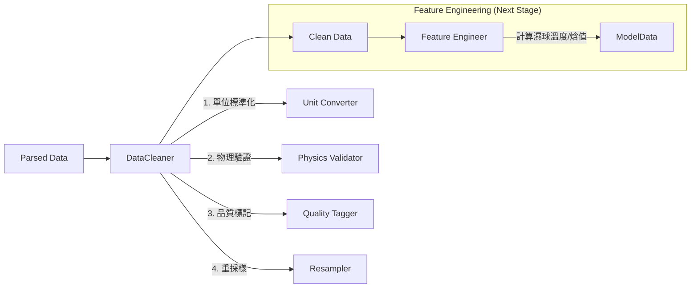

# PRD：資料清洗器強健性重構 (DataCleaner Robustness Refactoring)

**文件版本:** v1.0
**日期:** 2026-02-12
**負責人:** Oscar Chang
**目標模組:** [src/etl/cleaner.py](file:///d:/12.任務/HVAC-1/src/etl/cleaner.py)
**預估工時:** 3 ~ 4 個工程天

---

## 1. 背景與問題陳述

經過程式碼審查與架構評估，現有的 `DataCleaner` 模組存在核心架構缺陷，無法滿足多案場部署與高精度物理驗證的需求。主要問題如下：

| 編號 | 問題分類 | 嚴重程度 | 影響描述 |
|:---:|:---|:---:|:---|
| **C1** | **單位依賴 (Unit Dependency)** | **Critical** | 熱平衡驗證公式寫死為英制 (`GPM` / `°F` / `RT`)，導致公制案場資料被誤判為異常並遭到錯誤刪除。 |
| **C2** | **邏輯脆弱 (Fragile Logic)** | **High** | 重採樣聚合邏輯依賴欄位名稱後綴 (如 `_KWH`)，若命名不符慣例，計數器資料將被錯誤平均。 |
| **C3** | **基準線謬誤** | **High** | 親和律驗證以「當前資料中位數」為基準，若資料集整體異常，驗證機制將會失效（循環論證）。 |
| **C4** | **職責不清** | **Medium** | 混雜了「資料清洗」與「特徵工程」（如濕球溫度計算），違反單一職責原則。 |
| **C5** | **缺乏配置** | **Medium** | 物理閾值（COP範圍、穩定態判定窗口）皆為硬編碼，無法針對不同案場微調。 |

---

## 2. 重構目標與範圍

### 核心目標
將 `DataCleaner` 轉型為 **單元感知 (Unit-Aware)**、**配置驅動 (Config-Driven)** 且 **職責單一** 的物理清洗引擎。

### 範圍界定 (In-Scope vs Out-of-Scope)

| 範圍 | 包含項目 (In-Scope) | 排除項目 (Out-of-Scope) |
|:---|:---|:---|
| **職責** | 物理邊界檢查 (Physical Constraints) 異常值偵測與過濾 資料重採樣 (Resampling) 單位標準化 (SI制轉換) | **特徵工程** (如：濕球溫度計算、滾動平均、Lag特徵) 模型訓練資料生成 |
| **輸入** | 原始 Polars DataFrame 全域配置 (Settings) | 機器學習模型權重 |
| **輸出** | 清洗後的 DataFrame (Clean Data) 資料品質報告 (Quality Report) | 預測結果 |

---

## 3. 系統架構設計

### 3.1 職責分層

### 3.2 配置整合策略

不建立獨立的設定檔，而是擴充現有的 `config/settings.yaml` 與 `config/feature_mapping.py`。

- **`settings.yaml`**: 定義全域物理常數 (如水的比熱) 與預設閾值。
- **`feature_mapping.py`**: 為每個欄位定義「物理意義 (Physical Type)」、「單位 (Unit)」與「聚合方法 (Agg Method)」。

---

## 4. 分階段實作計畫

### Phase 1: 基礎架構重整 (Infrastructure)

#### Task 1.1 — 定義清洗配置介面
- **目標**: 解除硬編碼，讓清洗邏輯可配置。
- **實作**:
  - 在 `src/etl/cleaner.py` 中定義 `CleanerConfig` (Pydantic)。
  - 支援從 `settings.yaml` 載入設定。
  - 支援從 `feature_mapping` 讀取欄位屬性。

#### Task 1.2 — 實作通用重採樣引擎 (Generic Resampler)
- **目標**: 解決 C2 問題，不再依賴欄位名稱猜測。
- **邏輯**:
  - 優先讀取 `feature_mapping` 中的 `agg_method` (sum/max/mean/last)。
  - 若未定義，則依據 `dtype` 採用安全預設值 (數值->mean, 字串->first)。
  - 移除所有 `if col.endswith("KWH")` 類型的脆弱邏輯。

### Phase 2: 單元感知的物理核心 (Physics Core)

#### Task 2.1 — 實作單位標準化轉換層
- **目標**: 解決 C1 問題，確保所有計算基於統一的物理基礎。
- **邏輯**:
  - 在計算前，根據配置將與流量、溫度、壓力相關的欄位暫時轉換為 SI 制 (LPM, °C, kW)。
  - 支援單位：`GPM/LPM`, `C/F`, `RT/kW/BTU`。

#### Task 2.2 — 重構熱平衡驗證 (Heat Balance)
- **目標**: 精確的物理驗證。
- **公式**: $Q (kW) = Flow (LPM) \times \Delta T (°C) \times C_p \times \rho / 60$
- **輸入**: 支援指定實際欄位名稱 (從 feature mapping 取得)。
- **輸出**: 產生 `heat_balance_error_pct` 欄位，而非直接刪除。

#### Task 2.3 — 重構親和律驗證 (Affinity Laws)
- **目標**: 解決 C3 循環論證問題。
- **改進**:
  - 移除「中位數基準」。
  - 引入「額定規格 (Design Specs)」作為基準 (需在 Config 中加入設備規格)。
  - 驗證公式：$kW_{act} / kW_{design} \approx (Hz_{act} / 60)^3$。

### Phase 3: 資料品質治理 (Quality Governance)

#### Task 3.1 — 實作無副作用標記 (Non-destructive Tagging)
- **目標**: 保留原始資料完整性，僅標記異常。
- **實作**:
  - 新增 `quality_flags` 欄位 (List[str])。
  - 標記類型：`FROZEN`, `HEAT_IMBALANCE`, `AFFINITY_VIOLATION`, `OUTLIBER`。
  - 提供 `filter_strategy` 參數：決定最後輸出時是 `DROP` (刪除) 還是 `KEEP` (保留但標記)。

#### Task 3.2 — 移出特徵工程邏輯
- **動作**:
  - 將 `calculate_wet_bulb_temp` 從 `cleaner.py` 移除。
  - (註：需同步建立 `src/etl/feature_engineer.py` 存放此邏輯，或暫存於 utils)。

---

## 5. 驗證與測試計畫

### 5.1 單元測試 (Unit Tests)
- **Test Metric System**: 餵入公制資料 (LPM, °C)，驗證熱平衡檢查是否通過。
- **Test Imperial System**: 餵入英制資料 (GPM, °F)，驗證熱平衡檢查是否通過。
- **Test Resampling**: 驗證累積值欄位 (KWH) 是否正確使用 `last` 或 `max` 聚合。
- **Test Quality Flags**: 驗證異常資料是否正確被標記且未被誤刪 (當策略為 KEEP 時)。

### 5.2 整合驗證 (Integration Check)
- 使用 `data/CGMH-TY` (實際案場資料) 執行清洗流程。
- 確認產出的資料筆數合理 (不應因錯誤驗證而變成 0 筆)。
- 確認日誌中包含詳細的品質摘要 (Quality Summary)。

---

## 6. 風險評估

| 風險 | 緩解措施 |
|:---|:---|
| 現有 feature_mapping 缺少單位資訊 | 在 `settings.yaml` 提供全域預設單位，Phase 1 後盡快補齊 mapping 資訊。 |
| 設備額定規格 (Design Spec) 缺失 | `validate_affinity_laws` 若無規格參數，則降級為僅檢查趨勢或跳過此檢查。 |
| 既有模型使用舊 logic 訓練 | 提供 `LegacyCleaner` 模式或版本切換，確保過渡期模型可用。 |

---

## 7. 交付產物

1. `src/etl/cleaner.py`: 重構後的程式碼。
2. `tests/test_cleaner.py`: 涵蓋公/英制與邊界條件的測試。
3. `config/settings.yaml`: 更新後的配置檔範本。
