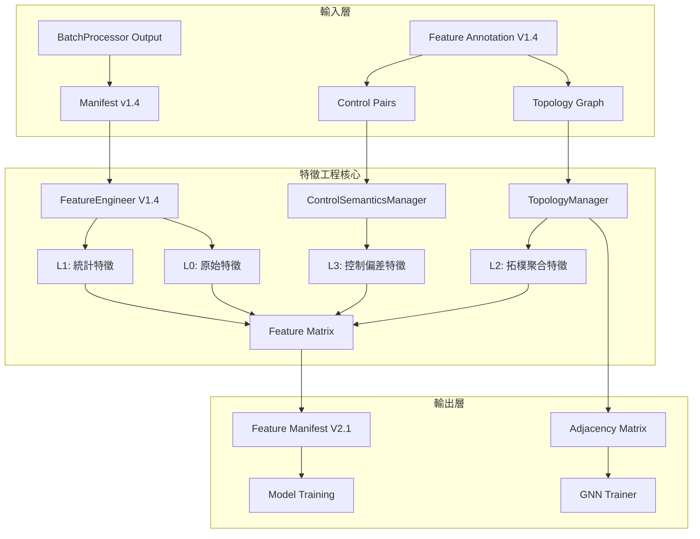

# PRD v1.4: 特徵工程拓樸感知與控制語意實作指南
# (Feature Engineering with Topology Awareness & Control Semantics)

**文件版本:** v1.4-TA (Topology Aggregation & Control Deviation Features)  
**日期:** 2026-02-26  
**負責人:** Oscar Chang / HVAC 系統工程團隊  
**目標模組:** `src/etl/feature_engineer.py` (v1.4+)  
**上游契約:** 
- `src/etl/batch_processor.py` (v1.4+, 檢查點 #3)
- `src/features/annotation_manager.py` (v1.4+, 提供 topology 與 control_semantics)
**下游契約:** `src/modeling/training_pipeline.py` (**v1.4+**, 輸入檢查點，含 topology_context 與 GNN 支援)  
**關鍵相依:** 
- `src/features/topology_manager.py` (v1.4+, 設備連接圖查詢)
- `src/features/control_semantics_manager.py` (v1.4+, 控制對管理)
**預估工時:** 6 ~ 8 個工程天（含拓樸感知、控制語意與 GNN 特徵支援）

---

## 1. 執行總綱與設計哲學

### 1.1 版本變更總覽 (v1.3 → v1.4-TA)

| 變更類別 | v1.3 狀態 | v1.4-TA 修正 | 影響層級 |
|:---|:---|:---|:---:|
| **Topology 消費** | 無 | **新增** `TopologyManager` 整合，支援上游設備特徵聚合 | 🔴 Critical |
| **Control Semantics 消費** | 無 | **新增** `ControlSemanticsManager` 整合，自動計算控制偏差 | 🔴 Critical |
| **拓樸聚合特徵** | 無 | **新增** Topology Aggregation Features（如上游冷卻塔平均溫度） | 🔴 Critical |
| **控制偏差特徵** | 無 | **新增** Control Deviation Features（ΔT = Sensor - Setpoint） | 🔴 Critical |
| **GNN 支援** | 無 | **新增** 輸出設備連接矩陣供 Graph Neural Network 使用 | 🟡 Medium |
| **Metadata 來源** | 從 Manifest 接收 + 查詢 Annotation | **擴充** 增加 topology 與 control_pairs 查詢 | 🟡 Medium |
| **Group Policy** | 使用 physical_type + device_role | **擴充** 增加 topology_aggregation 與 control_deviation 策略 | 🟡 Medium |
| **Feature Manifest** | v2.0 | **升級** v2.1，包含 topology_graph 與 control_pairs | 🟡 Medium |

### 1.2 v1.4 核心設計原則

1. **拓樸感知計算**: 自動識別設備上下游關係，生成「關聯設備聚合特徵」（如冰水主機的冷卻水塔平均溫度）
2. **控制語意理解**: 自動識別 Sensor-Setpoint 配對，生成「控制偏差特徵」（ΔT、ΔP）
3. **SSOT 嚴格遵守**: 所有拓樸與控制語意資訊引用 `FeatureAnnotationManager` (V1.4)
4. **GNN Ready**: 輸出設備連接圖（Adjacency Matrix）供圖神經網路訓練使用
5. **分層特徵生成**:
   - **L0 原始特徵**: 直接從資料讀取
   - **L1 統計特徵**: Lag、Rolling、Diff（v1.3 既有）
   - **🆕 L2 拓樸特徵**: 上游設備聚合、拓樸傳播效應
   - **🆕 L3 控制特徵**: 控制偏差、控制穩定度、設定追蹤誤差

### 1.3 拓樸感知與控制語意架構



---

## 2. 介面契約規範 (Interface Contracts)

### 2.1 輸入契約 (Input Contract from BatchProcessor v1.4)

**檢查點 #3: BatchProcessor → Feature Engineer**

```python
# 標準讀取範例 (v1.4 擴充)
def load_from_batch_processor(manifest_path: Path) -> Tuple[pl.LazyFrame, Dict, Dict]:
    """
    Returns:
        df: LazyFrame (Parquet 資料，INT64/UTC 驗證通過)
        feature_metadata: Dict (column_name -> physical_type/unit)
        annotation_audit_trail: Dict (含 topology_version, control_semantics_version)
    """
    manifest = Manifest.parse_file(manifest_path)
    
    # 1. 驗證 Manifest 完整性 (E301)
    if not manifest.validate_checksum():
        raise ContractViolationError("E301: Manifest 損毀")
    
    # 2. 【v1.4 擴充】驗證 Annotation 稽核軌跡 (E400, E410)
    audit = manifest.annotation_audit_trail
    if audit:
        # 驗證 Feature Annotation 版本
        expected_ver = FEATURE_ANNOTATION_CONSTANTS['expected_schema_version']  # "1.4"
        if audit.get('schema_version') != expected_ver:
            raise ConfigurationError(
                f"E400: Manifest 的 Annotation 版本過舊 "
                f"({audit.get('schema_version')} vs {expected_ver})"
            )
        
        # 🆕 驗證拓樸版本
        if audit.get('topology_version') != "1.0":
            raise ConfigurationError(
                f"E413: Topology 版本不相容: {audit.get('topology_version')}"
            )
        
        # 🆕 驗證控制語意版本
        if audit.get('control_semantics_version') != "1.0":
            raise ConfigurationError(
                f"E420: Control Semantics 版本不相容: {audit.get('control_semantics_version')}"
            )
    
    # 3. 讀取資料與 Metadata
    files = [manifest_path.parent / f for f in manifest.output_files]
    df = pl.scan_parquet(files)
    
    return (
        df, 
        manifest.feature_metadata,
        audit
    )
```

| 檢查項 | 規範 | 錯誤代碼 | 處理 |
|:---|:---|:---:|:---|
| Manifest 完整性 | `checksum` 驗證通過 | E301 | 拒絕讀取 |
| Annotation 版本 | `schema_version` = "1.4" | E400 | 終止流程 |
| 🆕 Topology 版本 | `topology_version` = "1.0" | E413 | 終止流程 |
| 🆕 Control Semantics 版本 | `control_semantics_version` = "1.0" | E420 | 終止流程 |
| timestamp 格式 | `INT64`, `nanoseconds`, `UTC` | E302 | 拒絕讀取 |
| quality_flags 值 | ⊆ `VALID_QUALITY_FLAGS` | E303 | 拒絕讀取 |
| **device_role 欄位** | **禁止存在於 DataFrame** | E500 | 終止流程 |
| feature_metadata | 非空 (建議) | E304 (Warning) | 使用保守預設 |

### 2.2 Annotation 直接查詢契約 (v1.4 擴充)

**Feature Engineer 直接實例化 Managers**:

```python
# 在 FeatureEngineer.__init__ 中 (v1.4)
from src.features.annotation_manager import FeatureAnnotationManager
from src.features.topology_manager import TopologyManager
from src.features.control_semantics_manager import ControlSemanticsManager

class FeatureEngineer:
    def __init__(
        self, 
        config: FeatureEngineeringConfig,
        site_id: str,
        yaml_base_dir: str = "config/features/sites"
    ):
        self.config = config
        self.site_id = site_id
        self.logger = get_logger("FeatureEngineer")
        
        # v1.3: AnnotationManager
        self.annotation_manager = FeatureAnnotationManager(
            site_id=site_id,
            yaml_base_dir=yaml_base_dir
        )
        
        # 🆕 v1.4: TopologyManager
        self.topology_manager = TopologyManager(self.annotation_manager)
        
        # 🆕 v1.4: ControlSemanticsManager
        self.control_semantics_manager = ControlSemanticsManager(self.annotation_manager)
        
        self.logger.info(
            f"初始化 FeatureEngineer v1.4 "
            f"(Schema: {self.annotation_manager.schema_version}, "
            f"拓樸節點: {self.topology_manager.get_node_count()}, "
            f"控制對: {self.control_semantics_manager.get_pair_count()})"
        )
```

### 2.3 輸出契約 (Output Contract to Model Training v1.4 - 拓樸感知與 GNN 支援)

**填補 GAP #5: Feature Engineer → Model Training**

```python
class FeatureEngineerOutputContract:
    """Feature Engineer v1.4 輸出規範"""
    
    # 1. 特徵矩陣 (Parquet 格式)
    feature_matrix: pl.DataFrame
    
    # 2. 目標變數資訊
    target_variable: Optional[str]
    target_metadata: Optional[FeatureMetadata]
    
    # 3. Quality Flag 特徵 (SSOT 同步)
    quality_flag_features: List[str]
    
    # 4. Annotation 稽核資訊
    annotation_context: Dict = {
        "schema_version": "1.4",
        "topology_version": "1.0",
        "control_semantics_version": "1.0",
        "inheritance_chain": "base -> cgmh_ty",
        "yaml_checksum": "sha256:...",
        "group_policies_applied": ["chillers", "towers", "topology_agg", "control_dev"]
    }
    
    # 🆕 5. 拓樸圖資訊 (供 GNN 使用)
    topology_context: Dict = {
        "equipment_graph": {
            "nodes": ["CH-01", "CH-02", "CT-01", "CT-02", "CHWP-01"],
            "edges": [["CT-01", "CH-01"], ["CT-02", "CH-02"], ...],
            "adjacency_matrix": [[0, 0, 1, 0, 0], ...]  # NxN 矩陣
        },
        "topology_features": [
            "chiller_01_upstream_ct_temp_avg",
            "chiller_01_upstream_ct_temp_max",
            ...
        ]
    }
    
    # 🆕 6. 控制語意資訊
    control_semantics_context: Dict = {
        "control_pairs": [
            {"sensor": "chiller_01_chwst", "setpoint": "chiller_01_chwsp"},
            ...
        ],
        "deviation_features": [
            "delta_chiller_01_chwst",
            "delta_ahu_01_sat",
            ...
        ],
        "control_stability_metrics": {
            "chiller_01_chwst": {"mse": 0.12, "variance": 0.05}
        }
    }
    
    # 7. 防 Data Leakage 資訊
    train_test_split_info: Dict = {
        "temporal_cutoff": datetime,
        "strict_past_only": True,
        "excluded_future_rows": int
    }
    
    # 8. 特徵元資料 (供 Model 解釋性使用)
    feature_metadata: Dict[str, FeatureMetadata]
    
    # 9. 特徵分層標記
    feature_hierarchy: Dict[str, str] = {
        "chiller_01_chwst": "L0",
        "chiller_01_chwst_lag_1": "L1",
        "chiller_01_upstream_ct_temp_avg": "L2",
        "delta_chiller_01_chwst": "L3"
    }
    
    # 10. 版本追蹤
    feature_engineer_version: str = "1.4-TA"
    upstream_manifest_id: str
```

---

## 3. 分階段實作計畫 (Phase-Based Implementation)

### Phase 0: Managers 整合基礎建設 (Day 1)

#### Step 0.1: SSOT 嚴格引用與 Managers 注入 (v1.4)

**檔案**: `src/etl/feature_engineer.py` (頂部)

```python
from typing import Dict, List, Optional, Union, Final, Tuple
from datetime import datetime
from pathlib import Path
import polars as pl
import numpy as np
from pydantic import BaseModel

# SSOT 嚴格引用
from src.etl.config_models import (
    VALID_QUALITY_FLAGS,
    TIMESTAMP_CONFIG,
    FeatureMetadata,
    FeatureEngineeringConfig,
    FEATURE_ANNOTATION_CONSTANTS
)

# v1.3: AnnotationManager
from src.features.annotation_manager import FeatureAnnotationManager, ColumnAnnotation

# 🆕 v1.4: TopologyManager & ControlSemanticsManager
from src.features.topology_manager import TopologyManager
from src.features.control_semantics_manager import ControlSemanticsManager

# 錯誤代碼 (v1.4 擴充)
ERROR_CODES: Final[Dict[str, str]] = {
    "E301": "MANIFEST_INTEGRITY_FAILED",
    "E302": "SCHEMA_MISMATCH",
    "E303": "UNKNOWN_QUALITY_FLAG",
    "E304": "METADATA_MISSING",
    "E305": "DATA_LEAKAGE_DETECTED",
    "E400": "ANNOTATION_VERSION_MISMATCH",
    "E402": "ANNOTATION_NOT_FOUND",
    "E413": "TOPOLOGY_VERSION_MISMATCH",        # 🆕 v1.4 (原E410，避免與FA衝突)
    "E410": "RESERVED_FOR_FA_TOPOLOGY_CYCLE",    # 保留給 Feature Annotation
    "E411": "TOPOLOGY_GRAPH_INVALID",           # 🆕
    "E420": "CONTROL_SEMANTICS_VERSION_MISMATCH", # 🆕
    "E421": "CONTROL_PAIR_INCOMPLETE",          # 🆕
    "E500": "DEVICE_ROLE_LEAKAGE"
}
```

#### Step 0.2: 建構子與 Managers 初始化 (v1.4)

**檔案**: `src/etl/feature_engineer.py` (`FeatureEngineer.__init__`)

```python
class FeatureEngineer:
    """
    Feature Engineer v1.4 - 拓樸感知與控制語意整合
    
    核心職責：
    1. 從 Manifest 讀取物理屬性 (physical_type, unit)
    2. 直接查詢 Annotation SSOT 取得 device_role 與 ignore_warnings
    3. 🆕 透過 TopologyManager 取得設備連接關係，生成拓樸聚合特徵
    4. 🆕 透過 ControlSemanticsManager 取得控制對，生成控制偏差特徵
    5. 應用語意感知的 Group Policy
    6. 輸出 GNN Ready 的設備連接矩陣
    7. 確保不產生 Data Leakage
    """
    
    def __init__(
        self, 
        config: FeatureEngineeringConfig,
        site_id: str,
        yaml_base_dir: str = "config/features/sites"
    ):
        self.config = config
        self.site_id = site_id
        self.logger = get_logger("FeatureEngineer")
        
        # 初始化 AnnotationManager (v1.3)
        self.annotation_manager = FeatureAnnotationManager(
            site_id=site_id,
            yaml_base_dir=yaml_base_dir
        )
        
        # 🆕 初始化 TopologyManager (v1.4)
        self.topology_manager = TopologyManager(self.annotation_manager)
        
        # 🆕 初始化 ControlSemanticsManager (v1.4)
        self.control_semantics_manager = ControlSemanticsManager(self.annotation_manager)
        
        # 驗證拓樸圖完整性
        self._validate_topology_graph()
        
        self.logger.info(
            f"初始化 FeatureEngineer v1.4 "
            f"(Annotation: {self.annotation_manager.schema_version}, "
            f"拓樸節點: {self.topology_manager.get_node_count()}, "
            f"控制對: {self.control_semantics_manager.get_pair_count()})"
        )
    
    def _validate_topology_graph(self):
        """
        驗證拓樸圖完整性 (E411)
        """
        if self.topology_manager.has_cycle():
            cycles = self.topology_manager.detect_cycles()
            raise ConfigurationError(
                f"E411: 拓樸圖存在循環: {cycles}. "
                f"請檢查 Feature Annotation 中的 upstream_equipment_id 設定。"
            )
    
    def validate_annotation_compatibility(self, audit_trail: Dict):
        """
        驗證 Annotation 版本相容性 (E400, E410, E420)
        """
        if not audit_trail:
            self.logger.warning("Manifest 缺少 annotation_audit_trail")
            return
        
        # 驗證基礎 Schema 版本
        schema_ver = audit_trail.get('schema_version')
        expected = FEATURE_ANNOTATION_CONSTANTS['expected_schema_version']
        
        if schema_ver != expected:
            raise ConfigurationError(
                f"E400: Annotation Schema 版本不符。期望: {expected}, 實際: {schema_ver}"
            )
        
        # 🆕 驗證拓樸版本
        topo_ver = audit_trail.get('topology_version')
        if topo_ver != "1.0":
            raise ConfigurationError(
                f"E413: Topology 版本不符。期望: 1.0, 實際: {topo_ver}"
            )
        
        # 🆕 驗證控制語意版本
        ctrl_ver = audit_trail.get('control_semantics_version')
        if ctrl_ver != "1.0":
            raise ConfigurationError(
                f"E420: Control Semantics 版本不符。期望: 1.0, 實際: {ctrl_ver}"
            )
```

---

### Phase 1: 拓樸聚合特徵生成 (Day 2-3)

#### Step 1.1: 上游設備特徵聚合

**檔案**: `src/etl/feature_engineer.py`

```python
def generate_topology_aggregation_features(
    self,
    df: pl.DataFrame,
    aggregation_config: Optional[TopologyAggregationConfig] = None
) -> pl.DataFrame:
    """
    生成拓樸聚合特徵 (L2 Features)
    
    邏輯：
    1. 對每個設備，找出其上游設備
    2. 聚合上游設備的特徵（平均、最大、最小、加權）
    3. 將聚合結果作為新特徵加入
    
    Args:
        df: 輸入 DataFrame（含所有設備欄位）
        aggregation_config: 聚合配置（預設使用 config 中的設定）
    
    Returns:
        增加拓樸聚合特徵的 DataFrame
    """
    config = aggregation_config or self.config.topology_aggregation
    if not config or not config.enabled:
        self.logger.info("拓樸聚合特徵生成已禁用")
        return df
    
    expressions = []
    generated_features = []
    
    # 取得所有設備
    all_equipment = self.topology_manager.get_all_equipment()
    
    for equipment_id in all_equipment:
        # 取得該設備的上游設備
        upstream_equipment = self.topology_manager.get_upstream_equipment(equipment_id)
        
        if not upstream_equipment:
            continue
        
        self.logger.debug(f"處理設備 {equipment_id} 的上游: {upstream_equipment}")
        
        # 對每個 physical_type 進行聚合
        for physical_type in config.target_physical_types:
            # 取得上游設備的該類型欄位
            upstream_columns = []
            for up_eq in upstream_equipment:
                cols = self.annotation_manager.get_columns_by_equipment_id(up_eq)
                for col in cols:
                    anno = self.annotation_manager.get_column_annotation(col)
                    if anno and anno.physical_type == physical_type:
                        if col in df.columns:
                            upstream_columns.append(col)
            
            if not upstream_columns:
                continue
            
            # 生成聚合特徵
            for agg_func in config.aggregation_functions:
                feature_name = f"{equipment_id.lower().replace('-', '_')}_upstream_{physical_type}_{agg_func}"
                
                if agg_func == "mean":
                    expr = pl.mean_horizontal(upstream_columns).alias(feature_name)
                elif agg_func == "max":
                    expr = pl.max_horizontal(upstream_columns).alias(feature_name)
                elif agg_func == "min":
                    expr = pl.min_horizontal(upstream_columns).alias(feature_name)
                elif agg_func == "std":
                    expr = pl.std(upstream_columns[0])  # Polars 限制
                    for col in upstream_columns[1:]:
                        expr = expr + pl.std(col)
                    expr = (expr / len(upstream_columns)).alias(feature_name)
                else:
                    continue
                
                expressions.append(expr)
                generated_features.append({
                    "name": feature_name,
                    "type": "topology_aggregation",
                    "source_equipment": equipment_id,
                    "upstream_equipment": upstream_equipment,
                    "physical_type": physical_type,
                    "aggregation": agg_func,
                    "source_columns": upstream_columns
                })
    
    if expressions:
        df = df.with_columns(expressions)
        self.topology_features = generated_features
        self.logger.info(f"生成 {len(generated_features)} 個拓樸聚合特徵")
    
    return df

# 使用範例
# 輸入：chiller_01, ct_01, ct_02 欄位
# 設定：chiller_01 的 upstream = [CT-01, CT-02]
# 輸出：chiller_01_upstream_temperature_mean = mean(ct_01_cwst, ct_02_cwst)
```

#### Step 1.2: 拓樸傳播特徵 (可選進階)

```python
def generate_topology_propagation_features(
    self,
    df: pl.DataFrame,
    max_hops: int = 2
) -> pl.DataFrame:
    """
    生成拓樸傳播特徵（多跳聚合）
    
    例如：冰水主機不僅聚合直接上游（冷卻塔），
    還可聚合間接上遊（如冷卻水泵）
    
    Args:
        df: 輸入 DataFrame
        max_hops: 最大傳播跳數（預設 2 跳）
    """
    expressions = []
    
    all_equipment = self.topology_manager.get_all_equipment()
    
    for equipment_id in all_equipment:
        # 取得多跳上游設備
        for hop in range(2, max_hops + 1):
            upstream_multi = self.topology_manager.get_upstream_equipment(
                equipment_id, 
                recursive=True,
                max_hops=hop
            )
            
            if not upstream_multi:
                continue
            
            # 僅保留第 N 跳（排除近端）
            direct_upstream = set(self.topology_manager.get_upstream_equipment(equipment_id))
            nth_hop = [eq for eq in upstream_multi if eq not in direct_upstream]
            
            if not nth_hop:
                continue
            
            # 聚合第 N 跳設備的溫度
            for physical_type in ["temperature", "pressure"]:
                columns = []
                for eq in nth_hop:
                    cols = self.annotation_manager.get_columns_by_equipment_id(eq)
                    for col in cols:
                        anno = self.annotation_manager.get_column_annotation(col)
                        if anno and anno.physical_type == physical_type:
                            if col in df.columns:
                                columns.append(col)
                
                if columns:
                    feature_name = f"{equipment_id.lower().replace('-', '_')}_hop{hop}_{physical_type}_mean"
                    expr = pl.mean_horizontal(columns).alias(feature_name)
                    expressions.append(expr)
    
    if expressions:
        df = df.with_columns(expressions)
    
    return df
```

---


### Phase 2: 控制偏差特徵生成 (Day 3-4)

#### Step 2.1: 控制偏差特徵計算

**檔案**: `src/etl/feature_engineer.py`

```python
def generate_control_deviation_features(
    self,
    df: pl.DataFrame,
    deviation_config: Optional[ControlDeviationConfig] = None
) -> pl.DataFrame:
    """
    生成控制偏差特徵 (L3 Features)
    
    邏輯：
    1. 找出所有 Sensor-Setpoint 控制對
    2. 計算偏差：Δ = Sensor - Setpoint
    3. 計算絕對偏差：|Δ|
    4. 計算偏差變化率：d(Δ)/dt
    5. 計算累積誤差：∫Δ dt
    
    Args:
        df: 輸入 DataFrame（含 Sensor 與 Setpoint 欄位）
        deviation_config: 偏差計算配置
    
    Returns:
        增加控制偏差特徵的 DataFrame
    """
    config = deviation_config or self.config.control_deviation
    if not config or not config.enabled:
        self.logger.info("控制偏差特徵生成已禁用")
        return df
    
    expressions = []
    generated_features = []
    
    # 取得所有控制對
    control_pairs = self.control_semantics_manager.get_all_control_pairs()
    
    for pair in control_pairs:
        sensor_col = pair['sensor']
        setpoint_col = pair['setpoint']
        equipment_id = pair['equipment_id']
        control_domain = pair['control_domain']
        
        # 檢查欄位是否存在
        if sensor_col not in df.columns or setpoint_col not in df.columns:
            self.logger.warning(
                f"控制對欄位不存在: {sensor_col} 或 {setpoint_col}"
            )
            continue
        
        # 生成偏差特徵前綴
        prefix = f"delta_{sensor_col}"
        
        # 1. 基本偏差：Δ = Sensor - Setpoint
        if "basic" in config.deviation_types:
            expr = (pl.col(sensor_col) - pl.col(setpoint_col)).alias(prefix)
            expressions.append(expr)
            generated_features.append({
                "name": prefix,
                "type": "control_deviation",
                "subtype": "basic",
                "sensor": sensor_col,
                "setpoint": setpoint_col,
                "equipment_id": equipment_id,
                "control_domain": control_domain
            })
        
        # 2. 絕對偏差：|Δ|
        if "absolute" in config.deviation_types:
            expr = (pl.col(sensor_col) - pl.col(setpoint_col)).abs().alias(f"{prefix}_abs")
            expressions.append(expr)
            generated_features.append({
                "name": f"{prefix}_abs",
                "type": "control_deviation",
                "subtype": "absolute"
            })
        
        # 3. 偏差符號：sign(Δ)
        if "sign" in config.deviation_types:
            expr = (
                pl.when(pl.col(sensor_col) > pl.col(setpoint_col))
                .then(1)
                .when(pl.col(sensor_col) < pl.col(setpoint_col))
                .then(-1)
                .otherwise(0)
                .alias(f"{prefix}_sign")
            )
            expressions.append(expr)
            generated_features.append({
                "name": f"{prefix}_sign",
                "type": "control_deviation",
                "subtype": "sign"
            })
        
        # 4. 偏差變化率（需要時間排序）
        if "rate" in config.deviation_types and "timestamp" in df.columns:
            expr = (
                (pl.col(sensor_col) - pl.col(setpoint_col))
                .diff()
                .alias(f"{prefix}_rate")
            )
            expressions.append(expr)
            generated_features.append({
                "name": f"{prefix}_rate",
                "type": "control_deviation",
                "subtype": "rate"
            })
        
        # 5. 累積誤差（積分近似）
        if "integral" in config.deviation_types:
            # 使用 cumsum 作為積分近似
            expr = (
                (pl.col(sensor_col) - pl.col(setpoint_col))
                .cum_sum()
                .alias(f"{prefix}_integral")
            )
            expressions.append(expr)
            generated_features.append({
                "name": f"{prefix}_integral",
                "type": "control_deviation",
                "subtype": "integral"
            })
    
    if expressions:
        df = df.with_columns(expressions)
        self.control_deviation_features = generated_features
        self.logger.info(f"生成 {len(generated_features)} 個控制偏差特徵")
    
    return df

def generate_control_stability_features(
    self,
    df: pl.DataFrame,
    window_sizes: List[int] = [4, 24, 96]
) -> pl.DataFrame:
    """
    生成控制穩定度特徵
    
    計算每個控制對在滑動窗口內的穩定度指標：
    - MSE (Mean Squared Error)
    - 偏差標準差
    - 超調次數
    """
    expressions = []
    
    # 取得所有偏差特徵名稱
    if not hasattr(self, 'control_deviation_features'):
        return df
    
    for dev_feature in self.control_deviation_features:
        if dev_feature['subtype'] != 'basic':
            continue
        
        dev_col = dev_feature['name']
        if dev_col not in df.columns:
            continue
        
        for window in window_sizes:
            # 窗口內 MSE
            mse_expr = (
                pl.col(dev_col)
                .pow(2)
                .rolling_mean(window)
                .alias(f"{dev_col}_mse_{window}")
            )
            expressions.append(mse_expr)
            
            # 窗口內標準差
            std_expr = (
                pl.col(dev_col)
                .rolling_std(window)
                .alias(f"{dev_col}_std_{window}")
            )
            expressions.append(std_expr)
            
            # 超調次數（偏差絕對值超過閾值）
            threshold = 0.5  # 可配置
            overshoot_expr = (
                (pl.col(dev_col).abs() > threshold)
                .cast(pl.Int8)
                .rolling_sum(window)
                .alias(f"{dev_col}_overshoots_{window}")
            )
            expressions.append(overshoot_expr)
    
    if expressions:
        df = df.with_columns(expressions)
    
    return df
```

#### Step 2.2: 控制語意驗證

```python
def validate_control_semantics(self, df: pl.DataFrame) -> List[Dict]:
    """
    驗證控制語意的完整性 (E421)
    
    檢查項目：
    1. 所有 Sensor 是否有對應的 Setpoint
    2. Sensor 與 Setpoint 的時間戳是否對齊
    3. 控制偏差是否在合理範圍內
    """
    issues = []
    
    # 取得所有控制對
    control_pairs = self.control_semantics_manager.get_all_control_pairs()
    
    for pair in control_pairs:
        sensor_col = pair['sensor']
        setpoint_col = pair['setpoint']
        
        # 檢查欄位存在
        if sensor_col not in df.columns:
            issues.append({
                "code": "E421",
                "severity": "error",
                "message": f"Sensor 欄位 {sensor_col} 不存在於資料",
                "pair": pair
            })
            continue
        
        if setpoint_col not in df.columns:
            issues.append({
                "code": "E421",
                "severity": "error",
                "message": f"Setpoint 欄位 {setpoint_col} 不存在於資料",
                "pair": pair
            })
            continue
        
        # 檢查合理範圍（基於 physical_type）
        anno = self.annotation_manager.get_column_annotation(sensor_col)
        if anno and anno.physical_type == "temperature":
            # 溫度偏差通常不超過 ±10°C
            max_deviation = 10.0
            deviation = (df[sensor_col] - df[setpoint_col]).abs()
            
            if deviation.max() > max_deviation:
                issues.append({
                    "code": "W405",
                    "severity": "warning",
                    "message": f"控制偏差過大: {sensor_col} 與 {setpoint_col} 偏差超過 {max_deviation}°C",
                    "pair": pair,
                    "max_deviation": float(deviation.max())
                })
    
    # 記錄問題
    for issue in issues:
        if issue['severity'] == 'error':
            self.logger.error(f"{issue['code']}: {issue['message']}")
        else:
            self.logger.warning(f"{issue['code']}: {issue['message']}")
    
    return issues
```

---

### Phase 3: GNN 支援與設備連接矩陣輸出 (Day 4)

#### Step 3.1: 鄰接矩陣生成

**檔案**: `src/etl/feature_engineer.py`

```python
def generate_adjacency_matrix(self) -> np.ndarray:
    """
    生成設備連接圖的鄰接矩陣 (Adjacency Matrix) 供 GNN 使用
    
    Returns:
        NxN 鄰接矩陣，N 為設備數量
        A[i][j] = 1 表示設備 i 連接到設備 j
    """
    # 取得所有設備（依 ID 排序確保一致性）
    equipment_list = sorted(self.topology_manager.get_all_equipment())
    n = len(equipment_list)
    
    if n == 0:
        return np.array([])
    
    # 建立設備到索引的映射
    eq_to_idx = {eq: i for i, eq in enumerate(equipment_list)}
    
    # 初始化鄰接矩陣
    adj_matrix = np.zeros((n, n), dtype=np.int8)
    
    # 填入連接關係
    for eq_id in equipment_list:
        upstream_equipment = self.topology_manager.get_upstream_equipment(eq_id)
        
        for upstream_id in upstream_equipment:
            if upstream_id in eq_to_idx:
                # 上游設備 -> 當前設備
                from_idx = eq_to_idx[upstream_id]
                to_idx = eq_to_idx[eq_id]
                adj_matrix[from_idx][to_idx] = 1
    
    self.logger.info(f"生成 {n}x{n} 鄰接矩陣，含 {adj_matrix.sum()} 條邊")
    
    return adj_matrix

def generate_equipment_feature_matrix(
    self,
    df: pl.DataFrame,
    feature_columns: List[str]
) -> np.ndarray:
    """
    生成設備特徵矩陣供 GNN 使用
    
    對每個設備，聚合其所有感測器特徵作為節點特徵
    
    Returns:
        NxF 矩陣，N 為設備數，F 為特徵數
    """
    equipment_list = sorted(self.topology_manager.get_all_equipment())
    n = len(equipment_list)
    
    if n == 0:
        return np.array([])
    
    # 收集每個設備的特徵
    equipment_features = []
    
    for eq_id in equipment_list:
        # 取得該設備的所有 Sensor 欄位
        cols = self.annotation_manager.get_columns_by_equipment_id(eq_id)
        sensor_cols = [
            col for col in cols
            if self.annotation_manager.get_point_class(col) == 'Sensor'
            and col in df.columns
        ]
        
        if sensor_cols:
            # 計算該設備的統計特徵（時間維度）
            eq_df = df[sensor_cols]
            stats = {
                'mean': eq_df.mean(),
                'std': eq_df.std(),
                'max': eq_df.max(),
                'min': eq_df.min(),
            }
            
            # 展平為特徵向量
            feature_vector = []
            for col in sensor_cols:
                for stat_name in ['mean', 'std', 'max', 'min']:
                    feature_vector.append(stats[stat_name][col])
            
            equipment_features.append(feature_vector)
        else:
            # 若無特徵，填入零
            equipment_features.append([0.0] * 4)  # 預設 4 維
    
    return np.array(equipment_features)
```

#### Step 3.2: GNN Ready 輸出格式

```python
def export_gnn_data(
    self,
    df: pl.DataFrame,
    output_path: Path
) -> Dict:
    """
    匯出 GNN 訓練資料
    
    輸出格式（符合 PyTorch Geometric 標準）：
    {
        "x": 節點特徵矩陣 (N, F),
        "edge_index": 邊索引 (2, E),
        "edge_attr": 邊屬性 (E, D),
        "y": 目標變數 (N,) [可選]
    }
    """
    # 生成鄰接矩陣
    adj_matrix = self.generate_adjacency_matrix()
    
    # 轉換為 edge_index 格式 (COO)
    edge_index = np.array(np.where(adj_matrix == 1))
    
    # 生成節點特徵
    x = self.generate_equipment_feature_matrix(df, df.columns)
    
    # 設備列表
    equipment_list = sorted(self.topology_manager.get_all_equipment())
    
    gnn_data = {
        "x": x.tolist(),
        "edge_index": edge_index.tolist(),
        "num_nodes": len(equipment_list),
        "num_edges": edge_index.shape[1],
        "equipment_list": equipment_list,
        "feature_dim": x.shape[1] if x.size > 0 else 0
    }
    
    # 儲存為 JSON
    with open(output_path, 'w') as f:
        json.dump(gnn_data, f, indent=2)
    
    self.logger.info(f"GNN 資料已匯出至 {output_path}")
    
    return gnn_data
```

---

### Phase 4: 語意感知 Group Policy 擴充 (Day 5)

#### Step 4.1: 拓樸聚合策略

```python
def _resolve_group_policies_v14(
    self,
    manifest_metadata: Dict[str, FeatureMetadata]
) -> Dict[str, StatsRule]:
    """
    解析 Group Policies（v1.4 擴充版）
    
    新增策略類型：
    1. topology_aggregation: 上游設備特徵聚合
    2. control_deviation: 控制偏差計算
    """
    resolved = {}
    
    for policy in self.config.stats_features.group_policies:
        # 🆕 處理拓樸聚合策略
        if policy.type == "topology_aggregation":
            # 對每個設備，檢查是否有上游設備
            for col, meta in manifest_metadata.items():
                eq_id = self.annotation_manager.get_equipment_id(col)
                if not eq_id:
                    continue
                
                upstream = self.topology_manager.get_upstream_equipment(eq_id)
                if not upstream:
                    continue
                
                # 匹配 physical_type
                if meta.physical_type in policy.apply_to_types:
                    resolved[f"topology_{col}"] = TopologyAggregationRule(
                        source_column=col,
                        upstream_equipment=upstream,
                        aggregation=policy.aggregation
                    )
        
        # 🆕 處理控制偏差策略
        elif policy.type == "control_deviation":
            # 取得所有控制對
            control_pairs = self.control_semantics_manager.get_all_control_pairs()
            
            for pair in control_pairs:
                sensor_col = pair['sensor']
                if sensor_col in manifest_metadata:
                    resolved[f"deviation_{sensor_col}"] = ControlDeviationRule(
                        sensor_column=sensor_col,
                        setpoint_column=pair['setpoint'],
                        deviation_types=policy.deviation_types
                    )
        
        # 原有策略（physical_type + device_role）
        else:
            # ... v1.3 邏輯 ...
            pass
    
    return resolved
```

---

### Phase 5: 輸出準備與 Model Training 銜接 (Day 5-6)

#### Step 5.1: 輸出契約建構（v1.4 擴充版）

**檔案**: `src/etl/feature_engineer.py`

```python
def _build_output_contract_v14(
    self,
    df: pl.DataFrame,
    manifest: Manifest,
    audit_trail: Dict,
    target_col: Optional[str] = None
) -> FeatureEngineerOutputContract:
    """
    建構 v1.4 輸出契約
    """
    # 基本資訊（與 v1.3 相同）
    target_metadata = None
    if target_col and target_col in manifest.feature_metadata:
        target_metadata = manifest.feature_metadata[target_col]
    
    # 特徵元資料
    feature_metadata = {}
    feature_hierarchy = {}
    
    for col in df.columns:
        if col in ["timestamp", target_col]:
            continue
        
        # 標記特徵層級
        if hasattr(self, 'topology_features'):
            if any(f['name'] == col for f in self.topology_features):
                feature_hierarchy[col] = "L2"
                continue
        
        if hasattr(self, 'control_deviation_features'):
            if any(f['name'] == col for f in self.control_deviation_features):
                feature_hierarchy[col] = "L3"
                continue
        
        if col in manifest.feature_metadata:
            feature_hierarchy[col] = "L0"
            feature_metadata[col] = manifest.feature_metadata[col]
        else:
            feature_hierarchy[col] = "L1"
            feature_metadata[col] = FeatureMetadata(
                column_name=col,
                physical_type="derived",
                is_target=False
            )
    
    # 🆕 拓樸上下文
    topology_context = {
        "equipment_graph": self.topology_manager.to_dict(),
        "topology_features": [
            f['name'] for f in getattr(self, 'topology_features', [])
        ],
        "adjacency_matrix": self.generate_adjacency_matrix().tolist()
    }
    
    # 🆕 控制語意上下文
    control_semantics_context = {
        "control_pairs": self.control_semantics_manager.get_all_control_pairs(),
        "deviation_features": [
            f['name'] for f in getattr(self, 'control_deviation_features', [])
        ],
        "control_stability_metrics": self._calculate_control_stability(df)
    }
    
    # 輸出契約
    return FeatureEngineerOutputContract(
        feature_matrix=df,
        target_variable=target_col,
        target_metadata=target_metadata,
        quality_flag_features=getattr(self, 'quality_flag_features', []),
        annotation_context={
            "schema_version": "1.4",
            "topology_version": "1.0",
            "control_semantics_version": "1.0",
            "inheritance_chain": audit_trail.get('inheritance_chain', 'none'),
            "yaml_checksum": audit_trail.get('yaml_checksum', ''),
            "group_policies_applied": [
                p.name for p in self.config.stats_features.group_policies
            ],
            "device_role_aware": True,
            "topology_aware": True,
            "control_semantics_aware": True
        },
        topology_context=topology_context,
        control_semantics_context=control_semantics_context,
        feature_hierarchy=feature_hierarchy,
        train_test_split_info={
            "temporal_cutoff": self.config.cutoff_timestamp.isoformat() if self.config.cutoff_timestamp else None,
            "strict_past_only": True
        },
        feature_metadata=feature_metadata,
        upstream_manifest_id=manifest.batch_id,
        feature_engineer_version="1.4-TA"
    )

def _calculate_control_stability(self, df: pl.DataFrame) -> Dict:
    """
    計算控制穩定度指標
    """
    stability_metrics = {}
    
    for pair in self.control_semantics_manager.get_all_control_pairs():
        sensor_col = pair['sensor']
        if sensor_col not in df.columns:
            continue
        
        deviation_col = f"delta_{sensor_col}"
        if deviation_col not in df.columns:
            continue
        
        deviation = df[deviation_col]
        
        stability_metrics[sensor_col] = {
            "mse": float((deviation ** 2).mean()),
            "mae": float(deviation.abs().mean()),
            "std": float(deviation.std()),
            "max_deviation": float(deviation.abs().max()),
            "within_1deg": float((deviation.abs() < 1.0).mean())
        }
    
    return stability_metrics
```

---


## 4. 錯誤代碼對照表 (Error Codes - v1.4 擴充)

| 錯誤代碼 | 名稱 | 發生階段 | 說明 | 處理建議 |
|:---|:---|:---:|:---|:---|
| **E301** | `MANIFEST_INTEGRITY_FAILED` | Step 1.1 | Manifest checksum 驗證失敗 | 重新執行 BatchProcessor |
| **E302** | `SCHEMA_MISMATCH` | Step 1.1 | Parquet Schema 非 INT64/UTC | 重新執行 BatchProcessor |
| **E303** | `UNKNOWN_QUALITY_FLAG` | Step 2.1 | 輸入含未定義 flags | 確認 SSOT 版本一致性 |
| **E304** | `METADATA_MISSING` | Step 1.1 | Manifest 無 feature_metadata | 升級 BatchProcessor |
| **E305** | `DATA_LEAKAGE_DETECTED` | Step 3.2 | 包含未來資料 | 檢查 cutoff_timestamp |
| **E400** | `ANNOTATION_VERSION_MISMATCH` | Step 0.2/1.1 | Manifest 的 Annotation 版本非 1.4 | 執行 migrate-excel |
| **E402** | `ANNOTATION_NOT_FOUND` | Step 3.1 | 欄位未定義於 Annotation | 執行 features wizard |
| **🆕 E413** | `TOPOLOGY_VERSION_MISMATCH` | Step 0.2 | Topology 版本非 1.0 | 更新 Feature Annotation 至 v1.4 |
| **🆕 E411** | `TOPOLOGY_CYCLE_DETECTED` | Step 0.2 | 拓樸圖存在循環 | 檢查 upstream_equipment_id |
| **🆕 E412** | `TOPOLOGY_DISCONNECTED` | Step 1.1 | 設備無上游連接 | 確認拓樸完整性 |
| **🆕 E420** | `CONTROL_SEMANTICS_VERSION_MISMATCH` | Step 0.2 | Control Semantics 版本非 1.0 | 更新 Feature Annotation 至 v1.4 |
| **🆕 E421** | `CONTROL_PAIR_INCOMPLETE` | Step 2.2 | Sensor 缺少 Setpoint | 補充 control_pairs 標註 |
| **🆕 E422** | `CONTROL_DEVIATION_OUT_OF_RANGE` | Step 2.2 | 控制偏差超過物理合理範圍 | 檢查 Sensor/Setpoint 配對 |
| **E500** | `DEVICE_ROLE_LEAKAGE` | Step 1.1 | DataFrame 含 device_role 欄位 | 檢查 Cleaner 職責分離 |

### 警告代碼 (Warning Codes)

| 代碼 | 名稱 | 說明 | 處理建議 |
|:---|:---|:---|:---|
| **🆕 W406** | `TOPOLOGY_INCOMPLETE` | 部分設備未建立拓樸連接 | 建議補充 upstream_equipment_id |
| **🆕 W407** | `CONTROL_PAIR_PARTIAL` | 部分 Sensor 無 Setpoint | 標註 Setpoint 或標記為僅監測 |
| **🆕 W408** | `AGGREGATION_INSUFFICIENT_DATA` | 上游設備資料不足（如停機） | 使用備援策略（如全域平均） |
| **🆕 W409** | `GNN_DATA_SPARSE` | GNN 鄰接矩陣過於稀疏 | 確認拓樸連接完整性 |

---

## 5. 測試與驗證計畫 (Test Plan)

### 5.1 單元測試 (Unit Tests)

| 測試案例 ID | 描述 | 輸入 | 預期結果 | 對應 Step |
|:---|:---|:---|:---|:---:|
| **🆕 FE14-TA-01** | E413 拓樸版本檢查 | Manifest topology_version="0.9" | 拋出 E413 | 0.2 |
| **🆕 FE14-TA-02** | E411 循環檢測 | CT-01→CH-01→CT-01 | 拋出 E411 | 0.2 |
| **🆕 FE14-TA-03** | 上游設備特徵聚合 | CH-01 上游 [CT-01, CT-02] | 生成 chiller_01_upstream_temperature_mean | 1.1 |
| **🆕 FE14-TA-04** | 多跳上游聚合 | CH-01 2跳上游 | 生成 chiller_01_hop2_temperature_mean | 1.2 |
| **🆕 FE14-TA-05** | 控制偏差計算 | chwst=7.2, chwsp=7.0 | delta=0.2 | 2.1 |
| **🆕 FE14-TA-06** | 控制穩定度計算 | 偏差時間序列 | 正確計算 MSE、std、overshoots | 2.1 |
| **🆕 FE14-TA-07** | 鄰接矩陣生成 | 3設備拓樸 | 3x3 矩陣含正確連接 | 3.1 |
| **🆕 FE14-TA-08** | GNN 資料匯出 | 完整拓樸 | JSON 含 x, edge_index | 3.2 |
| FE13-FA-01 | E400 版本檢查 | Manifest schema_version=1.3 | 拋出 E400 | 0.2 |
| FE13-FA-02 | device_role 查詢 | 呼叫 annotation_manager | 正確取得 primary/backup/seasonal | 3.1 |
| FE13-FA-03 | Group Policy 設備感知 | backup 設備套用 High_Freq | 策略被跳過 | 3.1 |
| FE13-FA-04 | ignore_warnings 生效 | 標記 W403 忽略 | 不觸發高零值警告 | 3.2 |

### 5.2 整合測試 (Integration Tests)

| 測試案例 ID | 描述 | 上游 | 下游 | 驗證目標 |
|:---|:---|:---:|:---:|:---|
| **🆕 INT-FE-TA-01** | 完整拓樸特徵流程 | BP v1.4 + Annotation v1.4 | FE v1.4 | 正確生成 L2 拓樸特徵 |
| **🆕 INT-FE-TA-02** | 完整控制偏差流程 | BP v1.4 + Annotation v1.4 | FE v1.4 | 正確生成 L3 控制偏差特徵 |
| **🆕 INT-FE-TA-03** | FE → GNN Trainer | FE v1.4 | GNNTrainer | 正確讀取 adjacency_matrix |
| **🆕 INT-FE-TA-04** | 跨版本相容 | BP v1.3 + Annotation v1.3 | FE v1.4 | 降級執行（無拓樸特徵） |
| INT-FE-FA-01 | 完整 Metadata 消費 | BP v1.3-FA (audit_trail) + Annotation YAML | FE v1.3-FA | 正確讀取 device_role |
| INT-FE-FA-02 | Backup 設備特徵 | Backup 設備資料 | FE v1.3-FA | 使用放大窗口 |

### 5.3 效能測試 (Performance Tests)

| 測試案例 ID | 描述 | 資料規模 | 目標效能 |
|:---|:---|:---:|:---|
| **🆕 PERF-TA-01** | 拓樸聚合效能 | 100設備, 10K時間點 | < 5秒 |
| **🆕 PERF-TA-02** | 控制偏差計算效能 | 50控制對, 100K時間點 | < 3秒 |
| **🆕 PERF-TA-03** | GNN 資料匯出 | 200設備 | < 2秒 |
| **🆕 PERF-TA-04** | 記憶體使用 | 完整案場 | < 4GB |

---

## 6. 風險評估與緩解 (Risk Assessment)

| 風險 | 嚴重度 | 可能性 | 緩解措施 |
|:---|:---:|:---:|:---|
| **拓樸圖不完整** (W406) | 🟡 Medium | High | 提供預設值（如全域平均），記錄警告 |
| **控制對缺失** (W407) | 🟡 Medium | Medium | 允許僅使用 Sensor 值，不生成偏差特徵 |
| **上游設備停機** | 🟡 Medium | High | 使用插值或歷史平均作為備援 |
| **記憶體不足** (大拓樸) | 🔴 High | Low | 分批處理，使用 LazyFrame |
| **循環依賴** (E411) | 🔴 Critical | Low | 啟動時嚴格檢查，拋出錯誤 |
| **GNN 資料稀疏** (W409) | 🟡 Medium | Medium | 最小連接數檢查，建議補充拓樸 |

---

## 7. 版本相容性矩陣 (Version Compatibility)

| BatchProcessor | Feature Engineer | Feature Annotation | 相容性 | 說明 |
|:---:|:---:|:---:|:---:|:---|
| v1.4 (topology) | **v1.4** | v1.4 | ✅ **完全相容** | 推薦配置，支援拓樸、控制語意、GNN |
| v1.4 | **v1.4** | v1.3 | ⚠️ **降級相容** | 缺少拓樸與控制語意，僅 L0/L1 特徵 |
| v1.3-FA | **v1.4** | v1.4 | ⚠️ **部分相容** | 缺少 topology/control 版本檢查 |
| v1.3 | **v1.4** | v1.4 | ⚠️ **部分相容** | 缺少 audit_trail，跳過版本檢查 |
| v1.4 | **v1.3-FA** | v1.4 | ❌ **不相容** | v1.3 無法消費 topology 與 control_pairs |
| v1.2 | **v1.4** | 任意 | ❌ **不相容** | 無法讀取 feature_metadata |

---

## 8. 從 v1.3 遷移至 v1.4 指南

### 8.1 遷移步驟

```bash
# 1. 確認 Feature Annotation 已升級至 v1.4
python tools/features/validators/topology_validator.py \
    --site cgmh_ty

# 2. 更新 Feature Engineer 配置
# 編輯 config/feature_engineering.yaml
# 新增：
# topology_aggregation:
#   enabled: true
#   target_physical_types: ["temperature", "pressure", "flow_rate"]
#   aggregation_functions: ["mean", "max", "min"]
# 
# control_deviation:
#   enabled: true
#   deviation_types: ["basic", "absolute", "rate"]

# 3. 執行 Feature Engineer v1.4
python -m src.etl.feature_engineer \
    --site cgmh_ty \
    --manifest data/batch/cgmh_ty/manifest.json \
    --output data/features/cgmh_ty/ \
    --enable-topology \
    --enable-control-deviation

# 4. 驗證輸出
python -m tests.validate_fe_v14_output \
    --input data/features/cgmh_ty/feature_manifest.json

# 5. Git 提交
git add config/feature_engineering.yaml
git add src/etl/feature_engineer.py
git commit -m "feat(fe): upgrade to v1.4 with topology and control semantics"
```

### 8.2 配置檔案更新範例

```yaml
# config/feature_engineering_v1.4.yaml

# 保留 v1.3 設定
stats_features:
  group_policies:
    - name: "chillers_temp"
      apply_to_types: ["temperature"]
      rules:
        lag_intervals: [1, 4, 96]
        rolling_windows: [4, 24]
    
    # 🆕 新增拓樸聚合策略
    - name: "topology_temperature"
      type: "topology_aggregation"
      apply_to_types: ["temperature"]
      aggregation: ["mean", "max"]
    
    # 🆕 新增控制偏差策略
    - name: "control_deviation_temp"
      type: "control_deviation"
      apply_to_types: ["temperature"]
      deviation_types: ["basic", "absolute", "rate"]

# 🆕 拓樸聚合配置
topology_aggregation:
  enabled: true
  target_physical_types:
    - "temperature"
    - "pressure"
    - "flow_rate"
  aggregation_functions:
    - "mean"
    - "max"
    - "min"
    - "std"
  max_hops: 2  # 最大傳播跳數
  missing_strategy: "interpolate"  # 上游缺失處理策略

# 🆕 控制偏差配置
control_deviation:
  enabled: true
  deviation_types:
    - "basic"      # Δ = Sensor - Setpoint
    - "absolute"   # |Δ|
    - "sign"       # sign(Δ)
    - "rate"       # d(Δ)/dt
    - "integral"   # ∫Δ dt
  stability_windows: [4, 24, 96]  # 穩定度計算窗口
  overshoot_threshold: 0.5  # 超調閾值

# 🆕 GNN 輸出配置
gnn_export:
  enabled: true
  output_format: "pyg"  # PyTorch Geometric
  include_node_features: true
  include_edge_attributes: false
```

---

## 9. 交付物清單 (Deliverables)

### 9.1 程式碼檔案

| 檔案 | 說明 | 狀態 |
|:---|:---|:---:|
| `src/etl/feature_engineer.py` | 主要實作 (v1.4) | 🆕 新增/修改 |
| `src/etl/config_models.py` | 更新 FeatureEngineeringConfig | 🆕 新增設定 |
| `src/etl/manifest.py` | 更新 Manifest 模型 | 🆕 支援 topology_version |
| `src/features/topology_manager.py` | 拓樸圖管理器 | 🆕 新增 |
| `src/features/control_semantics_manager.py` | 控制語意管理器 | 🆕 新增 |

### 9.2 測試檔案

| 檔案 | 說明 |
|:---|:---|
| `tests/test_feature_engineer_v14.py` | v1.4 主要功能測試 |
| `tests/test_topology_aggregation.py` | 拓樸聚合特徵測試 |
| `tests/test_control_deviation.py` | 控制偏差特徵測試 |
| `tests/test_gnn_export.py` | GNN 資料匯出測試 |
| `tests/test_topology_manager.py` | TopologyManager 單元測試 |
| `tests/test_control_semantics_manager.py` | ControlSemanticsManager 單元測試 |

### 9.3 文件檔案

| 檔案 | 說明 |
|:---|:---|
| `docs/feature_engineering/PRD_FEATURE_ENGINEER_v1.4.md` | 本文件 |
| `docs/feature_engineering/TOPOLOGY_FEATURE_GUIDE.md` | 拓樸特徵使用說明 |
| `docs/feature_engineering/CONTROL_DEVIATION_GUIDE.md` | 控制偏差特徵使用說明 |
| `docs/feature_engineering/GNN_INTEGRATION.md` | GNN 整合指南 |

---

## 10. 驗收簽核 (Sign-off Checklist)

### 10.1 核心功能驗收

- [ ] **拓樸感知功能**
  - [ ] 正確讀取 Feature Annotation v1.4 的 upstream_equipment_id
  - [ ] TopologyManager 正確建構設備連接圖
  - [ ] 生成上游設備聚合特徵（mean, max, min）
  - [ ] 支援多跳上游聚合（hop2, hop3）
  - [ ] 檢測並報告拓樸循環（E411）

- [ ] **控制語意功能**
  - [ ] 正確讀取 Feature Annotation v1.4 的 point_class 與 setpoint_pair_id
  - [ ] ControlSemanticsManager 正確識別控制對
  - [ ] 生成控制偏差特徵（Δ = Sensor - Setpoint）
  - [ ] 生成控制穩定度指標（MSE, std, overshoots）
  - [ ] 驗證控制對完整性（E421）

- [ ] **GNN 支援**
  - [ ] 生成正確的鄰接矩陣（Adjacency Matrix）
  - [ ] 生成設備節點特徵矩陣
  - [ ] 輸出 PyTorch Geometric 相容格式
  - [ ] Feature Manifest 包含 topology_context

### 10.2 品質驗收

- [ ] **SSOT 合規**
  - [ ] 所有拓樸資訊來自 FeatureAnnotationManager
  - [ ] 所有控制語意資訊來自 ControlSemanticsManager
  - [ ] 無硬編碼 flags，引用 VALID_QUALITY_FLAGS

- [ ] **效能驗收**
  - [ ] 100設備/10K時間點 拓樸聚合 < 5秒
  - [ ] 50控制對/100K時間點 偏差計算 < 3秒
  - [ ] 記憶體使用 < 4GB

- [ ] **測試覆蓋**
  - [ ] 單元測試通過率 > 90%
  - [ ] 整合測試全部通過
  - [ ] 效能測試達標

### 10.3 文件驗收

- [ ] 本 PRD 文件完整且準確
- [ ] 使用者指南已更新
- [ ] API 文件已更新

---

## 11. 附錄

### 11.1 特徵層級對照表

| 層級 | 名稱 | 範例 | 說明 |
|:---:|:---|:---|:---|
| L0 | 原始特徵 | `chiller_01_chwst` | 直接從資料讀取的原始感測器值 |
| L1 | 統計特徵 | `chiller_01_chwst_lag_1` | Lag、Rolling、Diff 等統計特徵 |
| **🆕 L2** | **拓樸特徵** | `chiller_01_upstream_temperature_mean` | 上游設備聚合特徵 |
| **🆕 L3** | **控制特徵** | `delta_chiller_01_chwst` | 控制偏差與穩定度特徵 |

### 11.2 拓樸聚合函數對照表

| 函數 | 說明 | 使用情境 |
|:---|:---|:---|
| `mean` | 平均值 | 預設，平滑多個上游設備差異 |
| `max` | 最大值 | 保守設計，取最差情況 |
| `min` | 最小值 | 效能評估，取最佳情況 |
| `std` | 標準差 | 評估上游設備間差異程度 |
| `weighted_mean` | 加權平均 | 依容量或流量加權 |

### 11.3 控制偏差類型對照表

| 類型 | 公式 | 說明 |
|:---|:---|:---|
| `basic` | Δ = S - SP | 基本偏差（有正負） |
| `absolute` | \|Δ\| | 絕對偏差（無正負） |
| `sign` | sign(Δ) | 偏差方向（+1/0/-1） |
| `rate` | d(Δ)/dt | 偏差變化率 |
| `integral` | ∫Δ dt | 累積誤差（積分） |

---

**文件結束**

