# PRD：報表解析器強健性重構 (ReportParser Robustness Refactoring)

**文件版本:** v2.0 (整合同儕審查建議)
**日期:** 2026-02-12
**負責人:** Oscar Chang
**目標模組:** [parser.py](file:///d:/12.任務/HVAC-1/src/etl/parser.py)
**預估工時:** 2.5 ~ 3 個工程天

---

## 1. 背景與問題陳述

根據 2026-02-12 完成的《報表解析器評鑑報告》（含深度壓力測試）與同儕審查建議，目前的 `ReportParser` 模組存在以下關鍵問題：

| 編號 | 問題 | 嚴重程度 | 影響範圍 |
|:---:|:---|:---:|:---|
| P1 | 編碼硬編碼為 UTF-8，遇 Big5/CP950 報表直接崩潰 | **Critical** | 所有非 UTF-8 案場 |
| P1.1 | 未處理 UTF-8 BOM (`\xef\xbb\xbf`)，Windows Excel 存檔常附帶 | **High** | Excel 轉存的報表 |
| P2 | 標頭偵測依賴精確英文字串比對，不支援中文標頭 | **High** | 台灣本土 BAS 報表 |
| P2.1 | 找不到標頭時 Fallback 到硬編碼第 211 行，且無誤觸防護 | **High** | 不同報表模板 |
| P3 | 缺乏解析後的 Schema 驗證，壞資料會「成功」進入 ML Pipeline | **High** | 模型訓練階段 |
| P4 | 數值欄位依賴 Polars 自動推斷，前 1000 行若為空值會導致類型錯誤 | **Medium** | 資料密度低的報表 |
| P4.1 | BAS 常見髒資料 (`---`, `Error`, `N/A`, `OFF`, 帶單位數值如 `25.3 C`) 未處理 | **Medium** | 所有案場 |
| P5 | 案場特殊需求寫死在程式碼中，無法透過設定檔擴展 | **Medium** | 多案場部署 |
| P6 | 時間戳缺少時區資訊，可能導致與其他系統對接時產生 8 小時落差 | **Medium** | EMS 系統整合 |

> [!CAUTION]
> 問題 P1 的業務影響最大：台灣大多數 BAS 系統匯出報表為 Big5 編碼，現況下每新增一個案場都可能需要工程師手動介入。

---

## 2. 目標與成功指標

### 目標
將 `ReportParser` 從「僅適用單一案場」提升為「多案場自適應、可配置」的生產級模組。

### 成功指標 (Acceptance Criteria)
- [ ] 能正確解析 UTF-8 (含 BOM)、Big5 (CP950)、UTF-16 編碼的 CSV 報表
- [ ] 支援中英文標頭關鍵字 (`Date/日期`, `Time/時間`)
- [ ] 標頭偵測含「分隔符一致性驗證」，防止誤觸中繼資料行
- [ ] 在找不到標頭時，拋出**明確的例外**而非猜測行數
- [ ] BAS 常見髒值 (`---`, `Error`, `N/A`, `OFF`) 自動轉為 null
- [ ] 數值欄位中的非數字字元 (單位文字) 自動清除
- [ ] 解析完成後自動驗證**關鍵欄位**存在且非全空
- [ ] 所有數值欄位強制轉型為 Float64
- [ ] `timestamp` 欄位帶有 `Asia/Taipei` (UTC+8) 時區資訊
- [ ] 支援透過 YAML 設定檔擴展新案場的解析規則
- [ ] 通過全部壓力測試案例 (`tests/stress_test_parser.py`)
- [ ] 現有既有測試 (`tests/test_etl.py`) 全部通過（向後相容）

---

## 3. 涉及檔案

| 檔案 | 操作 | 說明 |
|:---|:---:|:---|
| `src/etl/parser.py` | **MODIFY** | 主要重構目標 |
| `src/etl/exceptions.py` | **NEW** | 自訂例外類別 |
| `config/site_templates.yaml` | **NEW** | 案場解析規則設定檔 |
| `tests/test_etl.py` | **MODIFY** | 新增對應的單元測試 |
| `tests/stress_test_parser.py` | **MODIFY** | 更新壓力測試案例 |

---

## 4. 分階段實作計畫

### Phase 1：自適應檔案讀取 (Priority: Critical)

#### Task 1.1 — 建立自訂例外類別
- **檔案:** `src/etl/exceptions.py` [NEW]
- **內容:**
  - `InvalidReportFormatError` — 報表格式無法辨識
  - `DataValidationError` — 解析後資料不符預期 Schema
  - `EncodingDetectionError` — 編碼偵測失敗
- **驗收:** 可被 `parser.py` 正確 import 並使用

#### Task 1.2 — 實作編碼自動偵測 (含 BOM 處理)
- **檔案:** `src/etl/parser.py` → `_detect_encoding()` 方法
- **邏輯:**
  1. 讀取檔案前 4096 bytes
  2. **優先偵測 UTF-8 BOM** (`\xef\xbb\xbf`) → 若存在則回傳 `'utf-8-sig'`
  3. 嘗試以 `utf-8` 解碼 → 成功則回傳 `'utf-8'`
  4. 失敗則嘗試 `cp950` (Big5) → 成功則回傳 `'cp950'`
  5. 再失敗則嘗試 `utf-16`
  6. 全部失敗 → 拋出 `EncodingDetectionError`
- **修改範圍:** `_find_header_line()` 和 `parse_metadata()` 中的 `open()` 呼叫改用偵測到的編碼
- **驗收:** Big5 壓力測試通過；UTF-8 BOM 檔案不會出現 `\xef\xbb\xbf` 殘留字元

#### Task 1.3 — 統一換行符號處理
- **檔案:** `src/etl/parser.py`
- **邏輯:** 確保 `open()` 使用 `newline=None`（Python 預設已處理，但需明確確認 Polars `read_csv` 的行為）
- **驗收:** Windows (`\r\n`) 與 Unix (`\n`) 換行的檔案皆可正確解析

---

### Phase 2：智慧標頭搜尋 (Priority: High)

#### Task 2.1 — 重構 `_find_header_line()` 方法 (含多語系與一致性驗證)
- **檔案:** `src/etl/parser.py`
- **改動:**
  1. **移除** 硬編碼 Fallback `return 211`
  2. **多語系關鍵字匹配**：掃描前 500 行，尋找同時包含以下任一組合的行：
     - 英文：`Date` + `Time`
     - 中文：`日期` + `時間`
     - 通用：`DateTime` 或 `Timestamp`
  3. **分隔符一致性驗證**：找到候選標頭行後，檢查**下一行的分隔符數量是否與標頭行一致**。若不一致，跳過此行繼續搜尋（防止中繼資料誤觸）
  4. 若找不到，拋出 `InvalidReportFormatError` 並附上已掃描的前 5 行內容供除錯
- **驗收:** Missing Header 壓力測試拋出明確例外；中文標頭報表可正確定位

#### Task 2.2 — 增加標頭格式正規化
- **檔案:** `src/etl/parser.py`
- **邏輯:** 偵測到標頭後，清理引號與前後空白：
  - `"<>Date"` → `Date`
  - `" Time "` → `Time`
  - `"日期"` → `日期`
  - `"Point_1"` → `Point_1`
- **驗收:** 不論標頭是否有引號、前綴 `<>`、或多餘空白，皆能正確解析

---

### Phase 3：資料品質守門員 (Priority: Medium)

#### Task 3.1 — 實作 `_validate_schema()` 方法
- **檔案:** `src/etl/parser.py`
- **邏輯:**
  1. 檢查 `timestamp` 欄位是否存在且非全 null
  2. 檢查至少有 3 個以上的數值型欄位
  3. 若不通過，拋出 `DataValidationError` 並列出缺少的欄位
- **呼叫時機:** 在 `parse_file()` 的 `return df` 之前
- **驗收:** 餵入只有標頭沒有數據的檔案時，收到明確的驗證錯誤

#### Task 3.2 — 髒資料處理與強制數值轉型
- **檔案:** `src/etl/parser.py`
- **邏輯:**
  1. **擴充 Null 值定義**：在 `pl.read_csv()` 的 `null_values` 參數中加入 BAS 常見的非數值字串：
     ```python
     null_values=["", "NA", "null", "---", "Error", "N/A", "OFF", "OFFLINE", "#VALUE!"]
     ```
  2. **單位清理**：在 cast 之前，對所有非 Date/Time/timestamp 的字串欄位執行正則清洗：
     ```python
     # 移除數值後的非數字字元 (例如 "25.3 C" → "25.3", "100%" → "100")
     pl.col(c).str.replace_all(r"[^\d.\-+eE]", "")
     ```
  3. **強制轉型**：
     ```python
     df = df.with_columns([
         pl.col(c).cast(pl.Float64, strict=False)
         for c in df.columns
         if c not in ('Date', 'Time', 'timestamp', '日期', '時間')
     ])
     ```
- **驗收:** 包含 `---`、`25.3 C` 等髒值的報表可被正確解析為 `null` 或有效數值

#### Task 3.3 — 增加解析摘要日誌
- **檔案:** `src/etl/parser.py`
- **邏輯:** 在 `parse_file()` 結尾增加結構化日誌：
  ```
  INFO: Parse Summary | file=xxx.csv | encoding=utf-8 | rows=1440 | cols=207 | nulls_pct=2.3% | header_line=212
  ```
- **驗收:** 每次解析都輸出一行結構化摘要

#### Task 3.4 — 時區標準化
- **檔案:** `src/etl/parser.py`
- **邏輯:** 在 timestamp 建立後，賦予 `Asia/Taipei` (UTC+8) 時區資訊：
  ```python
  df = df.with_columns(
      pl.col("timestamp").dt.replace_time_zone("Asia/Taipei")
  )
  ```
- **驗收:** `df.schema["timestamp"]` 顯示 `Datetime(time_zone='Asia/Taipei')`

---

### Phase 4：案場設定檔化 (Priority: Medium)

#### Task 4.1 — 建立案場設定檔
- **檔案:** `config/site_templates.yaml` [NEW]
- **內容範例:**
  ```yaml
  default:
    encoding: auto          # auto | utf-8 | cp950 | utf-16
    delimiter: ","
    header_keywords: ["Date", "Time", "日期", "時間"]
    null_values: ["", "NA", "null", "---", "Error", "N/A", "OFF"]
    timezone: "Asia/Taipei"
    
  cgmh_ty:
    inherit: default
    header_prefix: "<>"     # 特殊前綴 "<>Date"
    
  farglory_o3:
    inherit: default
    # 待分析後填入特殊規則
    
  kmuh:
    inherit: default
    # 待分析後填入特殊規則
  ```
- **驗收:** YAML 檔案可被 `parser.py` 正確讀取

#### Task 4.2 — 整合設定檔至 ReportParser
- **檔案:** `src/etl/parser.py`
- **邏輯:**
  1. `ReportParser.__init__()` 增加 `site_id` 參數 (預設 `'default'`)
  2. 讀取 `config/site_templates.yaml`，載入對應的解析規則
  3. 各方法（編碼偵測、標頭搜尋、null 值定義）改為從設定檔取值
  4. `inherit` 關鍵字支援繼承預設值
- **向後相容:** 不傳 `site_id` 時行為與原本一致
- **驗收:** `ReportParser(site_id='cgmh_ty')` 可正確套用案場專屬規則

---

### Phase 5：測試與驗證

#### Task 5.1 — 更新壓力測試
- **檔案:** `tests/stress_test_parser.py`
- **改動:**
  1. 增加 UTF-8 BOM 編碼測試案例
  2. 增加 UTF-16 編碼測試案例
  3. 增加「混合行結尾」測試案例
  4. 增加「全空值欄位」測試案例
  5. 增加「中文標頭」測試案例
  6. 增加「髒資料 (---/N/A/帶單位)」測試案例
  7. 增加「分隔符不一致 (Tab vs Comma)」測試案例
  8. 修改預期結果（Missing Header 應拋出例外而非靜默）
- **驗收:** 全部 12+ 個壓力測試案例通過

#### Task 5.2 — 回歸測試
- **命令:** `python -m pytest tests/test_etl.py -v`
- **驗收:** 全部既有測試通過，確保向後相容

---

## 5. 執行順序與依賴關係

```mermaid
graph LR
    T1_1["Task 1.1<br/>自訂例外"] --> T1_2["Task 1.2<br/>編碼偵測+BOM"]
    T1_2 --> T1_3["Task 1.3<br/>換行處理"]
    T1_3 --> T2_1["Task 2.1<br/>多語系標頭+一致性驗證"]
    T2_1 --> T2_2["Task 2.2<br/>標頭正規化"]
    T2_2 --> T3_1["Task 3.1<br/>Schema 驗證"]
    T3_1 --> T3_2["Task 3.2<br/>髒資料+轉型"]
    T3_2 --> T3_3["Task 3.3<br/>摘要日誌"]
    T3_3 --> T3_4["Task 3.4<br/>時區標準化"]
    T3_4 --> T4_1["Task 4.1<br/>案場設定檔"]
    T4_1 --> T4_2["Task 4.2<br/>整合設定檔"]
    T4_2 --> T5_1["Task 5.1<br/>更新壓力測試"]
    T5_1 --> T5_2["Task 5.2<br/>回歸測試"]
```



> [!IMPORTANT]
> 每完成一個 Task 後，應立即執行 `python -m pytest tests/test_etl.py -v` 確保不破壞現有功能。

---

## 6. 風險與注意事項

| 風險 | 機率 | 緩解措施 |
|:---|:---:|:---|
| 編碼偵測誤判 (UTF-8 相容的 Big5 子集) | 中 | 優先偵測 BOM；提供 `encoding` 參數手動覆蓋 |
| 標頭模糊比對誤觸 (中繼資料行也包含 Date/Time) | 低 | **分隔符一致性驗證**：候選行與下行的逗號數必須一致 |
| 正則清洗過度 (移除了有意義的非數字字元) | 低 | 僅對已知為感測器數值的欄位執行；保留 +-eE 科學記號 |
| 強制轉型 Float64 可能損失時間欄位 | 低 | 排除 `Date`、`Time`、`timestamp`、`日期`、`時間` 欄位 |
| 新案場報表格式未知 | 中 | 透過 `site_templates.yaml` 低成本擴展 |
| 時區處理可能影響跨時區案場 | 低 | 設定檔可覆蓋 `timezone` 屬性 |

---

## 7. 驗收清單 (Sign-off Checklist)

- [ ] Phase 1 完成：編碼自適應 (含 BOM)
- [ ] Phase 2 完成：智慧標頭 (含多語系 + 一致性驗證)
- [ ] Phase 3 完成：Schema 驗證 + 髒資料處理 + 時區
- [ ] Phase 4 完成：案場設定檔
- [ ] Phase 5 完成：全部測試通過
- [ ] `data/CGMH-TY` 資料可正確解析（回歸驗證）
- [ ] `data/Farglory_O3` 資料可正確解析（新案場驗證）
- [ ] `data/kmuh` 資料可正確解析（新案場驗證）

---

## 附錄：同儕審查建議來源

本 PRD v2.0 整合了以下同儕審查建議：

| 建議來源 | 對應 Task | 說明 |
|:---|:---|:---|
| 建議 1：UTF-8 BOM 偵測 | Task 1.2 | 解決 Windows Excel 存檔造成的解析錯誤 |
| 建議 2：多語系標頭 + Regex | Task 2.1 | 提高對台灣本土 BAS 報表的相容性 |
| 建議 3：分隔符一致性檢查 | Task 2.1 | 防止將中繼資料誤判為標頭行 |
| 建議 4：髒資料與單位清理 | Task 3.2 | 防止 ML Pipeline 因髒資料崩潰 |
| 建議 5：案場 Template 機制 | Task 4.1, 4.2 | 降低未來維護多案場的技術債 |
| 建議 6：時區標準化 | Task 3.4 | 確保 EMS 系統時間一致性 |
