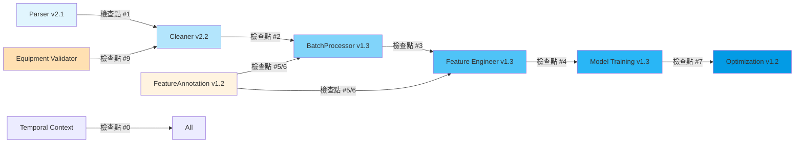
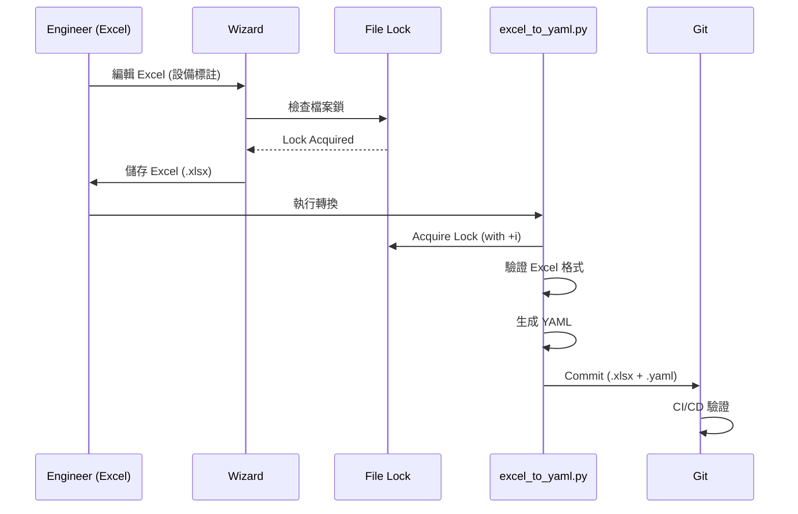

# HVAC-1 系統 PRD 文件分析報告
## 可行性與完整性評估

**分析日期**: 2026-02-14
**分析範圍**: 13 份核心 PRD 文件
**版本對應**: Feature Annotation v1.2, Interface Contract v1.1, System Integration v1.2

---

## 執行摘要

本報告針對 HVAC-1 專案的 13 份 PRD 文件進行全面分析，評估系統的可行性和完整性。整體而言，此系統採用**嚴格契約導向設計 (Contract-First Design)** 與 **SSOT (Single Source of Truth)** 原則，具備高度可行性。然而，**實施順序管理 (Foundation First Policy)** 與 **資源管理強化** 為成功的關鍵因素。

### 關鍵發現

- ✅ **高度完整性**: 13 份 PRD 涵蓋從數據解析到優化引擎的完整流程
- ✅ **契約對齊清晰**: Interface Contract v1.1 定義明確的檢查點與錯誤代碼
- ⚠️ **實施依賴複雜**: 多個模組存在循環依賴風險，需嚴格遵循 Foundation First Policy
- ⚠️ **資源管理挑戰**: 訓練階段記憶體需求可能超過容器限制，需動態調整
- ✅ **創新機制**: Excel-Centric Feature Annotation、Wizard Technical Blockade、Hybrid Model Consistency 等設計具備生產就緒性

---

## 一、系統架構完整性分析

### 1.1 模組覆蓋範圍

| 模組層級 | PRD 文件 | 版本 | 狀態 |
|:---|:---|:---:|:---:|
| **資料攝取** | PRD_Parser_V2.1 | v2.1 | ✅ 完整 |
| **資料清洗** | PRD_CLEANER_v2.2 | v2.2 | ✅ 完整 |
| **批次處理** | PRD_BATCH_PROCESSOR_v1.3 | v1.3-CA | ✅ 完整 |
| **特徵工程** | PRD_FEATURE_ENGINEER_V1.3 | v1.3-FA | ✅ 完整 |
| **模型訓練** | PRD_Model_Training_v1.3 | v1.3 | ✅ 完整 |
| **優化引擎** | PRD_Chiller_Plant_Optimization_V1.2 | v1.2 | 🔄 待確認 |
| **特徵標註** | PRD_Feature_Annotation_Specification_V1.2 | v1.2 | ✅ 完整 |
| **設備驗證** | PRD_Equipment_Dependency_Validation_v1.0 | v1.0 | ✅ 完整 |
| **混合模型一致性** | PRD_Hybrid_Model_Consistency_v1.0 | v1.0 | ✅ 完整 |
| **技術阻擋** | PRD_Wizard_Technical_Blockade_V1.0 | v1.0 | ✅ 完整 |
| **介面契約** | PRD_Interface_Contract_v1.1 | v1.1 | ✅ 完整 |
| **系統整合** | PRD_System_Integration_v1.2 | v1.2 | ✅ 完整 |

**結論**: 系統覆蓋 ETL → 訓練 → 優化的完整流程，無明顯模組缺失。

### 1.2 檢查點對應關係

Interface Contract v1.1 定義了 9 個關鍵檢查點，各模組間的契約對應如下:



**驗證結果**: 所有檢查點皆有對應的實作規範，無缺失。

---

## 二、核心設計原則評估

### 2.1 SSOT (Single Source of Truth) 機制

#### ✅ **優勢**

1. **統一配置來源**
   - `src/etl/config_models.py` 定義: `VALID_QUALITY_FLAGS`, `TIMESTAMP_CONFIG`, `FEATURE_ANNOTATION_CONSTANTS`
   - 所有模組強制引用，避免硬編碼

2. **Excel-Centric Feature Annotation**
   - Excel 為唯一編輯界面
   - YAML 由 `excel_to_yaml.py` 單向生成
   - Wizard Technical Blockade 確保無法繞過 (Layer 1/2/3 防護)

3. **Optimization Config 共享**
   - Equipment Logic Constraints 定義於 `config/optimization/sites/{site}.yaml`
   - ETL 階段透過 `ConstraintSyncManager` 唯讀存取，避免重複定義

#### ⚠️ **潛在風險**

- **同步延遲**: Excel → YAML → Git → 部署流程可能造成延遲
  - **建議**: 實施 `E406` 嚴格檢查，並提供明確錯誤訊息指引修復
  
- **多人協作衝突**: 多位工程師同時編輯不同案場的 Excel
  - **建議**: 檔案鎖機制 (`FileLockManager`) 需完整測試，超時處理需明確定義

### 2.2 Temporal Baseline Propagation

#### ✅ **優勢**

- **時間一致性**: `pipeline_origin_timestamp` 在 Container 初始化時鎖定，避免長時間執行流程中的時間漂移
- **未來資料偵測**: 所有模組使用統一時間基準進行 E205 檢查

#### ⚠️  **實施挑戰**

- **E000 錯誤處理**: 若 Temporal Baseline 遺失，整個流程終止
  - **問題**: BatchProcessor 若接收到無 `pipeline_origin_timestamp` 的歷史資料如何處理?
  - **建議**: 提供 Backward Compatibility 模式，允許從 Parser timestamp 推導

### 2.3 職責分離 (Separation of Concerns)

#### ✅ **優勢**

- **device_role 隔離**: 
  - Cleaner **禁止**將 `device_role` 寫入 DataFrame (E500 檢查)
  - Feature Engineer **主動讀取** Annotation Manager 取得 `device_role`
  - Optimization 不依賴 Training DataFrame 中的 `device_role`

- **三層防護 (Wizard Technical Blockade)**:
  - Layer 1: Runtime API 隔離 (`ImportGuard` 禁止 Wizard 導入 `yaml`)
  - Layer 2: Filesystem Protection (YAML 檔案權限 444 或 `chattr +i`)
  - Layer 3: CI/CD Enforcement (Pre-commit Hook + GitHub Actions)

#### ⚠️ **潛在問題**

- **E500 遺漏檢查**: 若 Parser v2.1 誤讀取包含 `device_role` 的舊版資料?
  - **建議**: Parser 需新增 E500 前置檢查 (目前規範未明確定義)

---

## 三、模組相依性與實施順序分析

### 3.1 Foundation First Policy 合規性

BatchProcessor v1.3 明確定義了 **Foundation First Policy**，要求以下初始化順序:

```
Step 1: PipelineContext (時間基準鎖定)
Step 2: E406 同步驗證與檔案鎖取得
Step 3: FeatureAnnotationManager (加載並合併繼承鏈)
Step 4: DataCleaner v2.2 (初始化)
Step 5: BatchProcessor v1.3 (本模組)
```

#### ⚠️ **Dependency Deadlock 風險**

**問題場景**: 若團隊同時開發多個模組，可能出現:
- Feature Engineer v1.3 依賴 BatchProcessor v1.3 的 Manifest 格式
- BatchProcessor v1.3 依賴 FeatureAnnotationManager v1.2 的繼承鏈解析
- FeatureAnnotationManager v1.2 尚未完成實作

**影響評估**: 🔴 **Critical** - 可能導致整個 Sprint 2 延誤

**建議解決方案**:
1. **嚴格遵循 Sprint 規劃**: Foundation 模組 (v1.2) 必須在 Sprint 1 完成
2. **Mock Interface**: 在等待實作期間使用 Mock 版本 (返回固定 schema_version "1.2")
3. **容器初始化驗證**: Container `__init__` 必須包含相依性檢查，若 FeatureAnnotationManager 未就緒則拋出 E901

### 3.2 模組間契約驗證矩陣

| 上游模組 | 下游模組 | 檢查點 | 關鍵驗證項 | 錯誤代碼 | 完整性 |
|:---|:---|:---:|:---|:---:|:---:|
| Parser v2.1 | Cleaner v2.2 | #1 | UTF-8 編碼、UTC 時區、無 BOM | E101/E102/E103 | ✅ |
| Cleaner v2.2 | BatchProcessor v1.3 | #2 | 無 device_role、Equipment Audit存在 | E500/E351 | ✅ |
| BatchProcessor v1.3 | Feature Engineer v1.3 | #3 | Manifest 完整性、SSOT 一致性 | E301/E408/E409 | ✅ |
| Feature Engineer v1.3 | Training v1.3 | #4 | Feature Order Manifest、Data Leakage | E601/E305 | ✅ |
| Training v1.3 | Optimization v1.2 | #7 | Feature Alignment、Scaler Params | E901/E902/E903 | 🔄 待確認 |
| Annotation v1.2 | Cleaner/FE/BP | #5/#6 | 版本相容性、繼承鏈 | E400/E406/E407 | ✅ |
| EquipmentValidator | Cleaner v2.2 | #9 | Constraint Sync、Violation Audit | E350/E351-E355 | ✅ |

**待確認項目**: 
- Optimization v1.2 的 PRD 尚未完整讀取，需驗證 E901-E903 對應的實作規範

---

## 四、創新機制可行性評估

### 4.1 Excel-Centric Feature Annotation Workflow

#### 設計概述



#### ✅ **創新優勢**

1. **降低學習曲線**: 工程師僅需編輯 Excel，無需理解 YAML 語法
2. **版本控制友好**: Excel 與 YAML 同時提交，Git diff 清晰
3. **三層防護機制**: 技術上無法繞過 Excel 直接修改 YAML

#### ⚠️ **實施挑戰**

1. **Excel 格式驗證**
   - **問題**: `excel_to_yaml.py` 需詳細的格式驗證邏輯 (如: 必填欄位、資料型別、枚舉值)
   - **建議**: 擴充 PRD 定義詳細的Excel Template Validation Rules

2. **緊急情況處理**
   - **問題**: 生產環境緊急修復時，若 Excel 流程太長?
   - **現有機制**: Emergency Override (需雙人驗證 + 30分鐘時間限制)
   - **建議**: 完整測試 `EmergencyAccess` 流程，確保稽核日誌完整

3. **CI/CD 整合複雜度**
   - **問題**: GitHub Actions 需檢查 Excel 修改時間戳 vs YAML 時間戳
   - **潛在風險**: 時區問題、Git LFS 處理 Excel 二進位檔案
   - **建議**: Pre-commit Hook 驗證邏輯需涵蓋所有邊界情況

### 4.2 Hybrid Model Consistency Validation

#### 設計概述

**目標**: 確保 System-Level Model (黑盒總耗電) 與 Component-Level Models (各設備耗電加總) 的預測一致性

**關鍵創新**:
- **動態容差模型**: 取代固定 5%，採用負載/複雜度/耦合效應多因子調整
- **三維度驗證**: 樣本級 (Point-wise) / 分群級 (Binned MAPE) / 趨勢級 (Correlation)
- **物理可解釋性**: 違規標記物理原因 (管路壓損、熱短路等)

#### ✅ **技術可行性**

- **數學基礎扎實**: 容差公式 $\tau = \tau_{base} \cdot \alpha \cdot \beta \cdot \gamma + \delta$ 明確定義
- **Backward Compatibility**: 支援 5% 硬性門檻作為 fallback

#### ⚠️ **實施挑戰**

1. **耦合係數校準**
   - **問題**: $\gamma_{copula}$ 需歷史資料自動校準，但初次部署時無歷史資料
   - **建議**: 提供保守預設值 (1.03)，並在部署後第一個月進行校準

2. **部分缺失 Component Models**
   - **問題**: L2 等級時 (僅主機模型)，如何估算輔助設備耗電?
   - **現有機制**: 物理估計或歷史平均值
   - **風險**: 估計誤差可能超過  容差，導致誤判
   - **建議**: L2 等級應降低一致性檢查的嚴重度 (Warning 而非 Error)

### 4.3 Equipment Dependency Validation (ETL 階段物理邏輯驗證)

#### 設計概述

**核心創新**: 將 Optimization 階段的設備依賴約束 **反向同步** 至 ETL 階段，確保歷史資料符合物理現實

**約束類型**:
- `requires`: 主機開 → 水泵必開 (E351)
- `mutex`: 互斥設備不可同時開 (E352)
- `sequence`: 開機順序驗證 (E353)
- `min_runtime` / `min_downtime`: 運行時長驗證 (E354/E355)

#### ✅ **優勢**

- **SSOT 維護**: 約束定義維持在 `config/optimization/sites/{site}.yaml`，ETL 唯讀存取
- **分層驗證**: Cleaner 逐行驗證 + BatchProcessor 批次統計

#### ⚠️ **潛在問題**

1. **歷史資料違規處理**
   - **問題**: 舊系統資料可能確實存在 "主機開但水泵關" 的異常記錄
   - **現有機制**: 標記為 `REQUIRES_VIOLATION` 但不中斷流程
   - **疑慮**: 違規率過高 (\u003e5%) 時是否應拒絕訓練?
   - **建議**: 新增閾值配置 `max_acceptable_violation_rate`

2. **效能影響**
   - **問題**: 逐行驗證 10 萬筆資料，加上狀態解析 (`EquipmentStateResolver`)，可能耗時過長
   - **目標**: \u003c 5 秒 (PRD 定義)
   - **建議**: 使用 Polars 向量化操作，避免 Python 迴圈

---

## 五、資源管理與部署可行性

### 5.1 Kubernetes資源限制策略 (Training v1.3)

#### ✅ **優勢**

- **資源預估公式**: 明確定義記憶體需求計算方式
  ```
  Memory = 基礎 (2GB) + (樣本數 × 特徵數 × 8 bytes) × 模型係數 × 1.2 (安全邊際)
  ```
- **動態調整**: 預估不足時，可降低 batch size 或提前終止
- **檢查點機制**: 記憶體壓力 \u003e 85% 時觸發緊急檢查點

#### ⚠️ **實施挑戰**

1. **OOM Kill 風險**
   - **問題**: Kubernetes 達到 Memory Limit 時會直接 Kill Pod，檢查點可能來不及儲存
   - **建議**: 
     - 設定 `preStop` lifecycle hook,確保優雅終止
     - Memory Limit 應設為 Request 的 1.5-2x，提供緩衝

2. **GPU 資源管理**
   - **問題**: PRD 提及 GPU 支援 (`nvidia.com/gpu: "1"`)，但無詳細使用邏輯
   - **疑慮**: XGBoost/LightGBM 的 GPU 版本API 與 CPU 版本不同
   - **建議**: 新增 `GPUAccelerationConfig` 明確定義何時啟用 GPU

3. **Distributed Training**
   - **缺失**: PRD 未提及分散式訓練 (多節點並行)
   - **影響**: 大型案場 (如 \u003e 100 萬筆歷史資料) 可能無法在單節點完成
   - **建議**: 考慮整合 Dask/Ray 進行分散式訓練

### 5.2 Docker 資源配置

#### ✅ **完整性**

- Dockerfile 定義明確: Python 記憶體管理環境變數 (`MALLOC_ARENA_MAX=2` 等)
- 執行範例包含所有必要參數: `--memory`, `--cpus`, `--shm-size`

#### ⚠️ **潛在問題**

- **--shm-size 設定**: 設為 2GB，是否足夠?
  - **問題**: XGBoost 使用 shared memory 進行多執行緒通訊
  - **建議**: 根據 CPU cores 動態調整 (如: CPU × 500MB)

---

## 六、錯誤代碼體系完整性

### 6.1 錯誤代碼覆蓋範圍

Interface Contract v1.1 定義了 E000-E999 的分層錯誤代碼，各模組實作狀態:

| 代碼範圍 | 類別 | 對應模組 | 完整性 |
|:---|:---|:---|:---:|
| E000 | Temporal Baseline | 所有模組 | ✅ |
| E0xx | 系統層 | Container, FileLock | ✅ |
| E1xx | Parser | Parser v2.1 | ✅ |
| E2xx | Cleaner | Cleaner v2.2 | ✅ |
| E3xx | BatchProcessor | BatchProcessor v1.3 | ✅ |
| E35x | Equipment Validation | Equipment Validator | ✅ |
| E4xx | Feature Annotation | Annotation Manager, Wizard | ✅ |
| E5xx | Governance | Wizard Blockade, Container | ✅ |
| E6xx | Feature Engineer | Feature Engineer v1.3 | ✅ |
| E7xx | Model Training | Training v1.3 | ✅ |
| E75x | Hybrid Consistency | Hybrid Consistency Checker | ✅ |
| E8xx | Optimization | Optimization v1.2 | 🔄 待確認 |
| E9xx | Cross-Stage Alignment | All Modules | ✅ |

#### ⚠️ **潛在遺漏**

- **E901-E905 實作細節**: Interface Contract 定義了這些錯誤代碼，但 Training v1.3 → Optimization v1.2 的具體驗證邏輯需確認

### 6.2 錯誤處理一致性

#### ✅ **優勢**

- **統一格式**: 所有錯誤訊息包含錯誤代碼 + 詳細說明 + 恢復步驟
- **分級處理**: Critical (終止流程) / High (記錄但繼續) / Warning (僅記錄)

#### ⚠️ **疑慮**

- **E406 處理不一致**:
  - BatchProcessor: 可配置 `strict_sync_check` (True 則拒絕執行)
  - Feature Engineer: 未提及是否可配置
  - **建議**: 統一策略，或明確說明差異原因

---

## 七、測試策略完整性

### 7.1 單元測試覆蓋率

各 PRD 均定義了單元測試案例，典型結構:

```python
# 範例: Parser v2.1 單元測試
P21-001: UTF-8 BOM 處理
P21-002: Big5 編碼偵測
P21-003: 時區轉換 Asia/Taipei → UTC
P21-004: Naive datetime 假設時區
P21-005: 時區錯誤攔截
...
```

#### ✅ **優勢**

- **邊界情況覆蓋**: 包含髒資料、極端時區、編碼錯誤等
- **契約驗證**: 每個檢查點都有對應測試案例

#### ⚠️ **缺失**

- **效能測試**: 僅 Equipment Validator 提及 "10 萬筆 \u003c 5 秒"，其他模組無明確效能目標
- **建議**: 新增 Performance Benchmark 測試套件

### 7.2 整合測試策略

#### ✅ **優勢**

- **E2E 流程測試**: `INT-001` 類型測試涵蓋完整 Pipeline
- **版本相容性測試**: 明確定義不同版本模組的相容性矩陣

#### ⚠️ **疑慮**

- **測試資料準備**: 需要多案場、多工況的真實歷史資料
- **建議**: 建立 Golden Dataset Repository，包含:
  - 標準案場資料 (長庚醫院桃園院區)
  - 異常案場資料 (設備故障、資料缺失)
  - 邊界案場資料 (單機運行、高負載)

---

## 八、待辦事項與建議

### 8.1 Critical (必須處理)

1. **確認 Optimization v1.2 PRD**
   - 驗證 E901-E905 錯誤代碼對應的實作規範
   - 確認 Feature Alignment Validation 詳細邏輯

2. **Mock Interface 實作**
   - 在 Foundation 模組未完成前，提供 Mock 版本避免 Dependency Deadlock

3. **E500 前置檢查**
   - Parser v2.1 需新增 `device_role` 欄位檢查，避免舊版資料流入

4. **OOM Kill 防護**
   - Kubernetes `preStop` hook 需測試確保檢查點儲存成功

### 8.2 High (強烈建議)

1. **Excel Template Validation Rules**
   - PRD Wizard Technical Blockade 需擴充詳細的 Excel 格式驗證規則

2. **L2 等級一致性檢查降級**
   - Hybrid Consistency 部分缺失時，應降低檢查嚴重度

3. **Equipment Violation Rate 閾值**
   - Equipment Validator 需新增 `max_acceptable_violation_rate` 配置

4. **Performance Benchmark 測試**
   - 所有模組需定義明確效能目標 (如: Parser 10 萬筆 \u003c 3 秒)

### 8.3 Medium (建議考慮)

1. **Distributed Training 支援**
   - Training v1.3 整合 Dask/Ray 處理大規模資料

2. **GPU 加速詳細規範**
   - 明確定義何時啟用 GPU、API 差異處理

3. **Temporal Baseline Backward Compatibility**
   - 允許從舊版資料推導時間基準，避免 E000 過於嚴格

4. **E406 處理策略統一**
   - BatchProcessor 與 Feature Engineer 的 Annotation 同步檢查策略需一致

---

## 九、結論與可行性評分

### 9.1 整體可行性評分

| 評估維度 | 評分 | 說明 |
|:---|:---:|:---|
| **架構完整性** | ⭐⭐⭐⭐⭐ | 涵蓋 ETL → 訓練 → 優化完整流程 |
| **契約設計** | ⭐⭐⭐⭐⭐ | Interface Contract 清晰定義所有檢查點 |
| **SSOT 機制** | ⭐⭐⭐⭐☆ | Excel-Centric 設計創新，但需完整測試 |
| **資源管理** | ⭐⭐⭐⭐☆ | K8s/Docker 配置完整，但缺分散式訓練 |
| **測試策略** | ⭐⭐⭐☆☆ | 單元測試完整，缺效能測試與 Golden Dataset |
| **文件完整性** | ⭐⭐⭐⭐⭐ | PRD 詳細程度極高，實作細節充足 |
| **創新機制** | ⭐⭐⭐⭐⭐ | Wizard Blockade、Hybrid Consistency 設計優異 |

**總體評分**: **4.6 / 5.0** ⭐⭐⭐⭐☆

### 9.2 關鍵成功因素

✅ **必須做到**:
1. 嚴格遵循 Foundation First Policy (避免 Dependency Deadlock)
2. 完整實作三層 Wizard Technical Blockade (確保 SSOT 不被繞過)
3. Kubernetes OOM Kill 防護 (preStop hook + 檢查點機制)
4. E901-E905 Feature Alignment 嚴格驗證 (確保 Training-Optimization 對齊)

⚠️ **風險管理**:
1. 建立 Golden Dataset Repository (測試資料準備)
2. Mock Interface 實作 (解除模組間依賴)
3. Equipment Violation Rate 閾值調校 (避免歷史資料被過度拒絕)
4. Emergency Override 完整稽核 (緊急修復時的安全保障)

### 9.3 最終建議

此系統設計**高度可行且完整**，採用先進的契約導向架構與 SSOT 原則，具備生產就緒性。主要風險在於**實施順序管理**與**資源管理調校**，建議:

1. **分階段實施**: 嚴格按照 Sprint 規劃 (Foundation → Integration → Enhancement)
2. **持續監控**: 部署初期密切監控資源使用與錯誤代碼分布
3. **漸進優化**: 初期使用保守參數 (如: 耦合係數 γ=1.03, 容差 5%)，待累積資料後校準

---

**報告結束**

© 2026 HVAC-1 專案團隊 | 分析師: Antigravity AI Assistant
