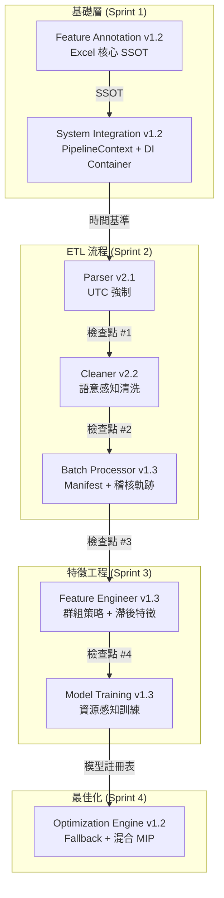
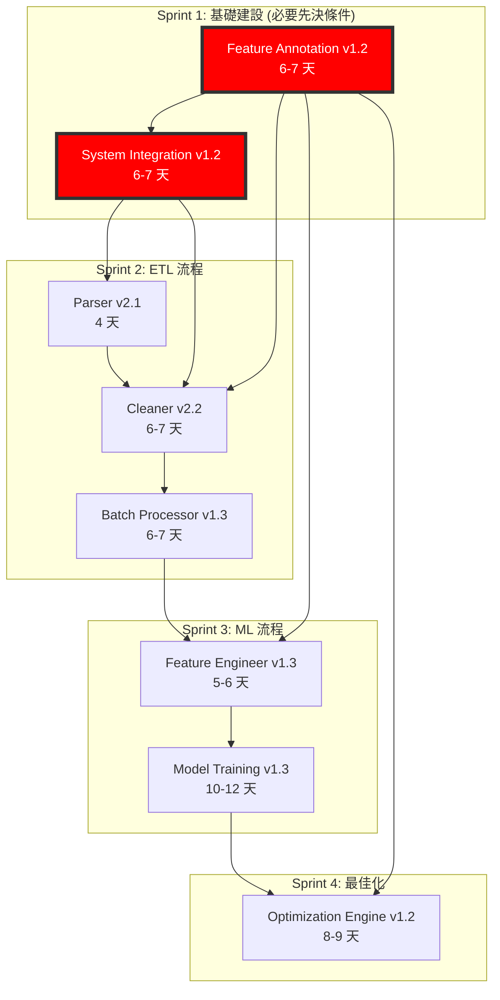

# HVAC-1 專案評估報告
**專案可行性分析與架構評估**

**文件版本:** 1.0  
**日期:** 2026-02-14  
**分析師:** Oscar Chang  
**審閱 PRD 模組:** 8 個核心模組  
**評估基礎:** Interface Contract v1.1 + Foundation First Policy (基礎優先策略)

---

## 執行摘要 (Executive Summary)

### 評估結果: **✅ 可行 (須注意關鍵依賴)**

HVAC-1 專案展現了**生產就緒的架構**，特別著重於資料一致性、時間正確性和模組化設計。根據對 8 個核心 PRD 文件的全面審閱，該專案在**技術上是可行的**，但必須嚴格遵守「基礎優先策略 (Foundation First Policy)」進行**順序性開發**，以避免依賴死鎖。

### 主要優勢
1. **Interface Contract v1.1**: 統一的錯誤代碼體系 (E000-E904)，設有 7 個關鍵檢查點，確保零誤差整合。
2. **時間基準隔離 (Temporal Baseline Isolation)**: 系統級 `pipeline_origin_timestamp`，防止跨模組的未來數據漂移。
3. **Excel 為核心的 SSOT**: Feature Annotation v1.2 強制執行唯讀 YAML 策略，防止配置衝突。
4. **資源管理**: 完整的 Kubernetes/Docker 資源限制，具備 OOM (記憶體溢出) 預防與檢查點恢復功能 (v1.3)。
5. **多層級降級機制 (Fallback)**: Optimization Engine v1.2 具備三層降級策略，確保系統穩健性。

### 關鍵風險
1. **依賴死鎖 (Dependency Deadlock)** (優先級 1): Feature Annotation Manager 必須在 Cleaner v2.2 之前實作，否則會導致初始化競爭條件。
2. **設備角色洩漏 (Device Role Leakage)** (E500): 需要嚴格的關注點分離 - `device_role` 僅供內部使用，絕不可寫入輸出。
3. **註釋同步強制 (Annotation Sync)** (E406): Pipeline 執行前必須強制檢查 Excel-YAML 的一致性。
4. **資源估算**: Model Training v1.3 的動態記憶體估算對於防止 K8s Pod 被驅逐至關重要。

### 建議 Sprint 順序
**Sprint 1 (基礎建設 - 6-7 天):** Feature Annotation v1.2 + System Integration v1.2  
**Sprint 2 (核心 ETL - 15-17 天):** Parser v2.1 → Cleaner v2.2 → Batch Processor v1.3  
**Sprint 3 (ML 流程 - 20-22 天):** Feature Engineer v1.3 → Model Training v1.3  
**Sprint 4 (最佳化 - 8-9 天):** Optimization Engine v1.2

**總預估工期:** 49-55 個開發日 (含緩衝約 10-11 週)

---

## 1. 架構總覽 (Architecture Overview)

### 1.1 系統級設計理念

HVAC-1 專案採用**契約驅動、時間一致、資源感知**的架構，核心原則如下：



### 1.2 Interface Contract v1.1 合規性

所有 8 個模組均嚴格遵守 Interface Contract v1.1，定義如下：

| 檢查點 | 來源 → 目標 | 驗證項目 | 錯誤代碼 |
|:---:|:---|:---|:---:|
| **#1** | Parser → Cleaner | UTC 時區、標頭標準化、BOM 處理 | E101-E105 |
| **#2** | Cleaner → Batch | 設備驗證稽核、時間基準合規性 | E201-E206, E350-E355 |
| **#3** | Batch → Feature Engineer | Parquet schema INT64/UTC、無 device_role (E500) | E301-E305 |
| **#4** | FE → Model Training | 特徵順序清單、縮放參數、註釋版本 | E601-E604 |
| **#5** | Excel → YAML | 樣板版本、Schema 雜湊、同步時間戳記 | E406 |
| **#6** | YAML → Manager | Schema 版本相容性、繼承解析 | E400, E407 |
| **#7** | Training → Registry | 特徵對齊、設備限制雜湊 | E901-E904 |

### 1.3 SSOT (單一真理來源) 層級

```yaml
# SSOT 架構 (嚴格分層)
第一層 (程式碼 SSOT):
  - src/etl/config_models.py::VALID_QUALITY_FLAGS (6 個標記)
  - src/etl/config_models.py::TIMESTAMP_CONFIG (UTC/INT64)
  - src/etl/config_models.py::ERROR_CODE_REGISTRY (E000-E904)

第二層 (特徵 SSOT):
  - config/features/base.yaml (所有案場繼承)
  - config/features/physical_types.yaml (單位定義)
  - config/features/sites/{site_id}.yaml (由 Excel 產生)

第三層 (執行時 SSOT):
  - ETLConfig 實例 (由 Container 注入)
  - PipelineContext (時間基準 + site_id)
  - FeatureAnnotationManager (合併後的繼承鏈)

禁止事項:
  - 直接寫入 YAML (E501: 由 Import Guard 阻擋)
  - 硬編碼 device_role 預設值 (E500: 只能使用 Annotation)
  - 模組中使用 `datetime.now()` (必須使用 context.pipeline_timestamp)
```

---

## 2. 模組分析 (Module-by-Module Analysis)

### 2.1 Parser v2.1 (穩健性重構)

**狀態:** ✅ 定義明確 | **預估工時:** 4 天 | **優先級:** Sprint 2

#### 關鍵功能
- **編碼偵測:** UTF-8 BOM 處理 + Big5/UTF-16 備援機制
- **智慧標頭搜尋:** 多行掃描 (500 行) 與關鍵字匹配
- **時區標準化:** **強制 UTC 輸出** (E102 執行)
- **契約驗證:** 在交接給 Cleaner 前執行 `_validate_output_contract()`

#### 設計優勢
✅ 明確的時區轉換，防止下游時間漂移  
✅ BOM 處理決常了見的 BAS 導出問題  
✅ 空值標準化 (8 種模式: "", "NA", "---", "Error" 等)

#### 實作風險
⚠️ **Unicode 邊緣案例:** 罕見編碼 (GB2312, Shift-JIS) 未顯式處理  
⚠️ **標頭歧義:** 多語言標頭 (中英混合) 可能需要手動對應

---

### 2.2 Cleaner v2.2 (語意感知 + 設備驗證)

**狀態:** ✅ 定義明確 | **預估工時:** 6-7 天 | **優先級:** Sprint 2

#### v2.1 的關鍵更新
- **設備邏輯預檢查** (E350): 在資料進入前驗證 `chiller_pump_mutex` (互斥邏輯)
- **時間基準強制:** 使用 `pipeline_origin_timestamp` 而非 `datetime.now()`
- **設備角色感知:** 根據角色調整閥值 (備用設備抑制 W403 警告) **但不寫入輸出**
- **嚴格關注點分離:** 從 Annotation 讀取 `device_role`，但 **E500 阻擋其輸出洩漏**

#### SSOT 整合
```python
# Cleaner v2.2 從 FeatureAnnotationManager 讀取 device_role:
col_config = self.annotation_manager.get_column_config("chiller_2_temp")
if col_config.device_role == "backup":
    # 針對備用設備抑制 W403 (長期閒置零值)
    self._suppress_warning("W403", reason="Backup equipment long-term idle")

# 輸出驗證 (守門員原則):
if "device_role" in clean_df.columns:
    raise DataLeakageError("E500: device_role must not pass to BatchProcessor")
```

#### 設計優勢
✅ **守門員機制:** 在入口處阻擋錯誤資料 (預檢查) vs 後期清洗  
✅ **設備驗證稽核:** 記錄違規事項供 BatchProcessor Manifest 使用  
✅ **Metadata 淨化:** 強制執行 `ALLOWED_METADATA_KEYS` 防止屬性膨脹

#### 關鍵依賴
🔴 **依賴死鎖風險:** 需要 FeatureAnnotationManager v1.2 **在 Cleaner 實例化之前初始化**  
🟡 **註釋版本檢查:** Schema 不匹配觸發 E400 (需要 `migrate-excel` 工具)

---

### 2.3 Feature Engineer v1.3-FA (特徵註釋消費)

**狀態:** ✅ 定義明確 | **預估工時:** 5-6 天 | **優先級:** Sprint 3

#### 關鍵創新
- **Metadata 分層:** 物理屬性來自 Manifest，角色/警告來自 Annotation
- **直接註釋查詢:** 繞過中間快取，直接獲取最新 `device_role`/`ignore_warnings`
- **語意群組策略:** 根據 `device_role` 調整滯後/滾動策略 (例如：備用設備使用較簡單的策略)
- **嚴格資料洩漏預防:** 強制執行 `strict_past_only` 時間切割

#### 實作模式
```python
# Step 3.1: 動態查詢 device_role (非來自 Manifest)
col_config = self.annotation_manager.get_column_config("chiller_1_load")
device_role = col_config.device_role  # "primary" | "backup" | "seasonal"

# Step 3.2: 調整群組策略
if device_role == "backup" and policy.name == "High_Freq":
    # 備用設備不需要高頻採樣
    policy.lag_intervals = [1, 4]  # 從 [1, 4, 15, 96] 減少
```

---

### 2.4 Batch Processor v1.3 (契約對齊 + 註釋稽核)

**狀態:** ✅ 定義明確 | **預估工時:** 6-7 天 | **優先級:** Sprint 2

#### Interface Contract v1.1 關鍵對齊
- **檢查點 #3 執行:** 驗證 Cleaner 輸出包含 `equipment_validation_audit`
- **時間基準傳遞:** 將 `context.pipeline_timestamp` 寫入 Manifest 供下游使用
- **E408 SSOT 驗證:** 比對程式碼 `VALID_QUALITY_FLAGS` 與 Manifest 版本
- **E500 最終檢查:** 若偵測到 `device_role` 欄位，阻擋 Parquet 寫入

#### Manifest 結構 (v1.3 更新)
```json
{
  "version": "2.0-ALIGN",
  "pipeline_origin_timestamp": "2026-02-14T10:25:00Z",  // 來自 PipelineContext
  "equipment_validation_audit": {  // 來自 Cleaner v2.2
    "violations": [
      {
        "constraint_id": "chiller_pump_mutex",
        "severity": "critical",
        "marked_as": "PHYSICAL_IMPOSSIBLE"
      }
    ]
  },
  "temporal_baseline": {  // E000 強制執行
    "future_data_check": {
      "enabled": true,
      "violations_found": false
    }
  }
}
```

---

### 2.5 Model Training v1.3 (資源感知 + 生產就緒)

**狀態:** ✅ 定義明確 | **預估工時:** 10-12 天 | **優先級:** Sprint 3

#### v1.2 重大增強
1. **資源管理系統:** 訓練前記憶體估算 + 監控 + OOM 預防
2. **Kubernetes 整合:** 資源請求/限制，preStop hook 用於緊急檢查點
3. **Docker 資源限制:** 參數化 --memory, --cpus, --shm-size
4. **檢查點管理器:** 記憶體壓力過大 (>85%) 時自動儲存
5. **混合一致性檢查:** 系統 vs 組件模型差異偵測 (E710 >15%, W702 >5%)

#### 資源估算公式
```python
def estimate_resource_requirements(n_samples, n_features, model_types):
    base_memory_gb = 2.0  # Python runtime
    # ... 計算數據記憶體 ...
    # ... 根據模型類型 (XGBoost/LightGBM/RF) 乘上係數 ...
    # 安全邊際: 20%
    return estimated_memory_gb * 1.2
```

---

### 2.6 Optimization Engine v1.2 (穩健 + Fallback)

**狀態:** ✅ 定義明確 | **預估工時:** 8-9 天 | **優先級:** Sprint 4

#### 防禦性最佳化哲學
**「寧可接受次佳的可行解，也不要系統崩潰」**

三層級 Fallback 策略：
```
Level 0 (標準): differential_evolution + 完整約束
  ↓ [無解/超時]
Level 1 (放寬): 移除軟約束 (互斥放寬 10%)
  ↓ [仍無解]
Level 2 (啟發式): GreedyHeuristicOptimizer (依效率排序選擇設備)
  ↓ [仍無解]
Level 3 (當前配置): 回傳當前配置並附帶診斷報告
```

#### 混合模型一致性檢查
```python
# E806 警告 (5-15% 差異)
# E810 嚴重錯誤 (>15% 差異)

if discrepancy_pct > 15:
    raise HybridInconsistencyError(f"E810: 模型差異 {discrepancy_pct:.1f}% > 15%. 需要重新訓練。")
```

---

### 2.7 Feature Annotation v1.2 (Excel 核心 SSOT)

**狀態:** ✅ 定義明確 | **預估工時:** 6-7 天 | **優先級:** Sprint 1 (基礎)

#### 設計哲學: **「Excel 作為 UI，YAML 作為資料庫」**

**關鍵工作流:**
```
人員編輯 (Excel) → 驗證 (excel_to_yaml.py) → YAML SSOT → Git PR → Container 部署
         ↑                                                                 ↓
         └───────────── 災難恢復 (yaml_to_excel.py) ───────────────────────┘
```

#### 防止直接修改 YAML 的三層保護
1. **檔案系統保護:** 部署時設置唯讀與不可變更屬性
2. **Import Guard (執行時):** `yaml_write_guard.py` 攔截寫入操作
3. **Manager API 限制:** 僅提供唯讀介面

---

### 2.8 System Integration v1.2 (有序初始化 + 時間一致性)

**狀態:** ✅ 定義明確 | **預估工時:** 6-7 天 | **優先級:** Sprint 1 (基礎)

#### PipelineContext: 時間基準載體

**設計目的:** 消除各模組中的 `datetime.now()` 呼叫

```python
@dataclass
class PipelineContext:
    pipeline_timestamp: datetime  # 全域統一時間
    
    def is_future_timestamp(self, timestamp):
        # 統一的未來數據檢查邏輯
        pass
```

#### 嚴格初始化順序 (ETLContainer)
**優點:**
1. **防止競爭條件:** Cleaner 在 AnnotationManager 之前無法初始化
2. **檔案鎖整合:** 在 Container 初始化時檢測 Excel-YAML 衝突
3. **時間一致性:** 所有模組使用相同的 `pipeline_timestamp`

---

## 3. 關鍵依賴分析

### 3.1 依賴圖 (基礎優先策略)



### 3.2 阻擋性依賴 (必須在編碼前解決)

| 阻擋 ID | 模組 | 依賴項目 | 違規影響 | 解決方案 |
|:---:|:---|:---|:---|:---|
| **BD-001** | Cleaner v2.2 | FeatureAnnotationManager 已初始化 | E901 執行時錯誤 (初始化順序違規) | **優先**實作 Feature Annotation v1.2 |
| **BD-002** | Batch Processor v1.3 | Context 之時間基準 | 未來數據檢查不一致 | **優先**實作 System Integration v1.2 |
| **BD-003** | Feature Engineer v1.3 | Annotation `device_role` | 群組策略邏輯失敗 | 等待 Feature Annotation v1.2 |
| **BD-004** | Model Training v1.3 | 特徵順序 Manifest + 縮放參數 | E901 特徵對齊錯誤 | 確保 FE v1.3 輸出 `feature_order_manifest` |
| **BD-005** | Optimization v1.2 | 含特徵 Manifest 的 Model Registry | E901/E903/E904 驗證失敗 | 等待 Model Training v1.3 |

---

## 4. 風險評估與緩解

### 4.1 技術風險 (按優先級排序)

#### 風險 T1: 依賴死鎖 (嚴重)
**機率:** 高 (80%) | **影響:** 專案停滯
**緩解:**
1. ✅ 強制 Sprint 1 完成後才開始 Sprint 2
2. ✅ 加入 CI 檢查: `pytest tests/integration/test_init_order.py`
3. ✅ 使用 DI Container 模式

#### 風險 T2: 設備角色洩漏 (E500) (高)
**機率:** 中 (60%) | **影響:** 資料完整性違規
**緩解:**
1. ✅ Cleaner 輸出契約: `assert "device_role" not in clean_df.columns`
2. ✅ Batch Processor 預檢查與 Model Training 輸入驗證

#### 風險 T3: 註釋同步漂移 (E406) (高)
**機率:** 中 (50%) | **影響:** 配置不一致
**緩解:**
1. ✅ 嚴格同步檢查: `fa_config.strict_sync_check = True`
2. ✅ CI Hook: 驗證 Excel 修改時間 < YAML 修改時間

---

## 5. 可行性評估

### 5.1 技術可行性: ✅ **確認可行**
**優勢:** 定義明確的契約、成熟的技術堆疊、深度防禦驗證、生產級模式。

### 5.2 資源可行性: ⚠️ **可行但有限制**
**需求:** 1 位資深後端、1 位 ML 工程師、1 位資料工程師、0.5 位 DevOps。
**硬體:** 生產環境 K8s 需至少 2 節點 (各 16GB RAM)。

### 5.3 時程可行性: ✅ **10-11 週內可達成**
**總預估:** 49-55 天。關鍵路徑因依賴關係呈現嚴格的順序性。

---

## 6. 建議

### 6.1 立即行動 (編碼開始前)

#### 行動 1: 實作依賴驗證 CI 檢查 (優先級: 🔴 嚴重)
確保初始化順序符合規定。

#### 行動 2: 在 CONTRIBUTING.md 記錄 Excel 工作流 (優先級: 🟡 高)
明確規範 Excel 是唯一編輯介面，禁止直接修改 YAML。

#### 行動 3: 建立 Sprint 1 基礎檢核表 (優先級: 🟡 高)
包含 Feature Annotation 與 System Integration 的每日細項任務。

---

## 7. 結論

### 7.1 最終結論

HVAC-1 專案**架構健全且已準備好開發**，前提是：
1. ✅ **可以開始開發**：若嚴格執行「基礎優先策略」(Sprint 1 在 Sprint 2 之前完成)。
2. ⚠️ **暫緩開發**：若關鍵基礎建設 (K8s, 資深人員) 尚未到位。

**文件產生日期:** 2026-02-14  
**下次審閱:** Sprint 1 完成後
