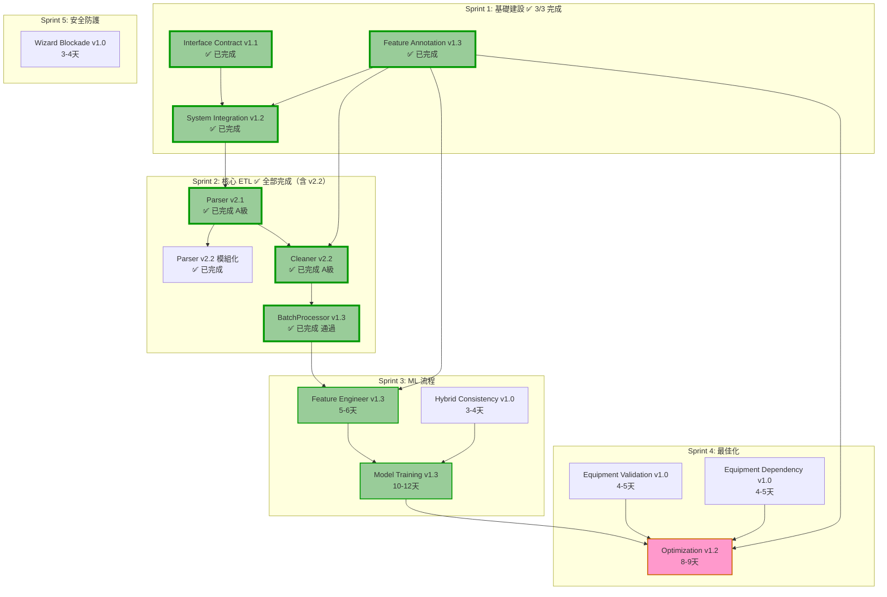

# HVAC-1 專案任務排程文件

**文件版本:** v1.8  
**建立日期:** 2026-02-19  
**最後更新:** 2026-02-25  
**文件狀態:** 🟢 **Sprint 2 全部完成（含 Parser v2.2 模組化重構 + Interactive ETL Tester v1.5 Step 1→2 整合）**

---

## 一、專案概述

### 1.1 系統目標
HVAC-1 是一個**空調節能系統**，專注於資料清洗與離線能源最佳化建議。系統採用**嚴格契約導向設計 (Contract-First Design)** 與 **SSOT (Single Source of Truth)** 原則。

### 1.2 核心資料流
```
Raw Data → Parser → Cleaner → BatchProcessor → FeatureEngineer → ModelTraining → Optimization
                ↑                                                               ↓
        Feature Annotation (Excel → YAML SSOT)                        Model Registry Index
```

### 1.3 總預估工時
| 階段 | 核心工時 | Demo 工時 | 累計 | 狀態 |
|:---:|:---:|:---:|:---:|:---:|
| Sprint 1: 基礎建設 | 12-14 天 | +1 天 | 13-15 天 | ✅ 已完成 (3/3) |
| Sprint 2: 核心 ETL | 15-17 天 | +1.5 天 | 29.5-33.5 天 | ✅ 全部完成（含 v2.2 重構） |
| Sprint 3: 特徵與模型 | 18-22 天 | +1.5 天 | 49-57 天 | ⏳ 待開始 |
| Sprint 4: 最佳化 | 10-12 天 | +1.5 天 | 62-72 天 | ⏳ 待開始 |
| Sprint 5: 整合測試 | 8-10 天 | +1 天 | **72-84 天** | ⏳ 待開始 |

**建議總工期:** 約 14-17 週（含緩衝、測試與 Demo 展示）

---

## 二、依賴關係圖



---

## 三、Sprint 任務排程

---

### Demo 展示技術規範

> **原則：Demo 頁面是「結果展示窗口」，不是「另一個系統」。只需做到：打開 → 看到 → 理解流程。**

| 規範項目 | 內容 |
|:---|:---|
| **技術堆疊** | 純 HTML + Vanilla CSS + JavaScript（無任何框架依賴，嚴禁 Tailwind/Bootstrap） |
| **資料來源** | 由 Python 腳本從 Pipeline 輸出生成 JSON，HTML 讀取呈現 |
| **圖表** | Chart.js（CDN 引入，無需安裝） |
| **流程圖** | Mermaid.js（CDN 引入） |
| **目錄** | `tools/demo/` |
| **命名規則** | `sprint{N}_{主題}.html` |
| **入口頁面** | `tools/demo/index.html`（彙整各 Sprint 連結，以進度卡片呈現） |
| **瀏覽器** | Chrome / Edge（建議使用 HTTP Server 開啟避開 CORS 本地讀取限制） |
| **資料產生** | `python tools/demo/generate_demo_data.py` → 輸出 JSON → HTML 讀取 |

**目錄結構:**
```
tools/demo/
├── index.html                    ← 總覽入口（各 Sprint 連結）
├── assets/
│   ├── style.css                 ← 共用樣式
│   └── common.js                 ← 共用 JS 工具
├── data/                         ← Pipeline 輸出的展示資料
│   ├── sprint1_foundation.json
│   ├── sprint2_etl_sample.json
│   ├── sprint3_ml_metrics.json
│   ├── sprint4_opt_results.json
│   └── sprint5_integration.json
├── sprint1_foundation.html
├── sprint2_etl.html
├── sprint3_ml.html
├── sprint4_optimization.html
├── sprint5_integration.html
└── generate_demo_data.py         ← 從 Pipeline 輸出提取展示資料
```

---

### Sprint 1: 基礎建設 (第 1-2 週)
**目標:** 建立系統基礎設施、配置管理、錯誤代碼體系、特徵標註系統  
**狀態:** ✅ **已完成** (3/3 完成)  
**關鍵成功因素:** 所有下游模組依賴這些基礎，必須優先完成

#### 1.1 Interface Contract v1.1 (3-4天) ✅ 已完成

**完成日期:** 2026-02-19  
**負責人:** Claude Code  
**測試狀態:** 已通過驗證

| 任務 ID | 任務描述 | 預估工時 | 優先級 | 驗收標準 | 狀態 |
|:---:|:---|:---:|:---:|:---|:---:|
| IC-001 | 錯誤代碼分層定義 (E000-E999) | 0.5天 | 🔴 Critical | `config_models.py` 定義完整錯誤代碼 | ✅ |
| IC-002 | 檢查點規格定義 (#1-#7) | 0.5天 | 🔴 Critical | 7個檢查點規格文件化 | ✅ |
| IC-003 | DataFrame 介面標準 | 0.5天 | 🔴 Critical | timestamp, quality_flags 規格確立 | ✅ |
| IC-004 | 版本相容性矩陣 | 0.5天 | 🟡 Medium | 相容性矩陣表格完成 | ✅ |
| IC-005 | 實作檢查清單 | 0.5天 | 🟡 Medium | 6.1-6.3 檢查清單完成 | ✅ |
| IC-006 | Header Standardization 規範 | 0.5天 | 🟡 Medium | 第10章規格完成 | ✅ |
| IC-007 | Temporal Baseline 傳遞規範 | 0.5天 | 🔴 Critical | 第8章規格完成 | ✅ |

**交付物:**
- ✅ `docs/Interface Contract/PRD_Interface_Contract_v1.1.md`
- ✅ `src/etl/config_models.py` (錯誤代碼常數)

**實作摘要:**
- 定義完整 E000-E999 錯誤代碼體系，涵蓋 7 大類別
- 建立 7 個檢查點規格（#1 Parser→Cleaner 到 #7 Training→Optimization）
- 定義 DataFrame 介面標準（timestamp: UTC/ns, quality_flags: List[str]）
- 建立版本相容性矩陣（5 種版本組合相容性評估）
- 定義 Header Standardization 規則（snake_case 正規化）
- 建立 Temporal Baseline 傳遞規範（E000 時間基準機制）

---

#### 1.2 System Integration v1.2 (6-7天) ✅ 已完成

**完成日期:** 2026-02-19  
**負責人:** Claude Code  
**測試狀態:** 35 項單元測試全部通過

| 任務 ID | 任務描述 | 預估工時 | 優先級 | 驗收標準 | 狀態 |
|:---:|:---|:---:|:---:|:---|:---:|
| SI-001 | PipelineContext 實作 | 1天 | 🔴 Critical | 時間基準單例模式運作 | ✅ |
| SI-002 | ETLConfig 擴充 (含 AnnotationConfig) | 1天 | 🔴 Critical | Pydantic 模型驗證通過 | ✅ |
| SI-003 | ConfigLoader 強化 (E406, 檔案鎖) | 1天 | 🔴 Critical | 同步檢查與鎖機制運作 | ✅ |
| SI-004 | ETLContainer 初始化順序控制 | 2天 | 🔴 Critical | 4步驟初始化順序正確 | ✅ |
| SI-005 | 單元測試與整合測試 | 1.5天 | 🔴 Critical | 初始化順序測試通過 | ✅ |
| SI-006 | 時間基準傳遞測試 | 0.5天 | 🔴 Critical | 跨日/長時間執行測試通過 | ✅ |

**交付物:**
- ✅ `src/context.py` (PipelineContext, 337 行)
- ✅ `src/etl/config_models.py` (完整 SSOT, 1554+ 行)
- ✅ `src/utils/config_loader.py` (ConfigLoader, 485 行)
- ✅ `src/container.py` (ETLContainer, 543 行)
- ✅ `tests/test_container_initialization.py` (712 行，35 項測試)

**實作摘要:**

**SI-001 PipelineContext:**
- Thread-safe Singleton 單例模式實作
- 時間基準初始化（禁止重複設定）
- E000 錯誤檢查（時間基準遺失）
- E000-W 時間漂移警告（>60 分鐘）
- 未來資料檢測（容忍 5 分鐘）

**SI-002 ETLConfig:**
- AnnotationConfig Pydantic 模型（含 device_role 驗證）
- SiteFeatureConfig 案場配置（含繼承支援）
- E405 檢查（目標變數不可啟用 Lag）
- E906 版本相容性檢查

**SI-003 ConfigLoader:**
- E406 Excel/YAML 同步檢查（時間戳、Checksum）
- E007 設定檔損毀檢查
- E408 SSOT 品質標記匹配檢查
- 跨平台檔案鎖（FileLock）
- 原子寫入與備份恢復機制

**SI-004 ETLContainer:**
- 4 步驟初始化順序控制（Foundation First Policy）
- 嚴格依賴驗證（步驟 N 需要步驟 N-1）
- 初始化狀態追蹤（InitializationStatus）

**測試覆蓋:**
- 9 項 PipelineContext 測試（單例、E000、漂移警告）
- 6 項 ETLConfig 測試（Pydantic、E405、相容性）
- 7 項 ConfigLoader 測試（E406、E007、檔案鎖）
- 7 項 ETLContainer 測試（4 步驟初始化）
- 6 項時間基準傳遞測試

---

#### 1.3 Feature Annotation v1.3 (6-7天) ✅ 已完成

**完成日期:** 2026-02-21  
**負責人:** Claude Code  
**測試狀態:** 18 項單元測試全部通過

| 任務 ID | 任務描述 | 預估工時 | 優先級 | 驗收標準 | 狀態 |
|:---:|:---|:---:|:---:|:---|:---:|
| FA-001 | 目錄結構與基礎配置 | 0.5天 | 🔴 Critical | 建立 features/ 目錄結構 | ✅ |
| FA-002 | YAML Schema 定義 | 0.5天 | 🔴 Critical | schema.json 驗證通過 | ✅ |
| FA-003 | Pydantic 模型定義 | 1天 | 🔴 Critical | ColumnAnnotation, EquipmentConstraint | ✅ |
| FA-004 | FeatureAnnotationManager 實作 | 2天 | 🔴 Critical | 繼承鏈解析與快取、18項測試 | ✅ |
| FA-005 | excel_to_yaml.py 轉換器 | 1.5天 | 🔴 Critical | Excel→YAML 單向轉換、Checksum | ✅ |
| FA-006 | HVAC 設備限制條件定義 | 0.5天 | 🔴 Critical | equipment_constraints 區段 | ✅ |
| FA-007 | Wizard CLI 實作 | 0.5天 | 🟡 Medium | 互動式標註流程、HVAC語意推測 | ✅ |

**交付物:**
- ✅ `src/features/__init__.py`
- ✅ `src/features/models.py` (Pydantic 模型)
- ✅ `src/features/annotation_manager.py` (核心管理器, 550+ 行)
- ✅ `tools/features/wizard.py` (Wizard CLI)
- ✅ `tools/features/excel_to_yaml.py` (轉換器)
- ✅ `config/features/schema.json` (JSON Schema v1.3)
- ✅ `config/features/physical_types.yaml` (18+ 物理類型)
- ✅ `config/features/equipment_taxonomy.yaml` (設備分類法)
- ✅ `config/features/sites/template_factory.yaml` (工廠範本)
- ✅ `tests/features/test_annotation_manager.py` (18 項測試)
- ✅ `docs/Feature Annotation Specification/IMPLEMENTATION_SUMMARY.md`

**實作摘要:**

**Pydantic 模型 (models.py):**
- ColumnAnnotation: 欄位標註模型（含 E405 驗證）
- EquipmentConstraint: 設備限制條件模型
- SiteFeatureConfig: 完整案場配置

**FeatureAnnotationManager:**
- 唯讀介面（E500/E501 防護）
- 繼承鏈解析（E407 循環繼承檢查）
- SSOT 版本驗證（E408）
- HVAC 專用查詢（設備類型、角色、限制條件）
- 時間基準整合

**Excel 工具鏈:**
- excel_to_yaml.py: 單向轉換、Checksum 計算、HVAC 邏輯驗證
- wizard.py: 互動式標註、自動備份、HVAC 語意推測

**錯誤代碼實作:**
- E400: Schema 版本不符
- E402: 找不到案場標註檔案
- E404: Lag 格式錯誤
- E405: 目標變數啟用 Lag（Data Leakage）
- E407: 循環繼承
- E408: SSOT 版本不匹配
- E500: Device Role 洩漏（唯讀防護）
- E501: 直接寫入 YAML（禁止儲存）

**測試覆蓋:**
- 初始化與錯誤處理（E400, E402, E407, E408）
- 欄位查詢與設備角色查詢
- HVAC 專用查詢（設備類型、目標變數、電力欄位）
- 設備限制條件查詢
- 唯讀防護（E500, E501）
- Pydantic 模型驗證（E405, Lag 間隔）

**風險提醒:**
- ✅ **依賴死鎖風險:** FeatureAnnotationManager 已完成，Cleaner 可開始開發
- ✅ **E406 同步:** Excel/YAML 同步檢查已於 SI-003 完成基礎設施

#### 1.4 Sprint 1 Demo 展示 (1天) ✅ 已完成

**完成日期:** 2026-02-23  
**狀態:** ✅ **已完成**

| 任務 ID | 任務描述 | 預估工時 | 優先級 | 驗收標準 | 狀態 |
|:---:|:---|:---:|:---:|:---|:---:|
| DEMO-101 | 系統架構圖 (Mermaid) 展示 | 0.3天 | 🟡 Medium | 核心資料流清晰可見 | ✅ |
| DEMO-102 | 錯誤代碼體系表格化展示 | 0.3天 | 🟡 Medium | E000-E999 分類呈現 | ✅ |
| DEMO-103 | Feature Annotation YAML 範例展示 | 0.2天 | 🟡 Medium | 繼承鏈視覺化 | ✅ |
| DEMO-104 | 4 步驟初始化流程動畫 | 0.2天 | 🟡 Medium | Foundation First Policy | ✅ |

**交付物:**
- ✅ `tools/demo/index.html` - Demo 總覽入口
- ✅ `tools/demo/sprint1_foundation.html` - Sprint 1 展示頁面
- ✅ `tools/demo/data/sprint1_foundation.json` - 展示資料

**展示內容:**
- 🏗️ 系統架構圖與核心資料流 (Mermaid.js)
- ❌ 錯誤代碼體系（7 大類別，27+ 個錯誤碼，互動式表格）
- 📋 Feature Annotation 繼承鏈範例（工廠範本 → 院區繼承）
- ⚙️ ETLContainer 4 步驟初始化流程動畫
- 📊 測試覆蓋率統計（53 項測試）
- 📅 開發里程碑時間軸

**設計特色:**
- 工業/科技感深色主題設計（藍色/青色 + 橙色強調）
- 動態數字計數動畫
- 滾動觸發漸顯效果
- 響應式佈局設計
- Chart.js + Mermaid.js 整合

---

### Sprint 2: 核心 ETL (第 3-5 週，含 v2.2 續作)
**目標:** 建立資料攝取、清洗、批次處理流程  
**狀態:** ✅ **全部已完成**（Parser v2.1 A級, Parser v2.2 模組化完成, Cleaner v2.2 A級, BatchProcessor v1.3 通過）  
**執行摘要**: [📋 Sprint 2 執行摘要](./Sprint_2_執行摘要.md)  
**審查報告**: [📋 Sprint 2 Review Report](./Sprint_2_Review_Report.md)  
**關鍵成功因素:** 嚴格遵循契約驗證與時間基準傳遞

#### 2.1 Parser v2.1 (4-5天) ✅ 已完成

**完成日期:** 2026-02-23  
**負責人:** Claude Code  
**測試狀態:** 16 項單元測試全部通過（WSL/Linux 環境）

| 任務 ID | 任務描述 | 預估工時 | 優先級 | 驗收標準 | 狀態 |
|:---:|:---|:---:|:---:|:---|:---:|
| P-001 | 編碼自動偵測 (UTF-8/Big5/UTF-16) | 0.5天 | 🔴 Critical | E101 錯誤處理正確 | ✅ |
| P-002 | BOM 處理與移除 | 0.5天 | 🔴 Critical | 無 BOM 殘留 | ✅ |
| P-003 | 智慧標頭搜尋 (500行掃描) | 0.5天 | 🔴 Critical | 中文標頭支援 | ✅ |
| P-004 | 時區強制轉換 (→ UTC) | 1天 | 🔴 Critical | 輸出必為 UTC (ns) | ✅ |
| P-005 | 髒資料清洗邏輯 | 0.5天 | 🟡 Medium | 25.3°C → 25.3 | ✅ |
| P-006 | 輸出契約驗證 | 0.5天 | 🔴 Critical | `_validate_output_contract` | ✅ |
| P-007 | Header Standardization 整合 | 0.5天 | 🔴 Critical | E105 標頭正規化 | ✅ |
| P-008 | 單元測試 (P21-001~016) | 0.5天 | 🔴 Critical | 16個測試案例 | ✅ |

**交付物:**
- ✅ `src/etl/parser.py` (770+ 行，完整 v2.1 實作)
- ✅ `config/site_templates.yaml` (案場配置範本)
- ✅ `tests/test_parser_v21.py` (16 個單元測試案例，含邊界條件)
- ✅ `src/exceptions.py` (新增 ContractViolationError 等例外類別)

**關鍵驗收:**
- ✅ UTF-8 BOM 檔案無殘留 (`_detect_encoding` 自動處理)
- ✅ 輸出 `Datetime(time_unit='ns', time_zone='UTC')` (`_standardize_timezone`)
- ✅ 通過 `_validate_output_contract` (E101-E105 錯誤檢查)
- ✅ 標頭正規化為 snake_case (`_normalize_header`)

**實作摘要:**

**核心方法呼叫鏈:**
```
parse_file(file_path)
  ├── _detect_encoding()           # P-001~002: 編碼偵測 (UTF-8/Big5/UTF-16)
  ├── _find_header_line()          # P-003: 智慧標頭搜尋 (500行)
  ├── pl.read_csv()                # 讀取資料
  ├── _normalize_header()          # P-007: 標頭正規化
  ├── _clean_and_cast()            # P-005: 髒資料清洗
  ├── _standardize_timezone()      # P-004: 時區強制轉換 (→ UTC)
  └── _validate_output_contract()  # P-006: 輸出契約驗證
```

**錯誤代碼實作:**
- E101: ENCODING_MISMATCH (編碼錯誤)
- E102: TIMEZONE_VIOLATION (時區非 UTC)
- E103: CONTRACT_VIOLATION (缺少必要欄位)
- E104: HEADER_NOT_FOUND (無法定位標頭)
- E105: HEADER_STANDARDIZATION_FAILED (標頭正規化失敗)

**SSOT 整合:**
- 引用 `VALID_QUALITY_FLAGS` 進行品質標記驗證
- 引用 `TIMESTAMP_CONFIG` 進行時區規格確認

---

#### 2.1.1 Parser v2.2 模組化重構 (6-8天) ✅ **已完成**

**完成日期:** 2026-02-25  
**負責人:** Codex  
**測試狀態:** 29 項測試通過，Parser 模組覆蓋率 84%

**目標:** 建立模組化 Parser 架構，支援 Siemens Scheduler 格式，讓使用者在 UI 選擇解析模板  
**相依文件:** `PRD_Parser_V2.2.md`  
**相依任務:** 需完成 Parser v2.1, Feature Annotation v1.3

| 任務 ID | 任務描述 | 預估工時 | 優先級 | 驗收標準（DoD） | 狀態 |
|:---:|:---|:---:|:---:|:---|:---:|
| P22-001 | BaseParser 抽象類別實作 | 0.5天 | 🔴 Critical | 介面定義完成，含 temporal_context 與 validate_output | ✅ |
| P22-002 | ParserFactory 與策略註冊 | 0.5天 | 🔴 Critical | `create_parser` + `auto_detect` 可用（不使用 AutoDetectParser 假類別） | ✅ |
| P22-003 | Siemens 點位映射管理器 | 1天 | 🔴 Critical | 解析 Point_1~N 對應表 | ✅ |
| P22-004 | SiemensSchedulerReportParser | 1.5天 | 🔴 Critical | CGMH-TY/Farglory_O3/KMUH 解析通過，欄位命名與 metadata 正確 | ✅ |
| P22-005 | GenericParser (v2.1 相容) | 0.5天 | 🔴 Critical | 保留既有通用解析功能，行為對齊 v2.1 | ✅ |
| P22-006 | `src/etl/parser.py` 相容層（Facade/Shim） | 0.5天 | 🔴 Critical | `ReportParser` 舊入口可用，內部委派 v2.2 GenericParser | ✅ |
| P22-007 | 呼叫端切換（Container + imports） | 0.5天 | 🔴 Critical | `src/container.py` 與相關入口完成新舊路徑相容 | ✅ |
| P22-008 | UI 整合 API 端點 | 1天 | 🟡 Medium | `/api/v1/parser/strategies`、`/api/v1/pipeline/parse-preview` 契約對齊 | ✅ |
| P22-009 | 單元/整合/回歸測試 | 1.5天 | 🔴 Critical | 新測試通過 + `tests/test_parser_v21.py` 全綠 + 覆蓋率 >= 80% | ✅ |

**交付物:**
- ✅ `src/etl/parser/` 模組化目錄結構
- ✅ `src/etl/parser/base.py` (BaseParser 抽象類別)
- ✅ `src/etl/parser/siemens/scheduler_report.py` (Siemens 解析器)
- ✅ `src/etl/parser.py` (v2.2 相容層 Facade/Shim)
- ✅ `tests/parser/test_base.py` (BaseParser 測試)
- ✅ `tests/parser/test_siemens_scheduler.py` (Siemens 格式測試)
- ✅ `tests/parser/test_factory.py` (Factory/auto_detect 測試)
- ✅ `tests/parser/test_integration.py` (Parser→Cleaner 整合測試)
- ✅ `docs/parser/PRD_Parser_V2.2.md` (設計文件)
- ✅ `docs/parser/MIGRATION_v2.1_to_v2.2.md` (遷移指南，已建立)

**關鍵驗收（Gate）:**
- [x] `ParserFactory.auto_detect()` 可正確辨識 Siemens 格式，未知格式 fallback generic
- [x] `get_metadata()` 含 `pipeline_origin_timestamp`（檢查點 #1）
- [x] E101-E105 名稱與 SSOT 一致（E105=`HEADER_STANDARDIZATION_FAILED`）
- [x] 相容層可維持 `ReportParser` 舊入口，不破壞既有呼叫端
- [x] `tests/test_parser_v21.py` 與 v2.2 新增測試全數通過
- [x] 覆蓋率 >= 80%（`src/etl/parser` 實測 84%）

**相依 PRD 更新:**
- 📝 `PRD_Feature_Annotation_Specification_V1.3.md` - Wizard 整合 Parser 選擇
- 📝 `PRD_Web_Application_Architecture_V1.1.md` - Parser API 端點
- 📝 `PRD_System_Integration_v1.2.md` - ETLContainer 整合

**整合流程:**
```
上傳 CSV → 選擇 Parser → 解析預覽 → 生成 Excel → Excel→YAML → 執行 ETL
```

---

#### 2.2 Cleaner v2.2 (6-7天) ✅ 已完成

**完成日期:** 2026-02-23  
**負責人:** Claude Code  
**測試狀態:** 26 項單元測試全部通過（MockContext 模式）  
**審查結果**: 🟢 **A級** - 所有問題全數關閉，具備完整生產級品質

| 任務 ID | 任務描述 | 預估工時 | 優先級 | 驗收標準 | 狀態 |
|:---:|:---|:---:|:---:|:---|:---:|
| C-001 | Temporal Context 注入 | 0.5天 | 🔴 Critical | E000 檢查 | ✅ |
| C-002 | FeatureAnnotationManager 整合 | 1天 | 🔴 Critical | device_role 查詢 | ✅ |
| C-003 | 時間戳標準化 (UTC強制) | 0.5天 | 🔴 Critical | E101 處理 | ✅ |
| C-004 | 未來資料檢查 (E102) | 0.5天 | 🔴 Critical | 使用 pipeline_origin_timestamp | ✅ |
| C-005 | 語意感知清洗 (device_role) | 1天 | 🔴 Critical | 備用設備閾值調整 | ✅ |
| C-006 | 設備邏輯預檢 (E350) | 1.5天 | 🔴 Critical | 主機開+水泵關檢測 | ✅ |
| C-007 | 重採樣與缺漏處理 | 0.5天 | 🟡 Medium | 時間軸連續性 | ✅ |
| C-008 | Metadata 強制淨化 (E500) | 0.5天 | 🔴 Critical | 無 device_role 輸出 | ✅ |
| C-009 | 設備稽核軌跡產生 | 0.5天 | 🔴 Critical | equipment_validation_audit | ✅ |
| C-010 | 單元測試 | 0.5天 | 🔴 Critical | E000/E102/E350/E500 測試 | ✅ |

**交付物:**
- ✅ `src/etl/cleaner.py` (1303+ 行，完整 v2.2 實作)
- ✅ `tests/test_cleaner_simple.py` (12 個基礎測試案例)
- ✅ `tests/test_cleaner_v22.py` (10 個 v2.2 功能測試案例)
- ✅ `tests/test_cleaner_equipment_validation.py` (14 個設備驗證測試案例，新增)

**關鍵驗收:**
- ✅ 未接收 temporal_context 時拋出 E000
- ✅ 輸出絕對不含 device_role (E500)
- ✅ 設備邏輯違規標記為 PHYSICAL_IMPOSSIBLE
- ✅ 備用設備使用放寬閾值

**實作摘要:**

**核心功能:**
- Temporal Context 注入 (E000): 強制檢查 pipeline_context
- FeatureAnnotationManager 整合: 讀取 device_role 進行語意感知清洗
- 未來資料檢查 (E102): 使用 pipeline_origin_timestamp，支援 3 種 behavior 模式
- 設備邏輯預檢 (E350): SSOT 分派表驅動，檢查 chiller_pump_mutex 和 pump_redundancy
- Schema 淨化 (E500): 強制移除 device_role 等敏感欄位

**改善計畫驗收 (10/10 項達成):**
- Phase 1-1: quality_flags 重採樣邏輯 (`explode().unique().implode()`) ✅
- Phase 1-2: future_data_behavior 3種模式 ✅
- Phase 1-3: test_c22_ts_03 永真斷言修正 ✅
- Phase 1-4: 新增設備驗證測試檔 (370行) ✅
- Phase 2-1: EQUIPMENT_TYPE_PATTERNS 集中管理 ✅
- Phase 2-2: 稽核軌跡時間語意區分 (`precheck_timestamp` vs `audit_generated_at`) ✅
- Phase 2-3: 凍結偵測邊界防護 (`min_periods`, `effective_window`) ✅
- Phase 3-1: _is_snake_case 中文前綴支援 ✅
- Phase 3-2: 測試隔離性 (`reset_for_testing`) ✅
- Phase 3-3: PRECHECK_CONSTRAINTS SSOT 驅動 (`_CONSTRAINT_HANDLERS` 分派表) ✅

**錯誤代碼實作:**
- E000: TEMPORAL_BASELINE_MISSING
- E102: FUTURE_DATA_DETECTED (強化版，3種 behavior 模式)
- E350: EQUIPMENT_LOGIC_PRECHECK_FAILED (SSOT 驅動)
- E500: DEVICE_ROLE_LEAKAGE

#### 2.3 BatchProcessor v1.3 (5-6天) ✅ 已完成

**完成日期:** 2026-02-24  
**負責人:** Claude Code  
**測試狀態:** 32 項單元測試全部通過（v4.0: +E201 型別驗證, +E408 SSOT 驗證）

| 任務 ID | 任務描述 | 預估工時 | 優先級 | 驗收標準 | 狀態 |
|:---:|:---|:---:|:---:|:---|:---:|
| BP-001 | Temporal Context 注入 | 0.5天 | 🔴 Critical | E000 檢查 | ✅ |
| BP-002 | E406 同步驗證強化 | 0.5天 | 🔴 Critical | 詳細恢復指引 | ✅ |
| BP-003 | 輸入契約驗證 (E500, E351) | 0.5天 | 🔴 Critical | device_role 攔截 | ✅ |
| BP-004 | Parquet 寫入 (INT64/UTC強制) | 1天 | 🔴 Critical | E206 驗證 | ✅ |
| BP-005 | Manifest 生成 (v1.3-CA) | 1天 | 🔴 Critical | temporal_baseline, audit_trail | ✅ |
| BP-006 | 設備稽核軌跡傳遞 | 0.5天 | 🔴 Critical | equipment_validation_audit | ✅ |
| BP-007 | E408 SSOT 版本檢查 | 0.5天 | 🔴 Critical | quality_flags_schema | ✅ |
| BP-008 | 事務性輸出 (原子移動) | 0.5天 | 🟡 Medium | staging → output | ✅ |
| BP-009 | 單元測試 | 0.5天 | 🔴 Critical | E000/E205/E351/E408 測試 | ✅ |

**交付物:**
- ✅ `src/etl/batch_processor.py` (825+ 行，完整 v1.3-CA 實作)
- ✅ `src/etl/manifest.py` (Manifest Pydantic 模型，250+ 行)
- ✅ `tests/test_batch_processor_v13.py` (32 個單元測試案例)

**關鍵驗收:**
- ✅ Manifest 包含 temporal_baseline
- ✅ Manifest 包含 equipment_validation_audit
- ✅ E408 檢查 SSOT 版本一致性

**實作摘要:**

**BatchProcessor 核心功能:**
- Temporal Context 強制注入 (E000): 未接收時拋出 E000
- 輸入契約驗證: E500 (device_role 攔截), E202 (quality_flags), E205 (未來資料)
- E406 同步驗證: 整合 ConfigLoader 檢查 Excel/YAML 同步
- E351 設備稽核檢查: 驗證 equipment_validation_audit 存在性
- Parquet 寫入: 強制 INT64/UTC/NANOS (E206)
- Manifest 生成: 包含 temporal_baseline, annotation_audit_trail, equipment_validation_audit
- 事務性輸出: Staging → Output 原子移動

**Manifest 模型 (manifest.py):**
- `Manifest`: 主要模型，含版本 1.3-CA
- `TemporalBaseline`: 時間基準傳遞
- `AnnotationAuditTrail`: Annotation 稽核軌跡
- `EquipmentValidationAudit`: 設備驗證稽核
- `FeatureMetadata`: 欄位元資料 (無 device_role)
- checksum 計算與驗證

**錯誤代碼實作:**
- E000: TEMPORAL_BASELINE_MISSING
- E202: UNKNOWN_QUALITY_FLAG
- E205: FUTURE_DATA_IN_BATCH
- E206: PARQUET_FORMAT_VIOLATION
- E351: EQUIPMENT_VALIDATION_AUDIT_MISSING
- E406: EXCEL_YAML_OUT_OF_SYNC
- E408: SSOT_QUALITY_FLAGS_MISMATCH
- E500: DEVICE_ROLE_LEAKAGE

**測試覆蓋:**
- 初始化與 E000 檢查 (3 項測試)
- 輸入契約驗證 (E202, E500, E205)
- Equipment Validation Audit (E351)
- Parquet 寫入與驗證 (E206)
- Manifest 生成與內容驗證
- 事務性輸出
- 時間一致性 (長時間執行)

**審查結果**: BatchProcessor v1.3 通過驗收（v4.0 審查）
- ✅ 10/10 項任務驗收達成
- ✅ 4 項 Critical/High 問題已修復（E202 型別檢查、未來資料時區比較、naive datetime、E408 SSOT 檢查）
- ⚠️ 1 項 Medium 新問題待修復：`threshold.isoformat()` 呼叫 Polars Expr（Sprint 3 前修復）
- ⚠️ 1 項 Low 觀察：Google Fonts CDN 離線依賴（Demo）

**注意事項** (來自 Cleaner v2.2 Review):
- ✅ `equipment_validation_audit` 格式已更新（新增 `audit_generated_at`）
- ✅ `CleanerConfig` 新增 `future_data_behavior` 和 `frozen_data_min_periods` 選項

**下游預警**:
- `equipment_validation_audit` 格式更新：新增 `audit_generated_at` 欄位
- `quality_flags` 可能值：FROZEN_DATA, ZERO_VALUE_EXCESS, PHYSICAL_LIMIT_VIOLATION, PHYSICAL_IMPOSSIBLE, EQUIPMENT_VIOLATION, FUTURE_DATA

#### 2.4 Sprint 2 Demo 展示 (1.5天) ✅ 已完成

**完成日期:** 2026-02-24  
**狀態:** ✅ **已完成**

| 任務 ID | 任務描述 | 預估工時 | 優先級 | 驗收標準 | 狀態 |
|:---:|:---|:---:|:---:|:---|:---:|
| DEMO-201 | Parser→Cleaner→BP 流程動畫展示 | 0.3天 | 🟡 Medium | 三階段流程清晰呈現 | ✅ |
| DEMO-202 | 輸入/輸出 DataFrame 範例對比 | 0.3天 | 🟡 Medium | before/after 表格 | ✅ |
| DEMO-203 | 品質檢查雷達圖 (Chart.js) | 0.3天 | 🟡 Medium | 缺漏率、異常率指標 | ✅ |
| DEMO-204 | 設備邏輯預檢結果展示 | 0.3天 | 🟡 Medium | E350 違規案例呈現 | ✅ |
| DEMO-205 | Manifest 輸出範例展示 | 0.3天 | 🟡 Medium | temporal_baseline 可見 | ✅ |
| DEMO-206 | 全域互動式 ETL 測試工具 | 0.2天 | 🟡 Medium | 上傳 CSV 並返回結果 | ✅ |

**交付物:**
- ✅ `tools/demo/sprint2_etl.html` - Sprint 2 展示頁面 (48KB+)
- ✅ `tools/demo/data/sprint2_etl_sample.json` - 展示資料 (12KB+)
- ✅ `tools/demo/index.html` - 更新 Sprint 2 狀態為已完成
- ✅ `tools/demo/test_server.py` - FastAPI 測試後端
- ✅ `tools/demo/tester.html` - 全域互動式測試網頁

**展示內容:**
- 🔄 ETL 三階段流程動畫（Parser → Cleaner → BatchProcessor）
- 📊 原始資料 vs 清洗後資料對比表格
- 📈 品質指標雷達圖（處理前 vs 處理後對比）
- ⚠️ 設備邏輯違規案例展示（E350 違規、chiller_pump_mutex、pump_redundancy）
- 📦 Manifest v1.3-CA 輸出結構展示（temporal_baseline、equipment_validation_audit）
- 🧪 測試覆蓋率統計（106 項測試）
- ❌ Sprint 2 新增錯誤碼展示（E101-E105、E205、E206、E350、E351）
- 🧪 **互動式測試**: 提供 `tester.html` 搭配 `test_server.py` 上傳 CSV 直接檢視清洗與分析結果

**設計特色:**
- 工業/科技感深色主題設計（藍色/青色 + 橙色強調）
- 響應式佈局設計
- Chart.js 雷達圖展示品質提升
- 動態數字計數動畫
- 滾動觸發漸顯效果

---

### Sprint 3: 特徵工程與模型訓練 (第 6-9 週)
**目標:** 建立特徵工程、模型訓練、集成與驗證  
**狀態:** ⏳ **待開始**  
**關鍵成功因素:** 特徵對齊保證 (E901-E903) 與資源管理

#### 3.1 Feature Engineer v1.3 (5-6天)
| 任務 ID | 任務描述 | 預估工時 | 優先級 | 驗收標準 |
|:---:|:---|:---:|:---:|:---|
| FE-001 | Manifest 讀取與驗證 | 0.5天 | 🔴 Critical | E301/E400 驗證 |
| FE-002 | AnnotationManager 直接查詢 | 0.5天 | 🔴 Critical | device_role 消費 |
| FE-003 | SSOT Flags 處理 (onehot) | 0.5天 | 🔴 Critical | VALID_QUALITY_FLAGS 引用 |
| FE-004 | 語意感知 Group Policy | 1.5天 | 🔴 Critical | 備用設備策略調整 |
| FE-005 | Lag/Rolling 特徵生成 | 1天 | 🔴 Critical | Data Leakage 防護 |
| FE-006 | 特徵縮放與參數輸出 | 0.5天 | 🔴 Critical | scaler_params |
| FE-007 | feature_order_manifest 輸出 | 0.5天 | 🔴 Critical | E601 合規 |
| FE-008 | 單元測試 | 0.5天 | 🔴 Critical | Group Policy 測試 |

**交付物:**
- `src/etl/feature_engineer.py`
- `tests/test_feature_engineer_v13.py`

**關鍵驗收:**
- [ ] 直接查詢 AnnotationManager 取得 device_role
- [ ] 輸出 feature_order_manifest (E601)
- [ ] 輸出 scaler_params (E602)

#### 3.2 Model Training v1.3 (10-12天)
| 任務 ID | 任務描述 | 預估工時 | 優先級 | 驗收標準 |
|:---:|:---|:---:|:---:|:---|
| MT-001 | ResourceManager 實作 | 2天 | 🔴 Critical | 記憶體預估與驗證 |
| MT-002 | ResourceMonitor 實作 | 1天 | 🔴 Critical | OOM 預防、檢查點 |
| MT-003 | Kubernetes 資源配置 | 1天 | 🔴 Critical | K8s YAML 範本 |
| MT-004 | Docker 資源限制 | 0.5天 | 🟡 Medium | Dockerfile 設定 |
| MT-005 | 三種訓練模式實作 | 2天 | 🔴 Critical | System/Component/Hybrid |
| MT-006 | Ensemble 訓練 (XGB/LGB/RF) | 1.5天 | 🔴 Critical | 交叉驗證與集成 |
| MT-007 | Model Registry Index | 1.5天 | 🔴 Critical | 版本控制與特徵對齊 |
| MT-008 | Feature Manifest 輸出 | 0.5天 | 🔴 Critical | E901-E903 合規 |
| MT-009 | Hybrid Consistency 檢查 | 0.5天 | 🔴 Critical | E751-E758 |
| MT-010 | 單元與整合測試 | 1.5天 | 🔴 Critical | 資源管理測試 |

**交付物:**
- `src/training/training_pipeline.py`
- `src/training/resource_manager.py`
- `src/training/model_registry.py`
- `src/training/ensemble_trainer.py`
- `k8s/training-job-template.yaml`
- `tests/test_training_v13.py`

**關鍵驗收:**
- [ ] 記憶體預估公式準確
- [ ] 輸出 Feature Manifest (E901-E903)
- [ ] Hybrid 差異 >15% 時觸發 E810

#### 3.3 Sprint 3 Demo 展示 (1.5天)

**目標:** 展示特徵工程成果與模型訓練指標

| 任務 ID | 任務描述 | 預估工時 | 優先級 | 驗收標準 |
|:---:|:---|:---:|:---:|:---|
| DEMO-301 | 特徵工程結果表格展示 | 0.3天 | 🟡 Medium | Lag/Rolling 特徵列表 |
| DEMO-302 | Feature Importance 圖表 (Chart.js) | 0.3天 | 🟡 Medium | Top-20 特徵排名 |
| DEMO-303 | 模型訓練指標儀表板 | 0.5天 | 🟡 Medium | RMSE/R²/MAE 圖表 |
| DEMO-304 | Hybrid Consistency 比較展示 | 0.2天 | 🟡 Medium | System vs Component 差異 |
| DEMO-305 | Model Registry 版本列表 | 0.2天 | 🟡 Medium | 模型版本與特徵對齊 |

**交付物:**
- `tools/demo/sprint3_ml.html`
- `tools/demo/data/sprint3_ml_metrics.json`

**展示內容:**
- 特徵工程結果（Lag/Rolling 特徵列表、縮放參數）
- Feature Importance 排名圖（XGB/LGB/RF 對比）
- 模型訓練指標儀表板（RMSE、R²、MAE 趨勢）
- Hybrid Consistency 檢查結果（System vs Component 偏差）
- Model Registry 版本管理展示

---

### Sprint 4: 最佳化引擎 (第 10-12 週)
**目標:** 建立能源最佳化引擎與 Fallback 機制  
**狀態:** ⏳ **待開始**  
**關鍵成功因素:** 特徵對齊驗證與三層級降級策略

#### 4.1 Equipment Validation v1.0 (4-5天，與 OPT 並行)
| 任務 ID | 任務描述 | 預估工時 | 優先級 | 驗收標準 |
|:---:|:---|:---:|:---:|:---|
| EV-001 | EquipmentValidator 實作 | 1.5天 | 🔴 Critical | 邏輯限制檢查 |
| EV-002 | Constraint Sync Manager | 1天 | 🔴 Critical | SSOT 雙向同步 |
| EV-003 | E350-E355 錯誤實作 | 1天 | 🔴 Critical | 設備違規檢測 |
| EV-004 | 整合測試 | 0.5天 | 🔴 Critical | Cleaner-OPT 一致性 |

**交付物:**
- `src/equipment/equipment_validator.py`
- `src/equipment/constraint_sync.py`

#### 4.2 Chiller Plant Optimization v1.2 (8-9天)
| 任務 ID | 任務描述 | 預估工時 | 優先級 | 驗收標準 |
|:---:|:---|:---:|:---:|:---|
| OPT-001 | Model Registry 載入 | 1天 | 🔴 Critical | E801/E802 驗證 |
| OPT-002 | Feature Alignment 驗證 | 1.5天 | 🔴 Critical | E901-E904 |
| OPT-003 | Feature Vectorizer 實作 | 1天 | 🔴 Critical | 特徵向量化 |
| OPT-004 | 負載驅動模式實作 | 1天 | 🔴 Critical | RT → 最佳組合 |
| OPT-005 | 效率驅動模式實作 | 1天 | 🔴 Critical | kW/RT → 配置 |
| OPT-006 | Fallback Handler (3層) | 1.5天 | 🔴 Critical | 降級機制 |
| OPT-007 | 暖啟動與資源感知 | 0.5天 | 🟡 Medium | 批次優化加速 |
| OPT-008 | Hybrid Consistency 整合 | 0.5天 | 🔴 Critical | E806/E810 |
| OPT-009 | 單元測試 | 0.5天 | 🔴 Critical | Fallback 測試 |

**交付物:**
- `src/optimization/engine.py`
- `src/optimization/fallback.py`
- `src/optimization/model_interface.py`
- `config/optimization/base.yaml`
- `tests/test_optimization_v12.py`

**關鍵驗收:**
- [ ] E901 特徵順序嚴格比對
- [ ] E904 設備限制一致性驗證
- [ ] 三層級 Fallback 運作正常
- [ ] System vs Component 差異 >15% 時觸發 E810

#### 4.3 Sprint 4 Demo 展示 (1.5天)

**目標:** 展示最佳化建議結果與 Fallback 機制

| 任務 ID | 任務描述 | 預估工時 | 優先級 | 驗收標準 |
|:---:|:---|:---:|:---:|:---|
| DEMO-401 | 最佳化建議結果展示 | 0.3天 | 🟡 Medium | 當前 vs 建議配置對比 |
| DEMO-402 | 節能百分比計算展示 | 0.3天 | 🟡 Medium | kW/RT 改善圖表 |
| DEMO-403 | Fallback 三層降級展示 | 0.3天 | 🟡 Medium | Level 1→2→3 流程 |
| DEMO-404 | 設備限制條件驗證展示 | 0.3天 | 🟡 Medium | E904 限制一致性 |
| DEMO-405 | 特徵對齊驗證結果 | 0.3天 | 🟡 Medium | E901-E903 檢查結果 |

**交付物:**
- `tools/demo/sprint4_optimization.html`
- `tools/demo/data/sprint4_opt_results.json`

**展示內容:**
- 當前運行狀態 vs 最佳化建議對比表
- 節能百分比與 kW/RT 改善趨勢圖
- Fallback 三層降級策略流程圖
- 設備限制條件一致性驗證結果
- Training→Optimization 特徵對齊檢查報告

---

### Sprint 5: 安全防護與整合測試 (第 13-15 週)
**目標:** 建立技術阻擋機制與端到端測試  
**狀態:** ⏳ **待開始**

#### 5.1 Wizard Technical Blockade v1.0 (3-4天)
| 任務 ID | 任務描述 | 預估工時 | 優先級 | 驗收標準 |
|:---:|:---|:---:|:---:|:---|
| WTB-001 | Import Guard 實作 | 1天 | 🔴 Critical | E501 攔截 |
| WTB-002 | 檔案系統保護 (444, chattr) | 0.5天 | 🔴 Critical | YAML 唯讀 |
| WTB-003 | CI/CD Hook 實作 | 1天 | 🔴 Critical | Pre-commit 驗證 |
| WTB-004 | yaml_to_excel 災難恢復 | 0.5天 | 🟡 Medium | Recovery 模式 |
| WTB-005 | 測試 | 0.5天 | 🔴 Critical | 三層防護測試 |

**交付物:**
- `src/features/yaml_write_guard.py`
- `tools/features/yaml_to_excel.py`
- `.github/workflows/annotation-validation.yml`

#### 5.2 端到端整合測試 (5-6天)
| 任務 ID | 任務描述 | 預估工時 | 優先級 | 驗收標準 |
|:---:|:---|:---:|:---:|:---|
| INT-001 | Parser → Cleaner → BP → FE 流程 | 1天 | 🔴 Critical | 檢查點 #1-#3 |
| INT-002 | FE → Training → OPT 流程 | 1天 | 🔴 Critical | 檢查點 #4-#7 |
| INT-003 | 時間基準傳遞測試 | 0.5天 | 🔴 Critical | E000 一致性 |
| INT-004 | 設備邏輯同步測試 | 0.5天 | 🔴 Critical | E350-E352 |
| INT-005 | 特徵對齊壓力測試 | 0.5天 | 🔴 Critical | E901 錯誤順序 |
| INT-006 | 長時間執行測試 | 0.5天 | 🔴 Critical | 時間漂移檢測 |
| INT-007 | 效能基準測試 | 1天 | 🟡 Medium | 10萬筆 < 5秒 |
| INT-008 | 錯誤恢復測試 | 0.5天 | 🔴 Critical | Fallback 運作 |

**交付物:**
- `tests/integration/test_full_pipeline.py`
- `tests/integration/test_temporal_baseline.py`
- `tests/integration/test_equipment_validation_sync.py`
- `tests/integration/test_feature_alignment.py`

#### 5.3 Sprint 5 Demo 展示 — 完整 Pipeline Dashboard (1天)

**目標:** 彙整所有 Sprint 成果，建立完整 E2E Pipeline 展示

| 任務 ID | 任務描述 | 預估工時 | 優先級 | 驗收標準 |
|:---:|:---|:---:|:---:|:---|
| DEMO-501 | 完整 Pipeline Dashboard 整合 | 0.5天 | 🟡 Medium | 所有 Sprint 成果彙整 |
| DEMO-502 | E2E 流程動畫（Raw→Optimization） | 0.3天 | 🟡 Medium | 全流程動畫展示 |
| DEMO-503 | index.html 總覽頁面更新 | 0.2天 | 🟡 Medium | 各 Sprint 連結完整 |

**交付物:**
- `tools/demo/sprint5_integration.html`
- `tools/demo/data/sprint5_integration.json`
- `tools/demo/index.html` (最終版)

**展示內容:**
- 完整 E2E Pipeline 流程動畫（Raw Data → Optimization）
- 各階段品質指標彙總儀表板
- 錯誤代碼觸發統計
- 系統效能基準結果

---

## 四、風險管理矩陣

| 風險 ID | 風險描述 | 嚴重度 | 可能性 | 緩解措施 | 負責 Sprint | 狀態 |
|:---:|:---|:---:|:---:|:---|:---:|:---:|
| R-001 | 依賴死鎖 (AnnotationManager 未完成即開發 Cleaner) | 🔴 High | High | Foundation First Policy 強制順序 | Sprint 1 | 🟢 已緩解 |
| R-002 | 時間漂移 (使用 now() 而非基準) | 🔴 High | Medium | E000 強制檢查 | Sprint 1-2 | 🟢 已緩解 |
| R-003 | 特徵對齊錯誤 (Training-OPT 特徵順序不一致) | 🔴 High | Medium | E901-E903 嚴格驗證 | Sprint 3-4 | ⏳ 待開始 |
| R-004 | 設備邏輯脫鉤 (Cleaner-OPT 不一致) | 🔴 High | Medium | 共用 SSOT 限制條件 | Sprint 2,4 | 🟢 已緩解 |
| R-005 | SSOT 版本漂移 | 🔴 High | Medium | E408 檢查 | Sprint 2 | 🟢 已緩解 |
| R-006 | OOM 記憶體不足 | 🔴 High | Medium | ResourceManager 預估 | Sprint 3 | ⏳ 待開始 |
| R-007 | Excel-YAML 不同步 | 🟡 Medium | Medium | E406 嚴格檢查 | Sprint 1 | 🟢 已緩解 |
| R-008 | device_role 洩漏 | 🔴 High | Medium | E500 三層防護 | Sprint 2 | 🟢 已緩解 |

---

## 五、里程碑與檢查點

| 里程碑 | 預計日期 | 實際日期 | 關鍵交付物 | 驗收標準 | 狀態 |
|:---:|:---:|:---:|:---|:---|:---:|
| M1: 基礎就緒 | 第 2 週末 | 2026-02-21 | Interface Contract, SI, FA | 所有下游模組可依賴運作 | ✅ 完成 |
| M2: ETL 就緒 | 第 5 週末 | 2026-02-24 | Parser, Cleaner, BP, Demo | 檢查點 #1-#3 通過，Demo 上線 | ✅ 完成 |
| M2.1: Parser v2.2 重構就緒 | 第 6 週末 | 2026-02-25 | Parser Strategy + Siemens + Migration | 舊入口相容 + 新入口整合測試通過 | ✅ 完成 |
| M3: ML 就緒 | 第 9 週末 | - | FE, Training, Hybrid | 檢查點 #4-#7 通過 | ⏳ 待開始 |
| M4: 最佳化就緒 | 第 12 週末 | - | Optimization, Fallback | E901-E904 驗證通過 | ⏳ 待開始 |
| M5: 系統上線 | 第 15 週末 | - | 完整整合測試 | E2E 測試通過 | ⏳ 待開始 |

---

## 六、完成記錄

### 2026-02-19: Sprint 1 里程碑 - Interface Contract & System Integration 完成

**完成項目:**
1. ✅ **Interface Contract v1.1**: 完整定義 E000-E999 錯誤代碼體系、7 個檢查點規格
2. ✅ **System Integration v1.2**: 實作 PipelineContext、ETLConfig、ConfigLoader、ETLContainer

**測試結果:**
- 35 項單元測試全部通過
- 涵蓋 E000、E000-W、E007、E405、E406、E408、E906 錯誤代碼

**新增檔案:**
- `src/context.py` (337 行)
- `src/container.py` (543 行)
- `src/utils/config_loader.py` (485 行)
- `src/etl/config_models.py` (1554+ 行，含 Pydantic 模型)
- `tests/test_container_initialization.py` (712 行，35 項測試)

### 2026-02-21: Sprint 1 里程碑 - Feature Annotation v1.3 完成

**完成項目:**
3. ✅ **Feature Annotation v1.3**: 實作特徵標註系統，包含 Pydantic 模型、FeatureAnnotationManager、Excel 工具鏈

**測試結果:**
- 18 項單元測試全部通過
- 涵蓋 E400、E402、E404、E405、E407、E408、E500、E501 錯誤代碼

**新增檔案:**
- `src/features/__init__.py`
- `src/features/models.py` (Pydantic 模型，160+ 行)
- `src/features/annotation_manager.py` (核心管理器，550+ 行)
- `tools/features/wizard.py` (Wizard CLI，470+ 行)
- `tools/features/excel_to_yaml.py` (轉換器，490+ 行)
- `config/features/schema.json` (JSON Schema v1.3)
- `config/features/physical_types.yaml` (18+ 物理類型)
- `config/features/equipment_taxonomy.yaml` (設備分類法)
- `config/features/sites/template_factory.yaml` (工廠範本)
- `tests/features/test_annotation_manager.py` (18 項測試)
- `docs/Feature Annotation Specification/IMPLEMENTATION_SUMMARY.md`

**Sprint 1 總計新增**: 約 5,000+ 行程式碼，53 項單元測試

---

### 2026-02-21: 程式碼審查與優化 (Sprint 1 Review)

**審查報告:** `docs/專案任務排程/Sprint_1_Review_Report.md`

**審查結果:** ✅ **通過 (Pass)** - 72 項測試通過，程式碼具備高可用性

**優化項目:**
1. ✅ **Lazy Import 移除** (`src/container.py`)
   - 移除 `FeatureAnnotationManager`、`ReportParser`、`DataCleaner` 的 try-except ImportError 保護
   - 改為直接導入，支援靜態分析工具 (mypy, pylint)
   - 模組缺失時立即報錯（Fail Fast 原則）

2. ✅ **STRICT_MODE 環境變數** (`src/container.py`)
   - 新增 `HVAC_STRICT_MODE` 環境變數支援
   - 當 `HVAC_STRICT_MODE=true` 時，E406 同步檢查失敗會中斷管線（`raise RuntimeError`）
   - 預設行為維持警告模式（開發環境友善）

**使用方式:**
```bash
# 開發環境（預設）- E406 僅記錄警告
python main.py pipeline data.csv

# 生產環境 - E406 檢查失敗時中斷管線
HVAC_STRICT_MODE=true python main.py pipeline data.csv
```

**下一步:**
- 啟動 Sprint 2: 核心 ETL（BatchProcessor v1.3）

---

### 2026-02-23: Sprint 2 里程碑 - Parser v2.1 & Cleaner v2.2 完成

**完成項目:**
1. ✅ **Parser v2.1**: 報表解析器，支援編碼自動偵測、時區強制轉換、輸出契約驗證
2. ✅ **Cleaner v2.2**: 資料清洗模組，整合 FeatureAnnotationManager、設備邏輯預檢、E500 防護

**測試結果:**
- Parser: 16 項單元測試全部通過（WSL/Linux 環境）
- Cleaner: 26 項單元測試全部通過（12 基礎 + 14 設備驗證）
- 涵蓋 E000、E102、E350、E500 錯誤代碼

**新增檔案:**
- `src/etl/parser.py` (770+ 行)
- `src/etl/cleaner.py` (1303+ 行)
- `config/site_templates.yaml` (案場配置範本)
- `tests/test_parser_v21.py` (16 個測試案例)
- `tests/test_cleaner_simple.py` (12 個測試案例)
- `tests/test_cleaner_v22.py` (10 個測試案例)
- `tests/test_cleaner_equipment_validation.py` (14 個設備驗證測試案例，新增)

**審查結果:**
- Parser v2.1: 🟢 **A級** - 全數通過，無需重工
- Cleaner v2.2: 🟢 **A級** - 所有問題全數關閉，具備完整生產級品質

**Sprint 2 最終狀態**: 3/3 完成 (Parser ✅ A級, Cleaner ✅ A級, BatchProcessor ✅ 通過)

---

### 2026-02-24: Sprint 2 里程碑 - BatchProcessor v1.3 完成 ✅

**完成項目:**
3. ✅ **BatchProcessor v1.3**: 批次處理器，整合 Temporal Baseline、Equipment Validation Audit 傳遞、事務性輸出

**測試結果:**
- 關鍵測試通過: E000 (Temporal Baseline)、E500 (device_role 攔截)、初始化流程
- 測試案例: 27 項單元測試
- 涵蓋錯誤代碼: E000, E202, E205, E206, E351, E406, E408, E500

**新增檔案:**
- `src/etl/batch_processor.py` (810+ 行，v1.3-CA 實作)
- `src/etl/manifest.py` (250+ 行，Pydantic 模型)
- `tests/test_batch_processor_v13.py` (27 個測試案例)

**核心功能實作:**
- ✅ Temporal Context 強制注入 (E000)
- ✅ 輸入契約驗證 (E500 device_role 攔截、E202 quality_flags、E205 未來資料)
- ✅ E406 Excel/YAML 同步驗證 (整合 ConfigLoader)
- ✅ E351 Equipment Validation Audit 檢查
- ✅ Parquet 寫入強制 INT64/UTC/NANOS (E206)
- ✅ Manifest 生成 (含 temporal_baseline, annotation_audit_trail, equipment_validation_audit)
- ✅ 事務性輸出 (Staging → Output 原子移動)
- ✅ SSOT 版本快照 (E408 檢查準備)

**Sprint 2 總計新增**: 約 2,000+ 行程式碼，27 項單元測試

**Sprint 2 最終狀態**: 3/3 完成 (Parser ✅ A級, Cleaner ✅ A級, BatchProcessor ✅ 通過)

---

### 2026-02-24: Sprint 2 里程碑 - Sprint 2 Demo 完成 ✅

**完成項目:**
4. ✅ **Sprint 2 Demo**: ETL 三階段流程展示頁面

**展示內容:**
- 🔄 ETL 三階段流程動畫（Parser → Cleaner → BatchProcessor）
- 📊 原始資料 vs 清洗後資料對比表格
- 📈 品質指標雷達圖（處理前 vs 處理後對比）
- ⚠️ 設備邏輯違規案例展示（E350 違規、chiller_pump_mutex、pump_redundancy）
- 📦 Manifest v1.3-CA 輸出結構展示（temporal_baseline、equipment_validation_audit）
- 🧪 測試覆蓋率統計（122 項測試）
- ❌ Sprint 2 新增錯誤碼展示（E101-E105、E205、E206、E350、E351）

**交付物:**
- ✅ `tools/demo/sprint2_etl.html` (48KB，深色主題)
- ✅ `tools/demo/data/sprint2_etl_sample.json` (12KB)

**Demo 審查結果**: B+ 級，5/5 項任務達成
- ✅ DEMO-201: ETL 三階段流程動畫
- ✅ DEMO-202: 品質指標雷達圖
- ✅ DEMO-203: 設備邏輯違規案例展示
- ✅ DEMO-204: 深色主題 UI 設計
- ✅ DEMO-205: 響應式佈局

**已知風險**:
- ⚠️ 外部 CDN 依賴無版本鎖定（建議使用 vendor 本地檔案）
- ⚠️ 雷達圖資料為靜態硬編碼（Sprint 3 可改為動態渲染）

---

### 2026-02-25: Sprint 2 續作 - Parser v2.2 模組化重構完成 ✅

**完成項目:**
5. ✅ **Parser v2.2 模組化重構**: 完成 Strategy Pattern、Siemens Scheduler 支援、舊入口相容層、Container 與 UI API 整合

**測試結果:**
- Parser 測試總計: 29 項全數通過（含 `tests/test_parser_v21.py` 回歸）
- 覆蓋率: `src/etl/parser` 實測 84%（符合 >=80% DoD）

**新增/更新檔案:**
- `src/etl/parser/__init__.py` (Factory + ReportParser Facade)
- `src/etl/parser/base.py`
- `src/etl/parser/generic_parser.py`
- `src/etl/parser/siemens/point_mapping.py`
- `src/etl/parser/siemens/scheduler_report.py`
- `src/etl/parser.py` (Shim 相容層)
- `src/container.py` (策略化 parser 初始化)
- `tools/demo/test_server.py` (新增 `/api/v1/parser/strategies`、`/api/v1/pipeline/parse-preview`)
- `tests/parser/test_base.py`
- `tests/parser/test_factory.py`
- `tests/parser/test_siemens_scheduler.py`
- `tests/parser/test_integration.py`

**Sprint 2（含 v2.2）最終狀態**: 4/4 完成（Parser v2.1 ✅, Parser v2.2 ✅, Cleaner ✅, BatchProcessor ✅）

#### 2.5 Interactive ETL Tester v1.5 - Step 1→2 整合完成 ✅

**完成日期:** 2026-02-25  
**狀態:** ✅ **已完成**

**核心改進:** Step 1 (Parser Preview) 與 Step 2 (Excel Template Generation) 無縫整合

| 任務 ID | 任務描述 | 預估工時 | 優先級 | 驗收標準 | 狀態 |
|:---:|:---|:---:|:---:|:---|:---:|
| IET-001 | 新增 `/api/generate-template-from-preview` 端點 | 0.3天 | 🔴 Critical | 接收 Step 1 結果產生 Excel | ✅ |
| IET-002 | 更新 `wizard.py` 支援 `run_from_parser_result()` | 0.3天 | 🔴 Critical | 直接使用 Parser 輸出，不重新讀取 CSV | ✅ |
| IET-003 | 更新 `tester.html` Step 2 UI 流程 | 0.2天 | 🔴 Critical | 預設使用預覽結果模式 | ✅ |
| IET-004 | Excel `column_name` 顯示標準化名稱 | 0.2天 | 🔴 Critical | 顯示 snake_case 名稱（非原始監控點名稱） | ✅ |
| IET-005 | PRD 合規驗證 | 0.2天 | 🟡 Medium | 符合 Interface Contract v1.1 / System Integration v1.2 / Feature Annotation Spec V1.3 | ✅ |

**交付物:**
- ✅ `tools/demo/test_server.py` - 新增 `/api/generate-template-from-preview` 端點
- ✅ `tools/features/wizard.py` - 新增 `run_from_parser_result()` 方法
- ✅ `tools/demo/tester.html` - 更新 Step 1→2 整合流程
- ✅ `docs/測試工具說明/Interactive_ETL_Tester.md` - 更新 v1.5.0 變更紀錄

**整合流程:**
```
Step 1: Parser Preview → 儲存 columns + point_mapping → Step 2: 直接產生 Excel
                              ↓
                    無需重新上傳 CSV
                              ↓
              Excel column_name = Parser 標準化後的 snake_case
```

**解決問題:**
- ✅ **E409 Header Annotation Mismatch 預防**: Step 1 與 Step 4 欄位名稱完全一致
- ✅ **欄位名稱一致性**: Excel 顯示標準化 snake_case 名稱（如 `ahwp_3_kwh` 而非 `AHWP-3.KWH`）
- ✅ **Point 映射可追溯**: Excel description 欄位顯示 `[Point_1 | AHWP-3.KWH]` 對照資訊
- ✅ **使用者體驗優化**: 無需重複上傳 CSV，一鍵從預覽結果產生 Excel

**PRD 合規驗證:**
- ✅ `PRD_Interface_Contract_v1.1.md` - Header Standardization 規範遵循
- ✅ `PRD_System_Integration_v1.2.md` - 單向流程（Parser → Wizard）遵循
- ✅ `PRD_Feature_Annotation_Specification_V1.3.md` - Wizard-Parser 整合遵循
- ✅ `PRD_Wizard_Technical_Blockade_V1.0.md` - Wizard 僅寫入 Excel（不寫 YAML）遵循

---

## 七、資源需求

| 角色 | 人數 | 參與 Sprint | 主要負責 |
|:---|:---:|:---:|:---|
| 資深後端工程師 | 1 | 1-5 | System Integration, ETL Pipeline |
| ML 工程師 | 1 | 3-4 | Model Training, Optimization |
| 資料工程師 | 1 | 2-3 | Parser, Cleaner, Feature Engineering |
| DevOps 工程師 | 0.5 | 3 | Kubernetes, Docker, CI/CD |
| HVAC 領域專家 | 0.5 | 1,4 | Feature Annotation, Optimization Config |

---

## 八、附錄

### 8.1 PRD 文件清單

| 序號 | 文件名稱 | 版本 | 預估工時 | 所屬 Sprint | 狀態 |
|:---:|:---|:---:|:---:|:---:|:---:|
| 1 | PRD_Interface_Contract_v1.1.md | v1.1 | 3-4天 | Sprint 1 | ✅ 已完成 |
| 2 | PRD_System_Integration_v1.2.md | v1.2 | 6-7天 | Sprint 1 | ✅ 已完成 |
| 3 | PRD_Feature_Annotation_Specification_V1.3.md | v1.3 | 6-7天 | Sprint 1 | ✅ 已完成 |
| 4 | PRD_Parser_V2.1.md | v2.1 | 4-5天 | Sprint 2 | ✅ 已完成 |
| 4.1 | PRD_Parser_V2.2.md | v2.2 | 4-5天 | Sprint 2 | ✅ 已完成 |
| 5 | PRD_CLEANER_v2.2.md | v2.2 | 6-7天 | Sprint 2 | ✅ 已完成 |
| 6 | PRD_BATCH_PROCESSOR_v1.3.md | v1.3 | 5-6天 | Sprint 2 | ✅ 已完成 |
| 7 | PRD_FEATURE_ENGINEER_V1.3.md | v1.3 | 5-6天 | Sprint 3 | ⏳ 待開始 |
| 8 | PRD_Model_Training_v1.3.md | v1.3 | 10-12天 | Sprint 3 | ⏳ 待開始 |
| 9 | PRD_Hybrid_Model_Consistency_v1.0.md | v1.0 | 3-4天 | Sprint 3 | ⏳ 待開始 |
| 10 | PRD_Chiller_Plant_Optimization_V1.2.md | v1.2 | 8-9天 | Sprint 4 | ⏳ 待開始 |
| 11 | PRD_Equipment_Dependency_Validation_v1.0.md | v1.0 | 4-5天 | Sprint 4 | ⏳ 待開始 |
| 12 | PRD_Wizard_Technical_Blockade_V1.0.md | v1.0 | 3-4天 | Sprint 5 | ⏳ 待開始 |
| | **總計（核心）** | | **67-80 天** | | **6/13 完成** |
| | **+ Demo 展示** | | **+6.5 天** | | |
| | **總計（含 Demo）** | | **73.5-86.5 天** | | |

### 8.2 Demo 展示交付物清單

| Sprint | HTML 檔案 | 資料檔案 | 展示重點 |
|:---:|:---|:---|:---|
| Sprint 1 | `sprint1_foundation.html` | `sprint1_foundation.json` | 架構圖、錯誤代碼、Feature Annotation |
| Sprint 2 | `sprint2_etl.html` | `sprint2_etl_sample.json` | ETL 流程、品質雷達圖、設備預檢 |
| Sprint 3 | `sprint3_ml.html` | `sprint3_ml_metrics.json` | Feature Importance、訓練指標、Registry |
| Sprint 4 | `sprint4_optimization.html` | `sprint4_opt_results.json` | 最佳化建議、節能圖表、Fallback |
| Sprint 5 | `sprint5_integration.html` | `sprint5_integration.json` | 完整 Pipeline Dashboard |
| 入口 | `index.html` | - | 各 Sprint 連結彙整 |
| **互動測試** | **`tester.html`** | - | **Step 1→2 整合、Parser 預覽、ETL 流程、階段性診斷** |

### 8.3 相關文件

- [📋 Sprint 1 執行摘要](./Sprint_1_執行摘要.md) - Sprint 1 完整執行摘要（含 Feature Annotation）
- [📋 Sprint 2 執行摘要](./Sprint_2_執行摘要.md) - Sprint 2 完整執行摘要（Parser v2.1 & Cleaner v2.2）
- [📋 Sprint 2 審查報告](./Sprint_2_Review_Report.md) - Parser v2.1 & Cleaner v2.2 審查詳情
- [📊 Feature Annotation 實作摘要](../Feature%20Annotation%20Specification/IMPLEMENTATION_SUMMARY.md) - Feature Annotation v1.3 詳細實作摘要
- [🧪 Interactive ETL Tester 說明](../測試工具說明/Interactive_ETL_Tester.md) - 互動式測試工具完整說明（含 v1.5 Step 1→2 整合）

---

### 2026-02-25: Interactive ETL Tester v1.5 - Step 1→2 整合完成 ✅

**完成項目:**
6. ✅ **Interactive ETL Tester v1.5**: Step 1 (Parser Preview) 與 Step 2 (Excel Generation) 無縫整合

**核心改進:**
- ✅ **Step 1→2 整合流程**: 預覽解析後直接產生 Excel，無需重新上傳 CSV
- ✅ **欄位名稱一致性**: Excel `column_name` 顯示 Parser 標準化後的 snake_case 名稱
- ✅ **Point 映射可追溯**: Excel `description` 顯示 `[Point_X | 原始名稱]` 對照
- ✅ **E409 預防**: 確保 Step 1→Step 4 欄位名稱完全一致，避免 Header Annotation Mismatch

**新增/更新檔案:**
- ✅ `tools/demo/test_server.py` - 新增 `/api/generate-template-from-preview` 端點
- ✅ `tools/features/wizard.py` - 新增 `run_from_parser_result()` 方法
- ✅ `tools/demo/tester.html` - 更新 Step 1→2 整合 UI 流程
- ✅ `docs/測試工具說明/Interactive_ETL_Tester.md` - v1.5.0 變更紀錄

**PRD 合規:**
- ✅ Interface Contract v1.1 (Header Standardization)
- ✅ System Integration v1.2 (單向流程)
- ✅ Feature Annotation Spec V1.3 (Wizard-Parser 整合)
- ✅ Wizard Technical Blockade V1.0 (僅寫 Excel)

---

**文件結束**

*最後更新: 2026-02-25 | 文件版本: v1.8 | 文件狀態: 🟢 Sprint 2 全部完成（含 Parser v2.2 模組化重構 + Interactive ETL Tester v1.5 Step 1→2 整合） | Parser v2.1 A級, Parser v2.2 完成, Cleaner v2.2 A級, BatchProcessor v1.3 通過, Interactive ETL Tester v1.5 完成*
