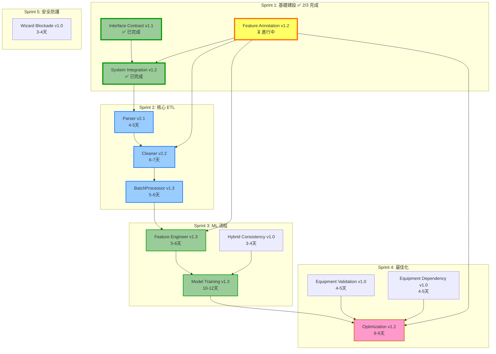

# HVAC-1 專案任務排程文件

**文件版本:** v1.1  
**建立日期:** 2026-02-19  
**最後更新:** 2026-02-19  
**文件狀態:** 🚧 **進行中**（Sprint 1: 基礎建設 2/3 完成）

---

## 一、專案概述

### 1.1 系統目標
HVAC-1 是一個**空調節能系統**，專注於資料清洗與離線能源最佳化建議。系統採用**嚴格契約導向設計 (Contract-First Design)** 與 **SSOT (Single Source of Truth)** 原則。

### 1.2 核心資料流
```
Raw Data → Parser → Cleaner → BatchProcessor → FeatureEngineer → ModelTraining → Optimization
                ↑                                                               ↓
        Feature Annotation (Excel → YAML SSOT)                        Model Registry Index
```

### 1.3 總預估工時
| 階段 | 工時 | 累計 | 狀態 |
|:---:|:---:|:---:|:---:|
| Sprint 1: 基礎建設 | 12-14 天 | 12-14 天 | 🚧 進行中 (2/3) |
| Sprint 2: 核心 ETL | 15-17 天 | 27-31 天 | ⏳ 待開始 |
| Sprint 3: 特徵與模型 | 18-22 天 | 45-53 天 | ⏳ 待開始 |
| Sprint 4: 最佳化 | 10-12 天 | 55-65 天 | ⏳ 待開始 |
| Sprint 5: 整合測試 | 8-10 天 | **63-75 天** | ⏳ 待開始 |

**建議總工期:** 約 12-15 週（含緩衝與測試）

---

## 二、依賴關係圖



---

## 三、Sprint 任務排程

---

### Sprint 1: 基礎建設 (第 1-2 週)
**目標:** 建立系統基礎設施、配置管理、錯誤代碼體系  
**狀態:** 🚧 **進行中** (2/3 完成)  
**關鍵成功因素:** 所有下游模組依賴這些基礎，必須優先完成

#### 1.1 Interface Contract v1.1 (3-4天) ✅ 已完成

**完成日期:** 2026-02-19  
**負責人:** Claude Code  
**測試狀態:** 已通過驗證

| 任務 ID | 任務描述 | 預估工時 | 優先級 | 驗收標準 | 狀態 |
|:---:|:---|:---:|:---:|:---|:---:|
| IC-001 | 錯誤代碼分層定義 (E000-E999) | 0.5天 | 🔴 Critical | `config_models.py` 定義完整錯誤代碼 | ✅ |
| IC-002 | 檢查點規格定義 (#1-#7) | 0.5天 | 🔴 Critical | 7個檢查點規格文件化 | ✅ |
| IC-003 | DataFrame 介面標準 | 0.5天 | 🔴 Critical | timestamp, quality_flags 規格確立 | ✅ |
| IC-004 | 版本相容性矩陣 | 0.5天 | 🟡 Medium | 相容性矩陣表格完成 | ✅ |
| IC-005 | 實作檢查清單 | 0.5天 | 🟡 Medium | 6.1-6.3 檢查清單完成 | ✅ |
| IC-006 | Header Standardization 規範 | 0.5天 | 🟡 Medium | 第10章規格完成 | ✅ |
| IC-007 | Temporal Baseline 傳遞規範 | 0.5天 | 🔴 Critical | 第8章規格完成 | ✅ |

**交付物:**
- ✅ `docs/Interface Contract/PRD_Interface_Contract_v1.1.md`
- ✅ `src/etl/config_models.py` (錯誤代碼常數)

**實作摘要:**
- 定義完整 E000-E999 錯誤代碼體系，涵蓋 7 大類別
- 建立 7 個檢查點規格（#1 Parser→Cleaner 到 #7 Training→Optimization）
- 定義 DataFrame 介面標準（timestamp: UTC/ns, quality_flags: List[str]）
- 建立版本相容性矩陣（5 種版本組合相容性評估）
- 定義 Header Standardization 規則（snake_case 正規化）
- 建立 Temporal Baseline 傳遞規範（E000 時間基準機制）

---

#### 1.2 System Integration v1.2 (6-7天) ✅ 已完成

**完成日期:** 2026-02-19  
**負責人:** Claude Code  
**測試狀態:** 35 項單元測試全部通過

| 任務 ID | 任務描述 | 預估工時 | 優先級 | 驗收標準 | 狀態 |
|:---:|:---|:---:|:---:|:---|:---:|
| SI-001 | PipelineContext 實作 | 1天 | 🔴 Critical | 時間基準單例模式運作 | ✅ |
| SI-002 | ETLConfig 擴充 (含 AnnotationConfig) | 1天 | 🔴 Critical | Pydantic 模型驗證通過 | ✅ |
| SI-003 | ConfigLoader 強化 (E406, 檔案鎖) | 1天 | 🔴 Critical | 同步檢查與鎖機制運作 | ✅ |
| SI-004 | ETLContainer 初始化順序控制 | 2天 | 🔴 Critical | 4步驟初始化順序正確 | ✅ |
| SI-005 | 單元測試與整合測試 | 1.5天 | 🔴 Critical | 初始化順序測試通過 | ✅ |
| SI-006 | 時間基準傳遞測試 | 0.5天 | 🔴 Critical | 跨日/長時間執行測試通過 | ✅ |

**交付物:**
- ✅ `src/context.py` (PipelineContext, 337 行)
- ✅ `src/etl/config_models.py` (完整 SSOT, 1554+ 行)
- ✅ `src/utils/config_loader.py` (ConfigLoader, 485 行)
- ✅ `src/container.py` (ETLContainer, 543 行)
- ✅ `tests/test_container_initialization.py` (35 項測試)

**實作摘要:**

**SI-001 PipelineContext:**
- Thread-safe Singleton 單例模式實作
- 時間基準初始化（禁止重複設定）
- E000 錯誤檢查（時間基準遺失）
- E000-W 時間漂移警告（>60 分鐘）
- 未來資料檢測（容忍 5 分鐘）

**SI-002 ETLConfig:**
- AnnotationConfig Pydantic 模型（含 device_role 驗證）
- SiteFeatureConfig 案場配置（含繼承支援）
- E405 檢查（目標變數不可啟用 Lag）
- E906 版本相容性檢查

**SI-003 ConfigLoader:**
- E406 Excel/YAML 同步檢查（時間戳、Checksum）
- E007 設定檔損毀檢查
- E408 SSOT 品質標記匹配檢查
- 跨平台檔案鎖（FileLock）
- 原子寫入與備份恢復機制

**SI-004 ETLContainer:**
- 4 步驟初始化順序控制（Foundation First Policy）
- 嚴格依賴驗證（步驟 N 需要步驟 N-1）
- 初始化狀態追蹤（InitializationStatus）

**測試覆蓋:**
- 9 項 PipelineContext 測試（單例、E000、漂移警告）
- 6 項 ETLConfig 測試（Pydantic、E405、相容性）
- 7 項 ConfigLoader 測試（E406、E007、檔案鎖）
- 7 項 ETLContainer 測試（4 步驟初始化）
- 6 項時間基準傳遞測試

---

#### 1.3 Feature Annotation v1.2 (6-7天，與 SI 並行) ⏳ 進行中

**預計完成:** 2026-02-26  
**負責人:** 待分配  
**相依任務:** 1.2 System Integration（已完成）

| 任務 ID | 任務描述 | 預估工時 | 優先級 | 驗收標準 | 狀態 |
|:---:|:---|:---:|:---:|:---|:---:|
| FA-001 | Excel 範本結構設計 | 1天 | 🔴 Critical | v1.3 範本含 HVAC 欄位 | ⏳ |
| FA-002 | YAML Schema 定義 | 0.5天 | 🔴 Critical | schema.json 驗證通過 | ⏳ |
| FA-003 | excel_to_yaml.py 轉換器 | 1.5天 | 🔴 Critical | Excel→YAML 單向轉換 | ⏳ |
| FA-004 | FeatureAnnotationManager 實作 | 2天 | 🔴 Critical | 繼承鏈解析與快取 | ⏳ |
| FA-005 | HVAC 設備限制條件定義 | 1天 | 🔴 Critical | equipment_constraints 區段 | ⏳ |
| FA-006 | 同步檢查 (E406) 實作 | 0.5天 | 🔴 Critical | Checksum 驗證 | ✅ |
| FA-007 | Wizard CLI 實作 | 0.5天 | 🟡 Medium | 互動式標註流程 | ⏳ |

**交付物:**
- ⏳ `tools/features/templates/Feature_Template_v1.3.xlsx`
- ⏳ `tools/features/excel_to_yaml.py`
- ⏳ `src/features/annotation_manager.py`
- ⏳ `config/features/schema.json`
- ⏳ `config/features/equipment_taxonomy.yaml`

**風險提醒:**
- ⚠️ **依賴死鎖風險:** FeatureAnnotationManager 必須在 Cleaner 之前完成
- ⚠️ **E406 同步:** Excel/YAML 同步檢查已於 SI-003 完成基礎設施

---

### Sprint 2: 核心 ETL (第 3-5 週)
**目標:** 建立資料攝取、清洗、批次處理流程  
**狀態:** ⏳ **待開始**（相依於 Sprint 1 完成）  
**關鍵成功因素:** 嚴格遵循契約驗證與時間基準傳遞

#### 2.1 Parser v2.1 (4-5天)
| 任務 ID | 任務描述 | 預估工時 | 優先級 | 驗收標準 |
|:---:|:---|:---:|:---:|:---|
| P-001 | 編碼自動偵測 (UTF-8/Big5/UTF-16) | 0.5天 | 🔴 Critical | E101 錯誤處理正確 |
| P-002 | BOM 處理與移除 | 0.5天 | 🔴 Critical | 無 BOM 殘留 |
| P-003 | 智慧標頭搜尋 (500行掃描) | 0.5天 | 🔴 Critical | 中文標頭支援 |
| P-004 | 時區強制轉換 (→ UTC) | 1天 | 🔴 Critical | 輸出必為 UTC (ns) |
| P-005 | 髒資料清洗邏輯 | 0.5天 | 🟡 Medium | 25.3°C → 25.3 |
| P-006 | 輸出契約驗證 | 0.5天 | 🔴 Critical | `_validate_output_contract` |
| P-007 | 案場設定檔繼承 | 0.5天 | 🟡 Medium | site_templates.yaml |
| P-008 | 單元測試 (P21-001~008) | 0.5天 | 🔴 Critical | 8個測試案例通過 |

**交付物:**
- `src/etl/parser.py`
- `config/site_templates.yaml`
- `tests/test_parser_v21.py`

**關鍵驗收:**
- [ ] UTF-8 BOM 檔案無殘留
- [ ] 輸出 `Datetime(time_unit='ns', time_zone='UTC')`
- [ ] 通過 `_validate_output_contract` (E101-E105)

#### 2.2 Cleaner v2.2 (6-7天)
| 任務 ID | 任務描述 | 預估工時 | 優先級 | 驗收標準 |
|:---:|:---|:---:|:---:|:---|
| C-001 | Temporal Context 注入 | 0.5天 | 🔴 Critical | E000 檢查 |
| C-002 | FeatureAnnotationManager 整合 | 1天 | 🔴 Critical | device_role 查詢 |
| C-003 | 時間戳標準化 (UTC強制) | 0.5天 | 🔴 Critical | E101 處理 |
| C-004 | 未來資料檢查 (E102) | 0.5天 | 🔴 Critical | 使用 pipeline_origin_timestamp |
| C-005 | 語意感知清洗 (device_role) | 1天 | 🔴 Critical | 備用設備閾值調整 |
| C-006 | 設備邏輯預檢 (E350) | 1.5天 | 🔴 Critical | 主機開+水泵關檢測 |
| C-007 | 重採樣與缺漏處理 | 0.5天 | 🟡 Medium | 時間軸連續性 |
| C-008 | Metadata 強制淨化 (E500) | 0.5天 | 🔴 Critical | 無 device_role 輸出 |
| C-009 | 設備稽核軌跡產生 | 0.5天 | 🔴 Critical | equipment_validation_audit |
| C-010 | 單元測試 | 0.5天 | 🔴 Critical | E000/E102/E350/E500 測試 |

**交付物:**
- `src/etl/cleaner.py`
- `tests/test_cleaner_v22.py`
- `tests/test_cleaner_equipment_validation.py`

**關鍵驗收:**
- [ ] 未接收 temporal_context 時拋出 E000
- [ ] 輸出絕對不含 device_role (E500)
- [ ] 設備邏輯違規標記為 PHYSICAL_IMPOSSIBLE

#### 2.3 BatchProcessor v1.3 (5-6天)
| 任務 ID | 任務描述 | 預估工時 | 優先級 | 驗收標準 |
|:---:|:---|:---:|:---:|:---|
| BP-001 | Temporal Context 注入 | 0.5天 | 🔴 Critical | E000 檢查 |
| BP-002 | E406 同步驗證強化 | 0.5天 | 🔴 Critical | 詳細恢復指引 |
| BP-003 | 輸入契約驗證 (E500, E351) | 0.5天 | 🔴 Critical | device_role 攔截 |
| BP-004 | Parquet 寫入 (INT64/UTC強制) | 1天 | 🔴 Critical | E206 驗證 |
| BP-005 | Manifest 生成 (v1.3-CA) | 1天 | 🔴 Critical | temporal_baseline, audit_trail |
| BP-006 | 設備稽核軌跡傳遞 | 0.5天 | 🔴 Critical | equipment_validation_audit |
| BP-007 | E408 SSOT 版本檢查 | 0.5天 | 🔴 Critical | quality_flags_schema |
| BP-008 | 事務性輸出 (原子移動) | 0.5天 | 🟡 Medium | staging → output |
| BP-009 | 單元測試 | 0.5天 | 🔴 Critical | E000/E205/E351/E408 測試 |

**交付物:**
- `src/etl/batch_processor.py`
- `src/etl/manifest.py` (Manifest 模型)
- `tests/test_batch_processor_v13.py`

**關鍵驗收:**
- [ ] Manifest 包含 temporal_baseline
- [ ] Manifest 包含 equipment_validation_audit
- [ ] E408 檢查 SSOT 版本一致性

---

### Sprint 3: 特徵工程與模型訓練 (第 6-9 週)
**目標:** 建立特徵工程、模型訓練、集成與驗證  
**狀態:** ⏳ **待開始**  
**關鍵成功因素:** 特徵對齊保證 (E901-E903) 與資源管理

#### 3.1 Feature Engineer v1.3 (5-6天)
| 任務 ID | 任務描述 | 預估工時 | 優先級 | 驗收標準 |
|:---:|:---|:---:|:---:|:---|
| FE-001 | Manifest 讀取與驗證 | 0.5天 | 🔴 Critical | E301/E400 驗證 |
| FE-002 | AnnotationManager 直接查詢 | 0.5天 | 🔴 Critical | device_role 消費 |
| FE-003 | SSOT Flags 處理 (onehot) | 0.5天 | 🔴 Critical | VALID_QUALITY_FLAGS 引用 |
| FE-004 | 語意感知 Group Policy | 1.5天 | 🔴 Critical | 備用設備策略調整 |
| FE-005 | Lag/Rolling 特徵生成 | 1天 | 🔴 Critical | Data Leakage 防護 |
| FE-006 | 特徵縮放與參數輸出 | 0.5天 | 🔴 Critical | scaler_params |
| FE-007 | feature_order_manifest 輸出 | 0.5天 | 🔴 Critical | E601 合規 |
| FE-008 | 單元測試 | 0.5天 | 🔴 Critical | Group Policy 測試 |

**交付物:**
- `src/etl/feature_engineer.py`
- `tests/test_feature_engineer_v13.py`

**關鍵驗收:**
- [ ] 直接查詢 AnnotationManager 取得 device_role
- [ ] 輸出 feature_order_manifest (E601)
- [ ] 輸出 scaler_params (E602)

#### 3.2 Model Training v1.3 (10-12天)
| 任務 ID | 任務描述 | 預估工時 | 優先級 | 驗收標準 |
|:---:|:---|:---:|:---:|:---|
| MT-001 | ResourceManager 實作 | 2天 | 🔴 Critical | 記憶體預估與驗證 |
| MT-002 | ResourceMonitor 實作 | 1天 | 🔴 Critical | OOM 預防、檢查點 |
| MT-003 | Kubernetes 資源配置 | 1天 | 🔴 Critical | K8s YAML 範本 |
| MT-004 | Docker 資源限制 | 0.5天 | 🟡 Medium | Dockerfile 設定 |
| MT-005 | 三種訓練模式實作 | 2天 | 🔴 Critical | System/Component/Hybrid |
| MT-006 | Ensemble 訓練 (XGB/LGB/RF) | 1.5天 | 🔴 Critical | 交叉驗證與集成 |
| MT-007 | Model Registry Index | 1.5天 | 🔴 Critical | 版本控制與特徵對齊 |
| MT-008 | Feature Manifest 輸出 | 0.5天 | 🔴 Critical | E901-E903 合規 |
| MT-009 | Hybrid Consistency 檢查 | 0.5天 | 🔴 Critical | E751-E758 |
| MT-010 | 單元與整合測試 | 1.5天 | 🔴 Critical | 資源管理測試 |

**交付物:**
- `src/training/training_pipeline.py`
- `src/training/resource_manager.py`
- `src/training/model_registry.py`
- `src/training/ensemble_trainer.py`
- `k8s/training-job-template.yaml`
- `tests/test_training_v13.py`

**關鍵驗收:**
- [ ] 記憶體預估公式準確
- [ ] 輸出 Feature Manifest (E901-E903)
- [ ] Hybrid 差異 >15% 時觸發 E810

---

### Sprint 4: 最佳化引擎 (第 10-12 週)
**目標:** 建立能源最佳化引擎與 Fallback 機制  
**狀態:** ⏳ **待開始**  
**關鍵成功因素:** 特徵對齊驗證與三層級降級策略

#### 4.1 Equipment Validation v1.0 (4-5天，與 OPT 並行)
| 任務 ID | 任務描述 | 預估工時 | 優先級 | 驗收標準 |
|:---:|:---|:---:|:---:|:---|
| EV-001 | EquipmentValidator 實作 | 1.5天 | 🔴 Critical | 邏輯限制檢查 |
| EV-002 | Constraint Sync Manager | 1天 | 🔴 Critical | SSOT 雙向同步 |
| EV-003 | E350-E355 錯誤實作 | 1天 | 🔴 Critical | 設備違規檢測 |
| EV-004 | 整合測試 | 0.5天 | 🔴 Critical | Cleaner-OPT 一致性 |

**交付物:**
- `src/equipment/equipment_validator.py`
- `src/equipment/constraint_sync.py`

#### 4.2 Chiller Plant Optimization v1.2 (8-9天)
| 任務 ID | 任務描述 | 預估工時 | 優先級 | 驗收標準 |
|:---:|:---|:---:|:---:|:---|
| OPT-001 | Model Registry 載入 | 1天 | 🔴 Critical | E801/E802 驗證 |
| OPT-002 | Feature Alignment 驗證 | 1.5天 | 🔴 Critical | E901-E904 |
| OPT-003 | Feature Vectorizer 實作 | 1天 | 🔴 Critical | 特徵向量化 |
| OPT-004 | 負載驅動模式實作 | 1天 | 🔴 Critical | RT → 最佳組合 |
| OPT-005 | 效率驅動模式實作 | 1天 | 🔴 Critical | kW/RT → 配置 |
| OPT-006 | Fallback Handler (3層) | 1.5天 | 🔴 Critical | 降級機制 |
| OPT-007 | 暖啟動與資源感知 | 0.5天 | 🟡 Medium | 批次優化加速 |
| OPT-008 | Hybrid Consistency 整合 | 0.5天 | 🔴 Critical | E806/E810 |
| OPT-009 | 單元測試 | 0.5天 | 🔴 Critical | Fallback 測試 |

**交付物:**
- `src/optimization/engine.py`
- `src/optimization/fallback.py`
- `src/optimization/model_interface.py`
- `config/optimization/base.yaml`
- `tests/test_optimization_v12.py`

**關鍵驗收:**
- [ ] E901 特徵順序嚴格比對
- [ ] E904 設備限制一致性驗證
- [ ] 三層級 Fallback 運作正常
- [ ] System vs Component 差異 >15% 時觸發 E810

---

### Sprint 5: 安全防護與整合測試 (第 13-15 週)
**目標:** 建立技術阻擋機制與端到端測試  
**狀態:** ⏳ **待開始**

#### 5.1 Wizard Technical Blockade v1.0 (3-4天)
| 任務 ID | 任務描述 | 預估工時 | 優先級 | 驗收標準 |
|:---:|:---|:---:|:---:|:---|
| WTB-001 | Import Guard 實作 | 1天 | 🔴 Critical | E501 攔截 |
| WTB-002 | 檔案系統保護 (444, chattr) | 0.5天 | 🔴 Critical | YAML 唯讀 |
| WTB-003 | CI/CD Hook 實作 | 1天 | 🔴 Critical | Pre-commit 驗證 |
| WTB-004 | yaml_to_excel 災難恢復 | 0.5天 | 🟡 Medium | Recovery 模式 |
| WTB-005 | 測試 | 0.5天 | 🔴 Critical | 三層防護測試 |

**交付物:**
- `src/features/yaml_write_guard.py`
- `tools/features/yaml_to_excel.py`
- `.github/workflows/annotation-validation.yml`

#### 5.2 端到端整合測試 (5-6天)
| 任務 ID | 任務描述 | 預估工時 | 優先級 | 驗收標準 |
|:---:|:---|:---:|:---:|:---|
| INT-001 | Parser → Cleaner → BP → FE 流程 | 1天 | 🔴 Critical | 檢查點 #1-#3 |
| INT-002 | FE → Training → OPT 流程 | 1天 | 🔴 Critical | 檢查點 #4-#7 |
| INT-003 | 時間基準傳遞測試 | 0.5天 | 🔴 Critical | E000 一致性 |
| INT-004 | 設備邏輯同步測試 | 0.5天 | 🔴 Critical | E350-E352 |
| INT-005 | 特徵對齊壓力測試 | 0.5天 | 🔴 Critical | E901 錯誤順序 |
| INT-006 | 長時間執行測試 | 0.5天 | 🔴 Critical | 時間漂移檢測 |
| INT-007 | 效能基準測試 | 1天 | 🟡 Medium | 10萬筆 < 5秒 |
| INT-008 | 錯誤恢復測試 | 0.5天 | 🔴 Critical | Fallback 運作 |

**交付物:**
- `tests/integration/test_full_pipeline.py`
- `tests/integration/test_temporal_baseline.py`
- `tests/integration/test_equipment_validation_sync.py`
- `tests/integration/test_feature_alignment.py`

---

## 四、風險管理矩陣

| 風險 ID | 風險描述 | 嚴重度 | 可能性 | 緩解措施 | 負責 Sprint | 狀態 |
|:---:|:---|:---:|:---:|:---|:---:|:---:|
| R-001 | 依賴死鎖 (AnnotationManager 未完成即開發 Cleaner) | 🔴 High | High | Foundation First Policy 強制順序 | Sprint 1 | 🟡 監控中 |
| R-002 | 時間漂移 (使用 now() 而非基準) | 🔴 High | Medium | E000 強制檢查 | Sprint 1-2 | 🟢 已緩解 |
| R-003 | 特徵對齊錯誤 (Training-OPT 特徵順序不一致) | 🔴 High | Medium | E901-E903 嚴格驗證 | Sprint 3-4 | ⏳ 待開始 |
| R-004 | 設備邏輯脫鉤 (Cleaner-OPT 不一致) | 🔴 High | Medium | 共用 SSOT 限制條件 | Sprint 2,4 | ⏳ 待開始 |
| R-005 | SSOT 版本漂移 | 🔴 High | Medium | E408 檢查 | Sprint 2 | 🟢 已緩解 |
| R-006 | OOM 記憶體不足 | 🔴 High | Medium | ResourceManager 預估 | Sprint 3 | ⏳ 待開始 |
| R-007 | Excel-YAML 不同步 | 🟡 Medium | Medium | E406 嚴格檢查 | Sprint 1 | 🟢 已緩解 |
| R-008 | device_role 洩漏 | 🔴 High | Medium | E500 三層防護 | Sprint 2 | 🟢 已緩解 |

---

## 五、里程碑與檢查點

| 里程碑 | 預計日期 | 實際日期 | 關鍵交付物 | 驗收標準 | 狀態 |
|:---:|:---:|:---:|:---|:---|:---:|
| M1: 基礎就緒 | 第 2 週末 | 2026-02-19 | Interface Contract, SI, FA | 所有下游模組可依賴運作 | 🚧 2/3 完成 |
| M2: ETL 就緒 | 第 5 週末 | - | Parser, Cleaner, BP | 檢查點 #1-#3 通過 | ⏳ 待開始 |
| M3: ML 就緒 | 第 9 週末 | - | FE, Training, Hybrid | 檢查點 #4-#7 通過 | ⏳ 待開始 |
| M4: 最佳化就緒 | 第 12 週末 | - | Optimization, Fallback | E901-E904 驗證通過 | ⏳ 待開始 |
| M5: 系統上線 | 第 15 週末 | - | 完整整合測試 | E2E 測試通過 | ⏳ 待開始 |

---

## 六、完成記錄

### 2026-02-19: Sprint 1 里程碑 - Interface Contract & System Integration 完成

**完成項目:**
1. ✅ **Interface Contract v1.1**: 完整定義 E000-E999 錯誤代碼體系、7 個檢查點規格
2. ✅ **System Integration v1.2**: 實作 PipelineContext、ETLConfig、ConfigLoader、ETLContainer

**測試結果:**
- 35 項單元測試全部通過
- 涵蓋 E000、E000-W、E007、E405、E406、E408、E906 錯誤代碼

**新增檔案:**
- `src/context.py` (337 行)
- `src/container.py` (543 行)
- `src/utils/config_loader.py` (485 行)
- `src/etl/config_models.py` (1554+ 行，含 Pydantic 模型)
- `tests/test_container_initialization.py` (712 行，35 項測試)

**下一步:**
- 完成 1.3 Feature Annotation v1.2
- 啟動 Sprint 2: 核心 ETL

---

## 七、資源需求

| 角色 | 人數 | 參與 Sprint | 主要負責 |
|:---|:---:|:---:|:---|
| 資深後端工程師 | 1 | 1-5 | System Integration, ETL Pipeline |
| ML 工程師 | 1 | 3-4 | Model Training, Optimization |
| 資料工程師 | 1 | 2-3 | Parser, Cleaner, Feature Engineering |
| DevOps 工程師 | 0.5 | 3 | Kubernetes, Docker, CI/CD |
| HVAC 領域專家 | 0.5 | 1,4 | Feature Annotation, Optimization Config |

---

## 八、附錄

### 8.1 PRD 文件清單

| 序號 | 文件名稱 | 版本 | 預估工時 | 所屬 Sprint | 狀態 |
|:---:|:---|:---:|:---:|:---:|:---:|
| 1 | PRD_Interface_Contract_v1.1.md | v1.1 | 3-4天 | Sprint 1 | ✅ 已完成 |
| 2 | PRD_System_Integration_v1.2.md | v1.2 | 6-7天 | Sprint 1 | ✅ 已完成 |
| 3 | PRD_Feature_Annotation_Specification_V1.3.md | v1.3 | 6-7天 | Sprint 1 | ⏳ 進行中 |
| 4 | PRD_Parser_V2.1.md | v2.1 | 4-5天 | Sprint 2 | ⏳ 待開始 |
| 5 | PRD_CLEANER_v2.2.md | v2.2 | 6-7天 | Sprint 2 | ⏳ 待開始 |
| 6 | PRD_BATCH_PROCESSOR_v1.3.md | v1.3 | 5-6天 | Sprint 2 | ⏳ 待開始 |
| 7 | PRD_FEATURE_ENGINEER_V1.3.md | v1.3 | 5-6天 | Sprint 3 | ⏳ 待開始 |
| 8 | PRD_Model_Training_v1.3.md | v1.3 | 10-12天 | Sprint 3 | ⏳ 待開始 |
| 9 | PRD_Hybrid_Model_Consistency_v1.0.md | v1.0 | 3-4天 | Sprint 3 | ⏳ 待開始 |
| 10 | PRD_Chiller_Plant_Optimization_V1.2.md | v1.2 | 8-9天 | Sprint 4 | ⏳ 待開始 |
| 11 | PRD_Equipment_Dependency_Validation_v1.0.md | v1.0 | 4-5天 | Sprint 4 | ⏳ 待開始 |
| 12 | PRD_Wizard_Technical_Blockade_V1.0.md | v1.0 | 3-4天 | Sprint 5 | ⏳ 待開始 |
| | **總計** | | **63-75 天** | | **2/12 完成** |

### 8.2 相關文件

- [📋 Sprint 1 執行摘要](./Sprint_1_執行摘要.md) - Interface Contract & System Integration 詳細摘要

---

**文件結束**

*最後更新: 2026-02-19 | 文件狀態: 🚧 Sprint 1 進行中 (2/3 完成)*
